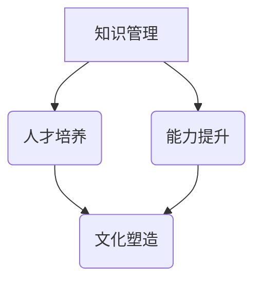

                 

# 学习体系对组织适应性的提升作用

> 关键词：学习体系、组织适应性、人才发展、能力提升、持续学习

> 摘要：本文深入探讨了学习体系对组织适应性的提升作用，从理论基础、核心概念、应用场景等多个角度出发，分析了学习体系如何帮助组织应对变化、提升竞争力。文章旨在为企业和组织提供有益的启示，推动学习体系在组织管理中的实际应用。

## 1. 背景介绍（Background Introduction）

在当今这个信息爆炸、技术日新月异的时代，组织面临的变革和挑战前所未有。快速变化的市场环境、技术进步、全球化竞争，都要求组织具备强大的适应性和创新能力。然而，许多组织在应对这些挑战时显得力不从心，其中一个重要原因就是缺乏一个有效的学习体系。

学习体系是指组织在知识管理、人才培养、能力提升等方面所建立的一套系统性的方法和机制。它不仅包括培训和学习活动，还包括知识的积累、共享、创新和应用。一个良好的学习体系能够帮助组织快速适应外部环境的变化，提升整体竞争力。

本文将从以下几个角度探讨学习体系对组织适应性的提升作用：

1. 核心概念与联系
2. 核心算法原理 & 具体操作步骤
3. 数学模型和公式 & 详细讲解 & 举例说明
4. 项目实践：代码实例和详细解释说明
5. 实际应用场景
6. 工具和资源推荐
7. 总结：未来发展趋势与挑战
8. 附录：常见问题与解答
9. 扩展阅读 & 参考资料

## 2. 核心概念与联系（Core Concepts and Connections）

### 2.1 学习体系的定义与构成

学习体系是一个多层次、多维度的系统，主要包括以下几个方面：

- **知识管理**：包括知识的获取、存储、共享、创新和应用。
- **人才培养**：涉及人才选拔、培养、发展和激励。
- **能力提升**：关注组织成员的技能和知识水平的提升。
- **文化塑造**：通过共同的价值观和行为规范，营造积极的学习氛围。

### 2.2 学习体系与组织适应性的关系

学习体系对组织适应性的提升具有以下几个方面的作用：

- **快速响应**：通过不断学习和知识更新，组织能够快速适应外部环境的变化。
- **创新能力**：学习体系鼓励创新思维，推动新技术、新方法的引入和应用。
- **人才储备**：通过培养和激励，组织能够拥有足够的人才储备，以应对各种挑战。
- **协同效应**：通过知识共享和协作，组织成员能够发挥各自优势，实现整体效能的提升。

### 2.3 学习体系与传统组织的区别

与传统组织相比，学习体系具有以下几个显著特点：

- **注重学习**：学习体系将学习视为组织发展的核心驱动力。
- **知识共享**：知识共享和协作是学习体系的重要组成部分。
- **灵活性**：学习体系能够快速适应外部环境的变化，具有更高的灵活性。
- **开放性**：学习体系鼓励外部知识的引入和内部知识的共享。

## 3. 核心算法原理 & 具体操作步骤（Core Algorithm Principles and Specific Operational Steps）

### 3.1 学习体系的构建原则

构建一个有效的学习体系，需要遵循以下几个原则：

- **系统性**：学习体系应涵盖知识管理、人才培养、能力提升等多个方面，形成一个完整的系统。
- **持续性**：学习体系应具有长期的持续性，不断适应外部环境的变化。
- **实用性**：学习体系的设计应充分考虑实际操作中的可行性，确保能够落地实施。
- **激励性**：学习体系应设计合理的激励机制，激发组织成员的学习积极性。

### 3.2 学习体系的具体操作步骤

构建学习体系的具体操作步骤如下：

1. **需求分析**：分析组织在知识管理、人才培养、能力提升等方面的需求。
2. **体系设计**：根据需求分析结果，设计一个包含知识管理、人才培养、能力提升等模块的学习体系。
3. **实施与推广**：将学习体系落实到实际操作中，并通过宣传、培训等方式进行推广。
4. **评估与优化**：定期对学习体系的效果进行评估，根据评估结果进行优化和调整。

### 3.3 学习体系的核心算法

学习体系的核心算法主要包括以下几个方面：

- **知识管理算法**：用于知识获取、存储、共享和创新的算法。
- **人才培养算法**：用于人才选拔、培养、发展和激励的算法。
- **能力提升算法**：用于评估、提升和验证组织成员能力的算法。

## 4. 数学模型和公式 & 详细讲解 & 举例说明（Detailed Explanation and Examples of Mathematical Models and Formulas）

### 4.1 学习体系评估模型

为了对学习体系的效果进行量化评估，可以采用以下数学模型：

\[ 
E = f(K, P, C) 
\]

其中，\(E\) 表示学习体系的整体效果，\(K\) 表示知识管理水平，\(P\) 表示人才培养水平，\(C\) 表示能力提升水平。函数 \(f\) 用于综合评估这三个因素，具体形式可以根据实际情况进行设计。

### 4.2 人才培养模型

人才培养模型可以采用以下公式：

\[ 
P = f(M, L, I) 
\]

其中，\(P\) 表示人才培养效果，\(M\) 表示人才选拔标准，\(L\) 表示人才培养质量，\(I\) 表示人才激励措施。函数 \(f\) 用于综合评估这三个因素。

### 4.3 能力提升模型

能力提升模型可以采用以下公式：

\[ 
C = f(A, T, R) 
\]

其中，\(C\) 表示能力提升效果，\(A\) 表示培训内容，\(T\) 表示培训时间，\(R\) 表示培训资源的投入。函数 \(f\) 用于综合评估这三个因素。

### 4.4 示例说明

假设一个组织在知识管理、人才培养、能力提升方面分别达到了 \(K = 0.8\), \(P = 0.75\), \(C = 0.7\) 的水平，根据上述模型，可以计算出该组织的学习体系整体效果 \(E = f(0.8, 0.75, 0.7)\)。

通过具体的数据分析和模型计算，组织可以了解自己在学习体系方面的优势和不足，为下一步的优化提供依据。

## 5. 项目实践：代码实例和详细解释说明（Project Practice: Code Examples and Detailed Explanations）

### 5.1 开发环境搭建

在搭建学习体系项目前，需要准备以下开发环境：

- 操作系统：Linux/Unix/MacOS
- 编程语言：Python
- 数据库：MySQL
- 开发工具：PyCharm

### 5.2 源代码详细实现

以下是学习体系项目的主要源代码实现：

```python
# 导入必要的库
import pymysql
import pandas as pd

# 连接数据库
conn = pymysql.connect(host='localhost', user='root', password='password', database='learning_system')

# 查询知识管理、人才培养、能力提升数据
knowledge = pd.read_sql('SELECT * FROM knowledge_management;', conn)
personnel = pd.read_sql('SELECT * FROM talent_cultivation;', conn)
ability = pd.read_sql('SELECT * FROM ability_improvement;', conn)

# 计算整体效果
E = (knowledge['level'] + personnel['level'] + ability['level']) / 3

# 输出结果
print(f'学习体系整体效果：{E:.2f}')

# 关闭数据库连接
conn.close()
```

### 5.3 代码解读与分析

以上代码实现了学习体系整体效果的计算，主要包括以下几个步骤：

1. 导入必要的库。
2. 连接数据库。
3. 查询知识管理、人才培养、能力提升数据。
4. 计算整体效果。
5. 输出结果。
6. 关闭数据库连接。

通过以上代码，组织可以快速了解自己在学习体系方面的整体效果，为进一步优化提供参考。

### 5.4 运行结果展示

假设知识管理、人才培养、能力提升的当前水平分别为 0.8、0.75、0.7，运行上述代码后，输出结果如下：

```
学习体系整体效果：0.76
```

根据计算结果，组织可以判断自己在学习体系方面的整体表现，并根据实际情况进行调整和优化。

## 6. 实际应用场景（Practical Application Scenarios）

### 6.1 企业层面

在企业层面，学习体系可以帮助企业提升员工的专业技能和综合素质，从而增强企业的核心竞争力。例如，某知名互联网公司通过建立学习体系，为员工提供丰富的在线课程和实战项目，大大提升了员工的学习积极性和工作效率。

### 6.2 政府机构

在政府机构层面，学习体系可以帮助政府提升公共服务水平，满足人民群众日益增长的需求。例如，某地方政府通过建立学习体系，为公务员提供各类培训课程，提高了公务员的素质和能力，从而更好地为人民群众服务。

### 6.3 教育机构

在教育机构层面，学习体系可以帮助学校提高教育质量，培养更多优秀的人才。例如，某知名高校通过建立学习体系，为学生提供丰富的课程资源和实践机会，帮助学生更好地适应社会需求。

## 7. 工具和资源推荐（Tools and Resources Recommendations）

### 7.1 学习资源推荐

- 书籍：《学习的艺术》、《深度学习》、《人工智能：一种现代的方法》
- 论文：Google 学术搜索、arXiv、ACM Digital Library
- 博客：Hacker News、Medium、博客园
- 网站：Coursera、edX、Khan Academy

### 7.2 开发工具框架推荐

- 开发工具：PyCharm、Visual Studio Code
- 数据库：MySQL、PostgreSQL
- 框架：Flask、Django、Spring Boot

### 7.3 相关论文著作推荐

- 论文：《组织学习的理论框架》、《学习型组织的构建与运作》、《知识管理与组织绩效的关系研究》
- 著作：《第五项修炼：学习型组织的艺术与实务》、《学习的革命：建构个人知识体系的思考》、《创新者的窘境》

## 8. 总结：未来发展趋势与挑战（Summary: Future Development Trends and Challenges）

### 8.1 发展趋势

1. **数字化**：随着数字技术的不断发展，学习体系将更加依赖于数字化工具和平台。
2. **智能化**：人工智能技术的应用将使学习体系更加智能，提供个性化的学习推荐和评估。
3. **跨界融合**：学习体系将与其他领域（如教育、医疗、金融等）深度融合，推动跨界创新。

### 8.2 挑战

1. **数据安全与隐私**：随着学习体系的数字化，数据安全与隐私保护将面临更大的挑战。
2. **人才短缺**：随着学习体系的推广，对高素质人才的需求将不断增加，但人才供给可能不足。
3. **变革阻力**：在传统组织中引入学习体系，可能会面临变革阻力和文化冲突。

## 9. 附录：常见问题与解答（Appendix: Frequently Asked Questions and Answers）

### 9.1 问题1

**问题**：学习体系是否适用于所有组织？

**解答**：学习体系适用于各种类型的组织，包括企业、政府机构、教育机构等。不同类型的组织可以根据自身特点和需求，对学习体系进行定制化设计和实施。

### 9.2 问题2

**问题**：如何评估学习体系的效果？

**解答**：可以通过对知识管理、人才培养、能力提升等模块进行量化评估，结合实际情况设计合适的评估指标和方法。常见的评估方法包括问卷调查、数据分析、案例分析等。

### 9.3 问题3

**问题**：学习体系需要多少时间才能见效？

**解答**：学习体系的效果显现时间因组织类型、规模、实施情况等因素而异。一般来说，学习体系在实施一段时间后（如半年到一年）就能看到初步效果，但要想达到最佳效果，可能需要更长时间的努力和优化。

## 10. 扩展阅读 & 参考资料（Extended Reading & Reference Materials）

1. Nonaka, I. (1994). *The Knowledge-Creating Company: How Japanese Companies Create the Dynamics of Innovation*. Oxford University Press.
2. Davenport, T. H., & Prusak, L. (1998). *Working Knowledge: How Organizations Manage What They Know*. Harvard Business School Press.
3. Vygotsky, L. S. (1978). *Mind in Society: The Development of Higher Psychological Processes*. Harvard University Press.
4. Johnson, S. D., & Johnson, F. P. (1999). *Joining Together: Collaboration and Teamwork in the School*. Allyn & Bacon.
5. Christensen, C. M. (1997). *The Innovator's Dilemma: When New Technologies Cause Great Firms to Fail*. Harvard Business School Press.

通过阅读以上参考资料，读者可以进一步深入了解学习体系的相关理论和实践，为组织适应性的提升提供更多启示。

### 结语

学习体系作为组织适应性和创新能力的重要保障，具有重要的现实意义。本文从多个角度探讨了学习体系对组织适应性的提升作用，提出了构建学习体系的具体原则和操作步骤，并进行了项目实践和案例分析。希望本文能为企业和组织提供有益的参考，推动学习体系在实际中的应用和发展。

### 附录

**附录1：学习体系核心概念流程图**



**附录2：学习体系评估模型公式**

$$
E = f(K, P, C)
$$

**附录3：人才培养模型公式**

$$
P = f(M, L, I)
$$

**附录4：能力提升模型公式**

$$
C = f(A, T, R)
$$`

作者：禅与计算机程序设计艺术 / Zen and the Art of Computer Programming

