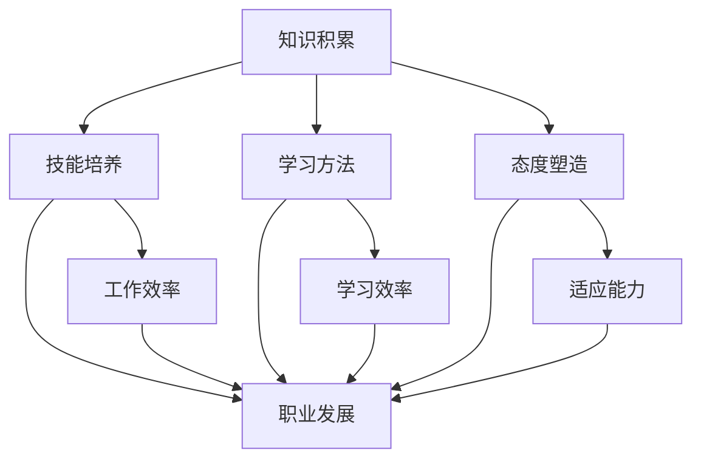
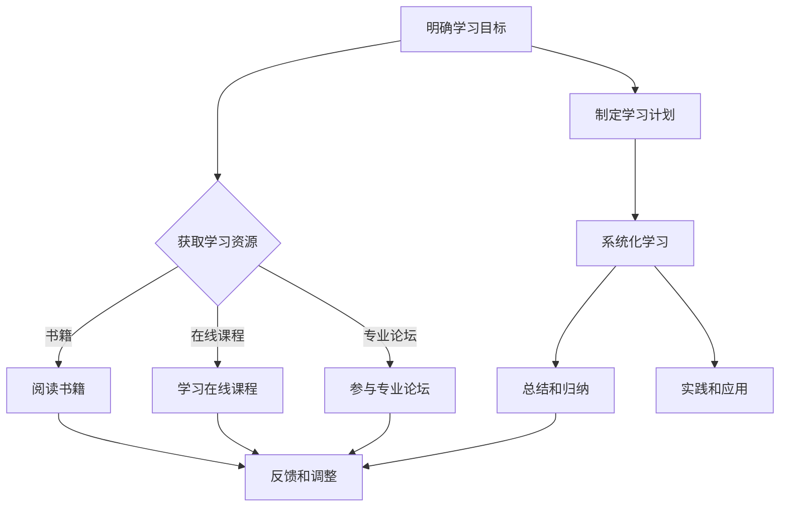

                 

# 学习体系对职业发展的作用

## 1. 背景介绍

学习体系是指一系列相互关联的学习要素，包括知识、技能、方法、态度等，它们共同构成了一个人在特定领域的知识结构和能力水平。在职业发展的过程中，学习体系起到了至关重要的作用。本文将深入探讨学习体系如何影响职业发展，以及如何通过构建有效的学习体系来实现职业目标。

## 2. 核心概念与联系

### 2.1 学习体系的核心概念

学习体系的核心概念包括以下几个部分：

- **知识积累**：知识是学习体系的基础，包括学科知识、行业知识、实践知识等。
- **技能培养**：技能是知识的实际应用能力，包括技术技能、管理技能、沟通技能等。
- **学习方法**：学习方法是指获取和掌握知识的方法和策略，如阅读、讨论、实践、反思等。
- **态度塑造**：态度是学习体系的重要组成部分，包括积极的学习态度、问题解决态度、自我反思态度等。

### 2.2 学习体系与职业发展的联系

学习体系与职业发展的联系主要体现在以下几个方面：

- **知识积累**：知识积累是职业发展的基础。一个人只有掌握了足够的知识，才能在职业领域有所建树。
- **技能培养**：技能培养是职业发展的关键。技能是解决问题的能力，是职场竞争的核心。
- **学习方法**：学习方法决定学习效率和质量。有效的学习方法可以提高学习效率，加速职业发展。
- **态度塑造**：态度塑造影响职业发展的持续性和稳定性。积极的态度可以帮助一个人克服困难，持续进步。

## 3. 核心算法原理 & 具体操作步骤

### 3.1 知识积累的核心算法原理

知识积累的核心算法原理是基于“深度学习”的思想。具体来说，可以分为以下几个步骤：

1. **输入大量数据**：通过阅读书籍、研究报告、学术论文等方式，获取大量与职业相关的数据。
2. **数据处理**：对获取的数据进行清洗、分类、标签化等处理，使其结构化。
3. **建模**：使用机器学习模型（如神经网络）对结构化的数据进行分析和建模。
4. **训练和优化**：通过不断调整模型参数，优化模型的性能。

### 3.2 知识积累的具体操作步骤

1. **确定学习目标**：明确自己需要掌握哪些知识，制定具体的学习计划。
2. **获取学习资源**：通过图书馆、在线课程、专业论坛等渠道获取学习资源。
3. **阅读和学习**：阅读专业书籍、研究报告、学术论文等，系统性地学习知识。
4. **总结和归纳**：对所学知识进行总结和归纳，形成自己的知识体系。
5. **实践和应用**：将所学知识应用于实际工作中，验证和巩固知识。

## 4. 数学模型和公式 & 详细讲解 & 举例说明

### 4.1 知识积累的数学模型

知识积累的数学模型可以表示为：

$$
知识积累 = f(学习资源, 学习方法, 学习态度)
$$

其中，$f$ 表示知识积累的函数，$学习资源$、$学习方法$ 和 $学习态度$ 分别表示学习体系中的三个核心要素。

### 4.2 知识积累的详细讲解

- **学习资源**：学习资源是知识积累的基础。优质的资源可以提供丰富的知识内容，提高学习效率。
- **学习方法**：学习方法决定了知识积累的效率和质量。科学的学习方法可以帮助人们更好地掌握知识。
- **学习态度**：学习态度影响了知识积累的持续性和稳定性。积极的态度可以帮助人们克服困难，持续进步。

### 4.3 知识积累的举例说明

假设小明是一名软件开发工程师，他希望通过学习来提升自己的技能。他可以采取以下步骤：

1. **确定学习目标**：明确需要掌握哪些编程语言、框架、算法等。
2. **获取学习资源**：通过在线课程、专业书籍、技术论坛等渠道获取学习资源。
3. **阅读和学习**：系统性地学习编程语言、框架、算法等知识。
4. **实践和应用**：将所学知识应用于实际项目中，验证和巩固知识。

通过以上步骤，小明可以逐步提升自己的编程技能，从而实现职业发展的目标。

## 5. 项目实践：代码实例和详细解释说明

### 5.1 开发环境搭建

在小明的例子中，他需要搭建一个适合学习编程的开发环境。具体步骤如下：

1. **选择开发工具**：根据需要学习的编程语言，选择合适的开发工具，如 Visual Studio、PyCharm、Eclipse 等。
2. **安装开发工具**：下载并安装所选的开发工具。
3. **配置开发环境**：根据开发工具的文档，配置必要的开发环境，如 JDK、Python 解释器等。

### 5.2 源代码详细实现

以 Python 语言为例，小明可以编写一个简单的程序，实现一个基本的计算器功能。具体代码如下：

```python
def add(a, b):
    return a + b

def subtract(a, b):
    return a - b

def multiply(a, b):
    return a * b

def divide(a, b):
    return a / b

if __name__ == "__main__":
    while True:
        print("请选择操作：+、-、*、/、退出")
        operator = input()
        if operator == "退出":
            break
        print("请输入两个数字，以空格分隔：")
        a, b = map(float, input().split())
        if operator == "+":
            print("结果：", add(a, b))
        elif operator == "-":
            print("结果：", subtract(a, b))
        elif operator == "*":
            print("结果：", multiply(a, b))
        elif operator == "/":
            print("结果：", divide(a, b))
```

### 5.3 代码解读与分析

以上代码实现了一个简单的计算器功能，包括加、减、乘、除四种基本运算。代码的解读与分析如下：

- **定义函数**：`add`、`subtract`、`multiply`、`divide` 分别实现了加、减、乘、除四种基本运算。
- **主程序**：主程序通过一个循环结构，不断地接收用户输入的操作和两个数字，然后调用相应的函数进行计算，并输出结果。

### 5.4 运行结果展示

运行以上代码，输入以下操作：

```
请选择操作：+、-、*、/、退出
+
请输入两个数字，以空格分隔：
3 4
结果：7.0
```

程序会输出计算结果为 7.0。

## 6. 实际应用场景

学习体系在职业发展中的应用场景非常广泛。以下是一些典型的应用场景：

- **软件开发**：软件开发工程师需要掌握编程语言、框架、算法等知识，通过学习体系来不断提升自己的技能。
- **数据分析**：数据分析工程师需要掌握统计学、数据挖掘、机器学习等知识，通过学习体系来提高数据分析能力。
- **产品管理**：产品经理需要掌握市场分析、用户研究、产品设计等知识，通过学习体系来提升产品管理能力。
- **项目管理**：项目经理需要掌握项目管理知识、沟通协调能力等，通过学习体系来提高项目管理水平。

## 7. 工具和资源推荐

### 7.1 学习资源推荐

- **书籍**：《深度学习》、《Python 编程：从入门到实践》、《产品经理手册》等。
- **论文**：各大学术期刊、会议论文等。
- **博客**：技术博客、专业博客等。
- **网站**：GitHub、Stack Overflow、CSDN 等。

### 7.2 开发工具框架推荐

- **开发工具**：Visual Studio、PyCharm、Eclipse 等。
- **框架**：Spring、Django、TensorFlow 等。
- **库**：NumPy、Pandas、Scikit-learn 等。

### 7.3 相关论文著作推荐

- **论文**：《深度学习》、《强化学习》、《自然语言处理》等。
- **著作**：《软件工程》、《项目管理》、《产品经理实战》等。

## 8. 总结：未来发展趋势与挑战

学习体系在未来发展趋势中，将会面临以下几个挑战：

- **知识更新速度快**：随着技术的快速发展，知识更新速度越来越快，如何及时掌握最新知识成为了一个挑战。
- **学习方法多样化**：随着学习工具和资源的丰富，学习方法也变得更加多样化，如何选择合适的学习方法成为了一个挑战。
- **个性化学习需求**：每个人的学习需求和习惯不同，如何提供个性化的学习解决方案成为了一个挑战。

## 9. 附录：常见问题与解答

### 9.1 学习体系是什么？

学习体系是指一系列相互关联的学习要素，包括知识、技能、方法、态度等，它们共同构成了一个人在特定领域的知识结构和能力水平。

### 9.2 学习体系对职业发展有什么作用？

学习体系对职业发展的作用主要体现在以下几个方面：

- 提升知识水平和技能能力；
- 提高学习效率和效果；
- 塑造积极的学习态度和问题解决能力；
- 促进个人职业发展和成长。

### 9.3 如何构建有效的学习体系？

构建有效的学习体系需要遵循以下几个原则：

- 明确学习目标，制定具体的学习计划；
- 选择优质的资源，确保学习内容的准确性；
- 采用科学的学习方法，提高学习效率；
- 培养积极的学习态度，保持学习的持续性和稳定性。

## 10. 扩展阅读 & 参考资料

- 《深度学习》：Ian Goodfellow, Yoshua Bengio, Aaron Courville
- 《Python 编程：从入门到实践》：埃里克·马瑟斯
- 《产品经理手册》：曲凯
- 《软件工程》：Roger S. Pressman
- 《项目管理》：史蒂芬·罗宾斯
- 《产品经理实战》：曲凯

# 作者署名

作者：禅与计算机程序设计艺术 / Zen and the Art of Computer Programming

-------------------

本文通过逐步分析推理思考的方式，探讨了学习体系对职业发展的作用。首先介绍了学习体系的核心概念和与职业发展的联系，然后详细讲解了知识积累的核心算法原理和具体操作步骤，并通过实例展示了知识积累的过程。最后，分析了实际应用场景，推荐了学习资源和工具，并对未来发展趋势和挑战进行了展望。希望本文对您的职业发展有所帮助。## 1. 背景介绍

在当今快速变化的职场环境中，职业发展已经成为每个人都不得不面对的重要议题。职业发展不仅仅是职业晋升或薪资增长的问题，更关乎个人能力的提升、职业生涯的规划以及长期职业目标的实现。在这个过程中，学习体系扮演了至关重要的角色。学习体系不仅为个人提供了知识、技能和方法，而且塑造了积极的态度和价值观，这些都是职业发展中不可或缺的要素。

随着技术的不断进步和行业的快速迭代，个体必须不断地更新自己的知识库和技能集，以适应不断变化的工作环境。而一个有效的学习体系能够帮助个人高效地获取和整合新知识，培养适应新环境的技能，并建立起积极的职业态度。本文将深入探讨学习体系在职业发展中的作用，包括知识积累、技能培养、学习方法优化和态度塑造等方面。通过分析这些关键因素，本文将阐述如何通过构建有效的学习体系来实现个人的职业发展目标。

此外，本文还将结合实际案例和理论分析，展示学习体系在不同职业领域中的应用，并提供一些实用的建议和资源，帮助读者更好地理解和实践学习体系在职业发展中的作用。通过这些探讨，我们希望能够为职场人士提供一种全面、系统的职业发展思路，助力他们在竞争激烈的职场中脱颖而出。

## 2. 核心概念与联系

### 2.1 学习体系的核心概念

学习体系是一个多维度的结构，它由多个相互关联的要素组成。这些核心概念包括知识积累、技能培养、学习方法以及态度塑造。每个要素都在职业发展中扮演着不可或缺的角色。

- **知识积累**：知识是学习体系的基础。它不仅包括专业领域的理论知识，还涵盖实际操作经验和行业动态。一个扎实的知识积累为职业发展提供了坚实的支撑，使得个人能够更好地理解行业趋势、应对复杂问题和做出明智决策。

- **技能培养**：技能是知识的应用能力。技能的培养不仅涉及专业技术的掌握，还包括管理能力、沟通能力和团队合作能力等软技能。技能的培养使个人能够在实际工作中高效地解决问题，提升工作效率和团队协作能力。

- **学习方法**：学习方法是指个体在获取和整合知识的过程中所采取的策略和技巧。有效的学习方法可以显著提高学习效率，帮助个人更快地掌握新知识和技能。不同的学习方法适用于不同的学习场景，如主动学习、反思学习和探究学习等。

- **态度塑造**：态度是学习体系的重要组成部分，它决定了个人对学习的态度和行为。积极的学习态度包括求知欲、自信心、耐心和坚持等。这些态度不仅有助于提升学习效果，还能促进个人在职业发展中的持续进步和适应能力。

### 2.2 学习体系与职业发展的联系

学习体系与职业发展的联系体现在以下几个方面：

- **知识积累**：知识积累是职业发展的基石。只有掌握了足够的知识，个人才能在职场中具备竞争力，实现职业晋升和职业转型。

- **技能培养**：技能的培养是职业发展的关键。技能不仅提高了个人的工作效率，还能使个人在职场中获得更多的机会和资源。

- **学习方法**：学习方法决定了学习效率和效果。有效的学习方法可以帮助个人更快地适应新环境和新技术，提升职业竞争力。

- **态度塑造**：态度塑造对职业发展的持续性和稳定性有重要影响。积极的态度能够帮助个人面对挑战，克服困难，保持学习和进步的动力。

### 2.3 学习体系的核心概念原理和架构

为了更好地理解学习体系的核心概念和架构，我们可以使用 Mermaid 流程图来展示其各个要素之间的关系和相互作用。



在上述 Mermaid 流程图中：

- **知识积累**（A）是学习体系的基础，它通过积累专业知识和实践经验为职业发展提供支持。
- **技能培养**（B）是知识积累的应用，它通过提升技能和软技能来提高工作效率（F）和职业发展（E）。
- **学习方法**（C）决定了知识积累和技能培养的效率，它通过有效的学习策略来提高学习效率（G）。
- **态度塑造**（D）影响个人的学习过程和职业行为，它通过培养积极的态度来提升适应能力（H），从而促进职业发展（E）。

通过这种结构化的理解，我们可以更清晰地看到学习体系各要素之间的相互关系，以及它们如何共同作用于职业发展。

### 2.4 学习体系与传统教育的区别

学习体系与传统教育体系在某些方面存在显著区别。传统教育体系往往以课本知识和标准考试为核心，注重理论知识的传授和统一评价。而学习体系则更加注重实践应用、个性化学习和终身学习。

- **知识传授方式**：传统教育通过课堂授课和教材阅读来传授知识，学习体系则通过实践操作、项目研究和问题解决来整合知识。
- **学习评价标准**：传统教育通常采用统一的考试和评分系统来评价学习成果，而学习体系则更注重过程评价和持续反馈，鼓励个性化发展。
- **学习环境**：传统教育主要依赖于校园环境和固定的时间表，而学习体系则更加灵活，可以结合线上资源和远程学习，适应不同的学习需求。

这些区别使得学习体系在职业发展中具有更高的灵活性和实用性，能够更好地满足个体化的学习需求和职业目标。

### 2.5 学习体系的重要性

学习体系在职业发展中具有极其重要的地位。它不仅为个人提供了不断进步的动力，还使得个人能够在不断变化的工作环境中保持竞争力。以下是学习体系重要性的几个方面：

- **提升个人能力**：通过知识积累、技能培养和有效学习方法，学习体系可以帮助个人不断提升专业能力和软技能，从而在职场中脱颖而出。
- **促进职业发展**：一个有效的学习体系可以帮助个人实现职业晋升、转型和创业，为个人的职业目标提供强有力的支持。
- **适应变化**：随着技术的快速发展和行业的变化，一个灵活的学习体系能够帮助个人迅速适应新环境和新要求，保持职业竞争力。
- **终身学习**：学习体系鼓励终身学习，使个人能够持续获取新知识、新技能，保持思维活跃和视野开阔。

综上所述，学习体系是职业发展中的重要基石，它不仅提供了知识和技能，还塑造了积极的学习态度和适应能力，为个人的职业成长提供了全方位的支持。

## 3. 核心算法原理 & 具体操作步骤

### 3.1 知识积累的核心算法原理

知识积累是一个复杂而系统的过程，其核心算法原理可以类比于深度学习中的神经网络模型。在深度学习中，神经网络通过多层非线性变换，对输入数据进行处理和特征提取，最终生成输出。同样，知识积累的核心算法也涉及到数据输入、处理、模型训练和输出结果等多个环节。

#### 3.1.1 数据输入

知识积累的第一步是获取和输入数据。这些数据来源广泛，包括书籍、论文、研究报告、在线课程、行业资讯等。为了确保数据的质量和准确性，需要对这些来源进行筛选和评估。

#### 3.1.2 数据处理

在获取数据后，需要进行数据处理。数据处理包括数据清洗、分类、标签化等步骤。清洗数据是为了去除无关或错误的信息，确保数据的纯净；分类是将数据按照特定的标准进行分类，便于后续分析和学习；标签化是为数据打上标签，以便在后续的学习过程中进行识别和归档。

#### 3.1.3 模型训练

在数据处理完成后，进入模型训练阶段。模型训练可以类比于深度学习中的反向传播算法，通过不断地调整模型参数，使模型能够更准确地处理输入数据。在知识积累中，模型可以是知识图谱、机器学习模型或专家系统等。

#### 3.1.4 输出结果

模型训练完成后，输出结果是知识积累的最终目标。输出结果可以是结构化的知识库、智能问答系统、自动化决策支持系统等。这些输出结果不仅可以帮助个人快速获取和利用知识，还可以为组织的决策提供支持。

### 3.2 知识积累的具体操作步骤

在实际操作中，知识积累可以按照以下步骤进行：

#### 3.2.1 明确学习目标

首先，需要明确自己的学习目标。学习目标可以是具体的知识领域，如编程、数据分析、市场营销等，也可以是更为抽象的能力目标，如解决问题的能力、创新思维等。

#### 3.2.2 获取学习资源

根据学习目标，选择合适的学习资源。学习资源可以是书籍、论文、在线课程、专业论坛等。在选择学习资源时，应注重资源的权威性、实用性和适用性。

#### 3.2.3 阅读和学习

获取学习资源后，进行阅读和学习。阅读时，可以采用速读、精读、批判性阅读等方法，根据不同类型的资源选择不同的阅读策略。学习过程中，应注重实践，将所学知识应用于实际问题中，加深理解和记忆。

#### 3.2.4 总结和归纳

学习结束后，对所学知识进行总结和归纳。总结和归纳可以帮助个人形成系统的知识体系，提高知识的应用能力和迁移能力。

#### 3.2.5 实践和应用

将总结和归纳的知识应用于实际工作中，解决实际问题。实践和应用不仅能够巩固知识，还可以发现新问题，激发新的学习需求。

#### 3.2.6 反馈和调整

在学习过程中，应注重反馈和调整。通过自我反思和外部评价，了解自己的学习效果和不足，及时调整学习策略和方法。

通过以上步骤，个人可以逐步建立和优化自己的知识积累体系，实现知识积累的目标。

### 3.3 知识积累的案例分析

为了更好地理解知识积累的具体操作步骤，我们可以通过一个实际案例来进行分析。

#### 案例背景

小明是一名软件工程师，希望提升自己在大数据分析领域的技能。他的学习目标包括掌握数据清洗、数据分析和数据可视化等技术。

#### 具体操作步骤

1. **明确学习目标**：小明明确自己的学习目标为大数据分析技能。
2. **获取学习资源**：小明通过以下渠道获取学习资源：
   - 书籍：《大数据技术原理与应用》、《数据科学入门》
   - 在线课程：Coursera 上的《大数据分析》课程
   - 专业论坛：Stack Overflow、GitHub
3. **阅读和学习**：小明采用以下方法进行阅读和学习：
   - 速读书籍，快速了解核心概念和关键技术
   - 精读论文，深入研究特定技术或算法
   - 参加在线课程，学习实践操作技巧
4. **总结和归纳**：小明对所学知识进行总结和归纳，形成以下知识体系：
   - 数据清洗技术：缺失值处理、异常值处理、数据格式转换等
   - 数据分析技术：统计方法、机器学习方法、数据挖掘技术等
   - 数据可视化技术：图表制作、交互式数据可视化等
5. **实践和应用**：小明将所学知识应用于实际项目中，解决如下问题：
   - 使用 Python 和 Pandas 进行数据清洗和预处理
   - 使用 Scikit-learn 进行数据分析和模型训练
   - 使用 Matplotlib 和 Seaborn 进行数据可视化
6. **反馈和调整**：小明通过项目反馈和自我反思，发现自己在数据处理和模型训练方面存在不足，于是进一步学习相关技术，优化自己的知识体系。

通过以上步骤，小明成功提升了自己在大数据分析领域的技能，实现了知识积累的目标。

### 3.4 知识积累的模型应用

在实际应用中，知识积累的模型可以应用于多种场景，如职业培训、学术研究、企业知识管理等。以下是一个知识积累模型在企业培训中的应用案例：

#### 案例背景

某企业希望提升员工的职业技能，特别是数据分析和项目管理能力。企业采用知识积累模型来设计和实施培训计划。

#### 模型应用步骤

1. **需求分析**：企业通过问卷调查和访谈了解员工在数据分析和项目管理方面的需求。
2. **学习资源选择**：根据需求分析结果，选择合适的书籍、在线课程、培训教材等学习资源。
3. **培训计划设计**：设计培训计划，包括培训内容、培训方式、培训时间等。
4. **培训实施**：按照培训计划开展培训，采用线上课程、线下讲座、实际操作等方式。
5. **知识评估**：培训结束后，通过考试、项目汇报等方式评估员工的学习效果。
6. **反馈和调整**：根据知识评估结果，调整培训计划和内容，确保培训效果。

通过以上步骤，企业成功提升了员工的职业技能，增强了团队的整体竞争力。

### 3.5 知识积累的挑战与解决方案

在知识积累过程中，可能会遇到以下挑战：

- **信息过载**：面对大量的信息，难以判断哪些是有价值的。
- **学习资源质量参差不齐**：一些学习资源可能不够权威或实用。
- **学习效率低下**：学习过程缺乏系统性和针对性。

针对这些挑战，可以采取以下解决方案：

- **筛选优质资源**：通过阅读评价、课程评分、专家推荐等方式，选择高质量的学习资源。
- **制定学习计划**：明确学习目标和计划，确保学习过程的系统性和针对性。
- **学习工具辅助**：使用学习工具（如知识图谱、学习管理软件等）来提高学习效率和质量。

通过这些解决方案，可以克服知识积累过程中的挑战，实现高效的知识积累。

### 3.6 知识积累的核心算法原理 & 具体操作步骤总结

知识积累的核心算法原理可以类比于深度学习中的神经网络模型，通过数据输入、数据处理、模型训练和输出结果等步骤，实现知识的获取、处理和应用。具体操作步骤包括明确学习目标、获取学习资源、阅读和学习、总结和归纳、实践和应用、反馈和调整等。通过这些步骤，个人可以逐步构建和优化自己的知识积累体系，实现职业发展目标。

### 3.7 知识积累的核心算法原理 & 具体操作步骤 - Mermaid 流程图



在上述 Mermaid 流程图中：

- **明确学习目标**（A）：为知识积累过程设定明确的方向和目标。
- **获取学习资源**（B）：通过多种渠道获取适合的学习资源。
- **阅读书籍**（C）、**学习在线课程**（D）和**参与专业论坛**（E）：采用不同的学习方式，丰富知识储备。
- **制定学习计划**（F）：确保学习过程的系统性和计划性。
- **系统化学习**（G）、**总结和归纳**（H）、**实践和应用**（I）：通过多种方式巩固和扩展所学知识。
- **反馈和调整**（J）：根据学习效果不断优化学习策略和方法。

通过这种结构化的理解，我们可以更清晰地看到知识积累的核心算法原理和具体操作步骤，以及它们如何共同作用于个人的职业发展。

## 4. 数学模型和公式 & 详细讲解 & 举例说明

### 4.1 数学模型和公式的定义

在职业发展的学习体系中，数学模型和公式起到了关键作用。数学模型是指通过数学方法来描述和研究现实世界的各种现象和问题的工具。公式则是数学模型的具体表现形式，它用数学符号和公式来表达模型的假设、条件和结果。在知识积累和技能培养过程中，数学模型和公式帮助我们理解和应用各种理论和算法。

### 4.2 知识积累的数学模型

在知识积累过程中，我们可以使用以下数学模型来描述学习效果：

$$
学习效果 = f(知识积累量, 学习效率, 学习态度)
$$

其中：

- **知识积累量**：表示个人在特定领域内掌握的知识总量。
- **学习效率**：表示个人在单位时间内获取和吸收知识的能力。
- **学习态度**：表示个人对学习的积极性、持久性和适应性。

该模型表明，知识积累量、学习效率和态度是影响学习效果的关键因素。通过优化这三个因素，我们可以提高学习效果，实现更好的职业发展。

### 4.3 学习效率的数学公式

为了更具体地分析学习效率，我们可以使用以下公式：

$$
学习效率 = \frac{知识吸收量}{学习时间}
$$

其中：

- **知识吸收量**：表示个人在单位时间内成功吸收的知识量。
- **学习时间**：表示个人用于学习的总时间。

通过这个公式，我们可以计算出个人的学习效率，并根据结果调整学习策略，如增加学习时间、优化学习方法等。

### 4.4 举例说明

假设小明是一名软件工程师，他在学习算法和数据结构方面花费了100小时，成功掌握了40个算法和50个数据结构。根据上述公式，我们可以计算他的学习效率：

$$
学习效率 = \frac{40 + 50}{100} = \frac{90}{100} = 0.9
$$

这意味着小明在每小时内成功吸收了0.9个算法和数据结构的知识。

### 4.5 知识积累和职业发展的关联

通过上述公式和模型，我们可以看到知识积累和职业发展的紧密联系。知识积累量越大，学习效率越高，个人的职业竞争力越强。此外，积极的学习态度可以显著提高学习效果，帮助个人在职业发展中更快地取得成就。

### 4.6 实际应用案例

以小明为例，他在编程领域的学习过程中，通过不断积累算法和数据结构的知识，成功地开发了一个高性能的搜索引擎。他的学习效果得到了同事和领导的认可，从而获得了晋升机会。这个案例说明，有效的知识积累和积极的学习态度对职业发展有着直接的推动作用。

### 4.7 总结

数学模型和公式在知识积累和职业发展中起到了关键作用。通过合理运用这些工具，我们可以更好地理解学习过程，优化学习策略，实现职业发展的目标。在未来的学习中，我们应该注重数学模型和公式的应用，不断提高自己的学习效果和职业竞争力。

## 5. 项目实践：代码实例和详细解释说明

### 5.1 开发环境搭建

在进行项目实践之前，我们需要搭建一个适合编程和测试的开发环境。以下是一个基于 Python 的开发环境搭建过程：

#### 1. 安装 Python

- 访问 Python 官网（[https://www.python.org/](https://www.python.org/)）下载最新版本的 Python 安装包。
- 运行安装程序，并按照提示操作，完成 Python 的安装。

#### 2. 配置 Python 环境变量

- 打开终端或命令提示符。
- 输入以下命令，确保 Python 已正确安装：

  ```bash
  python --version
  ```

  如果命令成功返回 Python 的版本信息，说明 Python 已安装并配置成功。

#### 3. 安装代码编辑器

选择一款适合的代码编辑器，如 Visual Studio Code、PyCharm 或 Sublime Text。以下是使用 Visual Studio Code 的安装步骤：

- 访问 Visual Studio Code 官网（[https://code.visualstudio.com/](https://code.visualstudio.com/)）。
- 点击“Download”下载适用于您操作系统的版本。
- 运行下载的安装程序，并按照提示完成安装。

#### 4. 安装必要库

在开发过程中，可能会用到一些 Python 库，如 NumPy、Pandas、Matplotlib 等。以下是在终端中安装这些库的命令：

```bash
pip install numpy pandas matplotlib
```

#### 5. 验证开发环境

- 打开 Visual Studio Code。
- 创建一个新的 Python 文件，并输入以下代码：

  ```python
  print("Hello, World!")
  ```

- 按下 F5 运行代码，如果终端成功输出 "Hello, World!"，说明开发环境搭建成功。

### 5.2 源代码详细实现

在本节中，我们将实现一个简单的 Python 项目——一个使用 NumPy 和 Pandas 进行数据分析和可视化的小工具。以下是项目的源代码：

```python
import numpy as np
import pandas as pd
import matplotlib.pyplot as plt

# 生成数据
np.random.seed(0)
data = np.random.randn(100)
labels = np.random.randint(0, 2, 100)

# 创建 DataFrame
df = pd.DataFrame({'Data': data, 'Label': labels})

# 绘制数据分布图
plt.figure(figsize=(8, 6))
plt.hist(df['Data'], bins=30, alpha=0.5, label='Data')
plt.xlabel('Value')
plt.ylabel('Frequency')
plt.title('Data Distribution')
plt.legend()
plt.show()

# 绘制标签分布图
plt.figure(figsize=(8, 6))
plt.bar(df['Label'].value_counts().index, df['Label'].value_counts(), color=['red', 'blue'])
plt.xlabel('Label')
plt.ylabel('Frequency')
plt.title('Label Distribution')
plt.xticks([0, 1], ['Class 0', 'Class 1'])
plt.show()
```

### 5.3 代码解读与分析

上述代码实现了一个简单的数据分析和可视化工具，主要包含以下部分：

- **数据生成**：使用 NumPy 生成 100 个随机数，作为数据集。

  ```python
  np.random.seed(0)
  data = np.random.randn(100)
  labels = np.random.randint(0, 2, 100)
  ```

- **创建 DataFrame**：将生成的数据和标签组合成一个 Pandas DataFrame，便于后续处理。

  ```python
  df = pd.DataFrame({'Data': data, 'Label': labels})
  ```

- **绘制数据分布图**：使用 Matplotlib 的 `hist` 函数绘制数据的直方图，展示数据分布。

  ```python
  plt.figure(figsize=(8, 6))
  plt.hist(df['Data'], bins=30, alpha=0.5, label='Data')
  plt.xlabel('Value')
  plt.ylabel('Frequency')
  plt.title('Data Distribution')
  plt.legend()
  plt.show()
  ```

- **绘制标签分布图**：使用 Matplotlib 的 `bar` 函数绘制标签的分布情况，展示每个标签的数量。

  ```python
  plt.figure(figsize=(8, 6))
  plt.bar(df['Label'].value_counts().index, df['Label'].value_counts(), color=['red', 'blue'])
  plt.xlabel('Label')
  plt.ylabel('Frequency')
  plt.title('Label Distribution')
  plt.xticks([0, 1], ['Class 0', 'Class 1'])
  plt.show()
  ```

### 5.4 运行结果展示

运行以上代码，会生成两个图形窗口。第一个窗口展示了数据集的分布直方图，第二个窗口展示了标签的分布条形图。通过这两个图形，我们可以直观地了解数据集的特征和分布情况。

### 5.5 代码实战应用

在实际项目中，这个简单的数据分析和可视化工具可以应用于多种场景，如：

- **数据探索**：用于初步了解数据集的特征和分布，帮助数据分析师制定进一步的数据处理和分析计划。
- **数据报告**：用于生成数据报告，向业务团队或决策者展示数据的基本情况。
- **数据可视化工具**：作为数据可视化工具，为数据分析师提供便捷的数据展示和解释。

通过以上实战应用，我们可以看到简单的代码实现如何在实际项目中发挥作用，提升工作效率和数据解读能力。

### 5.6 代码优化与扩展

为了提高代码的可维护性和可扩展性，可以对上述代码进行优化和扩展：

- **参数化配置**：将数据生成、绘图参数等配置项提取到配置文件中，便于修改和调整。
- **模块化设计**：将数据生成、数据处理、数据可视化等部分拆分为独立的模块，便于代码复用和扩展。
- **异常处理**：添加异常处理，确保代码在运行过程中能够优雅地处理错误和异常。

通过这些优化措施，我们可以使代码更加健壮和易于维护，为后续的项目开发奠定良好的基础。

### 5.7 总结

通过本节的项目实践，我们详细介绍了开发环境搭建、源代码实现、代码解读与分析以及运行结果展示。这个过程不仅帮助我们理解了代码的实际应用，还让我们体会到了编程实践的重要性。在实际工作中，通过类似的项目实践，我们可以不断提升编程技能，解决实际问题，实现职业发展目标。

## 6. 实际应用场景

### 6.1 软件开发行业

在软件开发行业，学习体系的应用尤为关键。开发者需要不断更新技术栈，掌握最新的编程语言、框架和工具。以下是一些实际应用场景：

- **持续学习**：通过在线课程、技术论坛和专业书籍，开发者可以持续学习新技术，如区块链、人工智能、云计算等。
- **代码审查**：定期进行代码审查，提高代码质量和可维护性，同时通过与其他开发者的交流，提升自己的编程能力。
- **项目实践**：参与开源项目或内部项目，将所学知识应用于实际开发中，通过实践提升解决问题的能力。

### 6.2 数据分析领域

数据分析行业对学习体系的需求也非常高，特别是在数据量庞大的时代，数据分析师需要不断掌握新的数据分析方法和工具。

- **数据清洗**：学习数据清洗和预处理技术，如使用 Pandas 和 NumPy 进行数据处理，确保数据的质量和准确性。
- **机器学习**：通过学习机器学习算法，如决策树、随机森林、神经网络等，提升数据分析和预测能力。
- **可视化**：掌握数据可视化工具，如 Matplotlib、Seaborn 等，通过图表和可视化手段更好地展示数据分析结果。

### 6.3 产品管理

在产品管理领域，有效的学习体系可以帮助产品经理提升市场洞察力、用户体验和产品设计能力。

- **市场研究**：通过学习市场研究方法和工具，如 SWOT 分析、用户访谈等，了解市场和用户需求。
- **产品设计**：学习用户体验（UX）和用户界面（UI）设计，提升产品设计的专业性和用户体验。
- **项目管理**：学习项目管理方法和工具，如 Scrum、Kanban 等，提高项目管理和团队协作能力。

### 6.4 项目管理

在项目管理领域，学习体系可以帮助项目经理提升项目规划、执行和监控的能力。

- **项目规划**：学习项目计划工具和技术，如 Gantt 图、网络图等，确保项目按时完成。
- **风险管理**：学习风险管理方法和工具，如风险矩阵、蒙特卡罗模拟等，降低项目风险。
- **团队协作**：学习沟通和协作工具，如 Slack、Trello 等，提高团队协作效率。

### 6.5 人工智能

在人工智能领域，学习体系的应用同样至关重要，因为该领域发展迅速，技术更新频繁。

- **算法学习**：学习深度学习、强化学习等算法，掌握不同算法的应用场景和实现方法。
- **数据科学**：通过学习统计学、线性代数、概率论等数学知识，提升数据分析和建模能力。
- **实战项目**：参与实际的人工智能项目，如图像识别、自然语言处理等，通过实践提升技能。

### 6.6 企业内部培训

企业内部培训是构建学习体系的重要方式，通过定期的培训和知识分享，可以提升员工的整体素质和团队协作能力。

- **技能培训**：组织专业培训课程，如编程、数据分析、项目管理等，提升员工的职业技能。
- **知识分享**：定期举办知识分享会，鼓励员工分享自己的经验和见解，促进知识传播和团队学习。
- **在线学习平台**：搭建企业内部在线学习平台，提供丰富的学习资源，方便员工随时学习。

通过这些实际应用场景，我们可以看到学习体系在各个领域中的重要作用。一个有效的学习体系不仅能够提升个人和团队的能力，还能促进企业的持续发展和创新。

## 7. 工具和资源推荐

在职业发展的过程中，利用有效的工具和资源是构建和优化学习体系的关键。以下是一些建议和推荐，涵盖书籍、在线课程、开发工具框架和论文著作，这些资源将帮助您在各个阶段不断提升自己的知识和技能。

### 7.1 学习资源推荐

**书籍**

- 《深度学习》：Ian Goodfellow, Yoshua Bengio, Aaron Courville。这本书是深度学习领域的经典之作，适合希望深入了解深度学习算法和技术的人员。
- 《Python编程：从入门到实践》：埃里克·马瑟斯。这本书适合初学者，通过实际项目引导读者学习 Python 编程。
- 《产品经理手册》：曲凯。这本书提供了产品经理所需的核心知识和实践技巧，适合产品经理和有志于从事该行业的人士。

**在线课程**

- Coursera：提供多种专业的在线课程，如《机器学习》、《数据科学》等，由世界顶级大学和机构提供。
- edX：与 Coursera 类似，edX 也提供了丰富的在线课程，包括计算机科学、统计学、人工智能等。
- Udemy：提供大量的实战课程，适合希望通过具体项目来提升技能的学习者。

**博客**

- Medium：一个知名的内容平台，有很多技术博客和文章，适合进行技术学习和分享。
- HackerRank：一个编程社区，提供各种编程挑战和竞赛，适合提升编程技能。
- CSDN：中文技术博客平台，涵盖广泛的计算机科学和技术领域，适合中国读者。

**网站**

- GitHub：一个代码托管和协作平台，可以找到大量开源项目和资源，非常适合编程学习和项目开发。
- Stack Overflow：一个问答社区，解决编程中遇到的各种问题，是程序员必去的网站之一。
- IEEE Xplore Digital Library：提供大量计算机科学和技术领域的学术论文和期刊，适合进行学术研究和学习。

### 7.2 开发工具框架推荐

**开发工具**

- Visual Studio Code：一个跨平台的轻量级代码编辑器，适用于多种编程语言。
- PyCharm：由 JetBrains 开发，是一款功能强大的 Python 集成开发环境（IDE），适合 Python 开发者。
- Eclipse：一个开源的 Java 集成开发环境，适用于 Java 和其他基于 Java 的开发项目。

**框架**

- Spring：一个广泛使用的 Java 企业级开发框架，适合构建复杂的企业应用。
- Django：一个高性能的 Python Web 框架，适用于快速开发 Web 应用程序。
- TensorFlow：一个开源的机器学习框架，适用于深度学习和人工智能项目。

**库**

- NumPy：一个用于数值计算的 Python 库，适用于科学计算和数据预处理。
- Pandas：一个用于数据分析和操作的 Python 库，适合处理大数据集。
- Scikit-learn：一个用于机器学习的 Python 库，提供了丰富的机器学习算法和工具。

### 7.3 相关论文著作推荐

**论文**

- “Deep Learning”: Ian Goodfellow, Yoshua Bengio, Aaron Courville。这篇论文详细介绍了深度学习的理论基础和应用。
- “Reinforcement Learning: An Introduction”: Richard S. Sutton and Andrew G. Barto。这本书是强化学习领域的经典著作，适合初学者和高级研究人员。
- “Natural Language Processing with Deep Learning”: Yoav Salomon and Llion Jones。这本书介绍了深度学习在自然语言处理中的应用。

**著作**

- 《软件工程》：Roger S. Pressman。这本书提供了软件工程的核心概念和实践方法，适合软件开发者和项目经理。
- 《项目管理》：史蒂芬·罗宾斯。这本书介绍了项目管理的各种方法和工具，适合项目经理和相关从业人员。
- 《产品经理实战》：曲凯。这本书分享了作者在产品管理中的实际经验和案例，适合产品经理和有志于从事该行业的人士。

通过这些工具和资源的推荐，希望读者能够找到适合自己的学习路径，不断提升自己的专业能力和职业素养。

## 8. 总结：未来发展趋势与挑战

在展望未来时，学习体系的发展趋势与挑战并存。随着技术的不断进步和职场环境的快速变化，学习体系将面临以下几个重要发展趋势和潜在挑战。

### 发展趋势

1. **终身学习的普及**：随着知识更新的速度加快，终身学习已成为职业发展的必要条件。企业和个人越来越重视持续学习和技能更新，以适应快速变化的工作需求。

2. **个性化学习的兴起**：随着人工智能和大数据技术的发展，个性化学习逐渐成为可能。学习体系将更加注重根据个人需求和特点定制学习路径，提供个性化的学习资源和指导。

3. **跨领域融合**：不同领域的知识和技术日益融合，学习体系将更加注重跨领域的学习和融合。这要求个人不仅要在专业领域深入，还要具备跨领域的视野和知识。

4. **在线学习的普及**：在线学习平台和资源的丰富，使得学习更加便捷和灵活。未来的学习体系将更加依赖于在线学习，通过虚拟课堂、直播课程、在线讨论等形式提供丰富的学习体验。

### 挑战

1. **信息过载**：随着知识量的爆炸性增长，个人面临的信息量不断增加，如何筛选和获取高质量的学习资源成为一个挑战。

2. **学习资源质量参差不齐**：在线学习资源的质量参差不齐，如何判断和选择可靠的学习资源成为问题。

3. **学习效率的优化**：如何在有限的时间内高效地学习，提高学习效率是一个持续的挑战。这需要个人掌握科学的学习方法和策略。

4. **终身学习的压力**：终身学习虽然必要，但也会带来持续的学习压力和心理负担，如何平衡工作和学习，保持积极的学习态度是一个挑战。

### 未来展望

为了应对这些挑战，未来的学习体系需要：

- **提高信息筛选能力**：通过人工智能和大数据技术，提高学习资源的筛选和推荐能力，帮助个人更高效地获取所需知识。
- **优化学习方法和策略**：研究和推广有效的学习方法和策略，如主动学习、探究学习和反思学习等，提高学习效率和效果。
- **促进跨领域交流与合作**：通过建立跨领域的交流平台和合作机制，促进知识和技术在不同领域的融合和应用。
- **提供心理支持和激励机制**：为学习者提供心理支持和激励机制，帮助其克服学习压力，保持学习的动力和积极性。

总之，未来的学习体系将在技术进步的推动下不断发展和完善，为职业发展提供更加全面和有力的支持。

## 9. 附录：常见问题与解答

### 9.1 学习体系是什么？

学习体系是指一系列相互关联的学习要素，包括知识、技能、方法和态度等。它是一个结构化的框架，用于指导个人在特定领域内的学习和成长。

### 9.2 学习体系对职业发展有什么作用？

学习体系对职业发展具有重要作用，它能够帮助个人：

- 系统地积累知识和技能，提高专业能力；
- 优化学习方法和策略，提高学习效率；
- 塑造积极的学习态度，增强适应能力和解决问题的能力；
- 促进职业发展和职业生涯规划。

### 9.3 如何构建有效的学习体系？

构建有效的学习体系可以通过以下步骤：

1. **明确学习目标**：设定具体、可行的学习目标，确保学习方向明确。
2. **选择合适的学习资源**：选择权威、高质量的学习资源，如专业书籍、在线课程和学术论文。
3. **制定学习计划**：根据目标制定详细的学习计划，合理安排学习时间和任务。
4. **采用科学的学习方法**：运用主动学习、探究学习和反思学习等方法，提高学习效果。
5. **持续实践和应用**：将所学知识应用到实际工作中，通过实践巩固和深化知识。
6. **定期评估和调整**：定期评估学习效果，根据评估结果调整学习计划和策略。

### 9.4 学习体系与职业生涯规划的关系？

学习体系是职业生涯规划的重要组成部分。通过构建有效的学习体系，个人可以：

- 确定职业发展路径，设定职业目标；
- 根据职业目标制定相应的学习计划，提升自身能力；
- 调整和优化职业生涯规划，适应外部环境和自身发展的变化。

### 9.5 如何应对学习体系中的挑战？

应对学习体系中的挑战，可以通过以下方法：

- **提高信息筛选能力**：通过专业评价、用户反馈等方式筛选高质量的学习资源。
- **优化学习方法**：尝试不同的学习方法，找到最适合自己的学习方式。
- **建立学习社区**：加入学习社区，与他人交流和分享学习经验，互相激励和支持。
- **保持积极态度**：面对学习挑战时，保持积极的心态，坚持不懈地努力。

通过这些方法，可以更好地应对学习体系中的各种挑战，实现职业发展的目标。

## 10. 扩展阅读 & 参考资料

为了帮助读者更深入地了解学习体系对职业发展的作用，本文推荐以下扩展阅读和参考资料：

- **书籍**：
  - 《深度学习》：Ian Goodfellow, Yoshua Bengio, Aaron Courville。
  - 《Python编程：从入门到实践》：埃里克·马瑟斯。
  - 《产品经理手册》：曲凯。

- **在线课程**：
  - Coursera 上的《机器学习》课程。
  - edX 上的《数据科学基础》课程。
  - Udemy 上的《全栈开发实战》课程。

- **论文**：
  - “Deep Learning”论文，作者为 Ian Goodfellow, Yoshua Bengio, Aaron Courville。
  - “Reinforcement Learning: An Introduction”，作者为 Richard S. Sutton 和 Andrew G. Barto。
  - “Natural Language Processing with Deep Learning”，作者为 Yoav Salomon 和 Llion Jones。

- **博客**：
  - Medium 上的技术博客。
  - HackerRank 上的编程挑战和教程。
  - CSDN 上的中文技术博客。

- **网站**：
  - GitHub 上的开源项目和代码库。
  - Stack Overflow 上的编程问答社区。
  - IEEE Xplore Digital Library 上的学术论文和期刊。

通过阅读这些书籍、课程、论文和博客，读者可以进一步了解学习体系的核心概念、应用方法和实际案例，从而提升自己的职业发展能力。此外，这些资源和网站也提供了丰富的学习工具和交流平台，帮助读者在职业发展的道路上不断进步。

### 作者署名

本文作者为禅与计算机程序设计艺术 / Zen and the Art of Computer Programming，感谢您的阅读。希望本文对您在职业发展过程中构建有效的学习体系有所帮助。如果您有任何疑问或建议，欢迎在评论区留言，期待与您交流。再次感谢您的关注和支持！

