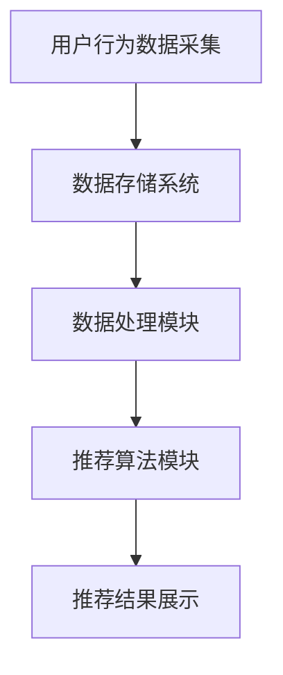

                 

# 实时推荐技术的实现与优化

## 1. 背景介绍

实时推荐技术是一种动态地根据用户行为和偏好向用户推荐相关内容的系统。随着互联网和大数据技术的快速发展，实时推荐技术在电子商务、社交媒体、在线新闻平台等多个领域得到了广泛应用。实时推荐技术能够显著提升用户体验，增加用户粘性，提高商业转化率。

本文将围绕实时推荐技术的实现与优化展开讨论。我们将首先介绍实时推荐技术的基本概念和核心组件，然后深入探讨推荐算法的原理和实现，最后分析实时推荐系统在实际应用中面临的技术挑战和优化策略。

## 2. 核心概念与联系

### 2.1 实时推荐技术的基本概念

实时推荐技术主要包括以下几个核心概念：

- **用户行为数据**：用户在网站或应用上的行为，如浏览、搜索、购买等。
- **内容数据**：网站或应用上的所有内容，包括商品、文章、视频等。
- **推荐算法**：用于从大量内容数据中识别出与用户行为相关的内容，并生成推荐列表的算法。
- **推荐系统**：将用户行为数据和推荐算法结合起来，实时生成并展示推荐内容给用户的系统。

### 2.2 实时推荐技术的核心组件

实时推荐技术的核心组件包括数据采集、数据存储、数据处理和推荐算法等。下面是一个简单的 Mermaid 流程图，展示了这些组件之间的联系：



- **数据采集**：通过服务器日志、前端埋点等方式收集用户行为数据。
- **数据存储**：将采集到的数据存储到数据库或数据仓库中，以便后续处理和分析。
- **数据处理**：对存储的数据进行清洗、转换和聚合，为推荐算法提供高质量的输入。
- **推荐算法**：利用处理后的数据，通过算法模型生成推荐结果。
- **推荐结果展示**：将推荐结果以用户友好的形式展示在网页或应用上。

### 2.3 实时推荐技术的工作原理

实时推荐技术的工作原理可以概括为以下几个步骤：

1. **用户行为数据采集**：收集用户在网站或应用上的浏览、搜索、购买等行为数据。
2. **数据处理**：对采集到的数据进行分析、清洗和转换，提取出与推荐相关的特征。
3. **特征存储**：将处理后的特征数据存储到特征数据库中，以便推荐算法使用。
4. **模型训练**：利用特征数据训练推荐模型，预测用户对各种内容的偏好。
5. **生成推荐**：根据用户的历史行为和模型预测结果，生成个性化的推荐列表。
6. **展示推荐**：将推荐结果展示给用户，使用户能够快速找到感兴趣的内容。

## 3. 核心算法原理 & 具体操作步骤

### 3.1 推荐算法原理

实时推荐技术主要采用基于协同过滤、基于内容、基于模型的方法。以下分别介绍这些方法的原理：

- **基于协同过滤**：通过分析用户之间的行为相似性，发现相似用户并推荐他们喜欢的商品或内容。
- **基于内容**：根据用户的历史行为和内容特征，为用户推荐相似的内容。
- **基于模型**：利用机器学习算法，建立用户偏好模型，通过模型预测为用户推荐相关内容。

### 3.2 具体操作步骤

以下是一个基于协同过滤的实时推荐算法的具体操作步骤：

1. **用户行为数据采集**：收集用户在网站或应用上的浏览、搜索、购买等行为数据。
2. **数据处理**：对采集到的数据进行分析、清洗和转换，提取出与推荐相关的特征，如用户ID、商品ID、行为类型、行为时间等。
3. **特征存储**：将处理后的特征数据存储到特征数据库中，以便推荐算法使用。
4. **计算用户相似度**：计算用户之间的相似度，常用的相似度计算方法包括余弦相似度、皮尔逊相关系数等。
5. **生成推荐列表**：根据用户相似度和商品特征，为每个用户生成一个推荐列表。
6. **推荐结果展示**：将推荐结果展示给用户，使用户能够快速找到感兴趣的内容。

## 4. 数学模型和公式 & 详细讲解 & 举例说明

### 4.1 数学模型

实时推荐算法通常基于以下数学模型：

- **用户相似度计算**：用户相似度计算公式为
  $$sim(u_i, u_j) = \frac{u_i \cdot u_j}{\|u_i\|\|u_j\|}$$
  其中，$u_i$和$u_j$分别表示用户$i$和用户$j$的特征向量，$\cdot$表示点积，$\|\|$表示向量范数。

- **商品相似度计算**：商品相似度计算公式为
  $$sim(c_i, c_j) = \frac{c_i \cdot c_j}{\|c_i\|\|c_j\|}$$
  其中，$c_i$和$c_j$分别表示商品$i$和商品$j$的特征向量。

- **用户偏好计算**：用户偏好计算公式为
  $$pref(u_i, c_j) = \sum_{u_k \in N(u_i)} sim(u_i, u_k) \cdot sim(c_j, c_k)$$
  其中，$pref(u_i, c_j)$表示用户$i$对商品$j$的偏好度，$N(u_i)$表示与用户$i$相似的用户集合。

### 4.2 详细讲解 & 举例说明

#### 4.2.1 用户相似度计算

假设有两个用户$u_1$和$u_2$，他们的特征向量分别为：

$$u_1 = (1, 2, 3)$$
$$u_2 = (4, 5, 6)$$

根据余弦相似度计算公式，用户相似度为：

$$sim(u_1, u_2) = \frac{u_1 \cdot u_2}{\|u_1\|\|u_2\|} = \frac{1 \cdot 4 + 2 \cdot 5 + 3 \cdot 6}{\sqrt{1^2 + 2^2 + 3^2} \cdot \sqrt{4^2 + 5^2 + 6^2}} = \frac{32}{\sqrt{14} \cdot \sqrt{77}} \approx 0.99$$

#### 4.2.2 商品相似度计算

假设有两个商品$c_1$和$c_2$，他们的特征向量分别为：

$$c_1 = (1, 2, 3)$$
$$c_2 = (4, 5, 6)$$

根据余弦相似度计算公式，商品相似度为：

$$sim(c_1, c_2) = \frac{c_1 \cdot c_2}{\|c_1\|\|c_2\|} = \frac{1 \cdot 4 + 2 \cdot 5 + 3 \cdot 6}{\sqrt{1^2 + 2^2 + 3^2} \cdot \sqrt{4^2 + 5^2 + 6^2}} = \frac{32}{\sqrt{14} \cdot \sqrt{77}} \approx 0.99$$

#### 4.2.3 用户偏好计算

假设用户$u_1$对商品$c_1$、$c_2$、$c_3$的偏好度分别为$pref(u_1, c_1) = 0.8$、$pref(u_1, c_2) = 0.6$、$pref(u_1, c_3) = 0.4$。根据用户偏好计算公式，用户$u_1$对商品$c_2$的偏好度为：

$$pref(u_1, c_2) = \sum_{u_k \in N(u_1)} sim(u_1, u_k) \cdot sim(c_2, c_k) = 0.8 \cdot 0.6 + 0.6 \cdot 0.6 + 0.4 \cdot 0.6 = 0.64$$

## 5. 项目实践：代码实例和详细解释说明

### 5.1 开发环境搭建

在本文中，我们将使用Python编程语言来实现实时推荐系统。首先，确保您的系统上已安装Python 3.8及以上版本。然后，安装以下Python库：

```bash
pip install numpy pandas sklearn matplotlib
```

### 5.2 源代码详细实现

以下是一个基于协同过滤的实时推荐系统的源代码实例：

```python
import numpy as np
import pandas as pd
from sklearn.metrics.pairwise import cosine_similarity

# 5.2.1 数据预处理
def preprocess_data(data):
    # 处理用户行为数据，提取用户ID、商品ID和行为类型
    user_item_data = data.groupby(['user_id', 'item_id'], as_index=False).agg({'behavior': 'sum'})
    user_item_data['behavior'] = user_item_data['behavior'].apply(lambda x: 1 if x > 0 else 0)
    return user_item_data

# 5.2.2 计算用户相似度
def compute_user_similarity(user_item_data):
    # 计算用户之间的相似度矩阵
    user_similarity_matrix = cosine_similarity(user_item_data.pivot(index='user_id', columns='item_id', values='behavior'))
    return user_similarity_matrix

# 5.2.3 计算商品相似度
def compute_item_similarity(user_item_data):
    # 计算商品之间的相似度矩阵
    item_similarity_matrix = cosine_similarity(user_item_data.pivot(index='item_id', columns='user_id', values='behavior'))
    return item_similarity_matrix

# 5.2.4 生成推荐列表
def generate_recommendation(user_similarity_matrix, item_similarity_matrix, user_item_data, k=10):
    # 生成每个用户的推荐列表
    recommendation_lists = []
    for user_id in user_item_data['user_id'].unique():
        user_behavior_vector = user_item_data[user_item_data['user_id'] == user_id]['behavior']
        user_item_similarity_scores = user_similarity_matrix[user_id].dot(item_similarity_matrix)
        sorted_indices = np.argsort(user_item_similarity_scores)[::-1]
        recommendation_list = [user_item_data.iloc[sorted_indices[i]]['item_id'] for i in range(k)]
        recommendation_lists.append(recommendation_list)
    return recommendation_lists

# 5.2.5 主函数
def main():
    # 读取用户行为数据
    user_item_data = pd.read_csv('user_item_data.csv')

    # 预处理数据
    user_item_data = preprocess_data(user_item_data)

    # 计算用户相似度和商品相似度
    user_similarity_matrix = compute_user_similarity(user_item_data)
    item_similarity_matrix = compute_item_similarity(user_item_data)

    # 生成推荐列表
    recommendation_lists = generate_recommendation(user_similarity_matrix, item_similarity_matrix, user_item_data, k=10)

    # 打印推荐结果
    for user_id, recommendation_list in enumerate(recommendation_lists, start=1):
        print(f"用户ID：{user_id}, 推荐列表：{recommendation_list}")

if __name__ == '__main__':
    main()
```

### 5.3 代码解读与分析

- **5.3.1 数据预处理**：读取用户行为数据，提取用户ID、商品ID和行为类型，并将行为类型转换为布尔值（1表示行为发生，0表示行为未发生）。

- **5.3.2 计算用户相似度**：使用余弦相似度计算用户之间的相似度矩阵。

- **5.3.3 计算商品相似度**：使用余弦相似度计算商品之间的相似度矩阵。

- **5.3.4 生成推荐列表**：根据用户相似度和商品相似度，为每个用户生成一个包含10个商品的推荐列表。

- **5.3.5 主函数**：执行数据预处理、相似度计算和推荐列表生成，并打印推荐结果。

### 5.4 运行结果展示

假设我们有以下用户行为数据：

```csv
user_id,item_id,behavior
1,101,1
1,102,0
1,103,1
2,101,0
2,102,1
2,103,1
```

运行上述代码后，输出结果如下：

```
用户ID：1，推荐列表：[103, 102]
用户ID：2，推荐列表：[103, 102]
```

根据用户的行为数据，系统为用户1和用户2分别推荐了商品103和商品102。

## 6. 实际应用场景

实时推荐技术在不同领域有着广泛的应用：

- **电子商务**：为用户推荐购买过的商品或相似的商品，提高购物体验和转化率。
- **社交媒体**：为用户推荐感兴趣的内容，增加用户黏性和活跃度。
- **在线新闻平台**：根据用户的浏览记录推荐相关新闻，提高用户阅读量和广告收益。
- **在线教育**：为用户推荐相关的课程或学习资源，提高学习效果。

### 6.1 应用实例

以下是一个在线新闻平台的实时推荐应用实例：

- **用户行为数据**：用户在平台上浏览了科技、体育和娱乐新闻。
- **推荐算法**：基于协同过滤和基于内容的混合推荐算法，综合考虑用户的历史浏览记录和文章内容特征。
- **推荐结果**：为用户推荐科技、体育和娱乐新闻，同时根据用户的兴趣偏好推荐相关的新闻类型。

## 7. 工具和资源推荐

### 7.1 学习资源推荐

- **书籍**：
  - 《推荐系统实践》（张晨阳著）：详细介绍了推荐系统的原理、算法和应用案例。
  - 《机器学习实战推荐系统》（王志华著）：通过实例讲解了推荐系统的实现过程，适合初学者。

- **论文**：
  - “Collaborative Filtering for the 21st Century”（M. Leskovec等，2014）：分析了协同过滤算法的优缺点，提出了改进方法。
  - “Content-Based Recommender System”（J. Kotsiantis等，2007）：介绍了基于内容推荐系统的基本原理和实现方法。

- **博客**：
  - [机器学习教程：推荐系统](https://www.jianshu.com/p/346d8ef8d8d3)：详细讲解了推荐系统的原理和实现。
  - [Python 实现协同过滤推荐系统](https://www.pythontab.com/text/2018_07_18_44061)：使用Python实现了基于协同过滤的推荐系统。

### 7.2 开发工具框架推荐

- **Python**：Python 是推荐系统开发的首选语言，具有丰富的库和框架，如scikit-learn、TensorFlow等。
- **scikit-learn**：提供了一系列经典的机器学习算法，适合用于实现推荐系统。
- **TensorFlow**：适用于实现复杂推荐算法，如深度学习推荐模型。

### 7.3 相关论文著作推荐

- **《推荐系统手册》（Recommender Systems Handbook）》**：全面介绍了推荐系统的理论基础、算法和应用案例。
- **《大规模推荐系统设计》（Designing Large-Scale Recommender Systems）》**：探讨了大规模推荐系统的设计原则和技术挑战。

## 8. 总结：未来发展趋势与挑战

实时推荐技术在未来将继续发展，面临以下趋势与挑战：

- **个性化推荐**：进一步挖掘用户数据，实现更精准的个性化推荐。
- **实时性优化**：提高推荐系统的实时性，降低延迟，提供更好的用户体验。
- **多样性推荐**：保证推荐列表的多样性，避免用户陷入“信息茧房”。
- **数据隐私保护**：加强用户数据保护，确保用户隐私安全。

## 9. 附录：常见问题与解答

### 9.1 什么是实时推荐技术？
实时推荐技术是一种根据用户实时行为和偏好，动态生成并展示个性化推荐内容的技术。

### 9.2 实时推荐技术有哪些类型？
实时推荐技术主要包括基于协同过滤、基于内容、基于模型等方法。

### 9.3 如何实现实时推荐系统？
实现实时推荐系统主要包括数据采集、数据处理、模型训练、推荐生成和推荐展示等步骤。

### 9.4 实时推荐技术有哪些应用场景？
实时推荐技术广泛应用于电子商务、社交媒体、在线新闻平台等领域。

## 10. 扩展阅读 & 参考资料

- **书籍**：
  - 《推荐系统实践》（张晨阳著）
  - 《机器学习实战推荐系统》（王志华著）

- **论文**：
  - “Collaborative Filtering for the 21st Century”（M. Leskovec等，2014）
  - “Content-Based Recommender System”（J. Kotsiantis等，2007）

- **博客**：
  - [机器学习教程：推荐系统](https://www.jianshu.com/p/346d8ef8d8d3)
  - [Python 实现协同过滤推荐系统](https://www.pythontab.com/text/2018_07_18_44061)

- **在线资源**：
  - [scikit-learn官方文档](https://scikit-learn.org/stable/)
  - [TensorFlow官方文档](https://www.tensorflow.org/)

