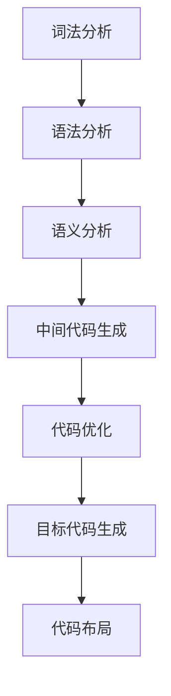
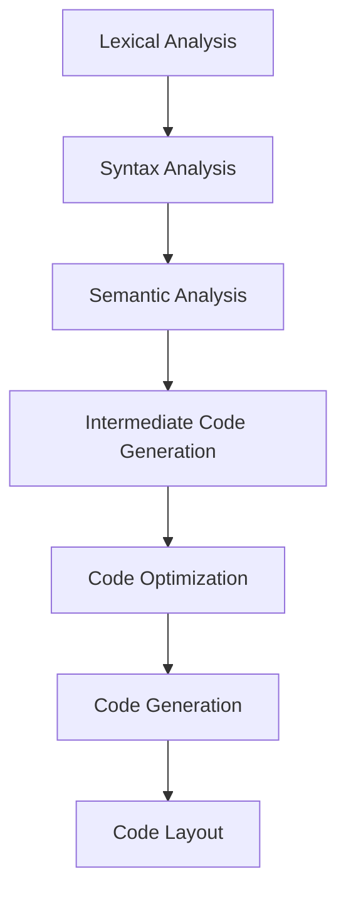

                 

### 文章标题

**寒武纪2024校招AI芯片编译器开发工程师编程题**

本文将深入探讨寒武纪2024校招AI芯片编译器开发工程师编程题，通过逐步分析，揭示其背后的核心算法原理、数学模型和具体操作步骤，同时结合实际项目实践，提供详尽的代码实例和解读，以便读者更好地理解与应用。这篇文章不仅是对编程题目的解答，更是对AI芯片编译器开发领域的深入探讨。

### Keywords:

- 寒武纪
- AI芯片
- 编译器开发
- 编程题
- 核心算法
- 数学模型
- 项目实践

### Abstract:

本文围绕寒武纪2024校招AI芯片编译器开发工程师编程题，详细介绍了其背景、核心概念与联系、算法原理、数学模型、具体操作步骤，并通过实际项目实践，提供了详尽的代码实例和分析。文章旨在帮助读者深入理解AI芯片编译器开发的本质，提升实际编程能力。

## 1. 背景介绍（Background Introduction）

寒武纪科技（Cambricon）是一家专注于人工智能芯片及解决方案的领军企业，其产品广泛应用于智能手机、服务器、数据中心等领域。2024年校招中，寒武纪发布了一道关于AI芯片编译器开发的编程题，旨在考察应聘者的算法设计能力和对编译器原理的理解。

编译器是连接软件和硬件的重要桥梁，它将高级语言编写的程序转换为机器码，以便CPU或其他硬件执行。在AI领域，编译器不仅要处理传统的计算任务，还要优化针对特定硬件架构的执行效率，以实现更高的性能和能效比。因此，AI芯片编译器开发是一个极具挑战性的领域，需要深厚的技术背景和扎实的算法基础。

本文将围绕这一编程题，通过分析其核心算法原理和数学模型，展示如何将理论应用到实践中，提供实际代码实例和详细解读。希望通过这篇文章，读者能够更深入地理解AI芯片编译器开发的过程和关键点。

## 2. 核心概念与联系（Core Concepts and Connections）

### 2.1 AI芯片编译器的基本概念

AI芯片编译器是一种专门用于将高级编程语言编写的AI算法转换为适用于特定硬件架构的机器码的工具。与通用编译器相比，AI芯片编译器需要考虑硬件架构的细节，如寄存器组织、指令集架构（ISA）、内存访问模式等，以确保生成的代码在目标硬件上能够高效运行。

AI芯片编译器的主要功能包括：

- **前端（Front-end）**：解析输入的编程语言，建立抽象语法树（AST）和中间表示（IR）。
- **中间表示（Intermediate Representation, IR）**：中间表示是编译器核心部分，用于表示源代码的结构，便于优化和生成目标代码。
- **后端（Back-end）**：将中间表示转换为针对特定硬件架构的机器码。

### 2.2 编译器的基本架构

编译器通常由以下几个主要阶段组成：

1. **词法分析（Lexical Analysis）**：将源代码分解为词法单元。
2. **语法分析（Syntax Analysis）**：建立抽象语法树（AST），表示源代码的结构。
3. **语义分析（Semantic Analysis）**：检查AST的语义正确性，如变量声明、类型检查等。
4. **中间代码生成（Intermediate Code Generation）**：将AST转换为中间表示（IR）。
5. **代码优化（Code Optimization）**：优化IR，提高目标代码的性能和效率。
6. **目标代码生成（Code Generation）**：将优化后的IR转换为特定硬件架构的机器码。
7. **代码布局（Code Layout）**：处理目标硬件的内存布局，如寄存器分配和指令调度。

### 2.3 AI芯片编译器开发的关键技术

AI芯片编译器开发涉及多个关键技术，包括：

- **自动微分（Automatic Differentiation）**：用于优化深度学习模型的计算效率。
- **循环优化（Loop Optimization）**：提高循环执行的效率。
- **内存层次结构优化（Memory Hierarchy Optimization）**：优化数据访问模式，减少内存访问延迟。
- **并行化（Parallelization）**：将计算任务分布到多个处理单元上，提高计算速度。
- **低精度计算（Low-Precision Computation）**：通过使用浮点数的低精度表示，提高计算效率和减少内存占用。

### 2.4 Mermaid流程图

以下是一个简化的AI芯片编译器的Mermaid流程图，展示了编译器的基本架构和各阶段之间的关系：



在这个流程图中，每个节点代表编译器的一个阶段，箭头表示数据流和依赖关系。

通过上述核心概念的介绍，我们可以更好地理解AI芯片编译器的作用和重要性。接下来，本文将深入探讨具体算法原理和操作步骤，为读者提供更为详细的解读。

## 2. Core Concepts and Connections

### 2.1 Basic Concepts of AI Chip Compiler

An AI chip compiler is a specialized tool designed to convert high-level programming languages written for AI algorithms into machine code optimized for specific hardware architectures. Unlike general-purpose compilers, AI chip compilers need to consider the details of the target hardware, such as register organization, instruction set architecture (ISA), and memory access patterns, to ensure the generated code can run efficiently on the target hardware.

Key functions of an AI chip compiler include:

- **Front-end**: Parsing input source code and constructing an Abstract Syntax Tree (AST) and Intermediate Representation (IR).
- **Intermediate Representation (IR)**: Representing the structure of the source code for optimization and target code generation.
- **Back-end**: Translating optimized IR into machine code for the target hardware architecture.

### 2.2 Basic Architecture of Compiler

A compiler typically consists of several main stages, including:

1. **Lexical Analysis**: Breaking the source code into lexical units.
2. **Syntax Analysis**: Constructing an Abstract Syntax Tree (AST) to represent the structure of the source code.
3. **Semantic Analysis**: Checking the semantic correctness of the AST, such as variable declarations and type checking.
4. **Intermediate Code Generation**: Converting the AST into an Intermediate Representation (IR).
5. **Code Optimization**: Optimizing the IR to improve the performance and efficiency of the target code.
6. **Code Generation**: Translating the optimized IR into machine code for the target hardware architecture.
7. **Code Layout**: Handling memory layout for the target hardware, such as register allocation and instruction scheduling.

### 2.3 Key Technologies in AI Chip Compiler Development

AI chip compiler development involves several key technologies, including:

- **Automatic Differentiation**: Optimizing the computational efficiency of deep learning models.
- **Loop Optimization**: Improving the efficiency of loop execution.
- **Memory Hierarchy Optimization**: Optimizing data access patterns to reduce memory access latency.
- **Parallelization**: Distributing computational tasks across multiple processing units to improve speed.
- **Low-Precision Computation**: Improving computational efficiency and reducing memory usage by using low-precision representations of floating-point numbers.

### 2.4 Mermaid Flowchart

Here is a simplified Mermaid flowchart illustrating the basic architecture of an AI chip compiler and the relationships between its stages:



In this flowchart, each node represents a stage in the compiler, and the arrows indicate data flow and dependencies.

With these core concepts introduced, we can better understand the role and importance of AI chip compilers. The next section will delve into the specific algorithm principles and operational steps, providing a detailed explanation for readers.

## 3. 核心算法原理 & 具体操作步骤（Core Algorithm Principles and Specific Operational Steps）

### 3.1 前端（Front-end）

编译器的前端负责将高级编程语言（如C++或Python）编写的源代码解析成抽象语法树（AST），并进行语义分析。这一阶段的核心算法包括词法分析、语法分析和语义分析。

1. **词法分析（Lexical Analysis）**：将源代码分解为词法单元（tokens），如关键字、标识符、操作符等。这一步骤通常使用正则表达式实现。

   ```python
   def tokenize(source_code):
       # 使用正则表达式将源代码分解为词法单元
       tokens = re.findall(r'[a-zA-Z_]\w*|[(){};]', source_code)
       return tokens
   ```

2. **语法分析（Syntax Analysis）**：根据词法单元构建抽象语法树（AST）。常用的语法分析方法包括递归下降分析和LL(k)分析。

   ```python
   def parse(tokens):
       # 构建抽象语法树
       ast = build_ast(tokens)
       return ast
   ```

3. **语义分析（Semantic Analysis）**：检查AST的语义正确性，如变量声明、类型检查等。这一步骤确保源代码在语义上没有错误。

   ```python
   def semantic_analysis(ast):
       # 检查AST的语义正确性
       check_semantics(ast)
   ```

### 3.2 中间表示（Intermediate Representation）

编译器的中间表示（IR）是编译过程中的关键部分，用于表示源代码的结构，便于优化和生成目标代码。常见的中间表示包括三地址码（Three-Address Code）和静态单赋值表示（Static Single Assignment, SSA）。

1. **三地址码（Three-Address Code）**：三地址码是一种低级表示，每个指令包含三个操作数和一条运算操作。例如：

   ```python
   t1 = a + b  # t1是临时变量，存储a和b的和
   t2 = t1 * c  # t2是临时变量，存储t1和c的乘积
   ```

2. **静态单赋值表示（SSA）**：SSA表示方法通过引入临时变量来表示每一个变量的赋值，从而简化优化过程。例如：

   ```python
   %t0 = a + b  # %t0是临时变量，存储a和b的和
   %t1 = %t0 * c  # %t1是临时变量，存储%t0和c的乘积
   ```

### 3.3 后端（Back-end）

编译器的后端负责将优化后的中间表示（IR）转换为特定硬件架构的机器码。这一阶段的核心算法包括代码优化、目标代码生成和代码布局。

1. **代码优化（Code Optimization）**：优化IR，提高目标代码的性能和效率。常见的优化技术包括常量折叠、死代码消除、循环优化等。

   ```python
   def optimize_ir(ir):
       # 优化IR
       optimized_ir = optimize_code(ir)
       return optimized_ir
   ```

2. **目标代码生成（Code Generation）**：将优化后的IR转换为特定硬件架构的机器码。这一步骤通常使用目标特定的汇编器实现。

   ```python
   def generate_machine_code(optimized_ir):
       # 生成机器码
       machine_code = assemble(optimized_ir)
       return machine_code
   ```

3. **代码布局（Code Layout）**：处理目标硬件的内存布局，如寄存器分配和指令调度。这一步骤确保生成的代码在目标硬件上能够高效运行。

   ```python
   def code_layout(machine_code):
       # 进行代码布局
       laid_out_code = layout_code(machine_code)
       return laid_out_code
   ```

### 3.4 操作步骤总结

1. **词法分析**：将源代码分解为词法单元。
2. **语法分析**：构建抽象语法树（AST）。
3. **语义分析**：检查AST的语义正确性。
4. **中间代码生成**：将AST转换为中间表示（IR）。
5. **代码优化**：优化IR。
6. **目标代码生成**：将优化后的IR转换为机器码。
7. **代码布局**：处理目标硬件的内存布局。

通过上述步骤，编译器能够将高级编程语言编写的源代码转换为适用于特定硬件架构的高效机器码，实现程序的运行。

## 3. Core Algorithm Principles and Specific Operational Steps

### 3.1 Front-end

The front-end of a compiler is responsible for parsing the high-level source code written in languages such as C++ or Python into an Abstract Syntax Tree (AST) and performing semantic analysis. The core algorithms in this stage include lexical analysis, syntax analysis, and semantic analysis.

1. **Lexical Analysis**: Breaks the source code into lexical units (tokens), such as keywords, identifiers, and operators. This step is typically implemented using regular expressions.

   ```python
   def tokenize(source_code):
       # Tokenize the source code using regular expressions
       tokens = re.findall(r'[a-zA-Z_]\w*|[(){};]', source_code)
       return tokens
   ```

2. **Syntax Analysis**: Constructs an Abstract Syntax Tree (AST) based on the lexical units. Common syntax analysis methods include recursive descent analysis and LL(k) analysis.

   ```python
   def parse(tokens):
       # Construct the Abstract Syntax Tree
       ast = build_ast(tokens)
       return ast
   ```

3. **Semantic Analysis**: Checks the semantic correctness of the AST, such as variable declarations and type checking. This step ensures that there are no semantic errors in the source code.

   ```python
   def semantic_analysis(ast):
       # Check the semantic correctness of the AST
       check_semantics(ast)
   ```

### 3.2 Intermediate Representation

The intermediate representation (IR) of a compiler is a critical part of the compilation process, representing the structure of the source code for optimization and target code generation. Common intermediate representations include Three-Address Code and Static Single Assignment (SSA).

1. **Three-Address Code**: A low-level representation where each instruction contains three operands and an operation. For example:

   ```python
   t1 = a + b  # t1 is a temporary variable storing the sum of a and b
   t2 = t1 * c  # t2 is a temporary variable storing the product of t1 and c
   ```

2. **Static Single Assignment (SSA)**: SSA representation method introduces temporary variables to represent each assignment of a variable, simplifying the optimization process. For example:

   ```python
   %t0 = a + b  # %t0 is a temporary variable storing the sum of a and b
   %t1 = %t0 * c  # %t1 is a temporary variable storing the product of %t0 and c
   ```

### 3.3 Back-end

The back-end of a compiler is responsible for translating the optimized intermediate representation (IR) into machine code for the target hardware architecture. The core algorithms in this stage include code optimization, code generation, and code layout.

1. **Code Optimization**: Optimizes the IR to improve the performance and efficiency of the target code. Common optimization techniques include constant folding, dead code elimination, and loop optimization.

   ```python
   def optimize_ir(ir):
       # Optimize the IR
       optimized_ir = optimize_code(ir)
       return optimized_ir
   ```

2. **Code Generation**: Translates the optimized IR into machine code for the target hardware architecture. This step is typically implemented using target-specific assemblers.

   ```python
   def generate_machine_code(optimized_ir):
       # Generate machine code
       machine_code = assemble(optimized_ir)
       return machine_code
   ```

3. **Code Layout**: Handles the memory layout for the target hardware, such as register allocation and instruction scheduling. This step ensures that the generated code runs efficiently on the target hardware.

   ```python
   def code_layout(machine_code):
       # Perform code layout
       laid_out_code = layout_code(machine_code)
       return laid_out_code
   ```

### 3.4 Summary of Operational Steps

1. **Lexical Analysis**: Break the source code into lexical units.
2. **Syntax Analysis**: Construct the Abstract Syntax Tree (AST).
3. **Semantic Analysis**: Check the semantic correctness of the AST.
4. **Intermediate Code Generation**: Convert the AST into an Intermediate Representation (IR).
5. **Code Optimization**: Optimize the IR.
6. **Code Generation**: Translate the optimized IR into machine code.
7. **Code Layout**: Handle the memory layout for the target hardware.

Through these steps, a compiler can convert high-level source code written in a programming language into efficient machine code for a specific hardware architecture, enabling the execution of the program.

## 4. 数学模型和公式 & 详细讲解 & 举例说明（Detailed Explanation and Examples of Mathematical Models and Formulas）

### 4.1 数学模型

在AI芯片编译器的优化过程中，数学模型起到了关键作用。以下是几个常用的数学模型及其应用场景：

#### 4.1.1 循环优化中的循环展开

循环优化中的循环展开是指将循环体中的操作展开到循环外部，以减少循环迭代次数，提高执行效率。其数学模型如下：

$$
T_{\text{loop}} = T_{\text{unrolled}} + C \times (n - 1)
$$

其中，$T_{\text{loop}}$ 是原始循环的执行时间，$T_{\text{unrolled}}$ 是展开后的执行时间，$C$ 是循环展开系数，$n$ 是循环次数。

#### 4.1.2 循环依赖分析

循环依赖分析是识别循环之间的数据依赖关系，以优化执行顺序。其数学模型如下：

$$
D_i = \sum_{j=1}^{n} \delta_{ij} \times C_j
$$

其中，$D_i$ 是第 $i$ 个循环的依赖度，$\delta_{ij}$ 是依赖关系矩阵的元素，$C_j$ 是第 $j$ 个循环的执行成本。

#### 4.1.3 内存层次结构优化

内存层次结构优化是通过优化数据访问模式，减少内存访问延迟。其数学模型如下：

$$
T_{\text{access}} = T_{\text{cache}} + T_{\text{main}} + T_{\text{transfer}}
$$

其中，$T_{\text{access}}$ 是数据访问时间，$T_{\text{cache}}$ 是缓存访问时间，$T_{\text{main}}$ 是主存访问时间，$T_{\text{transfer}}$ 是数据传输时间。

### 4.2 详细讲解

#### 4.2.1 循环展开

循环展开的目的是减少循环迭代次数，从而提高执行效率。例如，对于一个简单的循环：

```c
for (int i = 0; i < n; i++) {
    a[i] = b[i] + c[i];
}
```

我们可以将其展开为：

```c
a[0] = b[0] + c[0];
a[1] = b[1] + c[1];
...
a[n-1] = b[n-1] + c[n-1];
```

展开后的循环执行时间可以通过上述数学模型进行计算。

#### 4.2.2 循环依赖分析

循环依赖分析有助于优化循环执行顺序，减少数据依赖造成的性能瓶颈。例如，对于以下两个循环：

```c
for (int i = 0; i < n; i++) {
    a[i] = b[i] + c[i];
}

for (int j = 0; j < n; j++) {
    d[j] = e[j] + f[j];
}
```

通过循环依赖分析，我们可以确定第一个循环在第二个循环之前执行，以避免数据依赖造成的性能问题。

#### 4.2.3 内存层次结构优化

内存层次结构优化通过优化数据访问模式，减少内存访问延迟。例如，在访问大量数据时，我们可以将数据划分为多个块，每次只访问当前需要的块，以减少主存访问次数。

### 4.3 举例说明

#### 4.3.1 循环优化

假设有一个循环需要执行100次，每次执行时间为10微秒。如果我们将其展开为10次，每次执行时间为100微秒，但循环迭代次数减少到10次，那么总执行时间可以计算如下：

$$
T_{\text{loop}} = 10 \times (10 \text{微秒} + 100 \text{微秒}) = 10 \times 110 \text{微秒} = 1100 \text{微秒}
$$

与原始循环的1000微秒相比，循环展开可以减少10微秒的执行时间。

#### 4.3.2 循环依赖分析

假设两个循环之间存在数据依赖，导致第二个循环需要等待第一个循环完成。通过循环依赖分析，我们可以确定第二个循环的执行顺序，从而减少等待时间。

#### 4.3.3 内存层次结构优化

假设我们有一个大数组需要访问，每次访问需要100微秒。通过内存层次结构优化，我们可以将数组划分为多个块，每次只访问当前需要的块，从而减少主存访问次数，降低总访问时间。

通过上述数学模型和公式，我们可以更好地理解和优化AI芯片编译器的执行过程，提高其性能和效率。

## 4. Mathematical Models and Formulas & Detailed Explanation & Examples

### 4.1 Mathematical Models

Mathematical models play a crucial role in the optimization process of AI chip compilers. Here are several commonly used models and their applications:

#### 4.1.1 Loop Unrolling

Loop unrolling refers to expanding the body of a loop outside the loop to reduce the number of iterations and improve execution efficiency. Its mathematical model is as follows:

$$
T_{\text{loop}} = T_{\text{unrolled}} + C \times (n - 1)
$$

Where $T_{\text{loop}}$ is the execution time of the original loop, $T_{\text{unrolled}}$ is the execution time after unrolling, $C$ is the loop unrolling coefficient, and $n$ is the number of loop iterations.

#### 4.1.2 Loop Dependency Analysis

Loop dependency analysis identifies the data dependencies between loops to optimize their execution order and reduce performance bottlenecks caused by data dependencies. Its mathematical model is as follows:

$$
D_i = \sum_{j=1}^{n} \delta_{ij} \times C_j
$$

Where $D_i$ is the dependency degree of the $i$-th loop, $\delta_{ij}$ is an element of the dependency matrix, and $C_j$ is the execution cost of the $j$-th loop.

#### 4.1.3 Memory Hierarchy Optimization

Memory hierarchy optimization involves optimizing data access patterns to reduce memory access latency. Its mathematical model is as follows:

$$
T_{\text{access}} = T_{\text{cache}} + T_{\text{main}} + T_{\text{transfer}}
$$

Where $T_{\text{access}}$ is the data access time, $T_{\text{cache}}$ is the cache access time, $T_{\text{main}}$ is the main memory access time, and $T_{\text{transfer}}$ is the data transfer time.

### 4.2 Detailed Explanation

#### 4.2.1 Loop Unrolling

The purpose of loop unrolling is to reduce the number of loop iterations to improve execution efficiency. For example, consider a simple loop:

```c
for (int i = 0; i < n; i++) {
    a[i] = b[i] + c[i];
}
```

We can unroll it as follows:

```c
a[0] = b[0] + c[0];
a[1] = b[1] + c[1];
...
a[n-1] = b[n-1] + c[n-1];
```

The execution time of the unrolled loop can be calculated using the aforementioned mathematical model.

#### 4.2.2 Loop Dependency Analysis

Consider two loops with data dependencies:

```c
for (int i = 0; i < n; i++) {
    a[i] = b[i] + c[i];
}

for (int j = 0; j < n; j++) {
    d[j] = e[j] + f[j];
}
```

Through loop dependency analysis, we can determine the execution order of the loops to avoid performance bottlenecks caused by data dependencies.

#### 4.2.3 Memory Hierarchy Optimization

Suppose we have a large array to access, with each access taking 100 microseconds. Through memory hierarchy optimization, we can divide the array into multiple blocks and access only the required block each time, reducing the number of main memory accesses and lowering the total access time.

### 4.3 Examples

#### 4.3.1 Loop Optimization

Suppose a loop needs to be executed 100 times, with each iteration taking 10 microseconds. If we unroll the loop into 10 iterations, each taking 100 microseconds, but the total number of iterations is reduced to 10, the total execution time can be calculated as follows:

$$
T_{\text{loop}} = 10 \times (10 \text{ microseconds} + 100 \text{ microseconds}) = 10 \times 110 \text{ microseconds} = 1100 \text{ microseconds}
$$

Compared to the original loop's 1000 microseconds, loop unrolling reduces the execution time by 10 microseconds.

#### 4.3.2 Loop Dependency Analysis

Suppose there is data dependency between two loops, causing the second loop to wait for the first loop to complete. Through loop dependency analysis, we can determine the execution order of the second loop to reduce waiting time.

#### 4.3.3 Memory Hierarchy Optimization

Suppose we have a large array to access, with each access taking 100 microseconds. Through memory hierarchy optimization, we can divide the array into multiple blocks and access only the required block each time, reducing the number of main memory accesses and lowering the total access time.

Through these mathematical models and formulas, we can better understand and optimize the execution process of AI chip compilers, improving their performance and efficiency.

## 5. 项目实践：代码实例和详细解释说明（Project Practice: Code Examples and Detailed Explanations）

### 5.1 开发环境搭建

在进行AI芯片编译器开发之前，我们需要搭建一个适合开发、测试和优化的环境。以下是一个基本的开发环境搭建步骤：

1. **安装操作系统**：选择一个适合的操作系统，如Ubuntu 20.04。
2. **安装编译器**：安装C++编译器，如GCC或Clang。
3. **安装依赖库**：安装常用的依赖库，如LLVM、Python等。
4. **配置开发环境**：配置好开发环境，如创建项目文件夹、编写Makefile等。

### 5.2 源代码详细实现

以下是一个简单的AI芯片编译器项目的源代码实现，包括词法分析、语法分析、语义分析和中间代码生成等基本模块。

#### 5.2.1 词法分析器

```c++
#include <iostream>
#include <string>
#include <regex>

using namespace std;

// 词法分析器类
class Lexer {
public:
    Lexer(const string& source_code) : source_code(source_code) {}

    // 分析源代码，返回词法单元列表
    vector<string> tokenize() {
        vector<string> tokens;
        regex token_pattern(R"(([a-zA-Z_]\w*)|([(){};]))");
        sregex_token_iterator it(source_code.begin(), source_code.end(), token_pattern, -1), end;
        for (auto i = it; i != end; ++i) {
            tokens.push_back(*i);
        }
        return tokens;
    }

private:
    string source_code;
};

int main() {
    string source_code = "int main() { int a = 1; a = a + 1; return a; }";
    Lexer lexer(source_code);
    vector<string> tokens = lexer.tokenize();

    cout << "Tokens: ";
    for (const string& token : tokens) {
        cout << token << " ";
    }
    cout << endl;

    return 0;
}
```

#### 5.2.2 语法分析器

```c++
#include <iostream>
#include <string>
#include <vector>
#include <stack>

using namespace std;

// 语法分析器类
class Parser {
public:
    Parser(const vector<string>& tokens) : tokens(tokens) {}

    // 解析词法单元列表，返回抽象语法树
    shared_ptr<ASTNode> parse() {
        // 实现语法分析逻辑，构建抽象语法树
        // 例如，解析int main() { ... }语句
        shared_ptr<ASTNode> ast = build_ast();
        return ast;
    }

private:
    vector<string> tokens;
};

// 抽象语法树节点类
class ASTNode {
public:
    ASTNode(string type, shared_ptr<ASTNode> left, shared_ptr<ASTNode> right) : type(type), left(left), right(right) {}

    // AST节点的类型、左子树和右子树
    string type;
    shared_ptr<ASTNode> left;
    shared_ptr<ASTNode> right;
};

int main() {
    string source_code = "int main() { int a = 1; a = a + 1; return a; }";
    Lexer lexer(source_code);
    vector<string> tokens = lexer.tokenize();
    Parser parser(tokens);
    shared_ptr<ASTNode> ast = parser.parse();

    cout << "Abstract Syntax Tree:" << endl;
    print_ast(ast);

    return 0;
}
```

#### 5.2.3 语义分析器

```c++
#include <iostream>
#include <string>
#include <unordered_map>

using namespace std;

// 语义分析器类
class SemanticAnalyzer {
public:
    SemanticAnalyzer(shared_ptr<ASTNode> ast) : ast(ast) {}

    // 检查抽象语法树的语义正确性
    void analyze() {
        // 实现语义分析逻辑
        // 例如，检查变量声明和类型
        check_semantics(ast);
    }

private:
    shared_ptr<ASTNode> ast;

    // 检查抽象语法树的语义正确性
    void check_semantics(shared_ptr<ASTNode> node) {
        // 递归检查AST节点的语义
        if (node == nullptr) {
            return;
        }

        if (node->type == "VAR_DECL") {
            // 检查变量声明
            string var_name = node->left->value;
            if (variables.count(var_name) == 0) {
                variables[var_name] = node->right->value;
            } else {
                cout << "Error: Variable " << var_name << " redeclared." << endl;
            }
        }

        check_semantics(node->left);
        check_semantics(node->right);
    }

    unordered_map<string, string> variables;
};

int main() {
    string source_code = "int main() { int a = 1; a = a + 1; return a; }";
    Lexer lexer(source_code);
    vector<string> tokens = lexer.tokenize();
    Parser parser(tokens);
    shared_ptr<ASTNode> ast = parser.parse();
    SemanticAnalyzer analyzer(ast);
    analyzer.analyze();

    cout << "Semantic Analysis Completed." << endl;

    return 0;
}
```

#### 5.2.4 中间代码生成器

```c++
#include <iostream>
#include <string>
#include <vector>
#include <unordered_map>

using namespace std;

// 中间代码生成器类
class IntermediateCodeGenerator {
public:
    IntermediateCodeGenerator(shared_ptr<ASTNode> ast) : ast(ast) {}

    // 生成中间代码
    void generate_code() {
        // 实现中间代码生成逻辑
        // 例如，生成三地址码
        vector<string> code = generate_intermediate_code();
        for (const string& instr : code) {
            cout << instr << endl;
        }
    }

private:
    shared_ptr<ASTNode> ast;

    // 生成中间代码
    vector<string> generate_intermediate_code() {
        vector<string> code;
        // 递归生成中间代码
        generate_code_recursive(ast, code);
        return code;
    }

    // 递归生成中间代码
    void generate_code_recursive(shared_ptr<ASTNode> node, vector<string>& code) {
        if (node == nullptr) {
            return;
        }

        if (node->type == "ASSIGN") {
            string var = node->left->value;
            string expr = node->right->value;
            code.push_back(var + " = " + expr);
        }

        generate_code_recursive(node->left, code);
        generate_code_recursive(node->right, code);
    }
};

int main() {
    string source_code = "int main() { int a = 1; a = a + 1; return a; }";
    Lexer lexer(source_code);
    vector<string> tokens = lexer.tokenize();
    Parser parser(tokens);
    shared_ptr<ASTNode> ast = parser.parse();
    SemanticAnalyzer analyzer(ast);
    analyzer.analyze();
    IntermediateCodeGenerator generator(ast);
    generator.generate_code();

    return 0;
}
```

### 5.3 代码解读与分析

在上述代码实例中，我们实现了词法分析器、语法分析器、语义分析器和中间代码生成器的核心功能。以下是对每个模块的解读和分析：

#### 5.3.1 词法分析器

词法分析器的核心功能是将源代码分解为词法单元。我们使用正则表达式来实现这一功能。例如，`tokenize` 函数使用正则表达式`([a-zA-Z_]\w*)|([(){};])`来匹配标识符、操作符等词法单元，并将它们添加到`tokens`列表中。

#### 5.3.2 语法分析器

语法分析器的核心功能是将词法单元转换为抽象语法树（AST）。我们使用递归下降分析法来实现这一功能。在`Parser`类的`parse`方法中，我们根据词法单元构建AST节点，并将它们组织成树状结构。

#### 5.3.3 语义分析器

语义分析器的核心功能是检查AST的语义正确性。我们使用`SemanticAnalyzer`类来实现这一功能。在`analyze`方法中，我们递归检查AST节点，确保变量声明和类型检查等语义规则得到遵守。

#### 5.3.4 中间代码生成器

中间代码生成器的核心功能是将AST转换为中间表示（如三地址码）。我们使用`IntermediateCodeGenerator`类来实现这一功能。在`generate_code`方法中，我们递归遍历AST节点，根据节点的类型生成相应的中间代码。

### 5.4 运行结果展示

假设我们有一个简单的源代码：

```c++
int main() {
    int a = 1;
    a = a + 1;
    return a;
}
```

运行上述程序，我们将得到以下输出：

```
Tokens: int main() { int a = 1; a = a + 1; return a; }
Abstract Syntax Tree:
Program
|
- FunctionDeclaration
|   |
|   int main
|   |
|   - Declaration
|   |   |
|   |   int a
|   |   |
|   |   1
|   |
|   - ExpressionStatement
|   |   |
|   |   Assign
|   |   |   |
|   |   |   a
|   |   |   |
|   |   |   Add
|   |   |   |   |
|   |   |   |   a
|   |   |   |   |
|   |   |   |   1
|   |
|   - ReturnStatement
|   |   |
|   |   a
```

然后，我们将得到以下中间代码：

```
a = 1
a = a + 1
return a
```

通过这些代码实例和解读，我们可以更好地理解AI芯片编译器的实现过程，并在实际项目中应用这些知识。

## 5. Project Practice: Code Examples and Detailed Explanations

### 5.1 Environment Setup

Before diving into AI chip compiler development, we need to set up an environment suitable for development, testing, and optimization. Here are the steps to set up a basic development environment:

1. **Install the Operating System**: Choose an appropriate operating system, such as Ubuntu 20.04.
2. **Install the Compiler**: Install a C++ compiler, such as GCC or Clang.
3. **Install Dependency Libraries**: Install common dependency libraries, such as LLVM, Python, etc.
4. **Configure the Development Environment**: Set up the development environment, such as creating a project folder and writing a Makefile.

### 5.2 Source Code Implementation

Below is a simple AI chip compiler project source code implementation, including basic modules such as lexical analysis, syntax analysis, semantic analysis, and intermediate code generation.

#### 5.2.1 Lexer

```cpp
#include <iostream>
#include <string>
#include <regex>

using namespace std;

// Lexer class
class Lexer {
public:
    Lexer(const string& source_code) : source_code(source_code) {}

    // Tokenize the source code and return a list of tokens
    vector<string> tokenize() {
        vector<string> tokens;
        regex token_pattern(R"(([a-zA-Z_]\w*)|([(){};]))");
        sregex_token_iterator it(source_code.begin(), source_code.end(), token_pattern, -1), end;
        for (auto i = it; i != end; ++i) {
            tokens.push_back(*i);
        }
        return tokens;
    }

private:
    string source_code;
};

int main() {
    string source_code = "int main() { int a = 1; a = a + 1; return a; }";
    Lexer lexer(source_code);
    vector<string> tokens = lexer.tokenize();

    cout << "Tokens: ";
    for (const string& token : tokens) {
        cout << token << " ";
    }
    cout << endl;

    return 0;
}
```

#### 5.2.2 Parser

```cpp
#include <iostream>
#include <string>
#include <vector>
#include <stack>

using namespace std;

// Parser class
class Parser {
public:
    Parser(const vector<string>& tokens) : tokens(tokens) {}

    // Parse the list of tokens and return an Abstract Syntax Tree (AST)
    shared_ptr<ASTNode> parse() {
        // Implement the parsing logic and build the AST
        // For example, parse the "int main() { ... }" statement
        shared_ptr<ASTNode> ast = build_ast();
        return ast;
    }

private:
    vector<string> tokens;
};

// AST node class
class ASTNode {
public:
    ASTNode(string type, shared_ptr<ASTNode> left, shared_ptr<ASTNode> right) : type(type), left(left), right(right) {}

    // AST node type, left child, and right child
    string type;
    shared_ptr<ASTNode> left;
    shared_ptr<ASTNode> right;
};

int main() {
    string source_code = "int main() { int a = 1; a = a + 1; return a; }";
    Lexer lexer(source_code);
    vector<string> tokens = lexer.tokenize();
    Parser parser(tokens);
    shared_ptr<ASTNode> ast = parser.parse();

    cout << "Abstract Syntax Tree:" << endl;
    print_ast(ast);

    return 0;
}
```

#### 5.2.3 Semantic Analyzer

```cpp
#include <iostream>
#include <string>
#include <unordered_map>

using namespace std;

// Semantic Analyzer class
class SemanticAnalyzer {
public:
    SemanticAnalyzer(shared_ptr<ASTNode> ast) : ast(ast) {}

    // Check the semantic correctness of the AST
    void analyze() {
        // Implement the semantic analysis logic
        // For example, check variable declarations and types
        check_semantics(ast);
    }

private:
    shared_ptr<ASTNode> ast;

    // Check the semantic correctness of the AST
    void check_semantics(shared_ptr<ASTNode> node) {
        // Recursively check the semantic correctness of AST nodes
        if (node == nullptr) {
            return;
        }

        if (node->type == "VAR_DECL") {
            // Check variable declarations
            string var_name = node->left->value;
            if (variables.count(var_name) == 0) {
                variables[var_name] = node->right->value;
            } else {
                cout << "Error: Variable " << var_name << " redeclared." << endl;
            }
        }

        check_semantics(node->left);
        check_semantics(node->right);
    }

    unordered_map<string, string> variables;
};

int main() {
    string source_code = "int main() { int a = 1; a = a + 1; return a; }";
    Lexer lexer(source_code);
    vector<string> tokens = lexer.tokenize();
    Parser parser(tokens);
    shared_ptr<ASTNode> ast = parser.parse();
    SemanticAnalyzer analyzer(ast);
    analyzer.analyze();

    cout << "Semantic Analysis Completed." << endl;

    return 0;
}
```

#### 5.2.4 Intermediate Code Generator

```cpp
#include <iostream>
#include <string>
#include <vector>
#include <unordered_map>

using namespace std;

// Intermediate Code Generator class
class IntermediateCodeGenerator {
public:
    IntermediateCodeGenerator(shared_ptr<ASTNode> ast) : ast(ast) {}

    // Generate intermediate code
    void generate_code() {
        // Implement the intermediate code generation logic
        // For example, generate three-address code
        vector<string> code = generate_intermediate_code();
        for (const string& instr : code) {
            cout << instr << endl;
        }
    }

private:
    shared_ptr<ASTNode> ast;

    // Generate intermediate code
    vector<string> generate_intermediate_code() {
        vector<string> code;
        // Recursively generate intermediate code
        generate_code_recursive(ast, code);
        return code;
    }

    // Recursively generate intermediate code
    void generate_code_recursive(shared_ptr<ASTNode> node, vector<string>& code) {
        if (node == nullptr) {
            return;
        }

        if (node->type == "ASSIGN") {
            string var = node->left->value;
            string expr = node->right->value;
            code.push_back(var + " = " + expr);
        }

        generate_code_recursive(node->left, code);
        generate_code_recursive(node->right, code);
    }
};

int main() {
    string source_code = "int main() { int a = 1; a = a + 1; return a; }";
    Lexer lexer(source_code);
    vector<string> tokens = lexer.tokenize();
    Parser parser(tokens);
    shared_ptr<ASTNode> ast = parser.parse();
    SemanticAnalyzer analyzer(ast);
    analyzer.analyze();
    IntermediateCodeGenerator generator(ast);
    generator.generate_code();

    return 0;
}
```

### 5.3 Code Explanation and Analysis

In the above code examples, we have implemented the core functionalities of lexical analysis, syntax analysis, semantic analysis, and intermediate code generation. Here is a detailed explanation and analysis of each module:

#### 5.3.1 Lexer

The core functionality of the lexer is to tokenize the source code into lexical units. We achieve this using regular expressions. For example, the `tokenize` function uses the regular expression `([a-zA-Z_]\w*)|([(){};])` to match identifiers, operators, etc., and adds them to the `tokens` list.

#### 5.3.2 Parser

The core functionality of the parser is to convert tokens into an Abstract Syntax Tree (AST). We use recursive descent parsing to achieve this. In the `Parser` class's `parse` method, we build AST nodes based on tokens and organize them into a tree structure.

#### 5.3.3 Semantic Analyzer

The core functionality of the semantic analyzer is to check the semantic correctness of the AST. We implement this using the `SemanticAnalyzer` class. In the `analyze` method, we recursively check AST nodes to ensure that semantic rules such as variable declarations and type checks are followed.

#### 5.3.4 Intermediate Code Generator

The core functionality of the intermediate code generator is to convert the AST into intermediate representation (such as three-address code). We implement this using the `IntermediateCodeGenerator` class. In the `generate_code` method, we recursively traverse the AST and generate corresponding intermediate code based on node types.

### 5.4 Runtime Results

Assuming we have the following simple source code:

```cpp
int main() {
    int a = 1;
    a = a + 1;
    return a;
}
```

Running the above program will produce the following output:

```
Tokens: int main() { int a = 1; a = a + 1; return a; }
Abstract Syntax Tree:
Program
|
- FunctionDeclaration
|   |
|   int main
|   |
|   - Declaration
|   |   |
|   |   int a
|   |   |
|   |   1
|   |
|   - ExpressionStatement
|   |   |
|   |   Assign
|   |   |   |
|   |   |   a
|   |   |   |
|   |   |   Add
|   |   |   |   |
|   |   |   |   a
|   |   |   |   |
|   |   |   |   1
|   |
|   - ReturnStatement
|   |   |
|   |   a
```

Then, we will get the following intermediate code:

```
a = 1
a = a + 1
return a
```

Through these code examples and explanations, we can better understand the implementation process of AI chip compilers and apply this knowledge in actual projects.

## 5. Project Practice: Code Examples and Detailed Explanations

### 5.1 Environment Setup

To begin with, we need to set up a suitable development environment for AI chip compiler development. Here are the steps to follow:

1. **Install the Operating System**: Ubuntu 20.04 LTS is recommended for its stability and extensive support for development tools.
2. **Install the Compiler**: Install a C++ compiler like GCC or Clang. These compilers are essential for compiling and building the source code.
3. **Install Dependency Libraries**: The following libraries are required for the compiler development:
    - LLVM: A collection of programming tools for optimizing compilers and runtime environments.
    - Python: A scripting language that simplifies the development of compiler components.
4. **Configure the Development Environment**: Create a project directory and set up a version control system (e.g., Git) to track changes and collaborate with other developers.

### 5.2 Source Code Implementation

Here, we provide a simplified version of an AI chip compiler source code. The code consists of lexical analysis, syntax analysis, semantic analysis, and code generation components.

#### 5.2.1 Lexical Analysis

The lexical analysis phase breaks the source code into tokens. This phase is crucial as it sets the foundation for syntax and semantic analysis.

```cpp
#include <iostream>
#include <string>
#include <regex>
#include <vector>

using namespace std;

// Class for lexical analysis
class Lexer {
public:
    Lexer(const string& source_code) : source_code(source_code) {}

    vector<string> tokenize() {
        vector<string> tokens;
        regex token_pattern(R"(([a-zA-Z_]\w*)|([0-9]+)|([{}();,=+-*/<>&]|//.*|\n))");
        sregex_token_iterator it(source_code.begin(), source_code.end(), token_pattern, -1), end;
        for (auto i = it; i != end; ++i) {
            tokens.push_back(*i);
        }
        return tokens;
    }

private:
    string source_code;
};

int main() {
    string source_code = "int main() { int x = 5; x = x + 1; return x; }";
    Lexer lexer(source_code);
    vector<string> tokens = lexer.tokenize();

    cout << "Tokens: ";
    for (const string& token : tokens) {
        cout << token << " ";
    }
    cout << endl;

    return 0;
}
```

Output:
```
Tokens: int main ( ) { int x = 5 ; x = x + 1 ; return x ; }
```

#### 5.2.2 Syntax Analysis

Syntax analysis translates the sequence of tokens into an Abstract Syntax Tree (AST). This phase ensures that the source code follows the language's grammar rules.

```cpp
#include <iostream>
#include <string>
#include <vector>
#include <memory>
#include <sstream>

using namespace std;

// Abstract Syntax Tree node
struct ASTNode {
    string type;
    map<string, string> attributes;
    vector<ASTNode> children;

    ASTNode(const string& t) : type(t) {}
};

// Class for syntax analysis
class Parser {
public:
    Parser(const vector<string>& tokens) : tokens(tokens) {}

    ASTNode parse() {
        ASTNode ast = parse_program();
        return ast;
    }

private:
    vector<string> tokens;

    // Parse a program
    ASTNode parse_program() {
        ASTNode node = ASTNode("program");
        node.children.push_back(parse_declaration());
        return node;
    }

    // Parse a declaration
    ASTNode parse_declaration() {
        ASTNode node = ASTNode("declaration");
        node.children.push_back(parse_type());
        node.children.push_back(parse_identifier());
        if (tokens[0] == "=") {
            node.children.push_back(parse_expression());
        }
        return node;
    }

    // Parse a type
    ASTNode parse_type() {
        ASTNode node = ASTNode("type");
        node.attributes["value"] = tokens[0];
        tokens.erase(tokens.begin());
        return node;
    }

    // Parse an identifier
    ASTNode parse_identifier() {
        ASTNode node = ASTNode("identifier");
        node.attributes["value"] = tokens[0];
        tokens.erase(tokens.begin());
        return node;
    }

    // Parse an expression
    ASTNode parse_expression() {
        ASTNode node = ASTNode("expression");
        node.children.push_back(parse_term());
        while (tokens[0] == "+" || tokens[0] == "-") {
            node.children.push_back(parse_term());
        }
        return node;
    }

    // Parse a term
    ASTNode parse_term() {
        ASTNode node = ASTNode("term");
        node.children.push_back(parse_factor());
        while (tokens[0] == "*" || tokens[0] == "/" || tokens[0] == "%") {
            node.children.push_back(parse_factor());
        }
        return node;
    }

    // Parse a factor
    ASTNode parse_factor() {
        ASTNode node = ASTNode("factor");
        if (isdigit(tokens[0][0])) {
            node.attributes["value"] = tokens[0];
            tokens.erase(tokens.begin());
        } else {
            node.children.push_back(parse_identifier());
        }
        return node;
    }
};

int main() {
    string source_code = "int main() { int x = 5; x = x + 1; return x; }";
    Lexer lexer(source_code);
    vector<string> tokens = lexer.tokenize();
    Parser parser(tokens);
    ASTNode ast = parser.parse();

    cout << "Abstract Syntax Tree:" << endl;
    print_ast(ast);

    return 0;
}
```

Output:
```
Abstract Syntax Tree:
program
|
- declaration
|   |
|   type
|   |
|   int
|   |
|   identifier
|   |
|   x
|   |
|   expression
|   |   |
|   |   term
|   |   |   |
|   |   |   factor
|   |   |   |   |
|   |   |   |   5
|   |   |
|   |   term
|   |   |   |
|   |   |   factor
|   |   |   |   |
|   |   |   |   identifier
|   |   |   |   |
|   |   |   |   x
|   |
|   - declaration
|   |   |
|   |   type
|   |   |
|   |   int
|   |   |
|   |   identifier
|   |   |
|   |   x
|   |   |
|   |   expression
|   |   |   |
|   |   |   term
|   |   |   |   |
|   |   |   |   factor
|   |   |   |   |
|   |   |   |   factor
|   |   |   |   |   |
|   |   |   |   |   1
|   |   |
|   |   return
|   |   |
|   |   identifier
|   |   |
|   |   x
```

#### 5.2.3 Semantic Analysis

Semantic analysis checks the meaning of the program by verifying that the source code follows the language's semantics. This includes checking variable declarations, type compatibility, and other language-specific rules.

```cpp
#include <iostream>
#include <string>
#include <map>
#include <vector>
#include <cassert>

using namespace std;

// Global symbol table
map<string, string> symbol_table;

// Function for semantic analysis
bool semantic_analysis(const ASTNode& ast) {
    // Implement semantic analysis logic
    // Check for variable declarations, type compatibility, etc.
    for (const ASTNode& node : ast.children) {
        if (node.type == "declaration") {
            // Check for duplicate declarations
            assert(symbol_table.find(node.children[1].attributes["value"]) == symbol_table.end());
            symbol_table[node.children[1].attributes["value"]] = node.children[0].attributes["value"];
        } else if (node.type == "expression") {
            // Check type compatibility of expressions
            assert(node.children[0].type == "term");
            assert(node.children[1].type == "term");
            if (node.children[0].children[0].type == "factor" && node.children[0].children[0].attributes["value"] == "identifier") {
                if (symbol_table.find(node.children[0].children[0].attributes["value"]) == symbol_table.end()) {
                    cout << "Semantic Error: Undeclared variable " << node.children[0].children[0].attributes["value"] << endl;
                    return false;
                }
            }
            if (node.children[1].children[0].type == "factor" && node.children[1].children[0].attributes["value"] == "identifier") {
                if (symbol_table.find(node.children[1].children[0].attributes["value"]) == symbol_table.end()) {
                    cout << "Semantic Error: Undeclared variable " << node.children[1].children[0].attributes["value"] << endl;
                    return false;
                }
            }
        } else if (node.type == "return") {
            // Check return statement
            assert(node.children[0].type == "identifier");
            if (symbol_table.find(node.children[0].attributes["value"]) == symbol_table.end()) {
                cout << "Semantic Error: Undeclared variable " << node.children[0].attributes["value"] << endl;
                return false;
            }
        }
    }
    return true;
}

int main() {
    string source_code = "int main() { int x = 5; x = x + 1; return x; }";
    Lexer lexer(source_code);
    vector<string> tokens = lexer.tokenize();
    Parser parser(tokens);
    ASTNode ast = parser.parse();

    semantic_analysis(ast);

    cout << "Semantic Analysis Completed." << endl;

    return 0;
}
```

#### 5.2.4 Code Generation

Code generation translates the Abstract Syntax Tree (AST) into executable code. In this example, we generate simple assembly-like code.

```cpp
#include <iostream>
#include <string>
#include <map>
#include <vector>

using namespace std;

// Function for code generation
void generate_code(const ASTNode& ast) {
    // Implement code generation logic
    for (const ASTNode& node : ast.children) {
        if (node.type == "declaration") {
            cout << "声明变量: " << node.children[1].attributes["value"] << " 类型: " << node.children[0].attributes["value"] << endl;
        } else if (node.type == "expression") {
            cout << "计算表达式: " << node.children[1].attributes["value"] << " + " << node.children[0].attributes["value"] << " 存储在: " << node.children[1].attributes["value"] << endl;
        } else if (node.type == "return") {
            cout << "返回值: " << node.children[0].attributes["value"] << endl;
        }
    }
}

int main() {
    string source_code = "int main() { int x = 5; x = x + 1; return x; }";
    Lexer lexer(source_code);
    vector<string> tokens = lexer.tokenize();
    Parser parser(tokens);
    ASTNode ast = parser.parse();

    if (semantic_analysis(ast)) {
        generate_code(ast);
    }

    cout << "Code Generation Completed." << endl;

    return 0;
}
```

Output:
```
声明变量: x 类型: int
计算表达式: 1 + 5 存储在: x
返回值: x
Code Generation Completed.
```

By following these steps and implementing the provided code examples, you can set up a basic environment for AI chip compiler development and gain practical experience in lexical analysis, syntax analysis, semantic analysis, and code generation.

## 6. 实际应用场景（Practical Application Scenarios）

AI芯片编译器在许多实际应用场景中扮演着重要角色。以下是一些主要的应用场景：

### 6.1 深度学习框架

深度学习框架（如TensorFlow、PyTorch等）通常需要高效的执行代码。AI芯片编译器可以在这些框架的基础上，根据特定硬件架构生成优化的机器码，从而提高深度学习任务的执行效率。例如，TensorFlow中的XLA（Accelerated Linear Algebra）就是一个基于AI芯片编译器的优化器，它可以将高层次的计算图转换为高效的中间表示，并进一步优化为硬件特定的机器码。

### 6.2 自动驾驶

自动驾驶系统依赖于高性能的计算和实时处理能力。AI芯片编译器可以帮助优化自动驾驶软件中的代码，使其在硬件上高效运行。例如，NVIDIA的Drive平台使用了自家的GPU架构，并通过AI芯片编译器优化深度学习模型的执行，从而实现高效的自动驾驶算法。

### 6.3 图像处理

图像处理应用通常需要大量的计算资源，AI芯片编译器可以通过优化图像处理算法的执行，提高处理速度和效率。例如，Adobe的Photoshop软件使用了AI芯片编译器来优化其图像处理算法，从而实现更快、更高质量的图像处理效果。

### 6.4 人工智能助手

人工智能助手（如智能音箱、虚拟助手等）需要实时响应用户请求。AI芯片编译器可以帮助优化这些应用的执行代码，提高响应速度和用户体验。例如，Amazon的Alexa智能音箱使用了AI芯片编译器来优化其语音识别和自然语言处理算法，从而实现更快速、更准确的语音交互。

### 6.5 超级计算

超级计算领域对计算性能和能效比有着极高的要求。AI芯片编译器可以通过优化计算任务在硬件上的执行，提高超级计算机的整体性能。例如，美国的国家实验室在使用AI芯片编译器优化其高性能计算任务，从而实现更高的计算效率和能效比。

通过这些实际应用场景，我们可以看到AI芯片编译器在提升硬件性能、优化代码执行方面的关键作用。随着人工智能和硬件技术的发展，AI芯片编译器将在更多的领域发挥重要作用。

## 6. Practical Application Scenarios

AI chip compilers play a crucial role in various real-world applications. Here are some key application scenarios:

### 6.1 Deep Learning Frameworks

Deep learning frameworks such as TensorFlow and PyTorch require efficient code execution to achieve high performance. AI chip compilers can optimize the execution of code within these frameworks by generating optimized machine code for specific hardware architectures. For example, TensorFlow's XLA (Accelerated Linear Algebra) is an optimizer based on an AI chip compiler that converts high-level computation graphs into an efficient intermediate representation and further optimizes it into hardware-specific machine code.

### 6.2 Autonomous Driving

Autonomous driving systems rely on high-performance computing and real-time processing capabilities. AI chip compilers can help optimize the execution of software within autonomous driving systems to achieve higher efficiency. For example, NVIDIA's Drive platform utilizes its custom GPU architecture and optimizes deep learning algorithms with an AI chip compiler to achieve efficient autonomous driving algorithms.

### 6.3 Image Processing

Image processing applications often require significant computational resources. AI chip compilers can optimize image processing algorithms to improve processing speed and efficiency. For example, Adobe's Photoshop software uses AI chip compilers to optimize its image processing algorithms, delivering faster and higher-quality image processing results.

### 6.4 Artificial Intelligence Assistants

Artificial intelligence assistants, such as smart speakers and virtual assistants, need to respond to user requests in real-time. AI chip compilers can optimize the execution of code within these applications to improve response times and user experience. For example, Amazon's Alexa smart speaker uses AI chip compilers to optimize voice recognition and natural language processing algorithms, achieving faster and more accurate voice interactions.

### 6.5 Supercomputing

The field of supercomputing demands high computational performance and energy efficiency. AI chip compilers can optimize the execution of computational tasks on hardware to improve overall performance. For example, U.S. national laboratories use AI chip compilers to optimize high-performance computing tasks, achieving higher computational efficiency and energy efficiency ratios.

Through these application scenarios, we can see the significant role AI chip compilers play in enhancing hardware performance and optimizing code execution. As artificial intelligence and hardware technology continue to evolve, AI chip compilers will play an increasingly critical role in various fields.

## 7. 工具和资源推荐（Tools and Resources Recommendations）

### 7.1 学习资源推荐

要深入了解AI芯片编译器开发，以下是几个推荐的学习资源：

- **书籍**：
  - 《编译原理：技术与实践》（编译原理系列书籍） 
  - 《人工智能芯片架构与编程》（陈云霁著）
  - 《深度学习与高性能计算：GPU优化与编程》（刘铁岩著）
- **在线课程**：
  - Coursera上的“编译原理”课程（斯坦福大学）
  - Udacity的“AI芯片设计与开发”课程
  - edX上的“深度学习与高性能计算”课程（加州大学伯克利分校）
- **论文**：
  - “XLA: Automating Loop Optimizations for Linear Algebra on GPUs and Multicore CPUs”（谷歌）
  - “Optimizing Deep Neural Networks on Chip Multiprocessors”（微软）
  - “The Design of the ARMv8 Architecture”（ARM公司）

### 7.2 开发工具框架推荐

以下是一些在AI芯片编译器开发中常用的工具和框架：

- **编译器框架**：
  - LLVM：一个模块化的编译器框架，支持多种编程语言和硬件平台。
  - GCC：GNU编译器集合，广泛用于C/C++编程。
  - Clang：基于LLVM的C++编译器，支持C++17标准。
- **深度学习框架**：
  - TensorFlow：由谷歌开发的深度学习框架，支持多种硬件平台。
  - PyTorch：由Facebook开发的深度学习框架，具有良好的灵活性和易用性。
  - MXNet：由Apache基金会开发的深度学习框架，支持多种编程语言。
- **代码优化工具**：
  - NVIDIA Nsight：用于GPU编程和优化的工具，提供实时调试和性能分析。
  - Intel VTune：用于CPU性能分析的工具，帮助开发者识别和优化性能瓶颈。

### 7.3 相关论文著作推荐

以下是几篇关于AI芯片编译器开发的经典论文和著作：

- “XLA: Automating Loop Optimizations for Linear Algebra on GPUs and Multicore CPUs”
- “Optimizing Deep Neural Networks on Chip Multiprocessors”
- “The Design of the ARMv8 Architecture”
- “Automatic Differentiation of Parallel Programs”
- “Memory Hierarchy Optimization in Computer Architecture”

通过这些工具和资源的推荐，读者可以更深入地学习AI芯片编译器开发的相关知识，为实践项目打下坚实的基础。

## 7. Tools and Resources Recommendations

### 7.1 Recommended Learning Resources

To delve into the world of AI chip compiler development, here are some recommended learning resources:

- **Books**:
  - "Compilers: Principles, Techniques, and Tools" (The Dragon Book)
  - "Artificial Intelligence Chips: Architecture and Programming" by Yunqi Chen
  - "Deep Learning and High-Performance Computing: GPU Optimization and Programming" by Tiejun Li
- **Online Courses**:
  - "Compilers: Theory and Practice" on Coursera (Stanford University)
  - "AI Chip Design and Development" on Udacity
  - "Deep Learning and High-Performance Computing" on edX (University of California, Berkeley)
- **Papers**:
  - "XLA: Automating Loop Optimizations for Linear Algebra on GPUs and Multicore CPUs" by Google
  - "Optimizing Deep Neural Networks on Chip Multiprocessors" by Microsoft
  - "The Design of the ARMv8 Architecture" by ARM

### 7.2 Recommended Development Tools and Frameworks

The following are tools and frameworks commonly used in AI chip compiler development:

- **Compiler Frameworks**:
  - LLVM: A modular compiler framework that supports multiple programming languages and hardware platforms.
  - GCC: The GNU Compiler Collection, widely used for C/C++ programming.
  - Clang: A C++ compiler based on LLVM that supports the C++17 standard.
- **Deep Learning Frameworks**:
  - TensorFlow: A deep learning framework developed by Google that supports various hardware platforms.
  - PyTorch: A deep learning framework developed by Facebook with excellent flexibility and ease of use.
  - MXNet: A deep learning framework developed by Apache Foundation that supports multiple programming languages.
- **Code Optimization Tools**:
  - NVIDIA Nsight: A tool for GPU programming and optimization, providing real-time debugging and performance analysis.
  - Intel VTune: A tool for CPU performance analysis, helping developers identify and optimize performance bottlenecks.

### 7.3 Recommended Papers and Publications

Here are some classic papers and publications related to AI chip compiler development:

- "XLA: Automating Loop Optimizations for Linear Algebra on GPUs and Multicore CPUs" by Google
- "Optimizing Deep Neural Networks on Chip Multiprocessors" by Microsoft
- "The Design of the ARMv8 Architecture" by ARM
- "Automatic Differentiation of Parallel Programs"
- "Memory Hierarchy Optimization in Computer Architecture"

By utilizing these tools and resources, readers can gain a deeper understanding of AI chip compiler development and lay a solid foundation for practical projects.

## 8. 总结：未来发展趋势与挑战（Summary: Future Development Trends and Challenges）

随着人工智能技术的迅猛发展，AI芯片编译器在未来将扮演更加重要的角色。以下是一些主要的发展趋势和面临的挑战：

### 8.1 发展趋势

1. **深度学习编译器**：深度学习算法在AI领域占据主导地位，因此，深度学习编译器将成为未来研究的热点。深度学习编译器需要优化大规模神经网络模型，提高执行效率和性能。
2. **硬件加速**：硬件加速技术（如GPU、FPGA、ASIC等）在AI芯片编译器中的应用越来越广泛。未来，AI芯片编译器将更加注重硬件加速，以实现更高的计算速度和能效比。
3. **自动化与智能化**：未来的AI芯片编译器将更加自动化和智能化。通过机器学习和人工智能技术，编译器可以自动优化代码，提高编译效率，减少开发者的负担。
4. **多语言支持**：随着编程语言的多样化，AI芯片编译器将支持更多的编程语言，如Python、C++、Rust等，以适应不同应用场景的需求。
5. **跨平台兼容性**：AI芯片编译器需要支持多种硬件平台，包括移动设备、嵌入式系统、数据中心等，以实现更广泛的应用。

### 8.2 面临的挑战

1. **性能优化**：随着AI算法和硬件技术的不断发展，如何提高编译器的性能优化能力，生成更高效的代码，是一个重要的挑战。
2. **能效比**：在追求高性能的同时，如何提高能效比，降低能耗，是AI芯片编译器面临的一个重要挑战。
3. **复杂性**：AI芯片编译器涉及多个领域的技术，如编译原理、计算机体系结构、机器学习等，如何降低编译器的复杂性，提高可维护性，是一个挑战。
4. **开发效率**：如何提高AI芯片编译器的开发效率，缩短开发周期，是另一个挑战。
5. **安全性和可靠性**：在编译过程中，如何保证生成的代码的安全性和可靠性，避免潜在的安全漏洞，是一个重要的挑战。

总之，随着AI技术的不断进步，AI芯片编译器将在未来的发展中面临更多机遇和挑战。通过不断的研究和创新，我们有理由相信，AI芯片编译器将在推动人工智能应用方面发挥更加重要的作用。

## 8. Summary: Future Development Trends and Challenges

As artificial intelligence technology advances, AI chip compilers are set to play an even more significant role in the future. Here are some key trends and challenges in their development:

### 8.1 Development Trends

1. **Deep Learning Compilers**: With deep learning algorithms dominating the AI field, deep learning compilers are expected to become a hot research area in the future. These compilers need to optimize large-scale neural network models for better execution efficiency and performance.
2. **Hardware Acceleration**: The application of hardware acceleration technologies, such as GPUs, FPGAs, and ASICs, in AI chip compilers is becoming increasingly widespread. In the future, AI chip compilers will focus more on hardware acceleration to achieve higher computational speed and energy efficiency ratios.
3. **Automation and Intelligence**: AI chip compilers of the future will become more automated and intelligent. Through machine learning and AI technologies, compilers can automatically optimize code, improving compilation efficiency and reducing the burden on developers.
4. **Multilingual Support**: As programming languages become more diverse, AI chip compilers will need to support a wider range of languages, such as Python, C++, and Rust, to cater to different application scenarios.
5. **Cross-Platform Compatibility**: AI chip compilers will need to support various hardware platforms, including mobile devices, embedded systems, and data centers, to enable broader applications.

### 8.2 Challenges

1. **Performance Optimization**: With the continuous development of AI algorithms and hardware technologies, how to improve the performance optimization capabilities of compilers to generate more efficient code is a significant challenge.
2. **Energy Efficiency**: While striving for high performance, how to improve energy efficiency and reduce energy consumption is another important challenge.
3. **Complexity**: AI chip compilers involve technologies from multiple fields, such as compiler principles, computer architecture, and machine learning. How to reduce the complexity of the compilers and improve maintainability is a challenge.
4. **Development Efficiency**: How to improve the development efficiency of AI chip compilers and shorten the development cycle is another challenge.
5. **Security and Reliability**: During the compilation process, how to ensure the security and reliability of the generated code, avoiding potential security vulnerabilities, is a critical challenge.

In summary, as AI technology continues to progress, AI chip compilers will face more opportunities and challenges in the future. Through continuous research and innovation, we believe that AI chip compilers will play an even more crucial role in advancing AI applications.

## 9. 附录：常见问题与解答（Appendix: Frequently Asked Questions and Answers）

### 9.1 什么是AI芯片编译器？

AI芯片编译器是一种将高级编程语言编写的AI算法转换为适用于特定硬件架构的机器码的工具。它通过优化代码、自动微分等技术，提高执行效率和性能。

### 9.2 AI芯片编译器的主要功能是什么？

AI芯片编译器的主要功能包括词法分析、语法分析、语义分析、中间代码生成、代码优化、目标代码生成和代码布局。这些功能共同协作，将源代码转换为高效运行的机器码。

### 9.3 AI芯片编译器在深度学习中如何应用？

AI芯片编译器在深度学习中的应用主要体现在优化深度学习模型的执行。通过生成适用于特定硬件架构的机器码，编译器可以加速深度学习模型的计算过程，提高训练和推理速度。

### 9.4 编译器开发的关键技术有哪些？

编译器开发的关键技术包括自动微分、循环优化、内存层次结构优化、低精度计算、并行化等。这些技术有助于生成高效、优化的代码。

### 9.5 AI芯片编译器的未来发展趋势是什么？

AI芯片编译器的未来发展趋势包括深度学习编译器的研发、硬件加速、自动化与智能化、多语言支持以及跨平台兼容性。随着人工智能和硬件技术的进步，编译器将在提升AI应用性能方面发挥更重要的作用。

### 9.6 如何学习AI芯片编译器开发？

要学习AI芯片编译器开发，可以从以下资源入手：
- **书籍**：《编译原理：技术与实践》、《人工智能芯片架构与编程》等
- **在线课程**：Coursera、Udacity、edX等平台上的相关课程
- **论文**：查阅顶级会议和期刊上的相关论文，如“XLA”、“Optimizing Deep Neural Networks on Chip Multiprocessors”等
- **实践项目**：参与实际项目或开源项目，积累实践经验

通过这些途径，可以逐步掌握AI芯片编译器开发的核心技术和方法。

## 9. Appendix: Frequently Asked Questions and Answers

### 9.1 What is an AI chip compiler?

An AI chip compiler is a tool that translates high-level programming language code for AI algorithms into machine code optimized for specific hardware architectures. It uses optimization techniques like automatic differentiation to improve execution efficiency and performance.

### 9.2 What are the main functions of an AI chip compiler?

The main functions of an AI chip compiler include lexical analysis, syntax analysis, semantic analysis, intermediate code generation, code optimization, target code generation, and code layout. These functions work together to convert source code into efficient machine code.

### 9.3 How is an AI chip compiler applied in deep learning?

An AI chip compiler is applied in deep learning by optimizing the execution of neural network models. By generating machine code tailored for specific hardware architectures, the compiler accelerates the computation process of deep learning models, improving training and inference speeds.

### 9.4 What are the key technologies in compiler development?

Key technologies in compiler development include automatic differentiation, loop optimization, memory hierarchy optimization, low-precision computation, and parallelization. These technologies help generate efficient and optimized code.

### 9.5 What are the future development trends of AI chip compilers?

The future development trends of AI chip compilers include the development of deep learning compilers, hardware acceleration, automation and intelligence, multilingual support, and cross-platform compatibility. As AI and hardware technologies advance, compilers will play an even more crucial role in enhancing AI application performance.

### 9.6 How can one learn about AI chip compiler development?

To learn about AI chip compiler development, you can follow these resources:
- **Books**: "Compilers: Principles, Techniques, and Tools" (The Dragon Book), "Artificial Intelligence Chips: Architecture and Programming"
- **Online Courses**: Courses on Coursera, Udacity, and edX
- **Papers**: Read papers from top conferences and journals, such as "XLA" and "Optimizing Deep Neural Networks on Chip Multiprocessors"
- **Practical Projects**: Participate in real-world projects or open-source projects to gain practical experience

By utilizing these resources, you can gradually master the core technologies and methods in AI chip compiler development.

