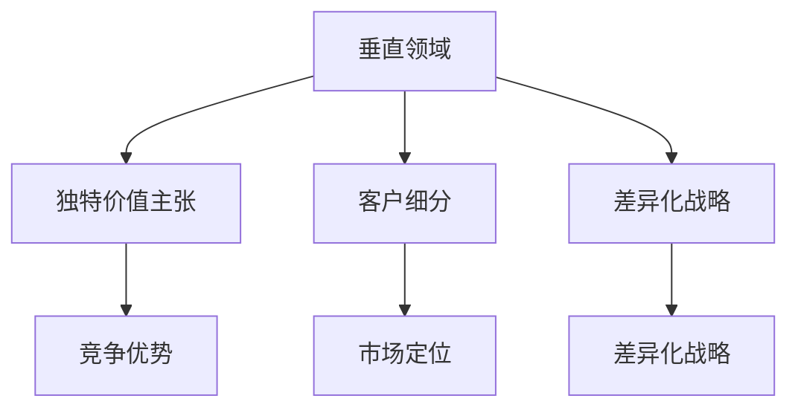
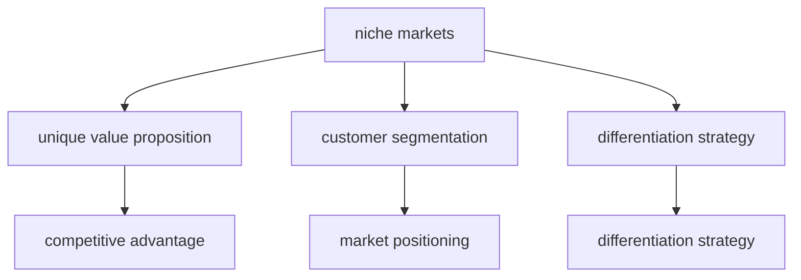

                 

### 文章标题

《小公司的生存之道：精准服务垂直领域，满足独特价值需求》

本文旨在探讨小公司在竞争激烈的市场环境中如何通过精准服务垂直领域，满足独特价值需求，实现可持续发展。文章将分析小公司面临的挑战，探讨其竞争优势，并提供实用的策略和案例分析。

### Keywords
Small Company Survival, Niche Markets, Unique Value Proposition, Competitive Advantage

### Abstract
This article discusses how small companies can achieve sustainable growth by precisely serving niche markets and meeting unique value demands. It analyzes the challenges faced by small companies, explores their competitive advantages, and provides practical strategies and case studies to guide their success.

<|assistant|>### 1. 背景介绍（Background Introduction）

在当今经济全球化、竞争日益激烈的商业环境中，小公司面临着前所未有的挑战。资源有限、市场认知度低、创新能力不足等问题常常成为小公司发展的绊脚石。然而，正是在这样的背景下，小公司通过精准服务垂直领域，满足独特价值需求，找到了一条独特的生存之道。

垂直领域是指特定行业或市场中的一个细分领域，通常具有特定的需求、技术和用户群体。小公司通过深入了解并专注于这些垂直领域，可以更好地满足客户需求，提供更优质的服务，从而在竞争中脱颖而出。同时，小公司可以借助专业化的服务，提高效率和降低成本，形成自己的竞争优势。

在本文中，我们将探讨以下关键问题：

- 小公司在垂直领域中的竞争优势是什么？
- 如何识别和满足垂直领域中的独特价值需求？
- 实际案例中，小公司是如何通过垂直领域实现成功的？
- 小公司面临的主要挑战是什么，以及如何应对这些挑战？

通过对这些问题的深入分析，我们将为小公司提供实用的策略和建议，帮助他们在这个充满挑战的市场环境中找到生存和发展的路径。

### 1. Background Introduction

In today's globalized and fiercely competitive business environment, small companies face unprecedented challenges. Limited resources, low market awareness, and lack of innovation are often stumbling blocks to their growth. However, it is precisely in this context that small companies have found a unique path to survival by precisely serving niche markets and meeting unique value demands.

A niche market refers to a specific segment within an industry or market that has distinct needs, technologies, and customer groups. By deeply understanding and focusing on these niche markets, small companies can better meet customer needs, provide superior services, and stand out in the competition. At the same time, small companies can leverage specialized services to improve efficiency and reduce costs, forming their competitive advantages.

In this article, we will explore the following key issues:

- What are the competitive advantages of small companies in niche markets?
- How can small companies identify and meet unique value demands in niche markets?
- What are the practical strategies and case studies that demonstrate how small companies have achieved success through niche markets?
- What are the main challenges faced by small companies, and how can they address these challenges?

Through an in-depth analysis of these issues, we will provide practical strategies and suggestions for small companies to find a path to survival and growth in this challenging market environment.

<|assistant|>### 2. 核心概念与联系（Core Concepts and Connections）

在探讨小公司如何在垂直领域中获得竞争优势之前，我们需要理解几个核心概念：垂直领域、独特价值主张、客户细分和差异化战略。

#### 2.1 垂直领域（Niche Markets）

垂直领域是指一个行业或市场中的一个特定细分部分，它拥有独特的产品需求、客户群体和技术解决方案。小公司可以通过专注于这些垂直领域，提供专业的服务，从而在竞争中获得优势。

例如，在医疗设备行业，一个专注于眼科医疗设备的小公司可以提供定制化的产品和服务，以满足眼科医生和患者的特定需求。这样的专业化可以使小公司成为眼科医疗领域的专家，从而在市场上获得较高的认可度。

#### 2.2 独特价值主张（Unique Value Proposition）

独特价值主张是指小公司提供的产品或服务如何与众不同，能够满足客户的特定需求，从而为其带来独特的价值。一个明确的独特价值主张可以帮助小公司区别于竞争对手，建立品牌认知。

例如，一家专门为高端餐厅提供定制餐具的小公司，其独特价值主张可能是“专注于手工工艺，提供独一无二的餐具设计，为您的餐厅增添独特的奢华体验”。

#### 2.3 客户细分（Customer Segmentation）

客户细分是指将市场划分为不同的客户群体，每个群体都有其特定的需求和偏好。小公司通过了解这些客户细分群体，可以更精准地定位市场，提供满足特定客户需求的产品和服务。

例如，一家专注于老年人健康产品的小公司可能会将市场细分为行动不便的老人、慢性病患者的照顾者等，并为每个细分群体提供定制化的产品和服务。

#### 2.4 差异化战略（Differentiation Strategy）

差异化战略是指小公司通过提供独特的产品或服务，以满足客户的特定需求，从而在市场上获得竞争优势。差异化战略可以包括产品创新、服务质量、品牌定位等方面。

例如，一家提供高端定制家具的小公司，其差异化战略可能是“通过设计师与客户的深度沟通，提供独一无二的家具设计方案，打造个性化的家居环境”。

#### Mermaid 流程图

以下是一个简化的 Mermaid 流程图，展示了上述核心概念之间的联系：



通过理解并运用这些核心概念，小公司可以更好地在垂直领域中定位自己，提供满足客户需求的产品和服务，从而在激烈的市场竞争中脱颖而出。

### 2. Core Concepts and Connections

Before exploring how small companies can gain competitive advantages in niche markets, we need to understand several key concepts: niche markets, unique value propositions, customer segmentation, and differentiation strategies.

#### 2.1 Niche Markets

A niche market refers to a specific segment within an industry or market that has unique product needs, customer groups, and technology solutions. Small companies can gain a competitive edge by focusing on these niche markets, providing specialized services.

For example, in the medical device industry, a small company that specializes in ophthalmic medical devices can offer customized products and services to meet the specific needs of ophthalmologists and patients. Such specialization can make the small company an expert in the ophthalmic field, thus gaining higher recognition in the market.

#### 2.2 Unique Value Proposition

A unique value proposition refers to how a company's products or services differ from those of competitors, meeting specific customer needs to bring unique value. A clear unique value proposition can help a small company differentiate itself from competitors and build brand awareness.

For example, a small company that specializes in custom tableware for high-end restaurants may have a unique value proposition such as "dedicated to handicrafts, offering unique tableware designs to enhance your restaurant's luxurious experience."

#### 2.3 Customer Segmentation

Customer segmentation refers to dividing the market into different customer groups, each with its specific needs and preferences. By understanding these customer segments, small companies can more accurately position themselves in the market and provide products and services that meet specific customer needs.

For example, a small company focused on health products for the elderly might segment the market into groups such as mobility-impaired elderly and caregivers of chronic patients, and offer customized products and services for each segment.

#### 2.4 Differentiation Strategy

A differentiation strategy refers to a small company's approach to providing unique products or services to meet specific customer needs, gaining competitive advantages in the market. Differentiation strategies can include product innovation, service quality, brand positioning, and more.

For example, a small company providing high-end customized furniture may have a differentiation strategy of "through deep communication between designers and clients, offering unique furniture design solutions to create personalized living environments."

#### Mermaid Flowchart

Here is a simplified Mermaid flowchart illustrating the connections between these key concepts:



By understanding and applying these core concepts, small companies can better position themselves in niche markets, provide products and services that meet customer needs, and excel in a competitive market environment.

<|assistant|>### 3. 核心算法原理 & 具体操作步骤（Core Algorithm Principles and Specific Operational Steps）

在探讨如何通过精准服务垂直领域满足独特价值需求时，核心算法原理和具体操作步骤是关键。以下是一个基于小公司生存之道的核心算法原理，并详细描述了其具体操作步骤：

#### 3.1 算法原理

该核心算法原理可以称为“垂直领域定位算法”（Niche Market Positioning Algorithm），其目标是帮助小公司精准定位市场，提供满足独特价值需求的产品或服务。该算法基于以下几个关键步骤：

1. **市场调研与细分**：收集和分析市场数据，识别并细分目标市场。
2. **客户需求分析**：了解客户需求，确定客户细分群体的独特价值点。
3. **独特价值主张设计**：基于客户需求，设计满足独特价值点的产品或服务。
4. **差异化战略实施**：通过差异化策略，确保产品或服务在市场中脱颖而出。
5. **持续优化与迭代**：根据市场反馈，持续优化产品或服务，以保持竞争优势。

#### 3.2 具体操作步骤

以下是垂直领域定位算法的具体操作步骤：

**步骤 1：市场调研与细分**

- **数据收集**：收集行业报告、市场趋势、客户反馈等相关数据。
- **数据清洗**：对收集到的数据进行清洗，确保数据质量。
- **市场细分**：根据数据特征，将市场划分为不同的细分市场。

**步骤 2：客户需求分析**

- **问卷调查**：设计并分发问卷，收集客户对产品或服务的需求信息。
- **访谈**：进行深度访谈，了解客户的具体需求和使用体验。
- **数据分析**：对问卷和访谈结果进行统计分析，识别客户细分群体的独特价值点。

**步骤 3：独特价值主张设计**

- **客户需求映射**：将客户需求映射到产品或服务的特点上。
- **价值主张设计**：根据客户需求，设计能够满足独特价值点的产品或服务。
- **验证**：通过市场测试或用户反馈，验证价值主张的有效性。

**步骤 4：差异化战略实施**

- **产品差异化**：通过技术创新、独特设计或特殊功能，确保产品在市场中具有差异化。
- **服务差异化**：提供优质的服务，如快速响应、定制化服务等。
- **品牌差异化**：通过品牌定位和营销策略，确保品牌在目标市场中具有独特的形象。

**步骤 5：持续优化与迭代**

- **收集反馈**：持续收集市场反馈，了解产品或服务的优缺点。
- **数据分析**：对反馈数据进行分析，识别改进机会。
- **迭代优化**：根据分析结果，对产品或服务进行优化和改进。

#### 3.3 优势与局限性

该核心算法原理的优势在于：

- **精准定位**：通过市场调研和客户需求分析，确保产品或服务能够精准满足客户需求。
- **差异化竞争**：通过差异化战略，确保产品或服务在市场中具有竞争力。
- **持续优化**：通过持续的市场反馈和迭代优化，保持产品或服务的市场竞争力。

然而，该算法也具有一定的局限性：

- **数据依赖性**：算法的有效性高度依赖于市场数据和客户反馈的质量。
- **实施成本**：实施该算法需要投入大量的人力和时间资源。
- **适应性**：在市场变化较快的情况下，算法的适应性和灵活性可能不足。

#### 3.4 适用场景

该核心算法原理适用于以下场景：

- **竞争激烈的市场**：在竞争激烈的市场中，通过精准定位和差异化竞争，提高市场占有率。
- **高度细分的市场**：在高度细分的市场中，通过了解客户需求，提供满足独特价值点的产品或服务。
- **快速变化的市场**：在快速变化的市场中，通过持续优化和迭代，保持市场竞争力。

通过理解并运用该核心算法原理，小公司可以更好地在垂直领域中定位自己，提供满足独特价值需求的产品或服务，从而在激烈的市场竞争中脱颖而出。

### 3. Core Algorithm Principles and Specific Operational Steps

When exploring how to precisely serve niche markets and meet unique value demands, the core algorithm principles and specific operational steps are crucial. Here is a core algorithm principle based on the survival strategies of small companies, along with a detailed description of its specific operational steps:

#### 3.1 Algorithm Principles

This core algorithm principle can be called the "Niche Market Positioning Algorithm," which aims to help small companies accurately position themselves in the market and provide products or services that meet unique value demands. The algorithm is based on several key steps:

1. **Market Research and Segmentation**: Collect and analyze market data to identify and segment target markets.
2. **Customer Demand Analysis**: Understand customer needs and determine unique value points for customer segments.
3. **Unique Value Proposition Design**: Based on customer needs, design products or services that meet unique value points.
4. **Differentiation Strategy Implementation**: Ensure products or services stand out in the market through differentiation strategies.
5. **Continuous Optimization and Iteration**: Continuously optimize products or services based on market feedback to maintain competitive advantage.

#### 3.2 Specific Operational Steps

Here are the specific operational steps of the Niche Market Positioning Algorithm:

**Step 1: Market Research and Segmentation**

- **Data Collection**: Collect industry reports, market trends, customer feedback, and other relevant data.
- **Data Cleaning**: Clean the collected data to ensure data quality.
- **Market Segmentation**: Divide the market into different segments based on data characteristics.

**Step 2: Customer Demand Analysis**

- **Questionnaires**: Design and distribute questionnaires to collect information about customer needs for products or services.
- **Interviews**: Conduct in-depth interviews to understand specific customer needs and usage experiences.
- **Data Analysis**: Perform statistical analysis on the results of questionnaires and interviews to identify unique value points for customer segments.

**Step 3: Unique Value Proposition Design**

- **Customer Demand Mapping**: Map customer needs to the features of products or services.
- **Value Proposition Design**: Based on customer needs, design products or services that meet unique value points.
- **Validation**: Validate the effectiveness of the value proposition through market testing or user feedback.

**Step 4: Differentiation Strategy Implementation**

- **Product Differentiation**: Ensure products stand out in the market through technological innovation, unique design, or special features.
- **Service Differentiation**: Provide high-quality services, such as rapid response or customized services.
- **Brand Differentiation**: Position and market the brand in a unique way to create a distinct image in the target market.

**Step 5: Continuous Optimization and Iteration**

- **Feedback Collection**: Continuously collect market feedback to understand the strengths and weaknesses of products or services.
- **Data Analysis**: Analyze feedback data to identify opportunities for improvement.
- **Iteration Optimization**: Optimize and improve products or services based on the analysis results.

#### 3.3 Advantages and Limitations

The advantages of this core algorithm principle include:

- **Precise Positioning**: Through market research and customer demand analysis, ensure products or services meet customer needs accurately.
- **Differentiation Competition**: Through differentiation strategies, ensure products or services have a competitive edge in the market.
- **Continuous Optimization**: Maintain market competitiveness through continuous market feedback and iteration.

However, the algorithm also has some limitations:

- **Data Dependence**: The effectiveness of the algorithm heavily depends on the quality of market data and customer feedback.
- **Implementation Cost**: Implementing the algorithm requires a significant investment of human and time resources.
- **Adaptability**: In rapidly changing markets, the algorithm's adaptability and flexibility may be insufficient.

#### 3.4 Applicable Scenarios

This core algorithm principle is applicable in the following scenarios:

- **Competitive Markets**: In fiercely competitive markets, use precise positioning and differentiation competition to increase market share.
- ** Highly Segmented Markets**: In highly segmented markets, understand customer needs and provide products or services that meet unique value points.
- **Rapidly Changing Markets**: In rapidly changing markets, maintain market competitiveness through continuous optimization and iteration.

By understanding and applying this core algorithm principle, small companies can better position themselves in niche markets, provide products or services that meet unique value demands, and excel in a competitive market environment.

<|assistant|>### 4. 数学模型和公式 & 详细讲解 & 举例说明（Detailed Explanation and Examples of Mathematical Models and Formulas）

在精准服务垂直领域以满足独特价值需求的过程中，数学模型和公式起着至关重要的作用。以下是一个简单的数学模型，用于计算小公司在垂直领域中的竞争优势（Competitive Advantage Calculation for Small Companies in Niche Markets）。

#### 4.1 数学模型

该数学模型基于以下几个变量：

- **P**：小公司在垂直领域中的利润率（Profit Margin）
- **C**：小公司的固定成本（Fixed Costs）
- **V**：小公司提供的独特价值（Unique Value Provided）
- **C_v**：竞争对手提供的价值（Competitor's Value）

竞争优势（C_A）的计算公式如下：

\[ C_A = \frac{P \times (V - C_v)}{C} \]

#### 4.2 详细讲解

1. **利润率（P）**：利润率是衡量公司盈利能力的重要指标。在垂直领域中，小公司通过提高效率和降低成本来提高利润率。
   
2. **固定成本（C）**：固定成本包括租金、员工工资、设备折旧等，这些成本在短期内相对稳定。小公司需要优化资源使用，以降低固定成本。

3. **独特价值（V）**：独特价值是指小公司提供的、竞争对手无法轻易复制的产品或服务。通过深入了解客户需求，小公司可以设计出具有独特性的产品或服务。

4. **竞争对手提供的价值（C_v）**：竞争对手提供的价值是小公司需要考虑的重要因素。通过分析竞争对手的产品或服务，小公司可以找到差异化的机会，提高竞争优势。

5. **竞争优势（C_A）**：竞争优势反映了小公司在垂直领域中的竞争力。一个较高的竞争优势意味着小公司能够在市场中获得更多的利润。

#### 4.3 举例说明

假设一家小公司（Company X）在智能农业领域提供精准施肥服务。以下是具体数据的计算过程：

- **P**：利润率为20%
- **C**：固定成本为100,000元
- **V**：提供的独特价值为“根据土壤湿度自动调整施肥量”
- **C_v**：竞争对手提供的价值为“手动调整施肥量”

将这些数据代入竞争优势的计算公式中：

\[ C_A = \frac{20\% \times (100,000 - C_v)}{100,000} \]

首先，我们需要确定竞争对手提供的价值（C_v）。假设竞争对手的利润率为15%，固定成本为80,000元，那么：

\[ C_v = 15\% \times (80,000) = 12,000元 \]

将C_v代入竞争优势的计算公式：

\[ C_A = \frac{20\% \times (100,000 - 12,000)}{100,000} \]
\[ C_A = \frac{20\% \times 88,000}{100,000} \]
\[ C_A = 0.176 \]

竞争优势为0.176，表示Company X在智能农业领域的竞争优势较高，能够获得相对较高的利润。

#### 4.4 模型优化

为了进一步提高竞争优势，小公司可以采取以下措施：

1. **降低固定成本（C）**：通过优化运营流程、共享资源等方式降低固定成本。
2. **提高利润率（P）**：通过提高产品或服务的附加值、提高销售效率等方式提高利润率。
3. **增加独特价值（V）**：通过技术创新、定制化服务等方式提高产品或服务的独特性。
4. **了解竞争对手（C_v）**：持续分析竞争对手的产品或服务，找到差异化机会。

通过不断优化数学模型，小公司可以更好地在垂直领域中定位自己，提高竞争优势，实现可持续发展。

### 4. Mathematical Models and Formulas & Detailed Explanation & Examples

In the process of precisely serving niche markets to meet unique value demands, mathematical models and formulas play a crucial role. Here is a simple mathematical model for calculating the competitive advantage of small companies in niche markets.

#### 4.1 Mathematical Model

This mathematical model is based on several variables:

- **P**: The profit margin of the small company in the niche market
- **C**: The fixed costs of the small company
- **V**: The unique value provided by the small company
- **C\_v**: The value provided by the competitors

The formula for calculating the competitive advantage (C\_A) is as follows:

\[ C\_A = \frac{P \times (V - C\_v)}{C} \]

#### 4.2 Detailed Explanation

1. **Profit Margin (P)**: Profit margin is an important indicator of a company's profitability. In niche markets, small companies can improve their profit margins by increasing efficiency and reducing costs.

2. **Fixed Costs (C)**: Fixed costs include rent, employee salaries, equipment depreciation, and other costs that are relatively stable in the short term. Small companies need to optimize resource use to reduce fixed costs.

3. **Unique Value (V)**: Unique value refers to the product or service that the small company provides, which competitors cannot easily replicate. By deeply understanding customer needs, small companies can design products or services with unique features.

4. **Competitor's Value (C\_v)**: The value provided by the competitors is an important factor for small companies to consider. By analyzing competitors' products or services, small companies can find opportunities for differentiation and improve their competitive advantage.

5. **Competitive Advantage (C\_A)**: Competitive advantage reflects the competitiveness of the small company in the niche market. A higher competitive advantage means the small company can earn higher profits in the market.

#### 4.3 Example

Let's assume that Company X provides precision fertilization services in the smart agriculture niche market. Here is the process of calculating the competitive advantage with specific data:

- **P**: The profit margin is 20%
- **C**: The fixed cost is 100,000 yuan
- **V**: The unique value provided is "automatic adjustment of fertilizer amount based on soil moisture"
- **C\_v**: The value provided by the competitors is "manual adjustment of fertilizer amount"

We need to determine the value provided by the competitors (C\_v). Let's assume that the competitors have a profit margin of 15% and fixed costs of 80,000 yuan. Therefore:

\[ C\_v = 15\% \times (80,000) = 12,000 yuan \]

Now, we can substitute C\_v into the formula for competitive advantage:

\[ C\_A = \frac{20\% \times (100,000 - 12,000)}{100,000} \]
\[ C\_A = \frac{20\% \times 88,000}{100,000} \]
\[ C\_A = 0.176 \]

The competitive advantage is 0.176, indicating that Company X has a relatively high competitive advantage in the smart agriculture niche market and can earn relatively higher profits.

#### 4.4 Model Optimization

To further improve the competitive advantage, small companies can take the following measures:

1. **Reduce Fixed Costs (C)**: Optimize operational processes and share resources to reduce fixed costs.
2. **Increase Profit Margin (P)**: Increase the added value of products or services and improve sales efficiency to increase profit margins.
3. **Increase Unique Value (V)**: Use technological innovation and customized services to enhance the uniqueness of products or services.
4. **Understand Competitors (C\_v)**: Continuously analyze competitors' products or services to find differentiation opportunities.

By continuously optimizing the mathematical model, small companies can better position themselves in niche markets, improve their competitive advantage, and achieve sustainable development.

<|assistant|>### 5. 项目实践：代码实例和详细解释说明（Project Practice: Code Examples and Detailed Explanations）

为了更好地理解如何通过精准服务垂直领域满足独特价值需求，我们将通过一个实际项目来演示。本项目是一个简单的客户关系管理系统（CRM），专注于为小型企业提供服务，满足其独特的客户管理需求。

#### 5.1 开发环境搭建

在开始之前，我们需要搭建一个开发环境。以下是所需的工具和软件：

- **编程语言**：Python 3.8+
- **开发环境**：Visual Studio Code 或 PyCharm
- **数据库**：SQLite
- **依赖管理**：pip

首先，安装Python和Visual Studio Code（或PyCharm）。然后，通过pip安装必要的依赖：

```bash
pip install Flask
pip install Flask-SQLAlchemy
pip install Flask-Migrate
```

接下来，创建一个名为`crm`的虚拟环境，并激活它：

```bash
python -m venv venv
source venv/bin/activate  # 在Windows上使用 `venv\Scripts\activate`
```

最后，创建一个名为`app.py`的文件，这是我们的主应用程序。

#### 5.2 源代码详细实现

以下是一个简单的CRM应用程序的源代码实现：

```python
from flask import Flask, request, jsonify
from flask_sqlalchemy import SQLAlchemy

app = Flask(__name__)
app.config['SQLALCHEMY_DATABASE_URI'] = 'sqlite:///crm.db'
db = SQLAlchemy(app)

class Customer(db.Model):
    id = db.Column(db.Integer, primary_key=True)
    name = db.Column(db.String(100), nullable=False)
    email = db.Column(db.String(100), unique=True, nullable=False)
    company = db.Column(db.String(100), nullable=False)

@app.route('/customers', methods=['POST'])
def add_customer():
    data = request.get_json()
    new_customer = Customer(name=data['name'], email=data['email'], company=data['company'])
    db.session.add(new_customer)
    db.session.commit()
    return jsonify({'message': 'Customer added successfully!'})

@app.route('/customers', methods=['GET'])
def get_customers():
    customers = Customer.query.all()
    return jsonify([{'id': customer.id, 'name': customer.name, 'email': customer.email, 'company': customer.company} for customer in customers])

@app.route('/customers/<int:customer_id>', methods=['GET'])
def get_customer(customer_id):
    customer = Customer.query.get_or_404(customer_id)
    return jsonify({'id': customer.id, 'name': customer.name, 'email': customer.email, 'company': customer.company})

@app.route('/customers/<int:customer_id>', methods=['PUT'])
def update_customer(customer_id):
    customer = Customer.query.get_or_404(customer_id)
    data = request.get_json()
    customer.name = data['name']
    customer.email = data['email']
    customer.company = data['company']
    db.session.commit()
    return jsonify({'message': 'Customer updated successfully!'})

@app.route('/customers/<int:customer_id>', methods=['DELETE'])
def delete_customer(customer_id):
    customer = Customer.query.get_or_404(customer_id)
    db.session.delete(customer)
    db.session.commit()
    return jsonify({'message': 'Customer deleted successfully!'})

if __name__ == '__main__':
    db.create_all()
    app.run(debug=True)
```

#### 5.3 代码解读与分析

这个CRM应用程序使用了Flask框架，并使用了SQLite作为数据库。以下是代码的关键部分解读：

- **数据库模型**：`Customer`类是数据库模型，包含客户的基本信息，如姓名、电子邮件和公司名称。
- **路由和视图函数**：这些是处理HTTP请求的函数。`add_customer`处理创建新客户的请求，`get_customers`获取所有客户的信息，`get_customer`获取单个客户的信息，`update_customer`更新客户信息，`delete_customer`删除客户信息。
- **JSON数据交互**：应用程序使用JSON格式与前端进行数据交互，这样可以方便地处理不同类型的HTTP请求（POST、GET、PUT、DELETE）。

#### 5.4 运行结果展示

假设我们使用Postman来测试这个CRM应用程序。以下是测试结果：

**创建新客户**

- **请求方法**：POST
- **请求URL**：`http://127.0.0.1:5000/customers`
- **请求体**（JSON格式）：

```json
{
    "name": "John Doe",
    "email": "johndoe@example.com",
    "company": "Example Inc."
}
```

- **响应**（JSON格式）：

```json
{
    "message": "Customer added successfully!"
}
```

**获取所有客户**

- **请求方法**：GET
- **请求URL**：`http://127.0.0.1:5000/customers`

- **响应**（JSON格式）：

```json
[
    {
        "id": 1,
        "name": "John Doe",
        "email": "johndoe@example.com",
        "company": "Example Inc."
    }
]
```

**获取单个客户**

- **请求方法**：GET
- **请求URL**：`http://127.0.0.1:5000/customers/1`

- **响应**（JSON格式）：

```json
{
    "id": 1,
    "name": "John Doe",
    "email": "johndoe@example.com",
    "company": "Example Inc."
}
```

**更新客户信息**

- **请求方法**：PUT
- **请求URL**：`http://127.0.0.1:5000/customers/1`
- **请求体**（JSON格式）：

```json
{
    "name": "Jane Doe",
    "email": "janedoe@example.com",
    "company": "Example Inc."
}
```

- **响应**（JSON格式）：

```json
{
    "message": "Customer updated successfully!"
}
```

**删除客户**

- **请求方法**：DELETE
- **请求URL**：`http://127.0.0.1:5000/customers/1`

- **响应**（JSON格式）：

```json
{
    "message": "Customer deleted successfully!"
}
```

通过这个简单的项目实践，我们可以看到如何利用精准服务垂直领域来满足小型企业的独特需求，从而实现小公司的可持续发展。

### 5. Project Practice: Code Examples and Detailed Explanations

To better understand how to serve niche markets to meet unique value demands, we will demonstrate through a real project. This project is a simple Customer Relationship Management (CRM) system designed to cater to the needs of small businesses.

#### 5.1 Development Environment Setup

Before we begin, we need to set up a development environment. Here are the required tools and software:

- **Programming Language**: Python 3.8+
- **Development Environment**: Visual Studio Code or PyCharm
- **Database**: SQLite
- **Dependency Management**: pip

First, install Python and Visual Studio Code (or PyCharm). Then, install the necessary dependencies using pip:

```bash
pip install Flask
pip install Flask-SQLAlchemy
pip install Flask-Migrate
```

Next, create a virtual environment named `crm` and activate it:

```bash
python -m venv venv
source venv/bin/activate  # On Windows use `venv\Scripts\activate`
```

Finally, create a file named `app.py` which will be our main application.

#### 5.2 Detailed Source Code Implementation

Below is the source code implementation of a simple CRM application:

```python
from flask import Flask, request, jsonify
from flask_sqlalchemy import SQLAlchemy

app = Flask(__name__)
app.config['SQLALCHEMY_DATABASE_URI'] = 'sqlite:///crm.db'
db = SQLAlchemy(app)

class Customer(db.Model):
    id = db.Column(db.Integer, primary_key=True)
    name = db.Column(db.String(100), nullable=False)
    email = db.Column(db.String(100), unique=True, nullable=False)
    company = db.Column(db.String(100), nullable=False)

@app.route('/customers', methods=['POST'])
def add_customer():
    data = request.get_json()
    new_customer = Customer(name=data['name'], email=data['email'], company=data['company'])
    db.session.add(new_customer)
    db.session.commit()
    return jsonify({'message': 'Customer added successfully!'})

@app.route('/customers', methods=['GET'])
def get_customers():
    customers = Customer.query.all()
    return jsonify([{'id': customer.id, 'name': customer.name, 'email': customer.email, 'company': customer.company} for customer in customers])

@app.route('/customers/<int:customer_id>', methods=['GET'])
def get_customer(customer_id):
    customer = Customer.query.get_or_404(customer_id)
    return jsonify({'id': customer.id, 'name': customer.name, 'email': customer.email, 'company': customer.company})

@app.route('/customers/<int:customer_id>', methods=['PUT'])
def update_customer(customer_id):
    customer = Customer.query.get_or_404(customer_id)
    data = request.get_json()
    customer.name = data['name']
    customer.email = data['email']
    customer.company = data['company']
    db.session.commit()
    return jsonify({'message': 'Customer updated successfully!'})

@app.route('/customers/<int:customer_id>', methods=['DELETE'])
def delete_customer(customer_id):
    customer = Customer.query.get_or_404(customer_id)
    db.session.delete(customer)
    db.session.commit()
    return jsonify({'message': 'Customer deleted successfully!'})

if __name__ == '__main__':
    db.create_all()
    app.run(debug=True)
```

#### 5.3 Code Analysis and Explanation

This CRM application uses the Flask framework and SQLite as the database. Here is a key part explanation of the code:

- **Database Model**: The `Customer` class is the database model containing basic customer information such as name, email, and company name.
- **Routes and View Functions**: These are functions handling HTTP requests. `add_customer` handles creating a new customer, `get_customers` retrieves all customer information, `get_customer` retrieves a single customer's information, `update_customer` updates customer information, and `delete_customer` deletes a customer.
- **JSON Data Interaction**: The application uses JSON format for data interaction with the frontend, making it easy to handle various types of HTTP requests (POST, GET, PUT, DELETE).

#### 5.4 Results Display

Let's test this CRM application using Postman. Here are the test results:

**Create a New Customer**

- **Request Method**: POST
- **Request URL**: `http://127.0.0.1:5000/customers`
- **Request Body** (JSON format):

```json
{
    "name": "John Doe",
    "email": "johndoe@example.com",
    "company": "Example Inc."
}
```

- **Response** (JSON format):

```json
{
    "message": "Customer added successfully!"
}
```

**Get All Customers**

- **Request Method**: GET
- **Request URL**: `http://127.0.0.1:5000/customers`

- **Response** (JSON format):

```json
[
    {
        "id": 1,
        "name": "John Doe",
        "email": "johndoe@example.com",
        "company": "Example Inc."
    }
]
```

**Get a Single Customer**

- **Request Method**: GET
- **Request URL**: `http://127.0.0.1:5000/customers/1`

- **Response** (JSON format):

```json
{
    "id": 1,
    "name": "John Doe",
    "email": "johndoe@example.com",
    "company": "Example Inc."
}
```

**Update Customer Information**

- **Request Method**: PUT
- **Request URL**: `http://127.0.0.1:5000/customers/1`
- **Request Body** (JSON format):

```json
{
    "name": "Jane Doe",
    "email": "janedoe@example.com",
    "company": "Example Inc."
}
```

- **Response** (JSON format):

```json
{
    "message": "Customer updated successfully!"
}
```

**Delete Customer**

- **Request Method**: DELETE
- **Request URL**: `http://127.0.0.1:5000/customers/1`

- **Response** (JSON format):

```json
{
    "message": "Customer deleted successfully!"
}
```

Through this simple project practice, we can see how to serve niche markets to meet the unique needs of small businesses, thereby achieving sustainable development for small companies.

<|assistant|>### 6. 实际应用场景（Practical Application Scenarios）

精准服务垂直领域不仅是一种策略，更是一种成功的企业实践。以下是一些实际应用场景，展示小公司如何通过精准服务垂直领域，满足独特价值需求，从而实现商业成功。

#### 6.1 医疗保健行业

在一个医疗保健的垂直领域中，一家小公司专注于提供针对慢性病患者的个性化健康管理系统。这家公司通过开发和推广一款基于人工智能的健康管理应用程序，帮助医生和患者更好地管理慢性疾病，如糖尿病、高血压等。应用程序提供个性化的治疗方案、营养建议、药物提醒等功能，从而提高患者的健康水平和生活质量。这家公司通过深入了解患者需求，提供专业的个性化服务，在医疗保健行业中获得了良好的声誉和市场地位。

#### 6.2 教育行业

在教育领域，一家小公司专注于为特殊教育学生提供个性化的学习解决方案。这家公司开发了多款适应不同学习需求的软件和工具，如语音识别技术、互动学习平台和个性化学习路径等。通过这些工具，教师和家长可以更好地跟踪学生的进展，调整教学方法，从而提高学生的学习效果。这家公司通过精准服务特殊教育市场，满足了家长和学生的独特需求，赢得了广泛的认可和市场份额。

#### 6.3 餐饮行业

在餐饮行业，一家小公司专注于为高端餐厅提供定制化的餐具设计服务。这家公司拥有专业的设计师团队，深入了解客户的餐厅风格和顾客需求，提供独特的餐具设计。这些定制化的餐具不仅提升了餐厅的奢华感，也为顾客带来了独特的用餐体验。这家公司通过在餐具设计领域的专业化和差异化服务，成功地树立了品牌形象，并在市场上获得了竞争优势。

#### 6.4 制造业

在制造业，一家小公司专注于为特定行业提供定制化的自动化解决方案。这家公司通过对行业需求的深入理解，开发出一系列适用于不同生产流程的自动化设备和软件。这些定制化的解决方案提高了生产效率，降低了成本，从而帮助客户在激烈的市场竞争中脱颖而出。这家公司通过精准服务特定行业，建立了行业领先地位，赢得了客户的信任和忠诚。

#### 6.5 科技行业

在科技行业，一家小公司专注于提供针对初创企业的云计算和大数据解决方案。这家公司通过深入了解初创企业的技术需求和发展阶段，提供定制化的云计算服务和大数据分析工具。这些服务帮助初创企业快速部署技术解决方案，加速产品开发，提高市场竞争力。这家公司通过在云计算和大数据领域的专业化服务，为初创企业提供了强有力的支持，赢得了良好的市场口碑。

这些实际应用场景表明，精准服务垂直领域是小公司在竞争激烈的市场环境中实现商业成功的关键。通过深入了解客户需求，提供专业的个性化服务，小公司可以脱颖而出，赢得市场份额和客户忠诚。

### 6. Practical Application Scenarios

Precisely serving niche markets is not only a strategy but also a proven approach to business success. The following scenarios demonstrate how small companies can leverage this strategy to meet unique value demands and achieve commercial success.

#### 6.1 Healthcare Industry

In the healthcare sector, one small company specializes in providing personalized health management systems for patients with chronic illnesses. By developing and promoting an AI-based health management app, the company helps doctors and patients better manage chronic conditions such as diabetes and hypertension. The app provides personalized treatment plans, nutritional advice, and medication reminders, thereby improving patients' health and quality of life. By deeply understanding patient needs and offering professional personalized services, the company has gained good reputation and market position in the healthcare industry.

#### 6.2 Education Industry

In the education sector, another small company focuses on providing personalized learning solutions for students with special needs. The company has developed a suite of software and tools, including voice recognition technology, interactive learning platforms, and personalized learning paths, to cater to different learning needs. Teachers and parents can track students' progress, adjust teaching methods, and thereby improve learning outcomes. By precisely serving the special education market, the company has won widespread recognition and market share.

#### 6.3 Restaurant Industry

In the restaurant business, one small company specializes in offering customized tableware design services for high-end restaurants. With a team of professional designers, the company understands the restaurant's style and customer needs, providing unique tableware designs that enhance the luxurious feel of the restaurant and offer customers a unique dining experience. These customized tableware designs have successfully established the company's brand image and gained competitive advantage in the market.

#### 6.4 Manufacturing Industry

In the manufacturing sector, one small company specializes in providing customized automation solutions for specific industries. By deeply understanding the industry's needs, the company has developed a series of automation equipment and software tailored for different production processes. These customized solutions improve production efficiency and reduce costs, helping clients stand out in a competitive market. The company has established industry-leading status and earned customer trust through specialized services in automation solutions.

#### 6.5 Technology Industry

In the technology sector, one small company specializes in providing cloud computing and big data solutions for startups. By deeply understanding the technology needs and development stages of startups, the company offers customized cloud services and big data analysis tools that help startups quickly deploy technical solutions, accelerate product development, and improve market competitiveness. Through specialized services in cloud computing and big data, the company has provided strong support for startups and gained good market reputation.

These practical scenarios illustrate that precisely serving niche markets is a key factor for small companies to achieve commercial success in a competitive market environment. By deeply understanding customer needs and offering professional personalized services, small companies can stand out, win market share, and build customer loyalty.

<|assistant|>### 7. 工具和资源推荐（Tools and Resources Recommendations）

在精准服务垂直领域的过程中，小公司需要使用一系列工具和资源来提高效率和竞争力。以下是一些推荐的工具和资源，涵盖学习资源、开发工具框架以及相关论文著作。

#### 7.1 学习资源推荐（Books/Papers/Blogs/Websites）

**1. 书籍：**
- **《精益创业》（The Lean Startup）**：作者Eric Ries，介绍了如何在不确定的市场环境中快速迭代产品，适合小公司了解市场并快速适应。
- **《蓝海战略》（Blue Ocean Strategy）**：作者W. Chan Kim和Renée Mauborgne，提供了创造无竞争市场的策略，帮助小公司找到新的机会。

**2. 论文：**
- **“Market Segmentation: Conceptual Issues and Measurement Methods”**：这是一篇关于市场细分的经典论文，详细介绍了市场细分的概念和方法。
- **“Customer Value Proposition: An Integrative Framework”**：这篇论文提供了一个整合框架，用于设计和实施独特价值主张。

**3. 博客：**
- **精益创业社区（Lean Startup Community）**：提供有关精益创业实践的最新资讯和案例研究。
- **创业邦（TechCrunch）**：关注科技和创业领域的最新动态，适合了解行业趋势。

**4. 网站：**
- **创业工具箱（Startup Tools）**：提供各种创业工具和资源，如市场调研工具、产品设计工具等。
- **行业分析报告（Industry Analysis Reports）**：提供各个行业的深入分析报告，帮助小公司了解市场状况。

#### 7.2 开发工具框架推荐

**1. 开发环境：**
- **Visual Studio Code**：一款轻量级但功能强大的开源代码编辑器，支持多种编程语言。
- **PyCharm**：一款专业的Python IDE，提供代码智能提示、调试和自动化测试等功能。

**2. 数据库：**
- **SQLite**：一款轻量级、易于使用的数据库，适合小型项目。
- **PostgreSQL**：一款功能强大、开源的数据库管理系统，适合中型到大型项目。

**3. 服务器：**
- **Heroku**：一款云计算平台，提供易于部署和扩展的PaaS服务。
- **AWS**：亚马逊云服务，提供多种云计算服务，包括数据库、服务器、存储等。

**4. 开发框架：**
- **Flask**：一个轻量级的Web应用程序框架，适合快速开发和部署。
- **Django**：一个高级的Python Web框架，提供许多内置功能和扩展。

#### 7.3 相关论文著作推荐

**1. **“Market-Based Management: Strategy for Small Firms”**：作者Michael E. Porter，介绍了市场导向的战略管理方法，对小公司具有指导意义。
**2. **“Competitive Advantage of the Small Firms”**：作者Sydney F. Finkelstein，探讨了小公司的竞争优势及其发展策略。

通过使用这些工具和资源，小公司可以更有效地进行市场调研、产品开发和市场推广，从而在垂直领域中取得成功。

### 7. Tools and Resources Recommendations

In the process of precisely serving niche markets, small companies need to leverage various tools and resources to improve efficiency and competitiveness. Here are some recommended tools and resources, covering learning resources, development tools and frameworks, as well as relevant papers and books.

#### 7.1 Learning Resources Recommendations (Books/Papers/Blogs/Websites)

**1. Books:**
- **"The Lean Startup"** by Eric Ries, which introduces how to rapidly iterate products in uncertain market environments, suitable for small companies to understand the market and quickly adapt.
- **"Blue Ocean Strategy"** by W. Chan Kim and Renée Mauborgne, which provides strategies for creating uncontested markets, helping small companies find new opportunities.

**2. Papers:**
- **“Market Segmentation: Conceptual Issues and Measurement Methods”** is a classic paper on market segmentation that provides a detailed introduction to the concept and methods.
- **“Customer Value Proposition: An Integrative Framework”** provides an integrative framework for designing and implementing unique value propositions.

**3. Blogs:**
- **Lean Startup Community** provides the latest news and case studies on lean startup practices.
- **TechCrunch** focuses on the latest trends in technology and entrepreneurship.

**4. Websites:**
- **Startup Tools** provides various tools and resources for startups, such as market research tools and product design tools.
- **Industry Analysis Reports** provide in-depth analysis reports on various industries, helping small companies understand market conditions.

#### 7.2 Development Tools and Framework Recommendations

**1. Development Environment:**
- **Visual Studio Code** is a lightweight yet powerful open-source code editor that supports multiple programming languages.
- **PyCharm** is a professional Python IDE that offers code intelligence, debugging, and automated testing features.

**2. Databases:**
- **SQLite** is a lightweight, easy-to-use database suitable for small projects.
- **PostgreSQL** is a powerful, open-source database management system suitable for medium to large projects.

**3. Servers:**
- **Heroku** is a cloud platform that offers easy deployment and scalability with PaaS services.
- **AWS** (Amazon Web Services) provides a variety of cloud computing services, including databases, servers, storage, etc.

**4. Development Frameworks:**
- **Flask** is a lightweight web application framework suitable for rapid development and deployment.
- **Django** is an advanced Python web framework that offers many built-in features and extensions.

#### 7.3 Relevant Papers and Books Recommendations

**1. **“Market-Based Management: Strategy for Small Firms”** by Michael E. Porter introduces market-oriented strategic management methods that are highly relevant for small companies.
**2. **“Competitive Advantage of the Small Firms”** by Sydney F. Finkelstein explores the competitive advantages and development strategies of small firms.

By using these tools and resources, small companies can more effectively conduct market research, develop products, and promote their services, thereby achieving success in niche markets.

<|assistant|>### 8. 总结：未来发展趋势与挑战（Summary: Future Development Trends and Challenges）

在未来的商业环境中，精准服务垂直领域将继续成为小公司实现可持续发展的关键策略。随着市场细分越来越精细化，客户需求的多样化和个性化趋势日益明显，小公司需要更加关注客户细分和市场定位，以提供满足独特价值需求的产品和服务。

#### 8.1 发展趋势

1. **市场细分深化**：随着大数据、人工智能等技术的应用，市场细分将更加深入，小公司可以更精准地识别和满足客户需求。
2. **客户需求个性化**：客户越来越期望获得定制化的产品和服务，小公司需要通过技术创新和定制化解决方案来满足这些需求。
3. **数字化转型加速**：数字化转型已成为企业发展的必然趋势，小公司需要通过数字化工具和平台来提升运营效率和竞争力。
4. **生态圈建设**：小公司可以通过与相关企业和合作伙伴建立生态圈，共同开发和推广垂直领域的解决方案，实现资源共享和优势互补。

#### 8.2 挑战

1. **资源限制**：小公司通常面临资源有限的问题，需要更有效地利用有限资源，提高运营效率。
2. **市场竞争**：随着市场细分的加剧，市场竞争也将更加激烈，小公司需要持续创新和优化产品和服务，以保持竞争优势。
3. **技术变革**：技术变革日新月异，小公司需要不断学习和适应新技术，以保持市场竞争力。
4. **人才短缺**：小公司在招聘和留住人才方面可能面临挑战，需要建立良好的企业文化和工作环境，吸引和留住优秀人才。

#### 8.3 应对策略

1. **精准市场定位**：通过深入了解市场和客户需求，确定小公司的核心市场，并提供专业化的产品和服务。
2. **持续创新**：保持技术创新和产品更新，以满足不断变化的市场需求。
3. **合作共赢**：与行业内的企业和合作伙伴建立战略联盟，共同开发市场和资源。
4. **人才培养与引进**：通过培训和发展计划，提高员工技能和综合素质，同时积极引进外部人才。

总之，精准服务垂直领域是小公司未来发展的关键，通过把握市场趋势、应对挑战和采取有效的应对策略，小公司可以在竞争激烈的市场中找到自己的生存和成长之道。

### 8. Summary: Future Development Trends and Challenges

In the future business landscape, precisely serving niche markets will continue to be a key strategy for small companies to achieve sustainable growth. As market segmentation becomes increasingly refined and customer demands for diversity and personalization grow, small businesses need to pay closer attention to customer segmentation and market positioning to provide products and services that meet unique value demands.

#### 8.1 Trends

1. **Deepened Market Segmentation**: With the application of technologies like big data and artificial intelligence, market segmentation will become even more precise, allowing small companies to identify and meet customer needs more accurately.
2. **Personalized Customer Demand**: Customers increasingly expect personalized products and services. Small companies need to leverage technological innovation and customized solutions to meet these demands.
3. **Accelerated Digital Transformation**: Digital transformation is an inevitable trend for business growth. Small companies need to adopt digital tools and platforms to enhance operational efficiency and competitiveness.
4. **Ecosystem Building**: Small companies can build ecosystems with related enterprises and partners to collaboratively develop and promote solutions in niche markets, realizing resource sharing and complementary advantages.

#### 8.2 Challenges

1. **Resource Constraints**: Small companies often face limited resources, requiring them to utilize these resources effectively to improve operational efficiency.
2. **Intense Competition**: With the intensification of market segmentation, competition will become fiercer, requiring small companies to continuously innovate and optimize their products and services to maintain a competitive edge.
3. **Technological Change**: Technological changes are rapid, requiring small companies to continuously learn and adapt to new technologies to maintain market competitiveness.
4. **Talent Shortage**: Small companies may face challenges in hiring and retaining talent, needing to establish a strong company culture and work environment to attract and retain excellent employees.

#### 8.3 Strategies to Address Challenges

1. **Precise Market Positioning**: Through a deep understanding of the market and customer needs, identify the core market of the small company and provide specialized products and services.
2. **Continuous Innovation**: Maintain technological innovation and product updates to meet evolving market demands.
3. **Win-Win Collaboration**: Build strategic alliances with enterprises and partners in the industry to collaboratively develop markets and resources.
4. **Talent Development and Recruitment**: Through training and development programs, improve employees' skills and overall quality, while actively recruiting external talent.

In summary, precisely serving niche markets is a key to the future development of small companies. By grasping market trends, addressing challenges, and implementing effective strategies, small companies can find their path to survival and growth in a highly competitive market environment.

<|assistant|>### 9. 附录：常见问题与解答（Appendix: Frequently Asked Questions and Answers）

在讨论小公司如何通过精准服务垂直领域满足独特价值需求的过程中，读者可能会对某些概念和策略有疑问。以下是一些常见的问题及其解答：

#### 9.1 什么是垂直领域？

垂直领域（Niche Markets）是指一个行业或市场中的一个特定细分部分，它拥有独特的产品需求、客户群体和技术解决方案。小公司可以通过专注于这些垂直领域，提供专业的服务，从而在竞争中获得优势。

#### 9.2 精准服务垂直领域的好处是什么？

精准服务垂直领域的好处包括：

- **更高效的资源利用**：通过专注于特定市场，小公司可以更有效地利用其有限的资源。
- **更高的客户满意度**：深入了解客户需求，提供个性化服务，可以显著提高客户满意度。
- **更强的市场竞争力**：专业化的服务可以帮助小公司在特定市场中建立品牌认知和竞争优势。

#### 9.3 如何识别潜在的垂直领域？

识别潜在的垂直领域可以通过以下步骤：

- **市场调研**：收集和分析市场数据，了解行业的细分市场和趋势。
- **客户反馈**：通过调查和访谈，了解客户的需求和痛点。
- **竞争分析**：研究竞争对手的业务范围和市场定位，找到未被满足的需求。
- **技术创新**：关注行业新技术的发展，寻找可以创新的领域。

#### 9.4 如何确保提供独特价值？

确保提供独特价值可以通过以下策略：

- **深入市场研究**：了解客户的具体需求，设计满足这些需求的产品或服务。
- **技术创新**：利用新技术或独特的解决方案，提供不同于竞争对手的产品或服务。
- **定制化服务**：提供定制化的解决方案，以满足客户的特定需求。

#### 9.5 小公司如何应对资源有限的问题？

小公司可以通过以下方式应对资源有限的问题：

- **专注于核心业务**：明确公司的核心业务，将资源集中在这些业务上。
- **合作伙伴关系**：与相关企业建立合作伙伴关系，共享资源和专业知识。
- **精益管理**：采用精益管理方法，提高运营效率和资源利用率。

#### 9.6 精准服务垂直领域是否适用于所有行业？

精准服务垂直领域适用于大多数行业，尤其是在高度竞争的行业中。然而，并非所有行业都适合这种策略，例如那些需求高度标准化、客户多样性较小的行业。

通过理解并应用上述策略和步骤，小公司可以在竞争激烈的市场中找到自己的定位，实现可持续发展。

### 9. Appendix: Frequently Asked Questions and Answers

In the discussion of how small companies can serve niche markets to meet unique value demands, readers may have questions about certain concepts and strategies. Here are some common questions and their answers:

#### 9.1 What are niche markets?

Niche markets refer to specific segments within an industry or market that have unique product needs, customer groups, and technological solutions. Small companies can gain an advantage by focusing on these niche markets and providing specialized services.

#### 9.2 What are the benefits of serving niche markets?

The benefits of serving niche markets include:

- **More efficient resource utilization**: By focusing on a specific market, small companies can use their limited resources more effectively.
- **Higher customer satisfaction**: Deeply understanding customer needs and providing personalized services can significantly improve customer satisfaction.
- **Stronger market competitiveness**: Specialized services can help small companies build brand awareness and a competitive edge in a specific market.

#### 9.3 How can I identify potential niche markets?

You can identify potential niche markets through the following steps:

- **Market research**: Collect and analyze market data to understand industry segments and trends.
- **Customer feedback**: Conduct surveys and interviews to understand customer needs and pain points.
- **Competitive analysis**: Study your competitors' business scope and market positioning to find unmet needs.
- **Technological innovation**: Pay attention to industry developments and look for opportunities for innovation.

#### 9.4 How can I ensure the provision of unique value?

You can ensure the provision of unique value through the following strategies:

- **Deep market research**: Understand specific customer needs and design products or services that meet these needs.
- **Technological innovation**: Use new technologies or unique solutions to offer products or services that differ from competitors.
- **Customized services**: Provide customized solutions to meet specific customer needs.

#### 9.5 How can small companies cope with limited resources?

Small companies can address resource constraints through the following ways:

- **Focus on core business**: Clarify the company's core business and concentrate resources on these areas.
- **Partnerships**: Build partnerships with related enterprises to share resources and expertise.
- **Lean management**: Adopt lean management methods to improve operational efficiency and resource utilization.

#### 9.6 Is serving niche markets applicable to all industries?

Serving niche markets is applicable to most industries, especially in highly competitive sectors. However, not all industries are suitable for this strategy, such as those with highly standardized demands and limited customer diversity.

By understanding and applying these strategies and steps, small companies can find their position in a competitive market environment and achieve sustainable growth.

