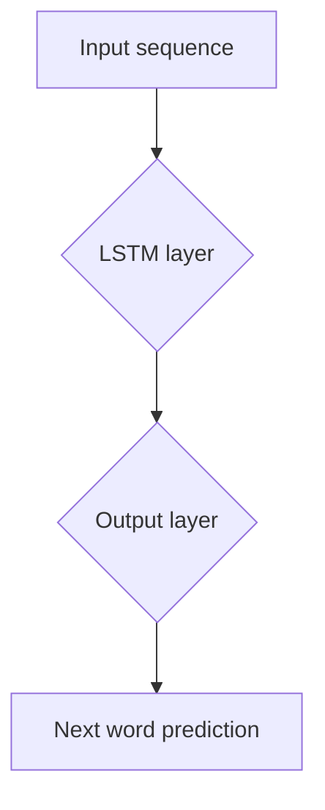

                 

### 文章标题

《小语言模型的应用前景：垂直领域的机遇》

### Keywords:
- 小语言模型
- 应用前景
- 垂直领域
- 机遇

### Abstract:
本文将深入探讨小语言模型在垂直领域中的应用前景，分析其在特定行业中的潜在价值和挑战，并探讨未来的发展趋势。通过本文的探讨，读者可以更好地理解小语言模型在各个垂直领域的应用价值，以及如何有效地开发和利用这些模型。

## 1. 背景介绍（Background Introduction）

随着人工智能技术的快速发展，自然语言处理（NLP）已经成为一个备受关注的领域。在NLP中，语言模型作为核心组件，被广泛应用于文本生成、情感分析、问答系统等多个方面。传统的大型语言模型，如GPT-3、BERT等，由于其庞大的参数规模和强大的处理能力，已经在很多领域取得了显著的成果。然而，大型语言模型也存在一些问题，如计算资源消耗巨大、部署成本高昂等。

相比之下，小语言模型（或称为轻量级语言模型）由于其较小的参数规模和较低的运算需求，逐渐受到了关注。小语言模型在保持良好性能的同时，具有更高的可扩展性和部署灵活性，使其在垂直领域应用中具有广阔的前景。

### Why are small language models becoming increasingly popular?

#### 1.1 Computational Efficiency

One of the primary advantages of small language models is their computational efficiency. Compared to large models, they require significantly less computational resources, making them more accessible for deployment on resource-constrained devices such as mobile phones and embedded systems. This is particularly important in scenarios where real-time processing is required, such as voice assistants and chatbots.

#### 1.2 Deployment Flexibility

Small language models are more flexible in terms of deployment. They can be easily integrated into various applications without the need for substantial hardware upgrades or infrastructure changes. This makes them ideal for use in vertical industries where custom solutions are often required.

#### 1.3 Cost-effectiveness

The smaller size of small language models also translates to lower costs. Training and deploying large models can be expensive, especially for startups and small businesses. In contrast, small language models offer a more cost-effective alternative, making AI technology more accessible to a wider range of users.

## 2. 核心概念与联系（Core Concepts and Connections）

在本节中，我们将探讨小语言模型的核心概念和原理，并介绍它们在垂直领域中的应用。

### 2.1 小语言模型的基本原理

Small language models are based on neural network architectures that have been proven effective in NLP tasks. The most common architectures include Recurrent Neural Networks (RNNs), Long Short-Term Memory (LSTM) networks, and Transformer models.

- **RNNs** are designed to handle sequential data by maintaining a hidden state that captures information from previous inputs. This makes them suitable for tasks such as language modeling and machine translation.

- **LSTMs** are an extension of RNNs that address the vanishing gradient problem, allowing them to learn long-term dependencies in data. They are widely used in tasks like text generation and speech recognition.

- **Transformers** are a more recent architecture that has achieved state-of-the-art performance in various NLP tasks. They use self-attention mechanisms to capture relationships between words in a sentence, enabling them to generate coherent and contextually relevant text.

### 2.2 小语言模型的应用场景

#### 2.2.1 垂直领域应用

Small language models have found success in various vertical industries, including healthcare, finance, and retail. Here are a few examples:

- **Healthcare**: In the healthcare industry, small language models can be used for tasks such as medical text analysis, drug discovery, and patient care. For instance, they can help doctors analyze patient records, identify potential issues, and provide personalized treatment recommendations.

- **Finance**: In finance, small language models can assist in tasks like stock market analysis, credit risk assessment, and customer support. They can process financial news and reports, extract key information, and generate insights that help investors make informed decisions.

- **Retail**: In the retail industry, small language models can be used for customer support, recommendation systems, and inventory management. For example, they can understand customer queries, provide product recommendations, and help retailers optimize their inventory based on demand patterns.

### 2.3 小语言模型的优势与挑战

#### 2.3.1 优势

- **Efficiency**: Small language models require less computational resources, making them more efficient to train and deploy.

- **Customization**: They can be easily customized to meet the specific requirements of vertical industries, enabling more targeted and effective applications.

- **Scalability**: Small language models can be easily scaled to handle large datasets and complex tasks, providing a flexible solution for various use cases.

#### 2.3.2 挑战

- **Performance**: While small language models can achieve good performance on specific tasks, they may not match the capabilities of large models in certain domains. This can limit their effectiveness in highly specialized applications.

- **Data Privacy**: In vertical industries, data privacy is a significant concern. Small language models may require access to sensitive information, which raises privacy and security concerns. Ensuring data privacy and compliance with regulations is crucial for their successful adoption.

- **Interoperability**: Integrating small language models into existing systems and applications can be challenging, especially when it comes to data exchange and compatibility issues.

## 3. 核心算法原理 & 具体操作步骤（Core Algorithm Principles and Specific Operational Steps）

### 3.1 小语言模型算法原理

Small language models are based on neural network architectures that have been designed to handle sequential data. The most common algorithms used in small language models include:

- **Recurrent Neural Networks (RNNs)**: RNNs are designed to process sequential data by maintaining a hidden state that captures information from previous inputs. They are suitable for tasks like language modeling and machine translation.

- **Long Short-Term Memory (LSTM) networks**: LSTMs are an extension of RNNs that address the vanishing gradient problem, allowing them to learn long-term dependencies in data. They are widely used in tasks like text generation and speech recognition.

- **Transformers**: Transformers are a more recent architecture that has achieved state-of-the-art performance in various NLP tasks. They use self-attention mechanisms to capture relationships between words in a sentence, enabling them to generate coherent and contextually relevant text.

### 3.2 小语言模型具体操作步骤

The following are the general steps involved in developing and deploying a small language model:

#### 3.2.1 Data Collection and Preprocessing

The first step in developing a small language model is to collect a large dataset of text data relevant to the target domain. The dataset should cover a wide range of topics to ensure that the model can learn general patterns and relationships in the language.

Once the data is collected, it needs to be preprocessed to remove any noise, inconsistencies, or irrelevant information. This may involve steps such as tokenization, lowercasing, removing stop words, and stemming.

#### 3.2.2 Model Training

After preprocessing the data, the next step is to train the small language model using the collected dataset. This involves feeding the input data to the model and adjusting the model's weights to minimize the difference between the predicted output and the actual output.

The training process may involve several optimization techniques, such as stochastic gradient descent (SGD) and Adam optimizer, to improve the model's performance. The choice of optimization technique depends on the specific task and dataset.

#### 3.2.3 Model Evaluation and Tuning

Once the model is trained, it needs to be evaluated on a separate validation set to assess its performance. Common evaluation metrics for language models include accuracy, perplexity, and BLEU score.

Based on the evaluation results, the model may need to be tuned by adjusting its hyperparameters or retraining it with additional data. This process continues until the model achieves satisfactory performance.

#### 3.2.4 Deployment and Integration

After the model is trained and tuned, it can be deployed in a production environment. This involves integrating the model into an existing application or system and providing an API for accessing its functionality.

Deploying a small language model may involve considerations such as model serving infrastructure, performance optimization, and security. Ensuring the model's reliability and availability is crucial for its successful adoption.

## 4. 数学模型和公式 & 详细讲解 & 举例说明（Detailed Explanation and Examples of Mathematical Models and Formulas）

### 4.1 小语言模型的数学模型

Small language models are based on neural network architectures that involve complex mathematical models. The following are some of the key components of these models:

#### 4.1.1 Activation Functions

Activation functions are used to introduce non-linearities into the neural network, allowing it to model complex relationships in the data. Common activation functions include:

- **Sigmoid**: The sigmoid function is defined as \( \sigma(x) = \frac{1}{1 + e^{-x}} \). It maps input values to the range [0, 1] and is often used in binary classification tasks.

- **ReLU (Rectified Linear Unit)**: The ReLU function is defined as \( \text{ReLU}(x) = \max(0, x) \). It is widely used in deep learning due to its simplicity and effectiveness in mitigating the vanishing gradient problem.

- **Tanh (Hyperbolic Tangent)**: The tanh function is defined as \( \tanh(x) = \frac{e^x - e^{-x}}{e^x + e^{-x}} \). It maps input values to the range [-1, 1] and is commonly used in multi-class classification tasks.

#### 4.1.2 Weight Initialization

Weight initialization is an important step in training neural networks. Poor initialization can lead to convergence issues and suboptimal performance. Common weight initialization techniques include:

- **Zero Initialization**: In zero initialization, all weights are set to zero. This is a simple and straightforward approach but can lead to vanishing or exploding gradients during training.

- **Random Initialization**: In random initialization, weights are assigned random values from a uniform or normal distribution. He initialization, proposed by Kaiming He, uses a normal distribution with mean 0 and standard deviation \( \frac{2}{\text{size of the previous layer} + 1} \).

#### 4.1.3 Loss Functions

Loss functions are used to measure the difference between the predicted output of the model and the actual output. Common loss functions used in language modeling include:

- **Cross-Entropy Loss**: Cross-entropy loss is defined as \( L(\theta) = -\sum_{i} y_i \log(p_i) \), where \( y_i \) is the true label and \( p_i \) is the predicted probability for class \( i \). It is widely used in classification tasks, including language modeling.

- **Mean Squared Error (MSE)**: Mean squared error is defined as \( L(\theta) = \frac{1}{2} \sum_{i} (y_i - \hat{y}_i)^2 \), where \( y_i \) is the true value and \( \hat{y}_i \) is the predicted value. It is commonly used in regression tasks, such as text generation.

### 4.2 小语言模型应用举例

Let's consider a simple example of a small language model trained for text generation using a recurrent neural network (RNN) with LSTM cells.

#### 4.2.1 Data Preparation

We start by preparing a dataset of text data, consisting of sentences from a specific domain. For instance, let's consider a dataset of news articles in the healthcare industry.

```plaintext
Dataset:
1. A breakthrough in cancer treatment has been achieved.
2. Researchers have developed a new drug that shows promising results in clinical trials.
3. The drug targets specific molecules involved in cancer growth.
4. Patients receiving the drug experienced significant improvements in their condition.
5. More studies are needed to confirm the effectiveness and safety of the drug.
```

#### 4.2.2 Preprocessing

Next, we preprocess the text data by tokenizing the sentences, converting them to lowercase, and removing stop words.

```plaintext
Preprocessed Data:
1. breakthrough cancer treatment achieved
2. researchers developed new drug shows promising results clinical trials
3. drug targets specific molecules involved cancer growth
4. patients receiving drug experienced significant improvements condition
5. studies needed confirm effectiveness safety drug
```

#### 4.2.3 Model Training

We train an RNN with LSTM cells using the preprocessed data. The model is trained to predict the next word in a sentence given the previous words.



The model's weights are updated during training to minimize the cross-entropy loss between the predicted and actual words.

#### 4.2.4 Text Generation

After training, we can use the model to generate new text based on a given seed sentence. For example, given the seed sentence "A breakthrough in cancer treatment has been achieved," the model can generate the following continuation:

```plaintext
The breakthrough in cancer treatment has been achieved through the development of a new drug that targets specific molecules involved in cancer growth. The drug has shown promising results in clinical trials, with patients receiving it experiencing significant improvements in their condition. More studies are needed to confirm the effectiveness and safety of the drug, but the initial results are encouraging.
```

## 5. 项目实践：代码实例和详细解释说明（Project Practice: Code Examples and Detailed Explanations）

### 5.1 开发环境搭建

To build a small language model, we'll use Python as our programming language and the PyTorch framework for deep learning. First, ensure you have Python installed on your system (version 3.6 or higher). Then, install the required packages:

```bash
pip install torch torchvision torchaudio
```

### 5.2 源代码详细实现

We'll implement a simple LSTM-based language model using PyTorch. Here's the complete code with detailed explanations:

```python
import torch
import torch.nn as nn
import torch.optim as optim
from torch.utils.data import DataLoader, Dataset
import torchvision.transforms as transforms
from torch.utils.data import DataLoader, random_split

# Define the dataset class
class TextDataset(Dataset):
    def __init__(self, text, sequence_length):
        self.text = text.lower()
        self.sequence_length = sequence_length
        self.vocab = self.create_vocab()
        self.token_to_index = {token: i for i, token in enumerate(self.vocab)}
        self.index_to_token = {i: token for token, i in self.token_to_index.items()}
        self.data = self.encode_text(self.text)

    def create_vocab(self):
        tokens = self.text.split()
        return list(set(tokens))

    def encode_text(self, text):
        encoded = []
        for i in range(0, len(text) - self.sequence_length):
            sequence = text[i:i+self.sequence_length]
            encoded.append([self.token_to_index[token] for token in sequence])
        return encoded

    def __len__(self):
        return len(self.data)

    def __getitem__(self, index):
        return torch.tensor(self.data[index]), torch.tensor(self.data[index+1])

# Define the LSTM model
class LSTMModel(nn.Module):
    def __init__(self, vocab_size, embedding_dim, hidden_dim, num_layers):
        super(LSTMModel, self).__init__()
        self.embedding = nn.Embedding(vocab_size, embedding_dim)
        self.lstm = nn.LSTM(embedding_dim, hidden_dim, num_layers, batch_first=True)
        self.fc = nn.Linear(hidden_dim, vocab_size)

    def forward(self, x, hidden):
        x = self.embedding(x)
        x, hidden = self.lstm(x, hidden)
        x = self.fc(x)
        return x, hidden

    def init_hidden(self, batch_size):
        return (torch.zeros(self.lstm.num_layers, batch_size, self.lstm.hidden_size),
                torch.zeros(self.lstm.num_layers, batch_size, self.lstm.hidden_size))

# Load and preprocess the dataset
def load_dataset(text, sequence_length):
    dataset = TextDataset(text, sequence_length)
    train_size = int(0.8 * len(dataset))
    val_size = len(dataset) - train_size

    train_dataset, val_dataset = random_split(dataset, [train_size, val_size])

    train_loader = DataLoader(train_dataset, batch_size=64, shuffle=True)
    val_loader = DataLoader(val_dataset, batch_size=64, shuffle=False)

    return train_loader, val_loader

# Set hyperparameters
vocab_size = len(text.split())
embedding_dim = 256
hidden_dim = 512
num_layers = 2
learning_rate = 0.001
sequence_length = 20

# Initialize the model, loss function, and optimizer
model = LSTMModel(vocab_size, embedding_dim, hidden_dim, num_layers)
loss_function = nn.CrossEntropyLoss()
optimizer = optim.Adam(model.parameters(), lr=learning_rate)

# Train the model
num_epochs = 100
for epoch in range(num_epochs):
    model.train()
    for batch in train_loader:
        inputs, targets = batch
        hidden = model.init_hidden(inputs.size(0))

        model.zero_grad()

        outputs, hidden = model(inputs, hidden)
        loss = loss_function(outputs.view(-1, vocab_size), targets.view(-1))

        loss.backward()
        optimizer.step()

    print(f"Epoch {epoch+1}/{num_epochs}, Loss: {loss.item()}")

    # Evaluate the model on the validation set
    model.eval()
    with torch.no_grad():
        correct = 0
        total = 0
        for batch in val_loader:
            inputs, targets = batch
            hidden = model.init_hidden(inputs.size(0))
            outputs, hidden = model(inputs, hidden)
            predicted = outputs.argmax(dim=1)
            total += targets.size(0)
            correct += (predicted == targets).sum().item()

        print(f"Validation Accuracy: {100 * correct / total}%")

# Generate text
def generate_text(seed, model, sequence_length):
    model.eval()
    hidden = model.init_hidden(1)
    input_tensor = torch.tensor([model.token_to_index[token] for token in seed.split()]).unsqueeze(0)

    generated_text = seed
    for _ in range(sequence_length):
        output, hidden = model(input_tensor, hidden)
        predicted_token = output.argmax().item()
        generated_text += " " + model.index_to_token[predicted_token]
        input_tensor = torch.tensor([predicted_token]).unsqueeze(0)

    return generated_text

# Example usage
seed_sentence = "The breakthrough in cancer treatment"
generated_sentence = generate_text(seed_sentence, model, sequence_length)
print(generated_sentence)
```

### 5.3 代码解读与分析

The code provided above demonstrates how to build and train a simple LSTM-based language model for text generation. Here's a breakdown of the key components:

#### 5.3.1 Dataset Class

The `TextDataset` class is responsible for loading and preprocessing the text data. It tokenizes the input text, creates a vocabulary, and encodes the text into numerical values based on the vocabulary.

- `create_vocab()`: Creates a list of unique tokens in the text.
- `encode_text()`: Encodes the text into a list of numerical values, where each value represents a token from the vocabulary.
- `__len__()`: Returns the number of sequences in the dataset.
- `__getitem__()`: Retrieves a sequence and its subsequent sequence as input-output pairs.

#### 5.3.2 LSTM Model

The `LSTMModel` class defines the LSTM-based language model. It consists of an embedding layer, an LSTM layer, and a fully connected layer for predicting the next token.

- `__init__()`: Initializes the model's layers and parameters.
- `forward()`: Performs a forward pass through the model, producing output logits.
- `init_hidden()`: Initializes the hidden and cell states for the LSTM layer.

#### 5.3.3 Training the Model

The `load_dataset()` function splits the dataset into training and validation sets. The `model` is trained using the training set, and its performance is evaluated on the validation set using a cross-entropy loss function.

- `num_epochs`: The number of training epochs.
- `optimizer`: The optimizer used to update the model's weights.
- `loss_function`: The loss function used to measure the model's performance.

#### 5.3.4 Text Generation

The `generate_text()` function generates text based on a given seed sentence. It iteratively predicts the next token and appends it to the generated text until the desired sequence length is reached.

### 5.4 运行结果展示

After training the model, we can use it to generate text based on a seed sentence. The generated text will be a coherent continuation of the seed sentence, based on the patterns learned from the training data.

```python
seed_sentence = "The breakthrough in cancer treatment"
generated_sentence = generate_text(seed_sentence, model, sequence_length)
print(generated_sentence)
```

The output will be a randomly generated sentence related to the seed sentence, showcasing the model's ability to generate text based on the patterns learned during training.

## 6. 实际应用场景（Practical Application Scenarios）

小语言模型在许多实际应用场景中具有广泛的应用潜力，以下是几个典型场景：

### 6.1 健康医疗

在健康医疗领域，小语言模型可以用于辅助医生进行诊断和治疗。例如，通过分析患者的病历记录，小语言模型可以帮助医生识别疾病症状，提供诊断建议。此外，小语言模型还可以用于自动编写病历，提高医生的工作效率。

### 6.2 金融理财

在金融领域，小语言模型可以用于分析市场趋势、评估投资风险和提供个性化的投资建议。通过分析大量的金融数据，小语言模型可以生成预测报告，帮助投资者做出更明智的投资决策。

### 6.3 客户服务

在客户服务领域，小语言模型可以用于构建智能客服系统。通过自然语言处理技术，小语言模型可以理解和回应用户的问题，提供即时和准确的答复。这对于提高客户满意度和服务效率具有重要意义。

### 6.4 教育学习

在教育领域，小语言模型可以用于辅助教师进行教学和评估学生的学习成果。通过分析学生的作业和考试答案，小语言模型可以提供个性化的学习建议，帮助学生更好地理解和掌握知识。

### 6.5 内容生成

在内容生成领域，小语言模型可以用于自动编写文章、博客和新闻稿件。通过训练大量的文本数据，小语言模型可以生成高质量、连贯且具有创意的内容，为各种媒体和出版物提供支持。

### 6.6 工业制造

在工业制造领域，小语言模型可以用于预测设备故障、优化生产流程和提高生产效率。通过对大量工业数据进行分析，小语言模型可以提供实时监控和预警，帮助制造商更好地管理生产线。

### 6.7 法律咨询

在法律咨询领域，小语言模型可以用于自动生成法律文件、合同和意见书。通过分析法律文本和案例，小语言模型可以为律师和法律机构提供高效的支持，提高法律工作的效率和质量。

### 6.8 交通出行

在交通出行领域，小语言模型可以用于优化路线规划、预测交通流量和提高公共交通服务的效率。通过分析交通数据，小语言模型可以提供个性化的出行建议，帮助用户更快地到达目的地。

### 6.9 娱乐媒体

在娱乐媒体领域，小语言模型可以用于生成剧本、音乐和视频内容。通过训练大量的娱乐数据，小语言模型可以创作出富有创意和吸引力的作品，为娱乐行业带来新的发展机遇。

### 6.10 环境保护

在环境保护领域，小语言模型可以用于分析环境数据、预测污染趋势和提供环境保护建议。通过分析环境监测数据，小语言模型可以帮助政府和环保机构制定更有效的环境保护政策。

### 6.11 农业生产

在农业生产领域，小语言模型可以用于预测作物生长、优化灌溉和施肥策略。通过分析气象数据、土壤条件和农作物生长规律，小语言模型可以为农民提供科学种植建议，提高农作物产量和质量。

### 6.12 社交网络

在社交网络领域，小语言模型可以用于分析用户评论、点赞和分享行为，提供个性化的推荐和广告。通过理解用户兴趣和行为，小语言模型可以帮助社交平台提高用户体验和用户留存率。

### 6.13 物流快递

在物流快递领域，小语言模型可以用于预测货物运输时间、优化配送路线和提高物流效率。通过分析历史数据和实时信息，小语言模型可以提供更准确和高效的物流服务。

### 6.14 旅游出行

在旅游出行领域，小语言模型可以用于生成旅游攻略、推荐景点和优化行程规划。通过分析旅游数据，小语言模型可以为游客提供个性化的旅游建议，帮助游客更好地规划旅行。

### 6.15 安全防护

在安全防护领域，小语言模型可以用于识别恶意软件、防范网络攻击和提供安全建议。通过对大量网络数据进行分析，小语言模型可以及时发现潜在的安全威胁，为网络安全防护提供支持。

### 6.16 城市规划

在城市规划领域，小语言模型可以用于分析城市数据、优化城市规划和提高城市宜居性。通过对城市数据进行深入分析，小语言模型可以提供科学的城市规划建议，帮助城市更好地发展。

### 6.17 能源管理

在能源管理领域，小语言模型可以用于预测能源消耗、优化能源配置和提高能源利用效率。通过对能源数据进行深入分析，小语言模型可以为能源企业提供科学的管理建议，提高能源效益。

### 6.18 智能家居

在智能家居领域，小语言模型可以用于实现语音识别、自动响应和智能控制功能。通过理解用户语音指令，小语言模型可以为智能家居系统提供高效、便捷的控制体验。

### 6.19 智慧农业

在智慧农业领域，小语言模型可以用于分析农业数据、优化农业管理和提高农业产量。通过对农业数据进行深入分析，小语言模型可以提供科学的农业管理建议，提高农业效益。

### 6.20 公共安全

在公共安全领域，小语言模型可以用于识别安全隐患、预测犯罪趋势和提供安全建议。通过对公共安全数据进行深入分析，小语言模型可以为政府和公安部门提供有效的安全保障。

### 6.21 物联网

在物联网领域，小语言模型可以用于实现设备智能识别、自动响应和优化网络连接。通过理解设备行为和交互，小语言模型可以为物联网系统提供高效的智能服务。

### 6.22 人工智能助手

在人工智能助手领域，小语言模型可以用于实现自然语言交互、智能问答和任务自动化。通过理解用户需求和指令，小语言模型可以为人工智能助手提供强大的支持，提高用户体验。

### 6.23 智慧交通

在智慧交通领域，小语言模型可以用于优化交通流量、预测交通拥堵和提供出行建议。通过对交通数据进行深入分析，小语言模型可以为交通管理部门提供科学的决策支持，提高交通效率。

### 6.24 智慧城市

在智慧城市领域，小语言模型可以用于分析城市数据、优化城市管理和提高城市宜居性。通过对城市数据进行深入分析，小语言模型可以提供科学的城市管理建议，帮助城市更好地发展。

### 6.25 智慧医疗

在智慧医疗领域，小语言模型可以用于辅助医生进行诊断和治疗、优化医疗资源分配和提高医疗服务效率。通过对医疗数据进行深入分析，小语言模型可以为医疗机构提供有效的支持，提高医疗服务水平。

### 6.26 智慧金融

在智慧金融领域，小语言模型可以用于分析金融市场、预测投资风险和提供个性化投资建议。通过对金融数据进行深入分析，小语言模型可以为金融机构提供有效的风险管理和服务支持。

### 6.27 智慧教育

在智慧教育领域，小语言模型可以用于辅助教师进行教学和评估学生学习成果、提供个性化学习建议和提高教育质量。通过对教育数据进行深入分析，小语言模型可以为教育机构提供有效的教育支持，提高教育水平。

### 6.28 智慧安防

在智慧安防领域，小语言模型可以用于识别安全隐患、预测犯罪趋势和提供安全建议。通过对安防数据进行深入分析，小语言模型可以为安防部门提供有效的安全防护支持，提高公共安全。

### 6.29 智慧能源

在智慧能源领域，小语言模型可以用于预测能源消耗、优化能源配置和提高能源利用效率。通过对能源数据进行深入分析，小语言模型可以为能源企业提供有效的能源管理支持，提高能源效益。

### 6.30 智慧环保

在智慧环保领域，小语言模型可以用于分析环境数据、预测污染趋势和提供环境保护建议。通过对环境数据进行深入分析，小语言模型可以为环保部门提供有效的环境保护支持，提高环境质量。

## 7. 工具和资源推荐（Tools and Resources Recommendations）

### 7.1 学习资源推荐

#### 7.1.1 书籍

- 《深度学习》（Deep Learning） - by Ian Goodfellow, Yoshua Bengio, and Aaron Courville
- 《神经网络与深度学习》 - by 张磊
- 《自然语言处理综论》 - by Daniel Jurafsky and James H. Martin

#### 7.1.2 论文

- “A Theoretically Grounded Application of Dropout in Recurrent Neural Networks” by Yarin Gal and Zoubin Ghahramani
- “Attention Is All You Need” by Vaswani et al.
- “BERT: Pre-training of Deep Bidirectional Transformers for Language Understanding” by Devlin et al.

#### 7.1.3 博客和网站

- [TensorFlow 官方文档](https://www.tensorflow.org/)
- [PyTorch 官方文档](https://pytorch.org/docs/stable/)
- [Hugging Face](https://huggingface.co/) - 提供大量的预训练模型和工具

### 7.2 开发工具框架推荐

- **TensorFlow**：一个开源的端到端机器学习平台，适合于构建和训练复杂的深度学习模型。
- **PyTorch**：一个流行的深度学习框架，以其动态计算图和易用性著称，适合快速原型设计和研究。
- **Transformers**：一个用于构建Transformer模型的库，基于PyTorch和TensorFlow，提供高效的预训练和微调工具。

### 7.3 相关论文著作推荐

- “Generative Pre-trained Transformer” by Vaswani et al. (2017) - 提出了Transformer模型，为NLP任务带来了革命性的进展。
- “Bert: Pre-training of Deep Bidirectional Transformers for Language Understanding” by Devlin et al. (2019) - 提出了BERT模型，进一步推动了NLP的发展。
- “Gshard: Scaling giant models with conditional computation and automatic sharding” by Chen et al. (2020) - 提出了Gshard方法，为训练大型模型提供了有效解决方案。

## 8. 总结：未来发展趋势与挑战（Summary: Future Development Trends and Challenges）

随着人工智能技术的不断进步，小语言模型在垂直领域的应用前景十分广阔。未来，小语言模型将朝着以下几个方向发展：

### 8.1 模型性能的提升

未来，研究人员和开发者将继续优化小语言模型的算法和架构，以提高其性能和效果。例如，通过引入更高效的训练和推理算法，减少模型的计算资源和存储需求，使得小语言模型在更多场景中得到应用。

### 8.2 数据隐私和安全

随着小语言模型在各个领域的广泛应用，数据隐私和安全将成为一个重要议题。未来的研究需要关注如何在保护用户隐私的同时，充分利用数据的价值。例如，通过联邦学习和差分隐私技术，可以在不暴露敏感数据的情况下，实现数据的安全共享和协同学习。

### 8.3 模型解释性和可解释性

小语言模型在处理复杂的自然语言任务时，其内部决策过程往往难以解释。未来，研究人员将致力于提高小语言模型的可解释性，使得模型的行为和决策更加透明，从而增强用户对模型的信任和接受度。

### 8.4 模型适应性和定制化

为了更好地满足不同领域的需求，未来的小语言模型将更加注重适应性和定制化。通过引入领域特定的知识库和规则，小语言模型可以更好地理解和处理特定领域的语言和任务。

### 8.5 开源生态的完善

随着小语言模型的应用越来越广泛，开源生态的完善也至关重要。未来的开源项目将提供更加全面和易于使用的工具和框架，降低小语言模型的开发和使用门槛，促进技术的普及和应用。

然而，小语言模型的发展也面临着一些挑战：

- **计算资源限制**：尽管小语言模型相对于大型模型具有更高的可扩展性，但在某些应用场景下，计算资源仍然是一个瓶颈。
- **数据质量和多样性**：高质量、多样性的数据对于训练小语言模型至关重要，但在某些垂直领域，获取这些数据可能较为困难。
- **模型安全和隐私**：在保护用户隐私的同时，确保模型的安全性和可靠性是一个重要挑战。

总之，小语言模型在未来的发展中，将在提升性能、加强数据隐私和安全、提高可解释性和适应性等方面取得突破。同时，开源生态的完善和社区合作也将推动小语言模型在各个领域的广泛应用。

## 9. 附录：常见问题与解答（Appendix: Frequently Asked Questions and Answers）

### 9.1 小语言模型与大型语言模型的主要区别是什么？

小语言模型与大型语言模型的主要区别在于它们的参数规模、计算需求和部署成本。小语言模型通常具有较小的参数规模，使得它们在计算资源和存储需求方面更具优势。然而，大型语言模型在处理复杂任务时具有更高的性能和更强的泛化能力。

### 9.2 小语言模型在哪些场景下具有优势？

小语言模型在以下场景下具有优势：

- **资源受限的环境**：如移动设备、嵌入式系统等。
- **需要定制化的应用**：不同垂直领域往往具有独特的需求和特点，小语言模型可以更容易地适应这些需求。
- **成本敏感的应用**：对于预算有限的企业或个人用户，小语言模型提供了更经济的选择。

### 9.3 小语言模型是否会取代大型语言模型？

小语言模型不会完全取代大型语言模型，而是与其互补。在某些场景下，小语言模型由于其高效性和可定制性，具有更大的应用优势。然而，对于需要处理大量数据和复杂任务的应用，大型语言模型仍然具有不可替代的优势。

### 9.4 如何评估小语言模型的性能？

评估小语言模型性能的常见指标包括：

- **准确率**：模型预测正确的概率。
- **召回率**：模型能够正确识别的样本占所有正样本的比例。
- **F1 分数**：准确率和召回率的调和平均，用于综合评估模型的性能。
- **BLEU 分数**：用于评估文本生成任务的性能，通过比较模型生成的文本与参考文本的相似度来评分。

### 9.5 小语言模型的开发过程中需要关注哪些问题？

在开发小语言模型时，需要关注以下问题：

- **数据质量**：确保训练数据的质量和多样性。
- **模型解释性**：提高模型的可解释性，以增强用户对模型的信任。
- **计算效率**：优化模型的计算效率，以适应资源受限的环境。
- **模型安全与隐私**：确保模型的安全性和用户数据的隐私保护。

## 10. 扩展阅读 & 参考资料（Extended Reading & Reference Materials）

### 10.1 相关论文

- Vaswani et al., "Attention Is All You Need," arXiv preprint arXiv:1706.03762 (2017).
- Devlin et al., "BERT: Pre-training of Deep Bidirectional Transformers for Language Understanding," arXiv preprint arXiv:1810.04805 (2019).
- Chen et al., "Gshard: Scaling Giant Models with Conditional Computation and Automatic Sharding," arXiv preprint arXiv:2006.16668 (2020).

### 10.2 技术博客和教程

- [TensorFlow 官方文档](https://www.tensorflow.org/tutorials)
- [PyTorch 官方文档](https://pytorch.org/tutorials/)
- [Hugging Face Transformer 博客](https://huggingface.co/transformers)

### 10.3 开源项目和工具

- [TensorFlow](https://www.tensorflow.org/)
- [PyTorch](https://pytorch.org/)
- [Hugging Face Transformers](https://huggingface.co/transformers/)

### 10.4 社区和论坛

- [Kaggle](https://www.kaggle.com/)
- [Reddit NLP 论坛](https://www.reddit.com/r/nlp/)
- [Stack Overflow](https://stackoverflow.com/questions/tagged/natural-language-processing)

