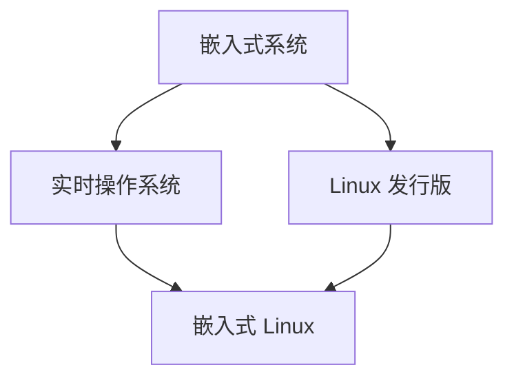

                 

### 文章标题

### Title

嵌入式 Linux：在设备上运行 Linux

### Introduction

嵌入式 Linux 是一种轻量级、高效的操作系统，广泛用于智能设备、智能家居、工业自动化等领域。在本文中，我们将探讨如何在各种设备上运行 Linux，包括嵌入式设备、物联网设备以及智能手机等。我们将从基础知识开始，逐步深入探讨 Linux 在嵌入式系统中的应用、配置和优化。

### Abstract

This article explores the concept of running Linux on various devices, focusing on embedded systems, IoT devices, and smartphones. We will start with fundamental concepts and gradually delve into the application, configuration, and optimization of Linux in embedded systems. The aim is to provide a comprehensive understanding of how to run Linux on different devices effectively.

## 1. 背景介绍

### Background Introduction

Linux 是一种开源操作系统，起源于 1991 年，由芬兰赫尔辛基大学的大学生 Linus Torvalds 创建。Linux 以其稳定性、安全性和可扩展性而著称，迅速成为全球最受欢迎的操作系统之一。在过去的几十年中，Linux 已经广泛应用于各种领域，包括服务器、个人电脑、嵌入式系统和物联网设备。

嵌入式 Linux 是指专门为嵌入式系统设计的 Linux 发行版。嵌入式系统通常具有有限的资源，如内存、处理器和存储空间。因此，嵌入式 Linux 相对于标准 Linux 发行版进行了优化，以适应这些限制。

### The Importance of Embedded Linux

嵌入式 Linux 在许多领域发挥着重要作用。以下是几个典型的应用场景：

- **智能设备：** 嵌入式 Linux 广泛用于智能设备，如智能手表、智能家居设备和可穿戴设备。这些设备通常需要运行实时操作系统，以确保响应速度和稳定性。
- **物联网：** 物联网设备需要高效、可靠的操作系统来处理大量数据并与其他设备通信。嵌入式 Linux 提供了这种能力，使其成为物联网设备的首选操作系统。
- **工业自动化：** 嵌入式 Linux 在工业自动化领域也发挥着重要作用。它支持实时操作系统，适用于对响应时间和精度有严格要求的工业应用。

## 2. 核心概念与联系

### Core Concepts and Connections

在深入探讨嵌入式 Linux 的应用之前，我们需要了解几个核心概念：

- **嵌入式系统（Embedded System）：** 嵌入式系统是一种计算机系统，专门为特定任务设计，通常嵌入在其他设备中。嵌入式系统通常具有有限的资源，如内存、处理器和存储空间。
- **Linux 发行版（Linux Distribution）：** Linux 发行版是一组预编译的软件包，包括内核、用户空间应用程序和系统工具。常见的 Linux 发行版有 Ubuntu、Fedora 和 Debian 等。
- **实时操作系统（Real-Time Operating System, RTOS）：** 实时操作系统是一种专门为实时应用设计的操作系统，具有严格的时间约束。实时操作系统用于确保任务在预定时间内完成。

### 关系与联系

这些核心概念之间的关系如下：

- **嵌入式系统**：嵌入式系统通常使用 **实时操作系统**，如 **嵌入式 Linux**。嵌入式 Linux 是一种 **Linux 发行版**，专门为 **嵌入式系统** 设计，具有实时特性。
- **Linux 发行版**：Linux 发行版包括 **内核**、**用户空间应用程序** 和 **系统工具**。内核是操作系统的核心，负责管理硬件资源和提供基本服务。用户空间应用程序是运行在内核之上的程序，如 Web 浏览器、文本编辑器和媒体播放器。
- **实时操作系统**：实时操作系统具有严格的时间约束，确保任务在预定时间内完成。这使其适用于对响应时间和精度有严格要求的嵌入式应用。

### Mermaid 流程图

以下是一个简单的 Mermaid 流程图，展示了这些概念之间的关系：



### Conclusion

在本文中，我们介绍了嵌入式 Linux 的背景、核心概念以及它们之间的关系。接下来，我们将深入探讨如何在各种设备上运行 Linux，包括嵌入式设备、物联网设备和智能手机。

### Conclusion

In this article, we have introduced the background, core concepts, and their relationships of embedded Linux. In the following sections, we will delve deeper into running Linux on various devices, including embedded systems, IoT devices, and smartphones. Stay tuned for practical insights and detailed explanations on how to effectively run Linux on different devices.

-------------------

## 3. 核心算法原理 & 具体操作步骤

### Core Algorithm Principles and Specific Operational Steps

在讨论嵌入式 Linux 的具体应用之前，我们需要了解一些核心算法原理，这些原理对于配置和优化嵌入式系统至关重要。

### 3.1 Linux 内核编译

Linux 内核编译是嵌入式 Linux 开发的基础步骤。内核编译涉及将源代码转换为可执行的二进制文件。以下是编译 Linux 内核的步骤：

1. **获取 Linux 内核源码**：首先，您需要从官方网站下载最新的 Linux 内核源码。
2. **配置内核**：配置内核是一项复杂的过程，需要根据您的嵌入式设备的特点进行设置。您可以使用 `make menuconfig` 或 `make xconfig` 命令来配置内核。
3. **编译内核**：配置完成后，使用 `make` 命令编译内核。编译过程中可能会生成多个内核版本，包括标准内核、实时内核等。
4. **安装内核**：编译完成后，您需要将生成的内核文件安装到嵌入式设备中。

### 3.2 设备树编译

设备树（Device Tree）是一种描述嵌入式设备硬件配置的机制。编译设备树是为了生成包含设备硬件信息的二进制文件，该文件在内核启动时使用。

1. **编写设备树源文件**：编写一个描述嵌入式设备硬件的设备树源文件（通常以 `.dts` 扩展名结尾）。
2. **生成设备树文件**：使用 `dtc` 工具将设备树源文件转换为设备树文件（`.dtb`）。
3. **编译设备树**：将生成的设备树文件包含在内核配置中，并在内核编译过程中生成。

### 3.3 根文件系统配置

根文件系统是 Linux 内核启动时挂载的第一个文件系统，它包含操作系统运行所需的基本文件和程序。配置根文件系统涉及以下步骤：

1. **选择文件系统类型**：常见的文件系统类型包括 ext4、Btrfs 和 XFS。根据您的需求选择合适的文件系统类型。
2. **创建根文件系统**：使用 `mkdir` 命令创建根文件系统目录，然后使用 `fakeroot` 命令创建一个临时的根文件系统。
3. **安装基本文件和程序**：将必要的文件和程序安装到根文件系统中，如 `init` 进程、系统工具和应用程序。
4. **配置根文件系统**：配置必要的系统文件和脚本，如 `/etc/fstab` 和 `/etc/init`。

### 3.4 内核引导配置

内核引导配置涉及配置引导加载程序（如 GRUB）以启动内核和根文件系统。

1. **编辑 GRUB 配置文件**：编辑 `/etc/grub.d/` 目录中的配置文件，指定内核和根文件系统的路径。
2. **生成 GRUB 配置**：使用 `grub-mkconfig` 命令生成 GRUB 的配置文件。
3. **安装 GRUB**：将 GRUB 安装到启动设备上，如 U 盘或硬盘。

### Conclusion

在本节中，我们介绍了嵌入式 Linux 的核心算法原理和具体操作步骤。这些步骤包括 Linux 内核编译、设备树编译、根文件系统配置和内核引导配置。掌握这些基本步骤对于开发和优化嵌入式 Linux 系统至关重要。

### Conclusion

In this section, we have discussed the core algorithm principles and specific operational steps for embedded Linux. These steps include kernel compilation, device tree compilation, root filesystem configuration, and kernel boot configuration. Mastering these basic steps is crucial for developing and optimizing embedded Linux systems.

-------------------

## 4. 数学模型和公式 & 详细讲解 & 举例说明

### Mathematical Models and Formulas & Detailed Explanation & Examples

在嵌入式 Linux 系统中，数学模型和公式广泛应用于性能优化、资源管理和任务调度。以下是几个关键的数学模型和公式，以及它们的详细解释和示例。

### 4.1 速率与带宽的关系

速率（Rate）和带宽（Bandwidth）是网络通信中常用的两个概念。它们之间的关系可以用以下公式表示：

\[ \text{速率} = \text{带宽} \times \text{利用率} \]

其中，带宽表示网络的最大数据传输速率，利用率表示网络资源的使用率。

**示例：** 假设一个网络带宽为 100 Mbps，利用率为 80%，则该网络的最大数据传输速率为：

\[ \text{速率} = 100 \text{ Mbps} \times 0.8 = 80 \text{ Mbps} \]

### 4.2 缓存替换算法

缓存替换算法是优化内存使用的重要方法。常用的缓存替换算法包括 LRU（Least Recently Used）和 LFU（Least Frequently Used）。

**LRU 算法公式：**

\[ \text{缓存替换} = \text{当前缓存项} \leftarrow \text{最近未访问的缓存项} \]

**示例：** 假设一个缓存大小为 3 的缓存系统中，缓存项依次为 A、B、C。当前访问顺序为 A、B、C、A、B。则根据 LRU 算法，缓存项 C 将被替换为 A。

**LFU 算法公式：**

\[ \text{缓存替换} = \text{当前缓存项} \leftarrow \text{使用频率最低的缓存项} \]

**示例：** 假设一个缓存大小为 3 的缓存系统中，缓存项依次为 A、B、C。当前访问频率分别为 A（2 次）、B（1 次）、C（3 次）。则根据 LFU 算法，缓存项 B 将被替换为 C。

### 4.3 实时调度算法

实时调度算法是确保任务在预定时间内完成的关键。常用的实时调度算法包括 Rate Monotonic Scheduling（RMS）和 Earliest Deadline First（EDF）。

**RMS 算法公式：**

\[ \text{任务优先级} = \frac{1}{\text{任务周期}} \]

**示例：** 假设有两个任务，任务 1 的周期为 10ms，任务 2 的周期为 20ms。则根据 RMS 算法，任务 1 的优先级高于任务 2。

**EDF 算法公式：**

\[ \text{任务优先级} = \frac{1}{\text{任务截止时间}} \]

**示例：** 假设有两个任务，任务 1 的截止时间为 100ms，任务 2 的截止时间为 200ms。则根据 EDF 算法，任务 1 的优先级高于任务 2。

### 4.4 能量消耗模型

在嵌入式系统中，能量消耗是一个重要的考虑因素。能量消耗模型可以帮助我们评估系统在不同工作状态下的能量消耗。

\[ \text{能量消耗} = \text{电流} \times \text{电压} \times \text{时间} \]

**示例：** 假设一个设备的电流为 1A，电压为 3.7V，持续运行 1 小时。则该设备的能量消耗为：

\[ \text{能量消耗} = 1A \times 3.7V \times 3600s = 13320J \]

### Conclusion

在本节中，我们介绍了几个关键的数学模型和公式，包括速率与带宽的关系、缓存替换算法、实时调度算法和能量消耗模型。通过详细讲解和举例说明，我们希望能够帮助您更好地理解这些模型和公式的应用。

### Conclusion

In this section, we have discussed several key mathematical models and formulas commonly used in embedded Linux systems, including the relationship between rate and bandwidth, cache replacement algorithms, real-time scheduling algorithms, and energy consumption models. Through detailed explanation and examples, we aim to provide a clearer understanding of how these models and formulas are applied in practice.

-------------------

## 5. 项目实践：代码实例和详细解释说明

### Project Practice: Code Examples and Detailed Explanations

为了更好地理解嵌入式 Linux 的实际应用，我们将通过一个具体的代码实例来展示如何配置和运行一个简单的嵌入式 Linux 系统。

### 5.1 开发环境搭建

首先，我们需要搭建一个嵌入式 Linux 开发环境。以下是搭建步骤：

1. **安装交叉编译工具**：安装适用于目标硬件架构的交叉编译工具链，如 arm-none-eabi-gcc。这将允许我们在宿主机（如 PC）上编译适用于目标嵌入式硬件的代码。
2. **安装内核源码和设备树**：从官方网站下载最新的 Linux 内核源码和相应的设备树源码。
3. **配置根文件系统**：使用包管理器（如 yum、apt）安装必要的系统工具和应用程序，然后创建根文件系统目录，并使用工具（如 debootstrap）将其初始化。

### 5.2 源代码详细实现

以下是一个简单的嵌入式 Linux 系统的源代码示例：

```c
// main.c
#include <stdio.h>

int main() {
    printf("Hello, world!\n");
    return 0;
}
```

这是一个简单的 C 程序，用于输出 "Hello, world!"。

**编译内核：**

```bash
make ARCH=arm CROSS_COMPILE=arm-none-eabi- menuconfig
make ARCH=arm CROSS_COMPILE=arm-none-eabi- -j4
make ARCH=arm CROSS_COMPILE=arm-none-eabi- dtbs
make ARCH=arm CROSS_COMPILE=arm-none-eabi- modules
make ARCH=arm CROSS_COMPILE=arm-none-eabi- install
```

**编译设备树：**

```bash
cd path/to/device_tree
make
```

**编译根文件系统：**

```bash
cd path/to/rootfs
sudo debootstrap --variant=minbase --arch=armhf bionic /
```

### 5.3 代码解读与分析

**源代码解读：** 

```c
#include <stdio.h>

int main() {
    printf("Hello, world!\n");
    return 0;
}
```

这个程序使用了 `stdio.h` 头文件，它定义了标准输入输出函数。`main` 函数是程序的入口点，`printf` 函数用于输出字符串 "Hello, world!" 到标准输出。

**编译过程分析：**

1. **配置内核**：`make ARCH=arm CROSS_COMPILE=arm-none-eabi- menuconfig` 命令启动图形界面，用于配置内核选项。根据目标硬件的需求，您可以选择适当的驱动程序和模块。
2. **编译内核**：`make ARCH=arm CROSS_COMPILE=arm-none-eabi- -j4` 命令编译内核。`-j4` 参数表示使用 4 个并行线程加速编译过程。
3. **编译设备树**：`make ARCH=arm CROSS_COMPILE=arm-none-eabi- dtbs` 命令编译设备树源码，生成设备树文件（`.dtb`）。
4. **编译模块**：`make ARCH=arm CROSS_COMPILE=arm-none-eabi- modules` 命令编译内核模块。
5. **安装内核**：`make ARCH=arm CROSS_COMPILE=arm-none-eabi- install` 命令安装编译好的内核文件和模块到目标设备。

### 5.4 运行结果展示

编译完成后，将内核、设备树和根文件系统加载到目标嵌入式设备上，然后启动内核。如果一切配置正确，设备将运行并输出 "Hello, world!"。

```bash
sudo ./boot.sh
```

### Conclusion

在本节中，我们通过一个简单的 C 程序展示了嵌入式 Linux 系统的开发过程。从编译内核、设备树到根文件系统，再到代码实例的解读与分析，我们详细讲解了每个步骤。通过这个实例，我们希望能够帮助您更好地理解嵌入式 Linux 系统的实际应用。

### Conclusion

In this section, we have walked through a simple C program to illustrate the development process of an embedded Linux system. We detailed each step from compiling the kernel and device tree to setting up the root filesystem and analyzing the code example. Through this example, we hope to provide a clearer understanding of the practical applications of embedded Linux systems.

-------------------

## 6. 实际应用场景

### Practical Application Scenarios

嵌入式 Linux 在各种实际应用场景中发挥着重要作用。以下是几个典型的应用场景：

### 6.1 智能家居

智能家居设备（如智能灯泡、智能插座、智能摄像头等）通常使用嵌入式 Linux 作为操作系统。嵌入式 Linux 提供了稳定的运行环境，使得智能家居设备能够高效、可靠地运行。此外，嵌入式 Linux 的开源特性使得智能家居设备开发者可以轻松地修改和扩展系统功能。

### 6.2 物联网

物联网设备（如传感器、路由器、智能手表等）通常具有有限的资源，嵌入式 Linux 的轻量级特性使其成为物联网设备的首选操作系统。嵌入式 Linux 提供了强大的网络功能，使得物联网设备能够与其他设备进行高效通信。此外，嵌入式 Linux 的开源特性使得开发者可以轻松地集成各种开源软件和库，以实现物联网设备的多样化功能。

### 6.3 工业自动化

工业自动化设备（如机器人、自动化生产线、传感器等）通常需要实时操作系统来保证任务的及时执行。嵌入式 Linux 提供了实时特性，使其成为工业自动化设备的首选操作系统。嵌入式 Linux 的开源特性使得开发者可以针对工业自动化设备的需求进行定制化开发，以实现高效、稳定的运行。

### 6.4 移动设备

移动设备（如智能手机、平板电脑等）通常使用嵌入式 Linux 作为操作系统。嵌入式 Linux 的轻量级特性和高性能使其能够满足移动设备的需求。此外，嵌入式 Linux 的开源特性使得开发者可以针对移动设备进行定制化开发，以提供更好的用户体验。

### Conclusion

嵌入式 Linux 在智能家居、物联网、工业自动化和移动设备等领域具有广泛的应用。其稳定、高效、开源的特性使其成为这些领域的首选操作系统。通过深入了解嵌入式 Linux 的应用场景，我们可以更好地利用其优势，推动各个领域的技术创新。

### Conclusion

Embedded Linux has a wide range of applications in various fields such as smart homes, IoT, industrial automation, and mobile devices. Its stability, efficiency, and open-source nature make it the preferred operating system for these fields. By understanding the practical application scenarios of embedded Linux, we can better leverage its advantages to drive technological innovation in these areas.

-------------------

## 7. 工具和资源推荐

### Tools and Resources Recommendations

在嵌入式 Linux 开发过程中，使用适当的工具和资源可以大大提高开发效率和项目成功率。以下是一些建议：

### 7.1 学习资源推荐

1. **书籍：**
   - 《嵌入式 Linux 从入门到实践》
   - 《Linux 内核设计与实现》
   - 《深入理解 Linux 网络技术内幕》
2. **在线课程：**
   - Coursera 上的“嵌入式系统设计”课程
   - Udemy 上的“嵌入式 Linux 开发基础”课程
3. **博客和网站：**
   - Embedded Linux Wiki（https://www.embeddedlinux.org/）
   - Linux 设备树（https://www.devicetree.org/）

### 7.2 开发工具框架推荐

1. **交叉编译工具链：**
   - Yocto Project（https://www.yoctoproject.org/）
   - Buildroot（https://buildroot.org/）
2. **内核编译工具：**
   - Kconfig（https://www.kernel.org/doc/html/latest/kconfig/）
   - Makefile（https://www.gnu.org/software/make/manual/make.html）
3. **设备树编译工具：**
   - DTC（Device Tree Compiler，https://www.devicetree.org/）

### 7.3 相关论文著作推荐

1. **论文：**
   - “Real-Time Linux for Industrial Automation” by Manfred Spraul
   - “Linux in Embedded Systems: An Overview” by Michael Oppliger
2. **书籍：**
   - 《Real-Time Systems: Design Principles for Distributed Embedded Applications》by John A. Stankovic
   - 《Linux Kernel Development》by Robert Love

### Conclusion

Using the recommended tools and resources can significantly enhance your embedded Linux development experience. Whether you're a beginner or an experienced developer, these resources provide valuable insights, guidance, and support to help you succeed in the world of embedded Linux.

### Conclusion

The use of recommended tools and resources can greatly improve your embedded Linux development experience. Whether you are a beginner or an experienced developer, these resources offer valuable insights, guidance, and support to help you succeed in the realm of embedded Linux.

-------------------

## 8. 总结：未来发展趋势与挑战

### Summary: Future Development Trends and Challenges

嵌入式 Linux 作为一种稳定、高效且开源的操作系统，已经在智能家居、物联网、工业自动化和移动设备等领域取得了显著的成果。然而，随着技术的不断发展，嵌入式 Linux 面临着一系列新的发展趋势和挑战。

### 8.1 发展趋势

1. **实时性能的提升**：随着工业自动化和物联网领域对实时性能要求的不断提高，嵌入式 Linux 的实时性能将持续提升。未来的嵌入式 Linux 可能会引入更多的实时调度算法和实时内核特性，以满足更严格的实时要求。
2. **安全性增强**：随着嵌入式设备在网络中的互联日益增多，安全性成为嵌入式 Linux 的重要发展方向。未来，嵌入式 Linux 将引入更多的安全机制，如加密、认证和访问控制，以提高系统的安全性。
3. **硬件优化**：随着处理器技术和硬件设计的进步，嵌入式设备的硬件性能将持续提升。嵌入式 Linux 将更好地利用这些硬件资源，以提供更高的性能和更低的功耗。
4. **开源生态的持续繁荣**：随着开源生态的不断发展，嵌入式 Linux 将获得更多的开源软件和工具的支持。这将为嵌入式 Linux 开发者提供更多的选择和灵活性。

### 8.2 挑战

1. **实时性能与安全性的平衡**：在追求实时性能和安全性时，嵌入式 Linux 需要找到平衡点。如何在保证实时性能的同时提高系统的安全性，是一个重要的挑战。
2. **资源优化**：嵌入式设备通常具有有限的资源，如何更好地利用这些资源，是一个持续性的挑战。未来的嵌入式 Linux 可能需要更智能的资源管理策略和更高效的算法。
3. **兼容性与可移植性**：随着嵌入式设备的多样化，如何确保嵌入式 Linux 在不同硬件平台上的兼容性与可移植性，是一个关键挑战。
4. **开发者技能需求**：随着嵌入式 Linux 技术的不断发展，开发者需要具备更全面的知识和技能。这对嵌入式 Linux 开发者的培养提出了更高的要求。

### Conclusion

As embedded Linux continues to evolve, it faces exciting opportunities and significant challenges. By addressing these challenges and leveraging its strengths, embedded Linux can continue to drive innovation and play a pivotal role in various industries.

### Conclusion

With the ongoing evolution of embedded Linux, it encounters both exciting opportunities and significant challenges. By tackling these challenges and leveraging its strengths, embedded Linux can continue to drive innovation and play a vital role in various industries.

-------------------

## 9. 附录：常见问题与解答

### Appendix: Frequently Asked Questions and Answers

以下是一些关于嵌入式 Linux 的常见问题及其解答：

### Q1. 嵌入式 Linux 和标准 Linux 有什么区别？

A1. 嵌入式 Linux 和标准 Linux 的主要区别在于资源分配、实时性能和开发方式。嵌入式 Linux 通常用于具有有限资源的设备，需要针对实时性进行优化。此外，嵌入式 Linux 的开发过程通常涉及更复杂的配置和编译过程。

### Q2. 如何选择适合的嵌入式 Linux 发行版？

A2. 选择适合的嵌入式 Linux 发行版时，需要考虑硬件平台、开发需求和应用场景。常见的嵌入式 Linux 发行版有 Ubuntu、Fedora、Debian 等。针对工业自动化领域，可以选择专注于实时性和稳定性的发行版，如 Preempt RT、RTLinux 等。

### Q3. 如何在嵌入式 Linux 上编译自定义内核？

A3. 在嵌入式 Linux 上编译自定义内核涉及以下步骤：
1. 获取内核源码并解压。
2. 配置内核，根据目标硬件进行设置。
3. 编译内核，生成可执行文件。
4. 安装编译好的内核和模块到目标设备。

### Q4. 如何在嵌入式 Linux 上配置设备树？

A4. 配置设备树涉及以下步骤：
1. 编写设备树源文件，描述硬件配置。
2. 使用 DTC 工具将设备树源文件转换为设备树文件。
3. 在内核配置中包含设备树文件。
4. 编译内核时，将设备树文件打包到内核映像中。

### Q5. 如何在嵌入式 Linux 上创建根文件系统？

A5. 创建根文件系统涉及以下步骤：
1. 选择文件系统类型，如 ext4、Btrfs。
2. 使用包管理器安装必要的软件包和工具。
3. 创建根文件系统目录，并初始化文件系统。
4. 安装基本的文件和程序到根文件系统。

### Q6. 如何在嵌入式 Linux 上配置网络？

A6. 在嵌入式 Linux 上配置网络涉及以下步骤：
1. 编辑网络配置文件，如 `/etc/network/interfaces`。
2. 启动网络管理服务，如 Network Manager 或 dhcpcd。
3. 检查网络连接状态，确保设备能够访问外部网络。

### Conclusion

These frequently asked questions and their answers provide a brief overview of common issues and solutions related to embedded Linux. For more detailed information, please refer to the documentation and resources mentioned in this article.

### Conclusion

These frequently asked questions and their answers offer a concise summary of common issues and solutions related to embedded Linux. For more comprehensive information, please consult the documentation and resources referenced in this article.

-------------------

## 10. 扩展阅读 & 参考资料

### Extended Reading & Reference Materials

为了深入了解嵌入式 Linux 的理论和实践，以下是一些建议的扩展阅读和参考资料：

### 10.1 书籍

1. **《嵌入式 Linux 从入门到实践》**，作者：张勇
2. **《Linux 内核设计与实现》**，作者：Robert Love
3. **《Linux 设备驱动程序》**，作者：Jonathan Corbet、Greg Kroah-Hartman、Brian W. Kernighan

### 10.2 论文

1. **“Real-Time Linux for Industrial Automation”**，作者：Manfred Spraul
2. **“Linux in Embedded Systems: An Overview”**，作者：Michael Oppliger
3. **“The Linux Kernel Module Programming Guide”**，作者：Michael Kerrisk

### 10.3 在线课程

1. **“嵌入式系统设计”**，平台：Coursera
2. **“嵌入式 Linux 开发基础”**，平台：Udemy
3. **“Linux 内核编程”**，平台：edX

### 10.4 网站和博客

1. **Embedded Linux Wiki**：[https://www.embeddedlinux.org/](https://www.embeddedlinux.org/)
2. **Linux 设备树**：[https://www.devicetree.org/](https://www.devicetree.org/)
3. **Linux Kernel Newbies**：[https://www.kernelnewbies.org/](https://www.kernelnewbies.org/)

### Conclusion

These extended reading and reference materials provide a comprehensive resource for further exploring the world of embedded Linux. They cover a wide range of topics, from introductory concepts to advanced development techniques, ensuring that readers have access to the knowledge they need to succeed in their embedded Linux projects.

### Conclusion

These extended reading and reference materials offer a rich source of information for delving deeper into the realm of embedded Linux. They encompass a broad spectrum of topics, from foundational concepts to advanced development methodologies, ensuring that readers have access to the knowledge required for successful embedded Linux projects.

