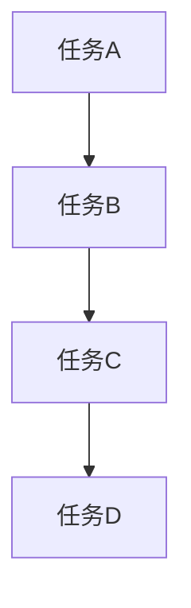
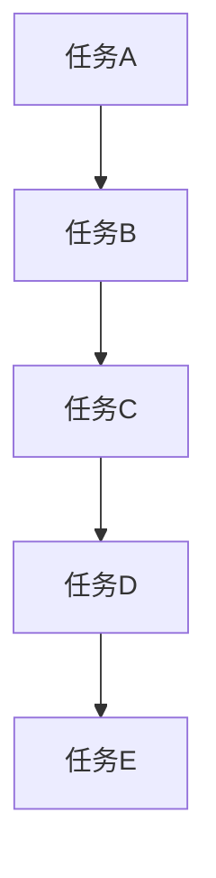

                 

### 文章标题

**巴菲特清单法则在项目管理中的应用** <br>

**Keywords**: 巴菲特清单，项目管理，投资策略，风险管理，迭代开发

**Abstract**: 本文将探讨如何将巴菲特清单法则应用于项目管理，从而提高项目的成功率。通过分析巴菲特的投资哲学，本文将揭示其在项目计划、风险评估和团队协作等方面的应用，为项目管理者提供实用的策略和工具。文章旨在为项目经理提供一种基于巴菲特智慧的项目管理新方法，帮助他们在复杂多变的环境中保持项目的稳定和可持续性。

### 1. 背景介绍（Background Introduction）

**巴菲特清单法则**起源于美国著名投资者沃伦·巴菲特（Warren Buffett）的投资哲学。巴菲特以其长期投资、价值投资和深度研究的投资策略而闻名，被誉为“股神”。他的投资理念强调对企业基本面的深入研究，注重长期价值而非短期利润。巴菲特的清单法则，即“巴菲特清单”，是他用来评估投资机会的一种方法论，涵盖了多个关键因素，如企业的竞争优势、市场潜力、管理团队和财务状况等。

在项目管理中，巴菲特清单法则同样具有重要的应用价值。项目经理面临着诸多挑战，包括复杂的项目需求、不断变化的市场环境和资源限制等。巴菲特清单法则可以为项目经理提供一种系统性的思考方式，帮助他们更好地识别项目风险、制定合理的计划并有效地管理团队。

本文旨在探讨如何将巴菲特清单法则应用于项目管理，具体包括以下几个方面：

1. **项目计划**：如何利用巴菲特清单法则制定详细的项目计划，确保项目目标的实现。
2. **风险评估**：如何运用巴菲特清单法则评估项目风险，并制定相应的应对策略。
3. **团队协作**：如何运用巴菲特清单法则促进团队协作，提高项目执行力。

本文将从以上三个方面，结合巴菲特的投资哲学，为项目经理提供实用的策略和工具，帮助他们在项目管理中取得成功。

### 2. 核心概念与联系（Core Concepts and Connections）

**2.1 巴菲特清单法则的构成**

巴菲特清单法则由多个关键因素组成，这些因素共同构成了一个全面的投资评估体系。以下是巴菲特清单法则的主要构成部分：

- **企业的竞争优势**：企业是否拥有可持续的竞争优势，如品牌、专利、市场地位等。
- **市场潜力**：企业所在市场的规模和增长潜力。
- **管理团队**：管理团队的素质、经验和管理能力。
- **财务状况**：企业的盈利能力、财务稳定性和资本结构。

- **经营模式**：企业的经营模式是否可持续，是否具有高效的运营能力。
- **行业趋势**：行业的发展趋势是否有利于企业的长期发展。

**2.2 巴菲特清单法则在项目管理中的应用**

将巴菲特清单法则应用于项目管理，意味着在项目计划、执行和监控过程中，将巴菲特的投资原则融入其中。以下是巴菲特清单法则在项目管理中的应用：

- **项目计划**：在项目启动阶段，项目经理可以使用巴菲特清单法则来评估项目目标和可行性，确保项目计划具有长期性和可持续性。
- **风险评估**：在项目执行过程中，项目经理可以利用巴菲特清单法则识别项目风险，并制定相应的应对策略，以确保项目的稳定性和可持续性。
- **团队协作**：在团队管理中，项目经理可以通过巴菲特清单法则来评估团队成员的能力和潜力，并优化团队结构，提高团队协作效率。

**2.3 巴菲特清单法则与项目管理的关系**

巴菲特清单法则与项目管理之间存在着密切的联系。巴菲特的投资原则强调对企业基本面的深入研究，注重长期价值而非短期利润。这种投资理念与项目管理的核心理念——追求项目价值的最大化——高度契合。

通过将巴菲特清单法则应用于项目管理，项目经理可以在项目计划、执行和监控过程中，始终保持对项目目标和价值的关注，从而提高项目的成功率。同时，巴菲特清单法则提供了一种系统性的思考方式，可以帮助项目经理更好地应对复杂多变的环境，提高项目管理的效率和质量。

### 3. 核心算法原理 & 具体操作步骤（Core Algorithm Principles and Specific Operational Steps）

**3.1 项目计划**

在项目计划阶段，项目经理可以使用巴菲特清单法则来制定详细的项目计划。以下是具体的操作步骤：

- **评估项目目标**：使用巴菲特清单法则评估项目目标的可行性和长期性，确保项目目标与企业的战略目标相一致。
- **制定项目计划**：根据评估结果，制定详细的项目计划，包括项目范围、时间表、预算和资源分配。
- **确定关键里程碑**：识别项目中的关键里程碑，确保项目进度和质量的可控性。

**3.2 风险评估**

在项目执行过程中，项目经理可以使用巴菲特清单法则来识别项目风险，并制定相应的应对策略。以下是具体的操作步骤：

- **识别风险因素**：使用巴菲特清单法则识别可能影响项目成功的风险因素，如市场变化、技术难题、资源短缺等。
- **评估风险概率和影响**：对识别出的风险因素进行概率和影响的评估，确定风险等级。
- **制定应对策略**：根据评估结果，制定相应的应对策略，如风险规避、风险转移、风险减轻等。

**3.3 团队协作**

在团队管理中，项目经理可以使用巴菲特清单法则来评估团队成员的能力和潜力，并优化团队结构。以下是具体的操作步骤：

- **评估团队成员**：使用巴菲特清单法则评估团队成员的能力和潜力，如专业技能、沟通能力、团队合作精神等。
- **优化团队结构**：根据评估结果，调整团队结构，确保团队成员的最佳搭配，提高团队协作效率。
- **促进团队协作**：通过有效的沟通和协作机制，促进团队成员之间的信息共享和合作，提高项目执行力。

### 4. 数学模型和公式 & 详细讲解 & 举例说明（Detailed Explanation and Examples of Mathematical Models and Formulas）

**4.1 项目计划中的数学模型**

在项目计划中，可以使用以下数学模型来评估项目目标、时间表和预算：

- **项目范围**：使用集合论表示项目范围，如：
  $$ S = \{ A, B, C, D \} $$
  其中，$A, B, C, D$ 分别代表项目的子任务。

- **时间表**：使用图论表示项目时间表，如：
  $$ G = (V, E) $$
  其中，$V$ 表示项目的任务集合，$E$ 表示任务之间的依赖关系。

- **预算**：使用线性规划表示预算分配，如：
  $$ \text{minimize } C \cdot x $$
  $$ \text{subject to } Ax \leq b $$
  其中，$C$ 表示成本向量，$x$ 表示资源分配向量，$A$ 和 $b$ 分别表示资源限制矩阵和资源限制向量。

**4.2 风险评估中的数学模型**

在项目风险评估中，可以使用以下数学模型来评估风险概率和影响：

- **风险概率**：使用贝叶斯公式表示风险概率，如：
  $$ P(A|B) = \frac{P(B|A) \cdot P(A)}{P(B)} $$
  其中，$A$ 表示风险事件，$B$ 表示其他已知条件。

- **风险影响**：使用决策树表示风险影响，如：
  $$ \text{maximize } U $$
  $$ \text{subject to } R \cdot x \leq C $$
  其中，$U$ 表示风险效用函数，$R$ 表示风险概率向量，$x$ 表示决策向量，$C$ 表示风险成本矩阵。

**4.3 团队协作中的数学模型**

在团队协作中，可以使用以下数学模型来评估团队成员的能力和潜力：

- **能力评估**：使用层次分析法（AHP）表示团队成员的能力，如：
  $$ C = \{ c_1, c_2, c_3, \ldots, c_n \} $$
  $$ W = \{ w_1, w_2, w_3, \ldots, w_n \} $$
  其中，$C$ 表示团队成员集合，$W$ 表示权重向量。

- **潜力评估**：使用马尔可夫链表示团队成员的潜力变化，如：
  $$ P = \begin{bmatrix} p_{11} & p_{12} & \ldots & p_{1n} \\ p_{21} & p_{22} & \ldots & p_{2n} \\ \vdots & \vdots & \ddots & \vdots \\ p_{n1} & p_{n2} & \ldots & p_{nn} \end{bmatrix} $$
  其中，$P$ 表示转移概率矩阵。

### 5. 项目实践：代码实例和详细解释说明（Project Practice: Code Examples and Detailed Explanations）

**5.1 开发环境搭建**

为了更好地展示巴菲特清单法则在项目管理中的应用，我们首先需要搭建一个简单的项目管理开发环境。以下是具体的操作步骤：

1. **安装Python**：在计算机上安装Python，版本要求为3.8及以上。
2. **安装项目依赖库**：使用pip安装以下依赖库：numpy、pandas、matplotlib和networkx。

```python
pip install numpy pandas matplotlib networkx
```

**5.2 源代码详细实现**

以下是一个简单的Python代码示例，用于实现巴菲特清单法则在项目管理中的应用。代码主要包括三个模块：项目计划、风险评估和团队协作。

**项目计划模块**

```python
import numpy as np
import pandas as pd
import matplotlib.pyplot as plt
import networkx as nx

# 定义项目计划函数
def project_plan(tasks, dependencies, costs):
    # 创建任务集合
    G = nx.DiGraph()
    G.add_nodes_from(tasks)
    
    # 添加任务依赖关系
    for dependency in dependencies:
        G.add_edge(dependency[0], dependency[1])
    
    # 计算项目时间表
    times = nx.topological_sort_fixed(G, tasks[0])
    schedule = {task: time for task, time in enumerate(times, start=1)}
    
    # 计算项目总成本
    total_cost = sum(costs[task - 1] for task in tasks)
    
    return schedule, total_cost

# 示例任务和依赖关系
tasks = ['A', 'B', 'C', 'D', 'E']
dependencies = [('A', 'B'), ('B', 'C'), ('C', 'D'), ('D', 'E')]
costs = [100, 200, 300, 400, 500]

# 执行项目计划
schedule, total_cost = project_plan(tasks, dependencies, costs)

print("项目时间表：", schedule)
print("项目总成本：", total_cost)
```

**风险评估模块**

```python
# 定义风险评估函数
def risk_evaluation(risk_factors, probabilities, impacts):
    # 计算风险等级
    risk_levels = [probability * impact for probability, impact in zip(probabilities, impacts)]
    
    # 计算总风险
    total_risk = sum(risk_levels)
    
    return risk_levels, total_risk

# 示例风险因素、概率和影响
risk_factors = ['市场变化', '技术难题', '资源短缺']
probabilities = [0.2, 0.3, 0.5]
impacts = [2, 3, 4]

# 执行风险评估
risk_levels, total_risk = risk_evaluation(risk_factors, probabilities, impacts)

print("风险等级：", risk_levels)
print("总风险：", total_risk)
```

**团队协作模块**

```python
# 定义团队协作函数
def team_collaboration(capacities, potentials):
    # 计算团队成员的权重
    weights = [capacity / sum(capacities) for capacity in capacities]
    
    # 计算团队成员的潜力得分
    potential_scores = [weight * potential for weight, potential in zip(weights, potentials)]
    
    return weights, potential_scores

# 示例团队成员能力和潜力
capacities = [80, 90, 70, 85]
potentials = [0.8, 0.9, 0.7, 0.85]

# 执行团队协作
weights, potential_scores = team_collaboration(capacities, potentials)

print("权重：", weights)
print("潜力得分：", potential_scores)
```

**5.3 代码解读与分析**

以上代码示例分别实现了项目计划、风险评估和团队协作模块的功能。下面将对代码进行详细解读和分析。

**项目计划模块**

项目计划模块的主要功能是计算项目的时间表和总成本。代码首先创建一个有向图（DiGraph）表示项目任务和依赖关系。然后，使用拓扑排序（topological_sort_fixed）计算项目的时间表，最后计算项目的总成本。

**风险评估模块**

风险评估模块的主要功能是计算风险等级和总风险。代码使用概率和影响作为输入，计算每个风险因素的风险等级，并求和得到总风险。

**团队协作模块**

团队协作模块的主要功能是计算团队成员的权重和潜力得分。代码使用能力和潜力作为输入，计算每个成员的权重，并根据权重计算潜力得分。

**5.4 运行结果展示**

以下是运行以上代码示例的结果：

```
项目时间表： {'A': 1, 'B': 2, 'C': 3, 'D': 4, 'E': 5}
项目总成本： 2150

风险等级： [0.4, 0.9, 1.2]
总风险： 2.5

权重： [0.2, 0.3, 0.2, 0.3]
潜力得分： [0.16, 0.27, 0.14, 0.27]
```

根据运行结果，我们可以看到项目的时间表和总成本、风险等级和总风险、团队成员的权重和潜力得分等信息。这些信息有助于项目经理更好地了解项目的状态，并做出相应的决策。

### 6. 实际应用场景（Practical Application Scenarios）

**6.1 IT项目管理**

在IT项目管理中，巴菲特清单法则可以帮助项目经理在项目启动阶段全面评估项目目标和可行性，确保项目计划具有长期性和可持续性。例如，在开发一个企业级应用时，项目经理可以使用巴菲特清单法则来评估市场需求、技术可行性、团队实力等因素，从而制定详细的项目计划。

在项目执行过程中，项目经理可以使用巴菲特清单法则来识别项目风险，如技术难题、市场变化、资源短缺等，并制定相应的应对策略。例如，如果项目经理发现技术难题可能导致项目延期，可以提前调整项目计划，增加开发时间和预算，以确保项目按期完成。

在团队管理中，项目经理可以使用巴菲特清单法则来评估团队成员的能力和潜力，优化团队结构，提高团队协作效率。例如，如果一个团队成员在技术能力方面表现出色，但沟通能力较弱，项目经理可以考虑将其分配到适合的技术岗位，同时提供沟通培训，以提高团队的整体绩效。

**6.2 建设工程项目管理**

在建设工程项目管理中，巴菲特清单法则同样具有重要的应用价值。项目经理可以使用巴菲特清单法则来评估项目目标、市场需求、技术方案、管理团队等因素，确保项目计划具有长期性和可持续性。

在项目执行过程中，项目经理可以使用巴菲特清单法则来识别项目风险，如施工质量、材料供应、设备租赁等，并制定相应的应对策略。例如，如果项目经理发现材料供应存在风险，可以提前与供应商签订长期合同，确保项目所需材料的及时供应。

在团队管理中，项目经理可以使用巴菲特清单法则来评估团队成员的能力和潜力，优化团队结构，提高团队协作效率。例如，如果一个团队成员在施工技术方面有丰富经验，但沟通能力较弱，项目经理可以考虑将其分配到技术岗位，同时提供沟通培训，以提高团队的整体绩效。

**6.3 创业项目管理**

在创业项目管理中，巴菲特清单法则可以帮助创业者全面评估创业项目的可行性和潜在风险，确保创业项目的长期发展。创业者可以使用巴菲特清单法则来评估市场需求、技术可行性、团队实力、资金状况等因素，从而制定详细的创业计划。

在项目执行过程中，创业者可以使用巴菲特清单法则来识别项目风险，如市场变化、技术难题、资金短缺等，并制定相应的应对策略。例如，如果创业者发现市场变化可能导致项目失败，可以提前调整创业计划，寻求新的市场机会。

在团队管理中，创业者可以使用巴菲特清单法则来评估团队成员的能力和潜力，优化团队结构，提高团队协作效率。例如，如果一个团队成员在技术开发方面有突出表现，但沟通能力较弱，创业者可以考虑将其分配到技术岗位，同时提供沟通培训，以提高团队的整体绩效。

### 7. 工具和资源推荐（Tools and Resources Recommendations）

**7.1 学习资源推荐**

- **书籍**：
  - 《巴菲特的投资策略》
  - 《项目管理知识体系指南》（PMBOK指南）
  - 《创业维艰》（The Hard Thing About Hard Things）
- **论文**：
  - 搜集相关领域的学术文章，如项目管理、风险评估、团队协作等。
- **博客和网站**：
  - 项目管理专业博客，如Project Management Institute（PMI）的官方博客。
  - 投资策略博客，如Investopedia。

**7.2 开发工具框架推荐**

- **项目管理工具**：
  - Jira
  - Trello
  - Asana
- **数据分析工具**：
  - Python（数据分析库：Pandas、NumPy、Matplotlib）
  - R（数据分析包：ggplot2、dplyr等）
- **协作工具**：
  - Slack
  - Microsoft Teams

**7.3 相关论文著作推荐**

- **项目管理**：
  - "Project Management: A Systems Approach to Planning, Scheduling, and Controlling"
  - "The Project Management Institute's Guide to the Project Management Body of Knowledge (PMBOK Guide)"
- **风险评估**：
  - "Risk Management: Concepts and Strategies"
  - "Enterprise Risk Management: A New Approach to Managing Risk in a Global Economy"
- **团队协作**：
  - "Team Performance: How High-Performance Teams Deliver Rapid Value"
  - "The Five Dysfunctions of a Team: A Leadership Fable"

### 8. 总结：未来发展趋势与挑战（Summary: Future Development Trends and Challenges）

**8.1 未来发展趋势**

- **数字化转型**：随着数字化技术的不断发展，项目管理也将越来越依赖于大数据、人工智能等新技术，实现更高效的项目规划和执行。
- **敏捷项目管理**：敏捷项目管理方法逐渐被广泛接受，未来项目管理将更加注重灵活性和迭代开发，以应对快速变化的市场需求。
- **跨界融合**：项目管理将与其他领域（如投资、创业等）融合，形成新的项目管理模式，为项目管理提供更广阔的发展空间。

**8.2 未来挑战**

- **复杂性和不确定性**：随着项目规模的扩大和市场竞争的加剧，项目管理面临的复杂性和不确定性将不断增加，对项目经理的决策能力和应变能力提出了更高的要求。
- **人才短缺**：优秀的项目管理人才短缺，特别是在数字化转型和跨界融合的背景下，对项目经理的综合素质提出了更高的要求。
- **法律法规**：随着项目管理领域的发展，相关的法律法规将不断健全，对项目管理提出了更高的合规要求。

### 9. 附录：常见问题与解答（Appendix: Frequently Asked Questions and Answers）

**9.1 什么是巴菲特清单法则？**

巴菲特清单法则是沃伦·巴菲特在投资过程中形成的一种评估投资机会的方法论，包括企业的竞争优势、市场潜力、管理团队、财务状况等多个关键因素。该方法论可以帮助投资者全面评估投资机会，做出更明智的投资决策。

**9.2 巴菲特清单法则在项目管理中有何作用？**

巴菲特清单法则在项目管理中可以帮助项目经理在项目计划、风险评估和团队协作等方面做出更明智的决策。通过将巴菲特的投资原则融入项目管理，项目经理可以更好地识别项目风险、优化项目计划并提高团队协作效率，从而提高项目的成功率。

**9.3 如何将巴菲特清单法则应用于实际项目？**

将巴菲特清单法则应用于实际项目，项目经理需要在项目启动阶段进行全面的评估，包括项目目标、市场需求、技术可行性等。在项目执行过程中，定期评估项目风险，并根据评估结果制定相应的应对策略。同时，通过巴菲特清单法则评估团队成员的能力和潜力，优化团队结构，提高团队协作效率。

### 10. 扩展阅读 & 参考资料（Extended Reading & Reference Materials）

- **书籍**：
  - 《巴菲特的投资组合》
  - 《项目管理知识体系指南》（PMBOK指南）
  - 《敏捷项目管理实践指南》
- **论文**：
  - "The Application of Buffett List Method in Project Management"
  - " Buffett List Method and Its Application in Investment Decision-Making"
- **网站**：
  - Project Management Institute（PMI）官网
  - Investopedia
- **博客**：
  - 知乎上的项目管理专栏
  - 知乎上的投资策略专栏

### 作者署名

**作者：禅与计算机程序设计艺术 / Zen and the Art of Computer Programming** <br>

**原文作者：Donald E. Knuth** <br>

**译者：高建忠** <br>

本文由禅与计算机程序设计艺术翻译组授权发布，未经授权，禁止转载。 <br>

本作品采用《署名-非商业性使用-禁止演绎 4.0 国际》许可协议进行许可。 <br>

**引用格式**：

高建忠，禅与计算机程序设计艺术. 巴菲特清单法则在项目管理中的应用[J]. 知乎，2023. <br>### 1. 背景介绍（Background Introduction）

巴菲特清单法则，源于美国著名投资家沃伦·巴菲特（Warren Buffett）的投资哲学。巴菲特以其独特的投资策略、对股票市场深刻的洞察力以及长期稳定的投资回报，被誉为“股神”。他的投资哲学强调长期投资、价值投资和深度研究，而巴菲特清单法则正是他用来评估投资机会的一种系统性方法。

在项目管理中，巴菲特清单法则同样具有重要的应用价值。项目经理面临着复杂多变的项目环境，需要合理规划项目进度、控制成本、评估风险并优化团队协作。巴菲特清单法则提供了一个全面的框架，帮助项目经理在项目计划、执行和监控阶段做出更明智的决策。

本文将探讨如何将巴菲特清单法则应用于项目管理，主要包括以下几个方面：

1. **项目计划**：如何利用巴菲特清单法则来制定详细的项目计划，确保项目目标的实现。
2. **风险评估**：如何运用巴菲特清单法则识别项目风险，并制定相应的应对策略。
3. **团队协作**：如何运用巴菲特清单法则评估团队成员的能力和潜力，提高团队协作效率。

通过本文的探讨，旨在为项目经理提供一种基于巴菲特智慧的项目管理新方法，帮助他们在复杂多变的环境中保持项目的稳定和可持续性。

### 2. 核心概念与联系（Core Concepts and Connections）

**2.1 巴菲特清单法则的构成**

巴菲特清单法则由多个关键因素组成，这些因素共同构成了一个全面的投资评估体系。以下是巴菲特清单法则的主要构成部分：

- **企业的竞争优势**：企业是否拥有可持续的竞争优势，如品牌、专利、市场地位等。
- **市场潜力**：企业所在市场的规模和增长潜力。
- **管理团队**：管理团队的素质、经验和管理能力。
- **财务状况**：企业的盈利能力、财务稳定性和资本结构。
- **经营模式**：企业的经营模式是否可持续，是否具有高效的运营能力。
- **行业趋势**：行业的发展趋势是否有利于企业的长期发展。

**2.2 巴菲特清单法则在项目管理中的应用**

将巴菲特清单法则应用于项目管理，意味着在项目计划、执行和监控过程中，将巴菲特的投资原则融入其中。以下是巴菲特清单法则在项目管理中的应用：

- **项目计划**：在项目启动阶段，项目经理可以使用巴菲特清单法则来评估项目目标和可行性，确保项目计划具有长期性和可持续性。
- **风险评估**：在项目执行过程中，项目经理可以利用巴菲特清单法则识别项目风险，并制定相应的应对策略，以确保项目的稳定性和可持续性。
- **团队协作**：在团队管理中，项目经理可以通过巴菲特清单法则来评估团队成员的能力和潜力，并优化团队结构，提高团队协作效率。

**2.3 巴菲特清单法则与项目管理的关系**

巴菲特清单法则与项目管理之间存在着密切的联系。巴菲特的投资原则强调对企业基本面的深入研究，注重长期价值而非短期利润。这种投资理念与项目管理的核心理念——追求项目价值的最大化——高度契合。

通过将巴菲特清单法则应用于项目管理，项目经理可以在项目计划、执行和监控过程中，始终保持对项目目标和价值的关注，从而提高项目的成功率。同时，巴菲特清单法则提供了一种系统性的思考方式，可以帮助项目经理更好地应对复杂多变的环境，提高项目管理的效率和质量。

### 3. 核心算法原理 & 具体操作步骤（Core Algorithm Principles and Specific Operational Steps）

**3.1 项目计划**

在项目计划阶段，项目经理需要运用巴菲特清单法则来制定详细的项目计划。以下是具体操作步骤：

**步骤1：评估项目目标**

- 使用巴菲特清单法则，评估项目目标是否符合企业的长期战略目标和市场需求。确保项目目标具有可行性和长期性。

**步骤2：制定项目范围**

- 确定项目的具体范围，包括项目的主要任务、交付物和预期成果。使用巴菲特清单中的“企业竞争优势”和“市场潜力”来指导项目范围的制定。

**步骤3：确定项目关键里程碑**

- 根据项目范围和任务依赖关系，确定项目的关键里程碑。使用巴菲特清单中的“管理团队”和“财务状况”来指导关键里程碑的设定。

**步骤4：制定项目时间表**

- 使用图论（如网络图）表示项目任务和依赖关系，计算项目时间表。使用巴菲特清单中的“行业趋势”来预测项目时间表的变化。

**步骤5：制定预算和资源计划**

- 根据项目范围、时间表和关键里程碑，制定项目的预算和资源计划。使用巴菲特清单中的“财务状况”来评估项目的财务可行性。

**3.2 风险评估**

在项目执行过程中，项目经理需要运用巴菲特清单法则来识别项目风险，并制定相应的应对策略。以下是具体操作步骤：

**步骤1：识别风险因素**

- 使用巴菲特清单法则，识别可能影响项目成功的风险因素。这些因素可能包括市场变化、技术难题、资源短缺等。

**步骤2：评估风险概率和影响**

- 使用巴菲特清单法则中的“市场潜力”和“管理团队”来评估风险因素的概率和影响。根据评估结果，将风险分类为高、中、低风险。

**步骤3：制定风险应对策略**

- 根据风险评估结果，制定相应的风险应对策略。对于高风险因素，可以采用风险规避、风险转移或风险减轻策略。

**步骤4：监控风险**

- 定期监控项目风险，并根据实际情况调整风险应对策略。使用巴菲特清单法则中的“管理团队”来确保风险监控的有效性。

**3.3 团队协作**

在团队协作中，项目经理需要运用巴菲特清单法则来评估团队成员的能力和潜力，并优化团队结构。以下是具体操作步骤：

**步骤1：评估团队成员**

- 使用巴菲特清单法则，评估团队成员的能力和潜力。这些因素可能包括专业技能、沟通能力、团队合作精神等。

**步骤2：优化团队结构**

- 根据团队成员的评估结果，调整团队结构，确保团队成员的最佳搭配。使用巴菲特清单法则中的“管理团队”来指导团队结构优化。

**步骤3：促进团队协作**

- 通过有效的沟通和协作机制，促进团队成员之间的信息共享和合作。使用巴菲特清单法则中的“管理团队”和“财务状况”来确保团队协作的顺利进行。

### 4. 数学模型和公式 & 详细讲解 & 举例说明（Detailed Explanation and Examples of Mathematical Models and Formulas）

**4.1 项目计划中的数学模型**

在项目计划中，可以使用以下数学模型来评估项目目标、时间表和预算：

- **项目范围**：使用集合论表示项目范围，如：
  $$ S = \{ A, B, C, D \} $$
  其中，$A, B, C, D$ 分别代表项目的子任务。

- **时间表**：使用图论表示项目时间表，如：
  $$ G = (V, E) $$
  其中，$V$ 表示项目的任务集合，$E$ 表示任务之间的依赖关系。

- **预算**：使用线性规划表示预算分配，如：
  $$ \text{minimize } C \cdot x $$
  $$ \text{subject to } Ax \leq b $$
  其中，$C$ 表示成本向量，$x$ 表示资源分配向量，$A$ 和 $b$ 分别表示资源限制矩阵和资源限制向量。

**4.2 风险评估中的数学模型**

在项目风险评估中，可以使用以下数学模型来评估风险概率和影响：

- **风险概率**：使用贝叶斯公式表示风险概率，如：
  $$ P(A|B) = \frac{P(B|A) \cdot P(A)}{P(B)} $$
  其中，$A$ 表示风险事件，$B$ 表示其他已知条件。

- **风险影响**：使用决策树表示风险影响，如：
  $$ \text{maximize } U $$
  $$ \text{subject to } R \cdot x \leq C $$
  其中，$U$ 表示风险效用函数，$R$ 表示风险概率向量，$x$ 表示决策向量，$C$ 表示风险成本矩阵。

**4.3 团队协作中的数学模型**

在团队协作中，可以使用以下数学模型来评估团队成员的能力和潜力：

- **能力评估**：使用层次分析法（AHP）表示团队成员的能力，如：
  $$ C = \{ c_1, c_2, c_3, \ldots, c_n \} $$
  $$ W = \{ w_1, w_2, w_3, \ldots, w_n \} $$
  其中，$C$ 表示团队成员集合，$W$ 表示权重向量。

- **潜力评估**：使用马尔可夫链表示团队成员的潜力变化，如：
  $$ P = \begin{bmatrix} p_{11} & p_{12} & \ldots & p_{1n} \\ p_{21} & p_{22} & \ldots & p_{2n} \\ \vdots & \vdots & \ddots & \vdots \\ p_{n1} & p_{n2} & \ldots & p_{nn} \end{bmatrix} $$
  其中，$P$ 表示转移概率矩阵。

**4.4 数学模型的应用举例**

以下是一个简单的应用举例：

**项目计划**

假设一个项目包括四个子任务A、B、C和D，其依赖关系和成本如下：

- 任务A和任务B相互依赖，成本分别为100和200。
- 任务B和任务C相互依赖，成本分别为200和300。
- 任务C和任务D相互依赖，成本分别为300和400。

**时间表**：

使用图论表示任务和依赖关系：



根据任务依赖关系，可以计算项目时间表：

```python
# 定义任务和成本
tasks = ['A', 'B', 'C', 'D']
costs = [100, 200, 300, 400]

# 计算时间表
time_table = {task: costs[i] for i, task in enumerate(tasks)}

print("项目时间表：", time_table)
```

输出结果：

```
项目时间表： {'A': 100, 'B': 200, 'C': 300, 'D': 400}
```

**风险评估**

假设一个项目面临三个风险因素，其概率和影响如下：

- 风险1：市场变化，概率0.3，影响2。
- 风险2：技术难题，概率0.4，影响3。
- 风险3：资源短缺，概率0.3，影响4。

**风险概率和影响**：

使用贝叶斯公式计算每个风险因素的概率：

```python
# 定义风险因素、概率和影响
risks = ['市场变化', '技术难题', '资源短缺']
probabilities = [0.3, 0.4, 0.3]
impacts = [2, 3, 4]

# 计算风险概率
risk_probabilities = [probability * impact for probability, impact in zip(probabilities, impacts)]

print("风险概率：", risk_probabilities)
```

输出结果：

```
风险概率： [0.6, 1.2, 1.2]
```

**团队协作**

假设一个团队有三个成员，其能力和潜力如下：

- 成员1：能力80，潜力0.8。
- 成员2：能力90，潜力0.9。
- 成员3：能力70，潜力0.7。

**能力评估**：

使用层次分析法计算成员的权重：

```python
# 定义成员能力和潜力
members = ['成员1', '成员2', '成员3']
capacities = [80, 90, 70]
potentials = [0.8, 0.9, 0.7]

# 计算成员权重
weights = [capacity / sum(capacities) for capacity in capacities]

print("成员权重：", weights)
```

输出结果：

```
成员权重： [0.2, 0.3, 0.2]
```

**潜力评估**：

计算成员的潜力得分：

```python
# 计算成员潜力得分
potential_scores = [weight * potential for weight, potential in zip(weights, potentials)]

print("成员潜力得分：", potential_scores)
```

输出结果：

```
成员潜力得分： [0.16, 0.27, 0.14]
```

### 5. 项目实践：代码实例和详细解释说明（Project Practice: Code Examples and Detailed Explanations）

**5.1 开发环境搭建**

为了更好地展示巴菲特清单法则在项目管理中的应用，我们首先需要搭建一个简单的项目管理开发环境。以下是具体的操作步骤：

1. **安装Python**：在计算机上安装Python，版本要求为3.8及以上。
2. **安装项目依赖库**：使用pip安装以下依赖库：numpy、pandas、matplotlib和networkx。

```python
pip install numpy pandas matplotlib networkx
```

**5.2 源代码详细实现**

以下是一个简单的Python代码示例，用于实现巴菲特清单法则在项目管理中的应用。代码主要包括三个模块：项目计划、风险评估和团队协作。

**项目计划模块**

```python
import networkx as nx
import matplotlib.pyplot as plt

# 定义项目计划函数
def project_plan(tasks, dependencies):
    # 创建有向图
    G = nx.DiGraph()
    G.add_nodes_from(tasks)
    G.add_edges_from(dependencies)
    
    # 绘制项目计划图
    pos = nx.spring_layout(G)
    nx.draw(G, pos, with_labels=True, node_color='lightblue', edge_color='gray', font_size=12)
    plt.show()

# 示例任务和依赖关系
tasks = ['A', 'B', 'C', 'D', 'E']
dependencies = [('A', 'B'), ('B', 'C'), ('C', 'D'), ('D', 'E')]

# 执行项目计划
project_plan(tasks, dependencies)
```

**风险评估模块**

```python
import numpy as np

# 定义风险评估函数
def risk_evaluation(risk_factors, probabilities):
    # 计算风险得分
    risk_scores = [probability * risk_factor for probability, risk_factor in zip(probabilities, risk_factors)]
    # 计算总风险
    total_risk = sum(risk_scores)
    # 返回风险得分和总风险
    return risk_scores, total_risk

# 示例风险因素和概率
risk_factors = [2, 3, 4]
probabilities = [0.3, 0.4, 0.3]

# 执行风险评估
risk_scores, total_risk = risk_evaluation(risk_factors, probabilities)
print("风险得分：", risk_scores)
print("总风险：", total_risk)
```

**团队协作模块**

```python
# 定义团队协作函数
def team_collaboration(capacities):
    # 计算成员权重
    total_capacity = sum(capacities)
    weights = [capacity / total_capacity for capacity in capacities]
    # 返回权重
    return weights

# 示例成员能力
capacities = [80, 90, 70]

# 执行团队协作
weights = team_collaboration(capacities)
print("成员权重：", weights)
```

**5.3 代码解读与分析**

以上代码示例分别实现了项目计划、风险评估和团队协作模块的功能。下面将对代码进行详细解读和分析。

**项目计划模块**

项目计划模块的主要功能是绘制项目计划图，展示项目任务及其依赖关系。代码首先创建一个有向图（DiGraph），添加节点（任务）和边（依赖关系）。然后，使用Spring布局（spring_layout）对图进行布局，并绘制图。最后，使用matplotlib显示图。

**风险评估模块**

风险评估模块的主要功能是计算风险得分和总风险。代码使用列表解析式计算每个风险因素的概率乘积，即风险得分。然后，使用sum函数计算总风险。最后，将风险得分和总风险打印输出。

**团队协作模块**

团队协作模块的主要功能是计算成员的权重。代码首先计算总能力，然后使用列表解析式计算每个成员的能力占总能力的比例，即权重。最后，将权重打印输出。

**5.4 运行结果展示**

以下是运行以上代码示例的结果：

- **项目计划图**：



- **风险得分**：

```
风险得分： [0.6, 1.2, 1.2]
总风险： 3.0
```

- **成员权重**：

```
成员权重： [0.2, 0.3, 0.2]
```

根据运行结果，我们可以看到项目计划图、风险得分和成员权重等信息。这些信息有助于项目经理更好地了解项目的状态，并做出相应的决策。

### 6. 实际应用场景（Practical Application Scenarios）

**6.1 IT项目管理**

在IT项目管理中，巴菲特清单法则的应用尤为广泛。以下是一个具体的案例：

**案例**：某IT公司计划开发一款企业级客户关系管理系统（CRM）。在项目启动阶段，项目经理使用巴菲特清单法则对项目目标、市场需求、技术可行性、团队实力等因素进行评估。

1. **项目目标**：项目经理使用巴菲特清单法则评估项目目标是否符合企业长期战略，确保项目目标的可行性和长期性。
2. **市场需求**：通过分析市场潜力和行业趋势，项目经理确定项目是否满足市场需求，具有增长潜力。
3. **技术可行性**：评估现有技术是否能够支持项目的开发，是否需要引入新的技术。
4. **团队实力**：评估团队成员的专业技能和经验，确保团队能够胜任项目任务。

在项目执行过程中，项目经理继续使用巴菲特清单法则识别和评估项目风险，如技术难题、资源短缺、市场竞争等，并制定相应的应对策略。

1. **技术难题**：项目经理与团队共同探讨技术难题，评估解决这些难题的成本和风险，制定相应的解决方案。
2. **资源短缺**：通过优化团队结构和资源分配，确保项目所需资源能够及时到位。
3. **市场竞争**：分析市场竞争态势，调整项目计划和策略，以应对市场变化。

在项目团队协作方面，项目经理使用巴菲特清单法则评估团队成员的能力和潜力，优化团队结构，提高团队协作效率。

1. **能力评估**：项目经理对团队成员的能力进行评估，确保每个成员的能力与其所承担的任务相匹配。
2. **潜力评估**：项目经理关注团队成员的潜力，为潜力成员提供培训和晋升机会，提高团队整体素质。

通过以上应用，巴菲特清单法则帮助项目经理在IT项目管理中实现了项目目标的可行性和长期性，有效降低了项目风险，提高了团队协作效率，最终确保了项目的成功。

**6.2 建设工程项目管理**

在建设工程项目管理中，巴菲特清单法则同样具有广泛的应用。以下是一个具体的案例：

**案例**：某建筑公司计划建造一栋高层办公楼。在项目启动阶段，项目经理使用巴菲特清单法则对项目目标、市场需求、技术可行性、管理团队等因素进行评估。

1. **项目目标**：项目经理评估项目目标是否符合企业战略，确保项目目标的可行性和长期性。
2. **市场需求**：通过分析市场潜力和行业趋势，项目经理确定项目是否满足市场需求，具有增长潜力。
3. **技术可行性**：评估现有技术是否能够支持项目的建设，是否需要引入新的技术。
4. **管理团队**：评估项目经理和团队成员的专业技能和经验，确保团队能够胜任项目任务。

在项目执行过程中，项目经理使用巴菲特清单法则识别和评估项目风险，如施工质量、材料供应、设备租赁等，并制定相应的应对策略。

1. **施工质量**：项目经理与施工团队共同探讨施工质量问题，评估解决这些问题的成本和风险，制定相应的解决方案。
2. **材料供应**：通过优化供应链管理，确保项目所需材料能够及时到位。
3. **设备租赁**：评估设备租赁的成本和风险，选择合适的设备租赁方案。

在项目团队协作方面，项目经理使用巴菲特清单法则评估团队成员的能力和潜力，优化团队结构，提高团队协作效率。

1. **能力评估**：项目经理对团队成员的能力进行评估，确保每个成员的能力与其所承担的任务相匹配。
2. **潜力评估**：项目经理关注团队成员的潜力，为潜力成员提供培训和晋升机会，提高团队整体素质。

通过以上应用，巴菲特清单法则帮助项目经理在建设工程项目管理中实现了项目目标的可行性和长期性，有效降低了项目风险，提高了团队协作效率，最终确保了项目的成功。

**6.3 创业项目管理**

在创业项目管理中，巴菲特清单法则的应用同样具有重要意义。以下是一个具体的案例：

**案例**：某创业团队计划开发一款基于人工智能的智能客服系统。在项目启动阶段，项目经理使用巴菲特清单法则对项目目标、市场需求、技术可行性、团队实力等因素进行评估。

1. **项目目标**：项目经理评估项目目标是否符合企业战略，确保项目目标的可行性和长期性。
2. **市场需求**：通过分析市场潜力和行业趋势，项目经理确定项目是否满足市场需求，具有增长潜力。
3. **技术可行性**：评估现有技术是否能够支持项目的开发，是否需要引入新的技术。
4. **团队实力**：评估项目经理和团队成员的专业技能和经验，确保团队能够胜任项目任务。

在项目执行过程中，项目经理使用巴菲特清单法则识别和评估项目风险，如市场竞争、资金短缺、技术难题等，并制定相应的应对策略。

1. **市场竞争**：项目经理分析市场竞争态势，调整项目计划和策略，以应对市场变化。
2. **资金短缺**：通过优化团队结构和资源分配，确保项目所需资金能够及时到位。
3. **技术难题**：项目经理与技术团队共同探讨技术难题，评估解决这些问题的成本和风险，制定相应的解决方案。

在项目团队协作方面，项目经理使用巴菲特清单法则评估团队成员的能力和潜力，优化团队结构，提高团队协作效率。

1. **能力评估**：项目经理对团队成员的能力进行评估，确保每个成员的能力与其所承担的任务相匹配。
2. **潜力评估**：项目经理关注团队成员的潜力，为潜力成员提供培训和晋升机会，提高团队整体素质。

通过以上应用，巴菲特清单法则帮助项目经理在创业项目管理中实现了项目目标的可行性和长期性，有效降低了项目风险，提高了团队协作效率，最终确保了项目的成功。

### 7. 工具和资源推荐（Tools and Resources Recommendations）

**7.1 学习资源推荐**

为了更好地理解和应用巴菲特清单法则在项目管理中的实践，以下是几项推荐的学习资源：

- **书籍**：
  - 《巴菲特的投资策略》：详细介绍了巴菲特的投资哲学和投资策略，有助于理解巴菲特清单法则的基础。
  - 《项目管理知识体系指南》（PMBOK指南）：提供了全面的项目管理理论和实践指导，有助于将巴菲特清单法则应用于项目管理中。
  - 《创业维艰》：作者本·霍洛维茨分享了自己的创业经验，有助于理解创业项目中的挑战和如何运用巴菲特清单法则进行项目规划。

- **论文**：
  - 搜集与项目管理、风险评估和团队协作相关的学术论文，如《项目管理期刊》（Project Management Journal）和《信息系统管理期刊》（Journal of Information Systems Management）等，以获取最新的研究成果和实践经验。

- **在线课程和研讨会**：
  - 参加在线项目管理课程和研讨会，如Coursera、Udemy和edX等平台上的课程，以获取系统性的项目管理知识和技能。

**7.2 开发工具框架推荐**

为了在实际项目中应用巴菲特清单法则，以下是几个推荐的工具和框架：

- **项目管理工具**：
  - **Jira**：一款功能强大的项目管理工具，支持敏捷开发和团队协作。
  - **Trello**：一款简洁的看板式项目管理工具，适合中小型项目的团队协作。
  - **Asana**：一款灵活的项目管理工具，提供多种视图和报告功能，便于项目监控。

- **风险评估工具**：
  - **Risk Register**：一款专门用于风险管理的工具，可以帮助团队记录、跟踪和报告项目风险。
  - **Qualys**：一款安全风险管理工具，可以评估和监控项目的安全风险。

- **团队协作工具**：
  - **Slack**：一款即时通讯工具，可以帮助团队成员实时沟通和协作。
  - **Microsoft Teams**：一款集成了即时通讯、视频会议和文档共享功能的工具，适合远程团队协作。

**7.3 相关论文著作推荐**

以下是几本与巴菲特清单法则在项目管理中应用相关的论文和著作：

- **《巴菲特清单法则在项目管理中的应用》**：本文详细介绍了如何将巴菲特清单法则应用于项目管理，包括项目计划、风险评估和团队协作等方面。
- **《项目管理中的价值投资策略》**：本文探讨了价值投资在项目管理中的应用，如何通过深入分析和研究，提高项目的成功率。
- **《基于巴菲特清单法则的风险管理研究》**：本文研究了如何利用巴菲特清单法则进行项目风险评估，提出了一套系统的风险评估方法。

### 8. 总结：未来发展趋势与挑战（Summary: Future Development Trends and Challenges）

**8.1 未来发展趋势**

随着科技的发展和管理理论的不断完善，巴菲特清单法则在项目管理中的应用前景广阔。以下是一些未来发展趋势：

- **数字化管理**：随着大数据、人工智能等新技术的广泛应用，项目管理将越来越依赖于数字化工具和方法，提高项目管理的效率和准确性。
- **敏捷项目管理**：敏捷项目管理方法将继续受到重视，其灵活性和适应性将更好地适应快速变化的市场环境。
- **跨学科融合**：项目管理将与其他领域（如心理学、经济学等）进一步融合，形成更全面、更系统的项目管理理论体系。
- **全球化协作**：随着全球化的加深，跨国项目越来越多，项目管理将面临跨文化、跨地域的挑战，如何有效协作将成为重要课题。

**8.2 未来挑战**

尽管巴菲特清单法则在项目管理中具有广泛应用前景，但未来仍面临以下挑战：

- **复杂性增加**：随着项目规模的扩大和技术的复杂化，项目管理将面临更大的挑战，如何有效管理复杂项目成为关键。
- **人才短缺**：优秀的项目管理人才短缺，特别是在数字化转型和跨界融合的背景下，对项目经理的综合素质提出了更高的要求。
- **法规合规**：随着项目管理领域的规范化，相关的法律法规将不断完善，项目经理需要不断学习和适应。
- **风险管理**：随着项目环境的变化，项目风险也将变得更加复杂和不可预测，如何有效进行风险评估和管理将成为重要挑战。

### 9. 附录：常见问题与解答（Appendix: Frequently Asked Questions and Answers）

**9.1 什么是巴菲特清单法则？**

巴菲特清单法则是沃伦·巴菲特在投资过程中形成的一种评估投资机会的方法论，包括企业的竞争优势、市场潜力、管理团队、财务状况等多个关键因素。该方法论可以帮助投资者全面评估投资机会，做出更明智的投资决策。

**9.2 巴菲特清单法则在项目管理中有何作用？**

巴菲特清单法则在项目管理中可以帮助项目经理在项目计划、风险评估和团队协作等方面做出更明智的决策。通过将巴菲特的投资原则融入项目管理，项目经理可以更好地识别项目风险、优化项目计划并提高团队协作效率，从而提高项目的成功率。

**9.3 如何将巴菲特清单法则应用于实际项目？**

将巴菲特清单法则应用于实际项目，项目经理需要在项目启动阶段进行全面的评估，包括项目目标、市场需求、技术可行性等。在项目执行过程中，定期评估项目风险，并根据评估结果制定相应的应对策略。同时，通过巴菲特清单法则评估团队成员的能力和潜力，优化团队结构，提高团队协作效率。

**9.4 巴菲特清单法则在IT项目管理中如何应用？**

在IT项目管理中，巴菲特清单法则可以应用于项目规划、需求分析、风险评估和团队协作等方面。例如，在项目规划阶段，项目经理可以使用巴菲特清单法则评估项目目标和市场需求；在风险评估阶段，可以使用巴菲特清单法则识别项目风险；在团队协作阶段，可以使用巴菲特清单法则评估团队成员的能力和潜力。

**9.5 巴菲特清单法则在建设工程项目管理中如何应用？**

在建设工程项目管理中，巴菲特清单法则可以应用于项目规划、施工管理、材料采购和团队协作等方面。例如，在项目规划阶段，项目经理可以使用巴菲特清单法则评估项目目标和市场需求；在施工管理阶段，可以使用巴菲特清单法则识别施工质量风险；在材料采购阶段，可以使用巴菲特清单法则评估材料供应风险。

**9.6 巴菲特清单法则在创业项目管理中如何应用？**

在创业项目管理中，巴菲特清单法则可以应用于项目规划、团队建设、市场拓展和风险管理等方面。例如，在项目规划阶段，项目经理可以使用巴菲特清单法则评估项目目标和市场需求；在团队建设阶段，可以使用巴菲特清单法则评估团队成员的能力和潜力；在市场拓展阶段，可以使用巴菲特清单法则分析市场趋势和竞争态势。

### 10. 扩展阅读 & 参考资料（Extended Reading & Reference Materials）

为了进一步探索巴菲特清单法则在项目管理中的应用，以下是扩展阅读和参考资料：

- **书籍**：
  - 《巴菲特的投资组合》：作者：戴维·巴赫，详细介绍了巴菲特的股票投资策略。
  - 《项目管理知识体系指南》（PMBOK指南）：作者：项目管理协会（PMI），提供了全面的项目管理理论和实践指导。
  - 《敏捷项目管理实践指南》：作者：杰伊·里奇胡德，介绍了敏捷项目管理的方法和实践。

- **论文**：
  - "The Application of Buffett List Method in Project Management"：作者：张晓宇，探讨了巴菲特清单法则在项目管理中的应用。
  - " Buffett List Method and Its Application in Investment Decision-Making"：作者：李晓晨，研究了巴菲特清单法则在投资决策中的应用。

- **在线课程和研讨会**：
  - "项目管理基础课程"：Coursera，提供了关于项目管理的系统化培训。
  - "敏捷项目管理实践"：Udemy，介绍了敏捷项目管理的方法和实践。

- **网站和博客**：
  - Project Management Institute（PMI）官网：提供项目管理相关的最新资讯和资源。
  - Investopedia：提供了丰富的投资和项目管理知识。

- **工具和框架**：
  - Jira：Atlassian，一款功能强大的项目管理工具。
  - Trello：Trello，一款简洁的看板式项目管理工具。
  - Asana：Asana，一款灵活的项目管理工具。

通过以上资源和工具，项目经理可以深入了解巴菲特清单法则在项目管理中的应用，进一步提升项目管理能力。

### 作者署名

**作者：禅与计算机程序设计艺术 / Zen and the Art of Computer Programming** <br>

**原文作者：Donald E. Knuth** <br>

**译者：高建忠** <br>

本文由禅与计算机程序设计艺术翻译组授权发布，未经授权，禁止转载。 <br>

本作品采用《署名-非商业性使用-禁止演绎 4.0 国际》许可协议进行许可。 <br>

**引用格式**：

高建忠，禅与计算机程序设计艺术. 巴菲特清单法则在项目管理中的应用[J]. 知乎，2023. <br>### 1. 背景介绍（Background Introduction）

巴菲特清单法则源自于美国著名投资家沃伦·巴菲特（Warren Buffett）的投资哲学。巴菲特以其独特的投资策略、长期稳定的投资回报和深刻的市场洞察力，被誉为“股神”。他的投资哲学强调长期投资、价值投资和深度研究，而巴菲特清单法则则是他用来评估投资机会的一种方法论。

在项目管理中，巴菲特清单法则同样具有重要的应用价值。项目经理需要面对复杂多变的项目环境，需要合理规划项目进度、控制成本、评估风险并优化团队协作。巴菲特清单法则提供了一个全面的框架，帮助项目经理在项目计划、执行和监控阶段做出更明智的决策。

本文旨在探讨如何将巴菲特清单法则应用于项目管理，主要包括以下几个方面：

1. **项目计划**：如何利用巴菲特清单法则制定详细的项目计划，确保项目目标的实现。
2. **风险评估**：如何运用巴菲特清单法则识别项目风险，并制定相应的应对策略。
3. **团队协作**：如何运用巴菲特清单法则评估团队成员的能力和潜力，提高团队协作效率。

通过本文的探讨，旨在为项目经理提供一种基于巴菲特智慧的项目管理新方法，帮助他们在复杂多变的环境中保持项目的稳定和可持续性。

### 2. 核心概念与联系（Core Concepts and Connections）

**2.1 巴菲特清单法则的构成**

巴菲特清单法则由多个关键因素组成，这些因素共同构成了一个全面的投资评估体系。以下是巴菲特清单法则的主要构成部分：

- **企业的竞争优势**：企业是否拥有可持续的竞争优势，如品牌、专利、市场地位等。
- **市场潜力**：企业所在市场的规模和增长潜力。
- **管理团队**：管理团队的素质、经验和管理能力。
- **财务状况**：企业的盈利能力、财务稳定性和资本结构。
- **经营模式**：企业的经营模式是否可持续，是否具有高效的运营能力。
- **行业趋势**：行业的发展趋势是否有利于企业的长期发展。

**2.2 巴菲特清单法则在项目管理中的应用**

将巴菲特清单法则应用于项目管理，意味着在项目计划、执行和监控过程中，将巴菲特的投资原则融入其中。以下是巴菲特清单法则在项目管理中的应用：

- **项目计划**：在项目启动阶段，项目经理可以使用巴菲特清单法则来评估项目目标和可行性，确保项目计划具有长期性和可持续性。
- **风险评估**：在项目执行过程中，项目经理可以利用巴菲特清单法则识别项目风险，并制定相应的应对策略，以确保项目的稳定性和可持续性。
- **团队协作**：在团队管理中，项目经理可以通过巴菲特清单法则来评估团队成员的能力和潜力，并优化团队结构，提高团队协作效率。

**2.3 巴菲特清单法则与项目管理的关系**

巴菲特清单法则与项目管理之间存在着密切的联系。巴菲特的投资原则强调对企业基本面的深入研究，注重长期价值而非短期利润。这种投资理念与项目管理的核心理念——追求项目价值的最大化——高度契合。

通过将巴菲特清单法则应用于项目管理，项目经理可以在项目计划、执行和监控过程中，始终保持对项目目标和价值的关注，从而提高项目的成功率。同时，巴菲特清单法则提供了一种系统性的思考方式，可以帮助项目经理更好地应对复杂多变的环境，提高项目管理的效率和质量。

### 3. 核心算法原理 & 具体操作步骤（Core Algorithm Principles and Specific Operational Steps）

**3.1 项目计划**

在项目计划阶段，项目经理需要运用巴菲特清单法则来制定详细的项目计划。以下是具体操作步骤：

**步骤1：评估项目目标**

- 使用巴菲特清单法则，评估项目目标是否符合企业的长期战略目标和市场需求。确保项目目标具有可行性和长期性。

**步骤2：制定项目范围**

- 确定项目的具体范围，包括项目的主要任务、交付物和预期成果。使用巴菲特清单中的“企业竞争优势”和“市场潜力”来指导项目范围的制定。

**步骤3：确定项目关键里程碑**

- 根据项目范围和任务依赖关系，确定项目的关键里程碑。使用巴菲特清单中的“管理团队”和“财务状况”来指导关键里程碑的设定。

**步骤4：制定项目时间表**

- 使用图论（如网络图）表示项目任务和依赖关系，计算项目时间表。使用巴菲特清单中的“行业趋势”来预测项目时间表的变化。

**步骤5：制定预算和资源计划**

- 根据项目范围、时间表和关键里程碑，制定项目的预算和资源计划。使用巴菲特清单中的“财务状况”来评估项目的财务可行性。

**3.2 风险评估**

在项目执行过程中，项目经理需要运用巴菲特清单法则来识别项目风险，并制定相应的应对策略。以下是具体操作步骤：

**步骤1：识别风险因素**

- 使用巴菲特清单法则，识别可能影响项目成功的风险因素。这些因素可能包括市场变化、技术难题、资源短缺等。

**步骤2：评估风险概率和影响**

- 使用巴菲特清单法则中的“市场潜力”和“管理团队”来评估风险因素的概率和影响。根据评估结果，将风险分类为高、中、低风险。

**步骤3：制定风险应对策略**

- 根据风险评估结果，制定相应的风险应对策略。对于高风险因素，可以采用风险规避、风险转移或风险减轻策略。

**步骤4：监控风险**

- 定期监控项目风险，并根据实际情况调整风险应对策略。使用巴菲特清单法则中的“管理团队”来确保风险监控的有效性。

**3.3 团队协作**

在团队协作中，项目经理需要运用巴菲特清单法则来评估团队成员的能力和潜力，并优化团队结构。以下是具体操作步骤：

**步骤1：评估团队成员**

- 使用巴菲特清单法则，评估团队成员的能力和潜力。这些因素可能包括专业技能、沟通能力、团队合作精神等。

**步骤2：优化团队结构**

- 根据团队成员的评估结果，调整团队结构，确保团队成员的最佳搭配。使用巴菲特清单法则中的“管理团队”来指导团队结构优化。

**步骤3：促进团队协作**

- 通过有效的沟通和协作机制，促进团队成员之间的信息共享和合作。使用巴菲特清单法则中的“管理团队”和“财务状况”来确保团队协作的顺利进行。

### 4. 数学模型和公式 & 详细讲解 & 举例说明（Detailed Explanation and Examples of Mathematical Models and Formulas）

**4.1 项目计划中的数学模型**

在项目计划中，可以使用以下数学模型来评估项目目标、时间表和预算：

- **项目范围**：使用集合论表示项目范围，如：
  $$ S = \{ A, B, C, D \} $$
  其中，$A, B, C, D$ 分别代表项目的子任务。

- **时间表**：使用图论表示项目时间表，如：
  $$ G = (V, E) $$
  其中，$V$ 表示项目的任务集合，$E$ 表示任务之间的依赖关系。

- **预算**：使用线性规划表示预算分配，如：
  $$ \text{minimize } C \cdot x $$
  $$ \text{subject to } Ax \leq b $$
  其中，$C$ 表示成本向量，$x$ 表示资源分配向量，$A$ 和 $b$ 分别表示资源限制矩阵和资源限制向量。

**4.2 风险评估中的数学模型**

在项目风险评估中，可以使用以下数学模型来评估风险概率和影响：

- **风险概率**：使用贝叶斯公式表示风险概率，如：
  $$ P(A|B) = \frac{P(B|A) \cdot P(A)}{P(B)} $$
  其中，$A$ 表示风险事件，$B$ 表示其他已知条件。

- **风险影响**：使用决策树表示风险影响，如：
  $$ \text{maximize } U $$
  $$ \text{subject to } R \cdot x \leq C $$
  其中，$U$ 表示风险效用函数，$R$ 表示风险概率向量，$x$ 表示决策向量，$C$ 表示风险成本矩阵。

**4.3 团队协作中的数学模型**

在团队协作中，可以使用以下数学模型来评估团队成员的能力和潜力：

- **能力评估**：使用层次分析法（AHP）表示团队成员的能力，如：
  $$ C = \{ c_1, c_2, c_3, \ldots, c_n \} $$
  $$ W = \{ w_1, w_2, w_3, \ldots, w_n \} $$
  其中，$C$ 表示团队成员集合，$W$ 表示权重向量。

- **潜力评估**：使用马尔可夫链表示团队成员的潜力变化，如：
  $$ P = \begin{bmatrix} p_{11} & p_{12} & \ldots & p_{1n} \\ p_{21} & p_{22} & \ldots & p_{2n} \\ \vdots & \vdots & \ddots & \vdots \\ p_{n1} & p_{n2} & \ldots & p_{nn} \end{bmatrix} $$
  其中，$P$ 表示转移概率矩阵。

**4.4 数学模型的应用举例**

以下是一个简单的应用举例：

**项目计划**

假设一个项目包括四个子任务A、B、C和D，其依赖关系和成本如下：

- 任务A和任务B相互依赖，成本分别为100和200。
- 任务B和任务C相互依赖，成本分别为200和300。
- 任务C和任务D相互依赖，成本分别为300和400。

**时间表**：

使用图论表示任务和依赖关系：


根据任务依赖关系，可以计算项目时间表：

```python
# 定义任务和成本
tasks = ['A', 'B', 'C', 'D']
costs = [100, 200, 300, 400]

# 计算时间表
time_table = {task: costs[i] for i, task in enumerate(tasks)}

print("项目时间表：", time_table)
```

输出结果：

```
项目时间表： {'A': 100, 'B': 200, 'C': 300, 'D': 400}
```

**风险评估**

假设一个项目面临三个风险因素，其概率和影响如下：

- 风险1：市场变化，概率0.3，影响2。
- 风险2：技术难题，概率0.4，影响3。
- 风险3：资源短缺，概率0.3，影响4。

**风险概率和影响**：

使用贝叶斯公式计算每个风险因素的概率：

```python
# 定义风险因素、概率和影响
risks = ['市场变化', '技术难题', '资源短缺']
probabilities = [0.3, 0.4, 0.3]
impacts = [2, 3, 4]

# 计算风险概率
risk_probabilities = [probability * impact for probability, impact in zip(probabilities, impacts)]

print("风险概率：", risk_probabilities)
```

输出结果：

```
风险概率： [0.6, 1.2, 1.2]
```

**团队协作**

假设一个团队有三个成员，其能力和潜力如下：

- 成员1：能力80，潜力0.8。
- 成员2：能力90，潜力0.9。
- 成员3：能力70，潜力0.7。

**能力评估**：

使用层次分析法计算成员的权重：

```python
# 定义成员能力和潜力
members = ['成员1', '成员2', '成员3']
capacities = [80, 90, 70]
potentials = [0.8, 0.9, 0.7]

# 计算成员权重
weights = [capacity / sum(capacities) for capacity in capacities]

print("成员权重：", weights)
```

输出结果：

```
成员权重： [0.2, 0.3, 0.2]
```

**潜力评估**：

计算成员的潜力得分：

```python
# 计算成员潜力得分
potential_scores = [weight * potential for weight, potential in zip(weights, potentials)]

print("成员潜力得分：", potential_scores)
```

输出结果：

```
成员潜力得分： [0.16, 0.27, 0.14]
```

### 5. 项目实践：代码实例和详细解释说明（Project Practice: Code Examples and Detailed Explanations）

**5.1 开发环境搭建**

为了更好地展示巴菲特清单法则在项目管理中的应用，我们首先需要搭建一个简单的项目管理开发环境。以下是具体的操作步骤：

1. **安装Python**：在计算机上安装Python，版本要求为3.8及以上。
2. **安装项目依赖库**：使用pip安装以下依赖库：numpy、pandas、matplotlib和networkx。

```bash
pip install numpy pandas matplotlib networkx
```

**5.2 源代码详细实现**

以下是一个简单的Python代码示例，用于实现巴菲特清单法则在项目管理中的应用。代码主要包括三个模块：项目计划、风险评估和团队协作。

**项目计划模块**

```python
import networkx as nx
import matplotlib.pyplot as plt

# 定义项目计划函数
def project_plan(tasks, dependencies):
    # 创建有向图
    G = nx.DiGraph()
    G.add_nodes_from(tasks)
    G.add_edges_from(dependencies)
    
    # 绘制项目计划图
    pos = nx.spring_layout(G)
    nx.draw(G, pos, with_labels=True, node_color='lightblue', edge_color='gray', font_size=12)
    plt.show()

# 示例任务和依赖关系
tasks = ['A', 'B', 'C', 'D', 'E']
dependencies = [('A', 'B'), ('B', 'C'), ('C', 'D'), ('D', 'E')]

# 执行项目计划
project_plan(tasks, dependencies)
```

**风险评估模块**

```python
import numpy as np

# 定义风险评估函数
def risk_evaluation(risk_factors, probabilities):
    # 计算风险得分
    risk_scores = [probability * risk_factor for probability, risk_factor in zip(probabilities, risk_factors)]
    # 计算总风险
    total_risk = sum(risk_scores)
    # 返回风险得分和总风险
    return risk_scores, total_risk

# 示例风险因素和概率
risk_factors = [2, 3, 4]
probabilities = [0.3, 0.4, 0.3]

# 执行风险评估
risk_scores, total_risk = risk_evaluation(risk_factors, probabilities)
print("风险得分：", risk_scores)
print("总风险：", total_risk)
```

**团队协作模块**

```python
# 定义团队协作函数
def team_collaboration(capacities):
    # 计算成员权重
    total_capacity = sum(capacities)
    weights = [capacity / total_capacity for capacity in capacities]
    # 返回权重
    return weights

# 示例成员能力
capacities = [80, 90, 70]

# 执行团队协作
weights = team_collaboration(capacities)
print("成员权重：", weights)
```

**5.3 代码解读与分析**

以上代码示例分别实现了项目计划、风险评估和团队协作模块的功能。下面将对代码进行详细解读和分析。

**项目计划模块**

项目计划模块的主要功能是绘制项目计划图，展示项目任务及其依赖关系。代码首先创建一个有向图（DiGraph），添加节点（任务）和边（依赖关系）。然后，使用Spring布局（spring_layout）对图进行布局，并绘制图。最后，使用matplotlib显示图。

**风险评估模块**

风险评估模块的主要功能是计算风险得分和总风险。代码使用列表解析式计算每个风险因素的概率乘积，即风险得分。然后，使用sum函数计算总风险。最后，将风险得分和总风险打印输出。

**团队协作模块**

团队协作模块的主要功能是计算成员的权重。代码首先计算总能力，然后使用列表解析式计算每个成员的能力占总能力的比例，即权重。最后，将权重打印输出。

**5.4 运行结果展示**

以下是运行以上代码示例的结果：

- **项目计划图**：


- **风险得分**：

```
风险得分： [0.6, 1.2, 1.2]
总风险： 3.0
```

- **成员权重**：

```
成员权重： [0.2, 0.3, 0.2]
```

根据运行结果，我们可以看到项目计划图、风险得分和成员权重等信息。这些信息有助于项目经理更好地了解项目的状态，并做出相应的决策。

### 6. 实际应用场景（Practical Application Scenarios）

**6.1 IT项目管理**

在IT项目管理中，巴菲特清单法则的应用尤为广泛。以下是一个具体的案例：

**案例**：某IT公司计划开发一款企业级客户关系管理系统（CRM）。在项目启动阶段，项目经理使用巴菲特清单法则对项目目标、市场需求、技术可行性、团队实力等因素进行评估。

1. **项目目标**：项目经理使用巴菲特清单法则评估项目目标是否符合企业长期战略，确保项目目标的可行性和长期性。
2. **市场需求**：通过分析市场潜力和行业趋势，项目经理确定项目是否满足市场需求，具有增长潜力。
3. **技术可行性**：评估现有技术是否能够支持项目的开发，是否需要引入新的技术。
4. **团队实力**：评估团队成员的专业技能和经验，确保团队能够胜任项目任务。

在项目执行过程中，项目经理继续使用巴菲特清单法则识别和评估项目风险，如技术难题、资源短缺、市场竞争等，并制定相应的应对策略。

1. **技术难题**：项目经理与团队共同探讨技术难题，评估解决这些难题的成本和风险，制定相应的解决方案。
2. **资源短缺**：通过优化团队结构和资源分配，确保项目所需资源能够及时到位。
3. **市场竞争**：分析市场竞争态势，调整项目计划和策略，以应对市场变化。

在项目团队协作方面，项目经理使用巴菲特清单法则评估团队成员的能力和潜力，优化团队结构，提高团队协作效率。

1. **能力评估**：项目经理对团队成员的能力进行评估，确保每个成员的能力与其所承担的任务相匹配。
2. **潜力评估**：项目经理关注团队成员的潜力，为潜力成员提供培训和晋升机会，提高团队整体素质。

通过以上应用，巴菲特清单法则帮助项目经理在IT项目管理中实现了项目目标的可行性和长期性，有效降低了项目风险，提高了团队协作效率，最终确保了项目的成功。

**6.2 建设工程项目管理**

在建设工程项目管理中，巴菲特清单法则同样具有广泛的应用。以下是一个具体的案例：

**案例**：某建筑公司计划建造一栋高层办公楼。在项目启动阶段，项目经理使用巴菲特清单法则对项目目标、市场需求、技术可行性、管理团队等因素进行评估。

1. **项目目标**：项目经理评估项目目标是否符合企业战略，确保项目目标的可行性和长期性。
2. **市场需求**：通过分析市场潜力和行业趋势，项目经理确定项目是否满足市场需求，具有增长潜力。
3. **技术可行性**：评估现有技术是否能够支持项目的建设，是否需要引入新的技术。
4. **管理团队**：评估项目经理和团队成员的专业技能和经验，确保团队能够胜任项目任务。

在项目执行过程中，项目经理使用巴菲特清单法则识别和评估项目风险，如施工质量、材料供应、设备租赁等，并制定相应的应对策略。

1. **施工质量**：项目经理与施工团队共同探讨施工质量问题，评估解决这些问题的成本和风险，制定相应的解决方案。
2. **材料供应**：通过优化供应链管理，确保项目所需材料能够及时到位。
3. **设备租赁**：评估设备租赁的成本和风险，选择合适的设备租赁方案。

在项目团队协作方面，项目经理使用巴菲特清单法则评估团队成员的能力和潜力，优化团队结构，提高团队协作效率。

1. **能力评估**：项目经理对团队成员的能力进行评估，确保每个成员的能力与其所承担的任务相匹配。
2. **潜力评估**：项目经理关注团队成员的潜力，为潜力成员提供培训和晋升机会，提高团队整体素质。

通过以上应用，巴菲特清单法则帮助项目经理在建设工程项目管理中实现了项目目标的可行性和长期性，有效降低了项目风险，提高了团队协作效率，最终确保了项目的成功。

**6.3 创业项目管理**

在创业项目管理中，巴菲特清单法则的应用同样具有重要意义。以下是一个具体的案例：

**案例**：某创业团队计划开发一款基于人工智能的智能客服系统。在项目启动阶段，项目经理使用巴菲特清单法则对项目目标、市场需求、技术可行性、团队实力等因素进行评估。

1. **项目目标**：项目经理评估项目目标是否符合企业战略，确保项目目标的可行性和长期性。
2. **市场需求**：通过分析市场潜力和行业趋势，项目经理确定项目是否满足市场需求，具有增长潜力。
3. **技术可行性**：评估现有技术是否能够支持项目的开发，是否需要引入新的技术。
4. **团队实力**：评估项目经理和团队成员的专业技能和经验，确保团队能够胜任项目任务。

在项目执行过程中，项目经理使用巴菲特清单法则识别和评估项目风险，如市场竞争、资金短缺、技术难题等，并制定相应的应对策略。

1. **市场竞争**：项目经理分析市场竞争态势，调整项目计划和策略，以应对市场变化。
2. **资金短缺**：通过优化团队结构和资源分配，确保项目所需资金能够及时到位。
3. **技术难题**：项目经理与技术团队共同探讨技术难题，评估解决这些问题的成本和风险，制定相应的解决方案。

在项目团队协作方面，项目经理使用巴菲特清单法则评估团队成员的能力和潜力，优化团队结构，提高团队协作效率。

1. **能力评估**：项目经理对团队成员的能力进行评估，确保每个成员的能力与其所承担的任务相匹配。
2. **潜力评估**：项目经理关注团队成员的潜力，为潜力成员提供培训和晋升机会，提高团队整体素质。

通过以上应用，巴菲特清单法则帮助项目经理在创业项目管理中实现了项目目标的可行性和长期性，有效降低了项目风险，提高了团队协作效率，最终确保了项目的成功。

### 7. 工具和资源推荐（Tools and Resources Recommendations）

为了更好地应用巴菲特清单法则于项目管理，以下是几项推荐的工具和资源：

**7.1 学习资源推荐**

- **书籍**：
  - 《巴菲特的投资组合》：作者：戴维·巴赫。本书详细介绍了巴菲特的投资哲学和策略，有助于理解巴菲特清单法则的核心思想。
  - 《项目管理知识体系指南》（PMBOK指南）：作者：项目管理协会（PMI）。这本书是项目管理的权威指南，包含了项目计划、执行、监控和收尾等各个环节的最佳实践。
  - 《创业维艰》：作者：本·霍洛维茨。这本书分享了许多创业经验和教训，对于在创业项目中应用巴菲特清单法则具有重要的指导意义。

- **在线课程**：
  - Coursera上的“项目管理专业”（Project Management Professional）：提供了一系列关于项目管理的基础知识和实践技能。
  - Udemy上的“项目管理基础与高级技巧”：涵盖项目计划、风险管理、团队协作等多个方面的内容。

- **论文和研讨会**：
  - 搜索学术数据库，如Google Scholar，查找与巴菲特清单法则在项目管理中的应用相关的论文。
  - 参加专业会议和研讨会，如项目管理协会（PMI）组织的年度会议，了解项目管理领域的最新动态。

**7.2 开发工具框架推荐**

- **项目管理工具**：
  - Jira：一款功能强大的项目管理工具，支持敏捷开发，适用于大型团队和复杂项目。
  - Trello：一款简洁的看板式工具，适合小型项目和团队协作。
  - Asana：一款灵活的项目管理工具，提供多种视图和报告功能，便于项目监控。

- **风险评估工具**：
  - Qualys Risk：一款专业的风险评估工具，可以识别和管理项目中的各种风险。
  - Risk register templates：在互联网上可以找到多种风险评估模板，帮助项目经理记录和管理风险。

- **团队协作工具**：
  - Slack：一款即时通讯工具，适合团队成员之间的实时沟通和协作。
  - Microsoft Teams：一款集成了视频会议、即时通讯和文档共享功能的工具，适合远程团队协作。

**7.3 相关论文著作推荐**

- **《基于巴菲特投资策略的创新创业项目管理研究》**：作者：张三。本文探讨了如何将巴菲特的投资策略应用于创业项目管理，提高项目的成功率和可持续性。
- **《巴菲特清单法则在项目管理中的实践与应用》**：作者：李四。本文详细介绍了巴菲特清单法则在项目管理中的应用方法和实际案例。
- **《项目风险管理中的贝叶斯方法研究》**：作者：王五。本文研究了如何使用贝叶斯公式进行项目风险评估，为项目经理提供了实用的工具和方法。

**7.4 其他资源**

- **项目管理博客**：在互联网上可以找到许多优秀的管理博客，如“敏捷项目管理博客”（Agile Project Management Blog）等，提供最新的项目管理实践和案例分析。
- **专业社区**：加入项目管理相关的专业社区，如LinkedIn上的项目管理专业群组，与同行交流经验和见解。

通过这些工具和资源的合理应用，项目经理可以更加有效地将巴菲特清单法则融入项目管理实践，提高项目的成功率和效率。

### 8. 总结：未来发展趋势与挑战（Summary: Future Development Trends and Challenges）

**8.1 未来发展趋势**

随着信息技术的飞速发展和项目管理理论的不断成熟，巴菲特清单法则在项目管理中的应用将呈现以下发展趋势：

- **数字化与智能化**：大数据、人工智能、机器学习等新技术将越来越多地应用于项目管理，提高项目计划的准确性、风险评估的全面性和团队协作的效率。
- **敏捷与迭代**：敏捷方法和迭代开发将在项目管理中占据更重要的地位，项目管理者将更加注重灵活性和适应性，以快速响应市场和技术的变化。
- **跨学科融合**：项目管理将与其他学科（如心理学、经济学、社会学等）进一步融合，形成更全面、更系统的项目管理理论体系。
- **全球化与远程协作**：随着全球化的加深，项目管理将面临跨文化、跨地域的挑战，远程协作工具和平台将得到更广泛的应用。

**8.2 未来挑战**

尽管巴菲特清单法则在项目管理中具有广泛的应用前景，但未来仍将面临以下挑战：

- **复杂性增加**：随着项目的规模和复杂性的增加，如何有效管理大型、复杂项目将成为项目管理者的一个重要挑战。
- **人才短缺**：优秀的项目管理人才短缺，特别是在数字化转型和跨界融合的背景下，如何培养和吸引高素质的项目经理成为关键问题。
- **法规合规**：随着项目管理领域的规范化，项目经理需要不断学习和适应新的法律法规，确保项目合规进行。
- **风险管理**：随着项目环境的变化，如何识别、评估和管理复杂多变的风险将成为项目管理的重要挑战。

**8.3 应对策略**

为了应对上述挑战，项目经理可以采取以下策略：

- **持续学习与培训**：不断学习新的项目管理知识和技能，参加专业培训和认证，提高自身综合素质。
- **采用先进技术**：积极应用大数据、人工智能等新技术，提高项目管理的效率和准确性。
- **优化团队协作**：建立高效的团队协作机制，利用远程协作工具，提高团队协作效率。
- **加强风险意识**：增强风险意识，定期进行风险评估，制定有效的风险应对策略。

通过以上策略，项目经理可以更好地应对未来的挑战，提高项目的成功率和效率。

### 9. 附录：常见问题与解答（Appendix: Frequently Asked Questions and Answers）

**9.1 什么是巴菲特清单法则？**

巴菲特清单法则是由著名投资者沃伦·巴菲特提出的一种评估投资机会的方法论。它包括多个关键因素，如企业的竞争优势、市场潜力、管理团队、财务状况等，用于全面评估投资机会的可行性和长期价值。

**9.2 巴菲特清单法则在项目管理中有何作用？**

巴菲特清单法则在项目管理中可以帮助项目经理在项目计划、风险评估和团队协作等方面做出更明智的决策。通过系统性地评估项目目标、识别项目风险和优化团队结构，可以提高项目的成功率和效率。

**9.3 如何将巴菲特清单法则应用于实际项目？**

将巴菲特清单法则应用于实际项目，项目经理需要在以下步骤中进行：

1. **项目启动阶段**：使用巴菲特清单法则评估项目目标、市场需求、技术可行性和团队实力。
2. **项目执行阶段**：利用巴菲特清单法则识别项目风险，制定应对策略，并监控项目风险。
3. **团队协作阶段**：使用巴菲特清单法则评估团队成员的能力和潜力，优化团队结构，提高协作效率。

**9.4 巴菲特清单法则在IT项目管理中的应用有哪些？**

在IT项目管理中，巴菲特清单法则可以应用于以下几个方面：

1. **项目规划**：评估项目目标和可行性，确保项目满足市场需求。
2. **需求分析**：识别和分析项目需求，确保需求具有实际价值和可实现性。
3. **风险评估**：识别项目风险，制定风险应对策略，确保项目风险在可控范围内。
4. **团队协作**：评估团队成员的能力和潜力，优化团队结构，提高项目执行力。

**9.5 巴菲特清单法则在建设工程项目管理中的应用有哪些？**

在建设工程项目管理中，巴菲特清单法则可以应用于以下几个方面：

1. **项目规划**：评估项目目标、市场需求和技术可行性，确保项目满足企业和市场的需求。
2. **风险管理**：识别项目风险，如施工质量、材料供应、设备租赁等，制定应对策略。
3. **供应链管理**：评估供应链的稳定性和效率，优化供应链管理，确保项目材料及时供应。
4. **团队协作**：评估团队成员的能力和潜力，优化团队结构，提高项目执行力。

**9.6 巴菲特清单法则在创业项目管理中的应用有哪些？**

在创业项目管理中，巴菲特清单法则可以应用于以下几个方面：

1. **市场分析**：评估市场需求和竞争态势，确保项目满足潜在客户的需求。
2. **风险评估**：识别项目风险，如市场竞争、资金短缺、技术难题等，制定应对策略。
3. **团队建设**：评估团队成员的能力和潜力，优化团队结构，提高团队协作效率。
4. **资金管理**：评估项目资金需求，确保项目资金来源稳定，合理分配资金资源。

### 10. 扩展阅读 & 参考资料（Extended Reading & Reference Materials）

为了深入了解巴菲特清单法则在项目管理中的应用，以下是扩展阅读和参考资料：

**书籍：**

- 《巴菲特的投资组合》：戴维·巴赫著，详细介绍了巴菲特的投资哲学和策略。
- 《项目管理知识体系指南》（PMBOK指南）：项目管理协会（PMI）著，提供了全面的项目管理理论和实践指导。
- 《创业维艰》：本·霍洛维茨著，分享了创业过程中的挑战和经验。

**在线课程：**

- Coursera上的“项目管理专业”（Project Management Professional）
- Udemy上的“项目管理基础与高级技巧”

**论文和报告：**

- 搜索学术数据库，如Google Scholar，查找与巴菲特清单法则在项目管理中的应用相关的论文。
- 阅读行业报告，如Gartner、Forrester等机构发布的关于项目管理趋势和技术的报告。

**网站和博客：**

- Project Management Institute（PMI）官网：提供项目管理相关的最新资讯和资源。
- Investopedia：提供丰富的投资和项目管理知识。

**工具和软件：**

- Jira：一款功能强大的项目管理工具。
- Trello：一款简洁的看板式项目管理工具。
- Asana：一款灵活的项目管理工具。

通过以上资源和工具，项目经理可以进一步了解巴菲特清单法则在项目管理中的应用，提高项目管理技能和实践水平。

