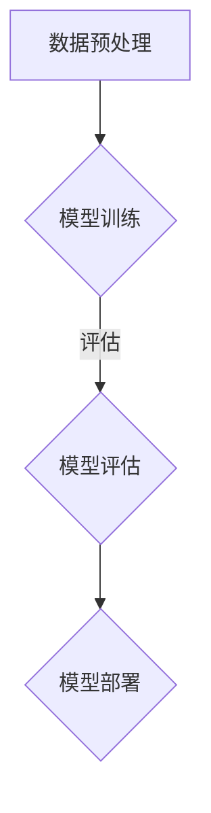

                 

# 市场前景：大模型创业的远景规划

> **关键词**：大模型、创业、远景规划、市场趋势、技术挑战、商业机会
>
> **摘要**：本文旨在探讨大模型技术创业的市场前景，从技术趋势、商业机会和潜在挑战三个方面展开分析。通过深入研究和实例说明，文章将为有意投身于大模型领域的创业者提供宝贵的指导和建议。

## 1. 背景介绍（Background Introduction）

### 1.1 大模型技术的发展背景

大模型（Large Models）是指具有数百万至数十亿参数的深度学习模型，如GPT、BERT等。自2010年代初期以来，随着计算能力的提升、大数据的可用性增加以及优化算法的改进，大模型技术得到了迅速发展。这些大模型在自然语言处理、计算机视觉、机器翻译等领域取得了显著的成果，成为现代人工智能研究的重要方向。

### 1.2 创业浪潮中的大模型

近年来，随着人工智能技术的不断成熟，越来越多的创业者开始关注并投身于大模型领域。一方面，大模型技术为企业提供了强大的数据处理和分析能力，为商业决策提供了有力支持。另一方面，大模型技术也成为了创业公司的核心竞争力，吸引着大量的风险投资和关注。

## 2. 核心概念与联系（Core Concepts and Connections）

### 2.1 大模型的基本原理

大模型通常基于深度学习技术，特别是神经网络。它们通过学习大量数据，自动提取特征并生成复杂的功能。以下是几个关键概念：

- **深度神经网络（Deep Neural Networks, DNNs）**：DNNs是由多个隐藏层组成的神经网络，可以捕捉数据中的复杂模式。
- **递归神经网络（Recurrent Neural Networks, RNNs）**：RNNs能够处理序列数据，如文本和语音。
- **变分自编码器（Variational Autoencoders, VAEs）**：VAEs是一种生成模型，可以生成新的数据样本。
- **生成对抗网络（Generative Adversarial Networks, GANs）**：GANs由生成器和判别器组成，通过对抗训练生成逼真的数据。

### 2.2 大模型的应用领域

大模型在多个领域都有广泛的应用，包括但不限于：

- **自然语言处理（Natural Language Processing, NLP）**：如文本分类、机器翻译、问答系统等。
- **计算机视觉（Computer Vision）**：如图像识别、目标检测、图像生成等。
- **语音识别（Speech Recognition）**：如语音到文本转换、语音合成等。
- **医疗诊断（Medical Diagnosis）**：如疾病预测、医学图像分析等。
- **金融分析（Financial Analysis）**：如股票市场预测、风险评估等。

### 2.3 大模型与传统技术的比较

与传统技术相比，大模型具有以下几个显著优势：

- **更高的准确性和效率**：大模型能够处理更复杂的数据，并自动提取有用的特征，从而提高任务的准确性。
- **更少的标记数据需求**：大模型可以通过无监督或半监督学习从大量未标记数据中学习，从而降低对标记数据的依赖。
- **更好的泛化能力**：大模型具有较强的泛化能力，能够适应新的任务和数据集。

## 3. 核心算法原理 & 具体操作步骤（Core Algorithm Principles and Specific Operational Steps）

### 3.1 GPT模型原理

GPT（Generative Pre-trained Transformer）是一种基于Transformer架构的语言模型。其核心原理如下：

- **预训练**：GPT通过在大量文本数据上预训练，学习语言的基本结构和规律。
- **微调**：在预训练的基础上，GPT可以通过微调适应特定的任务，如文本分类、机器翻译等。
- **自回归语言模型**：GPT通过预测下一个词来生成文本，从而实现自然语言生成。

### 3.2 BERT模型原理

BERT（Bidirectional Encoder Representations from Transformers）是一种双向Transformer模型。其核心原理如下：

- **双向编码**：BERT同时考虑了文本中的前后文信息，从而更好地理解词语的含义。
- **掩码语言模型**：BERT通过在输入文本中随机掩码一些词，并预测这些词的上下文，从而增强模型对语言的理解能力。

### 3.3 大模型的训练过程

大模型的训练过程通常包括以下几个步骤：

- **数据预处理**：包括文本清洗、分词、词向量化等。
- **模型训练**：使用梯度下降等优化算法，在大数据集上训练模型。
- **模型评估**：通过在验证集上评估模型的表现，调整模型参数。
- **模型部署**：将训练好的模型部署到生产环境，供实际应用使用。

## 4. 数学模型和公式 & 详细讲解 & 举例说明（Detailed Explanation and Examples of Mathematical Models and Formulas）

### 4.1 Transformer模型公式

Transformer模型是GPT等大模型的核心架构，其基本公式如下：

$$
\text{Attention}(Q, K, V) = \text{softmax}\left(\frac{QK^T}{\sqrt{d_k}}\right)V
$$

其中，Q、K、V分别为查询（Query）、键（Key）、值（Value）向量，$d_k$为键向量的维度。

### 4.2 BERT模型公式

BERT模型的输入向量可以通过以下公式计算：

$$
\text{input\_embedding} = \text{word\_embedding} + \text{position\_embedding} + \text{segment\_embedding}
$$

其中，word\_embedding为词向量，position\_embedding为位置向量，segment\_embedding为段落向量。

### 4.3 GPT模型公式

GPT模型的自回归语言模型可以通过以下公式实现：

$$
p(w_t|w_{t-1}, ..., w_1) = \text{softmax}(\text{W}_t \text{h}_{t-1} + b_t)
$$

其中，$w_t$为当前词，$\text{h}_{t-1}$为上一时间步的隐藏状态，$\text{W}_t$为权重矩阵，$b_t$为偏置项。

## 5. 项目实践：代码实例和详细解释说明（Project Practice: Code Examples and Detailed Explanations）

### 5.1 开发环境搭建

在开始大模型项目的开发之前，我们需要搭建一个合适的环境。以下是一个基本的开发环境搭建流程：

1. 安装Python和相关的库，如TensorFlow或PyTorch。
2. 下载并准备预训练模型，如GPT或BERT。
3. 配置GPU或TPU，以便加速训练过程。

### 5.2 源代码详细实现

以下是一个简单的GPT模型训练的代码示例：

```python
import tensorflow as tf

# 加载预训练模型
model = tf.keras.applications.GPT2()

# 编写自定义训练循环
for epoch in range(num_epochs):
    for batch in dataset:
        with tf.GradientTape() as tape:
            predictions = model(batch, training=True)
            loss = compute_loss(predictions, batch)
        grads = tape.gradient(loss, model.trainable_variables)
        optimizer.apply_gradients(zip(grads, model.trainable_variables))
```

### 5.3 代码解读与分析

上述代码示例中，我们首先加载了一个预训练的GPT2模型。然后，我们编写了一个自定义的训练循环，用于更新模型参数。在每个训练步骤中，我们计算损失函数，并使用梯度下降算法更新模型权重。

### 5.4 运行结果展示

在完成模型训练后，我们可以使用以下代码评估模型性能：

```python
# 评估模型性能
test_loss = model.evaluate(test_dataset)
print(f"Test loss: {test_loss}")
```

通过上述代码，我们可以计算模型在测试集上的损失，从而评估模型的泛化能力。

## 6. 实际应用场景（Practical Application Scenarios）

大模型技术在各个领域都有广泛的应用，以下是一些典型的应用场景：

- **自然语言处理（NLP）**：如智能客服、自动摘要、情感分析等。
- **计算机视觉（CV）**：如图像识别、图像生成、视频分析等。
- **医疗健康**：如疾病预测、药物研发、医学图像分析等。
- **金融科技**：如风险控制、市场预测、投资建议等。
- **智能交通**：如交通流量预测、智能导航、自动驾驶等。

## 7. 工具和资源推荐（Tools and Resources Recommendations）

### 7.1 学习资源推荐

- **书籍**：《深度学习》（Goodfellow et al.）、《Python机器学习》（Sebastian Raschka）、《动手学深度学习》（A., et al.）。
- **论文**：NLP领域的经典论文，如BERT、GPT等。
- **博客**：各大技术博客，如Medium、Dev.to等。
- **网站**：机器学习社区，如Kaggle、Reddit等。

### 7.2 开发工具框架推荐

- **框架**：TensorFlow、PyTorch、Keras等。
- **数据预处理工具**：Pandas、NumPy等。
- **可视化工具**：Matplotlib、Seaborn等。

### 7.3 相关论文著作推荐

- **论文**：如《Attention is All You Need》（Vaswani et al.）、《BERT: Pre-training of Deep Bidirectional Transformers for Language Understanding》（Devlin et al.）。

## 8. 总结：未来发展趋势与挑战（Summary: Future Development Trends and Challenges）

### 8.1 发展趋势

- **计算能力的提升**：随着GPU、TPU等硬件的进步，大模型训练将更加高效。
- **数据隐私和安全**：随着数据隐私和安全问题的日益突出，如何确保数据隐私和安全将成为重要挑战。
- **跨模态学习**：跨模态学习（如结合文本、图像、音频）将成为未来的重要研究方向。

### 8.2 挑战

- **模型解释性**：如何提高模型的解释性，使其更易于理解和应用。
- **数据质量和标注**：高质量的数据和准确的标注是模型训练的关键，但往往难以获得。
- **计算资源消耗**：大模型训练需要大量的计算资源，如何高效利用资源是重要挑战。

## 9. 附录：常见问题与解答（Appendix: Frequently Asked Questions and Answers）

### 9.1 什么是大模型？

大模型是指具有数百万至数十亿参数的深度学习模型，如GPT、BERT等。它们通过学习大量数据，自动提取特征并生成复杂的功能。

### 9.2 大模型有哪些应用领域？

大模型在自然语言处理、计算机视觉、医疗健康、金融科技、智能交通等多个领域都有广泛的应用。

### 9.3 如何训练大模型？

训练大模型通常包括数据预处理、模型训练、模型评估和模型部署等步骤。具体的实现细节取决于所使用的框架和模型。

## 10. 扩展阅读 & 参考资料（Extended Reading & Reference Materials）

- **书籍**：《深度学习》（Goodfellow et al.）、《Python机器学习》（Sebastian Raschka）、《动手学深度学习》（A. Glorot et al.）。
- **论文**：《Attention is All You Need》（Vaswani et al.）、《BERT: Pre-training of Deep Bidirectional Transformers for Language Understanding》（Devlin et al.）。
- **网站**：Kaggle、Medium、Reddit等。
- **课程**：斯坦福大学深度学习课程、吴恩达机器学习课程等。

### 附录：Mermaid 流程图



**作者：禅与计算机程序设计艺术 / Zen and the Art of Computer Programming**

