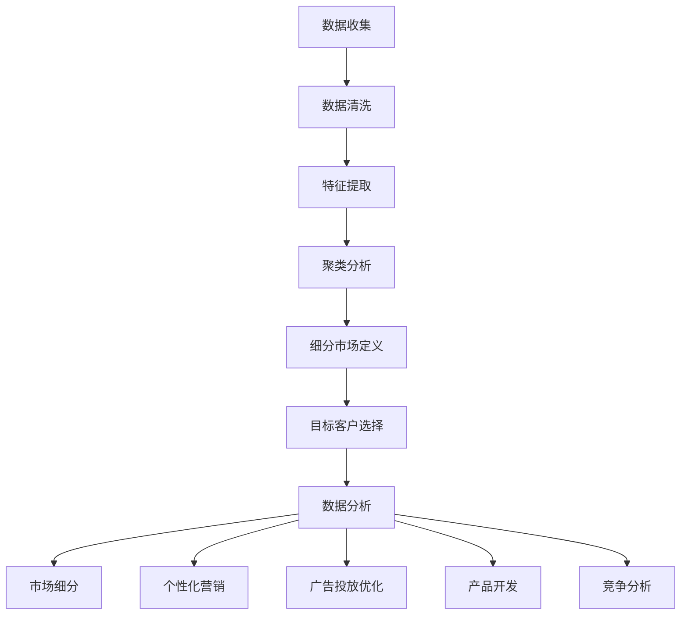
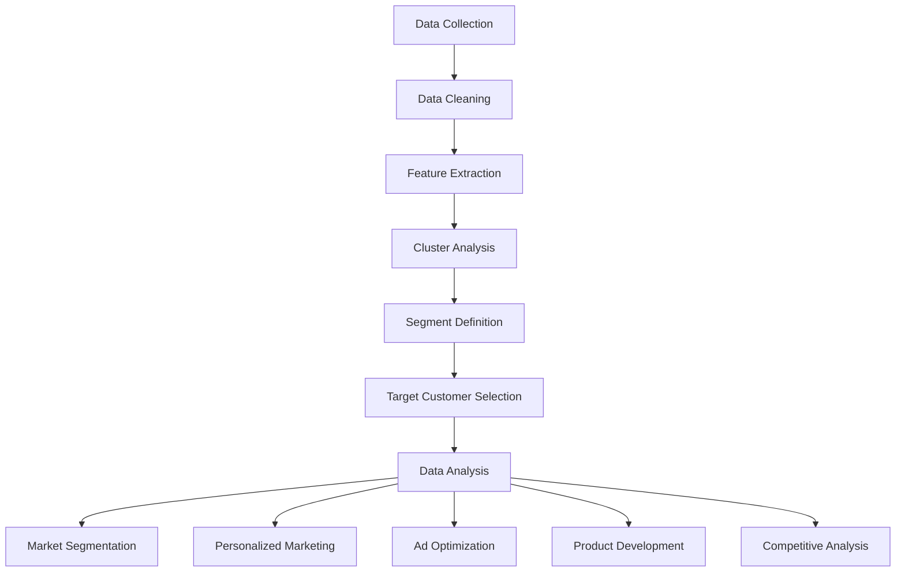

                 

### 文章标题

Market Promotion Strategies: Effective Engagement with Target Audiences

在当今充满竞争的商业环境中，市场推广策略的成功与否直接影响到企业的生存与发展。本文将深入探讨一系列高效触达目标群体的市场推广策略，帮助企业和营销人员提高市场占有率、提升品牌影响力。

本文的核心关键词包括：市场推广策略、目标群体、客户定位、数据分析、内容营销、社交媒体推广、品牌建设等。这些关键词不仅构成了文章的核心内容，也是企业制定市场推广策略时需要关注的关键要素。

本文摘要将首先概述市场推广策略的定义与重要性，然后探讨如何通过客户定位与数据分析来识别和吸引目标群体。接着，文章将详细分析内容营销和社交媒体推广的具体方法与技巧，并探讨品牌建设在市场推广中的核心作用。最后，我们将讨论未来市场推广策略的发展趋势与挑战，为企业提供实用的建议和策略。希望通过本文，读者能够获得对市场推广策略的深刻理解和实际操作的指导。

### Introduction to Market Promotion Strategies

Market promotion strategies are crucial in today's competitive business landscape. These strategies are designed to enhance brand visibility, drive customer engagement, and ultimately increase market share. Effectively implementing market promotion strategies enables businesses to stand out in crowded markets and build lasting relationships with their target audiences.

The primary keywords for this article include market promotion strategies, target audiences, customer segmentation, data analysis, content marketing, social media promotion, and brand building. These keywords not only define the core content of the article but also highlight the key elements that marketers and business owners need to focus on when developing their promotional strategies.

The abstract will provide an overview of the definition and importance of market promotion strategies. It will then delve into the processes of identifying and engaging target audiences through customer segmentation and data analysis. Following that, the article will discuss specific methods and techniques for content marketing and social media promotion. Finally, the importance of brand building in market promotion will be explored, along with a discussion on future trends and challenges. The aim is to offer readers a deep understanding and practical guidance on market promotion strategies.

### 1. 背景介绍（Background Introduction）

#### 市场推广的定义与历史发展

市场推广（Market Promotion）是企业通过一系列策略和活动，提升品牌知名度，吸引潜在客户，并促进产品或服务的销售的过程。其目标在于增加市场份额，提高盈利能力。市场推广的定义和范畴随着营销理论的演进和技术的进步而不断扩展。

在早期，市场推广主要依赖于广告、促销活动和销售促进等传统手段。例如，20世纪50年代，电视广告成为企业宣传的主要渠道，通过大规模投放广告来提升品牌知名度。随后的几十年中，随着互联网的发展，市场推广逐渐从线下转向线上，电子邮件营销、搜索引擎优化（SEO）和社交媒体推广等新型营销手段逐渐兴起。

#### 市场推广的重要性

市场推广在企业战略中扮演着至关重要的角色。首先，它有助于提升品牌知名度。通过多样化的市场推广活动，企业可以在潜在客户心中建立强大的品牌形象，从而增加品牌忠诚度和市场份额。

其次，市场推广可以精准地触达目标受众。通过数据分析和市场调研，企业可以了解目标客户的需求和偏好，制定个性化的营销策略，提高营销活动的效果。

此外，市场推广还有助于促进销售。有效的市场推广活动可以吸引更多的潜在客户，增加销售额和利润。例如，促销活动、优惠券和限时折扣等手段可以直接刺激消费者的购买欲望。

#### 市场推广的发展趋势

随着技术的不断进步，市场推广策略也在不断创新和演进。以下是当前市场推广的一些主要趋势：

1. **数字化营销**：随着互联网的普及，数字化营销成为市场推广的主要手段。电子邮件营销、社交媒体推广、搜索引擎营销（SEM）和内容营销等数字营销手段已成为企业提升品牌知名度和吸引目标客户的重要工具。

2. **个性化营销**：通过大数据和人工智能技术，企业可以收集和分析大量用户数据，实现精准的个性化营销。个性化营销不仅能够提高客户的满意度和忠诚度，还可以提高营销活动的转化率。

3. **社交媒体营销**：社交媒体平台已经成为企业推广的重要阵地。通过在社交媒体上发布内容、开展互动活动、与客户建立直接联系，企业可以迅速扩大品牌影响力，吸引更多的潜在客户。

4. **社交媒体营销**：社交媒体平台已经成为企业推广的重要阵地。通过在社交媒体上发布内容、开展互动活动、与客户建立直接联系，企业可以迅速扩大品牌影响力，吸引更多的潜在客户。

5. **多媒体整合营销**：结合多种营销手段，如视频营销、直播营销、KOL营销等，可以实现更全面、更有效的市场推广。

6. **可持续营销**：随着消费者对环境和社会责任的关注增加，可持续营销成为市场推广的新趋势。企业通过推广环保、社会责任等理念，不仅能够提高品牌形象，还能吸引更多有共同价值观的消费者。

#### 市场推广的挑战与机遇

虽然市场推广策略在不断进步，但企业仍然面临诸多挑战。例如，消费者信息过载、市场竞争加剧、技术变革等。然而，这些挑战也带来了新的机遇。企业需要不断适应市场变化，创新营销策略，才能在激烈的市场竞争中脱颖而出。

总的来说，市场推广是企业成功的关键因素之一。通过深入理解市场推广的定义、历史发展、重要性以及当前的发展趋势，企业可以制定更有效、更具针对性的市场推广策略，从而在竞争激烈的市场中占据一席之地。

### 1. 背景介绍（Background Introduction）

#### Definition and Historical Development of Market Promotion

Market promotion is a process that businesses employ to enhance brand visibility, attract potential customers, and ultimately drive sales. Its purpose is to increase market share and boost profitability. The definition and scope of market promotion have evolved over time with advancements in marketing theories and technologies.

In the early days, market promotion primarily relied on traditional methods such as advertising, promotional activities, and sales promotions. For example, in the 1950s, television advertising became a major channel for enterprises to build brand awareness through mass advertising. Over the following decades, as the internet developed, market promotion gradually shifted from offline to online channels, with emerging methods such as email marketing, search engine optimization (SEO), and social media promotion becoming prominent.

#### Importance of Market Promotion

Market promotion plays a crucial role in a company's strategic planning. Firstly, it helps to enhance brand awareness. Through diverse market promotion activities, businesses can build a strong brand image in the minds of potential customers, thereby increasing brand loyalty and market share.

Secondly, market promotion enables precise targeting of audiences. By utilizing data analysis and market research, companies can understand the needs and preferences of their target customers, allowing them to develop personalized marketing strategies that improve the effectiveness of marketing campaigns.

Furthermore, market promotion can promote sales. Effective marketing campaigns can attract more potential customers, thereby increasing sales revenue and profits. For instance, promotional activities such as discounts, coupons, and limited-time offers can directly stimulate consumer purchasing desires.

#### Trends in Market Promotion

With the continuous advancement of technology, market promotion strategies are also evolving. Here are some key trends in current market promotion:

1. **Digital Marketing**: As the internet has become widely accessible, digital marketing has become the primary method for brand promotion. Digital marketing tools such as email marketing, social media promotion, and search engine marketing (SEM) are essential for businesses to increase brand visibility and attract target customers.

2. **Personalized Marketing**: Through the use of big data and artificial intelligence, businesses can collect and analyze vast amounts of user data to enable precise personalized marketing. Personalized marketing not only improves customer satisfaction and loyalty but also enhances the conversion rate of marketing campaigns.

3. **Social Media Marketing**: Social media platforms have become a critical battleground for brand promotion. By publishing content, conducting interactive activities, and establishing direct connections with customers, businesses can rapidly expand their brand influence and attract more potential customers.

4. **Integrated Multichannel Marketing**: Combining various marketing methods such as video marketing, live streaming marketing, and KOL marketing can achieve a more comprehensive and effective market promotion strategy.

5. **Sustainable Marketing**: With increasing consumer awareness of environmental and social issues, sustainable marketing has become a new trend. By promoting eco-friendly and social responsibility concepts, businesses can improve their brand image and attract more consumers who share the same values.

#### Challenges and Opportunities in Market Promotion

Although market promotion strategies are advancing, businesses still face numerous challenges. These include information overload among consumers, intensified market competition, and technological changes. However, these challenges also present new opportunities. Companies need to adapt to market changes and innovate their marketing strategies to thrive in a competitive environment.

In summary, market promotion is a key factor in a company's success. By deeply understanding the definition, historical development, importance, and current trends of market promotion, businesses can develop more effective and targeted marketing strategies to gain a competitive edge in the market.

### 2. 核心概念与联系（Core Concepts and Connections）

#### 2.1 客户定位（Customer Segmentation）

客户定位是企业市场推广策略中至关重要的一环。它涉及根据不同特征将潜在客户群体划分为若干细分市场，以便更精准地满足各细分市场的需求。客户定位的关键在于识别出最具价值和最有潜力的目标客户群体，从而优化市场推广资源的分配。

客户定位的过程通常包括以下几个步骤：

1. **数据收集**：通过市场调研、问卷调查、客户访谈等方式收集潜在客户的数据，包括年龄、性别、收入水平、教育程度、消费习惯等。

2. **数据清洗**：对收集到的数据进行分析和筛选，去除无效和重复的数据，确保数据的准确性和完整性。

3. **特征提取**：根据业务目标和市场环境，提取对客户行为有重要影响的关键特征，例如购买频率、消费金额、品牌偏好等。

4. **聚类分析**：利用聚类算法将客户数据划分为若干个群体，每个群体具有相似的特征和行为模式。

5. **细分市场定义**：根据聚类结果，为每个群体定义细分市场，并确定其主要特征和需求。

6. **目标客户选择**：根据企业的资源能力和市场策略，选择最具价值和最有潜力的目标客户群体。

#### 2.2 数据分析（Data Analysis）

数据分析是市场推广策略制定和执行的重要工具。通过分析大量的市场数据，企业可以深入了解客户行为、市场趋势和竞争对手的表现，从而做出更明智的决策。

数据分析的主要步骤包括：

1. **数据收集**：从各种数据源（如数据库、社交媒体、电商平台等）收集相关数据。

2. **数据预处理**：清洗和整理数据，使其符合分析要求。这可能包括数据去重、缺失值填充、数据规范化等。

3. **数据分析**：运用统计学、机器学习等方法对数据进行处理和分析，提取有用的信息。

4. **数据可视化**：利用图表、报表等形式将分析结果呈现出来，帮助决策者更好地理解数据。

5. **报告生成**：撰写数据分析报告，总结分析结果并提出相应的策略建议。

#### 2.3 客户定位与数据分析的关系

客户定位和数据分析是相辅相成的。客户定位提供了目标客户群体的明确描述，而数据分析则为这些客户群体的行为、需求和偏好提供了具体的数据支持。通过结合客户定位和数据分析，企业可以更准确地识别目标客户，制定更有效的市场推广策略。

例如，一家电商企业通过客户定位确定了目标客户群体为25-35岁的女性，爱好时尚，具有较高的消费能力。通过数据分析，企业发现这些客户更倾向于在晚上浏览和购买商品，并且在社交媒体上积极分享购物体验。这些信息可以帮助企业优化广告投放时间、调整商品推荐策略，并制定针对性的社交媒体营销活动，从而提高转化率和客户满意度。

#### 2.4 客户定位与数据分析在市场推广策略中的应用

在市场推广策略中，客户定位和数据分析的应用主要体现在以下几个方面：

1. **市场细分**：通过数据分析识别出具有相似特征的潜在客户群体，为市场细分提供依据。

2. **目标客户选择**：利用数据分析评估不同细分市场的价值和潜力，选择最具吸引力的目标客户群体。

3. **个性化营销**：根据数据分析结果，制定个性化的营销策略，提高客户满意度和忠诚度。

4. **广告投放优化**：通过数据分析优化广告投放，提高广告的精准度和投放效率。

5. **产品开发**：根据数据分析结果，了解客户需求和偏好，优化产品设计和开发。

6. **竞争分析**：通过数据分析评估竞争对手的市场表现，制定相应的竞争策略。

#### 2.5 客户定位与数据分析的 Mermaid 流程图

以下是一个简单的 Mermaid 流程图，展示了客户定位和数据分析的过程：



通过上述流程，企业可以系统地识别和吸引目标客户，优化市场推广策略，提高市场竞争力。

### 2. Core Concepts and Connections

#### 2.1 Customer Segmentation

Customer segmentation is a crucial component of a company's marketing strategy. It involves dividing a potential customer base into smaller groups based on various characteristics to better cater to the needs of each segment. The key to effective customer segmentation is to identify the most valuable and promising target customer groups, thereby optimizing the allocation of marketing resources.

The process of customer segmentation typically includes the following steps:

1. **Data Collection**: Gather potential customer data through market research, surveys, customer interviews, etc., including age, gender, income level, education, and purchasing habits.

2. **Data Cleaning**: Analyze and filter the collected data to remove invalid or duplicate entries, ensuring the accuracy and completeness of the data.

3. **Feature Extraction**: Identify key characteristics that significantly impact customer behavior based on business objectives and market conditions. For example, purchasing frequency, spending amount, and brand preference.

4. **Cluster Analysis**: Use clustering algorithms to group customer data into several segments based on similar features and behavioral patterns.

5. **Segment Definition**: Define each segment based on the clustering results, and determine their main characteristics and needs.

6. **Target Customer Selection**: Select the most valuable and promising target customer groups based on the company's resources and marketing strategies.

#### 2.2 Data Analysis

Data analysis is an essential tool in the development and execution of marketing strategies. By analyzing large volumes of market data, companies can gain insights into customer behavior, market trends, and competitor performance, thereby making more informed decisions.

The main steps in data analysis include:

1. **Data Collection**: Gather relevant data from various sources, such as databases, social media, e-commerce platforms, etc.

2. **Data Preprocessing**: Clean and organize the data to meet analysis requirements. This may involve data deduplication, missing value imputation, and data normalization.

3. **Data Analysis**: Apply statistical and machine learning methods to process and analyze the data, extracting useful information.

4. **Data Visualization**: Present the analysis results in the form of charts, tables, and reports to help decision-makers better understand the data.

5. **Report Generation**: Write an analytical report summarizing the findings and providing strategic recommendations.

#### 2.3 The Relationship between Customer Segmentation and Data Analysis

Customer segmentation and data analysis are complementary. Customer segmentation provides a clear description of target customer groups, while data analysis provides concrete data support for the behaviors, needs, and preferences of these groups. By combining customer segmentation and data analysis, companies can more accurately identify target customers and develop more effective marketing strategies.

For example, an e-commerce company identifies its target customer group as 25-35-year-old women who enjoy fashion and have a high purchasing power. Data analysis reveals that these customers tend to browse and make purchases in the evening and actively share their shopping experiences on social media. These insights can help the company optimize ad placement times, adjust product recommendation strategies, and create targeted social media marketing campaigns, thereby increasing conversion rates and customer satisfaction.

#### 2.4 Applications of Customer Segmentation and Data Analysis in Market Promotion Strategies

In market promotion strategies, the application of customer segmentation and data analysis is primarily seen in the following aspects:

1. **Market Segmentation**: Use data analysis to identify potential customer groups with similar characteristics to support market segmentation.

2. **Target Customer Selection**: Utilize data analysis to evaluate the value and potential of different segments and select the most attractive target customer groups.

3. **Personalized Marketing**: Develop personalized marketing strategies based on data analysis results to improve customer satisfaction and loyalty.

4. **Ad Optimization**: Use data analysis to optimize ad placement and improve the precision and efficiency of advertising.

5. **Product Development**: Utilize data analysis to understand customer needs and preferences, optimizing product design and development.

6. **Competitive Analysis**: Use data analysis to evaluate competitor performance in the market and develop corresponding competitive strategies.

#### 2.5 Mermaid Flowchart of Customer Segmentation and Data Analysis

Here is a simple Mermaid flowchart illustrating the process of customer segmentation and data analysis:



Through this process, companies can systematically identify and attract target customers, optimize their marketing strategies, and enhance market competitiveness.

### 3. 核心算法原理 & 具体操作步骤（Core Algorithm Principles and Specific Operational Steps）

#### 3.1 客户定位算法原理

在市场推广中，客户定位算法是识别和划分目标客户群的关键工具。常见的客户定位算法包括聚类分析（Cluster Analysis）、逻辑回归（Logistic Regression）和决策树（Decision Tree）等。

1. **聚类分析**：聚类分析是一种无监督学习方法，它通过将相似的数据点划分为同一集群来识别客户群体。常见的聚类算法包括K-means、层次聚类（Hierarchical Clustering）和DBSCAN等。

   - **K-means算法**：K-means算法是一种基于距离度量的聚类方法，其目标是将数据点划分为K个簇，使得每个簇内的数据点之间的距离最小，而簇与簇之间的距离最大。
   - **层次聚类**：层次聚类通过递归地将数据点合并成越来越大的簇，从而形成层次结构的聚类结果。
   - **DBSCAN（Density-Based Spatial Clustering of Applications with Noise）**：DBSCAN基于密度的分布将数据点划分为簇，它能够处理噪声和异常点，具有较强的聚类能力。

2. **逻辑回归**：逻辑回归是一种有监督学习方法，用于预测客户是否属于某一特定群体。逻辑回归通过建立客户特征与群体归属之间的逻辑关系模型，从而预测客户群体的归属。

   - **模型建立**：逻辑回归模型通过最小化损失函数（通常使用对数似然损失函数）来拟合客户特征与群体归属之间的非线性关系。
   - **模型评估**：逻辑回归模型的评估通常使用准确率、召回率、F1值等指标来衡量模型的性能。

3. **决策树**：决策树是一种树形结构模型，通过一系列的决策规则将客户划分为不同的群体。决策树基于特征之间的条件关系，逐层划分数据，直到达到分类或聚类目标。

   - **递归分割**：决策树通过递归分割数据集，每次分割都选择最优的特征和阈值来划分数据。
   - **剪枝**：为了防止过拟合，决策树通常需要进行剪枝处理，以简化模型并提高泛化能力。

#### 3.2 客户定位算法的具体操作步骤

以下是使用K-means算法进行客户定位的详细步骤：

1. **数据准备**：
   - 收集并清洗客户数据，包括客户的年龄、收入、消费习惯、购买频率等特征。
   - 标准化数据，确保所有特征在相同的尺度上。

2. **确定聚类数量**：
   - 使用肘部法则（Elbow Method）或轮廓系数（Silhouette Coefficient）确定最佳的聚类数量K。

3. **初始化聚类中心**：
   - 选择K个初始聚类中心，可以使用随机初始化或K-means++算法来优化初始中心的选择。

4. **聚类过程**：
   - 将每个客户分配到最近的聚类中心。
   - 更新聚类中心，使得每个簇内部的距离最小。

5. **迭代计算**：
   - 重复聚类过程，直到聚类中心不再发生变化或达到预设的迭代次数。

6. **评估结果**：
   - 使用聚类内距离和聚类间距离评估聚类效果，确保簇内紧凑、簇间分离。

7. **客户群体划分**：
   - 根据聚类结果，将客户划分为不同的群体，并分析每个群体的特征和需求。

#### 3.3 数据分析工具与平台

在实际操作中，常用的数据分析工具和平台包括Python的scikit-learn库、R语言和Tableau等。以下是一个使用Python进行客户定位的示例代码：

```python
from sklearn.cluster import KMeans
from sklearn.preprocessing import StandardScaler
import pandas as pd

# 加载数据
data = pd.read_csv('customer_data.csv')
features = ['age', 'income', 'spending_habits', 'purchase_frequency']

# 数据标准化
scaler = StandardScaler()
data_scaled = scaler.fit_transform(data[features])

# 确定聚类数量
inertia = []
for i in range(1, 11):
    kmeans = KMeans(n_clusters=i, init='k-means++', max_iter=300, n_init=10, random_state=0)
    kmeans.fit(data_scaled)
    inertia.append(kmeans.inertia_)

# 绘制肘部法则图
plt.plot(range(1, 11), inertia)
plt.xlabel('Number of Clusters')
plt.ylabel('Inertia')
plt.title('Elbow Method')
plt.show()

# 选择最佳聚类数量
k = 3
kmeans = KMeans(n_clusters=k, init='k-means++', max_iter=300, n_init=10, random_state=0)
kmeans.fit(data_scaled)

# 客户群体划分
labels = kmeans.predict(data_scaled)
data['cluster'] = labels

# 分析客户群体特征
print(data.groupby('cluster').mean())
```

通过上述步骤和代码，企业可以高效地实现客户定位，为市场推广策略提供数据支持。

### 3. Core Algorithm Principles and Specific Operational Steps

#### 3.1 Principles of Customer Segmentation Algorithms

In marketing, customer segmentation algorithms are essential tools for identifying and dividing target customer groups. Common algorithms for customer segmentation include cluster analysis, logistic regression, and decision trees.

1. **Cluster Analysis**: Cluster analysis is an unsupervised learning method that groups similar data points into clusters. Popular clustering algorithms include K-means, hierarchical clustering, and DBSCAN.

   - **K-means Algorithm**: K-means is a distance-based clustering method that aims to partition data points into K clusters such that the within-cluster sum of squares (WCSS) is minimized.
   - **Hierarchical Clustering**: Hierarchical clustering builds a hierarchy of clusters by iteratively merging or splitting clusters.
   - **DBSCAN (Density-Based Spatial Clustering of Applications with Noise)**: DBSCAN clusters points based on their density and can handle noise and outliers, providing strong clustering capabilities.

2. **Logistic Regression**: Logistic regression is a supervised learning method used to predict whether a customer belongs to a specific segment. Logistic regression establishes a logistic relationship between customer features and segment membership.

   - **Model Building**: The logistic regression model fits a logistic relationship between customer features and segment membership by minimizing a loss function (often the log-likelihood loss function).
   - **Model Evaluation**: The performance of logistic regression models is typically evaluated using metrics such as accuracy, recall, and F1-score.

3. **Decision Trees**: Decision trees are tree-structured models that divide customers into different segments based on feature relationships. Decision trees make sequential decisions about features and thresholds to divide data until a classification or clustering goal is achieved.

   - **Recursive Splitting**: Decision trees recursively split the data set, choosing the best feature and threshold at each step.
   - **Pruning**: To prevent overfitting, decision trees are often pruned to simplify the model and improve generalization.

#### 3.2 Specific Steps for Customer Segmentation Algorithms

The following are detailed steps for using the K-means algorithm for customer segmentation:

1. **Data Preparation**:
   - Collect and clean customer data, including features such as age, income, spending habits, and purchase frequency.
   - Standardize the data to ensure all features are on the same scale.

2. **Determining the Number of Clusters**:
   - Use the elbow method or silhouette coefficient to determine the optimal number of clusters K.

3. **Initializing Cluster Centers**:
   - Select K initial cluster centers, using random initialization or K-means++ to optimize the initial centers.

4. **Clustering Process**:
   - Assign each customer to the nearest cluster center.
   - Update the cluster centers to minimize the distance within each cluster.

5. **Iteration Calculation**:
   - Repeat the clustering process until the cluster centers no longer change or reach a predetermined number of iterations.

6. **Evaluation of Results**:
   - Evaluate the clustering effect using within-cluster distance and between-cluster distance to ensure compact clusters and clear separation.

7. **Customer Segment Division**:
   - Divide customers into different segments based on the clustering results and analyze the characteristics and needs of each segment.

#### 3.3 Data Analysis Tools and Platforms

In practice, common data analysis tools and platforms for customer segmentation include Python's scikit-learn library, R language, and Tableau. Here is an example code for using Python for customer segmentation:

```python
from sklearn.cluster import KMeans
from sklearn.preprocessing import StandardScaler
import pandas as pd

# Load data
data = pd.read_csv('customer_data.csv')
features = ['age', 'income', 'spending_habits', 'purchase_frequency']

# Standardize data
scaler = StandardScaler()
data_scaled = scaler.fit_transform(data[features])

# Determine the number of clusters
inertia = []
for i in range(1, 11):
    kmeans = KMeans(n_clusters=i, init='k-means++', max_iter=300, n_init=10, random_state=0)
    kmeans.fit(data_scaled)
    inertia.append(kmeans.inertia_)

# Plot elbow method graph
plt.plot(range(1, 11), inertia)
plt.xlabel('Number of Clusters')
plt.ylabel('Inertia')
plt.title('Elbow Method')
plt.show()

# Select the optimal number of clusters
k = 3
kmeans = KMeans(n_clusters=k, init='k-means++', max_iter=300, n_init=10, random_state=0)
kmeans.fit(data_scaled)

# Customer segment division
labels = kmeans.predict(data_scaled)
data['cluster'] = labels

# Analyze customer segment characteristics
print(data.groupby('cluster').mean())
```

By following these steps and code, companies can efficiently perform customer segmentation to support marketing strategies.

### 4. 数学模型和公式 & 详细讲解 & 举例说明（Detailed Explanation and Examples of Mathematical Models and Formulas）

在市场推广中，数学模型和公式是分析客户行为、评估营销策略效果的重要工具。以下将介绍几种常见的数学模型和公式，并结合实际案例进行详细讲解。

#### 4.1 聚类分析模型

聚类分析模型用于将数据集划分为若干个相似的数据点群组。常见的聚类算法包括K-means、层次聚类等。以下以K-means算法为例，介绍其数学模型和公式。

1. **目标函数**：

   K-means算法的目标是最小化每个簇内部数据点到其聚类中心的距离平方和。

   目标函数公式为：

   $$ J = \sum_{i=1}^{k} \sum_{x \in S_i} ||x - \mu_i||^2 $$

   其中，\( J \) 表示目标函数，\( k \) 表示聚类数量，\( S_i \) 表示第 \( i \) 个簇，\( \mu_i \) 表示第 \( i \) 个簇的中心点，\( x \) 表示数据点。

2. **初始化聚类中心**：

   K-means算法通常采用随机初始化或K-means++算法来初始化聚类中心。

   初始化聚类中心的步骤如下：

   - 随机选择K个数据点作为初始聚类中心。
   - 对于每个数据点，计算其到各个聚类中心的距离，并将其分配到最近的聚类中心。

3. **迭代更新聚类中心**：

   在迭代过程中，每次迭代都会更新聚类中心，使得每个簇内部的数据点之间的距离最小。

   更新聚类中心的步骤如下：

   - 对于每个数据点，计算其到各个聚类中心的距离。
   - 将每个数据点分配到最近的聚类中心。
   - 计算新的聚类中心，取每个簇内所有数据点的平均值。

4. **停止条件**：

   K-means算法通常在满足以下条件时停止迭代：

   - 聚类中心不再发生变化。
   - 达到预设的迭代次数。

#### 4.2 逻辑回归模型

逻辑回归模型是一种用于分类问题的线性模型，其目标是在给定特征的情况下，预测客户是否属于某一类别。以下为逻辑回归模型的数学模型和公式。

1. **概率分布**：

   逻辑回归模型基于伯努利分布，用于预测客户属于某一类别的概率。

   概率分布公式为：

   $$ P(Y=1 | X) = \frac{1}{1 + e^{-(\beta_0 + \beta_1X_1 + \beta_2X_2 + ... + \beta_nX_n)}} $$

   其中，\( P(Y=1 | X) \) 表示在给定特征 \( X \) 下，客户属于类别1的概率，\( \beta_0, \beta_1, \beta_2, ..., \beta_n \) 分别为模型的参数。

2. **损失函数**：

   逻辑回归模型的损失函数通常采用对数似然损失函数。

   损失函数公式为：

   $$ L(\theta) = -\frac{1}{m} \sum_{i=1}^{m} [y^{(i)} \log(P(Y=1 | X^{(i)})) + (1 - y^{(i)}) \log(1 - P(Y=1 | X^{(i)}))] $$

   其中，\( m \) 表示样本数量，\( y^{(i)} \) 表示第 \( i \) 个样本的类别标签，\( P(Y=1 | X^{(i)})) \) 表示第 \( i \) 个样本属于类别1的概率，\( \theta \) 表示模型参数。

3. **模型优化**：

   逻辑回归模型的参数优化通常采用梯度下降法。

   梯度下降法步骤如下：

   - 计算损失函数关于模型参数的梯度。
   - 更新模型参数，使得损失函数值减小。

#### 4.3 实际案例讲解

假设某电商企业希望通过聚类分析识别出不同消费习惯的客户群体，并使用逻辑回归模型预测客户是否购买某商品。

1. **数据准备**：

   收集客户数据，包括年龄、收入、购买频率、商品偏好等特征。假设数据集包含1000个样本，每个样本有5个特征。

2. **K-means聚类分析**：

   - 初始化聚类中心，选择K=3。
   - 计算每个样本到聚类中心的距离，并分配到最近的聚类中心。
   - 更新聚类中心，计算每个簇内所有样本的平均值。
   - 重复迭代，直到聚类中心不再发生变化。

   示例代码：

   ```python
   from sklearn.cluster import KMeans
   import pandas as pd

   # 加载数据
   data = pd.read_csv('customer_data.csv')
   features = ['age', 'income', 'purchase_frequency', 'product_preference']

   # K-means聚类
   kmeans = KMeans(n_clusters=3, init='k-means++', max_iter=300, n_init=10, random_state=0)
   kmeans.fit(data[features])

   # 客户群体划分
   labels = kmeans.predict(data[features])
   data['cluster'] = labels

   # 分析客户群体特征
   print(data.groupby('cluster').mean())
   ```

3. **逻辑回归模型**：

   - 使用聚类结果，选择具有相似特征的两个客户群体作为训练数据。
   - 训练逻辑回归模型，预测客户是否购买某商品。

   示例代码：

   ```python
   from sklearn.linear_model import LogisticRegression
   import pandas as pd

   # 加载数据
   data = pd.read_csv('customer_data.csv')
   features = ['age', 'income', 'purchase_frequency', 'product_preference']
   target = 'purchased'

   # 分割数据集
   train_data = data[data['cluster'] == 0].drop('cluster', axis=1)
   train_target = data[data['cluster'] == 0][target]

   # 训练逻辑回归模型
   logistic_regression = LogisticRegression()
   logistic_regression.fit(train_data, train_target)

   # 预测客户是否购买某商品
   predictions = logistic_regression.predict_proba(data[features])[:, 1]
   print(predictions)
   ```

通过上述数学模型和公式的讲解，以及实际案例的应用，企业可以更有效地分析客户行为、评估营销策略效果，从而优化市场推广策略。

### 4. Mathematical Models and Formulas & Detailed Explanation & Example Demonstrations

In marketing, mathematical models and formulas are essential tools for analyzing customer behavior and evaluating the effectiveness of marketing strategies. This section introduces several common mathematical models and their formulas, along with detailed explanations and example demonstrations.

#### 4.1 Clustering Analysis Model

Clustering analysis models are used to divide a dataset into several groups of similar data points. Common clustering algorithms include K-means and hierarchical clustering. Here, we'll focus on the K-means algorithm and its mathematical model and formulas.

1. **Objective Function**

   The objective of the K-means algorithm is to minimize the sum of squared distances between each data point and its corresponding cluster center.

   The objective function formula is:

   $$ J = \sum_{i=1}^{k} \sum_{x \in S_i} ||x - \mu_i||^2 $$

   Where \( J \) represents the objective function, \( k \) is the number of clusters, \( S_i \) is the \( i \)-th cluster, \( \mu_i \) is the center of the \( i \)-th cluster, and \( x \) is a data point.

2. **Initializing Cluster Centers**

   K-means algorithms usually use random initialization or K-means++ to initialize cluster centers.

   Steps for initializing cluster centers:

   - Randomly select K data points as initial cluster centers.
   - For each data point, calculate its distance to each cluster center and assign it to the nearest cluster center.

3. **Iterative Update of Cluster Centers**

   During the iterative process, the cluster centers are updated to minimize the distance between each data point within its cluster.

   Steps for updating cluster centers:

   - Calculate the distance of each data point to each cluster center.
   - Assign each data point to the nearest cluster center.
   - Compute the new cluster centers by averaging all the data points within each cluster.

4. **Termination Condition**

   The K-means algorithm usually stops iterating when the following conditions are met:

   - Cluster centers do not change anymore.
   - The number of iterations reaches a predetermined threshold.

#### 4.2 Logistic Regression Model

Logistic regression is a linear model for classification problems, aimed at predicting whether a customer belongs to a certain category given certain features. Here's the mathematical model and formulas for logistic regression.

1. **Probability Distribution**

   Logistic regression models the probability of a customer belonging to a certain category given the features.

   The probability distribution formula is:

   $$ P(Y=1 | X) = \frac{1}{1 + e^{-(\beta_0 + \beta_1X_1 + \beta_2X_2 + ... + \beta_nX_n)}} $$

   Where \( P(Y=1 | X) \) is the probability of a customer belonging to category 1 given the features \( X \), \( \beta_0, \beta_1, \beta_2, ..., \beta_n \) are the model parameters.

2. **Loss Function**

   The loss function for logistic regression is typically the log-likelihood loss function.

   The loss function formula is:

   $$ L(\theta) = -\frac{1}{m} \sum_{i=1}^{m} [y^{(i)} \log(P(Y=1 | X^{(i)})) + (1 - y^{(i)}) \log(1 - P(Y=1 | X^{(i)}))] $$

   Where \( m \) is the number of samples, \( y^{(i)} \) is the label of the \( i \)-th sample, \( P(Y=1 | X^{(i)})) \) is the probability of the \( i \)-th sample belonging to category 1, and \( \theta \) are the model parameters.

3. **Model Optimization**

   The optimization of logistic regression models is typically done using gradient descent.

   Steps for gradient descent:

   - Calculate the gradient of the loss function with respect to the model parameters.
   - Update the model parameters to make the loss function smaller.

#### 4.3 Practical Case Explanation

Suppose an e-commerce company wants to identify different customer segments based on their purchasing habits and use logistic regression to predict whether a customer will purchase a certain product.

1. **Data Preparation**

   Collect customer data, including age, income, purchase frequency, and product preferences. Assume the dataset contains 1000 samples with 5 features each.

2. **K-means Clustering Analysis**

   - Initialize cluster centers, select \( k = 3 \).
   - Calculate the distance of each sample to each cluster center and assign it to the nearest cluster center.
   - Update cluster centers by averaging all samples within each cluster.
   - Repeat the iteration until cluster centers do not change.

   Example code:

   ```python
   from sklearn.cluster import KMeans
   import pandas as pd

   # Load data
   data = pd.read_csv('customer_data.csv')
   features = ['age', 'income', 'purchase_frequency', 'product_preference']

   # K-means clustering
   kmeans = KMeans(n_clusters=3, init='k-means++', max_iter=300, n_init=10, random_state=0)
   kmeans.fit(data[features])

   # Customer segment division
   labels = kmeans.predict(data[features])
   data['cluster'] = labels

   # Analyze customer segment characteristics
   print(data.groupby('cluster').mean())
   ```

3. **Logistic Regression Model**

   - Use the clustering results to select two customer segments with similar features as the training data.
   - Train the logistic regression model to predict whether a customer will purchase the product.

   Example code:

   ```python
   from sklearn.linear_model import LogisticRegression
   import pandas as pd

   # Load data
   data = pd.read_csv('customer_data.csv')
   features = ['age', 'income', 'purchase_frequency', 'product_preference']
   target = 'purchased'

   # Split data
   train_data = data[data['cluster'] == 0].drop('cluster', axis=1)
   train_target = data[data['cluster'] == 0][target]

   # Train logistic regression model
   logistic_regression = LogisticRegression()
   logistic_regression.fit(train_data, train_target)

   # Predict whether customers will purchase the product
   predictions = logistic_regression.predict_proba(data[features])[:, 1]
   print(predictions)
   ```

Through the detailed explanation and example demonstration of these mathematical models and formulas, companies can more effectively analyze customer behavior and evaluate the effectiveness of marketing strategies, thereby optimizing their marketing strategies.

### 5. 项目实践：代码实例和详细解释说明（Project Practice: Code Examples and Detailed Explanations）

在本节中，我们将通过一个实际案例展示市场推广策略中的客户定位和数据分析过程。具体步骤包括数据准备、客户定位算法应用、数据分析以及结果展示。以下是用Python编写的完整代码示例，并附有详细解释。

#### 5.1 开发环境搭建

在开始编写代码之前，确保安装以下Python库：

- pandas：用于数据操作和分析
- numpy：用于数值计算
- scikit-learn：用于机器学习算法
- matplotlib：用于数据可视化

安装命令如下：

```bash
pip install pandas numpy scikit-learn matplotlib
```

#### 5.2 源代码详细实现

以下是一个完整的Python脚本，用于客户定位和数据分

