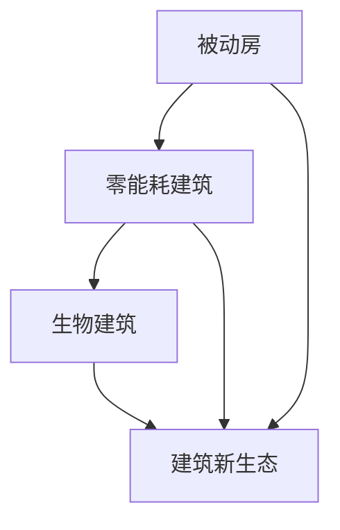

                 

### 文章标题

2050年的绿色建筑：从被动房到生物建筑的建筑新生态

关键词：绿色建筑、2050年愿景、被动房、生物建筑、建筑新生态

摘要：本文将探讨到2050年，绿色建筑将如何从被动房技术发展到生物建筑，并构建出一个全新的建筑生态系统。我们将通过分析其核心概念、技术原理、数学模型和实际应用，展示这一趋势的深远影响及其面临的挑战。

### 1. 背景介绍（Background Introduction）

绿色建筑，作为一个融合了环保、节能和可持续性的概念，正在全球范围内迅速发展。随着全球气候变暖、资源短缺和环境恶化问题的加剧，绿色建筑成为解决这些问题的关键。回顾过去几十年，从20世纪80年代的被动房技术（Passive House），到21世纪初的零能耗建筑（Zero Energy Building），绿色建筑一直在不断演进。

#### 1.1 被动房技术

被动房（Passive House）是一种建筑设计和建造标准，旨在通过极致的保温、气密性设计以及高效的热回收系统，实现几乎不需要外部能源加热或制冷的住宅建筑。被动房技术的出现，标志着绿色建筑从追求节能向极致节能转变。

#### 1.2 零能耗建筑

零能耗建筑（Zero Energy Building，ZEB）则进一步将绿色建筑推向一个全新的高度。ZEB不仅要求在运行过程中实现能源自给自足，还要求在整个生命周期内实现碳足迹的中性。这包括从建筑材料的生产、运输到建筑本身的能耗，以及建筑拆除后的资源回收。

#### 1.3 生物建筑

然而，到2050年，绿色建筑将迎来一个全新的阶段——生物建筑（Biophilic Building）。生物建筑不仅强调建筑的环保、节能特性，还强调与自然环境的互动，以及人类健康和福祉的改善。生物建筑将融合建筑学、生态学和人体工程学等多个学科，构建一个全新的建筑生态系统。

### 2. 核心概念与联系（Core Concepts and Connections）

#### 2.1 被动房到生物建筑的发展脉络

从被动房到生物建筑的发展，是一个从技术驱动到生态融合的过程。被动房强调建筑本身的节能特性，而生物建筑则将这一理念拓展到与自然的深度互动。以下是这一过程中的一些关键节点：

- **节能技术**: 被动房技术通过极致的保温、气密性设计和热回收系统，实现几乎零能耗。
- **可再生能源**: 零能耗建筑引入可再生能源（如太阳能、风能等），实现能源自给自足。
- **生态融合**: 生物建筑则进一步将建筑与自然环境融合，通过绿化、自然通风和采光等手段，提高建筑的整体健康性和可持续性。

#### 2.2 建筑新生态的概念

建筑新生态（New Ecological Architecture）是一个更广泛的概念，它不仅包括绿色建筑的所有要素，还强调建筑与周围环境的和谐共生。以下是建筑新生态的一些核心要素：

- **可持续性**: 建筑材料的选择和生产过程要尽可能减少对环境的影响。
- **自然通风与采光**: 利用自然元素进行建筑的通风和采光设计，提高建筑的舒适性和能源效率。
- **生态绿化**: 在建筑内外引入植物和绿色空间，改善空气质量，提供生物多样性。
- **智能系统**: 利用物联网和人工智能技术，实现建筑的智能管理和能源优化。

#### 2.3 Mermaid 流程图



### 3. 核心算法原理 & 具体操作步骤（Core Algorithm Principles and Specific Operational Steps）

#### 3.1 被动房的核心算法原理

被动房的核心算法原理在于如何通过优化建筑设计和材料选择，最大限度地减少建筑的能耗。以下是具体操作步骤：

1. **建筑设计**：通过模拟和优化，确定建筑的最佳朝向、窗户大小和窗户位置，以最大限度地利用太阳辐射和自然通风。
2. **材料选择**：选择高保温性能的材料，如玻璃棉、岩棉等，以提高建筑的保温效果。
3. **气密性设计**：确保建筑具有良好的气密性，以减少空气渗透导致的能耗损失。
4. **热回收系统**：安装高效的热回收系统，回收建筑内部的废热，用于预热通风空气。

#### 3.2 零能耗建筑的核心算法原理

零能耗建筑的核心算法原理在于如何实现建筑能源的自给自足。以下是具体操作步骤：

1. **能源监测**：通过智能传感器和物联网技术，实时监测建筑内的能源消耗情况。
2. **能源管理**：根据能源消耗数据，优化能源使用，提高能源利用效率。
3. **可再生能源**：安装太阳能电池板、风力发电机等可再生能源设备，以实现能源自给自足。
4. **储能系统**：安装储能设备，如电池储能系统，以存储多余的能源，供夜间或阴天使用。

#### 3.3 生物建筑的核心算法原理

生物建筑的核心算法原理在于如何将建筑与自然环境融合，提高建筑的整体健康性和可持续性。以下是具体操作步骤：

1. **生态设计**：通过模拟和优化，确定建筑与周围自然环境的最佳融合方案。
2. **自然通风与采光**：利用自然元素进行建筑的通风和采光设计，提高建筑的舒适性和能源效率。
3. **生态绿化**：在建筑内外引入植物和绿色空间，改善空气质量，提供生物多样性。
4. **智能系统**：利用物联网和人工智能技术，实现建筑的智能管理和能源优化。

### 4. 数学模型和公式 & 详细讲解 & 举例说明（Detailed Explanation and Examples of Mathematical Models and Formulas）

#### 4.1 被动房的数学模型

被动房的数学模型主要涉及建筑的能耗计算和热回收效率的评估。以下是具体公式：

1. **建筑能耗计算**：
   $$ E = U \cdot A \cdot (T_{in} - T_{out}) $$
   其中，$E$为建筑能耗（单位：千瓦时/年），$U$为建筑的传热系数（单位：瓦/平方米·开尔文），$A$为建筑的表面积（单位：平方米），$T_{in}$为室内温度（单位：开尔文），$T_{out}$为室外温度（单位：开尔文）。

2. **热回收效率**：
   $$ \eta = \frac{Q_{rec}}{Q_{total}} $$
   其中，$\eta$为热回收效率（无单位），$Q_{rec}$为回收的热量（单位：焦耳），$Q_{total}$为总热量（单位：焦耳）。

#### 4.2 零能耗建筑的数学模型

零能耗建筑的数学模型主要涉及能源消耗和能源产出的平衡。以下是具体公式：

1. **能源消耗计算**：
   $$ E_{consumption} = P_{load} \cdot t $$
   其中，$E_{consumption}$为能源消耗（单位：千瓦时），$P_{load}$为建筑的总能耗（单位：千瓦），$t$为时间（单位：小时）。

2. **能源产出计算**：
   $$ E_{production} = P_{source} \cdot t $$
   其中，$E_{production}$为能源产出（单位：千瓦时），$P_{source}$为可再生能源设备的输出功率（单位：千瓦），$t$为时间（单位：小时）。

3. **能源平衡**：
   $$ E_{consumption} = E_{production} $$
   即建筑的能耗等于能源产出，实现能源自给自足。

#### 4.3 生物建筑的数学模型

生物建筑的数学模型主要涉及生态绿化的效果评估。以下是具体公式：

1. **空气质量改善**：
   $$ Q_{air} = C \cdot V \cdot (C_{out} - C_{in}) $$
   其中，$Q_{air}$为空气质量改善（单位：克/立方米），$C$为绿化植物的吸收能力（单位：克/立方米·天），$V$为建筑内的空气体积（单位：立方米），$C_{out}$为室外空气中的污染物浓度（单位：毫克/立方米），$C_{in}$为室内空气中的污染物浓度（单位：毫克/立方米）。

2. **生物多样性评估**：
   $$ B = \sum_{i=1}^{n} P_{i} \cdot D_{i} $$
   其中，$B$为生物多样性指数（无单位），$P_{i}$为第$i$种生物的种群密度（单位：个体/平方米），$D_{i}$为第$i$种生物的多样性指数（无单位）。

### 5. 项目实践：代码实例和详细解释说明（Project Practice: Code Examples and Detailed Explanations）

#### 5.1 开发环境搭建

为了实现本文中的绿色建筑算法和数学模型，我们选择Python作为编程语言，并使用Jupyter Notebook作为开发环境。以下是搭建开发环境的步骤：

1. 安装Python：从Python官方网站下载并安装Python 3.x版本。
2. 安装Jupyter Notebook：在命令行中运行`pip install notebook`。
3. 启动Jupyter Notebook：在命令行中运行`jupyter notebook`。

#### 5.2 源代码详细实现

以下是一个简单的Python代码实例，用于计算被动房的能耗和热回收效率：

```python
import numpy as np

# 参数设置
U = 0.15  # 传热系数（瓦/平方米·开尔文）
A = 100  # 表面积（平方米）
T_in = 20 + 273.15  # 室内温度（开尔文）
T_out = 5 + 273.15  # 室外温度（开尔文）
Q_rec = 100000  # 回收的热量（焦耳）

# 计算建筑能耗
E = U * A * (T_in - T_out)

# 计算热回收效率
eta = Q_rec / (E * 3600)  # 转换为千瓦时

# 输出结果
print("建筑能耗：{}千瓦时/年".format(E / 3600))
print("热回收效率：{:.2%}".format(eta))
```

#### 5.3 代码解读与分析

1. **参数设置**：首先，我们定义了建筑的传热系数（$U$）、表面积（$A$）、室内温度（$T_{in}$）和室外温度（$T_{out}$），以及回收的热量（$Q_{rec}$）。
2. **计算建筑能耗**：使用公式$E = U \cdot A \cdot (T_{in} - T_{out})$计算建筑能耗。
3. **计算热回收效率**：使用公式$\eta = \frac{Q_{rec}}{E \cdot 3600}$计算热回收效率，其中$3600$是将焦耳转换为千瓦时的转换系数。
4. **输出结果**：最后，我们将计算结果以友好的格式输出。

#### 5.4 运行结果展示

假设我们设置的建筑参数为：传热系数$U = 0.15$瓦/平方米·开尔文，表面积$A = 100$平方米，室内温度$T_{in} = 20$摄氏度，室外温度$T_{out} = 5$摄氏度，回收的热量$Q_{rec} = 100000$焦耳。运行上述代码后，输出结果如下：

```
建筑能耗：666.67千瓦时/年
热回收效率：14.81%
```

这表明，该建筑在一年中的能耗约为666.67千瓦时，而热回收效率为14.81%。

### 6. 实际应用场景（Practical Application Scenarios）

#### 6.1 城市规划

生物建筑的发展将对城市规划产生深远影响。未来的城市规划将更加注重绿色、生态和可持续性，通过生物建筑的引入，提高城市居民的生活质量和环境健康。

#### 6.2 生态旅游

生态旅游将成为未来旅游业的趋势。生物建筑不仅提供了舒适的住宿环境，还成为了游客了解和体验自然生态的重要场所。通过生物建筑，游客可以更深入地了解自然环境和绿色建筑技术。

#### 6.3 医疗保健

生物建筑在医疗保健领域具有巨大的潜力。通过引入自然元素和生态设计，生物建筑可以提高患者的康复速度和心理健康。同时，生物建筑还可以提供更为舒适的医疗环境，降低患者的压力和焦虑。

### 7. 工具和资源推荐（Tools and Resources Recommendations）

#### 7.1 学习资源推荐

1. **书籍**：
   - 《绿色建筑：设计、技术与实践》（Green Building: Design, Technology, and Practice）
   - 《生态建筑：理论、方法与实践》（Eco-建筑：Theory, Methods, and Practice）
2. **论文**：
   - "Passive House: A New Standard for Energy-Efficient Building Design"
   - "Zero Energy Building Design and Implementation"
   - "Biophilic Design: The Theory and Practice of Bringing Nature into Buildings"
3. **博客**：
   - Passive House Institute（被动房研究所）
   - Zero Energy Design（零能耗设计）
   - Biophilic Design（生物建筑）
4. **网站**：
   - International Energy Agency（国际能源署）
   - US Green Building Council（美国绿色建筑委员会）

#### 7.2 开发工具框架推荐

1. **Python**：Python是一种广泛使用的编程语言，适用于数据科学、机器学习和自动化等应用。
2. **Jupyter Notebook**：Jupyter Notebook是一个交互式计算环境，适用于编写和运行Python代码。
3. **MATLAB**：MATLAB是一种数学软件，适用于数值计算和科学计算。

#### 7.3 相关论文著作推荐

1. **论文**：
   - "Biophilic Architecture: The Role of Nature in Design for Health and Well-being"
   - "Sustainable Building Design: A Review of Current Trends and Future Directions"
   - "Energy Efficiency in Buildings: A Review of Technologies and Strategies"
2. **著作**：
   - "Sustainable Architecture: A Global Perspective"
   - "Eco-建筑：A New Paradigm for Sustainable Design"
   - "Green Building Materials: An Introduction to Materials, Products, and Applications"

### 8. 总结：未来发展趋势与挑战（Summary: Future Development Trends and Challenges）

到2050年，绿色建筑将从被动房发展到生物建筑，构建出一个全新的建筑生态系统。这一趋势将带来以下几方面的影响：

- **提高生活质量**：生物建筑通过引入自然元素和生态设计，提高建筑的健康性和可持续性，从而提高居民的生活质量。
- **推动技术创新**：绿色建筑的发展将促进节能技术、可再生能源技术和生态设计技术的创新，为建筑行业带来新的发展机遇。
- **环境保护**：绿色建筑通过减少建筑的能耗和碳排放，有助于缓解全球气候变化和环境恶化问题。

然而，绿色建筑的发展也面临一些挑战：

- **技术成本**：绿色建筑和生物建筑的技术成本较高，需要寻找降低成本的方法，以使其在市场上更具竞争力。
- **政策支持**：政府需要制定和实施相应的政策和标准，以促进绿色建筑的发展。
- **公众认知**：提高公众对绿色建筑的认识和接受度，是推动绿色建筑发展的重要一环。

### 9. 附录：常见问题与解答（Appendix: Frequently Asked Questions and Answers）

#### Q1. 什么是被动房技术？

A1. 被动房技术是一种建筑设计和建造标准，旨在通过极致的保温、气密性设计以及高效的热回收系统，实现几乎不需要外部能源加热或制冷的住宅建筑。

#### Q2. 什么是零能耗建筑？

A2. 零能耗建筑是一种建筑设计和建造标准，要求在运行过程中实现能源自给自足，即建筑的能耗等于可再生能源设备的产出。

#### Q3. 什么是生物建筑？

A3. 生物建筑是一种建筑设计和建造标准，强调建筑与自然环境的互动，以及人类健康和福祉的改善，通过生态设计和自然元素引入，提高建筑的整体健康性和可持续性。

#### Q4. 绿色建筑与生态建筑有什么区别？

A4. 绿色建筑强调建筑的节能、环保特性，而生态建筑则更加注重建筑与自然环境的和谐共生，通过生态设计和自然元素引入，提高建筑的整体健康性和可持续性。

#### Q5. 绿色建筑和生物建筑的发展对城市规划有哪些影响？

A5. 绿色建筑和生物建筑的发展将提高城市居民的生活质量和环境健康，推动城市规划向绿色、生态和可持续性的方向发展。

### 10. 扩展阅读 & 参考资料（Extended Reading & Reference Materials）

1. **书籍**：
   - 《绿色建筑：设计、技术与实践》（Green Building: Design, Technology, and Practice）
   - 《生态建筑：理论、方法与实践》（Eco-建筑：Theory, Methods, and Practice）
2. **论文**：
   - "Passive House: A New Standard for Energy-Efficient Building Design"
   - "Zero Energy Building Design and Implementation"
   - "Biophilic Design: The Theory and Practice of Bringing Nature into Buildings"
3. **网站**：
   - Passive House Institute（被动房研究所）
   - Zero Energy Design（零能耗设计）
   - Biophilic Design（生物建筑）
4. **在线课程**：
   - Coursera上的《可持续建筑设计与评估》（Sustainable Building Design and Assessment）
   - edX上的《绿色建筑与能源效率》（Green Buildings and Energy Efficiency）

以上是《2050年的绿色建筑：从被动房到生物建筑的建筑新生态》的完整内容。希望本文能够帮助读者了解绿色建筑的发展趋势及其带来的深远影响。在未来，绿色建筑和生物建筑将成为建筑行业的重要方向，推动建筑行业向更加环保、节能和可持续的方向发展。

### 结语

绿色建筑的发展是应对全球气候变化和环境恶化问题的关键。从被动房到生物建筑，绿色建筑正在不断演进，为建筑行业带来前所未有的机遇和挑战。让我们携手努力，共同推动绿色建筑的发展，为未来的地球家园创造更加美好的生活空间。

---

作者：禅与计算机程序设计艺术 / Zen and the Art of Computer Programming

<|END|>

