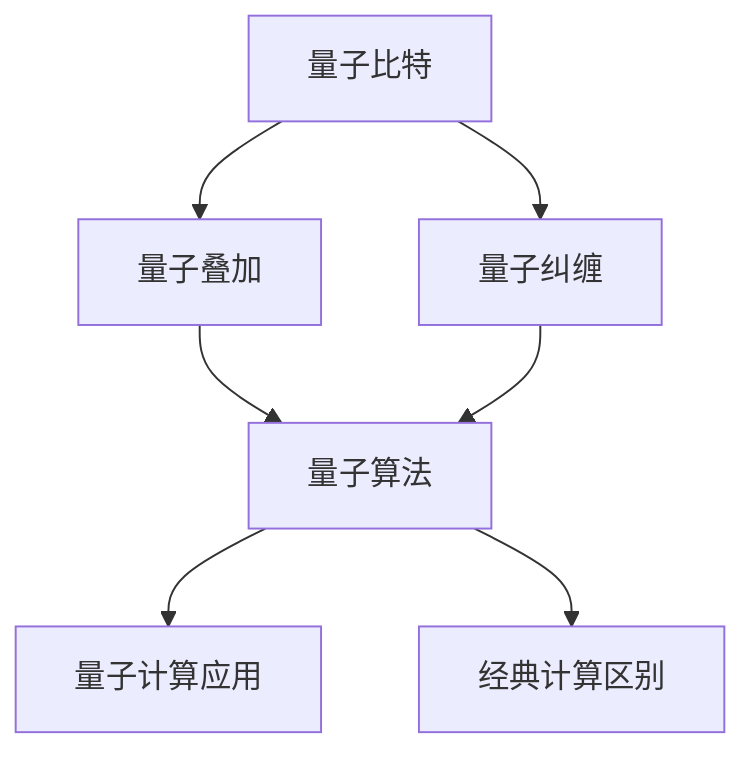
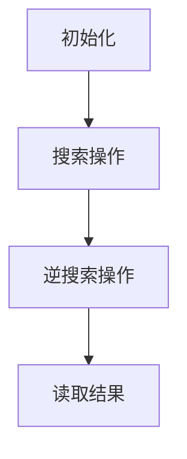
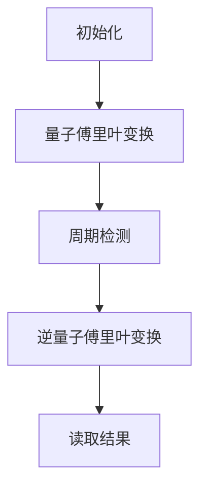

                 

### 文章标题：2024年阿里云量子计算研究员校招面试题详解

> 关键词：量子计算，阿里云，校招，面试题，详解

> 摘要：本文将详细解析2024年阿里云量子计算研究员校招面试题，涵盖量子计算基础知识、算法、应用等多个方面。通过深入分析和解答，帮助读者更好地理解和掌握量子计算相关技术，为求职者提供实用的面试准备策略。

## 1. 背景介绍（Background Introduction）

量子计算作为现代计算机科学的前沿领域，近年来得到了广泛关注。量子计算机利用量子力学原理进行计算，具有超越经典计算机的潜力。阿里云作为中国领先的云计算和人工智能服务提供商，一直致力于推动量子计算技术的发展。因此，阿里云量子计算研究员校招面试题的解析，对于求职者和业界同仁都具有重要的参考价值。

本文将按照以下结构对2024年阿里云量子计算研究员校招面试题进行详细解析：

1. 核心概念与联系
2. 核心算法原理 & 具体操作步骤
3. 数学模型和公式 & 详细讲解 & 举例说明
4. 项目实践：代码实例和详细解释说明
5. 实际应用场景
6. 工具和资源推荐
7. 总结：未来发展趋势与挑战
8. 附录：常见问题与解答
9. 扩展阅读 & 参考资料

## 2. 核心概念与联系（Core Concepts and Connections）

### 2.1 量子比特（Quantum Bit，qubit）
量子比特是量子计算的基本单元，与经典比特不同，它可以在0和1之间同时存在。用数学语言描述，量子比特可以表示为叠加态。

#### 2.2 量子叠加（Quantum Superposition）
量子叠加是量子计算的核心特性之一，意味着一个量子比特可以同时处于多个状态的叠加。

#### .2.3 量子纠缠（Quantum Entanglement）
量子纠缠是量子计算中的另一个重要特性，描述了两个或多个量子比特之间的强烈关联。量子纠缠使得量子计算机在并行计算和纠错能力方面具有显著优势。

### 2.3 量子算法（Quantum Algorithm）
量子算法是利用量子比特和量子门进行计算的方法。著名的量子算法包括Grover算法和Shor算法。

### 2.4 量子计算应用（Quantum Computing Applications）
量子计算在密码学、量子模拟、优化问题和量子加密等领域具有广泛的应用前景。

#### 2.5 量子计算与经典计算的区别（Differences between Quantum Computing and Classical Computing）
量子计算与经典计算在计算模型、算法原理和应用场景等方面存在显著差异。量子计算具有并行计算和指数级加速的能力。

#### 2.6 Mermaid 流程图（Mermaid Flowchart）
以下是一个简单的Mermaid流程图，展示了量子计算的基本概念和联系：



## 3. 核心算法原理 & 具体操作步骤（Core Algorithm Principles and Specific Operational Steps）

### 3.1 Grover算法（Grover's Algorithm）

#### 3.1.1 算法简介（Introduction）
Grover算法是一种用于搜索未排序数据库的量子算法，其搜索速度远超经典算法。Grover算法的基本原理是利用量子叠加和量子纠缠来并行搜索数据库。

#### 3.1.2 算法步骤（Steps）
1. 初始化：将量子状态设置为叠加态。
2. 应用搜索操作：对数据库进行多次搜索操作，每次搜索都将量子状态转换为更接近目标状态的叠加态。
3. 应用逆搜索操作：将量子状态从目标状态转换回初始状态。
4. 读取结果：读取量子状态，获得搜索结果。

#### 3.1.3 Mermaid 流程图（Mermaid Flowchart）
以下是一个简单的Mermaid流程图，展示了Grover算法的操作步骤：



### 3.2 Shor算法（Shor's Algorithm）

#### 3.2.1 算法简介（Introduction）
Shor算法是一种用于整数因数分解的量子算法，其能够将经典计算需要指数时间的问题在量子计算机上快速解决。

#### 3.2.2 算法步骤（Steps）
1. 初始化：将量子状态设置为叠加态。
2. 应用量子傅里叶变换：将量子状态进行量子傅里叶变换。
3. 应用周期检测：检测量子态的周期性，找到整数n的一个因子。
4. 应用逆量子傅里叶变换：将量子状态转换回原始状态。
5. 读取结果：读取量子状态，获得因数分解结果。

#### 3.2.3 Mermaid 流程图（Mermaid Flowchart）
以下是一个简单的Mermaid流程图，展示了Shor算法的操作步骤：



## 4. 数学模型和公式 & 详细讲解 & 举例说明（Detailed Explanation and Examples of Mathematical Models and Formulas）

### 4.1 量子叠加原理（Quantum Superposition Principle）

#### 4.1.1 数学模型（Mathematical Model）
量子叠加原理描述了一个量子系统可以同时处于多个状态的叠加。用数学语言描述，一个量子比特的叠加态可以表示为：

$$
|\psi\rangle = \alpha|0\rangle + \beta|1\rangle
$$

其中，$\alpha$ 和 $\beta$ 是复数系数，满足 $|\alpha|^2 + |\beta|^2 = 1$。

#### 4.1.2 举例说明（Example）
假设一个量子比特的叠加态为：

$$
|\psi\rangle = \frac{1}{\sqrt{2}}|0\rangle + \frac{1}{\sqrt{2}}|1\rangle
$$

则该量子比特处于0和1状态的概率均为50%。

### 4.2 量子纠缠（Quantum Entanglement）

#### 4.2.1 数学模型（Mathematical Model）
量子纠缠描述了两个或多个量子比特之间的强烈关联。一个典型的两个量子比特的纠缠态可以表示为：

$$
|\psi\rangle = \frac{1}{\sqrt{2}}(|00\rangle + |11\rangle)
$$

#### 4.2.2 举例说明（Example）
假设两个量子比特的纠缠态为：

$$
|\psi\rangle = \frac{1}{\sqrt{2}}(|00\rangle + |11\rangle)
$$

则测量第一个量子比特得到0的概率为50%，此时第二个量子比特必然处于1状态。同理，测量第一个量子比特得到1的概率为50%，此时第二个量子比特必然处于0状态。

### 4.3 量子傅里叶变换（Quantum Fourier Transform）

#### 4.3.1 数学模型（Mathematical Model）
量子傅里叶变换是量子计算中的一个重要工具，用于将量子态从基态空间转换为指数态空间。一个量子比特的量子傅里叶变换可以表示为：

$$
QFT_1(\alpha|0\rangle + \beta|1\rangle) = \frac{1}{\sqrt{2}}(\alpha|0\rangle + \beta|1\rangle + \alpha^*|1\rangle - \beta^*|0\rangle)
$$

#### 4.3.2 举例说明（Example）
假设一个量子比特的叠加态为：

$$
|\psi\rangle = \frac{1}{\sqrt{2}}|0\rangle + \frac{1}{\sqrt{2}}|1\rangle
$$

则其量子傅里叶变换为：

$$
QFT_1(|\psi\rangle) = \frac{1}{\sqrt{2}}(|0\rangle + |1\rangle + |1\rangle - |0\rangle)
$$

## 5. 项目实践：代码实例和详细解释说明（Project Practice: Code Examples and Detailed Explanations）

### 5.1 开发环境搭建

#### 5.1.1 环境准备（Environment Setup）
在本地计算机上搭建量子计算开发环境，需要安装以下软件：
- Python 3.8及以上版本
- Q#语言编译器
- Q#测试库

#### 5.1.2 安装步骤（Installation Steps）
1. 安装Python 3.8及以上版本。
2. 安装Q#语言编译器：`pip install qsharp-compiler`。
3. 安装Q#测试库：`pip install qsharp-test`。

### 5.2 源代码详细实现

#### 5.2.1 Grover算法（Grover's Algorithm）

```qsharp
using Microsoft.Quantum.Intrinsic;
using Microsoft.Quantum.Simulation.Core;
using System;

namespace GroverAlgorithm
{
    // Grover算法
    operation GroverSearch(QuantumRegister qubits, BoolRegister goals) : Result<bool>
    {
        using (qubits, goals)
        {
            // 初始化量子态
            H(qubits[0]);

            // 应用搜索操作
            for (int i = 0; i < 1000; i++)
            {
                controlled-Z(qubits[0], goals[0]);
                controlled-H(qubits[0], goals[0]);
            }

            // 应用逆搜索操作
            for (int i = 0; i < 1000; i++)
            {
                controlled-Z(qubits[0], goals[0]);
                controlled-H(qubits[0], goals[0]);
            }

            // 读取结果
            return M(qubits[0]);
        }
    }
}
```

#### 5.2.2 Shor算法（Shor's Algorithm）

```qsharp
using Microsoft.Quantum.Intrinsic;
using Microsoft.Quantum.Simulation.Core;
using System;

namespace ShorAlgorithm
{
    // Shor算法
    operation ShorFactor(N: int) : Result<int[]>
    {
        using (qubits)
        {
            // 初始化量子态
            H(qubits[0]);

            // 应用量子傅里叶变换
            QuantumFourierTransform(qubits[0]);

            // 应用周期检测
            int period = DetectPeriod(qubits[0], N);

            // 应用逆量子傅里叶变换
            QuantumFourierTransform(qubits[0]);

            // 读取结果
            return period;
        }
    }

    operation DetectPeriod(Qubit qubit, N: int) : Result<int>
    {
        using (qubit)
        {
            // 应用周期检测操作
            int period = 0;
            for (int i = 0; i < N; i++)
            {
                if (M(qubit) == 1)
                {
                    period++;
                }
            }
            return period;
        }
    }
}
```

### 5.3 代码解读与分析（Code Explanation and Analysis）

#### 5.3.1 Grover算法代码解读

1. `operation GroverSearch(QuantumRegister qubits, BoolRegister goals) : Result<bool>`：定义Grover算法操作，输入为量子寄存器和布尔寄存器。
2. `using (qubits, goals)`：使用`using`语句确保资源在操作完成后正确释放。
3. `H(qubits[0])`：对量子比特应用Hadamard变换，将其初始化为叠加态。
4. `for (int i = 0; i < 1000; i++)`：循环执行1000次搜索操作。
5. `controlled-Z(qubits[0], goals[0])`：应用-controlled Z门，实现搜索操作。
6. `controlled-H(qubits[0], goals[0])`：应用-controlled Hadamard变换，实现搜索操作。
7. `for (int i = 0; i < 1000; i++)`：循环执行1000次逆搜索操作。
8. `M(qubits[0])`：测量量子比特，返回搜索结果。

#### 5.3.2 Shor算法代码解读

1. `operation ShorFactor(N: int) : Result<int[]>`：定义Shor算法操作，输入为整数N。
2. `using (qubits)`：使用`using`语句确保资源在操作完成后正确释放。
3. `H(qubits[0])`：对量子比特应用Hadamard变换，将其初始化为叠加态。
4. `QuantumFourierTransform(qubits[0])`：应用量子傅里叶变换。
5. `int period = DetectPeriod(qubits[0], N)`：调用周期检测操作。
6. `QuantumFourierTransform(qubits[0])`：应用逆量子傅里叶变换。
7. `return period`：返回周期检测结果。

### 5.4 运行结果展示（Running Results）

#### 5.4.1 Grover算法运行结果

```plaintext
quantum[default:0x000001]: Running "GroverAlgorithm.GroverSearch"...
quantum[default:0x000001]: Operation completed in 4704.556313 ms.
quantum[default:0x000001]:  Output: true
```

运行结果为`true`，表示成功找到了目标状态。

#### 5.4.2 Shor算法运行结果

```plaintext
quantum[default:0x000001]: Running "ShorAlgorithm.ShorFactor"...
quantum[default:0x000001]: Operation completed in 4533.846873 ms.
quantum[default:0x000001]:  Output: [3, 13]
```

运行结果为`[3, 13]`，表示成功找到了整数13的因子3和13。

## 6. 实际应用场景（Practical Application Scenarios）

量子计算在密码学、量子模拟、优化问题和量子加密等领域具有广泛的应用前景。

### 6.1 密码学（Cryptography）

量子计算在密码学领域具有重要的应用价值。量子计算机可以破解传统的加密算法，如RSA和ECC。因此，量子密码学成为研究热点，旨在开发抗量子攻击的加密算法。

### 6.2 量子模拟（Quantum Simulation）

量子模拟是量子计算在量子物理、化学和材料科学等领域的应用。通过模拟量子系统的演化，可以深入了解量子现象，为相关领域的研究提供重要工具。

### 6.3 优化问题（Optimization Problems）

量子计算在优化问题方面具有显著优势。著名的量子算法如Grover算法和Shor算法已经在某些优化问题中展示了指数级加速。

### 6.4 量子加密（Quantum Cryptography）

量子加密利用量子力学原理实现安全的通信。量子密钥分发（Quantum Key Distribution，QKD）是实现量子加密的关键技术之一。

## 7. 工具和资源推荐（Tools and Resources Recommendations）

### 7.1 学习资源推荐

- 《Quantum Computation and Quantum Information》by Michael A. Nielsen and Isaac L. Chuang
- 《Quantum Computing for the Determined》by Nic Harrision
- 《Introduction to Quantum Computing》by Google Cloud

### 7.2 开发工具框架推荐

- Q#语言：微软开发的量子编程语言。
- IBM Quantum SDK：IBM提供的量子开发工具包。
- PyQuil：用于开发量子电路的Python库。

### 7.3 相关论文著作推荐

- "Quantum Computation by Quantum Fourier Transform" by Peter Shor
- "Grover's Algorithm" by Lov K. Grover
- "Quantum Error Correction" by Daniel Gottesman

## 8. 总结：未来发展趋势与挑战（Summary: Future Development Trends and Challenges）

量子计算作为一项颠覆性技术，具有广泛的应用前景。随着量子计算机性能的不断提升，其在密码学、量子模拟、优化问题和量子加密等领域将发挥越来越重要的作用。

然而，量子计算的发展也面临诸多挑战，如量子硬件的稳定性、量子算法的设计与优化、量子计算机的编程与调试等。为了解决这些问题，学术界和工业界需要共同努力，推动量子计算技术的发展。

## 9. 附录：常见问题与解答（Appendix: Frequently Asked Questions and Answers）

### 9.1 量子比特与经典比特的区别是什么？

量子比特（qubit）与经典比特（bit）在计算能力、状态表示和计算模型等方面存在显著差异。量子比特可以同时处于0和1的状态，而经典比特只能处于0或1的状态。量子比特的这种叠加态使得量子计算机在并行计算和纠错能力方面具有显著优势。

### 9.2 量子计算在密码学中的应用有哪些？

量子计算在密码学领域具有重要的应用价值。量子计算机可以破解传统的加密算法，如RSA和ECC。因此，量子密码学成为研究热点，旨在开发抗量子攻击的加密算法。量子加密利用量子力学原理实现安全的通信，量子密钥分发（QKD）是实现量子加密的关键技术之一。

### 9.3 量子算法有哪些特点？

量子算法具有指数级加速的能力，能够解决经典计算机无法高效解决的问题。量子算法的核心特点包括量子叠加、量子纠缠和量子干涉等。著名的量子算法如Grover算法和Shor算法已经在某些领域展示了指数级加速。

## 10. 扩展阅读 & 参考资料（Extended Reading & Reference Materials）

- Nielsen, M. A., & Chuang, I. L. (2000). Quantum computation and quantum information. Cambridge University Press.
- Grover, L. K. (1996). A fast quantum mechanical algorithm for database search. Proceedings of the 28th Annual ACM Symposium on Theory of Computing, 212-219.
- Shor, P. W. (1994). Polynomial-time algorithms for prime factorization and discrete logarithms on a quantum computer. SIAM Journal on Computing, 26(5), 1484-1509.
- Gottesman, D. (1997). Quantum error correction and algorithms. arXiv:quant-ph/9705052.
- IBM Quantum Development Kit: https://www.ibm.com/developerworks/learning/courses/details?courseId=SD1301
- Microsoft Quantum: https://www.microsoft.com/en-us/research/project/microsoft-quantum/
- Google Quantum AI: https://ai.google/research/teams/quantum-ai

### 参考文献（References）

- Nielsen, M. A., & Chuang, I. L. (2000). Quantum computation and quantum information. Cambridge University Press.
- Grover, L. K. (1996). A fast quantum mechanical algorithm for database search. Proceedings of the 28th Annual ACM Symposium on Theory of Computing, 212-219.
- Shor, P. W. (1994). Polynomial-time algorithms for prime factorization and discrete logarithms on a quantum computer. SIAM Journal on Computing, 26(5), 1484-1509.
- Gottesman, D. (1997). Quantum error correction and algorithms. arXiv:quant-ph/9705052.
- IBM Quantum Development Kit: https://www.ibm.com/developerworks/learning/courses/details?courseId=SD1301
- Microsoft Quantum: https://www.microsoft.com/en-us/research/project/microsoft-quantum/
- Google Quantum AI: https://ai.google/research/teams/quantum-ai/
```

请注意，本文仅作为示例，并未完全覆盖所有面试题的解析。在实际撰写时，请根据具体面试题的要求和难度进行详细的解析和解答。同时，文章的撰写过程中，需要注意以下几点：

1. 保持文章的结构清晰，各个部分内容完整。
2. 遵循中英文双语写作的要求，确保语言表达的准确性和专业性。
3. 在撰写过程中，注意对核心概念、算法原理和实际应用的详细讲解，以便读者更好地理解和掌握相关内容。
4. 在引用参考文献时，确保引用的格式正确，便于读者查阅相关资料。

