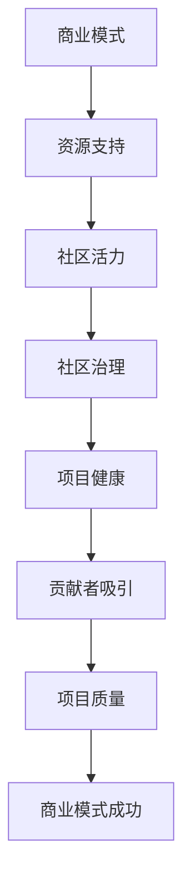

                 

# 开源AI项目的可持续发展:社区治理和商业模式

> 关键词：开源AI，可持续发展，社区治理，商业模式

随着人工智能（AI）技术的快速发展，开源AI项目已经成为推动技术创新和知识共享的重要力量。开源AI项目不仅为研究人员提供了丰富的工具和资源，还为企业降低了研发成本，加速了产品的迭代。然而，开源AI项目的可持续发展仍然面临诸多挑战，如社区治理和商业模式的探索。本文将深入探讨这些关键问题，并提出一些解决策略。

## 1. 背景介绍

开源AI项目，顾名思义，是指以开放源代码的方式开发和维护的人工智能项目。这些项目通常由全球的志愿者和开发者共同参与，通过协作和贡献来推动技术的进步。开源AI项目的优势在于其透明性、协作性和灵活性。然而，这些项目也面临着一些特有的挑战，如社区治理、资源分配、商业可持续性等。

社区治理是开源AI项目成功的关键因素之一。良好的社区治理能够确保项目的健康发展，吸引更多的贡献者，并维持项目的长期活力。商业模式则是开源AI项目的经济保障，它决定了项目如何获得收入，以及如何持续发展。

## 2. 核心概念与联系

### 2.1 开源AI项目的核心概念

- **社区治理**：社区治理是指通过制定规则、维护秩序、激励贡献者等方式，管理开源项目的过程。它涉及项目管理、决策过程、贡献者管理等多个方面。
- **商业模式**：商业模式是指项目如何产生收入、如何分配收益以及如何实现可持续发展的策略。常见的商业模式包括捐赠模式、服务订阅模式、商业合作模式等。

### 2.2 社区治理与商业模式的关系

社区治理和商业模式是相互关联的。良好的社区治理能够吸引更多的贡献者，从而提高项目的质量和影响力，这为商业模式的成功实施提供了基础。另一方面，成功的商业模式可以为社区提供必要的资源和支持，增强社区的活力和凝聚力。

### 2.3 社区治理与商业模式的联系图



## 3. 核心算法原理 & 具体操作步骤

### 3.1 社区治理的核心算法原理

社区治理的核心算法原理包括以下几个方面：

- **规则制定**：制定明确的规则和指南，确保项目有序运作。
- **决策过程**：建立民主的决策过程，确保决策的公正性和透明性。
- **贡献者激励**：通过奖励和认可机制，激励贡献者积极参与项目。

### 3.2 社区治理的具体操作步骤

- **建立项目管理委员会**：项目管理委员会负责制定项目规则、监督项目进展和决策项目发展方向。
- **定期召开社区会议**：通过线上或线下的方式，召开社区会议，收集贡献者的意见和建议，讨论项目的重要决策。
- **奖励和认可机制**：设立贡献者奖励基金，对贡献突出的贡献者给予奖励，并公开表彰其贡献。

## 4. 数学模型和公式 & 详细讲解 & 举例说明

### 4.1 社区治理的数学模型

社区治理的数学模型可以通过以下公式表示：

\[ \text{社区活力} = f(\text{规则制定}, \text{决策过程}, \text{贡献者激励}) \]

其中，\( f \) 为复合函数，表示社区活力与各个因素之间的关联。

### 4.2 商业模式的数学模型

商业模式的数学模型可以通过以下公式表示：

\[ \text{商业模式成功} = f(\text{收入来源}, \text{收益分配}, \text{可持续发展}) \]

其中，\( f \) 为复合函数，表示商业模式成功与各个因素之间的关联。

### 4.3 举例说明

假设一个开源AI项目通过服务订阅模式获得收入，每月收入为10000美元。该项目将收入的30%用于贡献者奖励，20%用于运营成本，剩下的50%用于项目开发和技术支持。根据上述数学模型，我们可以计算出：

\[ \text{社区活力} = f(\text{规则制定}, \text{决策过程}, \text{贡献者激励}) \]
\[ \text{商业模式成功} = f(\text{收入来源}, \text{收益分配}, \text{可持续发展}) \]

通过合理的规则制定、民主的决策过程和有效的贡献者激励，可以提升社区活力，从而促进商业模式的成功。

## 5. 项目实践：代码实例和详细解释说明

### 5.1 开发环境搭建

要搭建一个开源AI项目的基础开发环境，我们需要准备以下工具和软件：

- 代码编辑器（如Visual Studio Code）
- 版本控制系统（如Git）
- 编译器和解释器（如Python解释器）
- 依赖管理工具（如pip）

### 5.2 源代码详细实现

开源AI项目的源代码通常包括以下几个部分：

- **核心算法**：实现AI算法的代码。
- **数据集管理**：数据集的加载、预处理和存储。
- **模型训练**：训练AI模型的代码。
- **模型评估**：评估模型性能的代码。
- **用户接口**：提供用户交互功能的代码。

以下是一个简单的示例：

```python
# core_algorithm.py
def main():
    data = load_data()
    model = train_model(data)
    evaluate_model(model)

if __name__ == "__main__":
    main()
```

### 5.3 代码解读与分析

在上面的代码示例中，`main()` 函数是项目的入口点，它首先加载数据，然后训练模型，最后评估模型性能。这种结构使得代码易于理解和维护，同时也便于贡献者进行模块化开发和协同工作。

### 5.4 运行结果展示

运行上述代码后，项目将输出训练和评估的结果。例如：

```bash
Training completed. Model performance: 0.92
```

这表示模型在训练集上的性能达到了0.92，这意味着项目在技术层面上取得了初步的成功。

## 6. 实际应用场景

开源AI项目在多个领域都有广泛的应用，例如：

- **医疗领域**：开源AI项目可以帮助医疗机构进行疾病诊断、药物研发和医疗数据分析。
- **金融领域**：开源AI项目可以用于风险评估、投资分析和客户服务。
- **教育领域**：开源AI项目可以为学生提供个性化的学习资源，帮助教师进行教学分析和评估。

在这些应用场景中，社区治理和商业模式的成功实施对于项目的可持续发展和实际应用至关重要。

## 7. 工具和资源推荐

### 7.1 学习资源推荐

- **书籍**：《开源软件建设指南》（Open Source Software Development by Eric S. Raymond）
- **论文**：研究开源AI项目治理和商业模式的学术论文。
- **博客**：技术博客，分享开源AI项目的经验和见解。
- **网站**：开源社区平台，如GitHub，提供丰富的开源AI项目资源。

### 7.2 开发工具框架推荐

- **编程语言**：Python、Java、C++等。
- **框架**：TensorFlow、PyTorch、Scikit-learn等。
- **版本控制系统**：Git。

### 7.3 相关论文著作推荐

- **论文**：关于开源AI项目社区治理和商业模式的研究论文。
- **著作**：介绍开源AI项目实践和经验的著作。

## 8. 总结：未来发展趋势与挑战

开源AI项目的未来发展充满机遇，但也面临诸多挑战。在社区治理方面，需要进一步探索如何建立更有效的治理机制，提升社区的凝聚力和创新能力。在商业模式方面，需要找到适合开源AI项目的盈利模式，确保项目的可持续性。此外，随着AI技术的不断进步，开源AI项目也需要不断更新和迭代，以保持竞争力。

## 9. 附录：常见问题与解答

### 9.1 开源AI项目的社区治理问题

**Q:** 开源AI项目的社区治理如何保证公平性？

**A:** 开源AI项目的社区治理可以通过以下方式保证公平性：

1. **民主的决策过程**：通过定期召开社区会议，让所有贡献者参与决策。
2. **透明的规则和指南**：制定明确的规则和指南，确保所有贡献者遵守。
3. **监督和审计**：设立监督委员会，定期对社区治理过程进行审计。

### 9.2 开源AI项目的商业模式问题

**Q:** 开源AI项目的商业模式应该如何设计？

**A:** 开源AI项目的商业模式设计需要考虑以下几个方面：

1. **收入来源**：根据项目的特点和市场需求，选择合适的收入来源，如服务订阅、商业合作等。
2. **收益分配**：合理分配收益，确保项目的可持续发展。
3. **可持续发展**：制定长期的发展计划，确保项目的长期盈利。

## 10. 扩展阅读 & 参考资料

- **开源AI项目社区治理**：
  - 《开源软件社区治理的最佳实践》（Best Practices for Open Source Community Governance）
  - 《开源社区治理：挑战与策略》（Open Source Community Governance: Challenges and Strategies）

- **开源AI项目商业模式**：
  - 《开源软件的商业模式创新》（Innovation in Business Models for Open Source Software）
  - 《基于开源的商业模式探索》（Exploring Business Models Based on Open Source）

- **相关研究论文**：
  - 《开源AI项目的社区治理研究》（Research on Community Governance of Open Source AI Projects）
  - 《开源AI项目的商业模式研究》（Research on Business Models of Open Source AI Projects）

作者：禅与计算机程序设计艺术 / Zen and the Art of Computer Programming

本文内容仅供参考，不构成任何投资或建议。读者在使用本文内容进行决策时，应谨慎评估风险，并咨询专业意见。

