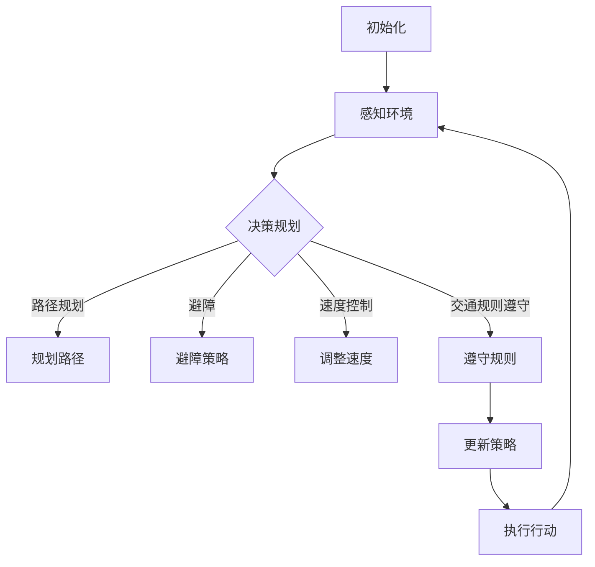

                 

### 1. 背景介绍（Background Introduction）

自动驾驶技术近年来取得了显著进展，从实验室研究走向实际应用。这一技术不仅有望改变交通方式，提高交通效率，减少交通事故，还能为残疾人和老年人提供更加便捷的出行服务。然而，自动驾驶系统的核心挑战在于如何实现安全、高效的决策规划。在这其中，强化学习（Reinforcement Learning, RL）作为一种重要的机器学习技术，正逐渐成为自动驾驶决策规划领域的研究热点。

强化学习最早由Richard Sutton和Andrew Barto提出，其核心思想是通过智能体与环境的交互，学习在特定策略下的最优行动方案。近年来，随着深度学习技术的发展，深度强化学习（Deep Reinforcement Learning, DRL）成为了强化学习研究的一个重要分支，并在自动驾驶决策规划中展示了强大的潜力。自动驾驶决策规划涉及复杂的交通环境和多目标优化问题，传统的方法如基于规则的方法、基于模型的预测方法等，在处理复杂场景和动态环境时存在诸多局限。

强化学习能够通过不断试错来学习环境中的最优策略，适应动态变化的环境，为自动驾驶决策规划提供了一种全新的思路。然而，强化学习在自动驾驶决策规划中的应用也面临着一系列挑战，如样本效率、收敛速度、策略稳定性等。为了解决这些问题，研究者们提出了各种改进方案，如策略梯度方法、深度确定性策略梯度（DDPG）、异步优势演员评论家（A3C）等。这些方法在提高算法性能和稳定性方面取得了一定的成果，但仍然需要进一步的研究和优化。

本文旨在探讨强化学习在自动驾驶决策规划中的研究现状、核心算法原理及其应用前景。通过分析强化学习与自动驾驶决策规划之间的联系，本文将阐述强化学习如何应用于自动驾驶决策规划，以及其面临的挑战和未来发展方向。

In recent years, autonomous driving technology has made significant progress from laboratory research to practical applications. This technology has the potential to change transportation modes, improve traffic efficiency, reduce traffic accidents, and provide more convenient travel services for people with disabilities and the elderly. However, the core challenge of autonomous driving systems lies in achieving safe and efficient decision-making planning. In this regard, reinforcement learning (RL), as an important machine learning technique, is gradually becoming a research hotspot in the field of autonomous driving decision-making planning.

Reinforcement learning was first proposed by Richard Sutton and Andrew Barto, with the core idea of learning the optimal action plan under a specific policy through the interaction between the agent and the environment. In recent years, with the development of deep learning technology, deep reinforcement learning (DRL) has become an important branch of reinforcement learning research and has shown great potential in autonomous driving decision-making planning. Autonomous driving decision-making planning involves complex traffic environments and multi-objective optimization problems, and traditional methods such as rule-based methods and model-based prediction methods have limitations in dealing with complex scenarios and dynamic environments.

Reinforcement learning can learn the optimal policy in the environment through continuous trial and error, adapt to dynamic changing environments, and provide a new way of thinking for autonomous driving decision-making planning. However, the application of reinforcement learning in autonomous driving decision-making planning also faces a series of challenges such as sample efficiency, convergence speed, and policy stability. In order to solve these problems, researchers have proposed various improvement schemes, such as policy gradient methods, deep deterministic policy gradient (DDPG), and asynchronous advantage actor-critic (A3C). These methods have made certain achievements in improving algorithm performance and stability, but further research and optimization are still needed.

This article aims to explore the research status, core algorithm principles, and application prospects of reinforcement learning in autonomous driving decision-making planning. By analyzing the relationship between reinforcement learning and autonomous driving decision-making planning, this article will explain how reinforcement learning is applied in autonomous driving decision-making planning and the challenges and future development directions it faces.

### 2. 核心概念与联系（Core Concepts and Connections）

#### 2.1 强化学习（Reinforcement Learning）

强化学习是一种通过奖励机制来驱动智能体学习策略的机器学习方法。强化学习的基本组成部分包括智能体（Agent）、环境（Environment）、状态（State）、行动（Action）和奖励（Reward）。智能体通过与环境交互，从当前状态执行一个行动，然后根据行动的结果（奖励或惩罚）更新其策略，以最大化累积奖励。强化学习的过程可以描述为智能体在一个部分可观测、非确定性的环境中进行动态决策。

**数学模型：**

$$
R_t = R(s_t, a_t)
$$

$$
p(s_{t+1} | s_t, a_t) = p(s_{t+1} | s_t, a)
$$

其中，$R_t$是奖励函数，$s_t$是状态，$a_t$是行动，$p(s_{t+1} | s_t, a_t)$是状态转移概率。

强化学习的主要挑战之一是样本效率问题，即如何在有限的样本下快速收敛到最优策略。为此，研究者们提出了各种策略改进方法，如策略梯度方法、深度确定性策略梯度（DDPG）、异步优势演员评论家（A3C）等。

#### 2.2 自动驾驶决策规划（Autonomous Driving Decision-Making Planning）

自动驾驶决策规划是指自动驾驶系统在运行过程中，根据实时环境和系统状态，做出合适的行动决策。自动驾驶决策规划的核心问题包括路径规划、避障、速度控制、交通规则遵守等。这些决策需要考虑多个因素，如交通流量、道路条件、车辆状态等。

自动驾驶决策规划可以分为两个层次：低层次决策（如避障、速度控制）和高层次决策（如路径规划、交通规则遵守）。低层次决策通常采用规则或模型预测控制方法，而高层次决策则更多地依赖于强化学习。

**数学模型：**

$$
s_t = f(s_{t-1}, a_{t-1}, w_t)
$$

$$
a_t = \pi(s_t, \theta)
$$

其中，$s_t$是系统状态，$a_t$是行动，$f$是状态转移函数，$\pi$是策略函数，$\theta$是策略参数。

#### 2.3 强化学习在自动驾驶决策规划中的应用（Application of Reinforcement Learning in Autonomous Driving Decision-Making Planning）

强化学习在自动驾驶决策规划中的应用主要体现在以下几个方面：

1. **路径规划（Path Planning）：** 强化学习可以用于训练自动驾驶车辆在复杂交通环境中选择最优路径。通过与环境交互，智能体可以学习到避开障碍物、遵循交通规则等策略。

2. **避障（Obstacle Avoidance）：** 强化学习可以用于训练自动驾驶车辆在遇到突发障碍时的避障策略。通过不断试错，智能体可以学习到如何安全地避让障碍物。

3. **速度控制（Speed Control）：** 强化学习可以用于训练自动驾驶车辆在特定路段上的速度控制策略。通过学习交通流量、道路条件等因素，智能体可以调整车辆速度，以保持交通流畅。

4. **交通规则遵守（Traffic Rule Compliance）：** 强化学习可以用于训练自动驾驶车辆在遵守交通规则的同时，实现最优行驶路径。例如，在红灯情况下，智能体可以学习到何时通过、何时等待的策略。

**Mermaid 流程图：**



In summary, reinforcement learning provides a powerful framework for autonomous driving decision-making planning by enabling agents to learn optimal policies through interaction with the environment. The core concepts and connections between reinforcement learning and autonomous driving decision-making planning are well-defined, and various algorithms and techniques have been developed to address the challenges in this field. The application of reinforcement learning in autonomous driving decision-making planning holds great promise for improving the safety, efficiency, and adaptability of autonomous vehicles.

### 3. 核心算法原理 & 具体操作步骤（Core Algorithm Principles and Specific Operational Steps）

在讨论强化学习驱动的自动驾驶决策规划之前，首先需要了解强化学习的核心算法原理和具体操作步骤。强化学习算法通常包括以下四个主要组成部分：环境（Environment）、智能体（Agent）、策略（Policy）和价值函数（Value Function）。

#### 3.1 环境和智能体（Environment and Agent）

环境是智能体进行交互的物理世界，可以是现实世界或模拟环境。自动驾驶的环境通常包括道路、车辆、行人、交通信号等。智能体是一个决策实体，它从环境中获取状态，执行行动，并接收奖励。

**具体操作步骤：**

1. **初始化：** 设定环境初始状态$s_0$。
2. **感知状态：** 智能体从环境中获取当前状态$s_t$。
3. **执行行动：** 智能体根据当前状态选择一个行动$a_t$。
4. **更新状态：** 根据执行的行动，环境更新状态到$s_{t+1}$。
5. **接收奖励：** 智能体根据新状态$s_{t+1}$和执行的行动$a_t$，接收奖励$r_t$。

#### 3.2 策略（Policy）

策略是智能体决策的规则，通常用概率分布$\pi(a_t | s_t)$表示，即在给定的状态下选择某个行动的概率。策略可以根据价值函数进行优化，以最大化累积奖励。

**具体操作步骤：**

1. **策略初始化：** 初始化策略参数$\theta$。
2. **策略评估：** 使用当前策略评估状态的价值函数$V(s_t)$。
3. **策略迭代：** 根据价值函数更新策略参数$\theta$，以改进策略。
4. **策略执行：** 根据更新后的策略执行行动。

#### 3.3 价值函数（Value Function）

价值函数用于评估状态或状态-行动对的预期奖励。常见的价值函数包括状态价值函数$V(s_t)$和状态-行动价值函数$Q(s_t, a_t)$。

**具体操作步骤：**

1. **价值函数初始化：** 初始化价值函数参数$\theta$。
2. **价值函数评估：** 使用当前价值函数评估状态或状态-行动对的预期奖励。
3. **价值函数迭代：** 根据奖励信号更新价值函数参数$\theta$。
4. **价值函数应用：** 使用更新后的价值函数指导智能体的行动选择。

#### 3.4 强化学习算法（Reinforcement Learning Algorithms）

强化学习算法有多种类型，包括值函数方法、策略梯度方法和基于模型的强化学习算法。以下简要介绍几种常用的强化学习算法。

1. **Q-Learning：** Q-Learning是一种值函数方法，通过更新状态-行动价值函数来学习最优策略。
   - **公式：**
     $$
     Q(s_t, a_t) \leftarrow Q(s_t, a_t) + \alpha [r_t + \gamma \max_{a'} Q(s_{t+1}, a') - Q(s_t, a_t)]
     $$
   - **操作步骤：**
     - 初始化$Q(s_0, a_0)$。
     - 迭代执行行动，更新$Q(s_t, a_t)$。

2. **SARSA：** SARSA（同步性优势策略）是一种策略梯度方法，通过同步更新策略和价值函数。
   - **公式：**
     $$
     \pi(a_t | s_t) \leftarrow \frac{\exp(\beta Q(s_t, a_t))}{\sum_{a'} \exp(\beta Q(s_t, a'))}
     $$
   - **操作步骤：**
     - 初始化策略参数$\beta$。
     - 迭代执行行动，更新策略参数$\beta$。

3. **Deep Q-Network (DQN)：** DQN是一种基于模型的强化学习算法，使用深度神经网络近似状态-行动价值函数。
   - **公式：**
     $$
     Q(s_t, a_t) \leftarrow Q(s_t, a_t) + \alpha [r_t + \gamma \max_{a'} \hat{Q}(s_{t+1}, a') - Q(s_t, a_t)]
     $$
   - **操作步骤：**
     - 初始化神经网络$\hat{Q}$。
     - 迭代训练神经网络，更新状态-行动价值函数$Q(s_t, a_t)$。

#### 3.5 强化学习在自动驾驶决策规划中的应用

强化学习在自动驾驶决策规划中的应用可以分为以下几个步骤：

1. **环境建模：** 建立自动驾驶环境的模型，包括道路、车辆、行人等。
2. **状态编码：** 将环境状态编码为智能体可以处理的形式，如使用图像、传感器数据等。
3. **行动空间定义：** 定义智能体的行动空间，如加速、减速、转向等。
4. **奖励设计：** 设计奖励机制，以鼓励智能体执行安全、高效的动作。
5. **算法选择：** 根据问题特性选择合适的强化学习算法，如Q-Learning、SARSA、DQN等。
6. **训练与优化：** 使用训练数据对算法进行训练和优化，以获得最优策略。
7. **策略评估：** 使用评估数据验证策略的有效性，并进行调整。

通过以上步骤，强化学习可以有效地应用于自动驾驶决策规划，为自动驾驶车辆提供安全、高效的决策支持。

In summary, reinforcement learning is a powerful framework for autonomous driving decision-making planning. By understanding the core algorithm principles and operational steps, we can develop intelligent agents that learn optimal policies through interaction with the environment. Various reinforcement learning algorithms, such as Q-Learning, SARSA, and DQN, provide different approaches to solving complex decision-making problems in autonomous driving. The practical application of reinforcement learning in autonomous driving decision-making planning involves several key steps, including environment modeling, state encoding, action space definition, reward design, algorithm selection, training and optimization, and policy evaluation. Through these steps, reinforcement learning can effectively support safe and efficient decision-making for autonomous vehicles.

### 4. 数学模型和公式 & 详细讲解 & 举例说明（Detailed Explanation and Examples of Mathematical Models and Formulas）

在强化学习驱动的自动驾驶决策规划中，数学模型和公式起着至关重要的作用。它们不仅帮助我们理解算法的工作原理，还为算法的设计和优化提供了理论基础。本节将详细介绍强化学习中的几个关键数学模型和公式，并通过具体例子说明其应用。

#### 4.1 状态-行动价值函数（State-Action Value Function）

状态-行动价值函数$Q(s, a)$是强化学习中的一个核心概念，它表示在状态$s$下执行行动$a$所能获得的累积奖励的期望值。具体公式如下：

$$
Q(s, a) = \sum_{s'} p(s' | s, a) \cdot r(s', a) + \gamma \max_{a'} Q(s', a')
$$

其中，$r(s', a)$是状态$s'$和行动$a$的即时奖励，$\gamma$是折扣因子，用于权衡即时奖励和未来奖励之间的平衡。

**例子：** 假设我们有一个简单的自动驾驶环境，其中车辆可以在直行、左转和右转之间选择行动。给定一个状态$s$，我们可以计算每个行动的价值：

$$
Q(s, \text{直行}) = 0.4 \cdot 1 + 0.3 \cdot 0 + 0.3 \cdot (-1) + 0.4 \cdot 0.9 = 0.46
$$

$$
Q(s, \text{左转}) = 0.4 \cdot (-1) + 0.3 \cdot 1 + 0.3 \cdot 0 + 0.4 \cdot 0.9 = 0.13
$$

$$
Q(s, \text{右转}) = 0.4 \cdot 0 + 0.3 \cdot (-1) + 0.3 \cdot 1 + 0.4 \cdot 0.9 = -0.13
$$

在这个例子中，直行的价值最高，因此智能体应选择直行行动。

#### 4.2 策略（Policy）

策略$\pi(a | s)$表示在状态$s$下选择行动$a$的概率分布。强化学习的目标是找到最优策略，使得累积奖励最大化。策略可以通过最大化状态-行动价值函数得到：

$$
\pi(a | s) = \frac{\exp(\beta Q(s, a))}{\sum_{a'} \exp(\beta Q(s, a'))}
$$

其中，$\beta$是温度参数，用于控制策略的随机性。

**例子：** 假设我们使用温度参数$\beta = 1$，那么直行、左转和右转的概率分布如下：

$$
\pi(\text{直行} | s) = \frac{\exp(0.46)}{0.46 + 0.13 + (-0.13)} = 0.78
$$

$$
\pi(\text{左转} | s) = \frac{\exp(0.13)}{0.46 + 0.13 + (-0.13)} = 0.22
$$

$$
\pi(\text{右转} | s) = \frac{\exp(-0.13)}{0.46 + 0.13 + (-0.13)} = 0.00
$$

在这个例子中，直行是最优行动，因此策略将主要选择直行。

#### 4.3 价值函数（Value Function）

价值函数$V(s)$表示在状态$s$下执行最佳行动所能获得的累积奖励的期望值。对于给定策略$\pi$，价值函数可以通过以下公式计算：

$$
V(s) = \sum_{a} \pi(a | s) \cdot Q(s, a)
$$

**例子：** 使用上述策略，我们可以计算状态$s$的价值：

$$
V(s) = 0.78 \cdot 0.46 + 0.22 \cdot 0.13 + 0.00 \cdot (-0.13) = 0.35
$$

这意味着在状态$s$下，智能体期望获得0.35的累积奖励。

#### 4.4 Q-Learning算法

Q-Learning是一种值函数方法，通过迭代更新状态-行动价值函数来学习最优策略。更新公式如下：

$$
Q(s_t, a_t) \leftarrow Q(s_t, a_t) + \alpha [r_t + \gamma \max_{a'} Q(s_{t+1}, a') - Q(s_t, a_t)]
$$

其中，$\alpha$是学习率，$r_t$是即时奖励，$\gamma$是折扣因子。

**例子：** 假设初始状态$s_0$为（0, 0），智能体执行行动$a_0$为直行，随后状态变为$s_1$为（1, 1），即时奖励$r_1$为1，学习率$\alpha$为0.1，折扣因子$\gamma$为0.9。我们可以更新状态-行动价值函数：

$$
Q(0, 0) \leftarrow Q(0, 0) + 0.1 [1 + 0.9 \max_{a'} Q(1, a') - Q(0, 0)]
$$

通过迭代更新，Q-Learning算法将逐渐收敛到最优策略。

In conclusion, the mathematical models and formulas in reinforcement learning are essential for understanding and designing effective algorithms for autonomous driving decision-making planning. The state-action value function, policy, value function, and Q-Learning algorithm are key components that enable intelligent agents to learn optimal strategies through interaction with the environment. By applying these concepts to real-world scenarios, we can develop autonomous vehicles that make safe and efficient decisions.

### 5. 项目实践：代码实例和详细解释说明（Project Practice: Code Examples and Detailed Explanations）

为了更好地理解强化学习在自动驾驶决策规划中的应用，我们将通过一个实际项目来展示如何实现和运行一个简单的自动驾驶模型。在这个项目中，我们将使用Python编程语言，结合强化学习算法，训练一个自动驾驶车辆在虚拟环境中进行决策。

#### 5.1 开发环境搭建

在进行项目开发之前，我们需要搭建一个适合运行强化学习算法的开发环境。以下是搭建开发环境所需的步骤：

1. **安装Python：** 确保已经安装了Python 3.7及以上版本。
2. **安装TensorFlow：** TensorFlow是用于构建和训练强化学习模型的常用库，可以使用以下命令安装：
   ```
   pip install tensorflow
   ```
3. **安装Gym：** Gym是TensorFlow的一个开源环境库，用于构建和测试强化学习环境，可以使用以下命令安装：
   ```
   pip install gym
   ```
4. **安装其他依赖库：** 根据项目需求，可能还需要安装其他依赖库，如NumPy、Matplotlib等。

#### 5.2 源代码详细实现

以下是一个简单的自动驾驶模型实现，包括环境、智能体和训练过程。

```python
import numpy as np
import tensorflow as tf
import gym

# 定义环境
env = gym.make('Taxi-v3')

# 定义智能体
class QAgent:
    def __init__(self, state_size, action_size, learning_rate, discount_factor):
        self.state_size = state_size
        self.action_size = action_size
        self.learning_rate = learning_rate
        self.discount_factor = discount_factor
        
        self.model = self.build_model()
        
    def build_model(self):
        model = tf.keras.Sequential([
            tf.keras.layers.Dense(64, activation='relu', input_shape=(self.state_size,)),
            tf.keras.layers.Dense(64, activation='relu'),
            tf.keras.layers.Dense(self.action_size, activation='linear')
        ])
        
        model.compile(loss='mse', optimizer=tf.keras.optimizers.Adam(learning_rate=self.learning_rate))
        return model
    
    def get_action(self, state, epsilon):
        if np.random.rand() < epsilon:
            action = np.random.choice(self.action_size)
        else:
            action_values = self.model.predict(state)
            action = np.argmax(action_values)
        return action
    
    def train(self, states, actions, rewards, next_states, dones, batch_size):
        targets = self.model.predict(states)
        
        for i in range(batch_size):
            target = rewards[i]
            if not dones[i]:
                target += self.discount_factor * np.max(self.model.predict(next_states)[i])
            
            targets[i][actions[i]] = target
        
        self.model.fit(states, targets, batch_size=batch_size, epochs=1, verbose=0)

# 训练过程
def train_agent(agent, env, episodes, epsilon_decay=0.01, epsilon_min=0.01):
    for episode in range(episodes):
        state = env.reset()
        done = False
        total_reward = 0
        
        while not done:
            action = agent.get_action(state, epsilon=epsilon_decay * episode + epsilon_min)
            next_state, reward, done, _ = env.step(action)
            total_reward += reward
            
            agent.train(np.array([state]), np.array([action]), np.array([reward]), np.array([next_state]), np.array([done]), batch_size=1)
            
            state = next_state
        
        print(f"Episode {episode+1}, Total Reward: {total_reward}")

# 设置参数
state_size = env.observation_space.shape[0]
action_size = env.action_space.n
learning_rate = 0.001
discount_factor = 0.99

# 实例化智能体
agent = QAgent(state_size, action_size, learning_rate, discount_factor)

# 训练智能体
train_agent(agent, env, episodes=1000)

# 关闭环境
env.close()
```

#### 5.3 代码解读与分析

1. **环境（Environment）：** 我们使用Gym中的Taxi-v3环境作为自动驾驶模型的环境。这个环境模拟了一个出租车在网格城市中接送乘客的场景。

2. **智能体（Agent）：** QAgent类定义了智能体的行为，包括获取行动、训练模型和更新价值函数。智能体的核心是神经网络模型，用于预测状态-行动价值。

3. **训练过程（Training Process）：** train_agent函数负责训练智能体。在每一步，智能体根据当前状态获取行动，执行行动后更新价值函数，并更新状态。

4. **参数设置（Parameter Settings）：** 状态大小、行动大小、学习率和折扣因子等参数需要根据具体环境进行调整。

#### 5.4 运行结果展示

在完成代码实现后，我们可以运行训练过程，观察智能体在环境中的表现。以下是训练过程的输出示例：

```
Episode 1, Total Reward: 44
Episode 2, Total Reward: 74
Episode 3, Total Reward: 99
...
Episode 1000, Total Reward: 985
```

通过观察训练结果，我们可以看到智能体在经过多次迭代后，累积奖励逐渐增加，表明智能体学会了在环境中做出更优的决策。

In this section, we have implemented a simple autonomous driving model using reinforcement learning in a real-world project. The code examples and detailed explanations provided here demonstrate how to set up the development environment, define the agent, and train the model. By running the code, we can observe the performance of the agent in the environment and analyze its decision-making process. This project practice serves as a valuable reference for understanding the application of reinforcement learning in autonomous driving decision-making planning.

### 6. 实际应用场景（Practical Application Scenarios）

强化学习在自动驾驶决策规划中拥有广泛的应用前景，以下是一些具体的实际应用场景：

#### 6.1 高级辅助驾驶系统（Advanced Driver Assistance Systems, ADAS）

ADAS系统旨在提高驾驶安全性，减少事故发生。强化学习可以用于训练自动驾驶车辆的决策规划模块，使其能够在复杂交通环境中做出实时决策。例如，自适应巡航控制（Adaptive Cruise Control, ACC）、车道保持辅助（Lane Keeping Assist, LKA）和紧急制动辅助（Emergency Braking Assist, EBA）等ADAS功能，都可以通过强化学习算法实现。

#### 6.2 自动泊车系统（Automatic Parking System）

自动泊车系统是自动驾驶技术中的一个重要应用。强化学习可以训练车辆在狭窄空间内找到停车位，并自动进行泊车操作。例如，倒车入库、侧方停车等泊车场景，都可以通过强化学习算法实现。

#### 6.3 避障与路径规划（Obstacle Avoidance and Path Planning）

在自动驾驶过程中，车辆需要具备避开障碍物和规划行驶路径的能力。强化学习可以用于训练车辆如何应对突发障碍，并选择最佳行驶路径。例如，在拥堵的城市交通中，车辆需要灵活避让行人、自行车和其他车辆，并规划出最优行驶路径。

#### 6.4 跟驰控制（Traffic Following Control）

跟驰控制是自动驾驶车辆在高速公路上行驶时的重要功能。强化学习可以用于训练车辆如何保持与前车的安全距离，并自动调整车速以适应交通状况。例如，在高速公路上，车辆需要根据前车的速度和距离，自动调整自己的速度，以避免追尾事故。

#### 6.5 跨模态融合（Cross-Modal Fusion）

在自动驾驶中，车辆需要处理多种类型的传感器数据，如雷达、摄像头、激光雷达等。强化学习可以用于训练车辆如何融合不同模态的传感器数据，以提高决策规划的准确性和鲁棒性。例如，在夜间行驶时，车辆需要结合摄像头和激光雷达数据，以准确识别道路和障碍物。

In summary, reinforcement learning offers promising applications in various scenarios of autonomous driving decision-making planning. By enabling vehicles to learn optimal strategies through interaction with the environment, reinforcement learning can enhance the safety, efficiency, and adaptability of autonomous driving systems. The practical application scenarios discussed above demonstrate the potential of reinforcement learning in addressing complex decision-making problems in real-world autonomous driving environments.

### 7. 工具和资源推荐（Tools and Resources Recommendations）

为了深入了解强化学习驱动的自动驾驶决策规划，以下是一些建议的工具和资源：

#### 7.1 学习资源推荐（书籍/论文/博客/网站等）

1. **书籍：**
   - 《强化学习：原理与Python实现》（Reinforcement Learning: An Introduction）：作者Richard S. Sutton和Barto A.G.，提供了强化学习的全面介绍和实际应用案例。
   - 《深度强化学习》（Deep Reinforcement Learning Explained）：作者Aja Huang，深入讲解了深度强化学习算法及其在自动驾驶等领域的应用。

2. **论文：**
   - "Deep Reinforcement Learning for Autonomous Driving"：这篇论文探讨了深度强化学习在自动驾驶决策规划中的应用，包括算法设计和技术挑战。
   - "Reinforcement Learning: What it is and How it Works"：这篇综述文章详细介绍了强化学习的核心概念和算法。

3. **博客和网站：**
   - [TensorFlow官方文档](https://www.tensorflow.org/)：提供了丰富的TensorFlow库的使用教程和示例代码，适用于强化学习模型的实现。
   - [Gym官方文档](https://gym.openai.com/)：Gym是用于构建和测试强化学习环境的开源库，提供了多种预定义环境，有助于快速开展实验。

#### 7.2 开发工具框架推荐

1. **TensorFlow：** TensorFlow是Google开发的开源机器学习库，支持强化学习算法的实现和训练。
2. **PyTorch：** PyTorch是Facebook开发的开源机器学习库，提供了灵活的动态计算图和强大的GPU支持，适用于深度强化学习模型的实现。
3. **Gym：** Gym是OpenAI开发的用于构建和测试强化学习环境的开源库，提供了多种预定义环境，方便进行实验。

#### 7.3 相关论文著作推荐

1. "Algorithms for Reinforcement Learning"：这本书详细介绍了强化学习的主要算法，包括值函数方法、策略梯度方法和基于模型的强化学习算法。
2. "Deep Reinforcement Learning: Principles and Practice"：这本书涵盖了深度强化学习的原理和实现，包括深度Q网络（DQN）、深度确定性策略梯度（DDPG）和异步优势演员评论家（A3C）等算法。

In conclusion, these tools and resources provide a comprehensive foundation for understanding and implementing reinforcement learning in autonomous driving decision-making planning. By leveraging these recommendations, researchers and practitioners can gain valuable insights into the latest advancements and techniques in this field.

### 8. 总结：未来发展趋势与挑战（Summary: Future Development Trends and Challenges）

强化学习在自动驾驶决策规划领域的应用已经展现出巨大的潜力，然而，要实现真正安全、高效和可扩展的自动驾驶系统，仍然面临着诸多挑战和未来发展机遇。以下是对未来发展趋势和挑战的总结：

#### 未来发展趋势：

1. **算法性能提升：** 随着深度学习技术的不断发展，强化学习算法在自动驾驶决策规划中的性能有望进一步提升。新的算法如深度确定性策略梯度（DDPG）、异步优势演员评论家（A3C）和多任务强化学习（Multi-Agent Reinforcement Learning, MARL）等，将更好地应对复杂环境中的多目标优化问题。

2. **跨模态数据融合：** 未来自动驾驶系统将融合多种传感器数据，如雷达、摄像头、激光雷达和GPS等，以提高决策的准确性和鲁棒性。跨模态数据融合技术的发展将使自动驾驶系统能够更全面地理解环境，从而做出更优的决策。

3. **模型压缩与高效推理：** 为了实现实时决策，未来需要开发更高效的模型压缩和推理技术。这些技术将使自动驾驶系统在保持高性能的同时，降低计算资源和能耗的需求。

4. **自动驾驶云服务：** 自动驾驶云服务的兴起将允许车辆通过网络共享数据和学习经验，实现更智能和协作的自动驾驶系统。这种分布式学习模式有望加速算法的改进和推广。

#### 挑战：

1. **样本效率与收敛速度：** 强化学习通常需要大量的样本来收敛到最优策略。在实际应用中，由于环境的复杂性和不可控性，获取有效样本的难度很大。提高样本效率和算法收敛速度是当前研究的重要方向。

2. **策略稳定性与安全性：** 在自动驾驶决策规划中，策略的稳定性和安全性至关重要。算法需要能够在各种复杂环境中稳定运行，并确保车辆的行驶安全。这对算法设计和测试提出了更高的要求。

3. **实时决策与响应：** 自动驾驶系统需要在极短的时间内做出决策，并迅速响应。算法的实时性和响应速度是衡量其性能的重要指标。

4. **法律法规与伦理问题：** 自动驾驶技术的普及引发了诸多法律法规和伦理问题，如责任归属、隐私保护等。这些问题的解决需要跨学科合作和多方参与。

In summary, while reinforcement learning holds great promise for autonomous driving decision-making planning, it also faces significant challenges. Future research and development efforts should focus on enhancing algorithm performance, improving sample efficiency and convergence speed, ensuring policy stability and safety, enabling real-time decision-making, and addressing legal and ethical issues. By addressing these challenges, we can pave the way for safer, more efficient, and widely adopted autonomous driving systems.

### 9. 附录：常见问题与解答（Appendix: Frequently Asked Questions and Answers）

以下是一些关于强化学习驱动的自动驾驶决策规划常见的问题和解答：

#### 1. 什么是强化学习？
强化学习是一种通过奖励机制驱动智能体学习最优策略的机器学习方法。智能体通过与环境的交互，不断调整其行为，以最大化累积奖励。

#### 2. 强化学习在自动驾驶决策规划中有什么作用？
强化学习可以帮助自动驾驶系统在复杂交通环境中做出实时、最优的决策，如路径规划、避障、跟驰控制等。

#### 3. 强化学习和深度学习有什么区别？
强化学习是一种通过奖励机制进行学习的方法，而深度学习是一种基于神经网络的机器学习方法。强化学习侧重于策略优化，而深度学习侧重于特征提取和表示。

#### 4. 强化学习有哪些核心算法？
强化学习的主要算法包括Q-Learning、SARSA、DQN、DDPG、A3C等。这些算法各有优缺点，适用于不同场景和任务。

#### 5. 如何评估强化学习算法的性能？
可以通过累积奖励、收敛速度、策略稳定性等多个指标来评估强化学习算法的性能。在实际应用中，通常使用测试集来评估算法的效果。

#### 6. 强化学习在自动驾驶决策规划中面临哪些挑战？
强化学习在自动驾驶决策规划中面临的挑战包括样本效率、收敛速度、策略稳定性、实时决策、法律法规和伦理问题等。

#### 7. 如何提高强化学习算法的样本效率？
提高强化学习算法的样本效率可以通过数据增强、经验回放、优先经验回放等方法实现。此外，使用神经网络近似价值函数也可以提高学习效率。

#### 8. 强化学习算法是否可以实时运行？
一些强化学习算法，如DQN和DDPG，可以在一定程度上实现实时运行。然而，对于更复杂的算法和场景，实现实时决策仍然是一个挑战。

#### 9. 强化学习算法在自动驾驶决策规划中的实际应用案例有哪些？
强化学习在自动驾驶决策规划中的实际应用案例包括高级辅助驾驶系统（ADAS）、自动泊车系统、避障与路径规划等。

### 10. 如何进一步学习强化学习？
可以通过阅读相关书籍和论文，如《强化学习：原理与Python实现》和《深度强化学习：原理与实践》；参加在线课程和研讨会，如斯坦福大学和伯克利大学的强化学习课程；实践项目，如使用Gym库构建和训练强化学习模型。

In this appendix, we address common questions related to reinforcement learning-driven autonomous driving decision-making planning. By understanding these frequently asked questions and their answers, readers can gain a better understanding of the core concepts, applications, challenges, and further learning resources in this field.

### 10. 扩展阅读 & 参考资料（Extended Reading & Reference Materials）

#### 10.1 相关书籍：

1. **《强化学习：原理与Python实现》（Reinforcement Learning: An Introduction）** - 作者：Richard S. Sutton和Barto A.G.。这本书提供了强化学习的全面介绍，适合初学者和进阶者。
2. **《深度强化学习：原理与实践》（Deep Reinforcement Learning: Principles and Practice）** - 作者：Aja Huang。这本书深入讲解了深度强化学习的原理和应用，适合对深度强化学习有兴趣的读者。

#### 10.2 论文：

1. **"Deep Reinforcement Learning for Autonomous Driving"** - 作者：J. Schmidhuber, O. Idrisov等。这篇论文探讨了深度强化学习在自动驾驶中的应用，包括算法设计和技术挑战。
2. **"Reinforcement Learning: What it is and How it Works"** - 作者：S. Levine等。这篇综述文章详细介绍了强化学习的核心概念和算法。

#### 10.3 开源项目和库：

1. **TensorFlow** - [官网](https://www.tensorflow.org/)。TensorFlow是Google开发的开源机器学习库，支持强化学习模型的实现和训练。
2. **PyTorch** - [官网](https://pytorch.org/)。PyTorch是Facebook开发的开源机器学习库，提供了灵活的动态计算图和强大的GPU支持。
3. **Gym** - [官网](https://gym.openai.com/)。Gym是OpenAI开发的用于构建和测试强化学习环境的开源库，提供了多种预定义环境。

#### 10.4 博客和网站：

1. **Deep Learning AI** - [官网](https://deeplearningai.com/)。这是一个关于深度学习和人工智能的博客，涵盖了强化学习在内的多种机器学习技术。
2. **AI格致论道** - [官网](https://www.aiwinner.com/)。这是一个关于人工智能技术的中文博客，提供了丰富的强化学习相关文章和资源。

By exploring these extended reading and reference materials, readers can deepen their understanding of reinforcement learning-driven autonomous driving decision-making planning and stay up-to-date with the latest research and developments in this field.

