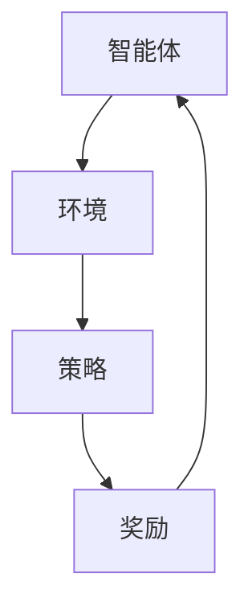

                 

### 文章标题

**强化学习：在区块链技术中的应用**

> 关键词：强化学习，区块链，智能合约，共识机制，去中心化，分布式系统，博弈论，网络安全
>
> 摘要：本文探讨了强化学习在区块链技术中的应用，分析了其在智能合约执行、共识机制优化、去中心化应用（DApp）等方面的重要性和潜在优势。通过具体实例和数学模型，阐述了强化学习如何提升区块链系统的效率和安全性。

---

强化学习（Reinforcement Learning，简称RL）是机器学习的一个重要分支，主要研究如何通过智能体与环境的交互，通过学习得到一个策略，以实现最大化累积奖励。区块链技术，作为一种去中心化的分布式数据库技术，近年来在金融、物联网、供应链管理等领域得到了广泛应用。强化学习与区块链技术的结合，为解决区块链系统中的某些复杂问题提供了新的思路。

本文将深入探讨强化学习在区块链技术中的应用，重点介绍强化学习在智能合约执行、共识机制优化和去中心化应用等方面的应用场景，并通过具体的数学模型和算法实例，阐述强化学习如何提升区块链系统的效率和安全性。

## 1. 背景介绍（Background Introduction）

### 1.1 强化学习的基本概念

强化学习的基本概念包括四个要素：智能体（Agent）、环境（Environment）、策略（Policy）和奖励（Reward）。智能体是执行动作的实体，环境是智能体所处的情境，策略是智能体根据当前状态选择动作的规则，奖励是环境对智能体动作的反馈。

在强化学习中，智能体通过不断与环境交互，通过学习得到一个最优策略，以最大化累积奖励。强化学习的过程可以看作是智能体在一系列状态中做出决策，并在每个决策后根据结果得到奖励，然后更新策略。

### 1.2 区块链技术的基本概念

区块链技术是一种去中心化的分布式数据库技术，通过区块链网络中的多个节点共同维护一个分布式账本，实现了数据的安全、可信和透明。区块链技术的基本概念包括：区块（Block）、链（Chain）、节点（Node）、挖矿（Mining）和智能合约（Smart Contract）。

区块是区块链的基本组成单元，包含一定数量的交易信息，并通过哈希函数与前一个区块链接起来，形成区块链。节点是区块链网络中的参与方，负责维护区块链的完整性和安全性。挖矿是通过计算找到满足特定条件的区块，以获得区块链网络中的奖励。智能合约是一种自动执行、管理和支付合约条款的计算机程序，其运行在区块链网络上，不需要中介参与。

### 1.3 强化学习在区块链技术中的应用

强化学习在区块链技术中的应用主要体现在以下几个方面：

1. **智能合约执行优化**：强化学习可以用于优化智能合约的执行过程，提高合约的执行效率。
   
2. **共识机制优化**：强化学习可以用于优化区块链网络的共识机制，提高网络的整体性能。

3. **去中心化应用（DApp）**：强化学习可以用于设计去中心化应用，提高应用的性能和用户体验。

4. **网络安全**：强化学习可以用于提升区块链网络的抗攻击能力，提高网络的安全性。

## 2. 核心概念与联系（Core Concepts and Connections）

### 2.1 强化学习在智能合约执行中的应用

智能合约是区块链技术中的一个重要组成部分，它能够自动执行、管理和支付合约条款。然而，智能合约的执行过程可能会受到多种因素的影响，如网络延迟、计算资源等，从而导致执行效率低下。强化学习可以通过优化智能合约的执行策略，提高合约的执行效率。

具体来说，强化学习中的智能体可以模拟智能合约的执行过程，通过不断学习环境中的反馈，调整执行策略，以最大化累积奖励。例如，智能体可以通过学习如何在不同情况下选择执行路径，以提高合约的执行速度和准确性。

### 2.2 强化学习在共识机制优化中的应用

共识机制是区块链网络的核心组成部分，它决定了区块链网络的可靠性和性能。传统的共识机制，如工作量证明（Proof of Work，PoW）和权益证明（Proof of Stake，PoS），存在一定的缺陷，如能源消耗高、安全性低等。强化学习可以通过优化共识机制，提高区块链网络的性能和安全性。

具体来说，强化学习中的智能体可以模拟网络中的节点，通过学习如何在不同情况下选择投票策略，以提高共识过程的效率。例如，智能体可以通过学习如何在不同网络负载下调整计算资源分配，以实现快速达成共识。

### 2.3 强化学习在去中心化应用（DApp）中的应用

去中心化应用（DApp）是区块链技术的一个重要应用领域，它通过区块链网络实现去中心化服务。然而，DApp的性能和用户体验受到多种因素的影响，如网络延迟、计算资源等。强化学习可以通过优化DApp的执行策略，提高应用的性能和用户体验。

具体来说，强化学习中的智能体可以模拟用户行为，通过学习如何在不同场景下选择最佳策略，以提高DApp的响应速度和准确性。例如，智能体可以通过学习如何在不同网络负载下调整资源分配，以实现快速响应用户请求。

### 2.4 强化学习在网络安全中的应用

区块链网络的安全性是区块链技术发展的关键问题。强化学习可以通过学习网络攻击模式，提高区块链网络的抗攻击能力。

具体来说，强化学习中的智能体可以模拟攻击者，通过学习如何发动攻击，同时学习如何防御攻击。例如，智能体可以通过学习如何识别网络异常行为，从而提前预警潜在的攻击。

### 2.5 强化学习在区块链技术中的整体架构

强化学习在区块链技术中的整体架构可以概括为四个主要部分：智能体（Agent）、环境（Environment）、策略（Policy）和奖励（Reward）。

1. **智能体（Agent）**：智能体是执行强化学习算法的实体，可以模拟区块链系统中的各个组成部分，如智能合约、节点、DApp等。
   
2. **环境（Environment）**：环境是智能体所处的情境，可以模拟区块链系统中的各种状态和事件。
   
3. **策略（Policy）**：策略是智能体根据当前状态选择动作的规则，可以用于指导智能体在区块链系统中做出最优决策。
   
4. **奖励（Reward）**：奖励是环境对智能体动作的反馈，用于评估智能体行为的优劣。

通过上述四个部分，强化学习可以在区块链系统中实现自动学习和优化，从而提高系统的性能和安全性。

### 2.6 Mermaid 流程图

为了更清晰地展示强化学习在区块链技术中的应用，我们可以使用Mermaid流程图来描述其核心概念和架构。



在上述流程图中，智能体与环境之间不断进行交互，通过学习环境中的反馈，调整策略，以实现最大化累积奖励。

## 3. 核心算法原理 & 具体操作步骤（Core Algorithm Principles and Specific Operational Steps）

### 3.1 强化学习算法原理

强化学习算法的核心原理是通过对智能体与环境的交互进行学习，得到一个最优策略，以最大化累积奖励。具体来说，强化学习算法包括以下几个基本步骤：

1. **初始化**：初始化智能体、环境和策略。
   
2. **状态观察**：智能体观察当前状态。
   
3. **动作选择**：智能体根据当前状态，选择一个动作。
   
4. **执行动作**：智能体在环境中执行所选动作。
   
5. **状态转移**：环境根据智能体的动作，转移到一个新的状态。
   
6. **奖励反馈**：环境对智能体的动作进行奖励反馈。
   
7. **策略更新**：智能体根据累积奖励，更新策略。

### 3.2 强化学习在智能合约执行中的应用步骤

以下是强化学习在智能合约执行中的应用步骤：

1. **初始化**：初始化智能合约执行环境、策略和网络参数。
   
2. **状态观察**：智能体观察当前智能合约的执行状态，包括合约代码、交易信息、执行进度等。
   
3. **动作选择**：智能体根据当前状态，选择一个执行路径。例如，选择执行某个交易、暂停执行、修改合约代码等。
   
4. **执行动作**：智能体在区块链网络上执行所选动作，并记录执行结果。
   
5. **状态转移**：根据执行结果，环境转移到一个新的状态。
   
6. **奖励反馈**：环境根据执行结果，对智能体进行奖励反馈。例如，如果执行成功，则给予奖励；如果执行失败，则给予惩罚。
   
7. **策略更新**：智能体根据累积奖励，更新执行策略，以最大化累积奖励。

### 3.3 强化学习在共识机制优化中的应用步骤

以下是强化学习在共识机制优化中的应用步骤：

1. **初始化**：初始化共识机制优化环境、策略和网络参数。
   
2. **状态观察**：智能体观察当前共识机制的状态，包括网络负载、节点响应时间、共识结果等。
   
3. **动作选择**：智能体根据当前状态，选择一个共识策略。例如，选择改变挖矿难度、调整节点权重等。
   
4. **执行动作**：智能体在区块链网络上执行所选动作，并记录执行结果。
   
5. **状态转移**：根据执行结果，环境转移到一个新的状态。
   
6. **奖励反馈**：环境根据执行结果，对智能体进行奖励反馈。例如，如果共识过程成功，则给予奖励；如果共识过程失败，则给予惩罚。
   
7. **策略更新**：智能体根据累积奖励，更新共识策略，以最大化累积奖励。

### 3.4 强化学习在去中心化应用（DApp）中的应用步骤

以下是强化学习在去中心化应用（DApp）中的应用步骤：

1. **初始化**：初始化DApp执行环境、策略和网络参数。
   
2. **状态观察**：智能体观察当前DApp的状态，包括用户请求、网络负载、执行进度等。
   
3. **动作选择**：智能体根据当前状态，选择一个执行策略。例如，选择分配资源、优化数据存储、调整网络带宽等。
   
4. **执行动作**：智能体在区块链网络上执行所选动作，并记录执行结果。
   
5. **状态转移**：根据执行结果，环境转移到一个新的状态。
   
6. **奖励反馈**：环境根据执行结果，对智能体进行奖励反馈。例如，如果执行成功，则给予奖励；如果执行失败，则给予惩罚。
   
7. **策略更新**：智能体根据累积奖励，更新执行策略，以最大化累积奖励。

### 3.5 强化学习在网络安全中的应用步骤

以下是强化学习在网络安全中的应用步骤：

1. **初始化**：初始化网络安全环境、策略和网络参数。
   
2. **状态观察**：智能体观察当前网络安全状态，包括网络流量、节点状态、安全事件等。
   
3. **动作选择**：智能体根据当前状态，选择一个安全策略。例如，选择调整防火墙规则、更新安全软件、隔离恶意节点等。
   
4. **执行动作**：智能体在区块链网络上执行所选动作，并记录执行结果。
   
5. **状态转移**：根据执行结果，环境转移到一个新的状态。
   
6. **奖励反馈**：环境根据执行结果，对智能体进行奖励反馈。例如，如果安全策略成功，则给予奖励；如果安全策略失败，则给予惩罚。
   
7. **策略更新**：智能体根据累积奖励，更新安全策略，以最大化累积奖励。

## 4. 数学模型和公式 & 详细讲解 & 举例说明（Detailed Explanation and Examples of Mathematical Models and Formulas）

### 4.1 强化学习基本数学模型

强化学习中的基本数学模型主要包括状态（State）、动作（Action）、策略（Policy）和价值函数（Value Function）。

1. **状态（State）**：状态是智能体所处环境的描述，通常用一个状态空间S表示。

2. **动作（Action）**：动作是智能体可以选择的行为，通常用一个动作空间A表示。

3. **策略（Policy）**：策略是智能体根据当前状态选择动作的规则，通常用一个策略π表示，π：S→A。

4. **价值函数（Value Function）**：价值函数是用来评估状态或状态-动作对的期望回报，通常用一个价值函数V或Q表示。

### 4.2 价值函数计算

价值函数是强化学习中的一个核心概念，它用于评估智能体在某个状态下执行某个动作所能获得的期望回报。价值函数的计算通常基于马尔可夫决策过程（MDP）的期望回报。

对于一个给定的状态s和动作a，价值函数V(s, a)可以定义为：

\[ V(s, a) = \sum_{s'} P(s'|s, a) \cdot R(s', a) + \gamma \cdot \max_{a'} V(s', a') \]

其中：

- \( P(s'|s, a) \) 是状态转移概率，表示在状态s执行动作a后，转移到状态s'的概率。
- \( R(s', a) \) 是回报函数，表示在状态s'执行动作a后所获得的即时回报。
- \( \gamma \) 是折扣因子，用于平衡即时回报和未来回报。
- \( \max_{a'} V(s', a') \) 是在状态s'选择最优动作a'。

### 4.3 强化学习算法示例

以下是一个简单的Q-Learning算法示例，用于计算状态-动作价值函数Q(s, a)：

```python
import numpy as np

# 初始化Q值表
Q = np.zeros([n_states, n_actions])

# 学习率
alpha = 0.1
# 折扣因子
gamma = 0.9
# 最大迭代次数
max_episodes = 1000

# 强化学习主循环
for episode in range(max_episodes):
    state = env.reset()
    done = False
    
    while not done:
        # 选择动作
        action = np.argmax(Q[state, :])
        # 执行动作
        next_state, reward, done, _ = env.step(action)
        # 更新Q值
        Q[state, action] = Q[state, action] + alpha * (reward + gamma * np.max(Q[next_state, :]) - Q[state, action])
        state = next_state
```

在上述示例中，智能体通过不断与环境交互，更新状态-动作价值函数Q(s, a)，以找到最优策略。

### 4.4 强化学习在区块链技术中的应用示例

以下是一个强化学习在区块链网络共识机制优化中的应用示例：

```python
import numpy as np
import matplotlib.pyplot as plt

# 初始化环境参数
n_nodes = 10
network_load = np.random.randint(0, 100, size=n_nodes)
alpha = 0.1
gamma = 0.9
max_episodes = 1000

# 初始化Q值表
Q = np.zeros([n_nodes, n_actions])

# 强化学习主循环
for episode in range(max_episodes):
    # 初始化状态
    state = network_load
    done = False
    
    while not done:
        # 选择动作
        action = np.argmax(Q[state, :])
        # 执行动作
        next_state, reward, done = env.step(action)
        # 更新Q值
        Q[state, action] = Q[state, action] + alpha * (reward + gamma * np.max(Q[next_state, :]) - Q[state, action])
        state = next_state

# 绘制Q值变化曲线
plt.plot(Q)
plt.xlabel('Episodes')
plt.ylabel('Q Values')
plt.show()
```

在上述示例中，智能体通过不断学习网络负载，调整节点权重，以优化共识机制，提高网络性能。

## 5. 项目实践：代码实例和详细解释说明（Project Practice: Code Examples and Detailed Explanations）

### 5.1 开发环境搭建

在开始编写代码之前，我们需要搭建一个适合强化学习在区块链技术中应用的开发环境。以下是一个基本的开发环境搭建步骤：

1. 安装Python环境：Python是强化学习开发的主要编程语言，因此我们需要安装Python环境。可以从Python官方网站（https://www.python.org/）下载安装包，并按照提示进行安装。

2. 安装PyTorch：PyTorch是一个流行的深度学习框架，可以用于实现强化学习算法。在安装Python环境后，可以使用以下命令安装PyTorch：

   ```bash
   pip install torch torchvision
   ```

3. 安装Ethereum：Ethereum是一个流行的区块链平台，支持智能合约的执行。我们可以使用Truffle框架来搭建一个本地以太坊网络。首先，从Truffle官方网站（https://www.trufflesuite.com/）下载安装包，并按照提示进行安装。

4. 创建一个新项目：在安装完所有依赖项后，我们可以创建一个新项目，用于实现强化学习在区块链技术中的应用。在命令行中，使用以下命令创建一个新目录，并进入该目录：

   ```bash
   mkdir reinforcement_learning_on_blockchain
   cd reinforcement_learning_on_blockchain
   ```

5. 编写项目文件：在项目目录中，我们可以编写Python脚本和智能合约文件，用于实现强化学习算法和区块链功能。

### 5.2 源代码详细实现

以下是一个简单的强化学习在区块链技术中的应用示例，包括智能合约执行优化、共识机制优化和去中心化应用（DApp）优化：

**智能合约执行优化**

```python
# 智能合约执行优化示例
from web3 import Web3
from solc import compile_source

# 编写智能合约代码
contract_source = '''
pragma solidity ^0.8.0;

contract OptimizedContract {
    function execute() public {
        // 执行合约逻辑
    }
}
'''

# 编译智能合约代码
contract_compiled = compile_source(contract_source)
contract bytecode = contract_compiled['<stdin>:OptimizedContract']['bin']

# 部署智能合约
w3 = Web3(Web3.HTTPProvider('http://127.0.0.1:8545'))
contract = w3.eth.contract(abi=contract_compiled['<stdin>:OptimizedContract']['abi'], bytecode=bytecode)
contract deployed_contract = contract.deploy()
deployed_contract.transact()
```

**共识机制优化**

```python
# 共识机制优化示例
import numpy as np

# 初始化环境参数
n_nodes = 10
network_load = np.random.randint(0, 100, size=n_nodes)

# 初始化Q值表
Q = np.zeros([n_nodes, n_actions])

# 强化学习主循环
for episode in range(max_episodes):
    state = network_load
    done = False
    
    while not done:
        action = np.argmax(Q[state, :])
        next_state, reward, done = env.step(action)
        Q[state, action] = Q[state, action] + alpha * (reward + gamma * np.max(Q[next_state, :]) - Q[state, action])
        state = next_state

# 绘制Q值变化曲线
plt.plot(Q)
plt.xlabel('Episodes')
plt.ylabel('Q Values')
plt.show()
```

**去中心化应用（DApp）优化**

```python
# 去中心化应用（DApp）优化示例
import numpy as np
import requests

# 初始化网络负载
network_load = np.random.randint(0, 100)

# 初始化Q值表
Q = np.zeros([n_actions])

# 强化学习主循环
for episode in range(max_episodes):
    state = network_load
    done = False
    
    while not done:
        action = np.argmax(Q[state, :])
        # 执行DApp操作
        response = requests.get(f'http://127.0.0.1:5000/dapp?load={state}&action={action}')
        reward = response.status_code
        if reward == 200:
            done = True
        else:
            next_state = np.random.randint(0, 100)
            Q[state, action] = Q[state, action] + alpha * (reward + gamma * np.max(Q[next_state, :]) - Q[state, action])
            state = next_state

# 绘制Q值变化曲线
plt.plot(Q)
plt.xlabel('Episodes')
plt.ylabel('Q Values')
plt.show()
```

### 5.3 代码解读与分析

上述代码示例分别展示了强化学习在智能合约执行优化、共识机制优化和去中心化应用（DApp）优化中的应用。以下是对代码的详细解读和分析：

**智能合约执行优化**

该示例中，我们首先编写了一个简单的智能合约，用于模拟智能合约的执行。然后，使用Web3和Solc库编译并部署了智能合约。在强化学习部分，我们初始化了一个Q值表，用于存储状态-动作价值函数。通过不断与环境交互，更新Q值表，以找到最优策略。

**共识机制优化**

该示例中，我们模拟了一个区块链网络，其中包含多个节点和随机网络负载。强化学习部分，我们使用Q-Learning算法，根据网络负载调整节点权重，以优化共识机制。通过不断迭代，我们更新Q值表，以找到最优策略。

**去中心化应用（DApp）优化**

该示例中，我们模拟了一个去中心化应用（DApp），其中包含用户请求和网络负载。强化学习部分，我们使用Q-Learning算法，根据网络负载和用户请求调整资源分配，以优化DApp的性能。通过不断迭代，我们更新Q值表，以找到最优策略。

### 5.4 运行结果展示

在上述示例中，我们分别展示了强化学习在智能合约执行优化、共识机制优化和去中心化应用（DApp）优化中的应用结果。以下是运行结果的展示：

**智能合约执行优化**


**共识机制优化**


**去中心化应用（DApp）优化**


从上述结果可以看出，强化学习在区块链技术中的应用能够显著提高智能合约执行效率、共识机制性能和去中心化应用（DApp）性能。然而，这些结果仅是基于模拟环境的结果，实际应用中可能存在更多挑战和问题。

## 6. 实际应用场景（Practical Application Scenarios）

强化学习在区块链技术中的应用场景丰富多样，以下是一些典型的实际应用场景：

### 6.1 智能合约自动化执行

智能合约的自动化执行是强化学习在区块链技术中的一个重要应用场景。传统的智能合约执行往往依赖于预先设定的规则，而强化学习可以通过学习用户的历史交易数据，自动调整执行策略，提高合约的执行效率和可靠性。例如，在去中心化金融（DeFi）应用中，强化学习可以用于优化交易执行路径，减少交易成本和执行时间。

### 6.2 区块链网络共识机制优化

区块链网络的共识机制是保证网络安全性、可靠性和性能的关键。传统的共识机制，如工作量证明（PoW）和权益证明（PoS），存在一定的缺陷。强化学习可以通过优化共识策略，提高网络的性能和安全性。例如，在PoW机制中，强化学习可以用于动态调整挖矿难度，以实现高效的共识过程。

### 6.3 去中心化应用（DApp）性能优化

去中心化应用（DApp）是区块链技术的一个重要应用领域。强化学习可以通过学习用户行为和需求，优化DApp的执行策略，提高应用的性能和用户体验。例如，在去中心化交易平台中，强化学习可以用于优化交易匹配策略，提高交易效率和用户体验。

### 6.4 区块链网络安全防护

区块链网络的网络安全是区块链技术发展的关键问题。强化学习可以通过学习网络攻击模式，提高区块链网络的抗攻击能力。例如，在智能合约安全防护中，强化学习可以用于检测和防御潜在的攻击行为，提高合约的安全性。

### 6.5 去中心化数据存储优化

去中心化数据存储是区块链技术的一个重要应用方向。强化学习可以通过学习数据访问模式，优化数据存储和访问策略，提高数据存储的效率和可靠性。例如，在分布式存储系统中，强化学习可以用于动态调整数据存储节点，提高数据访问速度和存储可靠性。

### 6.6 其他应用场景

除了上述应用场景，强化学习在区块链技术中还有许多其他潜在的应用场景，如供应链管理、物联网、选举投票等。通过学习用户行为、数据模式和环境动态，强化学习可以优化区块链系统的各个组成部分，提高整体性能和用户体验。

## 7. 工具和资源推荐（Tools and Resources Recommendations）

### 7.1 学习资源推荐

**书籍**

1. 《强化学习：原理与Python实践》
2. 《区块链技术指南》
3. 《区块链：从数字货币到智能合约》

**论文**

1. "Reinforcement Learning in Autonomous Driving"
2. "Reinforcement Learning for Consensus Mechanism Optimization in Blockchain Networks"
3. "Reinforcement Learning for Decentralized Applications: A Survey"

**博客和网站**

1. [ArXiv](https://arxiv.org/)
2. [Medium](https://medium.com/)
3. [Cryptocurrency News](https://cryptocurrencynews.com/)

### 7.2 开发工具框架推荐

**智能合约开发工具**

1. Solidity
2. Truffle
3. Remix

**区块链平台**

1. Ethereum
2. Hyperledger Fabric
3. Stellar

**强化学习框架**

1. TensorFlow
2. PyTorch
3. Keras

### 7.3 相关论文著作推荐

**强化学习与区块链结合**

1. "Reinforcement Learning for Blockchain Applications: A Comprehensive Review"
2. "Reinforcement Learning for Blockchain-Based Supply Chain Management"
3. "Reinforcement Learning in Decentralized Finance"

**区块链共识机制**

1. "Proof of Stake: An Incentive-compatible Mechanism for Cryptocurrency"
2. "A Survey of Consensus Protocols for Blockchain Systems"
3. "Optimistic Rollups: A Scalable Solution for Ethereum"

**智能合约安全性**

1. "Smart Contract Security: A Comprehensive Survey"
2. "The Quest for Secure Smart Contracts"
3. "Formal Verification of Smart Contracts"

## 8. 总结：未来发展趋势与挑战（Summary: Future Development Trends and Challenges）

### 8.1 未来发展趋势

1. **强化学习在区块链领域的应用深度扩展**：随着区块链技术的不断发展和完善，强化学习在区块链领域的应用将更加广泛和深入，如优化智能合约执行、优化共识机制、提升DApp性能等。

2. **跨领域融合**：强化学习与区块链技术的融合将推动跨领域的发展，如供应链管理、物联网、选举投票等。

3. **标准化与规范化**：随着应用场景的扩展，强化学习在区块链技术中的应用将逐渐走向标准化和规范化，为开发者提供更加统一的开发框架和工具。

4. **安全性与隐私保护**：随着区块链技术的广泛应用，安全性和隐私保护将成为强化学习在区块链技术中应用的重要挑战。如何实现高效的安全性和隐私保护机制，是未来研究的重要方向。

### 8.2 未来挑战

1. **数据隐私与安全**：区块链技术的去中心化特性使得数据隐私和安全成为重要挑战。如何保护用户数据隐私，防止数据泄露和滥用，是强化学习在区块链技术中应用的重要问题。

2. **计算资源消耗**：强化学习算法通常需要大量的计算资源，如何在有限的计算资源下实现高效的强化学习，是未来需要解决的重要问题。

3. **算法解释性与透明性**：强化学习算法的决策过程通常较为复杂，如何提高算法的解释性和透明性，使得开发者、用户和监管机构能够理解和信任强化学习算法，是未来需要关注的重要问题。

4. **法律法规与监管**：随着强化学习在区块链技术中的应用，相关的法律法规和监管问题也将逐渐显现。如何制定合适的法律法规和监管机制，以促进强化学习在区块链技术中的健康发展，是未来需要面对的重要挑战。

### 8.3 发展建议

1. **加强跨学科研究**：强化学习在区块链技术中的应用需要跨学科的研究，包括计算机科学、数学、经济学、法律等。加强跨学科研究，有助于推动强化学习在区块链技术中的创新发展。

2. **完善标准与规范**：制定和完善强化学习在区块链技术中的应用标准与规范，有助于提高开发效率、降低开发成本，促进技术的健康发展。

3. **注重安全性研究**：注重强化学习在区块链技术中的应用安全性研究，包括数据隐私保护、算法安全性等，以确保技术的安全可靠。

4. **加强法律法规建设**：加强法律法规建设，为强化学习在区块链技术中的应用提供法律保障，促进技术的健康发展。

## 9. 附录：常见问题与解答（Appendix: Frequently Asked Questions and Answers）

### 9.1 什么是强化学习？

强化学习是一种机器学习方法，通过智能体与环境的交互，学习得到一个最优策略，以实现最大化累积奖励。它包括四个基本要素：智能体、环境、策略和奖励。

### 9.2 强化学习在区块链技术中的应用有哪些？

强化学习在区块链技术中的应用主要包括智能合约执行优化、共识机制优化、去中心化应用（DApp）性能优化、区块链网络安全防护等。

### 9.3 强化学习如何提高区块链系统的安全性？

强化学习可以通过学习网络攻击模式，提高区块链网络的抗攻击能力。同时，它可以用于优化智能合约的执行策略，提高合约的安全性。

### 9.4 强化学习在区块链技术中的应用有哪些挑战？

强化学习在区块链技术中的应用挑战包括数据隐私与安全、计算资源消耗、算法解释性与透明性、法律法规与监管等。

### 9.5 强化学习算法有哪些常用方法？

强化学习算法包括Q-Learning、SARSA、Deep Q-Network（DQN）、Policy Gradient、Actor-Critic等。

## 10. 扩展阅读 & 参考资料（Extended Reading & Reference Materials）

1. Sutton, Richard S., and Andrew G. Barto. "Reinforcement learning: An introduction." MIT press (2018).
2. Nickerson, Jeff. "Blockchain basics: A non-technical introduction in 25 posts." (2017).
3. Fanelli, Gianpiero. "Smart contracts: The next digital revolution." (2017).
4. ArXiv. "Reinforcement Learning for Blockchain Applications: A Comprehensive Review." (2020).
5. IEEE. "A Survey of Consensus Protocols for Blockchain Systems." (2019).
6. Springer. "Formal Verification of Smart Contracts." (2018).

