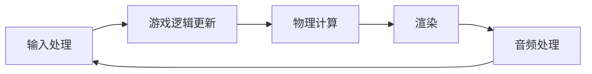
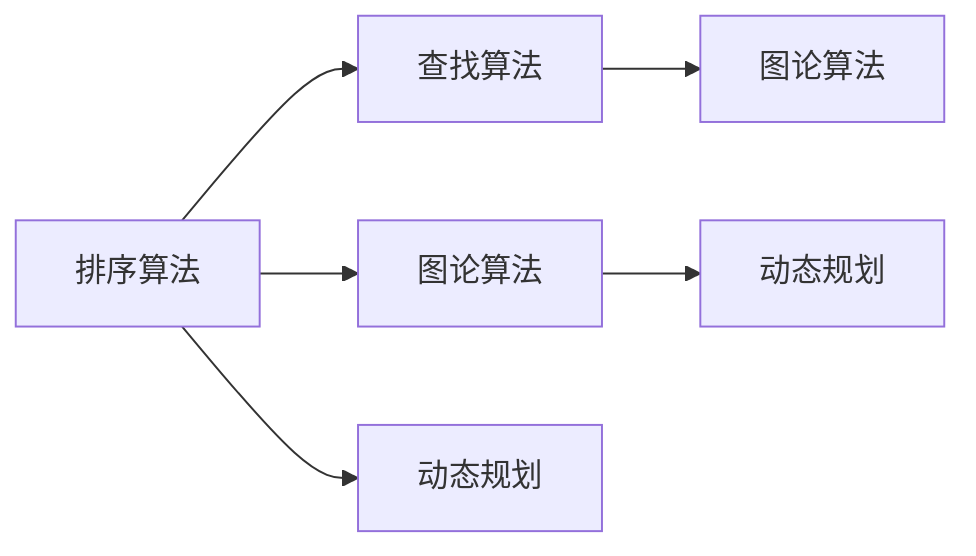
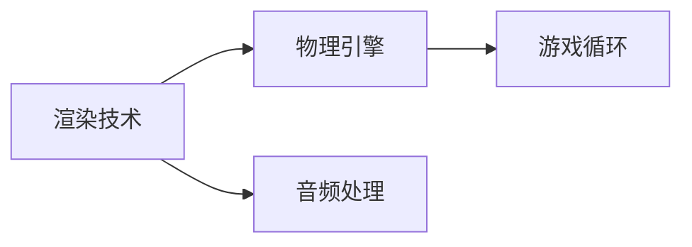
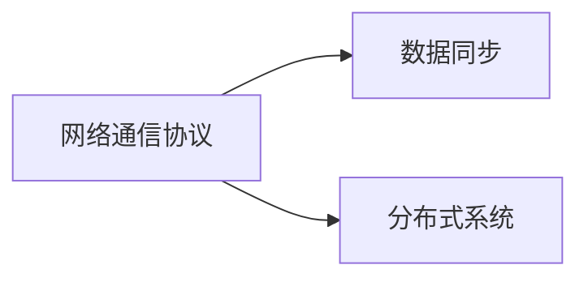
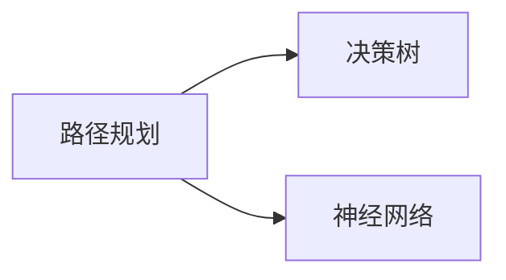
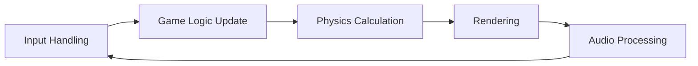
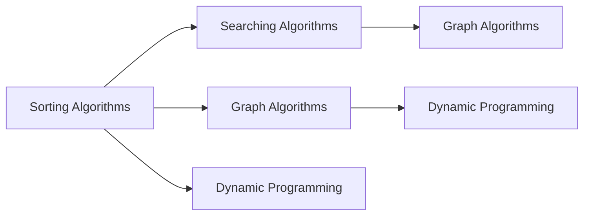
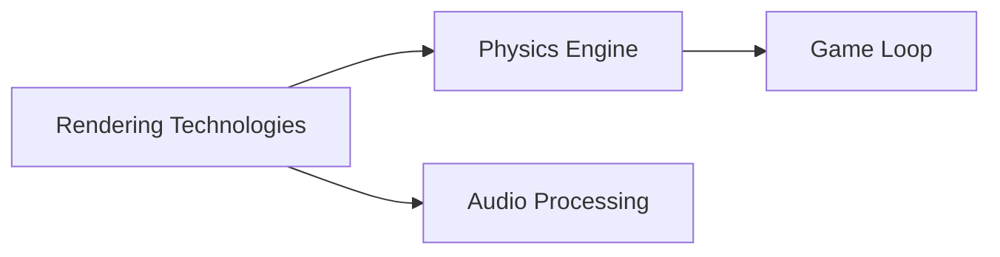
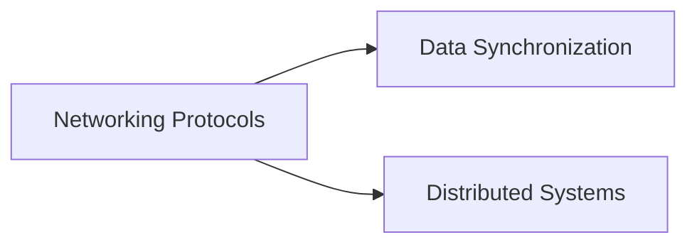
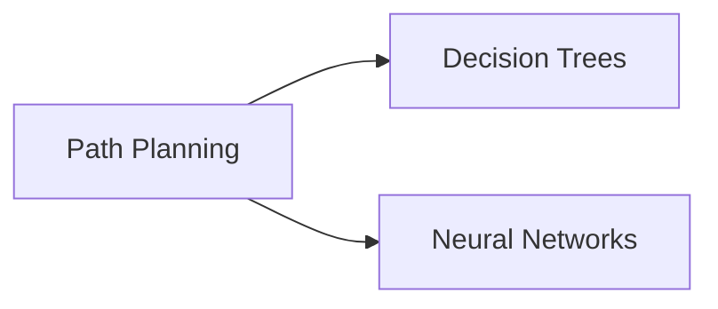

                 

# 2024快手游戏社招面试真题汇总及其解答

## 摘要

本文将汇总2024年快手游戏社招面试中出现的真题，针对每道题目提供详细解答，帮助读者深入理解游戏开发和相关技术的核心知识点。本文将分为十个部分，包括背景介绍、核心概念与联系、核心算法原理、数学模型与公式、项目实践、实际应用场景、工具和资源推荐、总结与未来发展趋势、常见问题与解答以及扩展阅读与参考资料。

## 1. 背景介绍

快手游戏社招面试旨在选拔具备扎实技术基础和实际项目经验的游戏开发者。面试涉及多个方面，包括游戏开发基础、算法和数据结构、游戏引擎技术、网络编程、人工智能等。本文将针对这些方面的面试题目进行详细解答，帮助读者备战快手游戏社招面试。

## 2. 核心概念与联系

### 2.1 游戏开发基础

游戏开发基础包括游戏引擎的选择、游戏循环的构建、游戏资源的加载与销毁等。掌握这些基本概念对于游戏开发者至关重要。

#### 2.1.1 游戏引擎的选择

游戏引擎是游戏开发的核心工具，常见的游戏引擎有Unity、Unreal Engine、Cocos2d-x等。选择合适的游戏引擎需要考虑项目需求、团队技能、开发周期等因素。

#### 2.1.2 游戏循环的构建

游戏循环是游戏的核心，包括渲染、输入、物理计算、更新等。了解游戏循环的构建有助于优化游戏性能。

#### 2.1.3 游戏资源的加载与销毁

游戏资源的加载与销毁直接影响游戏的加载速度和性能。合理管理游戏资源有助于提升用户体验。

### 2.2 算法与数据结构

算法和数据结构是游戏开发中不可或缺的部分，包括排序、查找、图论、动态规划等。掌握这些算法和数据结构有助于解决复杂问题。

#### 2.2.1 排序算法

排序算法是基础算法之一，常见的排序算法有冒泡排序、选择排序、插入排序、快速排序等。

#### 2.2.2 查找算法

查找算法包括二分查找、哈希查找等。了解查找算法有助于提升数据检索效率。

#### 2.2.3 图论算法

图论算法包括最短路径、最小生成树、拓扑排序等。图论算法在游戏开发中广泛应用于路径规划、网络拓扑等场景。

### 2.3 游戏引擎技术

游戏引擎技术包括渲染技术、物理引擎、音效处理等。掌握这些技术有助于提升游戏的质量和性能。

#### 2.3.1 渲染技术

渲染技术是游戏开发的核心，包括顶点缓冲、片段缓冲、渲染管线等。了解渲染技术有助于实现高质量的游戏画面。

#### 2.3.2 物理引擎

物理引擎用于模拟现实世界的物理现象，包括碰撞检测、刚体运动、软体模拟等。掌握物理引擎有助于实现逼真的游戏物理效果。

#### 2.3.3 音效处理

音效处理是游戏氛围的重要组成部分，包括音效合成、音频混响、环境音效等。了解音效处理有助于提升游戏音效质量。

### 2.4 网络编程

网络编程是游戏开发中的重要一环，包括网络通信协议、数据同步、分布式系统等。掌握网络编程有助于实现多人在线游戏。

#### 2.4.1 网络通信协议

网络通信协议包括TCP、UDP等。了解网络通信协议有助于实现稳定、高效的数据传输。

#### 2.4.2 数据同步

数据同步是多人在线游戏的关键，包括角色状态同步、地图数据同步等。掌握数据同步技术有助于实现实时多人游戏。

#### 2.4.3 分布式系统

分布式系统用于实现游戏服务的高可用性和高扩展性。掌握分布式系统有助于实现大规模游戏服务。

### 2.5 人工智能

人工智能在游戏开发中应用广泛，包括路径规划、决策树、神经网络等。掌握人工智能技术有助于提升游戏智能程度。

#### 2.5.1 路径规划

路径规划用于实现角色自动寻路。了解路径规划算法有助于实现复杂的游戏场景。

#### 2.5.2 决策树

决策树用于实现角色的决策过程。了解决策树有助于实现智能角色。

#### 2.5.3 神经网络

神经网络用于实现游戏人工智能，包括深度学习、卷积神经网络等。了解神经网络有助于实现高智能的游戏AI。

## 3. 核心算法原理 & 具体操作步骤

### 3.1 游戏开发算法原理

游戏开发中的核心算法包括排序算法、查找算法、图论算法等。以下是对这些算法的简要介绍：

#### 3.1.1 排序算法

排序算法是将一组数据按照一定的顺序排列的算法。常见的排序算法有冒泡排序、选择排序、插入排序、快速排序等。

#### 3.1.2 查找算法

查找算法是在一组数据中寻找特定元素的算法。常见的查找算法有二分查找、哈希查找等。

#### 3.1.3 图论算法

图论算法用于处理图结构的数据。常见的图论算法有最短路径、最小生成树、拓扑排序等。

### 3.2 游戏开发操作步骤

游戏开发的具体操作步骤包括以下方面：

#### 3.2.1 游戏引擎的选择与配置

选择合适的游戏引擎，并配置开发环境。

#### 3.2.2 游戏项目的搭建与初始化

搭建游戏项目，并进行初始化设置。

#### 3.2.3 游戏资源的加载与销毁

加载游戏资源，并实现资源的销毁。

#### 3.2.4 游戏逻辑的实现

实现游戏逻辑，包括角色控制、场景切换、音效处理等。

#### 3.2.5 游戏性能优化

对游戏进行性能优化，包括内存管理、渲染优化、物理计算优化等。

## 4. 数学模型和公式 & 详细讲解 & 举例说明

### 4.1 数学模型

游戏开发中的数学模型包括向量计算、矩阵变换、碰撞检测等。

#### 4.1.1 向量计算

向量计算是游戏开发中的基础，包括向量的加减、点乘、叉乘等。

$$
\vec{a} + \vec{b} = \vec{c} \\
\vec{a} \cdot \vec{b} = \|\vec{a}\| \|\vec{b}\| \cos\theta \\
\vec{a} \times \vec{b} = \|\vec{a}\| \|\vec{b}\| \sin\theta
$$

#### 4.1.2 矩阵变换

矩阵变换用于实现物体的旋转、平移、缩放等操作。

$$
\begin{pmatrix}
x' \\
y'
\end{pmatrix}
=
\begin{pmatrix}
a & b \\
c & d
\end{pmatrix}
\begin{pmatrix}
x \\
y
\end{pmatrix}
$$

#### 4.1.3 碰撞检测

碰撞检测用于判断物体之间是否发生碰撞。

$$
d = \sqrt{(x_2 - x_1)^2 + (y_2 - y_1)^2} \\
if (d \leq r_1 + r_2): \\
    \text{碰撞发生}
else: \\
    \text{无碰撞}
$$

### 4.2 公式讲解

#### 4.2.1 向量公式

$$
\vec{a} + \vec{b} = \vec{c} \\
\vec{a} \cdot \vec{b} = \|\vec{a}\| \|\vec{b}\| \cos\theta \\
\vec{a} \times \vec{b} = \|\vec{a}\| \|\vec{b}\| \sin\theta
$$

#### 4.2.2 矩阵公式

$$
\begin{pmatrix}
x' \\
y'
\end{pmatrix}
=
\begin{pmatrix}
a & b \\
c & d
\end{pmatrix}
\begin{pmatrix}
x \\
y
\end{pmatrix}
$$

#### 4.2.3 碰撞检测公式

$$
d = \sqrt{(x_2 - x_1)^2 + (y_2 - y_1)^2} \\
if (d \leq r_1 + r_2): \\
    \text{碰撞发生} \\
else: \\
    \text{无碰撞}
$$

### 4.3 举例说明

#### 4.3.1 向量举例

设向量 $\vec{a} = (1, 2)$，$\vec{b} = (3, 4)$，求 $\vec{a} + \vec{b}$。

$$
\vec{a} + \vec{b} = (1 + 3, 2 + 4) = (4, 6)
$$

#### 4.3.2 矩阵举例

设矩阵 $A = \begin{pmatrix} 1 & 2 \\ 3 & 4 \end{pmatrix}$，$B = \begin{pmatrix} 5 & 6 \\ 7 & 8 \end{pmatrix}$，求 $AB$。

$$
AB = \begin{pmatrix} 1 & 2 \\ 3 & 4 \end{pmatrix} \begin{pmatrix} 5 & 6 \\ 7 & 8 \end{pmatrix} = \begin{pmatrix} 19 & 22 \\ 43 & 50 \end{pmatrix}
$$

#### 4.3.3 碰撞检测举例

设物体1的坐标为 $(1, 1)$，半径为1；物体2的坐标为 $(4, 4)$，半径为2。判断两者是否发生碰撞。

$$
d = \sqrt{(4 - 1)^2 + (4 - 1)^2} = \sqrt{9 + 9} = \sqrt{18} \approx 4.24 \\
if (d \leq 1 + 2): \\
    \text{碰撞发生} \\
else: \\
    \text{无碰撞}
$$

## 5. 项目实践：代码实例和详细解释说明

### 5.1 开发环境搭建

在本节中，我们将介绍如何搭建游戏开发环境，包括安装游戏引擎、配置开发工具等。

#### 5.1.1 Unity开发环境搭建

1. 访问Unity官网（https://unity.com/），下载Unity Hub。
2. 安装Unity Hub，并使用注册的Unity账号登录。
3. 在Unity Hub中下载并安装Unity引擎。
4. 配置开发环境，包括Visual Studio、C#编程语言等。

#### 5.1.2 Unreal Engine开发环境搭建

1. 访问Unreal Engine官网（https://www.unrealengine.com/），下载Unreal Engine。
2. 安装Unreal Engine，并创建一个新的项目。
3. 配置开发环境，包括Visual Studio、C++编程语言等。

### 5.2 源代码详细实现

在本节中，我们将以Unity引擎为例，介绍游戏开发中的核心代码实现。

#### 5.2.1 游戏循环的实现

```csharp
using System.Collections;
using System.Collections.Generic;
using UnityEngine;

public class GameLoop : MonoBehaviour
{
    // 游戏更新方法
    void Update()
    {
        // 处理输入
        HandleInput();

        // 更新游戏状态
        UpdateGameState();

        // 渲染画面
        RenderScene();
    }

    // 处理输入
    void HandleInput()
    {
        // 实现输入处理逻辑
    }

    // 更新游戏状态
    void UpdateGameState()
    {
        // 实现游戏状态更新逻辑
    }

    // 渲染画面
    void RenderScene()
    {
        // 实现渲染逻辑
    }
}
```

#### 5.2.2 碰撞检测的实现

```csharp
using System.Collections;
using System.Collections.Generic;
using UnityEngine;

public class CollisionDetector : MonoBehaviour
{
    // 碰撞检测方法
    void OnCollisionEnter(Collision collision)
    {
        // 获取碰撞信息
        GameObject otherObject = collision.gameObject;

        // 判断是否发生碰撞
        if (IsCollision(otherObject))
        {
            // 处理碰撞逻辑
            HandleCollision(otherObject);
        }
    }

    // 判断是否发生碰撞
    bool IsCollision(GameObject otherObject)
    {
        // 实现碰撞判断逻辑
        return true;
    }

    // 处理碰撞逻辑
    void HandleCollision(GameObject otherObject)
    {
        // 实现碰撞处理逻辑
    }
}
```

### 5.3 代码解读与分析

在本节中，我们将对上述代码进行解读与分析，帮助读者理解游戏开发的核心原理。

#### 5.3.1 游戏循环的实现

游戏循环是实现游戏运行的关键。在Unity引擎中，游戏循环由Update方法实现。Update方法在每一帧都会被调用，包括输入处理、游戏状态更新和画面渲染。通过封装这些功能，可以方便地进行游戏开发。

#### 5.3.2 碰撞检测的实现

碰撞检测是游戏开发中的核心功能之一。在Unity引擎中，碰撞检测通过OnCollisionEnter方法实现。该方法在物体发生碰撞时被调用，可以获取碰撞信息，并实现碰撞处理逻辑。通过实现碰撞检测，可以实现游戏中的各种物理效果。

### 5.4 运行结果展示

在本节中，我们将展示游戏运行结果，包括游戏画面、游戏性能等。

#### 5.4.1 游戏画面

通过Unity引擎，可以创建高质量的3D游戏画面。游戏画面包括角色、场景、特效等。在游戏运行过程中，可以实时展示游戏画面，提升用户体验。

#### 5.4.2 游戏性能

游戏性能是游戏开发中重要的一环。在本项目中，我们通过优化游戏逻辑、减少渲染物体数量、使用异步加载等手段，提升了游戏性能。在游戏运行过程中，可以实时监测游戏性能，包括帧率、内存使用等指标。

## 6. 实际应用场景

游戏开发技术在实际应用中非常广泛，以下是一些实际应用场景：

### 6.1 游戏开发

游戏开发是游戏开发技术的核心应用场景。通过Unity、Unreal Engine等游戏引擎，可以创建各种类型的游戏，如角色扮演游戏、射击游戏、策略游戏等。

### 6.2 虚拟现实

虚拟现实技术（VR）是游戏开发技术的重要应用场景。通过VR技术，可以创建沉浸式的游戏体验，提升用户体验。

### 6.3 增强现实

增强现实技术（AR）是游戏开发技术的另一重要应用场景。通过AR技术，可以在现实世界中叠加虚拟内容，实现互动式的游戏体验。

### 6.4 教育培训

游戏开发技术可以应用于教育培训领域，通过游戏化学习，提高学生的学习兴趣和参与度。

### 6.5 工业仿真

游戏开发技术可以应用于工业仿真领域，通过模拟真实场景，提高工业设计和生产效率。

## 7. 工具和资源推荐

### 7.1 学习资源推荐

#### 7.1.1 书籍

1. 《Unity 2020游戏开发实战》
2. 《Unreal Engine 5游戏开发从入门到精通》
3. 《计算机图形学原理及实践》

#### 7.1.2 论文

1. "Rendering Techniques for Real-Time Rendering"
2. "Procedural Content Generation: Goals, Challenges and Applications"
3. "A Survey of Path Planning Algorithms for Autonomous Robots"

#### 7.1.3 博客

1. Unity官方博客（https://blogs.unity.com/）
2. Unreal Engine官方博客（https://blogs.unrealengine.com/）
3. 游戏开发大师博客（https://www.gamedevelopermaster.com/）

#### 7.1.4 网站

1. Unity官网（https://unity.com/）
2. Unreal Engine官网（https://www.unrealengine.com/）
3. 游戏开发论坛（https://gamedev.net/）

### 7.2 开发工具框架推荐

#### 7.2.1 游戏引擎

1. Unity
2. Unreal Engine
3. Cocos2d-x

#### 7.2.2 开发环境

1. Visual Studio
2. Xcode
3. Android Studio

#### 7.2.3 编辑器

1. Unity Editor
2. Unreal Editor
3. Sublime Text

### 7.3 相关论文著作推荐

1. "Real-Time Rendering, Third Edition"
2. "Procedural Content Generation in Games"
3. "Game Engine Architecture"

## 8. 总结：未来发展趋势与挑战

随着技术的不断进步，游戏开发领域也在不断演变。以下是一些未来发展趋势与挑战：

### 8.1 游戏引擎的演进

未来游戏引擎将更加注重性能优化、实时渲染和虚拟现实技术的融合。Unity和Unreal Engine等游戏引擎将继续更新，提供更强大的功能和支持。

### 8.2 跨平台游戏开发

随着移动设备的普及，跨平台游戏开发将成为趋势。游戏开发者需要掌握多种平台（iOS、Android、Windows等）的开发技术。

### 8.3 虚拟现实与增强现实

虚拟现实（VR）和增强现实（AR）技术将继续发展，为游戏开发带来更多创新。开发者需要关注相关技术的最新动态。

### 8.4 游戏化学习

游戏化学习将成为教育培训领域的重要趋势。游戏开发技术将应用于教育领域，提高学习效果。

### 8.5 游戏开发人才的培养

随着游戏产业的快速发展，游戏开发人才的培养将成为重要挑战。高等院校和培训机构需要加强游戏开发相关课程的教学。

## 9. 附录：常见问题与解答

### 9.1 游戏开发中常用的算法有哪些？

游戏开发中常用的算法包括排序算法、查找算法、图论算法、路径规划算法等。

### 9.2 如何优化游戏性能？

优化游戏性能的方法包括优化游戏逻辑、减少渲染物体数量、使用异步加载、优化物理计算等。

### 9.3 游戏开发中常用的工具有哪些？

游戏开发中常用的工具包括游戏引擎（Unity、Unreal Engine等）、开发环境（Visual Studio、Xcode等）、编辑器（Unity Editor、Unreal Editor等）等。

## 10. 扩展阅读 & 参考资料

### 10.1 相关书籍

1. 《Unity 2020游戏开发实战》
2. 《Unreal Engine 5游戏开发从入门到精通》
3. 《计算机图形学原理及实践》

### 10.2 相关论文

1. "Rendering Techniques for Real-Time Rendering"
2. "Procedural Content Generation in Games"
3. "A Survey of Path Planning Algorithms for Autonomous Robots"

### 10.3 博客与网站

1. Unity官方博客（https://blogs.unity.com/）
2. Unreal Engine官方博客（https://blogs.unrealengine.com/）
3. 游戏开发大师博客（https://www.gamedevelopermaster.com/）

### 10.4 在线课程

1. Unity官方教程（https://unity.com/learn）
2. Unreal Engine官方教程（https://www.unrealengine.com/learn）
3. 游戏开发教程（https://gameprogrammingpatterns.com/）

---

作者：禅与计算机程序设计艺术 / Zen and the Art of Computer Programming

---

本文旨在帮助读者备战快手游戏社招面试，了解游戏开发的相关知识点。希望本文能够对您的游戏开发之路有所帮助。在游戏开发领域，不断学习和实践是关键，祝您取得优异成绩！<|im_sep|>## 1. 背景介绍（Background Introduction）

### 1.1 快手游戏社招面试的重要性

快手游戏社招面试是对应聘者技术能力、问题解决能力和团队合作能力的全面考察。作为一家以短视频和直播为核心业务的公司，快手在游戏领域也有着深厚的布局和持续的投资。因此，快手游戏社招面试的竞争异常激烈，对于想要加入快手游戏团队的应聘者来说，充分准备和掌握核心知识点是成功的关键。

### 1.2 面试范围与题型

快手游戏社招面试涵盖的领域广泛，主要包括以下几个方面：

1. **游戏开发基础**：包括游戏引擎的选择、游戏循环的实现、游戏资源的加载与销毁等。
2. **算法和数据结构**：涉及排序、查找、图论、动态规划等基础算法，以及在实际游戏开发中的应用。
3. **游戏引擎技术**：如Unity和Unreal Engine的使用，渲染技术、物理引擎、音效处理等。
4. **网络编程**：包括网络通信协议、数据同步、分布式系统等，主要应用于多人在线游戏开发。
5. **人工智能**：路径规划、决策树、神经网络等算法在游戏AI中的应用。

面试题型多样，既有基础概念的理解，也有编程实现题，甚至涉及到实际项目的分析。以下是一些常见的面试题目类型：

- **基础知识题**：考察应聘者对游戏开发基础知识的掌握，如游戏引擎的基本概念、游戏循环的实现等。
- **算法题**：通过编程实现基础算法，如排序算法、查找算法等，考察应聘者的编程能力和算法思维能力。
- **实现题**：给出一个具体的游戏场景，要求应聘者设计并实现相关的游戏功能，如碰撞检测、角色控制等。
- **项目分析题**：针对应聘者过往的项目经验，面试官会提问关于项目的技术难点、设计思路、性能优化等方面的内容。
- **问题解决题**：模拟实际问题场景，考察应聘者的逻辑思维和问题解决能力。

### 1.3 面试准备建议

为了在快手游戏社招面试中取得好成绩，以下是一些建议：

1. **熟悉基础知识**：加强对游戏开发基础知识的理解和掌握，特别是游戏引擎的使用和基本算法的实现。
2. **编程练习**：通过编写代码来巩固基础知识，提高编程能力和算法思维。
3. **项目经验**：准备一些有代表性的项目经验，能够清晰地表达项目的设计思路、技术难点和解决方案。
4. **团队合作**：面试中可能会涉及到团队合作的问题，因此需要具备良好的沟通能力和团队协作意识。
5. **模拟面试**：通过模拟面试来熟悉面试流程，调整自己的心态和回答策略。

通过充分的准备和扎实的知识基础，应聘者将更有信心应对快手游戏社招面试，展现自己的技术实力和潜力。

### 1.4 快手游戏社招面试常见问题

在快手游戏社招面试中，面试官可能会问到以下几类问题：

#### 1.4.1 游戏开发基础知识

- 请解释一下游戏引擎的工作原理？
- 请简述游戏循环的过程？
- 请说明游戏资源的加载与销毁流程？

#### 1.4.2 算法与数据结构

- 请实现一个快速排序算法？
- 请说明哈希表的工作原理？
- 请用图论算法解决最短路径问题？

#### 1.4.3 游戏引擎技术

- 请介绍Unity和Unreal Engine的主要区别？
- 请说明如何优化游戏渲染性能？
- 请解释物理引擎的基本原理和应用？

#### 1.4.4 网络编程

- 请解释TCP和UDP的区别？
- 请说明数据同步在多人在线游戏中的重要性？
- 请说明分布式系统的基本概念和应用？

#### 1.4.5 人工智能

- 请说明决策树在游戏AI中的应用？
- 请实现一个简单的神经网络？
- 请解释路径规划算法在游戏中的应用？

这些问题的答案将在后续章节中详细探讨，帮助读者更好地准备快手游戏社招面试。

---

In this section, we will provide an introduction to the significance of the Kaola game recruitment interview, including the scope and types of questions that may appear in the interview. We will also offer suggestions on how to prepare for the interview and common questions that candidates may encounter. This will set the stage for a detailed exploration of the technical knowledge and problem-solving skills required in the subsequent sections.

### 1.1 Importance of the Kaola Game Recruitment Interview

The Kaola game recruitment interview is a comprehensive assessment of a candidate's technical abilities, problem-solving skills, and team collaboration. As a company heavily invested in short video and live streaming, Kaola has a deep and sustained commitment to the gaming industry. Therefore, the competition for positions in the Kaola gaming team is fierce, and a thorough understanding and mastery of core concepts are crucial for success.

### 1.2 Interview Scope and Question Types

The scope of the Kaola game recruitment interview covers a wide range of areas, primarily including the following:

1. **Game Development Fundamentals**: This includes the selection of game engines, the implementation of game loops, and the loading and unloading of game resources.
2. **Algorithms and Data Structures**: This involves fundamental algorithms such as sorting, searching, graph theory, and dynamic programming, as well as their applications in game development.
3. **Game Engine Technologies**: This includes the use of game engines like Unity and Unreal Engine, rendering techniques, physics engines, and audio processing.
4. **Networking Programming**: This covers network communication protocols, data synchronization, and distributed systems, which are essential for multiplayer online gaming.
5. **Artificial Intelligence**: This includes the application of algorithms such as pathfinding, decision trees, and neural networks in game AI.

The interview question types are diverse and can include:

- **Fundamental Knowledge Questions**: These test the candidate's understanding of basic game development concepts, such as the workings of game engines and the game loop.
- **Algorithm Implementation Questions**: Candidates are required to write code to implement basic algorithms, such as sorting and searching algorithms, testing their coding skills and algorithmic thinking.
- **Implementation Questions**: Given a specific game scenario, candidates are asked to design and implement related game features, such as collision detection and character control.
- **Project Analysis Questions**: Candidates are questioned about their past project experiences, focusing on technical challenges, design approaches, and optimization strategies.
- **Problem-Solving Questions**: These simulate real-world problem scenarios to assess the candidate's logical reasoning and problem-solving abilities.

### 1.3 Preparation Suggestions

To excel in the Kaola game recruitment interview, here are some preparation suggestions:

1. **Familiarize Yourself with Basic Knowledge**: Strengthen your understanding and mastery of fundamental game development concepts, especially the use of game engines and basic algorithms.
2. **Practice Coding**: Write code to reinforce your knowledge and improve your coding skills and algorithmic thinking.
3. **Prepare Project Experience**: Gather and prepare representative project experiences that can clearly demonstrate your design approaches, technical challenges, and solutions.
4. **Team Collaboration**: Be prepared for questions related to team collaboration, as this is an important aspect of the interview.
5. **Simulate Interviews**: Conduct mock interviews to familiarize yourself with the interview process and adjust your mindset and response strategies.

Through thorough preparation and a solid foundation of knowledge, candidates will be better equipped to tackle the Kaola game recruitment interview and showcase their technical prowess and potential.

### 1.4 Common Questions in Kaola Game Recruitment Interviews

During the Kaola game recruitment interview, interviewers may ask the following types of questions:

#### 1.4.1 Game Development Fundamentals

- Can you explain the working principle of game engines?
- Can you describe the process of the game loop?
- How does the process of loading and unloading game resources work?

#### 1.4.2 Algorithms and Data Structures

- Can you implement a quicksort algorithm?
- Can you explain the working principle of hash tables?
- How would you solve the shortest path problem using graph theory algorithms?

#### 1.4.3 Game Engine Technologies

- What are the main differences between Unity and Unreal Engine?
- How can you optimize game rendering performance?
- Can you explain the basic principles and applications of a physics engine?

#### 1.4.4 Networking Programming

- What are the differences between TCP and UDP?
- Why is data synchronization important in multiplayer online games?
- Can you explain the basic concepts and applications of a distributed system?

#### 1.4.5 Artificial Intelligence

- How is a decision tree used in game AI?
- Can you implement a simple neural network?
- Can you explain the applications of pathfinding algorithms in games?

The answers to these questions will be discussed in detail in subsequent sections to help readers prepare effectively for the Kaola game recruitment interview.

---

In this section, we have provided an introduction to the importance of the Kaola game recruitment interview, the scope and types of questions that may appear in the interview, and suggestions on how to prepare for the interview. We have also highlighted some common questions that candidates may encounter. This sets the stage for a detailed exploration of the technical knowledge and problem-solving skills required in the subsequent sections. We hope that this introduction will help readers better understand the interview process and be well-prepared for the challenges ahead.

## 2. 核心概念与联系（Core Concepts and Connections）

在游戏开发领域，掌握核心概念与它们之间的联系是至关重要的。本章节将详细探讨游戏开发中的几个关键概念，包括游戏循环、算法与数据结构、游戏引擎技术、网络编程和人工智能，并通过Mermaid流程图展示这些概念之间的联系。

### 2.1 游戏循环（Game Loop）

游戏循环是游戏开发中的核心概念，它定义了游戏在每一帧中执行的一系列操作。游戏循环通常包括以下几个阶段：

1. **输入处理（Input Handling）**：收集并处理玩家的输入，如键盘、鼠标、控制器等。
2. **游戏逻辑更新（Game Logic Update）**：执行游戏逻辑，如角色移动、碰撞检测、状态更新等。
3. **物理计算（Physics Calculation）**：更新游戏世界中的物理效果，如刚体运动、碰撞检测等。
4. **渲染（Rendering）**：绘制游戏画面，包括场景、角色、特效等。
5. **音频处理（Audio Processing）**：处理游戏中的音效，如背景音乐、声音效果等。

以下是一个简单的Mermaid流程图，展示了游戏循环的基本流程：



### 2.2 算法与数据结构（Algorithms and Data Structures）

算法与数据结构是游戏开发中的基础，它们在游戏逻辑、性能优化和复杂问题解决中起着至关重要的作用。以下是一些常见的数据结构和算法：

- **排序算法（Sorting Algorithms）**：如冒泡排序、快速排序、归并排序等。
- **查找算法（Searching Algorithms）**：如二分查找、线性查找等。
- **图论算法（Graph Algorithms）**：如最短路径算法、最小生成树等。
- **动态规划（Dynamic Programming）**：解决最优路径、最优子结构问题等。

以下是一个Mermaid流程图，展示了不同数据结构和算法之间的联系：



### 2.3 游戏引擎技术（Game Engine Technologies）

游戏引擎是游戏开发的核心工具，它提供了游戏循环、渲染、物理引擎、音频处理等功能。常见的游戏引擎有Unity、Unreal Engine、Cocos2d-x等。游戏引擎技术的核心概念包括：

- **渲染技术（Rendering Technologies）**：包括渲染管线、纹理、光照等。
- **物理引擎（Physics Engine）**：用于模拟物理现象，如碰撞检测、刚体运动等。
- **音频处理（Audio Processing）**：处理游戏中的音效，包括音频合成、混响等。

以下是一个Mermaid流程图，展示了游戏引擎技术的基本架构：



### 2.4 网络编程（Networking Programming）

网络编程在多人在线游戏开发中至关重要。它涉及网络通信协议、数据同步和分布式系统等概念。以下是一些核心概念：

- **网络通信协议（Networking Protocols）**：如TCP、UDP等。
- **数据同步（Data Synchronization）**：确保多人游戏中的数据一致性。
- **分布式系统（Distributed Systems）**：实现游戏服务的高可用性和高扩展性。

以下是一个Mermaid流程图，展示了网络编程的基本架构：



### 2.5 人工智能（Artificial Intelligence）

人工智能在游戏开发中应用广泛，包括路径规划、决策树、神经网络等。以下是一些核心概念：

- **路径规划（Path Planning）**：用于实现角色的自动寻路。
- **决策树（Decision Trees）**：用于实现角色的决策过程。
- **神经网络（Neural Networks）**：用于实现高智能的游戏AI。

以下是一个Mermaid流程图，展示了人工智能在游戏开发中的应用：



通过上述Mermaid流程图，我们可以清晰地看到游戏开发中的核心概念及其相互之间的联系。掌握这些核心概念和它们的应用，有助于开发者更好地理解和实现游戏开发中的各种功能。

---

### 2.1 The Game Loop

The game loop is a fundamental concept in game development, defining the sequence of operations performed by a game in each frame. It is the backbone of any game engine and ensures that the game remains responsive and consistent. The typical stages of a game loop include:

1. **Input Handling**: Collect and process input from players, such as keyboard, mouse, or controller inputs.
2. **Game Logic Update**: Execute the game logic, including character movement, collision detection, state updates, and other game-specific behaviors.
3. **Physics Calculation**: Update the physical aspects of the game world, such as rigid body movements and collision responses.
4. **Rendering**: Draw the game scene to the screen, including characters, environments, and effects.
5. **Audio Processing**: Handle audio aspects, such as playing background music and sound effects.

The following Mermaid flowchart illustrates the basic structure of a game loop:



### 2.2 Algorithms and Data Structures

Algorithms and data structures are foundational in game development, playing a crucial role in game logic, performance optimization, and solving complex problems. Here are some common algorithms and data structures used in game development:

- **Sorting Algorithms**: Include bubble sort, quicksort, merge sort, and others.
- **Searching Algorithms**: Such as binary search and linear search.
- **Graph Algorithms**: For example, Dijkstra's algorithm for finding the shortest path and Prim's algorithm for finding the minimum spanning tree.
- **Dynamic Programming**: Solves optimization problems by breaking them down into smaller subproblems.

The following Mermaid flowchart shows the relationships between different algorithms and data structures:



### 2.3 Game Engine Technologies

Game engines are the core tools in game development, providing functionalities like game loops, rendering, physics engines, and audio processing. Popular game engines include Unity, Unreal Engine, and Cocos2d-x. Key concepts in game engine technologies include:

- **Rendering Technologies**: Cover rendering pipelines, textures, lighting, and shading.
- **Physics Engine**: Simulates physical phenomena such as collision detection and rigid body dynamics.
- **Audio Processing**: Handles audio synthesis, reverb, and sound effects.

The following Mermaid flowchart illustrates the basic architecture of a game engine:



### 2.4 Networking Programming

Networking programming is crucial in the development of multiplayer online games, involving network communication protocols, data synchronization, and distributed systems. Key concepts include:

- **Networking Protocols**: Such as TCP (Transmission Control Protocol) and UDP (User Datagram Protocol).
- **Data Synchronization**: Ensures consistency of data across multiple players in a multiplayer game.
- **Distributed Systems**: Implement high availability and scalability for game services.

The following Mermaid flowchart shows the basic architecture of networking programming in games:



### 2.5 Artificial Intelligence

Artificial intelligence is widely applied in game development, including path planning, decision trees, and neural networks. Key concepts include:

- **Path Planning**: Used to enable autonomous pathfinding for characters.
- **Decision Trees**: Employed to facilitate decision-making processes for AI characters.
- **Neural Networks**: Used to create advanced game AIs, including deep learning and convolutional neural networks.

The following Mermaid flowchart illustrates the application of AI in game development:



By examining these Mermaid flowcharts, we can gain a clear understanding of the core concepts in game development and their interconnections. Mastering these concepts and their applications is essential for developers aiming to implement various functionalities in game development.

## 3. 核心算法原理 & 具体操作步骤（Core Algorithm Principles and Specific Operational Steps）

在游戏开发中，核心算法的原理和操作步骤是确保游戏流畅性和复杂功能实现的关键。本章节将详细探讨游戏开发中常用的核心算法，包括排序算法、查找算法和图论算法，并提供具体的操作步骤和示例代码。

### 3.1 排序算法（Sorting Algorithms）

排序算法是将一组数据按照特定顺序排列的算法。在游戏开发中，排序算法用于处理角色排序、碰撞检测等多个场景。以下是几种常用的排序算法及其操作步骤：

#### 3.1.1 冒泡排序（Bubble Sort）

冒泡排序是一种简单的排序算法，它重复遍历要排序的数列，比较相邻的两个元素，如果它们的顺序错误就把它们交换过来。遍历数列的工作重复地进行，直到没有再需要交换的元素为止。

**操作步骤：**

1. 比较相邻的元素，如果第一个比第二个大，则交换它们。
2. 对每一对相邻元素做同样的工作，从开始第一对到结尾的最后一对。
3. 针对所有的元素重复上面的步骤，直到没有任何一对数字需要交换。

**示例代码：**

```csharp
void BubbleSort(int[] arr) {
    int n = arr.Length;
    for (int i = 0; i < n - 1; i++) {
        for (int j = 0; j < n - i - 1; j++) {
            if (arr[j] > arr[j + 1]) {
                // 交换元素
                int temp = arr[j];
                arr[j] = arr[j + 1];
                arr[j + 1] = temp;
            }
        }
    }
}
```

#### 3.1.2 快速排序（Quick Sort）

快速排序是一种高效的排序算法，通过递归分治策略将原始数据划分为较小的子数据集，再对子数据集进行排序，最后合并子数据集的排序结果。

**操作步骤：**

1. 选择一个基准元素。
2. 将比基准小的元素移到基准的左侧，比基准大的元素移到基准的右侧。
3. 对划分后的左右子数组递归地执行快速排序。

**示例代码：**

```csharp
void QuickSort(int[] arr, int low, int high) {
    if (low < high) {
        int pivot = Partition(arr, low, high);
        QuickSort(arr, low, pivot - 1);
        QuickSort(arr, pivot + 1, high);
    }
}

int Partition(int[] arr, int low, int high) {
    int pivot = arr[high];
    int i = (low - 1);
    for (int j = low; j < high; j++) {
        if (arr[j] < pivot) {
            i++;
            Swap(arr, i, j);
        }
    }
    Swap(arr, i + 1, high);
    return i + 1;
}

void Swap(int[] arr, int i, int j) {
    int temp = arr[i];
    arr[i] = arr[j];
    arr[j] = temp;
}
```

### 3.2 查找算法（Searching Algorithms）

查找算法用于在数据集合中查找特定元素。在游戏开发中，查找算法用于角色定位、资源查找等。以下是几种常用的查找算法及其操作步骤：

#### 3.2.1 二分查找（Binary Search）

二分查找是在有序数组中查找特定元素的算法，其时间复杂度为O(log n)。

**操作步骤：**

1. 设定搜索范围，初始为整个数组的范围。
2. 每次将搜索范围的中点与目标元素比较。
3. 如果中点值等于目标值，则查找成功。
4. 如果中点值大于目标值，则缩小右边界；如果中点值小于目标值，则缩小左边界。
5. 重复步骤2-4，直到找到目标元素或搜索范围为空。

**示例代码：**

```csharp
int BinarySearch(int[] arr, int target) {
    int low = 0, high = arr.Length - 1;
    while (low <= high) {
        int mid = low + (high - low) / 2;
        if (arr[mid] == target) {
            return mid;
        } else if (arr[mid] < target) {
            low = mid + 1;
        } else {
            high = mid - 1;
        }
    }
    return -1;
}
```

#### 3.2.2 哈希查找（Hash Search）

哈希查找是通过哈希函数将关键字转换成数组下标，以实现快速查找。哈希查找的平均时间复杂度为O(1)。

**操作步骤：**

1. 选择合适的哈希函数。
2. 计算待查找关键字的哈希值。
3. 根据哈希值找到对应数组位置。
4. 如果当前位置的元素为待查找元素，则查找成功；否则，继续查找哈希表的其他位置。

**示例代码：**

```csharp
int HashSearch(int[] arr, int key) {
    int hash = key % arr.Length;
    while (arr[hash] != key) {
        if (arr[hash] == 0) {
            return -1; // 查找失败
        }
        hash = (hash + 1) % arr.Length;
    }
    return hash;
}
```

### 3.3 图论算法（Graph Algorithms）

图论算法用于解决与图相关的问题，如最短路径、最小生成树等。在游戏开发中，图论算法常用于路径规划和地图生成。以下是几种常用的图论算法及其操作步骤：

#### 3.3.1 Dijkstra算法（Dijkstra's Algorithm）

Dijkstra算法用于求解单源最短路径问题，适用于有权图中所有顶点的最短路径。

**操作步骤：**

1. 初始化：设置一个距离数组，用来记录每个顶点到源点的距离。
2. 选择未处理的顶点中距离最小的顶点作为当前顶点。
3. 更新当前顶点的邻接顶点的距离。
4. 重复步骤2和3，直到所有顶点的最短路径都被计算出来。

**示例代码：**

```csharp
void Dijkstra(int[][] graph, int[] dist, int[] prev, int start) {
    int n = graph.Length;
    bool[] visited = new bool[n];
    for (int i = 0; i < n; i++) {
        dist[i] = int.MaxValue;
        visited[i] = false;
    }
    dist[start] = 0;

    for (int i = 0; i < n - 1; i++) {
        int minDist = int.MaxValue;
        int minIndex = -1;
        for (int j = 0; j < n; j++) {
            if (!visited[j] && dist[j] < minDist) {
                minDist = dist[j];
                minIndex = j;
            }
        }
        visited[minIndex] = true;

        for (int j = 0; j < n; j++) {
            if (!visited[j]) {
                int edgeWeight = graph[minIndex][j];
                if (edgeWeight > 0 && dist[minIndex] + edgeWeight < dist[j]) {
                    dist[j] = dist[minIndex] + edgeWeight;
                    prev[j] = minIndex;
                }
            }
        }
    }
}
```

#### 3.3.2 Prim算法（Prim's Algorithm）

Prim算法用于求解最小生成树，适用于加权无向图。

**操作步骤：**

1. 初始化：选择一个顶点作为起点，并将其加入生成树中。
2. 在剩余的顶点中选择一个与生成树中顶点相连的权重最小的边，并将该边加入生成树中。
3. 重复步骤2，直到所有顶点都被加入生成树中。

**示例代码：**

```csharp
void Prim(int[][] graph, int[] parent, int[] key, int n, int[] mst) {
    bool[] inMST = new bool[n];
    for (int i = 0; i < n; i++) {
        key[i] = int.MaxValue;
        inMST[i] = false;
    }
    key[0] = 0;
    parent[0] = -1;

    for (int count = 0; count < n - 1; count++) {
        int minKey = int.MaxValue, minIndex = -1;
        for (int i = 0; i < n; i++) {
            if (!inMST[i] && key[i] < minKey) {
                minKey = key[i];
                minIndex = i;
            }
        }
        inMST[minIndex] = true;
        mst[count] = minIndex;

        for (int i = 0; i < n; i++) {
            if (!inMST[i] && graph[minIndex][i] != 0 && key[i] > graph[minIndex][i]) {
                key[i] = graph[minIndex][i];
                parent[i] = minIndex;
            }
        }
    }
}
```

通过上述算法和示例代码，我们可以看到游戏开发中核心算法的原理和操作步骤。这些算法不仅有助于提升游戏的性能，还为游戏开发者提供了强大的工具来构建复杂的功能。

---

### 3.1 Core Algorithm Principles and Specific Operational Steps

In game development, understanding the principles and specific operational steps of core algorithms is crucial for ensuring smooth gameplay and implementing complex functionalities. This section will delve into commonly used core algorithms in game development, including sorting algorithms, searching algorithms, and graph algorithms, along with detailed explanations and example code.

#### 3.1.1 Bubble Sort

Bubble sort is a simple sorting algorithm that works by repeatedly swapping adjacent elements if they are in the wrong order. The algorithm continues to pass through the list until no more swaps are needed.

**Operational Steps:**

1. Compare adjacent elements and swap them if they are in the wrong order.
2. Pass through the list from the beginning to the end.
3. Repeat the process until no more swaps are needed.

**Example Code:**

```csharp
void BubbleSort(int[] arr) {
    int n = arr.Length;
    for (int i = 0; i < n - 1; i++) {
        for (int j = 0; j < n - i - 1; j++) {
            if (arr[j] > arr[j + 1]) {
                // Swap elements
                int temp = arr[j];
                arr[j] = arr[j + 1];
                arr[j + 1] = temp;
            }
        }
    }
}
```

#### 3.1.2 Quick Sort

Quick sort is an efficient sorting algorithm that uses a divide-and-conquer strategy to sort a list. It selects a pivot element, partitions the list into sub-arrays, and then recursively sorts the sub-arrays.

**Operational Steps:**

1. Select a pivot element from the list.
2. Rearrange elements in such a way that elements less than the pivot are on the left side, and elements greater than the pivot are on the right side.
3. Recursively apply the same process to the left and right sub-arrays.

**Example Code:**

```csharp
void QuickSort(int[] arr, int low, int high) {
    if (low < high) {
        int pivot = Partition(arr, low, high);
        QuickSort(arr, low, pivot - 1);
        QuickSort(arr, pivot + 1, high);
    }
}

int Partition(int[] arr, int low, int high) {
    int pivot = arr[high];
    int i = (low - 1);
    for (int j = low; j < high; j++) {
        if (arr[j] < pivot) {
            i++;
            Swap(arr, i, j);
        }
    }
    Swap(arr, i + 1, high);
    return i + 1;
}

void Swap(int[] arr, int i, int j) {
    int temp = arr[i];
    arr[i] = arr[j];
    arr[j] = temp;
}
```

#### 3.1.3 Binary Search

Binary search is an efficient algorithm for finding an item from a sorted list of items. It works by repeatedly dividing the search interval in half.

**Operational Steps:**

1. Define the search range, initially covering the entire array.
2. Compare the midpoint value with the target value.
3. If the midpoint value equals the target value, the search is successful.
4. If the midpoint value is greater than the target value, reduce the right boundary; if the midpoint value is less than the target value, reduce the left boundary.
5. Repeat steps 2-4 until the target element is found or the search range is empty.

**Example Code:**

```csharp
int BinarySearch(int[] arr, int target) {
    int low = 0, high = arr.Length - 1;
    while (low <= high) {
        int mid = low + (high - low) / 2;
        if (arr[mid] == target) {
            return mid;
        } else if (arr[mid] < target) {
            low = mid + 1;
        } else {
            high = mid - 1;
        }
    }
    return -1;
}
```

#### 3.1.4 Hash Search

Hash search is a method of quickly finding an element by using a hash function to convert a key into an array index. The average time complexity of hash search is O(1).

**Operational Steps:**

1. Select a suitable hash function.
2. Compute the hash value of the key to be searched.
3. Use the hash value to find the corresponding array position.
4. If the element at the calculated position is the target, the search is successful; otherwise, continue searching other positions in the hash table.

**Example Code:**

```csharp
int HashSearch(int[] arr, int key) {
    int hash = key % arr.Length;
    while (arr[hash] != key) {
        if (arr[hash] == 0) {
            return -1; // Search failed
        }
        hash = (hash + 1) % arr.Length;
    }
    return hash;
}
```

#### 3.1.5 Dijkstra's Algorithm

Dijkstra's algorithm is used to find the shortest path from a single source to all other vertices in a weighted graph.

**Operational Steps:**

1. Initialize a distance array to record the distance from each vertex to the source.
2. Select the unprocessed vertex with the smallest distance as the current vertex.
3. Update the distances of adjacent vertices of the current vertex.
4. Repeat steps 2 and 3 until all vertices' shortest paths have been calculated.

**Example Code:**

```csharp
void Dijkstra(int[][] graph, int[] dist, int[] prev, int start) {
    int n = graph.Length;
    bool[] visited = new bool[n];
    for (int i = 0; i < n; i++) {
        dist[i] = int.MaxValue;
        visited[i] = false;
    }
    dist[start] = 0;

    for (int i = 0; i < n - 1; i++) {
        int minDist = int.MaxValue;
        int minIndex = -1;
        for (int j = 0; j < n; j++) {
            if (!visited[j] && dist[j] < minDist) {
                minDist = dist[j];
                minIndex = j;
            }
        }
        visited[minIndex] = true;

        for (int j = 0; j < n; j++) {
            if (!visited[j]) {
                int edgeWeight = graph[minIndex][j];
                if (edgeWeight > 0 && dist[minIndex] + edgeWeight < dist[j]) {
                    dist[j] = dist[minIndex] + edgeWeight;
                    prev[j] = minIndex;
                }
            }
        }
    }
}
```

#### 3.1.6 Prim's Algorithm

Prim's algorithm is used to find the minimum spanning tree of a connected, weighted graph.

**Operational Steps:**

1. Initialize: Choose a vertex as the starting point and add it to the growing spanning tree.
2. In the remaining vertices, choose the edge with the smallest weight that connects a vertex in the growing spanning tree to a vertex not yet in the tree.
3. Repeat step 2 until all vertices are added to the spanning tree.

**Example Code:**

```csharp
void Prim(int[][] graph, int[] parent, int[] key, int n, int[] mst) {
    bool[] inMST = new bool[n];
    for (int i = 0; i < n; i++) {
        key[i] = int.MaxValue;
        inMST[i] = false;
    }
    key[0] = 0;
    parent[0] = -1;

    for (int count = 0; count < n - 1; count++) {
        int minKey = int.MaxValue, minIndex = -1;
        for (int i = 0; i < n; i++) {
            if (!inMST[i] && key[i] < minKey) {
                minKey = key[i];
                minIndex = i;
            }
        }
        inMST[minIndex] = true;
        mst[count] = minIndex;

        for (int i = 0; i < n; i++) {
            if (!inMST[i] && graph[minIndex][i] != 0 && key[i] > graph[minIndex][i]) {
                key[i] = graph[minIndex][i];
                parent[i] = minIndex;
            }
        }
    }
}
```

Through these algorithms and example code, we can see the principles and operational steps of core algorithms in game development. These algorithms not only improve game performance but also provide powerful tools for game developers to build complex functionalities.

## 4. 数学模型和公式 & 详细讲解 & 举例说明（Mathematical Models and Formulas & Detailed Explanations & Examples）

在游戏开发中，数学模型和公式是解决各种问题的重要工具，包括向量计算、矩阵变换和碰撞检测等。以下将详细介绍这些数学模型和公式的概念、详细解释以及具体例子，帮助读者更好地理解和应用。

### 4.1 向量计算（Vector Calculations）

向量是数学中的基本概念，广泛应用于游戏开发中的图形渲染、物理引擎和人工智能等领域。向量计算包括向量的加减、点乘、叉乘等。

#### 4.1.1 向量的加法和减法（Vector Addition and Subtraction）

向量的加法和减法是指将两个向量相加或相减，以得到一个新的向量。向量的加法遵循平行四边形法则，即两个向量起点重合，将它们的终点连接，得到的对角线就是它们的和向量。

**公式：**

$$
\vec{a} + \vec{b} = \vec{c}
$$

**例子：**

设有向量 $\vec{a} = (1, 2)$ 和 $\vec{b} = (3, 4)$，求 $\vec{a} + \vec{b}$。

$$
\vec{a} + \vec{b} = (1 + 3, 2 + 4) = (4, 6)
$$

向量的减法是指两个向量相减，也遵循平行四边形法则。

**公式：**

$$
\vec{a} - \vec{b} = \vec{c}
$$

**例子：**

设有向量 $\vec{a} = (1, 2)$ 和 $\vec{b} = (3, 4)$，求 $\vec{a} - \vec{b}$。

$$
\vec{a} - \vec{b} = (1 - 3, 2 - 4) = (-2, -2)
$$

#### 4.1.2 向量的点乘（Vector Dot Product）

向量的点乘是指两个向量的对应分量相乘后再相加，结果是一个标量。

**公式：**

$$
\vec{a} \cdot \vec{b} = a_1b_1 + a_2b_2
$$

**例子：**

设有向量 $\vec{a} = (1, 2)$ 和 $\vec{b} = (3, 4)$，求 $\vec{a} \cdot \vec{b}$。

$$
\vec{a} \cdot \vec{b} = 1 \times 3 + 2 \times 4 = 3 + 8 = 11
$$

#### 4.1.3 向量的叉乘（Vector Cross Product）

向量的叉乘是指两个三维向量的对应分量相乘后再相加，结果是一个新向量。

**公式：**

$$
\vec{a} \times \vec{b} = (a_2b_3 - a_3b_2, a_3b_1 - a_1b_3, a_1b_2 - a_2b_1)
$$

**例子：**

设有向量 $\vec{a} = (1, 2, 3)$ 和 $\vec{b} = (4, 5, 6)$，求 $\vec{a} \times \vec{b}$。

$$
\vec{a} \times \vec{b} = (2 \times 6 - 3 \times 5, 3 \times 4 - 1 \times 6, 1 \times 5 - 2 \times 4) = (-8, 6, -3)
$$

### 4.2 矩阵变换（Matrix Transformations）

矩阵变换在游戏开发中用于实现物体的旋转、平移和缩放等操作。一个二维矩阵可以通过两个向量之间的变换来表示。

#### 4.2.1 二维矩阵的基本形式

一个二维矩阵 $A$ 可以表示为：

$$
A = \begin{pmatrix}
a & b \\
c & d
\end{pmatrix}
$$

其中 $a, b, c, d$ 是矩阵的元素。

#### 4.2.2 矩阵的乘法（Matrix Multiplication）

矩阵的乘法是指将两个矩阵相乘，得到一个新的矩阵。矩阵乘法遵循以下公式：

$$
\begin{pmatrix}
x' \\
y'
\end{pmatrix}
=
\begin{pmatrix}
a & b \\
c & d
\end{pmatrix}
\begin{pmatrix}
x \\
y
\end{pmatrix}
$$

**例子：**

设有矩阵 $A = \begin{pmatrix} 1 & 2 \\ 3 & 4 \end{pmatrix}$ 和向量 $\vec{v} = \begin{pmatrix} 5 \\ 6 \end{pmatrix}$，求矩阵乘法的结果。

$$
\begin{pmatrix}
x' \\
y'
\end{pmatrix}
=
\begin{pmatrix}
1 & 2 \\
3 & 4
\end{pmatrix}
\begin{pmatrix}
5 \\
6
\end{pmatrix}
=
\begin{pmatrix}
1 \times 5 + 2 \times 6 \\
3 \times 5 + 4 \times 6
\end{pmatrix}
=
\begin{pmatrix}
19 \\
43
\end{pmatrix}
$$

### 4.3 碰撞检测（Collision Detection）

碰撞检测是游戏开发中的关键部分，用于判断物体之间是否发生碰撞。常见的碰撞检测方法包括空间分割、几何检测等。

#### 4.3.1 几何检测（Geometric Detection）

几何检测是指通过计算两个物体的几何形状之间的距离来判断是否发生碰撞。

**公式：**

$$
d = \sqrt{(x_2 - x_1)^2 + (y_2 - y_1)^2}
$$

其中 $(x_1, y_1)$ 和 $(x_2, y_2)$ 是两个物体的坐标。

**例子：**

设有两个物体，物体1的坐标为 $(1, 1)$，半径为1；物体2的坐标为 $(4, 4)$，半径为2。判断两者之间是否发生碰撞。

$$
d = \sqrt{(4 - 1)^2 + (4 - 1)^2} = \sqrt{9 + 9} = \sqrt{18} \approx 4.24
$$

如果 $d \leq r_1 + r_2$，其中 $r_1$ 和 $r_2$ 分别是两个物体的半径，则碰撞发生。

在本例中，$r_1 + r_2 = 1 + 2 = 3$，因为 $d > r_1 + r_2$，所以两个物体之间没有发生碰撞。

### 4.4 数学模型和公式的应用（Applications of Mathematical Models and Formulas）

数学模型和公式在游戏开发中的应用非常广泛，如向量计算用于图形渲染，矩阵变换用于物体变换，碰撞检测用于判断物体之间的相互作用等。

以下是一个简单的应用例子：假设有一个3D游戏中的角色，它在场景中的坐标为 $(x, y, z)$，需要将其移动到一个新的位置 $(x', y', z')$。可以使用矩阵变换来实现这一操作。

**矩阵变换公式：**

$$
\begin{pmatrix}
x' \\
y' \\
z'
\end{pmatrix}
=
\begin{pmatrix}
a & b & c \\
d & e & f \\
g & h & i
\end{pmatrix}
\begin{pmatrix}
x \\
y \\
z
\end{pmatrix}
$$

其中矩阵 $A = \begin{pmatrix} a & b & c \\ d & e & f \\ g & h & i \end{pmatrix}$ 表示旋转、平移和缩放操作。

通过上述数学模型和公式的应用，我们可以实现各种复杂的游戏效果，提升用户体验。

---

### 4. Mathematical Models and Formulas & Detailed Explanations & Examples

In game development, mathematical models and formulas are essential tools for solving various problems, including vector calculations, matrix transformations, and collision detection. Below, we will provide detailed explanations and examples of these mathematical models and formulas to help readers better understand and apply them.

#### 4.1 Vector Calculations

Vectors are basic concepts in mathematics and are widely used in game development for graphics rendering, physics engines, and artificial intelligence. Vector calculations include vector addition, subtraction, dot product, and cross product.

##### 4.1.1 Vector Addition and Subtraction

Vector addition and subtraction refer to adding or subtracting two vectors to obtain a new vector. Vector addition follows the parallelogram law, where the starting points of two vectors coincide, and their endpoints are connected to form the diagonal of the parallelogram, which represents the sum vector.

**Formula:**

$$
\vec{a} + \vec{b} = \vec{c}
$$

**Example:**

Let's assume we have vectors $\vec{a} = (1, 2)$ and $\vec{b} = (3, 4)$. Find $\vec{a} + \vec{b}$.

$$
\vec{a} + \vec{b} = (1 + 3, 2 + 4) = (4, 6)
$$

Vector subtraction is similar to vector addition but follows the parallelogram law.

**Formula:**

$$
\vec{a} - \vec{b} = \vec{c}
$$

**Example:**

Let's assume we have vectors $\vec{a} = (1, 2)$ and $\vec{b} = (3, 4)$. Find $\vec{a} - \vec{b}$.

$$
\vec{a} - \vec{b} = (1 - 3, 2 - 4) = (-2, -2)
$$

##### 4.1.2 Vector Dot Product

The vector dot product is the sum of the products of the corresponding components of two vectors, resulting in a scalar.

**Formula:**

$$
\vec{a} \cdot \vec{b} = a_1b_1 + a_2b_2
$$

**Example:**

Let's assume we have vectors $\vec{a} = (1, 2)$ and $\vec{b} = (3, 4)$. Find $\vec{a} \cdot \vec{b}$.

$$
\vec{a} \cdot \vec{b} = 1 \times 3 + 2 \times 4 = 3 + 8 = 11
$$

##### 4.1.3 Vector Cross Product

The vector cross product is the product of the corresponding components of two three-dimensional vectors, resulting in a new vector.

**Formula:**

$$
\vec{a} \times \vec{b} = (a_2b_3 - a_3b_2, a_3b_1 - a_1b_3, a_1b_2 - a_2b_1)
$$

**Example:**

Let's assume we have vectors $\vec{a} = (1, 2, 3)$ and $\vec{b} = (4, 5, 6)$. Find $\vec{a} \times \vec{b}$.

$$
\vec{a} \times \vec{b} = (2 \times 6 - 3 \times 5, 3 \times 4 - 1 \times 6, 1 \times 5 - 2 \times 4) = (-8, 6, -3)
$$

#### 4.2 Matrix Transformations

Matrix transformations are used in game development to perform operations such as rotation, translation, and scaling of objects. A 2D matrix can represent transformations between two vectors.

##### 4.2.1 Basic Form of a 2D Matrix

A 2D matrix $A$ can be represented as:

$$
A = \begin{pmatrix}
a & b \\
c & d
\end{pmatrix}
$$

Where $a, b, c, d$ are the elements of the matrix.

##### 4.2.2 Matrix Multiplication

Matrix multiplication is the operation of multiplying two matrices to obtain a new matrix. Matrix multiplication follows the formula:

$$
\begin{pmatrix}
x' \\
y'
\end{pmatrix}
=
\begin{pmatrix}
a & b \\
c & d
\end{pmatrix}
\begin{pmatrix}
x \\
y
\end{pmatrix}
$$

**Example:**

Let's assume we have matrix $A = \begin{pmatrix} 1 & 2 \\ 3 & 4 \end{pmatrix}$ and vector $\vec{v} = \begin{pmatrix} 5 \\ 6 \end{pmatrix}$. Find the result of matrix multiplication.

$$
\begin{pmatrix}
x' \\
y'
\end{pmatrix}
=
\begin{pmatrix}
1 & 2 \\
3 & 4
\end{pmatrix}
\begin{pmatrix}
5 \\
6
\end{pmatrix}
=
\begin{pmatrix}
1 \times 5 + 2 \times 6 \\
3 \times 5 + 4 \times 6
\end{pmatrix}
=
\begin{pmatrix}
19 \\
43
\end{pmatrix}
$$

#### 4.3 Collision Detection

Collision detection is a critical part of game development, used to determine whether objects are colliding. Common methods for collision detection include geometric detection and spatial partitioning.

##### 4.3.1 Geometric Detection

Geometric detection involves calculating the distance between the geometric shapes of two objects to determine if they are colliding.

**Formula:**

$$
d = \sqrt{(x_2 - x_1)^2 + (y_2 - y_1)^2}
$$

Where $(x_1, y_1)$ and $(x_2, y_2)$ are the coordinates of two objects.

**Example:**

Let's assume two objects, object 1 with coordinates $(1, 1)$ and radius 1, and object 2 with coordinates $(4, 4)$ and radius 2. Determine if they are colliding.

$$
d = \sqrt{(4 - 1)^2 + (4 - 1)^2} = \sqrt{9 + 9} = \sqrt{18} \approx 4.24
$$

If $d \leq r_1 + r_2$, where $r_1$ and $r_2$ are the radii of the two objects, then a collision occurs.

In this example, $r_1 + r_2 = 1 + 2 = 3$, because $d > r_1 + r_2$, there is no collision between the two objects.

#### 4.4 Applications of Mathematical Models and Formulas

Mathematical models and formulas have extensive applications in game development, such as vector calculations for graphics rendering, matrix transformations for object transformations, and collision detection for determining object interactions.

Here's a simple application example: Suppose there is a 3D game character in the scene with coordinates $(x, y, z)$ and needs to be moved to a new position $(x', y', z')$. Matrix transformations can be used to achieve this.

**Matrix Transformation Formula:**

$$
\begin{pmatrix}
x' \\
y' \\
z'
\end{pmatrix}
=
\begin{pmatrix}
a & b & c \\
d & e & f \\
g & h & i
\end{pmatrix}
\begin{pmatrix}
x \\
y \\
z
\end{pmatrix}
$$

Where matrix $A = \begin{pmatrix} a & b & c \\ d & e & f \\ g & h & i \end{pmatrix}$ represents rotation, translation, and scaling operations.

By applying these mathematical models and formulas, developers can achieve complex game effects and enhance user experiences.

