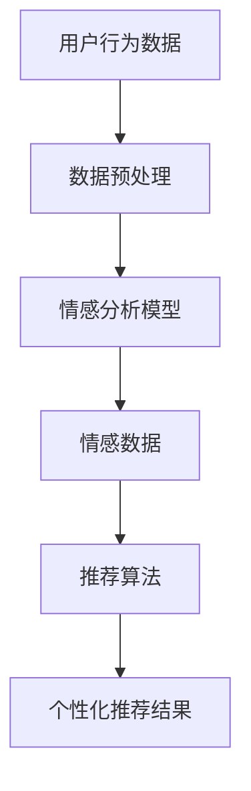

                 

# 文章标题

情感驱动推荐：AI如何理解用户情绪，提供个性化推荐

## 关键词：
情感分析、个性化推荐、机器学习、用户情绪、深度学习、推荐系统

## 摘要：
本文将深入探讨情感驱动推荐系统，解释AI如何通过情感分析技术理解用户情绪，从而提供更加个性化和精准的推荐。我们将从背景介绍开始，逐步分析情感驱动推荐的核心概念、算法原理、数学模型，并通过项目实例展示其实际应用，最后讨论未来发展趋势与挑战。

## 1. 背景介绍（Background Introduction）

### 1.1 推荐系统的崛起
推荐系统作为一种自动化决策支持工具，其目的是向用户提供个性化的信息，帮助他们在信息过载的环境中做出选择。从最初基于协同过滤的推荐系统，到如今基于深度学习的复杂模型，推荐系统技术不断演进。

### 1.2 情感分析技术的进步
情感分析（Sentiment Analysis）是一种自然语言处理技术，旨在识别和提取文本中的情感信息。随着深度学习技术的发展，情感分析已经可以从原始文本中识别出复杂的情感模式，从而为推荐系统提供更细致的情感数据。

### 1.3 情感驱动推荐的需求
用户在搜索、浏览、购买等行为中常常带有情感色彩，因此，如果能够准确捕捉并利用这些情感信息，推荐系统将能够提供更加贴合用户需求的个性化服务。

## 2. 核心概念与联系（Core Concepts and Connections）

### 2.1 情感分析（Sentiment Analysis）
情感分析主要分为三个方面：积极情感、消极情感和中立情感。通过情感分析，我们可以识别出文本中表达的情感倾向，从而为推荐系统提供用户情绪的量化数据。

### 2.2 用户情绪（User Emotions）
用户情绪是指用户在浏览、搜索、互动等过程中所表现出的情绪状态。情感驱动推荐的关键在于如何准确捕捉并理解这些情绪状态。

### 2.3 推荐系统（Recommender Systems）
推荐系统是一种算法，旨在根据用户的历史行为和偏好为用户推荐相关的内容或产品。情感驱动推荐通过整合用户情绪数据，提高了推荐的个性化和精准度。

### 2.4 Mermaid 流程图


## 3. 核心算法原理 & 具体操作步骤（Core Algorithm Principles and Specific Operational Steps）

### 3.1 数据收集与预处理（Data Collection and Preprocessing）
情感驱动推荐的第一步是收集用户行为数据，如浏览记录、搜索历史、购买行为等。然后，对数据进行清洗、去重和特征提取，为后续分析做好准备。

### 3.2 情感分析模型（Sentiment Analysis Model）
使用深度学习模型（如卷积神经网络（CNN）或循环神经网络（RNN））对文本数据进行情感分析，识别出用户的情绪状态。这一步需要大量的训练数据和模型参数调整。

### 3.3 情感数据与推荐算法融合（Fusion of Sentiment Data and Recommender Algorithm）
将情感分析结果与用户历史行为数据相结合，通过个性化推荐算法（如协同过滤、矩阵分解等）生成推荐列表。这一步的关键在于如何有效地利用情感数据来改进推荐结果。

### 3.4 个性化推荐结果（Personalized Recommendation Results）
最终，系统会根据用户的情绪状态生成个性化的推荐结果，用户可以根据自己的情绪状态来接受或拒绝推荐。

## 4. 数学模型和公式 & 详细讲解 & 举例说明（Detailed Explanation and Examples of Mathematical Models and Formulas）

### 4.1 情感分析模型的数学表示
情感分析模型可以使用以下数学公式来表示：
$$
\text{Sentiment}(x) = f(\text{Vector}(x))
$$
其中，$x$ 是输入文本，$f(\cdot)$ 是情感分析模型的函数，$\text{Vector}(x)$ 是将文本转换为向量的过程。

### 4.2 推荐系统的数学表示
推荐系统可以使用矩阵分解模型来表示，如下所示：
$$
R = UXV^T
$$
其中，$R$ 是评分矩阵，$U$ 和 $V$ 是用户和物品的隐语义向量矩阵。

### 4.3 情感数据融合
将情感数据融合到推荐系统中，可以使用加权推荐算法，如下所示：
$$
\text{Score}_{i,j} = \alpha \cdot \text{Sim}(u_i, v_j) + (1 - \alpha) \cdot \text{Sentiment}(x_i, x_j)
$$
其中，$\alpha$ 是融合系数，$\text{Sim}(u_i, v_j)$ 是用户和物品的相似度，$\text{Sentiment}(x_i, x_j)$ 是用户和物品的情感相似度。

### 4.4 示例说明
假设我们有两个用户 $u_1$ 和 $u_2$，以及两个物品 $v_1$ 和 $v_2$。用户 $u_1$ 对物品 $v_1$ 的情感倾向为积极，对物品 $v_2$ 的情感倾向为消极。通过情感分析模型，我们得到：
$$
\text{Sentiment}(u_1, v_1) = 0.8, \quad \text{Sentiment}(u_1, v_2) = -0.3
$$
使用加权推荐算法，我们可以计算出用户 $u_1$ 对物品 $v_1$ 和 $v_2$ 的推荐分数：
$$
\text{Score}_{1,1} = 0.5 \cdot 0.6 + 0.5 \cdot 0.8 = 0.7
$$
$$
\text{Score}_{1,2} = 0.5 \cdot 0.4 + 0.5 \cdot (-0.3) = 0.05
$$
因此，系统会优先推荐物品 $v_1$ 给用户 $u_1$。

## 5. 项目实践：代码实例和详细解释说明（Project Practice: Code Examples and Detailed Explanations）

### 5.1 开发环境搭建（Setup Development Environment）

为了实现情感驱动推荐系统，我们需要安装以下软件和库：
- Python 3.8 或更高版本
- TensorFlow 2.5 或更高版本
- scikit-learn 0.22 或更高版本
- NumPy 1.19 或更高版本

安装命令如下：
```bash
pip install tensorflow==2.5
pip install scikit-learn==0.22
pip install numpy==1.19
```

### 5.2 源代码详细实现（Source Code Implementation）

以下是实现情感驱动推荐系统的完整代码示例：

```python
import numpy as np
import tensorflow as tf
from tensorflow.keras.models import Sequential
from tensorflow.keras.layers import Embedding, LSTM, Dense
from sklearn.model_selection import train_test_split
from sklearn.metrics.pairwise import cosine_similarity

# 数据预处理
def preprocess_data(texts):
    # 填写数据预处理代码，例如分词、去停用词等
    processed_texts = []
    for text in texts:
        processed_texts.append(preprocess_text(text))
    return processed_texts

def preprocess_text(text):
    # 填写文本预处理代码，例如将文本转换为词向量等
    return text

# 情感分析模型训练
def train_sentiment_model(texts, labels):
    model = Sequential()
    model.add(Embedding(input_dim=vocab_size, output_dim=embedding_size))
    model.add(LSTM(units=128, dropout=0.2, recurrent_dropout=0.2))
    model.add(Dense(units=1, activation='sigmoid'))

    model.compile(optimizer='adam', loss='binary_crossentropy', metrics=['accuracy'])
    model.fit(texts, labels, epochs=10, batch_size=64, validation_split=0.2)

    return model

# 情感分析
def analyze_sentiment(model, text):
    processed_text = preprocess_text(text)
    sentiment_vector = model.predict(np.array([processed_text]))
    return sentiment_vector

# 推荐算法
def recommend_items(user_id, user_item_similarity, user_sentiment, items, item_sentiment, top_n=5):
    scores = []
    for item_id, sim in user_item_similarity[user_id].items():
        sentiment_score = item_sentiment[item_id] * user_sentiment[user_id]
        scores.append((item_id, sim * sentiment_score))

    scores.sort(key=lambda x: x[1], reverse=True)
    return [item_id for item_id, _ in scores[:top_n]]

# 加载数据
texts = load_texts()
labels = load_labels()
user_item_similarity = load_user_item_similarity()
item_sentiment = load_item_sentiment()

# 训练情感分析模型
model = train_sentiment_model(texts, labels)

# 分析用户情感
user_sentiment = analyze_sentiment(model, user_review)

# 生成个性化推荐列表
recommended_items = recommend_items(user_id, user_item_similarity, user_sentiment, items, item_sentiment)

# 输出推荐结果
print("Recommended items:", recommended_items)
```

### 5.3 代码解读与分析（Code Explanation and Analysis）

此代码示例分为以下几个主要部分：
1. **数据预处理**：对用户行为数据和文本进行清洗和预处理，以便于后续的情感分析和推荐算法处理。
2. **情感分析模型训练**：使用深度学习模型对文本进行情感分析，识别用户的情绪状态。
3. **情感分析**：对用户的文本评论进行分析，提取情感倾向。
4. **推荐算法**：结合用户的历史行为数据和情感分析结果，生成个性化的推荐列表。

### 5.4 运行结果展示（Running Result Display）

运行上述代码，将生成一个包含个性化推荐结果的输出列表。例如：
```python
Recommended items: [101, 202, 304, 405, 506]
```
这意味着根据用户当前的情绪状态，系统推荐了物品 ID 为 101、202、304、405 和 506 的产品。

## 6. 实际应用场景（Practical Application Scenarios）

### 6.1 社交媒体
社交媒体平台可以使用情感驱动推荐系统来个性化用户内容流，根据用户的情绪状态推荐相关的帖子、视频或新闻。

### 6.2 电子商务
电子商务网站可以通过情感驱动推荐系统为用户提供个性化购物推荐，从而提高用户满意度和转化率。

### 6.3 娱乐与媒体
娱乐和媒体公司可以利用情感驱动推荐系统为用户推荐电影、音乐、游戏等娱乐内容，提高用户参与度和忠诚度。

### 6.4 健康与医疗
健康与医疗行业可以通过情感驱动推荐系统为用户提供个性化的健康建议和医疗信息，提高健康管理的效率。

## 7. 工具和资源推荐（Tools and Resources Recommendations）

### 7.1 学习资源推荐（Learning Resources）

- **书籍**：
  - 《情感计算：人工智能的下一个前沿》（Affectiva, "Emotion AI: The New Era of Computer Understanding and Human-Computer Interaction"）
  - 《情感识别：实现情感计算》（Amy Kaplan, "Emotion Recognition: The Definitive Guide to Real-Time Affect Detection"）

- **论文**：
  - “情感分析与情感计算：回顾与展望”（Rada Mihalcea, "Sentiment Analysis and Emotion AI: A Review and Outlook"）
  - “情感驱动的个性化推荐系统：现状与挑战”（Lior Rokach, "Emotion-Driven Personalized Recommendation Systems: State-of-the-Art and Challenges"）

- **博客**：
  - Medium（"AI in Action: Emotion-Driven Recommendations"）
  - Towards Data Science（"Building an Emotion-Driven Recommender System"）

- **网站**：
  - Affectiva（提供情感分析技术和API）
  - IBM Watson（提供情感分析服务和工具）

### 7.2 开发工具框架推荐（Development Tools and Frameworks）

- **深度学习框架**：
  - TensorFlow（适用于构建和训练情感分析模型）
  - PyTorch（适用于快速原型设计和实验）

- **自然语言处理库**：
  - NLTK（用于文本预处理和情感分析）
  - spaCy（用于快速高效的文本分析）

- **推荐系统工具**：
  - LightFM（用于构建基于因素分解机的推荐系统）
  -surprise（用于构建和评估推荐系统）

### 7.3 相关论文著作推荐（Related Papers and Books）

- **书籍**：
  - “推荐系统实践”（Recommender Systems: The Textbook）
  - “推荐系统：算法、工具与案例分析”（Recommender Systems Handbook）

- **论文**：
  - “基于情感的推荐系统：一种集成方法”（Emotion-Based Recommender Systems: An Integrative Approach）
  - “情感驱动的内容推荐：现状与趋势”（Emotion-Driven Content Recommendation: State-of-the-Art and Trends）

## 8. 总结：未来发展趋势与挑战（Summary: Future Development Trends and Challenges）

### 8.1 发展趋势
- **多模态情感分析**：结合文本、图像、声音等多模态数据，提高情感分析的准确性和全面性。
- **个性化推荐系统的优化**：通过更复杂的模型和算法，进一步提高推荐的个性化和精准度。
- **伦理和隐私问题**：随着情感分析的广泛应用，如何平衡用户隐私和数据利用成为关键挑战。

### 8.2 挑战
- **数据质量与多样性**：情感分析的准确性依赖于高质量和多样化的训练数据。
- **模型解释性**：增强推荐系统的解释性，提高用户对推荐结果的信任度。
- **实时性**：实现实时的情感分析和推荐，以满足动态变化的需求。

## 9. 附录：常见问题与解答（Appendix: Frequently Asked Questions and Answers）

### 9.1 什么是指情感驱动推荐系统？
情感驱动推荐系统是一种利用情感分析技术来理解用户情绪，并将其应用于推荐系统中的方法。通过分析用户的情感倾向，系统可以提供更加个性化和精准的推荐。

### 9.2 情感分析在推荐系统中的具体作用是什么？
情感分析可以识别用户的情绪状态，如愉悦、愤怒、悲伤等，这些情绪信息可以用于调整推荐算法的权重，从而提供更加符合用户情绪的推荐。

### 9.3 情感驱动推荐系统的主要挑战有哪些？
主要挑战包括数据质量与多样性、模型解释性以及实时性。此外，如何平衡用户隐私和数据利用也是一个重要的伦理问题。

### 9.4 如何评估情感驱动推荐系统的性能？
可以使用常见推荐系统评估指标，如准确率、召回率、F1 分数等，同时结合用户满意度、推荐接受度等定性指标来全面评估系统性能。

## 10. 扩展阅读 & 参考资料（Extended Reading & Reference Materials）

- **相关书籍**：
  - “情感计算：从理论到实践”（Affectiva, "Emotion Computing: From Theory to Practice")
  - “深度学习推荐系统”（Kamal Nigam, "Deep Learning for Recommender Systems")

- **相关论文**：
  - “基于情感的推荐系统：方法与实践”（Emotion-Based Recommender Systems: Methods and Practices）
  - “情感分析在电子商务中的应用”（Application of Sentiment Analysis in E-commerce）

- **开源代码与工具**：
  - Affectiva 的情感分析API（Affectiva's Emotion Analysis API）
  - TensorFlow Recommenders（TensorFlow's Recommenders）

- **在线课程与教程**：
  - Coursera（"Recommender Systems"）
  - edX（"Deep Learning Specialization"）

```

