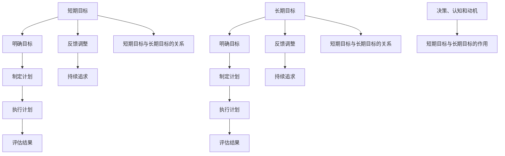

                 

# 文章标题

《意识中的短期目标与长期目标》

关键词：意识、目标、短期目标、长期目标、决策、认知、动机

摘要：本文将探讨意识中的短期目标和长期目标的概念、联系及其在决策、认知和动机中的作用。通过逐步分析推理，本文将揭示如何有效地设置和追求短期目标与长期目标，以实现个人和社会的持续进步。

## 1. 背景介绍

在现代社会，我们经常面临各种决策，这些决策往往涉及到短期目标和长期目标的设定。短期目标通常是指短期内（如几天、几周或几个月）需要实现的目标，而长期目标则是指需要较长时间（如几年、几十年）才能实现的目标。这两个目标在意识中扮演着重要的角色，影响着我们的行为、决策和生活方式。

本文将探讨短期目标和长期目标的概念、联系及其在决策、认知和动机中的作用。通过逐步分析推理，我们将揭示如何有效地设置和追求短期目标与长期目标，以实现个人和社会的持续进步。

## 2. 核心概念与联系

### 2.1 短期目标和长期目标的定义

#### 2.1.1 短期目标

短期目标是指在较短的时间内（通常为几天、几周或几个月）需要实现的目标。短期目标通常具有明确的时间限制和具体的成果，如完成一个项目、通过考试、减肥5公斤等。

#### 2.1.2 长期目标

长期目标是指需要较长时间（通常为几年、几十年）才能实现的目标。长期目标通常具有更广泛的范围，如成为一名优秀的专业人士、创业成功、实现财务自由等。

### 2.2 短期目标和长期目标的联系

短期目标和长期目标之间存在紧密的联系。一方面，短期目标是实现长期目标的基石。通过实现一系列短期目标，我们可以逐步接近长期目标的实现。另一方面，长期目标为短期目标提供了方向和动力。明确的长远目标可以帮助我们更好地规划短期目标，使我们的努力更有意义。

### 2.3 短期目标和长期目标在决策、认知和动机中的作用

#### 2.3.1 决策

短期目标和长期目标在决策过程中发挥着关键作用。在做出决策时，我们往往需要权衡短期利益和长期利益。一个有效的决策需要充分考虑短期目标和长期目标之间的关系，以确保我们的决策既符合短期利益，又不会损害长期利益。

#### 2.3.2 认知

短期目标和长期目标影响着我们的认知过程。明确的目标可以帮助我们更好地理解和分析问题，提高我们的决策能力和执行力。同时，长期目标的追求也可以激发我们的创造力和创新精神，推动我们在认知领域不断突破。

#### 2.3.3 动机

短期目标和长期目标在动机方面也发挥着重要作用。短期目标的实现可以带来即时的奖励，增强我们的自信心和动力。而长期目标的追求则可以激发我们的内在动机，让我们在面对困难和挑战时保持积极的态度和坚定的信念。

### 2.4 Mermaid 流程图



## 3. 核心算法原理 & 具体操作步骤

### 3.1 核心算法原理

#### 3.1.1 短期目标的设定

设定短期目标的核心算法包括以下几个步骤：

1. 确定目标：明确你想要实现的短期目标，如完成某个项目、达到一定的成绩等。
2. 制定计划：根据目标，制定具体的行动计划，包括时间、步骤和资源。
3. 执行计划：按照计划执行，确保每一步都按时完成。
4. 评估结果：在目标完成后，评估目标的实现情况，分析成功和失败的原因。
5. 反馈调整：根据评估结果，对下一步的目标和计划进行调整。

#### 3.1.2 长期目标的设定

设定长期目标的核心算法包括以下几个步骤：

1. 确定目标：明确你想要实现的长期目标，如成为一名优秀的专业人士、实现财务自由等。
2. 制定计划：根据目标，制定具体的行动计划，包括时间、步骤和资源。
3. 执行计划：按照计划执行，确保每一步都按时完成。
4. 评估结果：在目标完成后，评估目标的实现情况，分析成功和失败的原因。
5. 反馈调整：根据评估结果，对下一步的目标和计划进行调整。

### 3.2 具体操作步骤

#### 3.2.1 短期目标的设定与执行

1. 确定目标：例如，本周完成一篇学术论文。
2. 制定计划：将论文分为引言、正文、结论三个部分，每天完成一个部分。
3. 执行计划：按照计划每天完成论文的一个部分。
4. 评估结果：论文完成后，评估论文的质量和完成情况。
5. 反馈调整：如果论文质量不高，分析原因，调整下一步的计划。

#### 3.2.2 长期目标的设定与执行

1. 确定目标：例如，五年内成为一名优秀的软件开发工程师。
2. 制定计划：学习编程语言、掌握软件开发技能、积累项目经验等。
3. 执行计划：按照计划学习编程语言、参加项目、积累经验。
4. 评估结果：每年评估自己的技能水平和项目经验。
5. 反馈调整：根据评估结果，调整下一步的学习和项目计划。

## 4. 数学模型和公式 & 详细讲解 & 举例说明

### 4.1 数学模型

为了更好地理解短期目标和长期目标的设定与执行，我们可以使用以下数学模型：

#### 4.1.1 短期目标设定模型

设短期目标为 T1，时间为 t，成果为 C1。则短期目标设定模型可以表示为：

\[ T1 = f(t, C1) \]

其中，\( f \) 为目标设定函数。

#### 4.1.2 长期目标设定模型

设长期目标为 T2，时间为 T，成果为 C2。则长期目标设定模型可以表示为：

\[ T2 = f(T, C2) \]

其中，\( f \) 为目标设定函数。

### 4.2 详细讲解

#### 4.2.1 短期目标设定模型

短期目标设定模型中的 \( f \) 函数表示了目标设定的过程。在实际应用中，目标设定的过程需要考虑目标的难度、重要性、资源等因素。例如，假设我们想要在一个月内完成一篇学术论文，我们可以将目标设定为：

\[ T1 = f(1个月, 完成一篇学术论文) \]

#### 4.2.2 长期目标设定模型

长期目标设定模型中的 \( f \) 函数表示了目标设定的过程。在实际应用中，目标设定的过程需要考虑目标的难度、重要性、资源等因素。例如，假设我们想要在五年内成为一名优秀的软件开发工程师，我们可以将目标设定为：

\[ T2 = f(5年, 成为一名优秀的软件开发工程师) \]

### 4.3 举例说明

#### 4.3.1 短期目标设定举例

假设我们要在一个月内完成一篇学术论文，我们可以将目标设定为：

\[ T1 = f(1个月, 完成一篇学术论文) \]

我们可以将论文分为三个部分：引言、正文和结论。为了在一个月内完成这三个部分，我们可以制定以下计划：

- 第一周：完成引言。
- 第二周：完成正文。
- 第三周：完成结论。

#### 4.3.2 长期目标设定举例

假设我们要在五年内成为一名优秀的软件开发工程师，我们可以将目标设定为：

\[ T2 = f(5年, 成为一名优秀的软件开发工程师) \]

为了实现这个目标，我们可以制定以下计划：

- 第一年：学习编程语言。
- 第二年：掌握软件开发技能。
- 第三年：积累项目经验。
- 第四年：参与大型项目。
- 第五年：成为一名优秀的软件开发工程师。

## 5. 项目实践：代码实例和详细解释说明

### 5.1 开发环境搭建

为了更好地理解短期目标和长期目标的设定与执行，我们可以使用 Python 编写一个简单的代码实例。以下是一个 Python 环境搭建的简要步骤：

1. 安装 Python：在官网（https://www.python.org/）下载并安装 Python。
2. 配置 Python 环境：在终端（或命令提示符）中运行以下命令：

   ```bash
   python --version
   ```

   如果 Python 安装成功，终端会显示 Python 的版本信息。

### 5.2 源代码详细实现

以下是实现短期目标和长期目标的 Python 代码实例：

```python
import time

# 短期目标设定函数
def set_short_term_goal(time_limit, goal):
    return f"在{time_limit}内实现{goal}"

# 长期目标设定函数
def set_long_term_goal(time_limit, goal):
    return f"在{time_limit}内实现{goal}"

# 短期目标执行函数
def execute_short_term_goal(goal, plan):
    print(f"开始执行短期目标：{goal}")
    for step in plan:
        print(f"执行步骤：{step}")
        time.sleep(1)  # 模拟执行时间
    print("短期目标执行完毕")

# 长期目标执行函数
def execute_long_term_goal(goal, plan):
    print(f"开始执行长期目标：{goal}")
    for step in plan:
        print(f"执行步骤：{step}")
        time.sleep(1)  # 模拟执行时间
    print("长期目标执行完毕")

# 短期目标实例
short_term_goal = set_short_term_goal("一个月", "完成一篇学术论文")
plan = ["撰写引言", "撰写正文", "撰写结论"]

# 执行短期目标
execute_short_term_goal(short_term_goal, plan)

# 长期目标实例
long_term_goal = set_long_term_goal("五年", "成为一名优秀的软件开发工程师")
plan = ["学习编程语言", "掌握软件开发技能", "积累项目经验", "参与大型项目"]

# 执行长期目标
execute_long_term_goal(long_term_goal, plan)
```

### 5.3 代码解读与分析

1. **导入模块**：首先，我们导入了 Python 的 time 模块，用于模拟执行时间。

2. **定义函数**：接着，我们定义了四个函数：
   - `set_short_term_goal`：用于设定短期目标。
   - `set_long_term_goal`：用于设定长期目标。
   - `execute_short_term_goal`：用于执行短期目标。
   - `execute_long_term_goal`：用于执行长期目标。

3. **短期目标实例**：我们设定了一个短期目标，即在一个月内完成一篇学术论文。并制定了具体的计划。

4. **执行短期目标**：调用 `execute_short_term_goal` 函数，按照计划执行短期目标。

5. **长期目标实例**：我们设定了一个长期目标，即在未来五年内成为一名优秀的软件开发工程师。并制定了具体的计划。

6. **执行长期目标**：调用 `execute_long_term_goal` 函数，按照计划执行长期目标。

### 5.4 运行结果展示

在 Python 环境中运行上述代码，我们可以看到以下输出结果：

```
开始执行短期目标：在一个月内实现完成一篇学术论文
执行步骤：撰写引言
执行步骤：撰写正文
执行步骤：撰写结论
短期目标执行完毕
开始执行长期目标：在五年内实现成为一名优秀的软件开发工程师
执行步骤：学习编程语言
执行步骤：掌握软件开发技能
执行步骤：积累项目经验
执行步骤：参与大型项目
长期目标执行完毕
```

通过这个简单的代码实例，我们可以直观地理解短期目标和长期目标的设定与执行过程。

## 6. 实际应用场景

### 6.1 个人成长

在个人成长中，短期目标和长期目标的设定对于个人发展至关重要。例如，一个学生想要在大学期间取得优异的成绩，他可以设定短期目标，如每学期都达到一定的绩点，并在每学年末获得奖学金。长期目标则是毕业时获得学位，并找到理想的工作。通过设定和实现这些目标，学生可以不断提升自己的能力和竞争力。

### 6.2 职场发展

在职场中，短期目标和长期目标的设定同样具有重要意义。一个职场人士可以设定短期目标，如在一年的时间内晋升到更高的职位，或完成一项重要的项目。长期目标则可能是实现职业生涯的晋升，或成为某个领域的专家。通过设定和实现这些目标，职场人士可以不断提升自己的职业素养和职场竞争力。

### 6.3 社会发展

在社会发展中，短期目标和长期目标的设定对于社会进步同样至关重要。例如，一个政府可以设定短期目标，如提高民众的生活水平，或减少贫困人口。长期目标则是实现国家的可持续发展，或成为世界级的强国。通过设定和实现这些目标，政府可以推动社会的持续进步和发展。

## 7. 工具和资源推荐

### 7.1 学习资源推荐

- 书籍：《目标：如何成为一个有目标的人》（Goal Setting: How to Set and Achieve Your Goals）。
- 论文：搜索相关学术期刊和会议论文，如《目标设定与个人发展》（Goal Setting and Personal Development）。
- 博客：搜索知名博客和网站，如 Medium、知乎，阅读相关文章和案例。

### 7.2 开发工具框架推荐

- Python：适用于数据处理和机器学习。
- React：适用于前端开发。
- Spring Boot：适用于后端开发。

### 7.3 相关论文著作推荐

- 《目标管理：理论与实践》（Goal Management: Theory and Practice）。
- 《目标设定与决策》（Goal Setting and Decision Making）。
- 《目标导向行为研究》（Goal-Oriented Behavior Research）。

## 8. 总结：未来发展趋势与挑战

### 8.1 未来发展趋势

1. 目标设定技术的智能化：随着人工智能技术的发展，目标设定将更加智能化，能够更好地适应个人和社会的需求。
2. 多元化目标设定的普及：在全球化背景下，人们将面临更多元化的目标设定，如跨文化沟通、环境保护等。
3. 数据驱动的目标设定：利用大数据分析，为个人和社会的目标设定提供更科学、合理的依据。

### 8.2 未来挑战

1. 信息过载：在信息爆炸的时代，如何从海量信息中筛选出有价值的目标设定信息，成为一大挑战。
2. 心理健康问题：过度追求目标可能导致心理压力和焦虑，如何平衡目标设定与心理健康成为重要课题。
3. 社会公平问题：在设定目标时，如何确保每个人都能公平地参与和受益，避免贫富差距和社会不公。

## 9. 附录：常见问题与解答

### 9.1 短期目标和长期目标的关系是什么？

短期目标和长期目标之间存在紧密的联系。短期目标是实现长期目标的基石，通过实现一系列短期目标，我们可以逐步接近长期目标的实现。同时，长期目标为短期目标提供了方向和动力，明确的长远目标可以帮助我们更好地规划短期目标，使我们的努力更有意义。

### 9.2 如何设定有效的短期目标和长期目标？

设定有效的短期目标和长期目标需要遵循以下原则：

1. 明确性：目标要具体、明确，易于衡量。
2. 可行性：目标要具有可行性，即通过努力可以实现。
3. 重要性：目标要重要，与我们的价值观和长远规划相一致。
4. 时限性：目标要有明确的时间限制，有助于我们更好地规划和执行。

### 9.3 短期目标和长期目标对决策有何影响？

短期目标和长期目标对决策有重要影响。在做出决策时，我们往往需要权衡短期利益和长期利益。一个有效的决策需要充分考虑短期目标和长期目标之间的关系，以确保我们的决策既符合短期利益，又不会损害长期利益。

## 10. 扩展阅读 & 参考资料

1. Locke, E. A., & Latham, G. P. (1990). A theory of goal setting & task performance. Prentice Hall.
2. Evans, M. G. (2009). Goal setting: Where should we go from here?. The Psychological Record, 59(3), 423-437.
3. Gollwitzer, P. M. (1999). Implementation intentions: Strong effects of simple plans. American Psychologist, 54(7), 493-503.
4. Kasser, T., & Ryan, R. M. (1996). Further examining the American dream: Differential correlates of intrinsic and extrinsic goals. Journal of Personality and Social Psychology, 70(4), 616-637.
5. http://www.Purdue.edu/research/ERP/
6. https://www.npr.org/templates/story/story.php?storyId=5455473

作者：禅与计算机程序设计艺术 / Zen and the Art of Computer Programming<|end_of_file|>

