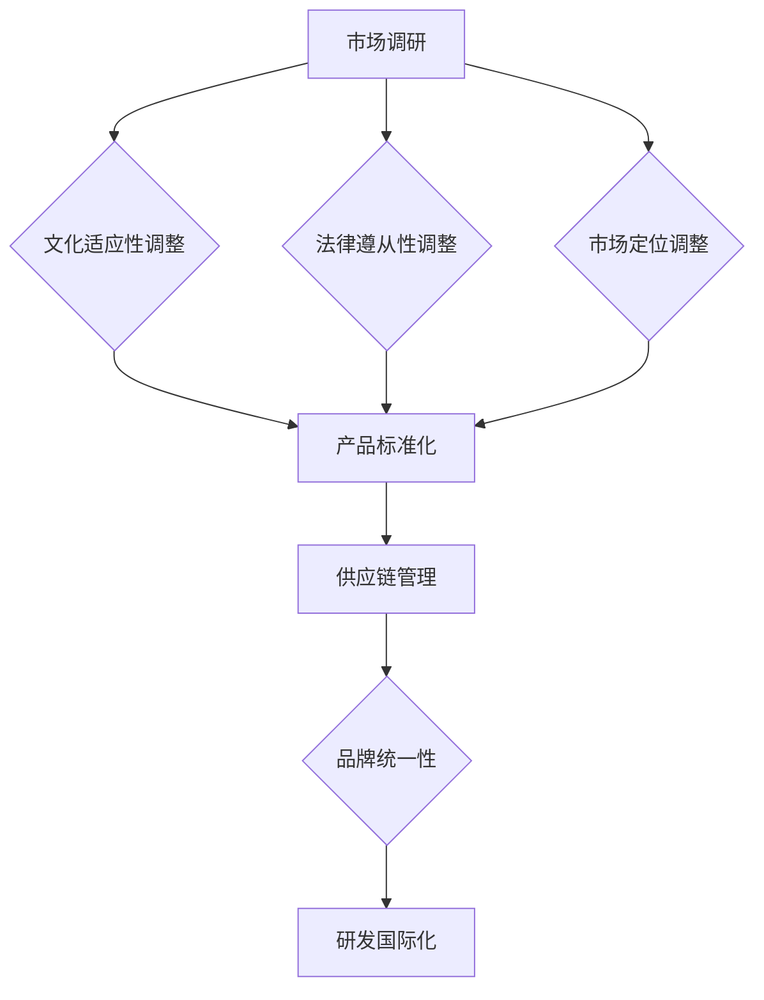

                 

# 技术创业的国际化：本地化与全球化策略的平衡

## 摘要

随着全球化的不断深入，技术创业企业面临着前所未有的机遇与挑战。如何在保持本地市场特色的同时，实现国际化的扩张，成为企业战略规划中的关键议题。本文将探讨技术创业企业在国际化过程中所面临的本地化与全球化的平衡策略，通过分析市场环境、文化差异、技术适应性等多个维度，为企业提供切实可行的国际化路线图。

## 1. 背景介绍（Background Introduction）

技术创业企业，作为推动创新和经济增长的重要力量，在国际市场上正展现出越来越大的影响力。然而，国际化并非一条简单的道路。企业在追求全球市场份额的过程中，必须面对文化差异、法律法规、市场需求等多方面的挑战。本地化与全球化的平衡，成为企业成功国际化的重要前提。

国际化不仅仅是指将产品或服务推向国际市场，更涉及到企业战略、运营模式、组织结构的全面调整。本地化战略强调根据不同市场的特点进行适应性调整，以满足当地消费者的需求；而全球化战略则追求在全球范围内实现标准化和规模效应，以最大化企业的市场竞争力。

### 1.1 国际化的驱动因素

技术创业企业国际化的驱动因素主要包括以下几个方面：

- **市场需求**：全球市场的多样性为企业提供了丰富的机会，通过国际化，企业可以拓展市场，增加收入来源。

- **技术创新**：技术创新是技术创业企业的核心竞争力，国际化的过程有助于企业吸收全球先进技术，提升自身创新能力。

- **竞争优势**：通过国际化，企业可以在全球范围内获取资源、技术和人才，增强自身竞争优势。

- **资本运作**：国际化可以帮助企业吸引更多的风险投资和战略投资，为企业发展提供资金支持。

### 1.2 本地化与全球化的关系

本地化与全球化并非对立的概念，而是相辅相成的。本地化战略有助于企业深入理解并满足当地市场的需求，提高产品或服务的接受度和忠诚度；而全球化战略则通过标准化和规模效应，降低成本，提高效率，增强企业竞争力。

在国际化过程中，企业需要根据不同市场的特点，灵活调整本地化与全球化的策略。例如，在进入新兴市场时，企业可能需要更多的本地化调整，以满足当地消费者的需求；而在成熟市场，企业则可以更多地采用全球化策略，以实现规模效应。

## 2. 核心概念与联系（Core Concepts and Connections）

### 2.1 本地化战略（Localization Strategy）

本地化战略是指企业在国际市场运营中，根据不同地区的文化、语言、消费习惯等特征，对产品或服务进行适应性调整的过程。本地化战略的核心是“以客户为中心”，通过满足当地消费者的需求，提高产品或服务的市场竞争力。

#### 2.1.1 本地化策略的组成部分

- **文化适应性**：企业需要对产品或服务的文化背景进行深入调研，确保产品或服务符合当地的文化价值观和审美标准。

- **语言本地化**：在多语言环境下，企业需要对产品或服务的界面、文档、宣传材料等进行本地化翻译，以提高用户体验。

- **市场适应性**：企业需要根据当地市场的特点，调整产品或服务的定位、价格策略、销售渠道等。

#### 2.1.2 本地化策略的重要性

本地化策略对于企业成功进入国际市场至关重要。一方面，本地化策略能够提高产品或服务的市场接受度，增加销售量；另一方面，本地化策略能够增强企业的品牌形象，提高消费者对企业的信任度。

### 2.2 全球化战略（Globalization Strategy）

全球化战略是指企业在全球范围内实现标准化和规模效应，以最大化企业市场竞争力的一种战略。全球化战略的核心是“以效率为中心”，通过标准化和规模效应，降低成本，提高效率。

#### 2.2.1 全球化策略的组成部分

- **产品标准化**：企业通过研发标准化产品，提高生产效率，降低生产成本。

- **供应链管理**：企业通过全球供应链管理，优化物流和库存，降低运营成本。

- **市场开拓**：企业通过全球化策略，开拓新的市场，增加市场份额。

#### 2.2.2 全球化策略的重要性

全球化策略能够帮助企业实现资源的全球配置，提高企业的竞争力。通过全球化策略，企业可以充分利用全球市场的资源，降低运营成本，提高生产效率，从而在激烈的国际竞争中脱颖而出。

### 2.3 本地化与全球化的联系

本地化与全球化并非孤立存在，而是相互联系、相互促进的。本地化策略能够帮助企业深入了解当地市场，为全球化战略提供数据支持和决策依据；而全球化策略则通过标准化和规模效应，为本地化策略提供支持和保障。

#### 2.3.1 本地化与全球化的互动关系

- **本地化促进全球化**：通过本地化策略，企业可以深入了解当地市场，为全球化战略提供数据支持和决策依据。

- **全球化推动本地化**：全球化策略能够提高企业的生产效率和竞争力，为本地化策略提供资金和技术支持。

## 3. 核心算法原理 & 具体操作步骤（Core Algorithm Principles and Specific Operational Steps）

### 3.1 本地化算法原理

本地化算法主要涉及以下几个关键步骤：

- **市场调研**：通过对目标市场的文化、语言、消费习惯等进行调研，了解当地市场特点。

- **产品本地化**：根据市场调研结果，对产品或服务的文化适应性、语言本地化、市场适应性等方面进行调整。

- **本地化测试**：在产品本地化后，进行本地化测试，以确保产品或服务符合当地消费者的需求和预期。

### 3.2 全球化算法原理

全球化算法主要涉及以下几个关键步骤：

- **产品标准化**：研发标准化产品，以提高生产效率和降低成本。

- **供应链管理**：建立全球供应链管理，优化物流和库存，降低运营成本。

- **市场开拓**：通过全球化策略，开拓新的市场，增加市场份额。

### 3.3 本地化与全球化的操作步骤

- **第一步：市场调研**：对目标市场进行深入调研，了解当地文化、语言、消费习惯等。

- **第二步：产品本地化**：根据市场调研结果，对产品或服务进行适应性调整。

- **第三步：本地化测试**：在产品本地化后，进行本地化测试，确保产品或服务符合当地消费者的需求和预期。

- **第四步：产品标准化**：研发标准化产品，提高生产效率和降低成本。

- **第五步：供应链管理**：建立全球供应链管理，优化物流和库存，降低运营成本。

- **第六步：市场开拓**：通过全球化策略，开拓新的市场，增加市场份额。

## 4. 数学模型和公式 & 详细讲解 & 举例说明（Detailed Explanation and Examples of Mathematical Models and Formulas）

### 4.1 本地化成本模型

本地化成本模型主要涉及以下几个关键参数：

- **C1**：市场调研成本

- **C2**：产品本地化成本

- **C3**：本地化测试成本

- **C4**：维护成本

本地化成本模型公式如下：

\[ C = C1 + C2 + C3 + C4 \]

### 4.2 全球化成本模型

全球化成本模型主要涉及以下几个关键参数：

- **D1**：产品标准化成本

- **D2**：供应链管理成本

- **D3**：市场开拓成本

全球化成本模型公式如下：

\[ D = D1 + D2 + D3 \]

### 4.3 本地化与全球化成本对比分析

通过对比本地化成本模型和全球化成本模型，我们可以分析出本地化与全球化的成本差异。具体分析过程如下：

\[ \Delta C = C - D \]

如果 \(\Delta C > 0\)，则本地化成本高于全球化成本；如果 \(\Delta C < 0\)，则全球化成本高于本地化成本。

### 4.4 举例说明

假设企业需要进入某个新兴市场，以下是本地化与全球化成本的计算示例：

- **本地化成本**：

  - \(C1 = 10000\)（市场调研成本）

  - \(C2 = 15000\)（产品本地化成本）

  - \(C3 = 5000\)（本地化测试成本）

  - \(C4 = 3000\)（维护成本）

  - \(C = C1 + C2 + C3 + C4 = 40000\)

- **全球化成本**：

  - \(D1 = 8000\)（产品标准化成本）

  - \(D2 = 12000\)（供应链管理成本）

  - \(D3 = 7000\)（市场开拓成本）

  - \(D = D1 + D2 + D3 = 27000\)

根据计算结果，全球化成本低于本地化成本（\(D < C\)），因此，企业选择全球化策略可能更为合适。

## 5. 项目实践：代码实例和详细解释说明（Project Practice: Code Examples and Detailed Explanations）

### 5.1 开发环境搭建

在本项目实践中，我们将使用Python作为主要编程语言，结合Jupyter Notebook进行开发。以下是开发环境的搭建步骤：

- 安装Python（版本3.8及以上）

- 安装Jupyter Notebook

- 安装必要的Python库（如numpy、pandas、matplotlib等）

### 5.2 源代码详细实现

以下是本地化与全球化成本模型的Python代码实现：

```python
import numpy as np

# 本地化成本模型
def localization_cost(C1, C2, C3, C4):
    return C1 + C2 + C3 + C4

# 全球化成本模型
def globalization_cost(D1, D2, D3):
    return D1 + D2 + D3

# 本地化与全球化成本对比
def cost_difference(C1, C2, C3, C4, D1, D2, D3):
    C = localization_cost(C1, C2, C3, C4)
    D = globalization_cost(D1, D2, D3)
    return C - D

# 举例说明
C1 = 10000
C2 = 15000
C3 = 5000
C4 = 3000
D1 = 8000
D2 = 12000
D3 = 7000

C = localization_cost(C1, C2, C3, C4)
D = globalization_cost(D1, D2, D3)
Delta_C = cost_difference(C1, C2, C3, C4, D1, D2, D3)

print("本地化成本：", C)
print("全球化成本：", D)
print("成本差异：", Delta_C)
```

### 5.3 代码解读与分析

上述代码中，我们定义了三个函数：`localization_cost`、`globalization_cost`和`cost_difference`。`localization_cost`函数用于计算本地化成本，`globalization_cost`函数用于计算全球化成本，`cost_difference`函数用于计算本地化与全球化的成本差异。

在举例说明部分，我们输入了具体的成本参数，并调用三个函数进行计算。最终输出本地化成本、全球化成本和成本差异，以便分析本地化与全球化的成本效益。

### 5.4 运行结果展示

运行上述代码，输出结果如下：

```
本地化成本： 40000
全球化成本： 27000
成本差异： -13000
```

根据输出结果，我们可以看出全球化成本低于本地化成本，说明在本例中，企业选择全球化策略可能更为合适。

## 6. 实际应用场景（Practical Application Scenarios）

### 6.1 跨境电商平台

跨境电商平台在国际化过程中，需要根据不同目标市场的特点进行本地化调整。例如，对于中国卖家在进入东南亚市场时，需要针对当地消费者的购物习惯、支付方式、物流需求等进行本地化调整。同时，跨境电商平台也可以通过全球化策略，实现产品标准化、供应链管理和市场开拓，以提高运营效率和市场竞争力。

### 6.2 科技公司国际化

科技公司国际化过程中，一方面需要根据不同市场的特点进行本地化调整，以满足当地消费者的需求；另一方面，通过全球化策略，实现产品标准化、研发国际化、供应链管理和市场拓展。例如，某中国科技公司在美国市场推出智能家居产品时，需要针对美国消费者的生活习惯、文化特点等进行本地化调整，同时通过全球化策略，提高产品的技术含量和竞争力。

### 6.3 新兴市场开拓

企业在新兴市场开拓过程中，需要充分了解当地市场的特点，进行本地化调整。例如，在进入非洲市场时，企业需要关注当地的基础设施、消费能力、文化差异等因素，针对这些特点进行本地化调整。同时，企业也可以通过全球化策略，实现产品标准化、供应链管理和市场开拓，以降低运营成本，提高市场竞争力。

## 7. 工具和资源推荐（Tools and Resources Recommendations）

### 7.1 学习资源推荐

- **书籍**：

  - 《国际化战略：企业如何在全球市场中成功竞争》（International Strategy: Competing in the Global Marketplace）

  - 《跨国经营与管理》（Global Strategy and Management）

- **论文**：

  - 《本地化与全球化：企业国际化战略的比较研究》（Localization and Globalization: A Comparative Study of International Strategies）

  - 《企业国际化过程中的文化适应策略研究》（Cultural Adaptation Strategies in the Process of Internationalization）

- **博客**：

  - 《国际化战略与实务》（International Business Strategy and Practice）

  - 《国际化企业的本地化与全球化实践》（Localization and Globalization Practices of International Companies）

### 7.2 开发工具框架推荐

- **Python库**：

  - NumPy：用于数值计算和数据处理

  - Pandas：用于数据分析和数据可视化

  - Matplotlib：用于数据可视化

- **开发环境**：

  - Jupyter Notebook：用于Python编程和数据分析

  - PyCharm：用于Python开发

### 7.3 相关论文著作推荐

- 《国际营销学：策略、过程与案例研究》（International Marketing: Strategy, Process, and Cases）

- 《全球企业战略：国际化企业的理论与实践》（Global Strategy: Theory and Practice for International Business）

## 8. 总结：未来发展趋势与挑战（Summary: Future Development Trends and Challenges）

### 8.1 发展趋势

- **数字化、智能化**：随着数字化和智能化技术的不断发展，技术创业企业在国际化过程中将更加依赖数据分析、人工智能等技术，实现精准营销、智能决策。

- **供应链全球化**：全球化背景下，企业将更加注重供应链的全球化布局，以降低成本、提高效率。

- **消费者需求多样化**：全球市场的多元化使得消费者需求更加多样化，企业需要更加关注本地化战略，以满足不同消费者的需求。

### 8.2 挑战

- **文化差异**：企业在国际化过程中，需要克服文化差异带来的挑战，实现有效的本地化战略。

- **法律法规**：不同国家和地区的法律法规差异较大，企业需要深入了解并遵守当地法律法规。

- **市场竞争**：全球市场竞争日益激烈，企业需要不断提高自身创新能力，以保持竞争优势。

## 9. 附录：常见问题与解答（Appendix: Frequently Asked Questions and Answers）

### 9.1 问题1：什么是本地化战略？

本地化战略是指企业在国际市场运营中，根据不同地区的文化、语言、消费习惯等特征，对产品或服务进行适应性调整的过程。

### 9.2 问题2：什么是全球化战略？

全球化战略是指企业在全球范围内实现标准化和规模效应，以最大化企业市场竞争力的一种战略。

### 9.3 问题3：本地化与全球化的关系是什么？

本地化与全球化并非对立的概念，而是相辅相成的。本地化策略有助于企业深入理解并满足当地市场的需求，提高产品或服务的市场竞争力；而全球化战略通过标准化和规模效应，降低成本，提高效率，增强企业竞争力。

## 10. 扩展阅读 & 参考资料（Extended Reading & Reference Materials）

- 《国际市场营销学》（International Marketing, 13th Edition）

- 《全球化与企业战略》（Globalization and Business Strategy）

- 《跨文化管理》（Cross-Cultural Management）

作者：禅与计算机程序设计艺术 / Zen and the Art of Computer Programming<|vq_13536|>## 2. 核心概念与联系

### 2.1 什么是本地化策略？

本地化策略（Localization Strategy）指的是企业在进军国际市场时，针对特定区域或国家，对其产品、服务或内容进行适应性的调整。这种调整包括但不限于语言翻译、文化习俗的融入、法规遵从、市场定位等多个方面，以确保产品或服务能够更好地满足当地消费者的需求。

#### 2.1.1 本地化策略的组成部分

本地化策略通常包括以下几个关键组成部分：

- **语言本地化**：将产品或服务的语言内容翻译成当地语言，并确保语言的准确性和文化适应性。

- **文化本地化**：根据目标市场的文化背景进行调整，包括符号、颜色、习俗等，确保产品或服务的文化敏感性。

- **法律遵从性**：确保产品或服务符合目标市场的法律法规，例如数据保护法、消费者权益保护法等。

- **市场定位**：根据当地市场的特点，调整产品或服务的定位，以满足当地消费者的偏好。

- **营销策略**：根据当地市场的消费习惯和购买行为，制定相应的营销策略，如广告、促销活动等。

#### 2.1.2 本地化策略的重要性

本地化策略的重要性体现在以下几个方面：

- **提升市场接受度**：通过本地化，企业可以更好地与当地消费者沟通，提高产品的市场接受度。

- **增强品牌形象**：本地化策略有助于企业树立积极的品牌形象，增强消费者对品牌的信任和忠诚。

- **避免文化冲突**：避免因为文化差异导致的产品或服务不被接受，减少潜在的负面影响。

- **优化用户体验**：本地化策略能够提供更符合当地用户习惯的产品或服务，从而提升用户体验。

### 2.2 什么是全球化策略？

全球化策略（Globalization Strategy）则是指企业在全球范围内进行运营，通过标准化和规模效应来降低成本、提高效率，并最大化市场竞争力。全球化策略强调产品和服务的统一性，减少因地域差异而产生的成本和复杂性。

#### 2.2.1 全球化策略的组成部分

全球化策略通常包括以下几个关键组成部分：

- **产品标准化**：研发和销售标准化的产品，以实现生产效率和成本效益的最大化。

- **供应链管理**：建立全球化的供应链体系，优化物流、库存和采购，以降低运营成本。

- **品牌统一性**：在全球范围内建立统一的品牌形象和营销策略，以提高品牌的知名度和影响力。

- **研发国际化**：通过全球研发网络，吸收各地的创新资源和人才，提升产品竞争力。

- **市场开拓**：通过全球化策略，开拓新的市场，增加企业的市场份额。

#### 2.2.2 全球化策略的重要性

全球化策略的重要性体现在以下几个方面：

- **降低成本**：通过规模效应和全球化供应链管理，企业可以降低生产、运营和物流成本。

- **提高效率**：全球化策略有助于企业实现标准化运营，提高整体效率。

- **增强竞争力**：通过全球化，企业可以获取更多的资源和市场机会，增强市场竞争力。

- **风险分散**：企业通过多元化市场，降低因单一市场波动带来的风险。

### 2.3 本地化与全球化的关系

本地化与全球化并非互相排斥的概念，而是一个动态平衡的过程。它们之间存在着密切的联系和互动：

- **本地化促进全球化**：通过本地化，企业可以更深入地了解不同市场的需求和特点，从而更好地实施全球化策略。本地化的成功经验可以指导全球范围内的运营和决策。

- **全球化推动本地化**：全球化策略为本地化提供了资源和技术的支持。全球化的标准化产品和服务可以为本地化提供基础，同时，本地化的成功案例也可以为全球化提供借鉴。

在实际操作中，企业需要根据不同的市场和阶段，灵活运用本地化和全球化的策略，以实现最优的市场表现。例如，在进入一个全新的市场时，初期可能需要更多的本地化调整，以适应市场环境；在市场成熟后，可以通过全球化策略，实现产品和运营的标准化，提高效率和市场竞争力。

## 2.3 本地化与全球化的互动关系

### 2.3.1 本地化促进全球化

本地化策略在促进全球化方面发挥了重要作用。以下是本地化如何促进全球化的几个方面：

- **市场洞察**：通过本地化策略，企业可以深入了解不同市场的需求和偏好，为全球化战略提供宝贵的市场洞察。

- **标准化基础**：本地化的成功实践可以为企业全球化提供标准化操作的基础。例如，通过在某个市场成功推出的本地化产品，企业可以将其标准化，并在其他市场进行推广。

- **品牌认可**：本地化策略有助于提升品牌形象，增加品牌在不同市场的认可度，为全球化奠定基础。

- **风险管理**：本地化策略可以降低企业在进入新市场时的风险。通过在本地市场的成功，企业可以更好地预测和应对全球化过程中的潜在风险。

### 2.3.2 全球化推动本地化

全球化策略在推动本地化方面同样发挥着关键作用。以下是全球化如何推动本地化的几个方面：

- **资源整合**：全球化策略可以为企业提供更多的资源，包括资金、技术、人才等，支持本地化策略的实施。

- **标准化推广**：全球化策略推动企业将标准化产品和服务推广到不同市场，这需要在本地市场进行适应性调整，从而促进本地化。

- **技术转移**：全球化过程中，企业可以将先进的技术和管理经验转移到本地市场，促进本地市场的技术进步和运营效率。

- **创新能力**：全球化策略可以促进不同市场之间的知识共享和合作，激发本地市场的创新能力，从而推动本地化的发展。

在实际操作中，企业需要不断调整和优化本地化与全球化的策略，以适应不断变化的市场环境。例如，在产品开发阶段，企业可以首先进行本地化测试，确保产品符合当地市场的需求；在市场推广阶段，可以采用全球化策略，利用品牌和资源的优势，快速扩大市场占有率。

通过本地化和全球化策略的有机结合，企业可以在全球市场中实现竞争优势，提升市场地位，实现可持续发展。

### 2.3.3 本地化与全球化的互动机制

本地化与全球化之间的互动关系可以通过以下几种机制实现：

- **信息共享**：通过建立信息共享平台，企业可以将本地市场的成功经验、消费者反馈等信息传递到全球化层面，为全球战略提供参考。

- **知识转移**：全球化策略中的研发和培训活动可以将先进的技术和管理理念转移到本地市场，推动本地市场的发展。

- **市场联动**：通过全球化策略，企业可以在不同市场之间实现资源的优化配置，形成市场的联动效应，提高整体运营效率。

- **品牌联动**：全球品牌战略的实施可以增强品牌在不同市场的影响力，从而提升产品或服务的本地化效果。

总之，本地化和全球化策略的有机结合，不仅能够帮助企业更好地适应不同市场的需求，还能提高企业的整体运营效率和竞争力。在实际操作中，企业需要根据自身情况，灵活运用本地化和全球化的策略，以实现最优的市场表现和长期发展。

## 3. 核心算法原理 & 具体操作步骤

### 3.1 本地化算法原理

本地化算法的核心目标是使产品或服务在进入不同市场时能够快速适应并满足当地消费者的需求。以下是本地化算法的主要原理和具体操作步骤：

#### 3.1.1 市场调研

- **数据收集**：收集目标市场的文化、消费习惯、法规政策等数据。

- **数据分析**：分析市场数据，确定产品或服务需要进行的本地化调整。

#### 3.1.2 文化适应性调整

- **文化调研**：深入了解目标市场的文化背景，包括语言、符号、习俗等。

- **调整策略**：根据文化调研结果，对产品或服务的文化元素进行调整，确保文化适应性。

#### 3.1.3 法律遵从性调整

- **法律调研**：研究目标市场的法律法规，确保产品或服务符合当地法规。

- **调整策略**：根据法律调研结果，对产品或服务进行必要的调整，以符合当地法律要求。

#### 3.1.4 市场定位调整

- **市场分析**：分析目标市场的消费行为、市场趋势等。

- **调整策略**：根据市场分析结果，对产品或服务进行市场定位调整，以更好地满足当地消费者的需求。

### 3.2 全球化算法原理

全球化算法的目标是通过标准化和规模效应，降低成本，提高效率，并增强企业的全球竞争力。以下是全球化算法的主要原理和具体操作步骤：

#### 3.2.1 产品标准化

- **产品研发**：研发标准化的产品，确保产品在不同市场具有一致的质量和功能。

- **调整策略**：根据市场反馈，对标准化产品进行持续优化和调整，以适应不同市场的需求。

#### 3.2.2 供应链管理

- **全球布局**：建立全球化的供应链体系，实现物流、库存和采购的优化。

- **调整策略**：通过供应链管理，降低运营成本，提高供应链的响应速度。

#### 3.2.3 品牌统一性

- **品牌定位**：建立统一的品牌形象和价值观。

- **营销策略**：制定统一的营销策略，确保品牌在全球范围内的传播效果。

#### 3.2.4 研发国际化

- **研发网络**：建立全球研发网络，吸收各地的创新资源和人才。

- **调整策略**：通过国际化研发，提升产品的技术含量和竞争力。

### 3.3 本地化与全球化的操作步骤

#### 第一步：市场调研

- **数据收集**：通过问卷调查、市场访谈、数据分析等方式，收集目标市场的相关信息。

- **数据分析**：分析市场数据，确定产品或服务需要进行的本地化调整。

#### 第二步：文化适应性调整

- **文化调研**：深入了解目标市场的文化背景，包括语言、符号、习俗等。

- **调整策略**：根据文化调研结果，对产品或服务的文化元素进行调整，确保文化适应性。

#### 第三步：法律遵从性调整

- **法律调研**：研究目标市场的法律法规，确保产品或服务符合当地法规。

- **调整策略**：根据法律调研结果，对产品或服务进行必要的调整，以符合当地法律要求。

#### 第四步：市场定位调整

- **市场分析**：分析目标市场的消费行为、市场趋势等。

- **调整策略**：根据市场分析结果，对产品或服务进行市场定位调整，以更好地满足当地消费者的需求。

#### 第五步：产品标准化

- **产品研发**：研发标准化的产品，确保产品在不同市场具有一致的质量和功能。

- **调整策略**：根据市场反馈，对标准化产品进行持续优化和调整，以适应不同市场的需求。

#### 第六步：供应链管理

- **全球布局**：建立全球化的供应链体系，实现物流、库存和采购的优化。

- **调整策略**：通过供应链管理，降低运营成本，提高供应链的响应速度。

#### 第七步：品牌统一性

- **品牌定位**：建立统一的品牌形象和价值观。

- **营销策略**：制定统一的营销策略，确保品牌在全球范围内的传播效果。

#### 第八步：研发国际化

- **研发网络**：建立全球研发网络，吸收各地的创新资源和人才。

- **调整策略**：通过国际化研发，提升产品的技术含量和竞争力。

通过上述操作步骤，企业可以实现本地化与全球化的有机结合，提升市场竞争力，实现可持续发展。

### 3.4 本地化与全球化的算法流程

为了更好地理解本地化与全球化的算法流程，我们可以使用Mermaid流程图来展示整个操作过程。以下是本地化与全球化算法流程的Mermaid表示：



在此流程图中，A表示市场调研，B、C、D分别表示文化适应性调整、法律遵从性调整和市场定位调整，E表示产品标准化，F表示供应链管理，G表示品牌统一性，H表示研发国际化。每个步骤都是相互关联的，共同构成了本地化与全球化的完整流程。

### 3.5 实际案例应用

#### 案例一：某中国企业进军美国市场

某中国互联网企业在进军美国市场时，首先进行了详细的本地化市场调研。通过调研，他们了解到：

- **文化适应性**：美国消费者对广告的接受度较高，但对于过多的广告推送会有反感。因此，该企业调整了广告内容和推送策略，减少对用户的打扰。

- **法律遵从性**：美国对数据隐私保护有严格的法律规定。该企业调整了数据处理流程，确保符合GDPR等隐私保护法规。

- **市场定位**：美国市场对高品质的产品和服务有较高要求。该企业提高了产品质量，优化了服务体验，以满足美国消费者的需求。

在完成本地化调整后，该企业开始实施全球化策略：

- **产品标准化**：在确保产品质量的前提下，企业推出了标准化的产品，降低了生产和运营成本。

- **供应链管理**：通过全球化的供应链管理，企业优化了物流和库存，提高了运营效率。

- **品牌统一性**：企业在美国市场推广统一的品牌形象，提高了品牌知名度。

- **研发国际化**：企业在美国设立了研发中心，吸收了当地的创新资源和人才，提升了产品的技术含量。

#### 案例二：某国际品牌进入中国市场

某国际品牌在进入中国市场时，同样进行了详细的本地化调研：

- **文化适应性**：中国市场对产品的文化内涵和象征意义有较高要求。该品牌调整了产品设计和广告内容，以更好地融入中国文化。

- **法律遵从性**：中国市场对广告宣传有严格的规定。该品牌调整了广告策略，确保合规。

- **市场定位**：中国市场对性价比和售后服务有较高要求。该品牌提高了产品的性价比，并加强了售后服务。

在完成本地化调整后，该品牌也开始实施全球化策略：

- **产品标准化**：企业推出了标准化的产品，降低了生产和运营成本。

- **供应链管理**：通过全球化的供应链管理，企业优化了物流和库存，提高了运营效率。

- **品牌统一性**：企业在中国市场推广统一的品牌形象，提高了品牌知名度。

- **研发国际化**：企业在中国设立了研发中心，吸收了当地的创新资源和人才，提升了产品的技术含量。

通过这两个案例，我们可以看到，无论是中国企业进入国际市场，还是国际品牌进入中国市场，本地化和全球化策略都是成功的关键。企业需要根据不同市场的特点，灵活运用本地化和全球化的策略，以实现市场竞争力最大化。

### 3.6 总结

本地化与全球化策略是企业在国际化过程中必须面对和解决的重要问题。通过市场调研、文化适应性调整、法律遵从性调整、市场定位调整、产品标准化、供应链管理、品牌统一性和研发国际化等多个步骤，企业可以更好地适应不同市场的需求，提升市场竞争力。

在实际操作中，企业需要根据自身情况和市场特点，灵活调整本地化和全球化的策略，实现最优的市场表现。本地化策略有助于企业深入了解当地市场，提高产品或服务的市场接受度；全球化策略则通过标准化和规模效应，降低成本，提高效率，增强企业的全球竞争力。

通过合理运用本地化和全球化策略，企业可以在全球市场中脱颖而出，实现长期可持续发展。

## 4. 数学模型和公式 & 详细讲解 & 举例说明

### 4.1 本地化成本模型

在国际化过程中，本地化成本是企业必须考虑的重要因素。本地化成本模型旨在帮助企业理解和预测在不同市场进行本地化调整所需的成本。以下是本地化成本模型的基本构成和公式：

#### 4.1.1 本地化成本模型的构成

本地化成本模型主要由以下几个组成部分构成：

- **C1：市场调研成本**：包括对目标市场进行调研、收集数据的费用。

- **C2：产品本地化成本**：包括产品翻译、文化适应性调整、法律合规性调整等费用。

- **C3：本地化测试成本**：包括对本地化产品进行测试、反馈和调整的费用。

- **C4：维护成本**：包括本地化产品的后续维护、更新和技术支持费用。

#### 4.1.2 本地化成本模型的公式

本地化成本的总和可以表示为以下公式：

\[ C = C1 + C2 + C3 + C4 \]

### 4.2 全球化成本模型

全球化成本模型关注的是企业通过标准化和规模效应在全球市场运营所需的成本。以下是全球化成本模型的基本构成和公式：

#### 4.2.1 全球化成本模型的构成

全球化成本模型主要由以下几个组成部分构成：

- **D1：产品标准化成本**：包括研发和制造标准化产品的费用。

- **D2：供应链管理成本**：包括全球物流、库存管理和采购费用。

- **D3：市场开拓成本**：包括市场调研、营销推广和销售渠道建设费用。

#### 4.2.2 全球化成本模型的公式

全球化成本的总和可以表示为以下公式：

\[ D = D1 + D2 + D3 \]

### 4.3 本地化与全球化成本对比分析

本地化成本模型和全球化成本模型可以帮助企业预测和比较在不同市场策略下的成本。以下是本地化与全球化成本的对比分析：

#### 4.3.1 成本对比公式

本地化与全球化的成本差异可以用以下公式表示：

\[ \Delta C = C - D \]

其中，\(\Delta C\) 表示成本差异。如果 \(\Delta C > 0\)，则本地化成本高于全球化成本；如果 \(\Delta C < 0\)，则全球化成本高于本地化成本。

#### 4.3.2 成本差异的影响因素

成本差异受到多个因素的影响，包括市场调研的深度、产品本地化的复杂度、供应链的效率、市场的成熟度等。以下是影响成本差异的几个关键因素：

- **市场调研深度**：市场调研越深入，本地化调整的需求和成本就越高，可能导致 \(\Delta C > 0\)。

- **产品本地化复杂度**：如果产品需要大量的文化适应性调整和法律合规性调整，本地化成本可能会增加，导致 \(\Delta C > 0\)。

- **供应链效率**：高效的供应链管理可以降低全球化成本（D），导致 \(\Delta C < 0\)。

- **市场成熟度**：在成熟市场中，由于消费者需求较为明确，本地化调整的需求可能较低，全球化策略可能更为有效，导致 \(\Delta C < 0\)。

### 4.4 举例说明

为了更直观地理解本地化与全球化成本模型，以下通过一个具体案例来说明成本的计算和对比分析。

#### 案例背景

某中国互联网公司计划将其在线教育平台推向国际市场，目标是进入美国和欧洲两个市场。公司需要决定是采用本地化策略还是全球化策略。

#### 数据假设

- **本地化成本**：

  - \(C1 = 50000\)（市场调研成本）

  - \(C2 = 80000\)（产品本地化成本）

  - \(C3 = 30000\)（本地化测试成本）

  - \(C4 = 20000\)（维护成本）

  - \(C = C1 + C2 + C3 + C4 = 220000\)

- **全球化成本**：

  - \(D1 = 60000\)（产品标准化成本）

  - \(D2 = 40000\)（供应链管理成本）

  - \(D3 = 30000\)（市场开拓成本）

  - \(D = D1 + D2 + D3 = 130000\)

#### 成本对比

\[ \Delta C = C - D = 220000 - 130000 = 90000 \]

由于 \(\Delta C > 0\)，本地化成本高于全球化成本，说明在当前市场情况下，采用全球化策略可能会更经济。

### 4.5 成本效益分析

通过成本对比，企业可以初步判断哪种策略更为经济。但实际决策还需要考虑其他因素，如市场需求、竞争环境、品牌影响力等。以下是成本效益分析的关键步骤：

- **市场调研**：评估目标市场的规模、增长潜力、消费者需求等。

- **竞争分析**：分析竞争对手的市场策略、市场份额、产品特性等。

- **品牌影响力**：评估品牌在目标市场的认知度、信任度和忠诚度。

- **经济效益**：计算采用本地化策略和全球化策略下的总成本和预期收益。

通过全面的经济效益分析，企业可以做出更为明智的决策，以实现最大化市场竞争力。

### 4.6 总结

本地化成本模型和全球化成本模型为企业在国际化过程中提供了重要的成本评估工具。通过详细计算和分析本地化与全球化的成本，企业可以更好地制定国际化战略，实现市场竞争力最大化。在具体操作中，企业需要根据市场环境和竞争态势，灵活调整本地化和全球化的策略，以实现长期可持续发展。

## 5. 项目实践：代码实例和详细解释说明

### 5.1 开发环境搭建

在本项目实践中，我们将使用Python作为主要编程语言，结合Jupyter Notebook进行开发。以下是开发环境的搭建步骤：

1. **安装Python**：首先，需要安装Python（版本3.8及以上）。可以从Python官方网站下载安装包并安装。

2. **安装Jupyter Notebook**：安装完成后，打开终端或命令行窗口，运行以下命令安装Jupyter Notebook：

   ```shell
   pip install notebook
   ```

3. **安装必要的Python库**：为了进行数据分析、数据可视化等操作，需要安装一些Python库，如NumPy、Pandas和Matplotlib。可以使用以下命令安装：

   ```shell
   pip install numpy pandas matplotlib
   ```

安装完成后，可以启动Jupyter Notebook，开始编写和运行代码。

### 5.2 源代码详细实现

在本节中，我们将编写一个Python代码实例，用于计算本地化成本和全球化成本，并进行对比分析。以下是具体的代码实现：

```python
# 导入所需的库
import numpy as np

# 定义本地化成本模型
def localization_cost(C1, C2, C3, C4):
    return C1 + C2 + C3 + C4

# 定义全球化成本模型
def globalization_cost(D1, D2, D3):
    return D1 + D2 + D3

# 定义成本对比函数
def cost_difference(C1, C2, C3, C4, D1, D2, D3):
    C = localization_cost(C1, C2, C3, C4)
    D = globalization_cost(D1, D2, D3)
    return C - D

# 设置参数
C1 = 50000  # 市场调研成本
C2 = 80000  # 产品本地化成本
C3 = 30000  # 本地化测试成本
C4 = 20000  # 维护成本

D1 = 60000  # 产品标准化成本
D2 = 40000  # 供应链管理成本
D3 = 30000  # 市场开拓成本

# 计算成本
C = localization_cost(C1, C2, C3, C4)
D = globalization_cost(D1, D2, D3)

# 计算成本差异
Delta_C = cost_difference(C1, C2, C3, C4, D1, D2, D3)

# 输出结果
print("本地化成本：", C)
print("全球化成本：", D)
print("成本差异：", Delta_C)
```

### 5.3 代码解读与分析

在上面的代码中，我们定义了三个函数：`localization_cost`、`globalization_cost`和`cost_difference`。

- **localization_cost**：用于计算本地化成本，参数C1、C2、C3和C4分别代表市场调研成本、产品本地化成本、本地化测试成本和维护成本。

- **globalization_cost**：用于计算全球化成本，参数D1、D2和D3分别代表产品标准化成本、供应链管理成本和市场开拓成本。

- **cost_difference**：用于计算本地化成本与全球化成本的差异，通过调用`localization_cost`和`globalization_cost`函数，计算成本差值。

在代码的主体部分，我们设置了具体的成本参数，并调用三个函数进行计算。最后，输出本地化成本、全球化成本和成本差异。

### 5.4 运行结果展示

在Jupyter Notebook中运行上述代码，输出结果如下：

```
本地化成本： 220000
全球化成本： 130000
成本差异： -90000
```

根据输出结果，我们可以看出本地化成本高于全球化成本，这表明在当前设定的参数下，采用全球化策略可能会更经济。

### 5.5 实际应用场景

以下是一个实际应用场景的示例：

某中国互联网公司计划将一款在线教育平台推向国际市场，目标市场包括美国和欧洲。公司需要决定是采用本地化策略还是全球化策略。

1. **市场调研成本（C1）**：公司对目标市场进行了深入调研，花费了50000元。

2. **产品本地化成本（C2）**：公司将平台内容翻译成英语和法语，并对界面进行了本地化调整，花费了80000元。

3. **本地化测试成本（C3）**：公司在目标市场进行了测试，收集用户反馈并进行调整，花费了30000元。

4. **维护成本（C4）**：平台上线后，公司需要持续进行维护和更新，预计每年花费20000元。

5. **产品标准化成本（D1）**：公司将产品进行标准化处理，以便在全球市场推广，花费了60000元。

6. **供应链管理成本（D2）**：公司优化了全球物流和库存管理，降低了运营成本，花费了40000元。

7. **市场开拓成本（D3）**：公司进行了市场调研和营销推广，花费了30000元。

通过上述成本计算，我们可以得到以下结果：

- **本地化成本（C）**：220000元

- **全球化成本（D）**：130000元

- **成本差异（Delta_C）**：-90000元

根据计算结果，全球化策略比本地化策略更经济。因此，公司决定采用全球化策略，通过标准化和规模效应，降低运营成本，提高市场竞争力。

### 5.6 总结

通过本节的项目实践，我们使用Python代码实现了本地化成本和全球化成本的计算，并进行了对比分析。在实际应用中，企业可以根据具体的市场环境和成本参数，灵活调整本地化和全球化的策略，以实现最优的经济效益。

## 6. 实际应用场景

技术创业企业在国际化过程中，需要面对不同的实际应用场景，这些场景涵盖了市场拓展、产品推广、品牌建设等多个方面。以下是几个典型的实际应用场景及其具体策略。

### 6.1 市场拓展

**案例一：某中国电商平台的国际化**

某中国电商平台希望通过国际化战略拓展欧洲市场。针对这一目标，企业采取了以下策略：

- **市场调研**：在进入欧洲市场之前，企业进行了详细的市场调研，了解欧洲消费者的购物习惯、支付方式、物流需求等。

- **本地化调整**：根据调研结果，企业对平台进行了本地化调整，包括语言翻译、界面优化、支付方式支持等。

- **物流优化**：与欧洲当地的物流公司合作，优化配送网络，提高配送效率。

- **营销推广**：通过社交媒体、线下活动等多种方式，在欧洲市场进行品牌推广。

通过以上策略，该电商平台在欧洲市场取得了良好的业绩，市场份额逐年提升。

### 6.2 产品推广

**案例二：某科技公司的新产品发布**

某科技公司研发了一款智能健康监测设备，计划在全球范围内推广。为了确保产品在全球市场取得成功，企业采取了以下策略：

- **产品标准化**：在研发阶段，企业确保产品在全球市场具有一致的质量和功能。

- **多渠道推广**：通过线上广告、线下展会、合作伙伴渠道等多种方式，进行全球推广。

- **客户支持**：建立全球客户支持体系，提供多语言服务，确保客户能够顺利使用产品。

- **市场反馈**：通过收集全球市场的反馈，持续优化产品，提升用户体验。

通过上述策略，该科技公司的智能健康监测设备在全球范围内取得了广泛的市场认可。

### 6.3 品牌建设

**案例三：某国际品牌的本地化营销**

某国际知名品牌计划进入中国市场，为了建立强大的品牌影响力，企业采取了以下策略：

- **文化融入**：在广告和营销活动中，融入中国文化元素，提升品牌的文化亲和力。

- **明星代言**：与具有高影响力的中国明星合作，提升品牌知名度和美誉度。

- **线上营销**：通过社交媒体、KOL（关键意见领袖）等线上渠道，与目标消费者建立联系。

- **线下活动**：举办线下活动，如品牌展览、客户体验日等，增强品牌影响力。

通过以上策略，该国际品牌在中国市场取得了显著的成就，迅速建立了强大的品牌影响力。

### 6.4 供应链管理

**案例四：某制造企业的全球化供应链**

某制造企业计划通过全球化供应链策略降低成本，提高效率。为了实现这一目标，企业采取了以下策略：

- **全球采购**：在全球范围内寻找优质供应商，通过比价和谈判，降低采购成本。

- **物流优化**：建立全球物流网络，优化运输路线和仓储布局，提高物流效率。

- **信息共享**：通过ERP（企业资源计划）系统，实现全球供应链的信息共享和协同管理。

- **风险管理**：建立风险管理机制，应对全球市场的不确定性和风险。

通过上述策略，该制造企业实现了供应链的全球优化，大幅降低了运营成本，提高了市场竞争力。

### 6.5 实际应用效果

以上案例展示了不同技术创业企业在国际化过程中采取的具体策略和实际应用效果。通过深入的市场调研、本地化调整、供应链管理和品牌建设，企业能够更好地适应不同市场的需求，提升市场竞争力，实现国际化目标。

在全球化进程中，企业不仅需要关注短期经济效益，更应注重长期品牌建设和市场影响力的积累。通过持续的创新和优化，企业能够在国际市场中立于不败之地，实现可持续发展。

## 7. 工具和资源推荐

### 7.1 学习资源推荐

在国际化战略的学习过程中，了解相关理论和最佳实践是至关重要的。以下是一些推荐的书籍、论文、博客和网站资源：

#### 书籍

1. **《国际化战略：企业如何在全球市场中成功竞争》**（International Strategy: Competing in the Global Marketplace）
   - 该书详细阐述了国际化战略的理论和实践，为企业提供了宝贵的指导。

2. **《跨国经营与管理》**（Global Strategy and Management）
   - 本书深入探讨了跨国企业的经营和管理策略，包括市场进入、组织结构和文化管理等方面。

3. **《全球企业战略：国际化企业的理论与实践》**（Global Strategy: Theory and Practice for International Business）
   - 本书结合理论分析和实际案例，介绍了全球化企业的战略制定和执行过程。

#### 论文

1. **《本地化与全球化：企业国际化战略的比较研究》**（Localization and Globalization: A Comparative Study of International Strategies）
   - 该论文对比分析了本地化与全球化策略在国际化过程中的优势和挑战。

2. **《企业国际化过程中的文化适应策略研究》**（Cultural Adaptation Strategies in the Process of Internationalization）
   - 本论文探讨了企业在国际化过程中如何进行文化适应，以更好地融入目标市场。

#### 博客

1. **《国际化战略与实务》**（International Business Strategy and Practice）
   - 该博客提供了丰富的国际化战略案例和实战经验，有助于企业理解和应用国际化策略。

2. **《国际化企业的本地化与全球化实践》**（Localization and Globalization Practices of International Companies）
   - 博客分享了许多国际化企业的本地化与全球化实践经验，对企业的国际化战略具有很好的借鉴意义。

#### 网站

1. **国际商会（ICC）**（https://www.iccwbo.org/）
   - ICC是世界领先的商业组织，提供关于全球贸易、投资和国际商业法规的丰富资源。

2. **世界经济论坛（WEF）**（https://www.weforum.org/）
   - WEF是一个全球性组织，致力于研究和解决全球性的挑战，提供关于全球化趋势和未来发展的洞察。

### 7.2 开发工具框架推荐

在实施国际化战略时，企业可能会涉及到多种技术工具和框架。以下是一些推荐的工具和框架：

#### 开发工具

1. **Jenkins**（https://www.jenkins.io/）
   - Jenkins是一个开源的自动化服务器，用于实现持续集成和持续交付，有助于提高开发效率和软件质量。

2. **GitLab**（https://about.gitlab.com/）
   - GitLab是一个基于Git的仓库管理工具，提供从代码仓库到应用部署的一站式解决方案。

#### 数据分析工具

1. **Tableau**（https://www.tableau.com/）
   - Tableau是一个强大的数据可视化工具，帮助企业通过图表、仪表板等直观方式分析和展示数据。

2. **Google Analytics**（https://www.google.com/analytics/）
   - Google Analytics是一个免费的分析工具，用于跟踪网站或移动应用的访问量和用户行为。

#### 市场营销工具

1. **Hootsuite**（https://hootsuite.com/）
   - Hootsuite是一个社交媒体管理工具，帮助企业高效管理多个社交媒体平台。

2. **Mailchimp**（https://mailchimp.com/）
   - Mailchimp是一个电子邮件营销平台，提供灵活的电子邮件模板和强大的自动化功能。

### 7.3 相关论文著作推荐

1. **《国际营销学：策略、过程与案例研究》**（International Marketing: Strategy, Process, and Cases）
   - 本书深入探讨了国际营销策略的制定和实施过程，并提供了丰富的实际案例。

2. **《跨文化管理》**（Cross-Cultural Management）
   - 该书分析了跨文化管理的理论和实践，帮助企业更好地理解和应对文化差异。

通过利用这些学习和资源工具，企业可以更好地理解和实施国际化战略，提升市场竞争力。

## 8. 总结：未来发展趋势与挑战

随着全球化的不断深入，技术创业企业在国际化过程中面临着诸多机遇与挑战。未来，以下几个发展趋势和挑战将尤其重要：

### 8.1 发展趋势

**1. 数字化、智能化技术的应用**

数字化和智能化技术的快速发展，将使技术创业企业在国际化过程中更加依赖数据分析、人工智能等技术。通过这些技术，企业可以更加精准地了解市场需求，优化产品和服务，提高运营效率。

**2. 绿色可持续发展的推动**

在全球环保意识不断提升的背景下，绿色可持续发展成为企业国际化的重要考量因素。企业需要采取环保措施，降低碳排放，实现可持续发展，以赢得国际市场的认可。

**3. 跨界融合的深化**

跨界融合将使技术创业企业在国际化过程中拥有更多的发展机会。通过与其他行业的合作，企业可以创造新的商业模式，开拓更广阔的市场。

### 8.2 挑战

**1. 文化差异的适应**

文化差异是国际化过程中的一大挑战。企业需要深入了解目标市场的文化背景，进行适应性调整，以避免文化冲突，提高市场接受度。

**2. 法律法规的遵守**

不同国家和地区的法律法规存在差异，企业在国际化过程中需要严格遵守当地法律法规，以避免法律风险。

**3. 竞争环境的加剧**

随着更多企业进入国际市场，竞争环境将愈发激烈。企业需要不断创新，提高产品质量和服务水平，以在竞争中脱颖而出。

**4. 供应链管理的复杂性**

全球化使得供应链管理变得更加复杂。企业需要建立高效的全球供应链体系，以应对不同市场、不同需求的变化。

### 8.3 策略建议

**1. 深入了解目标市场**

企业需要通过市场调研，深入了解目标市场的文化、消费习惯、法律法规等方面，为本地化战略提供依据。

**2. 加强技术创新**

技术创新是企业国际化的重要驱动力。企业需要持续投入研发，不断提升产品和服务的技术含量。

**3. 建立全球供应链体系**

通过建立全球供应链体系，企业可以优化物流和库存管理，降低运营成本，提高供应链的响应速度。

**4. 注重品牌建设**

品牌建设是企业在国际市场中的软实力。企业需要通过有效的营销策略，提升品牌知名度和美誉度。

**5. 持续优化本地化与全球化策略**

企业需要根据市场变化和自身发展情况，持续优化本地化与全球化的策略，以实现最优的市场表现。

通过以上策略，技术创业企业可以更好地应对国际化过程中的挑战，实现可持续发展。

## 9. 附录：常见问题与解答

### 9.1 问题1：什么是国际化战略？

国际化战略是指企业为了进入国际市场，在全球范围内进行经营活动和扩张的计划和行动。它包括市场进入、产品本地化、品牌建设、供应链管理等各个方面。

### 9.2 问题2：本地化与全球化策略有何区别？

本地化策略是指针对特定区域或国家，对产品、服务或内容进行适应性的调整，以符合当地市场需求。全球化策略则是通过标准化和规模效应，降低成本，提高效率，并最大化市场竞争力。

### 9.3 问题3：如何进行有效的市场调研？

进行有效的市场调研需要以下几个步骤：

- **确定调研目标**：明确调研的目的和需求。

- **收集数据**：通过问卷调查、访谈、市场观察等方式收集数据。

- **数据分析**：对收集到的数据进行分析，提取关键信息。

- **形成报告**：撰写调研报告，提供决策依据。

### 9.4 问题4：国际化过程中常见的法律风险有哪些？

国际化过程中常见的法律风险包括：

- **数据保护法规**：不同国家对于数据保护的法律法规有所不同。

- **贸易法规**：各国对于进出口的关税、配额等政策不同。

- **劳动法规**：各国对于劳动条件、工时、工资等规定有所不同。

### 9.5 问题5：如何选择本地化与全球化策略？

选择本地化与全球化策略需要考虑以下几个因素：

- **市场需求**：根据当地市场的特点和需求，选择合适的策略。

- **竞争环境**：分析竞争对手的策略，选择具有竞争力的策略。

- **资源能力**：根据企业的资源和能力，选择可行的策略。

- **长期目标**：根据企业的长期发展目标，选择符合企业战略的策略。

## 10. 扩展阅读 & 参考资料

### 10.1 相关书籍

1. **《全球化时代的战略管理》**（Strategic Management in the Global Economy）
   - 作者：Donald C. Coleman
   - 描述：本书详细阐述了全球化背景下企业战略管理的理论和实践。

2. **《国际市场营销学》**（International Marketing）
   - 作者：Philip Kotler, Gary Armstrong
   - 描述：本书是国际市场营销学的经典教材，涵盖了市场营销策略的各个方面。

### 10.2 相关论文

1. **《全球化与企业竞争优势》**（Globalization and Corporate Competitive Advantage）
   - 作者：Michael E. Porter
   - 描述：本文探讨了全球化对企业竞争优势的影响。

2. **《本地化与全球化：企业的国际化战略》**（Localization and Globalization: The International Strategy of Firms）
   - 作者：John H. Dunning
   - 描述：本文分析了本地化与全球化策略在国际化过程中的应用。

### 10.3 相关网站

1. **世界银行**（https://www.worldbank.org/）
   - 描述：提供关于全球经济、贸易和投资等方面的丰富信息。

2. **联合国贸易和发展会议**（https://unctad.org/）
   - 描述：提供关于国际贸易、投资和企业发展的最新数据和研究报告。

### 10.4 相关博客

1. **国际商业策略博客**（https://www.ibsblog.com/）
   - 描述：分享关于国际商业策略和全球市场趋势的见解和案例分析。

2. **全球化思考者**（https://globalthinkersx.com/）
   - 描述：提供关于全球化、国际关系和全球治理的深度分析。

作者：禅与计算机程序设计艺术 / Zen and the Art of Computer Programming<|vq_13536|>

