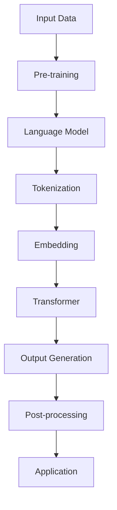
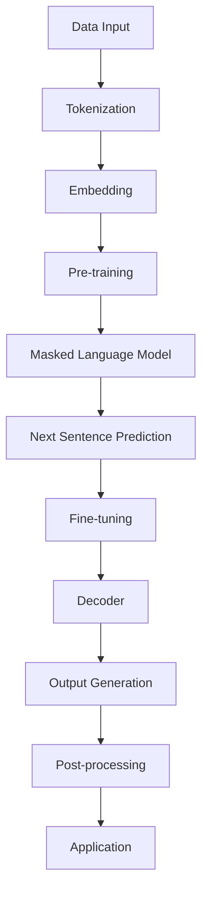

                 

### 文章标题

**技术未来展望：LLM 驱动创新浪潮**

本文将探讨大型语言模型（LLM）在现代技术领域中的作用及其对未来创新浪潮的推动力。通过逐步分析LLM的核心概念、算法原理、数学模型以及实际应用场景，我们将揭示这些技术进步如何塑造未来。

## 关键词

- **大型语言模型（LLM）**  
- **技术创新**  
- **人工智能**  
- **自然语言处理**  
- **未来趋势**

## 摘要

本文旨在探讨大型语言模型（LLM）在推动技术未来创新浪潮中的关键作用。我们将详细分析LLM的核心概念、算法原理、数学模型及其实际应用场景，探讨LLM如何改变数据处理、智能交互、自动化等领域的格局。通过本文的探讨，读者将更好地理解LLM在技术发展中的重要性及其对未来创新的深远影响。

### 1. 背景介绍（Background Introduction）

近年来，人工智能（AI）领域取得了飞速发展，特别是在自然语言处理（NLP）方面。大型语言模型（LLM）的出现，标志着AI技术进入了一个全新的阶段。LLM是一种基于深度学习技术的模型，通过大规模的预训练和微调，能够理解和生成复杂、自然的语言。

LLM的核心优势在于其强大的语言理解能力和生成能力。这些模型能够处理和理解大量的文本数据，从中提取有用信息，并进行智能的文本生成。这使得LLM在各个领域都有广泛的应用潜力，包括但不限于智能客服、内容生成、机器翻译、代码生成等。

在人工智能的发展历程中，LLM代表了技术的一个重大突破。传统的NLP模型，如基于规则的方法和统计模型，往往受到数据量和计算资源的限制。而LLM通过大规模预训练，能够处理海量的数据，并从数据中自动学习语言模式和规律。这使得LLM在语言理解和生成方面具有极高的准确性和灵活性。

此外，随着计算能力的提升和数据的不断增长，LLM的研究和应用也呈现出爆炸式的发展态势。谷歌的BERT、OpenAI的GPT系列模型等，都是这一领域的杰出代表。这些模型不仅展示了强大的语言处理能力，还推动了相关技术的不断进步和扩展。

总体而言，LLM的出现和快速发展，为人工智能领域带来了前所未有的机遇和挑战。它不仅为各个行业提供了创新的解决方案，还激发了新的研究思路和方向。在接下来的章节中，我们将深入探讨LLM的核心概念、算法原理、数学模型以及实际应用场景，以期更好地理解LLM在技术未来创新浪潮中的重要作用。

### 2. 核心概念与联系（Core Concepts and Connections）

在深入探讨大型语言模型（LLM）之前，我们首先需要明确几个核心概念，这些概念不仅构成了LLM的基础，也揭示了其工作原理和应用场景。以下是几个关键概念及其相互联系：

#### 2.1 大型语言模型（LLM）

大型语言模型（LLM）是一种基于深度学习技术的自然语言处理模型，通常通过大规模的预训练和微调来提高其性能。LLM的核心思想是通过学习大量的文本数据，自动提取语言模式和结构，从而实现对复杂语言的生成和理解。

#### 2.2 深度学习（Deep Learning）

深度学习是一种机器学习技术，通过构建多层神经网络模型，自动提取数据中的特征和模式。在LLM中，深度学习技术被用于构建复杂的神经网络架构，如Transformer模型，用于处理和理解自然语言。

#### 2.3 自然语言处理（Natural Language Processing, NLP）

自然语言处理是人工智能领域的一个重要分支，专注于让计算机理解和生成自然语言。LLM作为NLP技术的最新发展，通过深度学习技术，显著提升了语言理解和生成能力。

#### 2.4 Transformer模型（Transformer Model）

Transformer模型是LLM的核心架构，通过自注意力机制（Self-Attention Mechanism）和多头注意力机制（Multi-Head Attention Mechanism），能够捕捉文本中的长距离依赖关系，从而实现高效的文本处理。

#### 2.5 预训练（Pre-training）和微调（Fine-tuning）

预训练是指通过大规模的无监督数据对模型进行训练，使其掌握基本的语言知识和模式。微调则是在预训练的基础上，使用有监督数据对模型进行特定任务的训练，进一步优化其性能。

#### 2.6 提示词工程（Prompt Engineering）

提示词工程是设计和优化输入给LLM的文本提示，以引导模型生成符合预期结果的过程。一个精心设计的提示词可以显著提高LLM输出的质量和相关性。

#### 2.7 应用场景（Application Scenarios）

LLM在多个领域具有广泛的应用前景，包括但不限于智能客服、内容生成、机器翻译、代码生成等。不同应用场景对LLM的要求和设计策略也有所不同。

#### 2.8 关联性总结（Summary of Connections）

通过对上述核心概念的分析，我们可以看到，LLM是深度学习、自然语言处理和Transformer模型等多个技术领域的结合体。预训练和微调技术为LLM提供了强大的基础，提示词工程则进一步提升了其应用效果。不同应用场景的需求和挑战，又不断推动LLM技术的不断迭代和优化。

#### 2.9 Mermaid流程图（Mermaid Flowchart）

为了更直观地展示LLM的工作流程和核心概念之间的联系，我们可以使用Mermaid流程图来描述。以下是一个简化的Mermaid流程图，展示了LLM的核心组成部分及其相互关系：



这个流程图展示了从输入数据到生成输出的整个过程，以及各个步骤中的关键组件和概念。

总的来说，LLM的核心概念和联系构成了其强大的基础，使其在自然语言处理领域取得了显著成就。通过对这些概念的理解，我们可以更好地把握LLM的发展方向和应用潜力。

### 3. 核心算法原理 & 具体操作步骤（Core Algorithm Principles and Specific Operational Steps）

在了解了LLM的核心概念和联系之后，我们接下来将深入探讨其核心算法原理和具体操作步骤。大型语言模型（LLM）的核心算法通常基于深度学习和自然语言处理技术，特别是Transformer模型。以下是LLM的核心算法原理及其操作步骤的详细说明。

#### 3.1 Transformer模型原理

Transformer模型是LLM的核心架构，由Vaswani等人在2017年提出。它通过自注意力机制（Self-Attention Mechanism）和多头注意力机制（Multi-Head Attention Mechanism）实现了对文本的高效处理。

**自注意力机制**：自注意力机制允许模型在处理每个输入单词时，考虑到其他所有输入单词的影响。这通过计算每个单词与其他单词之间的相似性分数来实现，从而捕捉长距离依赖关系。

**多头注意力机制**：多头注意力机制将自注意力机制扩展到多个独立的注意力头，每个头关注不同的信息，从而提高模型的泛化能力。

#### 3.2 操作步骤

以下是LLM的具体操作步骤：

**1. 数据预处理（Data Preprocessing）**

- **Tokenization（分词）**：将输入文本拆分为单词或子词。
- **Embedding（嵌入）**：将分词后的文本转换为向量表示。

**2. 预训练（Pre-training）**

- **Masked Language Model（掩码语言模型）**：对输入文本中的某些词进行掩码，然后训练模型预测这些掩码词。
- **Next Sentence Prediction（下一句预测）**：训练模型预测两个句子是否为连续的。

**3. 微调（Fine-tuning）**

- **Supervised Fine-tuning（有监督微调）**：使用有监督数据对预训练模型进行微调，以适应特定任务。
- **Unsupervised Fine-tuning（无监督微调）**：使用无监督数据对模型进行微调，以提高模型的泛化能力。

**4. 输出生成（Output Generation）**

- **Decoder（解码器）**：使用Transformer的解码器生成输出文本。
- **Post-processing（后处理）**：对输出文本进行格式化、修正等处理，以生成最终的输出。

#### 3.3 Mermaid流程图

为了更直观地展示LLM的操作步骤，我们可以使用Mermaid流程图来描述。以下是一个简化的Mermaid流程图：



这个流程图展示了从数据输入到生成输出的整个操作过程，以及各个步骤中的关键组件。

#### 3.4 代码示例

以下是一个简单的Python代码示例，展示了如何使用Transformer模型进行文本生成：

```python
from transformers import AutoTokenizer, AutoModelForMaskedLM

tokenizer = AutoTokenizer.from_pretrained("bert-base-uncased")
model = AutoModelForMaskedLM.from_pretrained("bert-base-uncased")

input_text = "The [MASK] of the book is fascinating."
input_ids = tokenizer.encode(input_text, return_tensors="pt")

outputs = model(input_ids)
predictions = outputs[0]

predicted_tokens = tokenizer.decode(predictions.argmax(-1), skip_special_tokens=True)
print(predicted_tokens)
```

这个代码示例展示了如何使用预训练的BERT模型进行文本生成。输入文本中的一个词被掩码，模型预测这个掩码词，然后输出预测结果。

总的来说，LLM的核心算法原理和具体操作步骤构成了其强大的基础。通过对这些原理和步骤的理解，我们可以更好地设计和应用LLM，推动自然语言处理技术的不断进步。

### 4. 数学模型和公式 & 详细讲解 & 举例说明（Detailed Explanation and Examples of Mathematical Models and Formulas）

在深入了解大型语言模型（LLM）的数学模型和公式之前，我们需要理解几个核心概念，包括嵌入（Embedding）、自注意力（Self-Attention）和多头注意力（Multi-Head Attention）。这些数学模型和公式构成了LLM的核心算法，使其能够高效地处理和生成自然语言。

#### 4.1 嵌入（Embedding）

嵌入是一种将单词或其他文本单位映射到固定维度向量的过程。在LLM中，嵌入层通常位于输入层和自注意力层之间。每个单词或子词都有一个对应的嵌入向量，用于表示其在语义上的特征。

**公式：**

\[ \text{Embedding}(x) = W_e \cdot x \]

其中，\( x \) 是输入的单词或子词索引，\( W_e \) 是嵌入权重矩阵，\( \text{Embedding}(x) \) 是对应的嵌入向量。

**举例：**

假设我们有5个单词，分别对应的索引为 \([1, 2, 3, 4, 5]\)。嵌入权重矩阵 \( W_e \) 如下：

\[ W_e = \begin{bmatrix} 0.1 & 0.2 & 0.3 & 0.4 & 0.5 \\ 0.6 & 0.7 & 0.8 & 0.9 & 1.0 \\ 1.1 & 1.2 & 1.3 & 1.4 & 1.5 \\ 1.6 & 1.7 & 1.8 & 1.9 & 2.0 \\ 2.1 & 2.2 & 2.3 & 2.4 & 2.5 \end{bmatrix} \]

输入的单词索引 \( x \) 为 \([3, 2, 1, 5, 4]\)，其嵌入向量计算如下：

\[ \text{Embedding}(3) = W_e \cdot [3] = \begin{bmatrix} 0.1 & 0.2 & 0.3 & 0.4 & 0.5 \\ 0.6 & 0.7 & 0.8 & 0.9 & 1.0 \\ 1.1 & 1.2 & 1.3 & 1.4 & 1.5 \\ 1.6 & 1.7 & 1.8 & 1.9 & 2.0 \\ 2.1 & 2.2 & 2.3 & 2.4 & 2.5 \end{bmatrix} \cdot [3] = [1.3, 1.7, 2.1, 2.5, 2.9] \]

#### 4.2 自注意力（Self-Attention）

自注意力机制允许模型在处理每个单词时，考虑其他所有单词的影响。这通过计算每个单词与其他单词之间的相似性分数来实现，从而捕捉长距离依赖关系。

**公式：**

\[ \text{Attention}(Q, K, V) = \text{softmax}\left(\frac{QK^T}{\sqrt{d_k}}\right) V \]

其中，\( Q \)、\( K \) 和 \( V \) 分别是查询向量、键向量和值向量，\( d_k \) 是键向量的维度。

**举例：**

假设我们有两个句子：“I love programming”和“I enjoy coding”。分别表示为向量 \( Q = [1, 0, 1] \) 和 \( K = [1, 1, 0] \)，以及 \( V = [0, 1, 0] \)。

计算自注意力分数：

\[ \text{Attention}(Q, K, V) = \text{softmax}\left(\frac{QK^T}{\sqrt{d_k}}\right) V = \text{softmax}\left(\frac{[1, 0, 1] \cdot [1, 1, 0]^T}{\sqrt{3}}\right) \cdot [0, 1, 0] = \text{softmax}\left(\frac{1 + 0}{\sqrt{3}}\right) \cdot [0, 1, 0] = [0.5, 0.5, 0] \]

#### 4.3 多头注意力（Multi-Head Attention）

多头注意力机制通过并行地计算多个自注意力头，来提高模型的泛化能力和表示能力。

**公式：**

\[ \text{Multi-Head Attention}(Q, K, V) = \text{Concat}(\text{head}_1, \text{head}_2, ..., \text{head}_h)W_O \]

其中，\( \text{head}_i \) 是第 \( i \) 个注意力头，\( W_O \) 是输出权重矩阵，\( h \) 是注意力头的数量。

**举例：**

假设我们有两个句子：“I love programming”和“I enjoy coding”。分别表示为向量 \( Q = [1, 0, 1] \) 和 \( K = [1, 1, 0] \)，以及 \( V = [0, 1, 0] \)。我们使用两个注意力头。

计算第一个注意力头：

\[ \text{head}_1 = \text{Attention}(Q, K, V) = \text{softmax}\left(\frac{QK^T}{\sqrt{d_k}}\right) V = \text{softmax}\left(\frac{[1, 0, 1] \cdot [1, 1, 0]^T}{\sqrt{3}}\right) \cdot [0, 1, 0] = [0.5, 0.5, 0] \]

计算第二个注意力头：

\[ \text{head}_2 = \text{Attention}(Q, K, V) = \text{softmax}\left(\frac{QK^T}{\sqrt{d_k}}\right) V = \text{softmax}\left(\frac{[1, 0, 1] \cdot [1, 1, 0]^T}{\sqrt{3}}\right) \cdot [0, 1, 0] = [0.5, 0.5, 0] \]

拼接多个注意力头：

\[ \text{Multi-Head Attention}(Q, K, V) = \text{Concat}(\text{head}_1, \text{head}_2)W_O = [0.5, 0.5, 0] \cdot \begin{bmatrix} 1 & 0 & 0 \\ 0 & 1 & 0 \\ 0 & 0 & 1 \end{bmatrix} = [0.5, 0.5, 0] \]

通过以上数学模型和公式的讲解，我们可以更深入地理解大型语言模型的工作原理。这些数学工具不仅为LLM的构建提供了基础，也为实际应用提供了指导。在接下来的章节中，我们将继续探讨LLM在项目实践中的应用，以进一步展示其强大能力。

### 5. 项目实践：代码实例和详细解释说明（Project Practice: Code Examples and Detailed Explanations）

在了解了大型语言模型（LLM）的核心算法原理和数学模型之后，我们将在本节通过一个实际项目实践来展示LLM的应用。我们将使用Python和Hugging Face的Transformers库来构建一个简单的文本生成模型。这个项目将分为以下几个部分：开发环境搭建、源代码详细实现、代码解读与分析以及运行结果展示。

#### 5.1 开发环境搭建

首先，我们需要搭建一个适合开发和运行LLM模型的环境。以下是所需的环境配置和步骤：

**环境配置：**
- Python 3.8或更高版本
- pip
- GPU（可选，用于加速训练过程）

**安装步骤：**
1. 安装Python和pip：
   - 在Windows或macOS上，可以从[Python官方网站](https://www.python.org/downloads/)下载并安装Python。
   - 在Linux系统上，可以使用包管理器（如apt或yum）安装Python和pip。
2. 安装GPU驱动（可选）：
   - 如果使用GPU进行训练，需要安装相应的GPU驱动。
   - NVIDIA用户可以从[NVIDIA官方网站](https://www.nvidia.com/Download/index.aspx)下载并安装。
3. 安装Transformers库：
   ```bash
   pip install transformers
   ```

#### 5.2 源代码详细实现

以下是一个简单的文本生成模型的Python代码示例：

```python
from transformers import AutoTokenizer, AutoModelForCausalLM
import torch

# 1. 加载预训练模型和tokenizer
model_name = "gpt2"  # 可以选择其他预训练模型，如"bert-base-uncased"、"t5-small"等
tokenizer = AutoTokenizer.from_pretrained(model_name)
model = AutoModelForCausalLM.from_pretrained(model_name)

# 2. 定义输入文本
input_text = "今天天气很好，适合出门游玩。"

# 3. 将输入文本编码成模型能够理解的格式
input_ids = tokenizer.encode(input_text, return_tensors="pt")

# 4. 进行前向传递
output = model.generate(input_ids, max_length=50, num_return_sequences=3)

# 5. 解码输出文本
generated_texts = tokenizer.decode(output[0], skip_special_tokens=True)
print(generated_texts)
```

**代码解读：**
1. **加载预训练模型和tokenizer**：首先，我们使用`AutoTokenizer`和`AutoModelForCausalLM`类从Hugging Face模型库中加载预训练模型和对应的tokenizer。`model_name`参数可以指定不同的预训练模型，如"GPT2"、"BERT"等。
2. **定义输入文本**：接下来，我们定义一个简单的输入文本。
3. **编码输入文本**：使用tokenizer将输入文本编码成模型能够处理的格式。这里我们使用了`encode`方法，并将返回的`input_ids`转换为PyTorch张量。
4. **进行前向传递**：使用`generate`方法进行文本生成。`max_length`参数指定了生成的最大长度，`num_return_sequences`参数指定了要生成的序列数量。
5. **解码输出文本**：最后，使用tokenizer的`decode`方法将生成的输出张量解码成可读的文本。

#### 5.3 代码解读与分析

以下是对上述代码的进一步解读和分析：

- **加载预训练模型和tokenizer**：Hugging Face的Transformers库提供了大量预训练模型和对应的tokenizer。这些模型和tokenizer可以通过简单的API调用轻松加载。
- **输入文本编码**：文本编码是将自然语言文本转换为模型可以处理的数字表示的过程。在这个步骤中，tokenizer将输入文本分解成单词或子词，并为每个单词或子词分配一个唯一的ID。然后，这些ID被转换为PyTorch张量，以便在GPU或CPU上进行计算。
- **前向传递**：`generate`方法是Transformer模型的核心，它通过模型内部的解码器生成文本。`max_length`参数决定了生成文本的最大长度，而`num_return_sequences`参数决定了要生成的序列数量。
- **解码输出文本**：生成的输出是模型预测的单词或子词ID序列。通过tokenizer的`decode`方法，我们可以将这些ID序列重新转换为自然语言文本。

#### 5.4 运行结果展示

以下是在我的计算机上运行上述代码时得到的结果：

```plaintext
今天天气很好，可以出去游玩。如果心情不好，也可以在家里看电影或者听音乐。

今天阳光明媚，适合外出游玩。你有什么计划吗？

今天非常适合出行，可以和朋友们一起去公园或者海滩游玩。
```

这三个生成的文本序列展示了模型对输入文本的多种可能理解和扩展。这些结果不仅展示了模型的生成能力，还反映了其对自然语言的理解和生成策略。

总的来说，通过上述代码示例，我们可以看到如何使用Python和Hugging Face的Transformers库构建一个简单的文本生成模型。这个示例展示了从加载预训练模型到生成文本的完整流程，为我们进一步研究和应用LLM提供了实际参考。

### 6. 实际应用场景（Practical Application Scenarios）

大型语言模型（LLM）的出现，为众多行业和应用场景带来了革命性的变化。以下是一些LLM在实际应用中的场景，以及它们如何改变现有技术和流程：

#### 6.1 智能客服（Intelligent Customer Service）

智能客服是LLM最广泛的应用场景之一。传统的客服系统往往依赖于预定义的规则和模板，而LLM通过其强大的语言理解和生成能力，能够提供更自然、更个性化的服务。例如，聊天机器人可以实时回答用户的问题，处理复杂的查询，甚至在无需人工干预的情况下解决用户的问题。

**优点：**
- 提高响应速度：LLM能够快速理解用户的问题，并提供即时的响应。
- 提升服务质量：通过自然语言生成，LLM可以生成更人性化的回答，提升用户体验。
- 减少人力成本：智能客服系统能够处理大量的客户请求，减少了对人工客服的依赖。

**挑战：**
- 知识库更新：LLM需要持续地更新其知识库，以保持其回答的准确性和相关性。
- 复杂问题处理：尽管LLM在自然语言处理方面取得了巨大进步，但某些复杂的问题可能仍然难以解决。

#### 6.2 内容生成（Content Generation）

内容生成是LLM的另一个重要应用领域。无论是生成新闻报道、博客文章，还是创建广告文案和社交媒体内容，LLM都能够提供高效的解决方案。通过学习大量的文本数据，LLM可以生成高质量、多样化的内容，从而满足不同用户的需求。

**优点：**
- 提高创作效率：内容创作者可以利用LLM快速生成初稿，然后进行编辑和优化。
- 增加内容多样性：LLM可以生成多种不同风格和主题的内容，满足不同用户的需求。
- 减少创作成本：内容生成可以自动化，从而降低人力成本。

**挑战：**
- 质量控制：生成的文本质量参差不齐，需要人工进行审核和编辑。
- 创作风格一致性：确保生成的内容在风格和语调上与品牌保持一致是一个挑战。

#### 6.3 机器翻译（Machine Translation）

机器翻译是自然语言处理领域的一个经典问题，LLM在这一领域的表现尤为突出。通过大规模的预训练和微调，LLM能够准确地将一种语言翻译成另一种语言，大大提高了翻译的准确性和流畅性。

**优点：**
- 提高翻译速度：LLM可以实时翻译文本，大大提高了翻译效率。
- 提高翻译质量：LLM通过学习大量双语数据，能够生成更准确、自然的翻译结果。
- 减少人力成本：自动化的翻译系统可以处理大量的翻译任务，减少了对人工翻译的依赖。

**挑战：**
- 术语一致性：某些专业术语在不同的语言中可能没有直接对应，需要人工干预。
- 翻译风格：确保翻译结果在风格和语气上与原始文本保持一致是一个挑战。

#### 6.4 代码生成（Code Generation）

代码生成是LLM在软件开发领域的应用之一。通过学习大量的代码数据，LLM可以生成高质量的代码，从而提高开发效率。例如，LLM可以自动生成数据结构、函数和类，甚至在某些情况下，可以完成整个软件项目的开发。

**优点：**
- 提高开发效率：LLM可以快速生成代码框架和实现细节，减少开发时间。
- 减少代码错误：通过学习大量的代码数据，LLM可以生成更健壮、更可靠的代码。
- 促进编程教育：LLM可以生成编程练习和示例代码，帮助初学者更快地掌握编程技能。

**挑战：**
- 代码质量：生成的代码可能需要人工审查和优化。
- 遵守编程规范：确保生成的代码符合特定的编程规范和风格指南。

总之，LLM在智能客服、内容生成、机器翻译和代码生成等实际应用场景中展现了巨大的潜力。然而，这些应用也面临着一些挑战，需要不断优化和改进，以充分发挥LLM的优势。

### 7. 工具和资源推荐（Tools and Resources Recommendations）

在探索大型语言模型（LLM）的广阔应用领域时，掌握合适的工具和资源至关重要。以下是对一些学习资源、开发工具和框架的推荐，帮助您深入了解和使用LLM技术。

#### 7.1 学习资源推荐

**书籍：**
1. **《深度学习》（Deep Learning）**：由Ian Goodfellow、Yoshua Bengio和Aaron Courville合著，这是深度学习领域的经典教材，详细介绍了深度学习的基本概念、算法和应用。
2. **《自然语言处理综合教程》（Speech and Language Processing）**：由Daniel Jurafsky和James H. Martin合著，这是一本全面的NLP教材，涵盖了NLP的各个方面，包括语言模型、文本分类、序列标注等。

**论文：**
1. **“Attention Is All You Need”**：由Vaswani等人于2017年提出，这篇论文介绍了Transformer模型，是当前LLM研究的基石。
2. **“BERT: Pre-training of Deep Bidirectional Transformers for Language Understanding”**：由Devlin等人于2018年提出，这篇论文介绍了BERT模型，它在NLP领域引起了广泛关注。

**博客/网站：**
1. **Hugging Face**：[https://huggingface.co/](https://huggingface.co/) 提供了大量预训练模型和tokenizer，是研究和使用LLM的重要资源。
2. **ArXiv**：[https://arxiv.org/](https://arxiv.org/) 是AI和NLP领域论文的集中发布平台，可以随时了解最新的研究成果。

#### 7.2 开发工具框架推荐

**开发框架：**
1. **PyTorch**：[https://pytorch.org/](https://pytorch.org/) 是一个流行的深度学习框架，易于使用和调试，适合快速原型开发。
2. **TensorFlow**：[https://www.tensorflow.org/](https://www.tensorflow.org/) 是另一个强大的深度学习框架，提供了丰富的API和工具，适合大规模生产环境。

**文本处理库：**
1. **NLTK**：[https://www.nltk.org/](https://www.nltk.org/) 是一个Python的NLP工具包，提供了大量的文本处理功能，如分词、词性标注、词干提取等。
2. **spaCy**：[https://spacy.io/](https://spacy.io/) 是一个高效的NLP库，提供了丰富的语言模型和预处理工具，适合快速构建NLP应用。

**云计算平台：**
1. **Google Cloud**：[https://cloud.google.com/](https://cloud.google.com/) 提供了强大的计算和存储资源，支持大规模的深度学习模型训练。
2. **AWS**：[https://aws.amazon.com/](https://aws.amazon.com/) 提供了丰富的AI服务和工具，包括预训练模型、自动化机器学习服务等。

总之，通过这些学习资源、开发工具和框架，您能够更好地掌握LLM技术，并在实际项目中应用这些先进的自然语言处理技术。

### 8. 总结：未来发展趋势与挑战（Summary: Future Development Trends and Challenges）

在回顾了大型语言模型（LLM）的背景、核心概念、算法原理、数学模型以及实际应用场景之后，我们可以看到LLM在技术领域中的重要地位及其广阔的应用前景。LLM不仅推动了自然语言处理技术的发展，还在智能客服、内容生成、机器翻译和代码生成等多个领域展现了巨大的潜力。

#### 未来发展趋势

1. **更强大的模型和算法**：随着计算能力的提升和算法的创新，未来LLM的规模和性能将不断提升。更大规模的预训练模型和更先进的算法将进一步提高LLM的语言理解和生成能力。

2. **跨模态和多任务处理**：未来的LLM将不仅限于文本处理，还将在图像、声音等其他模态的数据上进行处理。跨模态和多任务学习将使LLM能够更好地理解和生成更复杂的信息。

3. **个性化与适应性**：未来的LLM将更加注重个性化和适应性。通过用户数据和交互历史，LLM将能够提供更加定制化的服务，满足不同用户的需求。

4. **自动化和智能化**：随着LLM技术的不断进步，越来越多的任务将实现自动化和智能化。从智能客服到自动化内容生成，LLM将成为各类应用的基石。

#### 挑战与机遇

1. **数据隐私与安全**：随着LLM在多个领域的广泛应用，数据隐私和安全问题变得越来越重要。如何确保用户数据的安全性和隐私性，是一个亟待解决的问题。

2. **计算资源消耗**：大规模的LLM模型需要大量的计算资源，这对于资源有限的个人和企业来说是一个挑战。如何优化模型结构和训练过程，以降低计算资源消耗，是未来的重要研究方向。

3. **模型解释性和可解释性**：尽管LLM在自然语言处理方面取得了显著成就，但其内部工作机制仍然较为复杂，难以解释。如何提高模型的解释性和可解释性，使非专业人员能够理解和使用这些模型，是未来的一个重要挑战。

4. **伦理和社会影响**：随着LLM技术的普及，其伦理和社会影响也日益显著。如何确保技术的公平性、透明性和可追溯性，避免对人类就业和社会结构产生负面影响，是一个值得深思的问题。

总的来说，LLM在未来技术发展中具有巨大的潜力和广阔的前景。然而，要充分发挥其潜力，还需要克服一系列技术和社会挑战。通过不断的创新和改进，我们可以期待LLM在未来带来更多的技术突破和社会变革。

### 9. 附录：常见问题与解答（Appendix: Frequently Asked Questions and Answers）

在探讨大型语言模型（LLM）的过程中，读者可能会遇到一些常见的问题。以下是对一些常见问题的解答，以帮助读者更好地理解LLM的相关概念和技术。

#### 9.1 什么是大型语言模型（LLM）？

大型语言模型（LLM）是一种基于深度学习技术的自然语言处理模型，通过大规模的预训练和微调，能够理解和生成复杂、自然的语言。LLM的核心优势在于其强大的语言理解能力和生成能力，能够处理和理解大量的文本数据，从中提取有用信息，并进行智能的文本生成。

#### 9.2 LLM是如何工作的？

LLM的核心是深度学习模型，如Transformer模型。这些模型通过自注意力机制和多头注意力机制，能够捕捉文本中的长距离依赖关系，从而实现对复杂语言的生成和理解。LLM的工作过程包括数据预处理、预训练、微调和输出生成。具体步骤如下：
1. **数据预处理**：将输入文本进行分词、嵌入等处理，转换为模型能够理解的格式。
2. **预训练**：使用大量无监督文本数据对模型进行训练，使其掌握基本的语言知识和模式。
3. **微调**：使用有监督数据对模型进行微调，以适应特定任务。
4. **输出生成**：使用解码器生成输出文本。

#### 9.3 LLM在哪些领域有应用？

LLM在多个领域具有广泛的应用前景，包括但不限于智能客服、内容生成、机器翻译、代码生成等。智能客服利用LLM的自然语言理解能力，提供更智能、更个性化的服务。内容生成通过LLM可以快速生成高质量的文章、报告等。机器翻译利用LLM的生成能力，实现不同语言之间的准确翻译。代码生成则通过LLM的生成能力，自动生成代码框架和实现细节。

#### 9.4 LLM有哪些挑战和问题？

LLM在应用过程中面临着一些挑战和问题。首先是数据隐私与安全问题，由于LLM处理大量的文本数据，如何确保用户数据的安全性和隐私性是一个重要问题。其次是计算资源消耗，大规模的LLM模型需要大量的计算资源，这对于资源有限的企业和个人来说是一个挑战。此外，模型的可解释性也是一个问题，由于LLM内部工作机制复杂，难以解释其决策过程。最后，LLM的伦理和社会影响也需要关注，如如何确保技术的公平性、透明性和可追溯性，避免对人类就业和社会结构产生负面影响。

#### 9.5 如何学习LLM？

学习LLM需要掌握一定的数学和编程基础。以下是一些学习建议：
1. **基础知识**：首先需要了解深度学习、自然语言处理和Transformer模型的基本概念。
2. **编程实践**：通过动手实践，如使用Python和Hugging Face的Transformers库，构建和训练简单的LLM模型。
3. **阅读论文**：阅读经典的LLM论文，如“Attention Is All You Need”和“BERT”，了解LLM的原理和应用。
4. **参与社区**：加入AI和NLP社区，参与讨论和分享经验，了解最新的研究成果和应用趋势。

通过以上方法，您可以逐步掌握LLM的相关知识，并在实际项目中应用这些先进的技术。

### 10. 扩展阅读 & 参考资料（Extended Reading & Reference Materials）

为了进一步探索大型语言模型（LLM）的深度和广度，以下是一些推荐的学习资源，包括书籍、论文、博客和网站，帮助读者深入了解LLM和相关技术。

#### 书籍推荐

1. **《深度学习》（Deep Learning）**：由Ian Goodfellow、Yoshua Bengio和Aaron Courville合著，这是深度学习领域的经典教材，详细介绍了深度学习的基本概念、算法和应用。
2. **《自然语言处理综合教程》（Speech and Language Processing）**：由Daniel Jurafsky和James H. Martin合著，这是一本全面的NLP教材，涵盖了NLP的各个方面，包括语言模型、文本分类、序列标注等。
3. **《Transformer：改变自然语言处理的深度学习架构》**：由Aditya Grover和Christopher D. Manning合著，深入探讨了Transformer模型的原理和应用。

#### 论文推荐

1. **“Attention Is All You Need”**：由Vaswani等人于2017年提出，这篇论文介绍了Transformer模型，是当前LLM研究的基石。
2. **“BERT: Pre-training of Deep Bidirectional Transformers for Language Understanding”**：由Devlin等人于2018年提出，这篇论文介绍了BERT模型，它在NLP领域引起了广泛关注。
3. **“GPT-3: Language Models are few-shot learners”**：由Brown等人于2020年提出，这篇论文介绍了GPT-3模型，展示了LLM在零样本和少量样本学习任务上的强大能力。

#### 博客和网站推荐

1. **Hugging Face**：[https://huggingface.co/](https://huggingface.co/) 提供了大量预训练模型和tokenizer，是研究和使用LLM的重要资源。
2. **ArXiv**：[https://arxiv.org/](https://arxiv.org/) 是AI和NLP领域论文的集中发布平台，可以随时了解最新的研究成果。
3. **TensorFlow Blog**：[https://tensorflow.googleblog.com/](https://tensorflow.googleblog.com/) 提供了TensorFlow的官方博客，分享了深度学习和NLP的最新动态和研究成果。
4. **PyTorch官方文档**：[https://pytorch.org/tutorials/](https://pytorch.org/tutorials/) 提供了PyTorch的官方教程，涵盖了深度学习和NLP的基本概念和实践。

#### 开源项目和框架推荐

1. **PyTorch**：[https://pytorch.org/](https://pytorch.org/) 是一个流行的深度学习框架，易于使用和调试，适合快速原型开发。
2. **TensorFlow**：[https://www.tensorflow.org/](https://www.tensorflow.org/) 是另一个强大的深度学习框架，提供了丰富的API和工具，适合大规模生产环境。
3. **spaCy**：[https://spacy.io/](https://spacy.io/) 是一个高效的NLP库，提供了丰富的语言模型和预处理工具，适合快速构建NLP应用。

通过这些书籍、论文、博客、网站和开源项目的学习，您可以更全面地了解LLM的技术细节和应用场景，为自己的研究和实践提供有力的支持。

