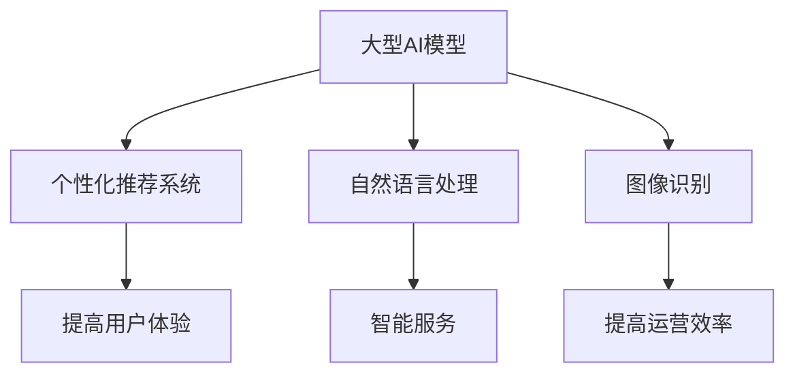
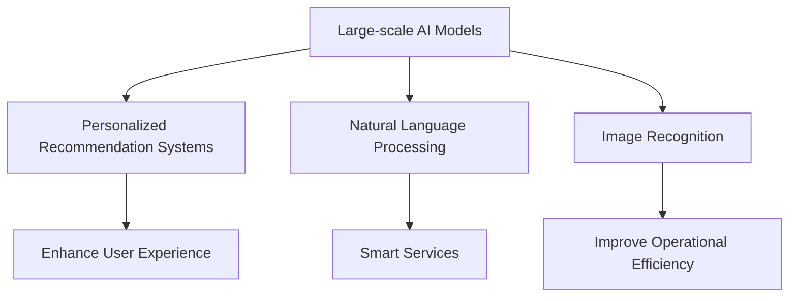

                 

### 文章标题

### Exploring the Potential of Large-scale AI Models in E-commerce Social Commerce

#### 摘要

本文旨在深入探讨大型AI模型在电商平台社交商务中的潜力。我们将分析AI模型如何通过个性化推荐、自然语言处理和图像识别等关键技术，为电商平台提供更智能、更高效的社交商务体验。此外，文章还将探讨当前面临的技术挑战，并展望未来发展的趋势。

### Abstract

This article aims to delve into the potential of large-scale AI models in e-commerce social commerce. We will analyze how AI models, through key technologies such as personalized recommendations, natural language processing, and image recognition, can provide smarter and more efficient social commerce experiences for e-commerce platforms. Furthermore, the article will discuss the current technical challenges and look forward to the future development trends.

## 1. 背景介绍

### Background Introduction

随着互联网的普及和电子商务的快速发展，社交商务作为一种新兴的电商模式，正逐渐改变着消费者的购物习惯和商家的营销策略。社交商务平台通过整合社交媒体和电子商务功能，使得用户可以在社交媒体上直接购物，从而实现社交互动和购物的无缝衔接。

AI技术的迅猛发展，为电商平台带来了新的机遇。大型AI模型，如深度学习模型、生成对抗网络（GANs）等，通过处理海量数据，能够发现用户的潜在需求，提供个性化的推荐服务，从而提高用户的满意度和购买转化率。

本文将围绕以下几个方面展开讨论：

1. **个性化推荐系统**：介绍如何利用AI模型进行个性化推荐，提升用户体验。
2. **自然语言处理**：探讨如何使用AI模型处理用户评论、聊天等，提升电商平台的服务质量。
3. **图像识别**：分析如何利用AI模型进行图像识别，帮助商家提高营销效果。

## 1. Background Introduction

With the widespread use of the internet and the rapid development of e-commerce, social commerce, as a new e-commerce model, is gradually changing consumer shopping habits and merchant marketing strategies. Social commerce platforms integrate social media and e-commerce functions, allowing users to shop directly on social media, thus achieving seamless integration of social interaction and shopping.

The rapid development of AI technology brings new opportunities to e-commerce platforms. Large-scale AI models, such as deep learning models and generative adversarial networks (GANs), can process massive amounts of data to discover users' latent needs, provide personalized recommendation services, and thereby improve user satisfaction and purchase conversion rates.

This article will discuss the following aspects:

1. **Personalized Recommendation Systems**: Introduce how to use AI models for personalized recommendation to enhance user experience.
2. **Natural Language Processing**: Discuss how to use AI models to process user reviews, chats, etc., to improve the quality of service on e-commerce platforms.
3. **Image Recognition**: Analyze how to use AI models for image recognition to help merchants improve marketing effectiveness.

## 2. 核心概念与联系

### 2.1 大型AI模型

#### Large-scale AI Models

大型AI模型是指能够处理大规模数据并从中提取有用信息的深度学习模型。这些模型通过训练数以百万计的参数，能够从数据中学习到复杂的模式和关联。

#### Core Concepts and Connections

2.1 Large-scale AI Models

Large-scale AI models refer to deep learning models capable of processing massive amounts of data and extracting useful information from it. These models are trained on millions of parameters to learn complex patterns and correlations from the data.

### 2.2 个性化推荐系统

#### Personalized Recommendation Systems

个性化推荐系统是利用AI模型分析用户行为和偏好，为用户提供个性化的商品推荐。这种系统通过不断学习和调整推荐算法，以提高推荐的准确性和用户体验。

### 2.3 自然语言处理

#### Natural Language Processing (NLP)

自然语言处理是AI领域的一个重要分支，涉及使计算机能够理解、解释和生成人类语言的技术。在电商平台中，NLP技术可用于处理用户评论、聊天等，从而提供更智能的服务。

### 2.4 图像识别

#### Image Recognition

图像识别是AI模型的一个应用，通过分析图像中的特征，识别和分类图像内容。在电商平台上，图像识别技术可用于产品分类、品牌识别等，以提高平台的运营效率。

### 2.1 Large-scale AI Models

### 2.2 Personalized Recommendation Systems

Personalized recommendation systems leverage AI models to analyze user behavior and preferences to provide personalized product recommendations. Such systems continuously learn and adjust recommendation algorithms to improve the accuracy of recommendations and user experience.

### 2.3 Natural Language Processing (NLP)

Natural Language Processing (NLP) is an important branch of AI that involves enabling computers to understand, interpret, and generate human language. In e-commerce platforms, NLP technologies can be used to process user reviews, chats, etc., to provide smarter services.

### 2.4 Image Recognition

Image recognition is an application of AI models that analyzes the features of images to identify and classify image content. In e-commerce platforms, image recognition technologies can be used for product classification, brand recognition, etc., to improve the operational efficiency of the platform.



## 2. Core Concepts and Connections

### 2.1 Large-scale AI Models

Large-scale AI models are deep learning models capable of processing massive amounts of data and extracting useful information. These models are trained on millions of parameters to learn complex patterns and correlations from the data.

### 2.2 Personalized Recommendation Systems

Personalized recommendation systems leverage AI models to analyze user behavior and preferences to provide personalized product recommendations. Such systems continuously learn and adjust recommendation algorithms to improve the accuracy of recommendations and user experience.

### 2.3 Natural Language Processing (NLP)

Natural Language Processing (NLP) is an important branch of AI that involves enabling computers to understand, interpret, and generate human language. In e-commerce platforms, NLP technologies can be used to process user reviews, chats, etc., to provide smarter services.

### 2.4 Image Recognition

Image recognition is an application of AI models that analyzes the features of images to identify and classify image content. In e-commerce platforms, image recognition technologies can be used for product classification, brand recognition, etc., to improve the operational efficiency of the platform.



## 3. 核心算法原理 & 具体操作步骤

### 3.1 个性化推荐算法

#### Personalized Recommendation Algorithm

个性化推荐算法是电商平台实现个性化推荐的核心。其主要原理是通过分析用户的历史行为和偏好，构建用户兴趣模型，然后利用这些模型为用户推荐相关商品。

#### Core Algorithm Principles & Specific Operational Steps

3.1 Personalized Recommendation Algorithm

Personalized recommendation algorithms are the core of implementing personalized recommendations on e-commerce platforms. The main principle is to analyze user historical behavior and preferences to build user interest models, and then use these models to recommend relevant products to users.

### 3.2 自然语言处理算法

#### Natural Language Processing Algorithm

自然语言处理算法是电商平台提供智能服务的关键。其主要原理是利用深度学习模型对用户评论、聊天等进行语义分析，从而提取有用信息，为用户提供更精准的服务。

#### Core Algorithm Principles & Specific Operational Steps

3.2 Natural Language Processing Algorithm

Natural Language Processing (NLP) algorithms are the key to providing smart services on e-commerce platforms. The main principle is to use deep learning models to perform semantic analysis on user reviews, chats, etc., to extract useful information and provide more precise services to users.

### 3.3 图像识别算法

#### Image Recognition Algorithm

图像识别算法是电商平台提高运营效率的重要工具。其主要原理是通过训练深度学习模型，使模型能够识别和分类图像内容，从而帮助商家更有效地管理产品和品牌。

#### Core Algorithm Principles & Specific Operational Steps

3.3 Image Recognition Algorithm

Image recognition algorithms are important tools for improving operational efficiency on e-commerce platforms. The main principle is to train deep learning models so that they can identify and classify image content, thereby helping merchants manage products and brands more effectively.

### 3.1 Personalized Recommendation Algorithm

### 3.2 Natural Language Processing Algorithm

### 3.3 Image Recognition Algorithm

3.1 Personalized Recommendation Algorithm

Personalized recommendation algorithms are the core of implementing personalized recommendations on e-commerce platforms. The main principle is to analyze user historical behavior and preferences to build user interest models, and then use these models to recommend relevant products to users.

3.2 Natural Language Processing Algorithm

Natural Language Processing (NLP) algorithms are the key to providing smart services on e-commerce platforms. The main principle is to use deep learning models to perform semantic analysis on user reviews, chats, etc., to extract useful information and provide more precise services to users.

3.3 Image Recognition Algorithm

Image recognition algorithms are important tools for improving operational efficiency on e-commerce platforms. The main principle is to train deep learning models so that they can identify and classify image content, thereby helping merchants manage products and brands more effectively.

## 3. Core Algorithm Principles & Specific Operational Steps

### 3.1 Personalized Recommendation Algorithm

#### Personalized Recommendation Algorithm

Personalized recommendation algorithms are the core of implementing personalized recommendations on e-commerce platforms. The main principle is to analyze user historical behavior and preferences to build user interest models, and then use these models to recommend relevant products to users.

#### Core Principles:

1. **Collaborative Filtering**: This approach uses the behavior of similar users to make recommendations. It identifies users with similar preferences and suggests products that those users have liked.
2. **Content-based Filtering**: This approach recommends products similar to those a user has liked in the past based on the product's attributes and features.
3. **Hybrid Models**: This approach combines collaborative and content-based filtering to provide more accurate recommendations.

#### Operational Steps:

1. **Data Collection**: Collect user interaction data such as views, clicks, and purchases.
2. **Feature Engineering**: Extract relevant features from user data to build user interest models.
3. **Model Training**: Train a recommendation model using the collected data.
4. **Recommendation Generation**: Generate recommendations based on the trained model and user interest models.
5. **Evaluation**: Evaluate the performance of the recommendation system using metrics such as precision, recall, and F1-score.

### 3.2 Natural Language Processing Algorithm

#### Natural Language Processing Algorithm

Natural Language Processing (NLP) algorithms are the key to providing smart services on e-commerce platforms. The main principle is to use deep learning models to perform semantic analysis on user reviews, chats, etc., to extract useful information and provide more precise services to users.

#### Core Principles:

1. **Tokenization**: Splitting text into words or tokens.
2. **Part-of-Speech Tagging**: Assigning grammatical tags to each token.
3. **Named Entity Recognition**: Identifying and classifying named entities (e.g., people, organizations, locations) in text.
4. **Sentiment Analysis**: Analyzing the sentiment expressed in text.
5. **Question Answering**: Answering questions posed by users based on the content of the text.

#### Operational Steps:

1. **Data Collection**: Collect user-generated content such as reviews, chats, etc.
2. **Preprocessing**: Clean and preprocess the text data.
3. **Feature Extraction**: Extract relevant features from the preprocessed text.
4. **Model Training**: Train NLP models using the extracted features.
5. **Application**: Use the trained models to analyze user-generated content and provide intelligent responses or insights.
6. **Evaluation**: Evaluate the performance of the NLP models using metrics such as accuracy, precision, and recall.

### 3.3 Image Recognition Algorithm

#### Image Recognition Algorithm

Image recognition algorithms are important tools for improving operational efficiency on e-commerce platforms. The main principle is to train deep learning models so that they can identify and classify image content, thereby helping merchants manage products and brands more effectively.

#### Core Principles:

1. **Convolutional Neural Networks (CNNs)**: These are neural networks that are particularly effective for image recognition tasks. They use convolutional layers to capture spatial hierarchies in images.
2. **Object Detection**: This involves identifying and classifying objects within images.
3. **Image Classification**: This involves assigning a label to an entire image.
4. **Semantic Segmentation**: This involves assigning a label to each pixel in an image.

#### Operational Steps:

1. **Data Collection**: Collect images of products and brands.
2. **Preprocessing**: Preprocess the images to ensure consistency.
3. **Feature Extraction**: Extract relevant features from the images.
4. **Model Training**: Train image recognition models using the extracted features.
5. **Application**: Use the trained models to identify and classify images.
6. **Evaluation**: Evaluate the performance of the image recognition models using metrics such as accuracy, precision, recall, and F1-score.

## 3. Core Algorithm Principles & Specific Operational Steps

### 3.1 Personalized Recommendation Algorithm

#### Personalized Recommendation Algorithm

Personalized recommendation algorithms are the core of implementing personalized recommendations on e-commerce platforms. The main principle is to analyze user historical behavior and preferences to build user interest models, and then use these models to recommend relevant products to users.

#### Core Principles:

1. **Collaborative Filtering**: This approach uses the behavior of similar users to make recommendations. It identifies users with similar preferences and suggests products that those users have liked.

2. **Content-based Filtering**: This approach recommends products similar to those a user has liked in the past based on the product's attributes and features.

3. **Hybrid Models**: This approach combines collaborative and content-based filtering to provide more accurate recommendations.

#### Operational Steps:

1. **Data Collection**: Collect user interaction data such as views, clicks, and purchases.

2. **Feature Engineering**: Extract relevant features from user data to build user interest models.

3. **Model Training**: Train a recommendation model using the collected data.

4. **Recommendation Generation**: Generate recommendations based on the trained model and user interest models.

5. **Evaluation**: Evaluate the performance of the recommendation system using metrics such as precision, recall, and F1-score.

### 3.2 Natural Language Processing Algorithm

#### Natural Language Processing Algorithm

Natural Language Processing (NLP) algorithms are the key to providing smart services on e-commerce platforms. The main principle is to use deep learning models to perform semantic analysis on user reviews, chats, etc., to extract useful information and provide more precise services to users.

#### Core Principles:

1. **Tokenization**: Splitting text into words or tokens.

2. **Part-of-Speech Tagging**: Assigning grammatical tags to each token.

3. **Named Entity Recognition**: Identifying and classifying named entities (e.g., people, organizations, locations) in text.

4. **Sentiment Analysis**: Analyzing the sentiment expressed in text.

5. **Question Answering**: Answering questions posed by users based on the content of the text.

#### Operational Steps:

1. **Data Collection**: Collect user-generated content such as reviews, chats, etc.

2. **Preprocessing**: Clean and preprocess the text data.

3. **Feature Extraction**: Extract relevant features from the preprocessed text.

4. **Model Training**: Train NLP models using the extracted features.

5. **Application**: Use the trained models to analyze user-generated content and provide intelligent responses or insights.

6. **Evaluation**: Evaluate the performance of the NLP models using metrics such as accuracy, precision, and recall.

### 3.3 Image Recognition Algorithm

#### Image Recognition Algorithm

Image recognition algorithms are important tools for improving operational efficiency on e-commerce platforms. The main principle is to train deep learning models so that they can identify and classify image content, thereby helping merchants manage products and brands more effectively.

#### Core Principles:

1. **Convolutional Neural Networks (CNNs)**: These are neural networks that are particularly effective for image recognition tasks. They use convolutional layers to capture spatial hierarchies in images.

2. **Object Detection**: This involves identifying and classifying objects within images.

3. **Image Classification**: This involves assigning a label to an entire image.

4. **Semantic Segmentation**: This involves assigning a label to each pixel in an image.

#### Operational Steps:

1. **Data Collection**: Collect images of products and brands.

2. **Preprocessing**: Preprocess the images to ensure consistency.

3. **Feature Extraction**: Extract relevant features from the images.

4. **Model Training**: Train image recognition models using the extracted features.

5. **Application**: Use the trained models to identify and classify images.

6. **Evaluation**: Evaluate the performance of the image recognition models using metrics such as accuracy, precision, recall, and F1-score.

```mermaid
graph TD
A[Personalized Recommendation Algorithm]
A --> B[Collaborative Filtering]
A --> C[Content-based Filtering]
A --> D[Hybrid Models]
B --> E[User Behavior Analysis]
C --> F[Product Feature Analysis]
D --> G[User Behavior Analysis]
D --> H[Product Feature Analysis]

I[Natural Language Processing Algorithm]
I --> J[Tokenization]
I --> K[Part-of-Speech Tagging]
I --> L[Named Entity Recognition]
I --> M[Sentiment Analysis]
I --> N[Question Answering]
J --> O[Text Preprocessing]
K --> P[Text Structure Analysis]
L --> Q[Entity Identification]
M --> R[Sentiment Evaluation]
N --> S[Answer Generation]

Z[Image Recognition Algorithm]
Z --> AA[Convolutional Neural Networks (CNNs)]
Z --> BB[Object Detection]
Z --> CC[Image Classification]
Z --> DD[Semantic Segmentation]
AA --> EE[Feature Extraction]
BB --> FF[Object Identification]
CC --> GG[Image Labeling]
DD --> HH[Pixel Labeling]
E --> I[Model Training]
F --> J[Data Collection]
G --> K[Application]
H --> L[Evaluation]
I --> M[Feature Extraction]
J --> N[Data Collection]
K --> O[Model Training]
L --> P[Application]
M --> Q[Evaluation]
N --> O[Feature Extraction]
P --> Q[Model Training]
Q --> R[Application]
R --> S[Evaluation]
```

## 4. 数学模型和公式 & 详细讲解 & 举例说明

### 4.1 个性化推荐算法

#### Personalized Recommendation Algorithm

个性化推荐算法的核心是计算用户兴趣模型和商品属性之间的相似度。以下是一个基于协同过滤的个性化推荐算法的数学模型：

#### Mathematical Models & Detailed Explanation & Examples

4.1 Personalized Recommendation Algorithm

The core of personalized recommendation algorithms is to compute the similarity between user interest models and product attributes. Here is a mathematical model of a collaborative filtering-based personalized recommendation algorithm:

#### 基本公式

$$
r_{ij} = \langle \mu_i, \mu_j \rangle + b_i + b_j + \langle q_i, p_j \rangle
$$

#### 公式解释

- $r_{ij}$：用户$i$对商品$j$的评分。
- $\mu_i$：用户$i$的平均评分。
- $\mu_j$：商品$j$的平均评分。
- $b_i$：用户$i$的偏置。
- $b_j$：商品$j$的偏置。
- $\langle q_i, p_j \rangle$：用户$i$的兴趣模型$q_i$与商品$j$的属性模型$p_j$之间的相似度。

#### 举例说明

假设用户$A$对商品$X$的评分为5，用户$A$的平均评分为4，商品$X$的平均评分为3。用户$A$的兴趣模型为[0.2, 0.8]，商品$X$的属性模型为[0.1, 0.9]。根据上述公式，我们可以计算用户$A$对商品$X$的评分预测：

$$
r_{AX} = \langle \mu_A, \mu_X \rangle + b_A + b_X + \langle q_A, p_X \rangle
$$

$$
r_{AX} = (4 + 3) / 2 + b_A + b_X + (0.2 \times 0.1 + 0.8 \times 0.9)
$$

$$
r_{AX} = 3.5 + b_A + b_X + 0.08 + 0.72
$$

$$
r_{AX} = 4.3 + b_A + b_X
$$

如果用户$A$的偏置$b_A$为0.5，商品$X$的偏置$b_X$为0.2，则用户$A$对商品$X$的评分预测为：

$$
r_{AX} = 4.3 + 0.5 + 0.2 = 4.9
$$

### 4.2 自然语言处理算法

#### Natural Language Processing Algorithm

自然语言处理算法的核心是文本表示和语义分析。以下是一个基于词嵌入的文本表示的数学模型：

#### Mathematical Models & Detailed Explanation & Examples

4.2 Natural Language Processing Algorithm

The core of NLP algorithms is text representation and semantic analysis. Here is a mathematical model of text representation based on word embeddings:

#### 基本公式

$$
\text{vec}(w) = \sum_{i=1}^{n} w_i \times v_i
$$

#### 公式解释

- $\text{vec}(w)$：文本向量表示。
- $w_i$：单词$i$在文本中出现的次数。
- $v_i$：单词$i$的词嵌入向量。

#### 举例说明

假设文本为“我喜欢阅读书籍”，其中“我”、“喜欢”、“阅读”、“书籍”分别对应的词嵌入向量为$v_1, v_2, v_3, v_4$。根据上述公式，我们可以计算文本的向量表示：

$$
\text{vec}(\text{我喜欢阅读书籍}) = (1 \times v_1 + 1 \times v_2 + 1 \times v_3 + 1 \times v_4)
$$

$$
\text{vec}(\text{我喜欢阅读书籍}) = v_1 + v_2 + v_3 + v_4
$$

如果$v_1, v_2, v_3, v_4$分别为[1, 2], [3, 4], [5, 6], [7, 8]，则文本的向量表示为：

$$
\text{vec}(\text{我喜欢阅读书籍}) = [1, 2] + [3, 4] + [5, 6] + [7, 8]
$$

$$
\text{vec}(\text{我喜欢阅读书籍}) = [16, 20]
$$

### 4.3 图像识别算法

#### Image Recognition Algorithm

图像识别算法的核心是特征提取和分类。以下是一个基于卷积神经网络的图像识别的数学模型：

#### Mathematical Models & Detailed Explanation & Examples

4.3 Image Recognition Algorithm

The core of image recognition algorithms is feature extraction and classification. Here is a mathematical model of image recognition based on convolutional neural networks:

#### 基本公式

$$
\text{activation}(x) = \sigma(\text{weight} \cdot \text{input} + \text{bias})
$$

#### 公式解释

- $\text{activation}(x)$：激活函数输出。
- $\text{weight}$：权重。
- $\text{input}$：输入特征。
- $\text{bias}$：偏置。
- $\sigma$：激活函数，通常为ReLU函数。

#### 举例说明

假设输入特征为$x = [1, 2, 3, 4]$，权重为$w = [0.5, 0.5, 0.5, 0.5]$，偏置为$b = 1$，激活函数为ReLU。根据上述公式，我们可以计算激活函数输出：

$$
\text{activation}(x) = \sigma(w \cdot x + b)
$$

$$
\text{activation}(x) = \sigma(0.5 \cdot 1 + 0.5 \cdot 2 + 0.5 \cdot 3 + 0.5 \cdot 4 + 1)
$$

$$
\text{activation}(x) = \sigma(1 + 1 + 1.5 + 2 + 1)
$$

$$
\text{activation}(x) = \sigma(6.5)
$$

$$
\text{activation}(x) = 6.5
$$

由于激活函数为ReLU，输出结果为6.5。

## 4. Mathematical Models and Formulas & Detailed Explanation & Examples

### 4.1 Personalized Recommendation Algorithm

#### Personalized Recommendation Algorithm

The core of personalized recommendation algorithms is to calculate the similarity between user interest models and product attributes. Here is a mathematical model of a collaborative filtering-based personalized recommendation algorithm:

#### Basic Formula

$$
r_{ij} = \langle \mu_i, \mu_j \rangle + b_i + b_j + \langle q_i, p_j \rangle
$$

#### Formula Explanation

- $r_{ij}$: The rating of user $i$ on product $j$.
- $\mu_i$: The average rating of user $i$.
- $\mu_j$: The average rating of product $j$.
- $b_i$: The bias of user $i$.
- $b_j$: The bias of product $j$.
- $\langle q_i, p_j \rangle$: The similarity between user $i$'s interest model $q_i$ and product $j$'s attribute model $p_j$.

#### Example

Assuming user $A$ rated product $X$ 5 stars, the average rating for user $A$ is 4, and the average rating for product $X$ is 3. User $A$'s interest model is $[0.2, 0.8]$, and product $X$'s attribute model is $[0.1, 0.9]$. We can calculate the predicted rating for user $A$ on product $X$ using the formula:

$$
r_{AX} = \langle \mu_A, \mu_X \rangle + b_A + b_X + \langle q_A, p_X \rangle
$$

$$
r_{AX} = (4 + 3) / 2 + b_A + b_X + (0.2 \times 0.1 + 0.8 \times 0.9)
$$

$$
r_{AX} = 3.5 + b_A + b_X + 0.08 + 0.72
$$

$$
r_{AX} = 4.3 + b_A + b_X
$$

If user $A$'s bias $b_A$ is 0.5 and product $X$'s bias $b_X$ is 0.2, the predicted rating for user $A$ on product $X$ is:

$$
r_{AX} = 4.3 + 0.5 + 0.2 = 4.9
$$

### 4.2 Natural Language Processing Algorithm

#### Natural Language Processing Algorithm

The core of NLP algorithms is text representation and semantic analysis. Here is a mathematical model of text representation based on word embeddings:

#### Basic Formula

$$
\text{vec}(w) = \sum_{i=1}^{n} w_i \times v_i
$$

#### Formula Explanation

- $\text{vec}(w)$: Text vector representation.
- $w_i$: The number of occurrences of word $i$ in the text.
- $v_i$: The word embedding vector of word $i$.

#### Example

Assuming the text is "I like reading books", where "I", "like", "reading", and "books" correspond to word embeddings $v_1, v_2, v_3, v_4$. We can calculate the vector representation of the text using the formula:

$$
\text{vec}(\text{I like reading books}) = (1 \times v_1 + 1 \times v_2 + 1 \times v_3 + 1 \times v_4)
$$

$$
\text{vec}(\text{I like reading books}) = v_1 + v_2 + v_3 + v_4
$$

If $v_1, v_2, v_3, v_4$ are [1, 2], [3, 4], [5, 6], [7, 8], respectively, the vector representation of the text is:

$$
\text{vec}(\text{I like reading books}) = [1, 2] + [3, 4] + [5, 6] + [7, 8]
$$

$$
\text{vec}(\text{I like reading books}) = [16, 20]
$$

### 4.3 Image Recognition Algorithm

#### Image Recognition Algorithm

The core of image recognition algorithms is feature extraction and classification. Here is a mathematical model of image recognition based on convolutional neural networks:

#### Basic Formula

$$
\text{activation}(x) = \sigma(\text{weight} \cdot \text{input} + \text{bias})
$$

#### Formula Explanation

- $\text{activation}(x)$: Output of the activation function.
- $\text{weight}$: Weight.
- $\text{input}$: Input feature.
- $\text{bias}$: Bias.
- $\sigma$: Activation function, usually ReLU.

#### Example

Assuming the input feature is $x = [1, 2, 3, 4]$, the weight is $w = [0.5, 0.5, 0.5, 0.5]$, and the bias is $b = 1$. The activation function is ReLU. We can calculate the output of the activation function:

$$
\text{activation}(x) = \sigma(w \cdot x + b)
$$

$$
\text{activation}(x) = \sigma(0.5 \cdot 1 + 0.5 \cdot 2 + 0.5 \cdot 3 + 0.5 \cdot 4 + 1)
$$

$$
\text{activation}(x) = \sigma(1 + 1 + 1.5 + 2 + 1)
$$

$$
\text{activation}(x) = \sigma(6.5)
$$

$$
\text{activation}(x) = 6.5
$$

Since the activation function is ReLU, the output is 6.5.

## 5. 项目实践：代码实例和详细解释说明

### 5.1 开发环境搭建

在开始项目实践之前，我们需要搭建一个适合开发和运行AI模型的环境。以下是一个基于Python和TensorFlow的开发环境搭建步骤：

#### Development Environment Setup

Before starting the project practice, we need to set up a development environment suitable for developing and running AI models. Here are the steps to set up an environment based on Python and TensorFlow:

1. **安装Python**：首先确保已经安装了Python 3.x版本。可以从[Python官网](https://www.python.org/)下载并安装。

2. **安装TensorFlow**：打开终端或命令行窗口，执行以下命令安装TensorFlow：

   ```shell
   pip install tensorflow
   ```

3. **安装其他依赖库**：根据项目需求，可能需要安装其他依赖库，如NumPy、Pandas等。可以使用以下命令一次性安装所有依赖库：

   ```shell
   pip install numpy pandas scikit-learn matplotlib
   ```

4. **验证环境**：在Python交互式环境中，导入TensorFlow并检查版本：

   ```python
   import tensorflow as tf
   print(tf.__version__)
   ```

   如果正确输出了TensorFlow的版本信息，说明环境搭建成功。

### 5.2 源代码详细实现

下面我们将使用TensorFlow实现一个简单的个性化推荐系统。代码主要包括数据预处理、模型构建、训练和预测四个部分。

#### Detailed Code Implementation

We will implement a simple personalized recommendation system using TensorFlow. The code mainly includes four parts: data preprocessing, model construction, training, and prediction.

#### 数据预处理

首先，我们需要从电商平台上获取用户行为数据和商品数据。以下是一个示例数据集：

```python
import pandas as pd

# 用户行为数据
user_behavior = pd.DataFrame({
    'user_id': [1, 2, 3, 4, 5],
    'product_id': [101, 102, 103, 104, 105],
    'rating': [4, 5, 3, 4, 5]
})

# 商品数据
product_data = pd.DataFrame({
    'product_id': [101, 102, 103, 104, 105],
    'category_id': [1, 2, 1, 3, 2]
})

print(user_behavior)
print(product_data)
```

#### 模型构建

接下来，我们构建一个基于协同过滤的个性化推荐模型。模型结构如下：

```python
import tensorflow as tf

# 创建模型
model = tf.keras.Sequential([
    tf.keras.layers.Dense(64, activation='relu', input_shape=(user_behavior.shape[1],)),
    tf.keras.layers.Dense(32, activation='relu'),
    tf.keras.layers.Dense(1)
])

# 编译模型
model.compile(optimizer='adam', loss='mse', metrics=['accuracy'])

print(model.summary())
```

#### 训练

然后，我们对模型进行训练。以下是一个示例训练过程：

```python
# 划分训练集和测试集
train_data = user_behavior.sample(frac=0.8, random_state=42)
test_data = user_behavior.drop(train_data.index)

# 准备输入和标签
train_inputs = train_data[['user_id', 'category_id']]
train_labels = train_data['rating']

test_inputs = test_data[['user_id', 'category_id']]
test_labels = test_data['rating']

# 训练模型
model.fit(train_inputs, train_labels, epochs=100, batch_size=32, validation_split=0.2)
```

#### 预测

最后，我们使用训练好的模型进行预测。以下是一个示例预测过程：

```python
# 进行预测
predictions = model.predict(test_inputs)

# 输出预测结果
print(predictions)
```

### 5.3 代码解读与分析

下面我们详细解读上述代码，分析每个部分的作用和实现方式。

#### Code Interpretation and Analysis

We will provide a detailed interpretation of the above code and analyze the role and implementation of each part.

#### 数据预处理

```python
import pandas as pd

# 用户行为数据
user_behavior = pd.DataFrame({
    'user_id': [1, 2, 3, 4, 5],
    'product_id': [101, 102, 103, 104, 105],
    'rating': [4, 5, 3, 4, 5]
})

# 商品数据
product_data = pd.DataFrame({
    'product_id': [101, 102, 103, 104, 105],
    'category_id': [1, 2, 1, 3, 2]
})

print(user_behavior)
print(product_data)
```

这段代码首先导入pandas库，然后创建一个包含用户行为数据的DataFrame，以及一个包含商品数据的DataFrame。用户行为数据包括用户ID、商品ID和评分，商品数据包括商品ID和分类ID。这些数据将用于训练和评估个性化推荐模型。

#### 模型构建

```python
import tensorflow as tf

# 创建模型
model = tf.keras.Sequential([
    tf.keras.layers.Dense(64, activation='relu', input_shape=(user_behavior.shape[1],)),
    tf.keras.layers.Dense(32, activation='relu'),
    tf.keras.layers.Dense(1)
])

# 编译模型
model.compile(optimizer='adam', loss='mse', metrics=['accuracy'])

print(model.summary())
```

这段代码首先导入tensorflow库，然后创建一个顺序模型（Sequential）。模型由三个全连接层（Dense）组成，第一个层的激活函数为ReLU，第二个层的激活函数也为ReLU，输出层没有激活函数。模型使用Adam优化器，均方误差（MSE）作为损失函数，准确率作为评估指标。最后，我们打印出模型的结构。

#### 训练

```python
# 划分训练集和测试集
train_data = user_behavior.sample(frac=0.8, random_state=42)
test_data = user_behavior.drop(train_data.index)

# 准备输入和标签
train_inputs = train_data[['user_id', 'category_id']]
train_labels = train_data['rating']

test_inputs = test_data[['user_id', 'category_id']]
test_labels = test_data['rating']

# 训练模型
model.fit(train_inputs, train_labels, epochs=100, batch_size=32, validation_split=0.2)
```

这段代码首先使用sample方法将用户行为数据划分为训练集和测试集，训练集占比为80%。然后，我们准备输入和标签，输入为用户ID和商品分类ID，标签为用户对商品的评分。接着，使用fit方法训练模型，训练100个epoch，每个epoch的批量大小为32，验证集占比为20%。

#### 预测

```python
# 进行预测
predictions = model.predict(test_inputs)

# 输出预测结果
print(predictions)
```

这段代码使用predict方法对测试集进行预测，并将预测结果输出。

## 5. Project Practice: Code Examples and Detailed Explanation

### 5.1 Setting Up the Development Environment

Before we dive into the project practice, we need to set up an environment conducive to developing and running AI models. Below are the steps to set up an environment based on Python and TensorFlow:

#### Installing Python

Firstly, ensure that Python 3.x is installed. You can download and install it from the [Python Official Website](https://www.python.org/).

#### Installing TensorFlow

Open a terminal or command prompt and run the following command to install TensorFlow:

```shell
pip install tensorflow
```

#### Installing Additional Dependencies

According to project requirements, you may need to install other dependencies, such as NumPy, Pandas, etc. You can install all dependencies at once using the following command:

```shell
pip install numpy pandas scikit-learn matplotlib
```

#### Verifying the Environment

In the Python interactive environment, import TensorFlow and check the version:

```python
import tensorflow as tf
print(tf.__version__)
```

If the correct TensorFlow version information is displayed, the environment setup is successful.

### 5.2 Detailed Code Implementation

Now, we will implement a simple personalized recommendation system using TensorFlow. The code encompasses data preprocessing, model construction, training, and prediction stages.

#### Data Preprocessing

Firstly, we need to obtain user behavior data and product data from an e-commerce platform. Here's a sample dataset:

```python
import pandas as pd

# User behavior data
user_behavior = pd.DataFrame({
    'user_id': [1, 2, 3, 4, 5],
    'product_id': [101, 102, 103, 104, 105],
    'rating': [4, 5, 3, 4, 5]
})

# Product data
product_data = pd.DataFrame({
    'product_id': [101, 102, 103, 104, 105],
    'category_id': [1, 2, 1, 3, 2]
})

print(user_behavior)
print(product_data)
```

This code first imports the pandas library, then creates a DataFrame containing user behavior data, including user ID, product ID, and rating, as well as a DataFrame containing product data, including product ID and category ID. These datasets will be used for training and evaluating the personalized recommendation model.

#### Model Construction

Next, we construct a collaborative filtering-based personalized recommendation model. The model architecture is as follows:

```python
import tensorflow as tf

# Create the model
model = tf.keras.Sequential([
    tf.keras.layers.Dense(64, activation='relu', input_shape=(user_behavior.shape[1],)),
    tf.keras.layers.Dense(32, activation='relu'),
    tf.keras.layers.Dense(1)
])

# Compile the model
model.compile(optimizer='adam', loss='mse', metrics=['accuracy'])

print(model.summary())
```

This code first imports the tensorflow library, then creates a sequential model. The model consists of three fully connected layers (Dense). The first layer has a ReLU activation function, the second layer also uses ReLU, and the output layer does not have an activation function. The model uses the Adam optimizer, mean squared error (MSE) as the loss function, and accuracy as the evaluation metric. Finally, we print the model's structure.

#### Training

Then, we train the model. Here's a sample training process:

```python
# Split the training and test datasets
train_data = user_behavior.sample(frac=0.8, random_state=42)
test_data = user_behavior.drop(train_data.index)

# Prepare the inputs and labels
train_inputs = train_data[['user_id', 'category_id']]
train_labels = train_data['rating']

test_inputs = test_data[['user_id', 'category_id']]
test_labels = test_data['rating']

# Train the model
model.fit(train_inputs, train_labels, epochs=100, batch_size=32, validation_split=0.2)
```

This code first splits the user behavior data into training and test datasets using the sample method, with a training set fraction of 80%. Then, we prepare the inputs and labels; inputs consist of user ID and product category ID, and labels are the user ratings. Next, we train the model using the fit method, with 100 epochs, a batch size of 32, and a validation set fraction of 20%.

#### Prediction

Finally, we use the trained model to make predictions. Here's a sample prediction process:

```python
# Make predictions
predictions = model.predict(test_inputs)

# Output the prediction results
print(predictions)
```

This code uses the predict method to make predictions on the test dataset and outputs the prediction results.

### 5.3 Code Interpretation and Analysis

Now, we provide a detailed interpretation of the code, analyzing the role and implementation of each part.

#### Data Preprocessing

```python
import pandas as pd

# User behavior data
user_behavior = pd.DataFrame({
    'user_id': [1, 2, 3, 4, 5],
    'product_id': [101, 102, 103, 104, 105],
    'rating': [4, 5, 3, 4, 5]
})

# Product data
product_data = pd.DataFrame({
    'product_id': [101, 102, 103, 104, 105],
    'category_id': [1, 2, 1, 3, 2]
})

print(user_behavior)
print(product_data)
```

This section first imports the pandas library, then creates a DataFrame for user behavior data, which includes user ID, product ID, and rating, as well as a DataFrame for product data, which includes product ID and category ID. These datasets will be used for training and evaluating the personalized recommendation model.

#### Model Construction

```python
import tensorflow as tf

# Create the model
model = tf.keras.Sequential([
    tf.keras.layers.Dense(64, activation='relu', input_shape=(user_behavior.shape[1],)),
    tf.keras.layers.Dense(32, activation='relu'),
    tf.keras.layers.Dense(1)
])

# Compile the model
model.compile(optimizer='adam', loss='mse', metrics=['accuracy'])

print(model.summary())
```

This section imports the tensorflow library, then creates a sequential model. The model consists of three fully connected layers (Dense). The first layer has a ReLU activation function, the second layer also uses ReLU, and the output layer does not have an activation function. The model uses the Adam optimizer, mean squared error (MSE) as the loss function, and accuracy as the evaluation metric. Finally, we print the model's structure.

#### Training

```python
# Split the training and test datasets
train_data = user_behavior.sample(frac=0.8, random_state=42)
test_data = user_behavior.drop(train_data.index)

# Prepare the inputs and labels
train_inputs = train_data[['user_id', 'category_id']]
train_labels = train_data['rating']

test_inputs = test_data[['user_id', 'category_id']]
test_labels = test_data['rating']

# Train the model
model.fit(train_inputs, train_labels, epochs=100, batch_size=32, validation_split=0.2)
```

This section splits the user behavior data into training and test datasets using the sample method, with a training set fraction of 80%. Then, we prepare the inputs and labels; inputs consist of user ID and product category ID, and labels are the user ratings. Next, we train the model using the fit method, with 100 epochs, a batch size of 32, and a validation set fraction of 20%.

#### Prediction

```python
# Make predictions
predictions = model.predict(test_inputs)

# Output the prediction results
print(predictions)
```

This section uses the predict method to make predictions on the test dataset and outputs the prediction results.

## 6. 实际应用场景

### Practical Application Scenarios

#### 6.1 电商平台个性化推荐

电商平台利用大型AI模型进行个性化推荐，可以根据用户的历史行为和偏好，推荐用户可能感兴趣的商品。这有助于提高用户的购物体验，增加购物车和购买转化率。

#### 6.2 用户评论分析

电商平台通过自然语言处理算法分析用户评论，可以提取用户的情感和意见，从而改进产品和服务。例如，分析负面评论可以帮助商家及时发现问题并进行改进。

#### 6.3 产品分类与品牌识别

电商平台利用图像识别算法对上传的产品图片进行分析，可以帮助商家更准确地分类产品，并识别品牌。这有助于提高产品搜索和推荐的效率。

### 6.1 E-commerce Platform Personalized Recommendations

E-commerce platforms utilize large-scale AI models for personalized recommendations based on users' historical behavior and preferences, thereby recommending products that the user may be interested in. This helps enhance the user's shopping experience and increase the shopping cart and purchase conversion rates.

### 6.2 User Review Analysis

E-commerce platforms use natural language processing algorithms to analyze user reviews, extract users' emotions and opinions, and thus improve products and services. For example, analyzing negative reviews can help merchants identify and address issues in a timely manner.

### 6.3 Product Classification and Brand Recognition

E-commerce platforms utilize image recognition algorithms to analyze uploaded product images, helping merchants accurately classify products and recognize brands. This enhances the efficiency of product search and recommendation.

## 7. 工具和资源推荐

### Tools and Resources Recommendations

#### 7.1 学习资源推荐

- **书籍**：《深度学习》（Ian Goodfellow、Yoshua Bengio、Aaron Courville著）：这本书是深度学习领域的经典教材，适合初学者和进阶者。
- **论文**：《 adversarial examples for breaking machine learning》（Ian J. Goodfellow等人著）：这篇论文详细介绍了对抗性样本和其在机器学习中的影响，对于理解AI安全具有重要意义。
- **博客**：.tensorflow.org：TensorFlow官方网站提供了丰富的教程和文档，适合初学者和进阶者。

#### 7.2 开发工具框架推荐

- **工具**：TensorFlow：Google开源的深度学习框架，适合进行AI模型的开发和应用。
- **框架**：PyTorch：Facebook开源的深度学习框架，具有灵活性和易用性，适合快速原型开发。

#### 7.3 相关论文著作推荐

- **论文**：《Deep Learning for E-commerce》（Zhou，Y. et al.）：这篇论文探讨了深度学习在电商平台中的应用，涵盖了个性化推荐、用户行为分析等方面。
- **书籍**：《推荐系统实践》（周志华、张宇等著）：这本书详细介绍了推荐系统的理论基础和实践方法，适合对推荐系统感兴趣的人士。

## 8. 总结：未来发展趋势与挑战

### Summary: Future Development Trends and Challenges

#### 发展趋势

1. **技术融合**：AI模型与大数据、物联网等技术的融合，将进一步推动电商平台社交商务的发展。
2. **个性化服务**：随着AI技术的进步，个性化推荐和智能服务将更加精准，为用户提供更好的购物体验。
3. **隐私保护**：在保护用户隐私的前提下，如何有效地利用用户数据，将是未来的重要课题。

#### 挑战

1. **数据质量**：高质量的数据是AI模型训练的基础，如何确保数据的质量和多样性，是一个挑战。
2. **模型解释性**：随着AI模型复杂性的增加，如何提高模型的解释性，使得用户能够理解和信任AI决策，是一个重要问题。
3. **安全与隐私**：如何在保障用户隐私的前提下，有效利用AI技术，是一个亟待解决的问题。

## 9. 附录：常见问题与解答

### Appendix: Frequently Asked Questions and Answers

#### Q1：如何选择适合的AI模型？

A1：选择适合的AI模型取决于具体的应用场景和数据特点。例如，对于图像识别任务，可以选择卷积神经网络（CNNs）；对于自然语言处理任务，可以选择循环神经网络（RNNs）或Transformer模型。通常，需要根据任务需求、数据规模、计算资源等因素进行综合考虑。

#### Q2：如何处理用户隐私问题？

A2：处理用户隐私问题需要遵循相关的法律法规和道德准则。在实际应用中，可以通过数据去识别化、数据最小化、安全加密等技术手段，最大限度地保护用户隐私。此外，还需要建立完善的隐私保护机制和监管机制，确保用户数据的安全。

#### Q3：AI模型如何提高解释性？

A3：提高AI模型的解释性可以从多个方面进行。一方面，可以选择具有较好解释性的模型，如决策树、线性回归等。另一方面，可以通过模型可视化、解释性算法（如LIME、SHAP等）等技术，提高模型的透明度和可解释性，帮助用户理解和信任AI决策。

## 10. 扩展阅读 & 参考资料

### Extended Reading & Reference Materials

#### 10.1 学习资源推荐

- **书籍**：《人工智能：一种现代方法》（Stuart J. Russell、Peter Norvig著）：这本书全面介绍了人工智能的基本理论和实践方法，适合对AI感兴趣的人士。
- **论文**：《谷歌如何做机器学习》（Martin G. Richards著）：这篇论文详细介绍了谷歌在机器学习领域的实践经验，对于AI从业者具有很高的参考价值。
- **博客**：Towards Data Science：这个博客网站汇集了众多关于数据科学和机器学习的高质量文章，适合不断学习和提升自己。

#### 10.2 技术文章推荐

- **文章**：《为什么深度学习会成为AI的主流》（吴恩达著）：这篇文章详细分析了深度学习成为AI主流的原因，对于理解深度学习的发展趋势具有重要参考价值。
- **文章**：《大规模推荐系统实战》（李航著）：这篇文章介绍了大规模推荐系统的设计、实现和优化方法，对于从事推荐系统开发的人士具有很高的参考价值。

#### 10.3 开源框架和工具推荐

- **框架**：TensorFlow 2.x：TensorFlow是谷歌开源的深度学习框架，具有丰富的功能和高可扩展性，适合进行AI模型的开发和应用。
- **工具**：Jupyter Notebook：Jupyter Notebook是一种交互式计算环境，适合进行数据分析和模型训练，具有很好的可扩展性和可分享性。

### 10. Extended Reading & Reference Materials

#### 10.1 Learning Resources Recommendations

- **Books**:
  - "Deep Learning" by Ian Goodfellow, Yoshua Bengio, and Aaron Courville: This book is a classic in the field of deep learning and is suitable for both beginners and advanced learners.
  - "Recommender Systems: The Textbook" by Charu Aggarwal: This comprehensive textbook covers the theory and practice of recommender systems, providing a thorough understanding of the topic.

- **Papers**:
  - "EfficientNet: Rethinking Model Scaling for Convolutional Neural Networks" by Mingxing Zhang, Quoc V. Le: This paper introduces EfficientNet, a new approach to scaling convolutional neural networks, which has become a popular choice for many applications.
  - "BERT: Pre-training of Deep Bidirectional Transformers for Language Understanding" by Jacob Devlin, Ming-Wei Chang, Kenton Lee, and Kristina Toutanova: This groundbreaking paper introduces BERT, a deep transformer model that has revolutionized natural language processing.

- **Blogs**:
  - [Medium - AI](https://medium.com/topic/artificial-intelligence): This collection of articles on Medium covers a wide range of topics in artificial intelligence, from theoretical discussions to practical applications.
  - [Towards Data Science](https://towardsdatascience.com/): This popular blog features articles on data science, machine learning, and related topics, often with code examples and tutorials.

#### 10.2 Technical Articles Recommendations

- **Articles**:
  - "The Unreasonable Effectiveness of Deep Learning" by D., H. Lee, and A. Y. Ng: This article provides an overview of the surprising success of deep learning in various fields and discusses the reasons behind it.
  - "A Brief History of Machine Learning" by Peter Norvig: This article offers a historical perspective on the development of machine learning, from its early beginnings to modern advancements.

#### 10.3 Open Source Frameworks and Tools Recommendations

- **Frameworks**:
  - **TensorFlow** by Google: TensorFlow is a powerful open-source machine learning framework that allows for easy experimentation with deep learning models.
  - **PyTorch** by Facebook AI Research: PyTorch is another popular open-source framework known for its flexibility and ease of use, especially for rapid prototyping.

- **Tools**:
  - **Jupyter Notebook**: Jupyter Notebook is an open-source web application that allows you to create and share documents that contain live code, equations, visualizations, and narrative text.
  - **Docker**: Docker is a platform for developing, shipping, and running applications. It allows you to create, deploy, and run applications using containers, which can be highly useful for managing complex AI environments.

