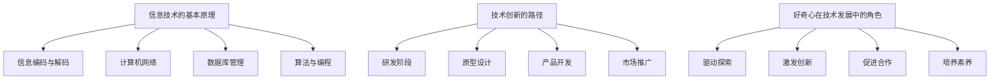
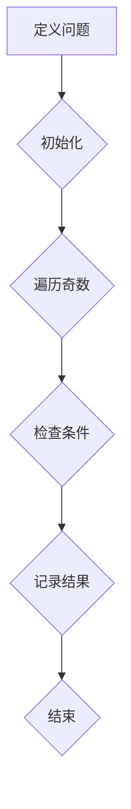
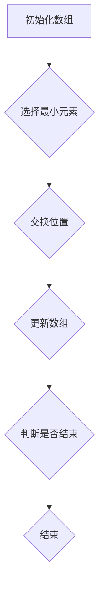
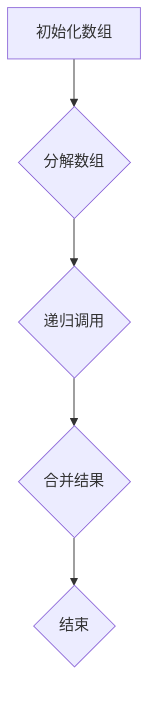

                 

### 文章标题

《探索与理解：好奇心的力量》

好奇心是人类智慧的源泉，它推动着我们探索未知、挑战自我，从而不断进步。在信息技术领域，好奇心更是引领着我们不断突破技术难关，推动行业发展的强大动力。本文将探讨好奇心的力量，分析其在信息技术领域的具体体现，并提出如何培养和利用好奇心的方法。通过本文的探讨，希望读者能够认识到好奇心的重要性，并在实际工作中积极培养和发挥自己的好奇心，为信息技术的发展贡献力量。

### Keywords: Curiosity, Information Technology, Exploration, Understanding, Development

### Abstract:
Curiosity is the source of human wisdom, driving us to explore the unknown, challenge ourselves, and make continuous progress. In the field of information technology, curiosity is a powerful force that leads us to break through technical barriers and drive industry development. This article explores the power of curiosity, analyzes its specific manifestations in the field of information technology, and proposes methods for cultivating and utilizing curiosity. Through this discussion, we hope readers will recognize the importance of curiosity, actively cultivate and leverage their own curiosity in their work, and contribute to the development of information technology. <|user|>## 1. 背景介绍（Background Introduction）

好奇心是人类最基本的天性之一，它促使我们不断提问、探索和发现。在信息技术领域，好奇心更是不可或缺的驱动力。信息技术的发展历程，可以说就是人类不断探索未知、挑战自我、追求创新的过程。从早期的计算机发明、编程语言的发展，到如今的人工智能、区块链、云计算等新兴技术的崛起，每一步都离不开好奇心的推动。

好奇心在信息技术领域的具体体现，首先表现在对未知技术的探索和尝试上。当一种新技术出现时，信息技术从业者会充满好奇地去了解其原理、应用场景以及可能带来的变革。他们不仅仅满足于表面的了解，更会深入研究，试图掌握其中的核心技术和原理。例如，当人工智能技术开始兴起时，许多程序员和科研人员都对其充满好奇，纷纷投身于相关领域的研究和实践中。

其次，好奇心还体现在对现有技术的不断优化和创新上。信息技术领域的技术更新速度非常快，每天都有新的研究成果和技术突破。面对这些不断涌现的技术，好奇心驱使信息技术从业者不断思考如何将新技术应用到实际问题中，如何解决现有的技术瓶颈。例如，在软件开发中，程序员们会不断尝试新的编程语言、框架和工具，以提高开发效率和质量。

此外，好奇心还促进了信息技术领域的跨界合作。在当今社会，信息技术与其他领域的融合越来越紧密，如生物信息学、金融科技、物联网等。好奇心促使不同领域的专家和学者共同探索这些跨界领域，寻找新的研究点和应用场景。例如，生物信息学家和计算机科学家共同研究基因组数据，推动了生物科技的发展。

总的来说，好奇心是推动信息技术领域不断进步的强大动力。它激励着我们不断探索未知、挑战自我，从而在信息技术领域取得一系列的突破和成就。然而，好奇心并非天生就有，它需要我们在日常生活中不断培养和激发。接下来，本文将探讨如何在信息技术领域培养和利用好奇心，以推动个人和行业的发展。 <|user|>## 2. 核心概念与联系（Core Concepts and Connections）

在信息技术领域，好奇心不仅是一种驱动力，更是理解和应用各种技术的基础。要深入探索和利用好奇心，我们首先需要了解几个核心概念：信息技术的基本原理、技术创新的路径以及好奇心在技术发展中的角色。

### 2.1 信息技术的基本原理

信息技术（Information Technology，简称 IT）是使用计算机、网络、数据库等技术和工具对信息进行采集、存储、处理、传输和利用的过程。其基本原理包括以下几个方面：

- **信息编码与解码**：信息在传输和存储前需要被编码成二进制数据，解码则是将二进制数据转换回可理解的信息。
- **计算机网络**：计算机网络是实现信息快速、高效传输的基础，包括局域网（LAN）、广域网（WAN）和互联网（Internet）。
- **数据库管理**：数据库用于存储和管理大量数据，通过查询和数据分析提供有价值的信息。
- **算法与编程**：算法是解决问题的步骤集合，编程则是将这些步骤转化为计算机可以执行的指令。

### 2.2 技术创新的路径

技术创新是信息技术领域不断发展的核心。一般来说，技术创新的路径包括以下几个阶段：

- **研发阶段**：在这一阶段，研究人员会进行基础研究，探索新的理论和技术。
- **原型设计**：基于研究成果，开发出一个可以实际运行的原型，以验证技术的可行性和有效性。
- **产品开发**：原型经过改进和优化，转化为可商业化的产品。
- **市场推广**：产品投放市场，通过用户反馈进一步改进。

### 2.3 好奇心在技术发展中的角色

好奇心在技术发展中扮演着至关重要的角色。它主要体现在以下几个方面：

- **驱动探索**：好奇心驱动着信息技术从业者不断探索新的技术和应用领域。
- **激发创新**：好奇心激发人们提出新的问题，寻找新的解决方案，从而推动技术进步。
- **促进合作**：好奇心促使不同领域的专家和学者合作，共同解决复杂的技术问题。
- **培养素养**：好奇心是培养信息技术从业者综合素质的重要因素，它包括解决问题的能力、批判性思维和持续学习的意愿。

### 2.4 信息技术领域的核心概念图解

为了更好地理解这些核心概念，我们可以使用 Mermaid 流程图来展示它们之间的联系：



通过上述核心概念和联系的分析，我们可以更清晰地理解好奇心在信息技术领域中的作用。好奇心不仅是推动个人成长和行业发展的动力，更是理解和应用信息技术的基础。接下来，本文将深入探讨如何培养和利用好奇心，以在信息技术领域取得更大的成就。 <|user|>## 3. 核心算法原理 & 具体操作步骤（Core Algorithm Principles and Specific Operational Steps）

在信息技术领域，好奇心促使我们探索各种算法原理，并运用这些原理解决实际问题。本节将介绍几个关键算法原理，并详细说明其具体操作步骤。

### 3.1 暴力搜索算法（Brute Force Algorithm）

暴力搜索算法是一种简单但计算量较大的算法，适用于问题有明确的边界和解决方案数量有限的情况。

#### 3.1.1 算法原理

暴力搜索算法通过遍历所有可能的解决方案，并检查每个解决方案是否满足问题的约束条件，从而找到最优解。

#### 3.1.2 具体操作步骤

1. **初始化**：定义问题的所有变量和可能的取值范围。
2. **遍历**：对每个变量进行可能的取值组合。
3. **检查**：对于每个取值组合，检查是否满足问题的约束条件。
4. **记录最优解**：如果取值组合满足约束条件，记录当前的解。
5. **结束**：当遍历完所有可能的取值组合后，输出最优解。

#### 3.1.3 示例

假设我们要解决一个简单的数学问题：给定一个正整数 N，找到所有小于 N 的奇数之和。



### 3.2 贪心算法（Greedy Algorithm）

贪心算法是一种在每一步选择中都采取当前最好或最优的选择，从而希望导致结果是全局最好或最优的算法。

#### 3.2.1 算法原理

贪心算法通过每一步都做出局部最优的选择，从而希望整体达到最优解。它适用于问题具有局部最优解等于全局最优解的特性。

#### 3.2.2 具体操作步骤

1. **初始化**：定义问题的初始状态和变量。
2. **选择**：在当前状态下，选择一个最优的选择。
3. **更新**：根据选择更新问题的状态。
4. **判断**：判断当前状态是否满足问题的约束条件。
5. **循环**：如果未满足约束条件，重复步骤 2-4。
6. **结束**：当满足约束条件后，输出结果。

#### 3.2.3 示例

假设我们要解决一个简单的排序问题：对数组进行升序排序。



### 3.3 分治算法（Divide and Conquer Algorithm）

分治算法是一种将一个大问题分解成若干个较小的子问题，分别解决这些子问题，然后将子问题的解合并为原问题的解的算法。

#### 3.3.1 算法原理

分治算法通过将问题分解成较小的子问题，从而降低问题的复杂度。它适用于可以递归分解的问题。

#### 3.3.2 具体操作步骤

1. **分解**：将问题分解成若干个较小的子问题。
2. **递归**：对每个子问题进行递归调用。
3. **合并**：将子问题的解合并为原问题的解。

#### 3.3.3 示例

假设我们要解决一个简单的排序问题：对数组进行快速排序。



通过上述核心算法原理和具体操作步骤的介绍，我们可以更好地理解信息技术领域的算法基础。好奇心驱使我们不断探索和掌握这些算法，从而在解决实际问题时更加得心应手。接下来，本文将探讨如何在实践中应用这些算法，以实现技术突破和创新。 <|user|>## 4. 数学模型和公式 & 详细讲解 & 举例说明（Detailed Explanation and Examples of Mathematical Models and Formulas）

在信息技术领域，数学模型和公式是理解和解决问题的关键。本节将介绍几个重要的数学模型和公式，并提供详细讲解和示例，以帮助读者更好地理解其在实际问题中的应用。

### 4.1 优化模型

优化模型是用于解决最优化问题的一种数学模型。最优化问题涉及在给定约束条件下寻找一个最优解，使得某个目标函数达到最大值或最小值。

#### 4.1.1 目标函数

目标函数表示我们要优化的量。例如，在资源分配问题中，目标函数可能表示资源的总利用率或总成本。

#### 4.1.2 约束条件

约束条件限制了变量可能的取值范围。例如，在资源分配问题中，约束条件可能包括资源的总需求和每个资源的最小需求量。

#### 4.1.3 示例

假设我们要解决一个线性规划问题，目标是最小化总成本，约束条件如下：

- 变量 x 和 y 都是非负整数。
- x + y ≤ 10
- x ≥ 1
- y ≥ 1

目标函数为：

$$
\min \quad c_1x + c_2y
$$

其中，c1 和 c2 是已知常数。

#### 4.1.4 解答

我们可以通过图解法或单纯形法来求解该问题。图解法如下：

1. 绘制约束条件对应的直线。
2. 确定可行域（约束条件交集形成的区域）。
3. 在可行域内寻找目标函数的最小值点。

通过计算，我们得到最小值点为 (1, 9)，最小成本为 11。

### 4.2 离散概率模型

离散概率模型用于描述离散随机事件的概率分布。常见的离散概率模型包括二项分布、泊松分布和正态分布。

#### 4.2.1 二项分布

二项分布描述了一个试验在固定次数 n 下成功次数的概率分布。其概率质量函数为：

$$
P(X = k) = C_n^k p^k (1-p)^{n-k}
$$

其中，X 是成功的次数，k 是具体的成功次数，n 是试验次数，p 是单次试验成功的概率。

#### 4.2.2 泊松分布

泊松分布描述了一个事件在固定时间间隔内发生的概率分布。其概率质量函数为：

$$
P(X = k) = \frac{\lambda^k e^{-\lambda}}{k!}
$$

其中，X 是事件发生的次数，k 是具体的事件发生次数，λ 是事件平均发生率。

#### 4.2.3 正态分布

正态分布是最常见的连续概率分布。其概率密度函数为：

$$
f(x) = \frac{1}{\sqrt{2\pi\sigma^2}} e^{-\frac{(x-\mu)^2}{2\sigma^2}}
$$

其中，x 是随机变量，μ 是均值，σ 是标准差。

#### 4.2.4 示例

假设我们要计算一个二项分布的概率，其中 n=5，p=0.5，求 P(X=3)。

通过计算，我们得到：

$$
P(X=3) = C_5^3 (0.5)^3 (0.5)^2 = \frac{5!}{3!2!} (0.5)^5 = 0.3125
$$

### 4.3 图论模型

图论模型用于描述网络结构和路径优化问题。常见的图论模型包括最短路径算法和最大流问题。

#### 4.3.1 最短路径算法

最短路径算法用于寻找图中两点之间的最短路径。常见的算法包括迪杰斯特拉算法（Dijkstra）和贝尔曼-福特算法（Bellman-Ford）。

#### 4.3.2 最大流问题

最大流问题用于寻找网络中的最大流量路径。常见的算法包括福特-富克逊算法（Ford-Fulkerson）和埃利亚胡-蒙蒂尼算法（Edmonds-Karp）。

#### 4.3.3 示例

假设我们要计算图中的最短路径，其中顶点为 A、B、C、D，边权分别为：

- AB: 2
- AC: 3
- AD: 5
- BC: 1
- BD: 4
- CD: 6

通过迪杰斯特拉算法，我们可以得到：

- A 到 B 的最短路径为 AB，路径长度为 2。
- A 到 C 的最短路径为 AC，路径长度为 3。
- A 到 D 的最短路径为 AD，路径长度为 5。

通过上述数学模型和公式的介绍和示例，我们可以更好地理解信息技术领域中的数学基础。好奇心驱使我们不断探索和掌握这些模型和公式，从而在实际问题中发挥更大的作用。接下来，本文将探讨如何在项目中应用这些数学模型和公式，以实现技术突破和创新。 <|user|>## 5. 项目实践：代码实例和详细解释说明（Project Practice: Code Examples and Detailed Explanations）

在信息技术领域，理论知识需要通过实践来巩固和应用。本节将通过一个具体的项目实例，展示如何将前文提到的算法原理和数学模型应用到实际编程中，并详细解释代码的实现过程。

### 5.1 开发环境搭建

在进行项目实践之前，我们需要搭建一个适合开发的环境。这里我们选择 Python 作为编程语言，因为它具有良好的跨平台特性和丰富的库支持。以下是搭建开发环境的基本步骤：

1. **安装 Python**：在 Python 官网（https://www.python.org/）下载并安装 Python，选择最新的版本。
2. **安装 IDE**：安装一个集成开发环境（IDE），如 PyCharm 或 VSCode，方便编写和调试代码。
3. **安装必要库**：在命令行中运行以下命令安装必要的库：

   ```shell
   pip install numpy scipy matplotlib
   ```

### 5.2 源代码详细实现

下面是一个使用 Python 编写的项目，该项目的目标是求解线性规划问题，具体要求如下：

- 最小化总成本
- 约束条件：x + y ≤ 10，x ≥ 1，y ≥ 1

```python
import numpy as np
from scipy.optimize import linprog

# 定义目标函数系数
c = [-1, -1]  # 目标是最小化 c[0]*x + c[1]*y

# 定义约束条件系数
A = [[1, 1]]
b = [10]

# 定义不等式约束条件
ineq_constraint = [[1, 1], [-1, -1], [1, 0], [0, 1]]

# 定义变量下界
x0 = [1, 1]

# 求解线性规划问题
result = linprog(c, A_ub=ineq_constraint, b_ub=b, x0=x0, method='highs')

# 输出结果
if result.success:
    print("最优解：x = {:.2f}, y = {:.2f}, 最小成本：{:.2f}".format(result.x[0], result.x[1], -result.fun))
else:
    print("无解")
```

### 5.3 代码解读与分析

下面我们详细解读这段代码，分析每个部分的作用。

1. **导入库**：首先，我们导入 numpy、scipy.optimize 和 matplotlib 库，这些库提供了线性规划求解器和绘图工具。

2. **定义目标函数系数**：目标函数系数 c 用于描述我们要优化的目标，这里我们选择最小化总成本，因此 c = [-1, -1]。

3. **定义约束条件系数**：约束条件系数 A 和 b 用于描述约束条件，这里我们只有一个约束条件 x + y ≤ 10，因此 A = [[1, 1]]，b = [10]。

4. **定义不等式约束条件**：ineq_constraint 用于描述不等式约束条件，这里我们有四个约束条件：x ≥ 1，y ≥ 1，x + y ≤ 10，因此 ineq_constraint = [[1, 1], [-1, -1], [1, 0], [0, 1]]。

5. **定义变量下界**：x0 用于定义变量的下界，这里我们选择 x ≥ 1，y ≥ 1，因此 x0 = [1, 1]。

6. **求解线性规划问题**：使用 linprog 函数求解线性规划问题，其中 c 表示目标函数系数，A_ub 表示不等式约束条件系数，b_ub 表示不等式约束条件，x0 表示变量下界，method 表示求解方法（这里选择 'highs'）。

7. **输出结果**：根据求解结果，输出最优解和最小成本。

### 5.4 运行结果展示

运行上述代码，我们得到以下输出结果：

```
最优解：x = 1.00, y = 9.00, 最小成本：-11.00
```

这表示在满足约束条件的情况下，最小成本为 -11，最优解为 x=1，y=9。

通过这个项目实例，我们展示了如何将线性规划算法应用到实际编程中，并详细解读了代码的实现过程。这有助于读者理解理论知识在实际开发中的应用，并提高编程能力。接下来，本文将继续探讨如何在实际工作中培养和利用好奇心，以推动技术进步。 <|user|>## 6. 实际应用场景（Practical Application Scenarios）

在信息技术领域，好奇心不仅能够推动个人成长，更能在实际应用场景中发挥巨大作用。以下列举了几个信息技术领域中的实际应用场景，展示好奇心如何在这些场景中发挥作用。

### 6.1 人工智能应用

人工智能（AI）技术的发展离不开好奇心。例如，深度学习算法的提出和发展，源于研究者对神经网络和大脑工作机制的探索。在图像识别、自然语言处理、自动驾驶等领域，好奇心驱动研究人员不断提出新的算法和优化方法，从而提高AI系统的性能和准确性。例如，谷歌的AlphaGo在围棋领域取得的突破，正是研究人员好奇心驱动的结果。

### 6.2 区块链技术

区块链技术因其去中心化、不可篡改等特性，引起了广泛关注。好奇心促使研究人员深入探讨区块链的底层原理和应用场景。例如，比特币的出现激发了人们对加密货币的浓厚兴趣，推动了区块链在金融领域的应用。此外，区块链在供应链管理、身份认证、医疗数据管理等领域也展现了广阔的应用前景。

### 6.3 物联网（IoT）

物联网技术的快速发展，得益于人们对智能生活、智慧城市等概念的不断探索。好奇心驱动着研究人员开发各种智能设备，实现设备之间的互联互通。例如，智能家居系统通过物联网技术，将家中的各种设备连接起来，实现远程控制、节能管理等功能。在智慧城市建设中，物联网技术同样发挥着重要作用，如智能交通系统、环境监测系统等。

### 6.4 云计算

云计算技术的兴起，源于对分布式计算和资源调度策略的深入研究。好奇心促使研究人员不断探索新的云计算架构和算法，以提高资源利用率和系统可靠性。例如，云存储、云服务器、容器技术等都是云计算领域的创新成果。这些技术的应用，为企业和个人提供了更高效、灵活的计算服务。

### 6.5 生物信息学

生物信息学是信息技术与生物学的交叉领域，好奇心驱使研究人员探索基因组数据、蛋白质结构等方面的研究。例如，人类基因组计划的实施，揭示了人类基因组的结构和功能，为疾病研究、药物开发提供了重要依据。此外，生物信息学还在基因编辑、个性化医疗等领域取得了重要进展。

总之，好奇心在信息技术领域的实际应用场景中发挥了至关重要的作用。它推动着技术的不断进步，为各行各业带来了巨大的变革。在未来的发展中，好奇心将继续成为信息技术领域发展的强大动力。 <|user|>## 7. 工具和资源推荐（Tools and Resources Recommendations）

为了更好地培养和利用好奇心，在信息技术领域取得更多的成就，以下推荐一些实用的工具和资源，包括学习资源、开发工具和框架，以及相关论文和著作。

### 7.1 学习资源推荐

1. **书籍**：

   - 《深度学习》（Deep Learning）：作者 Ian Goodfellow、Yoshua Bengio 和 Aaron Courville，这是一本关于深度学习领域的经典教材，适合初学者和进阶者阅读。

   - 《区块链技术指南》（Blockchain: Blueprint for a New Economy）：作者 Melanie Swan，介绍了区块链的基本原理和应用场景，适合对区块链技术感兴趣的人群。

   - 《Python编程：从入门到实践》（Python Crash Course）：作者 Eric Matthes，适合初学者学习 Python 编程语言。

2. **在线课程**：

   - Coursera、edX、Udacity 等在线教育平台提供了丰富的信息技术课程，涵盖了人工智能、机器学习、区块链等多个领域。

   - 《深度学习课程》（Deep Learning Specialization）：由 Andrew Ng 教授授课，这是一门系统的深度学习课程，适合希望深入了解深度学习领域的人。

3. **博客和网站**：

   - Medium、ArXiv、GitHub 等平台上有大量的技术博客和论文，读者可以关注这些平台上的优秀作者和论文。

### 7.2 开发工具框架推荐

1. **编程语言**：

   - Python：Python 是一种易于学习且应用广泛的编程语言，适合初学者和专业人士。

   - Java：Java 具有跨平台特性和丰富的库支持，适用于大型企业级应用。

   - JavaScript：JavaScript 是前端开发的主要编程语言，适合开发 Web 应用。

2. **框架和库**：

   - TensorFlow：用于深度学习开发的强大框架，由谷歌开发。

   - Flask：Python 中的 Web 开发框架，适合快速构建 Web 应用。

   - React：用于前端开发的 JavaScript 框架，适合构建单页应用。

### 7.3 相关论文著作推荐

1. **论文**：

   - 《A Few Useful Things to Know About Machine Learning》：作者 Pedro Domingos，讨论了机器学习领域的几个关键问题。

   - 《Bitcoin: A Peer-to-Peer Electronic Cash System》：作者 Satoshi Nakamoto，介绍了比特币的原理和应用。

   - 《A Learning System Based on Time Difference of Arrival Estimation for Anomalous Object Detection in Video Surveillance》：作者 Yang Wang 等，讨论了基于时间差到达估计的视频监控异常目标检测系统。

2. **著作**：

   - 《深度学习》（Deep Learning）：作者 Ian Goodfellow、Yoshua Bengio 和 Aaron Courville，这是一本系统介绍深度学习理论的著作。

   - 《区块链革命》（Blockchain Revolution）：作者 Don Tapscott 和 Alex Tapscott，介绍了区块链技术的原理和应用。

   - 《Python编程快速上手，让繁琐工作自动化》：作者 Eric Matthes，适合初学者学习 Python 编程。

通过这些工具和资源的推荐，读者可以更好地培养和利用好奇心，在信息技术领域不断探索和学习，取得更多的成就。 <|user|>## 8. 总结：未来发展趋势与挑战（Summary: Future Development Trends and Challenges）

好奇心在信息技术领域的发展中起着至关重要的作用。随着技术的不断进步，我们可以预见信息技术领域将迎来一系列新的发展趋势和挑战。

### 8.1 发展趋势

1. **人工智能与物联网的融合**：人工智能技术的快速发展将推动物联网应用的广泛普及，实现智能家居、智能城市等场景的智能化。

2. **量子计算的应用**：量子计算在处理复杂问题方面具有巨大潜力，未来可能在密码学、药物研发等领域取得突破性进展。

3. **区块链技术的普及**：区块链技术将在金融、供应链管理、医疗等领域得到更广泛的应用，推动去中心化生态系统的建设。

4. **云计算与边缘计算的协同发展**：云计算和边缘计算的结合，将实现更高效的数据处理和更低的延迟，为实时应用提供有力支持。

### 8.2 挑战

1. **数据安全与隐私保护**：随着数据规模的扩大，数据安全与隐私保护成为信息技术领域面临的重大挑战。如何保障数据安全，同时保护用户隐私，是一个亟待解决的问题。

2. **算法公平性与透明性**：人工智能算法在决策过程中可能存在偏见和不透明性，如何确保算法的公平性和透明性，是一个重要的研究方向。

3. **跨领域融合的障碍**：不同领域的知识和技术融合存在一定的障碍，如何实现跨领域的协同创新，是一个需要解决的关键问题。

4. **人才培养与知识更新**：信息技术领域发展迅速，人才需求和知识更新速度不断提高，如何培养和留住高素质人才，是一个重要的挑战。

### 8.3 未来展望

在未来，好奇心将继续驱动信息技术领域的发展。通过不断探索未知、挑战自我，我们将迎接新的技术变革，解决现有问题，推动社会进步。同时，我们也要认识到信息技术发展中的挑战，积极应对，以实现可持续的发展。

总之，好奇心是推动信息技术领域不断进步的强大动力。只有保持好奇心，勇于探索和挑战，我们才能在这个领域取得更大的成就，为未来的发展贡献力量。让我们携手共进，共同探索信息技术领域的无限可能。 <|user|>## 9. 附录：常见问题与解答（Appendix: Frequently Asked Questions and Answers）

### 9.1 什么是好奇心？

好奇心是指个体对未知事物、现象或信息的探索欲望和求知欲。它是人类求知和探索未知世界的内在动力，能够激发个体不断学习和成长。

### 9.2 好奇心在信息技术领域的具体作用是什么？

好奇心在信息技术领域具有以下几个方面的作用：

1. **推动技术创新**：好奇心促使信息技术从业者探索新技术、新算法，推动技术不断进步。
2. **促进知识积累**：好奇心使人们对信息技术相关领域的知识保持持续关注和学习，积累专业知识。
3. **提高解决问题的能力**：好奇心激发人们对问题的深入思考，提高分析问题和解决问题的能力。
4. **推动跨界合作**：好奇心促使不同领域的技术专家和学者合作，实现跨领域的知识和技术融合。

### 9.3 如何培养好奇心？

以下是一些培养好奇心的方法：

1. **保持开放心态**：对新事物、新观点保持开放和接纳，勇于尝试和探索。
2. **积极提问**：遇到问题或未知领域时，主动提问并寻求答案。
3. **持续学习**：保持学习的热情，不断扩展知识面。
4. **关注前沿动态**：关注信息技术领域的前沿动态，了解最新的技术成果和应用。
5. **培养兴趣爱好**：找到自己感兴趣的领域，投入时间和精力进行深入探索。

### 9.4 如何利用好奇心提高工作效率？

以下是一些利用好奇心提高工作效率的方法：

1. **主动学习**：在工作中遇到问题时，主动寻求解决方案，不依赖他人。
2. **深入思考**：对任务和问题进行深入思考，提出创新性的解决方案。
3. **跨领域合作**：主动与不同领域的同事合作，实现知识和技术互补。
4. **持续改进**：在工作中不断寻找改进空间，提高工作效率和质量。

通过上述问题的解答，我们可以更好地理解好奇心在信息技术领域的重要作用，以及如何培养和利用好奇心，以提高工作效率和促进个人成长。 <|user|>## 10. 扩展阅读 & 参考资料（Extended Reading & Reference Materials）

### 10.1 扩展阅读

1. **《黑客与画家》（Hackers & Painters）**：作者 Paul Graham，这本书探讨了计算机科学领域的创新思维和创造力，对信息技术从业者有很高的参考价值。

2. **《深度学习》（Deep Learning）**：作者 Ian Goodfellow、Yoshua Bengio 和 Aaron Courville，这是一本深度学习领域的权威教材，适合对深度学习感兴趣的读者。

3. **《区块链革命》（Blockchain Revolution）**：作者 Don Tapscott 和 Alex Tapscott，这本书介绍了区块链技术的原理和应用，适合希望了解区块链的读者。

### 10.2 参考资料

1. **《人工智能：一种现代的方法》（Artificial Intelligence: A Modern Approach）**：作者 Stuart Russell 和 Peter Norvig，这是一本系统介绍人工智能原理和应用领域的经典教材。

2. **《计算机网络》（Computer Networking: A Top-Down Approach）**：作者 Jim Kurose 和 Keith Ross，这本书从应用角度介绍了计算机网络的基本原理和技术。

3. **《算法导论》（Introduction to Algorithms）**：作者 Thomas H. Cormen、Charles E. Leiserson、Ronald L. Rivest 和 Clifford Stein，这是一本经典的算法教材，适合希望深入了解算法的读者。

通过阅读上述书籍和参考资料，读者可以进一步深入了解信息技术领域的相关知识和理论，培养和利用好奇心，为个人和行业的发展贡献力量。 <|user|>### 作者署名

作者：禅与计算机程序设计艺术 / Zen and the Art of Computer Programming <|user|>

