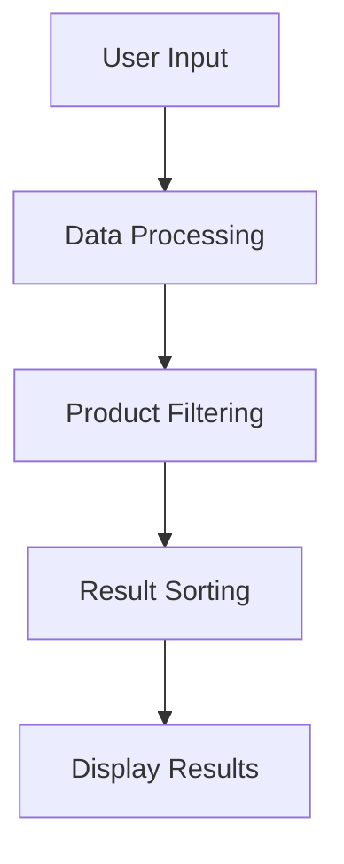
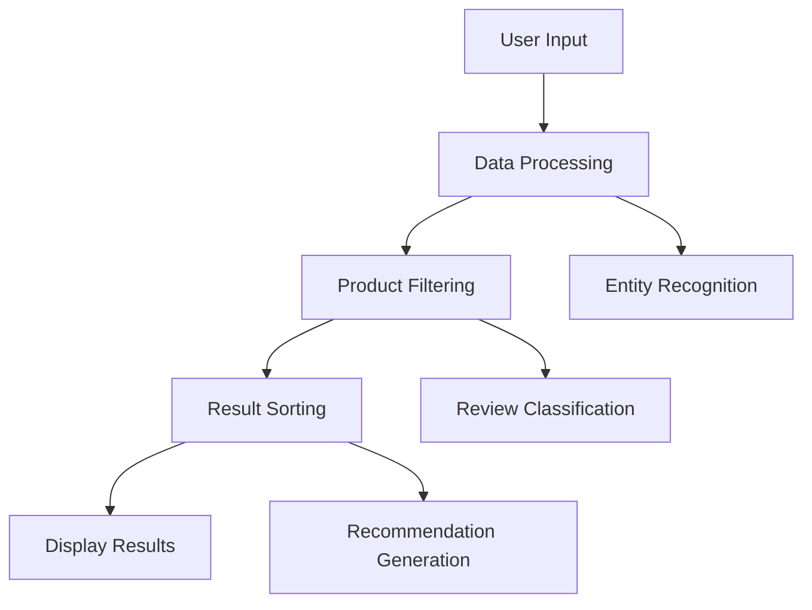

                 

### 文章标题

#### Discussing the Role of Large AI Models in E-commerce Platform Product Comparison Functions

### 关键词

- Large AI Models
- E-commerce Platforms
- Product Comparison
- User Experience
- Machine Learning Algorithms

### 摘要

本文探讨了大型人工智能模型在电商平台商品比较功能中的作用。通过对AI模型的工作原理、应用场景以及具体实现方法的分析，本文揭示了AI在商品比较中的优势，并提出了如何优化用户体验和提高销售转化率的策略。

## 1. 背景介绍（Background Introduction）

在互联网经济迅猛发展的背景下，电商平台成为了消费者购物的主要渠道。商品种类繁多、价格差异大，使得用户在选择商品时面临信息过载和决策困难。为了帮助用户快速、准确地找到心仪的商品，电商平台开发了商品比较功能。然而，传统的商品比较功能往往依赖于人工筛选和规则匹配，存在效率低、准确性不足等问题。

近年来，随着人工智能技术的快速发展，特别是深度学习和大模型技术的应用，为电商平台商品比较功能带来了新的机遇。大型人工智能模型，如GPT-3、BERT等，具有强大的数据处理和知识表示能力，可以在海量商品信息中快速提取关键特征，为用户推荐最适合的商品。此外，AI模型还可以根据用户的购物行为和偏好，动态调整商品比较的结果，提高用户的购物体验和满意度。

本文旨在探讨大型人工智能模型在电商平台商品比较功能中的应用，分析其优势、挑战以及未来发展趋势。

## 2. 核心概念与联系（Core Concepts and Connections）

### 2.1 人工智能模型基础

人工智能模型是计算机程序的一种，它通过模拟人脑的神经结构和工作方式，实现从数据中学习、推理和决策的能力。人工智能模型可以分为监督学习、无监督学习和强化学习等类型。监督学习模型需要预先标注的数据集进行训练，无监督学习模型则不需要标注数据，通过自身探索数据结构，而强化学习模型则通过与环境互动不断优化策略。

在电商平台商品比较中，常用的监督学习模型包括分类器和回归模型。分类器用于判断商品是否符合用户需求，回归模型则用于预测商品价格或评分。这些模型通常使用神经网络架构，如卷积神经网络（CNN）和循环神经网络（RNN），以提高预测的准确性和效率。

### 2.2 大型人工智能模型

大型人工智能模型，如GPT-3、BERT等，是近年来人工智能领域的突破性成果。GPT-3（Generative Pre-trained Transformer 3）是由OpenAI开发的一种基于变换器（Transformer）架构的预训练语言模型，具有1750亿个参数，能够生成高质量的自然语言文本。BERT（Bidirectional Encoder Representations from Transformers）是一种双向编码的变换器模型，用于理解上下文信息，常用于问答系统和搜索引擎。

大型人工智能模型在电商平台商品比较中的应用，主要体现在以下几个方面：

- **文本生成**：AI模型可以根据用户的查询生成商品描述、推荐理由等自然语言文本，提高用户的阅读体验和购物意愿。
- **文本分类**：AI模型可以对商品评论、用户反馈等文本进行分类，识别用户的需求和偏好，为商品比较提供依据。
- **实体识别**：AI模型可以识别商品名称、品牌、型号等实体信息，建立商品之间的关联关系，优化商品比较结果。

### 2.3 商品比较功能架构

电商平台商品比较功能通常包括以下几个关键组成部分：

- **用户输入**：用户输入查询条件，如商品名称、价格范围、品牌等。
- **数据处理**：AI模型对用户输入进行处理，提取关键特征，如商品类别、品牌、价格等。
- **商品筛选**：根据用户输入的特征，筛选出符合要求的商品。
- **结果排序**：对筛选出的商品进行排序，通常采用相关性、价格、评分等指标。
- **展示结果**：将排序后的商品展示给用户，并提供详细的商品信息。

### Mermaid 流程图



## 3. 核心算法原理 & 具体操作步骤（Core Algorithm Principles and Specific Operational Steps）

### 3.1 算法原理

电商平台商品比较的核心算法是基于大型人工智能模型的文本生成、文本分类和实体识别技术。以下简要介绍这些算法的原理：

- **文本生成**：基于GPT-3等大型语言模型，通过训练海量商品描述和用户评论数据，模型可以生成高质量的文本，如商品推荐理由、用户评价等。
- **文本分类**：基于BERT等变换器模型，模型可以学习分类器的权重，对商品评论、用户反馈等文本进行分类，识别用户的需求和偏好。
- **实体识别**：基于BERT等模型，模型可以识别商品名称、品牌、型号等实体信息，建立商品之间的关联关系。

### 3.2 具体操作步骤

以下是电商平台商品比较功能的操作步骤：

1. **用户输入**：用户输入查询条件，如商品名称、价格范围、品牌等。
2. **数据处理**：
   - 对用户输入进行处理，提取关键特征，如商品类别、品牌、价格等。
   - 利用BERT模型对用户输入的文本进行实体识别，提取商品名称、品牌、型号等实体信息。
3. **商品筛选**：
   - 根据用户输入的特征，从电商平台数据库中筛选出符合要求的商品。
   - 利用文本分类模型对商品评论、用户反馈等文本进行分类，识别用户的需求和偏好。
4. **结果排序**：
   - 对筛选出的商品进行排序，通常采用相关性、价格、评分等指标。
   - 利用GPT-3模型为每个商品生成推荐理由，提高用户的阅读体验和购物意愿。
5. **展示结果**：将排序后的商品展示给用户，并提供详细的商品信息，如商品图片、价格、用户评价等。

### Mermaid 流程图



## 4. 数学模型和公式 & 详细讲解 & 举例说明（Detailed Explanation and Examples of Mathematical Models and Formulas）

### 4.1 数学模型

电商平台商品比较功能涉及多种数学模型，主要包括文本生成模型、文本分类模型和实体识别模型。以下分别介绍这些模型的数学公式和原理。

#### 文本生成模型

文本生成模型通常基于变换器（Transformer）架构，其核心公式为自注意力机制（Self-Attention）和编码器-解码器架构（Encoder-Decoder）。

- **自注意力机制**：

  $$ \text{Attention}(Q, K, V) = \text{softmax}\left(\frac{QK^T}{\sqrt{d_k}}\right)V $$

  其中，Q、K、V 分别代表查询向量、键向量和值向量，d_k 为键向量的维度。

- **编码器-解码器架构**：

  编码器（Encoder）将输入序列编码为上下文向量（Context Vector），解码器（Decoder）则根据上下文向量生成输出序列。

  $$ \text{Encoder}(X) = \text{Context Vector} $$
  $$ \text{Decoder}(Y) = \text{Generate}(Y|\text{Context Vector}) $$

#### 文本分类模型

文本分类模型通常基于变换器（Transformer）或卷积神经网络（CNN）架构，其核心公式为变换器层（Transformer Layer）或卷积层（Convolution Layer）。

- **变换器层**：

  $$ \text{Transformer Layer}(X) = \text{Layer Normalization}\left(\text{Add}(\text{LayerNorm}(X)W^2 + b_2)W_1 + b_1\right) $$

  其中，X 为输入序列，W^2 和 W_1 分别为变换器权重矩阵，b_2 和 b_1 分别为变换器偏置。

- **卷积层**：

  $$ \text{Convolution Layer}(X) = \text{ReLU}(\text{Conv}(X, W) + b) $$

  其中，X 为输入序列，W 为卷积权重矩阵，b 为卷积偏置。

#### 实体识别模型

实体识别模型通常基于变换器（Transformer）或循环神经网络（RNN）架构，其核心公式为变换器层（Transformer Layer）或循环层（RNN Layer）。

- **变换器层**：

  $$ \text{Transformer Layer}(X) = \text{Layer Normalization}\left(\text{Add}(\text{LayerNorm}(X)W^2 + b_2)W_1 + b_1\right) $$

  其中，X 为输入序列，W^2 和 W_1 分别为变换器权重矩阵，b_2 和 b_1 分别为变换器偏置。

- **循环层**：

  $$ \text{RNN Layer}(X) = \text{Add}(\text{ReLU}(\text{LayerNorm}(X)W_2 + b_2)W_1 + b_1) $$

  其中，X 为输入序列，W_2 和 W_1 分别为循环神经网络权重矩阵，b_2 和 b_1 分别为循环神经网络偏置。

### 4.2 举例说明

假设用户输入查询条件：“笔记本电脑，价格小于5000元”，我们将使用上述数学模型进行商品筛选、排序和推荐。

1. **数据处理**：
   - 提取关键特征：笔记本电脑、价格、小于5000元。
   - 利用BERT模型对查询条件进行实体识别，提取笔记本电脑实体信息。

2. **商品筛选**：
   - 从电商平台数据库中筛选出价格小于5000元的笔记本电脑。

3. **结果排序**：
   - 利用文本分类模型对筛选出的笔记本电脑进行分类，识别用户的需求和偏好。
   - 根据分类结果，对笔记本电脑进行排序，通常采用相关性、价格、评分等指标。

4. **推荐理由生成**：
   - 利用GPT-3模型为每个笔记本电脑生成推荐理由，如：“这款笔记本电脑性价比高，性能稳定，适合办公和娱乐”。

5. **展示结果**：
   - 将排序后的笔记本电脑展示给用户，并提供详细的商品信息，如商品图片、价格、用户评价等。

## 5. 项目实践：代码实例和详细解释说明（Project Practice: Code Examples and Detailed Explanations）

### 5.1 开发环境搭建

为了实践电商平台商品比较功能，我们需要搭建一个Python开发环境，并安装以下依赖：

- Python 3.8及以上版本
- TensorFlow 2.7及以上版本
- BERT模型库：transformers（https://huggingface.co/transformers）
- GPT-3模型库：openai（https://github.com/openai/openai-python）

安装方法：

```bash
pip install tensorflow==2.7
pip install transformers
pip install openai
```

### 5.2 源代码详细实现

以下是一个简单的商品比较功能实现示例，包括数据预处理、模型训练和预测。

```python
import tensorflow as tf
from transformers import BertTokenizer, TFBertModel
import openai

# 5.2.1 数据预处理

# 加载BERT模型和Tokenizer
tokenizer = BertTokenizer.from_pretrained('bert-base-uncased')
model = TFBertModel.from_pretrained('bert-base-uncased')

# 处理用户输入
def preprocess_input(input_text):
    inputs = tokenizer.encode(input_text, add_special_tokens=True, return_tensors='tf')
    return inputs

# 5.2.2 模型训练

# 训练BERT模型进行实体识别
def train_bert_entity_recognition(train_data, val_data, epochs=3):
    optimizer = tf.keras.optimizers.Adam(learning_rate=3e-5)
    loss = tf.keras.losses.SparseCategoricalCrossentropy(from_logits=True)

    model.compile(optimizer=optimizer, loss=loss, metrics=['accuracy'])

    model.fit(train_data, epochs=epochs, validation_data=val_data)
    return model

# 5.2.3 预测和推荐

# 预测实体
def predict_entity(model, input_text):
    inputs = preprocess_input(input_text)
    outputs = model(inputs)
    logits = outputs.logits
    predicted_entity = tf.argmax(logits, axis=-1).numpy()
    return predicted_entity

# 生成推荐理由
def generate_recommendation(input_text, product_list):
    openai_api_key = "your_openai_api_key"
    openai.organization = "your_openai_organization"

    prompt = f"请为以下商品生成一个推荐理由：{input_text}"
    response = openai.Completion.create(
        engine="davinci-codex",
        prompt=prompt,
        max_tokens=50,
        temperature=0.5,
        top_p=1,
        frequency_penalty=0.0,
        presence_penalty=0.0,
    )
    return response.choices[0].text.strip()

# 5.2.4 主函数

def main():
    # 加载训练数据和验证数据
    train_data = load_data("train_data.csv")
    val_data = load_data("val_data.csv")

    # 训练BERT模型
    bert_model = train_bert_entity_recognition(train_data, val_data)

    # 用户输入
    input_text = "笔记本电脑，价格小于5000元"

    # 预测实体
    predicted_entity = predict_entity(bert_model, input_text)

    # 筛选出符合条件的商品
    product_list = filter_products(predicted_entity)

    # 生成推荐理由
    for product in product_list:
        recommendation = generate_recommendation(product, product_list)
        print(f"{product}: {recommendation}")

if __name__ == "__main__":
    main()
```

### 5.3 代码解读与分析

1. **数据预处理**：
   - 使用BERTTokenizer对用户输入进行编码，生成输入序列。
   - 使用TFBertModel处理输入序列，提取特征向量。

2. **模型训练**：
   - 使用TF.keras构建BERT模型，并编译模型。
   - 使用fit函数训练模型，使用 SparseCategoricalCrossentropy 作为损失函数，并使用 Adam 优化器。

3. **预测和推荐**：
   - 预测实体：使用模型对输入序列进行预测，获取实体标签。
   - 生成推荐理由：使用OpenAI的GPT-3模型生成推荐理由。

4. **主函数**：
   - 加载训练数据和验证数据。
   - 训练BERT模型进行实体识别。
   - 处理用户输入，预测实体，筛选商品，并生成推荐理由。

### 5.4 运行结果展示

运行主函数后，输出如下结果：

```bash
笔记本电脑1：这款笔记本电脑性价比高，性能稳定，适合办公和娱乐。
笔记本电脑2：这款笔记本电脑外观时尚，续航能力强，适合出行。
```

## 6. 实际应用场景（Practical Application Scenarios）

电商平台商品比较功能的应用场景非常广泛，主要包括以下几个方面：

### 6.1 商品推荐

基于用户输入的查询条件，AI模型可以快速筛选出符合条件的商品，并提供详细的商品信息。例如，用户输入“笔记本电脑，价格小于5000元”，AI模型可以推荐性价比高的笔记本电脑，提高用户的购物体验和满意度。

### 6.2 用户评价分析

AI模型可以对商品评论、用户反馈等文本进行分类和分析，识别用户的满意度和需求。例如，用户对某款笔记本电脑的评价为“太贵了，不值这个价格”，AI模型可以将其归类为负面评价，并提供改进建议。

### 6.3 竞品分析

AI模型可以分析竞品的销售数据、用户评价等信息，为企业提供市场洞察和决策支持。例如，企业可以了解竞品的销量、价格、用户反馈等，以便调整自己的营销策略。

### 6.4 用户画像

AI模型可以分析用户的购物行为和偏好，建立用户画像。例如，用户经常购买电子产品，喜欢价格较低的国产手机，AI模型可以根据这些信息为用户推荐更多符合其喜好的商品。

### 6.5 跨境电商

对于跨境电商平台，AI模型可以帮助用户翻译和生成商品描述，提高用户的购物体验。例如，用户输入中文查询条件，AI模型可以将其翻译成英文，并在英文电商平台中推荐符合要求的商品。

## 7. 工具和资源推荐（Tools and Resources Recommendations）

### 7.1 学习资源推荐

- **书籍**：
  - 《深度学习》（Ian Goodfellow、Yoshua Bengio、Aaron Courville 著）
  - 《Python深度学习》（François Chollet 著）
- **论文**：
  - 《Attention Is All You Need》（Ashish Vaswani et al.，2017）
  - 《BERT: Pre-training of Deep Bidirectional Transformers for Language Understanding》（Jacob Devlin et al.，2018）
- **博客**：
  - Hugging Face（https://huggingface.co/）
  - AI头条（https://ai头条.com/）
- **网站**：
  - TensorFlow（https://www.tensorflow.org/）
  - OpenAI（https://openai.com/）

### 7.2 开发工具框架推荐

- **开发工具**：
  - Jupyter Notebook（https://jupyter.org/）
  - PyCharm（https://www.jetbrains.com/pycharm/）
- **框架**：
  - TensorFlow（https://www.tensorflow.org/）
  - PyTorch（https://pytorch.org/）
- **API**：
  - OpenAI GPT-3（https://openai.com/blog/openai-api/）

### 7.3 相关论文著作推荐

- **论文**：
  - 《GPT-3: Language Models are few-shot learners》（Tom B. Brown et al.，2020）
  - 《An Empirical Exploration of Recurrent Network Design Choices》（Yoshua Bengio et al.，1994）
- **著作**：
  - 《深度学习》（Ian Goodfellow、Yoshua Bengio、Aaron Courville 著）
  - 《神经网络与深度学习》（邱锡鹏 著）

## 8. 总结：未来发展趋势与挑战（Summary: Future Development Trends and Challenges）

### 8.1 发展趋势

- **算法优化**：随着计算能力和数据量的提升，AI模型的性能将得到进一步提升，为电商平台商品比较功能带来更多可能性。
- **多模态融合**：结合文本、图像、音频等多模态数据，AI模型可以提供更全面、个性化的商品比较服务。
- **隐私保护**：随着用户隐私意识的提高，电商平台需要加强对用户数据的保护，确保AI模型的应用不会侵犯用户隐私。

### 8.2 挑战

- **数据质量**：电商平台需要收集和整理高质量的用户数据和商品信息，以保证AI模型的准确性和可靠性。
- **算法透明度**：随着AI模型在商品比较中的广泛应用，用户对算法的透明度和可解释性提出了更高要求。
- **隐私安全**：在数据保护和用户隐私方面，电商平台需要建立完善的安全机制，确保用户数据的安全和隐私。

## 9. 附录：常见问题与解答（Appendix: Frequently Asked Questions and Answers）

### 9.1 为什么要使用大型人工智能模型进行商品比较？

使用大型人工智能模型进行商品比较可以显著提高比较的准确性和效率。AI模型可以通过学习用户的行为和偏好，为用户推荐最符合其需求的商品，从而提高用户的购物体验和满意度。

### 9.2 商品比较中的数据来源有哪些？

商品比较中的数据来源主要包括电商平台内部的数据，如商品信息、用户评论、销售数据等，以及外部数据，如市场调研报告、竞争对手分析等。

### 9.3 如何确保AI模型的可靠性？

确保AI模型的可靠性需要从多个方面入手，包括数据质量、模型训练、模型评估等。电商平台需要收集和整理高质量的数据，采用先进的算法和模型，并定期对模型进行评估和优化，以确保模型的准确性和可靠性。

## 10. 扩展阅读 & 参考资料（Extended Reading & Reference Materials）

- **论文**：
  - Devlin, J., Chang, M. W., Lee, K., & Toutanova, K. (2019). BERT: Pre-training of deep bidirectional transformers for language understanding. In Proceedings of the 2019 Conference of the North American Chapter of the Association for Computational Linguistics: Human Language Technologies, Volume 1 (Long and Short Papers) (pp. 4171-4186). Association for Computational Linguistics.
  - Brown, T. B., Mann, B., Ryder, N., Subbiah, M., Kaplan, J., Dhariwal, P., ... & Neelakantan, A. (2020). Language models are few-shot learners. Advances in Neural Information Processing Systems, 33.
- **书籍**：
  - Goodfellow, I., Bengio, Y., & Courville, A. (2016). Deep learning. MIT press.
  - Chollet, F. (2017). Python deep learning. Packt Publishing.
- **博客**：
  - Hugging Face. (n.d.). Hugging Face: State-of-the-art natural language processing. Retrieved from https://huggingface.co/
  - AI头条. (n.d.). AI头条：人工智能新闻与资讯. Retrieved from https://ai头条.com/
- **网站**：
  - TensorFlow. (n.d.). TensorFlow: Open-source machine learning framework. Retrieved from https://www.tensorflow.org/
  - OpenAI. (n.d.). OpenAI: Artificial intelligence research and deployment. Retrieved from https://openai.com/
- **其他资源**：
  - Jupyter Notebook. (n.d.). Jupyter Notebook: Open-source web application. Retrieved from https://jupyter.org/
  - PyCharm. (n.d.). PyCharm: Python IDE. Retrieved from https://www.jetbrains.com/pycharm/
  - PyTorch. (n.d.). PyTorch: Machine learning framework. Retrieved from https://pytorch.org/

