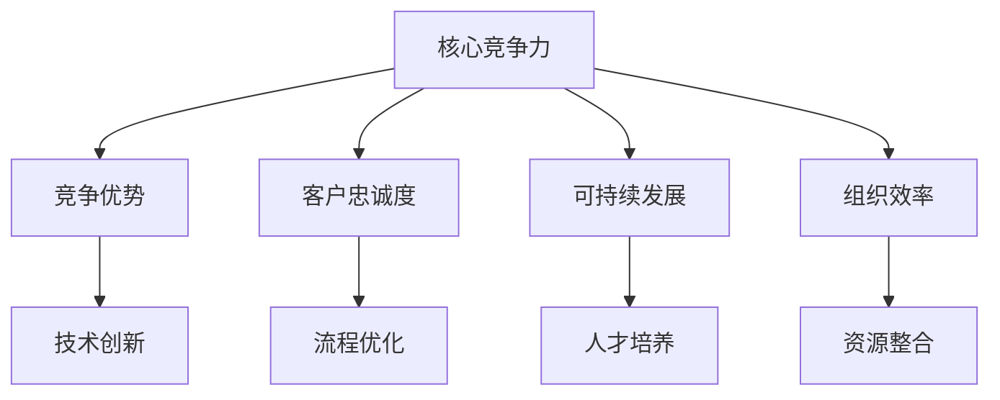

                 

# 文章标题：提升核心竞争力的生产力策略

> 关键词：核心竞争力、生产力策略、IT行业、技术提升、组织效率

> 摘要：本文旨在探讨在IT行业中，如何通过提升核心竞争力的生产力策略，来增强企业的竞争力和组织效率。我们将深入分析核心竞争力的重要性，并提出一系列实际可行的方法和工具，帮助读者在实践中有效地提升个人和团队的生产力。

## 1. 背景介绍（Background Introduction）

在当今快速发展的信息技术时代，企业面临着前所未有的竞争压力。技术更新换代的速度越来越快，市场需求的变化也越来越复杂。在这样的背景下，提升企业的核心竞争力成为企业持续发展的关键。核心竞争力不仅决定了企业在市场中的地位，也直接影响到组织的效率和生产率。

本文将围绕以下几个核心问题展开：

1. 核心竞争力究竟是什么？
2. 如何识别和评估企业的核心竞争力？
3. 企业应如何制定和实施提升核心竞争力的策略？
4. 在IT行业中，有哪些具体的实践方法和工具可以帮助提升生产力？

通过对这些问题的深入探讨，我们希望能够为读者提供一套系统、实用的提升核心竞争力的生产力策略。

## 2. 核心概念与联系（Core Concepts and Connections）

### 2.1 什么是核心竞争力？

核心竞争力是指企业能够持续提供独特价值的能力，这种能力使其在市场中具有竞争优势。核心竞争力通常具有以下几个特点：

- **独特性**：企业拥有独特的资源、技术和知识，难以被模仿或替代。
- **不可替代性**：企业的核心竞争力对于其业务成功至关重要，缺失这一能力将导致企业无法正常运营。
- **持久性**：企业的核心竞争力能够随着时间的推移而保持稳定和持续的发展。
- **扩展性**：企业的核心竞争力可以应用于不同的产品和服务，具有广泛的适用性。

### 2.2 核心竞争力的重要性

在激烈的市场竞争中，核心竞争力是企业立足的根本。它不仅能够帮助企业应对外部环境的挑战，还能在内部推动创新和变革。核心竞争力的重要性体现在以下几个方面：

- **竞争优势**：拥有强大核心竞争力的企业能够在市场中占据有利地位，获得更高的市场份额和利润率。
- **客户忠诚度**：企业的核心竞争力能够提供卓越的产品和服务，从而提高客户的满意度和忠诚度。
- **可持续发展**：通过不断提升核心竞争力，企业能够适应市场变化，实现可持续发展。
- **组织效率**：核心竞争力有助于优化企业的运营流程，提高工作效率和生产率。

### 2.3 核心竞争力与生产力的关系

核心竞争力与生产力密切相关。提升核心竞争力往往意味着对技术、流程、组织结构等方面进行优化和改进，这些改进直接提高了企业的生产力。具体来说：

- **技术创新**：通过研发和应用新技术，企业能够提高生产效率和产品质量，从而提升生产力。
- **流程优化**：优化业务流程，减少冗余环节，提高工作协同效率，有助于提升生产力。
- **人才培养**：重视人才培养和知识管理，提高员工技能和创新能力，有助于提升生产力。
- **资源整合**：通过合理配置和利用资源，提高资源利用率，有助于提升生产力。

### 2.4 Mermaid 流程图（Mermaid Flowchart）

以下是描述核心竞争力与生产力关系的 Mermaid 流程图：



## 3. 核心算法原理 & 具体操作步骤（Core Algorithm Principles and Specific Operational Steps）

### 3.1 核心算法原理

在提升核心竞争力过程中，核心算法原理扮演着关键角色。核心算法原理主要包括以下几个方面：

- **数据驱动的决策制定**：基于数据分析，识别业务中的瓶颈和改进机会，从而制定有针对性的提升策略。
- **敏捷开发**：采用敏捷开发方法，快速迭代和优化产品和服务，以满足市场需求。
- **持续集成与持续部署（CI/CD）**：通过自动化工具实现代码的持续集成和持续部署，提高开发效率和软件质量。
- **知识管理**：建立知识管理系统，促进知识的共享和传承，提高组织的学习能力。

### 3.2 具体操作步骤

为了提升核心竞争力，企业可以采取以下具体操作步骤：

1. **需求分析**：明确企业的发展目标和市场需求，识别提升核心竞争力的关键要素。
2. **资源调配**：根据需求分析的结果，合理配置企业的人力、物力和财力资源。
3. **技术创新**：投入资金和人力，研发和应用新技术，提高产品和服务的竞争力。
4. **流程优化**：对业务流程进行梳理和优化，减少冗余环节，提高工作协同效率。
5. **人才培养**：制定人才培养计划，提高员工技能和创新能力，促进企业可持续发展。
6. **组织变革**：根据市场需求和内部条件，调整组织结构和管理模式，提高组织效率。
7. **绩效评估**：建立绩效评估体系，对提升核心竞争力的效果进行监控和评估，及时调整和优化策略。

## 4. 数学模型和公式 & 详细讲解 & 举例说明（Detailed Explanation and Examples of Mathematical Models and Formulas）

### 4.1 数学模型和公式

在提升核心竞争力的过程中，一些数学模型和公式可以帮助我们更好地理解和分析问题。以下是一些常用的数学模型和公式：

- **帕累托定律（80/20规则）**：80% 的效果通常来自 20% 的努力，可以帮助企业识别出最关键的改进领域。
- **关键路径法（Critical Path Method, CPM）**：用于项目时间管理，确定项目中关键的任务和路径，以便优化项目进度。
- **数据挖掘算法**：如回归分析、决策树、神经网络等，用于从大量数据中提取有价值的信息。
- **优化算法**：如线性规划、整数规划、模拟退火等，用于在给定约束条件下找到最优解。

### 4.2 详细讲解和举例说明

#### 4.2.1 帕累托定律

帕累托定律是一个重要的原理，它揭示了资源分配和效果之间的不对称性。以下是一个简单的例子：

假设一个企业有 10 个产品线，每个产品线的销售额如下：

| 产品线 | 销售额（万元） |
| ------ | -------------- |
| 1      | 200            |
| 2      | 150            |
| 3      | 100            |
| 4      | 80             |
| 5      | 50             |
| 6      | 30             |
| 7      | 20             |
| 8      | 10             |
| 9      | 5              |
| 10     | 3              |

根据帕累托定律，80% 的销售额来自 20% 的产品线。在这个例子中，前五个产品线贡献了 80% 的销售额，而后五个产品线只贡献了 20% 的销售额。企业可以通过分析这些数据，集中资源优化前五个产品线的运营，从而提高整体销售额。

#### 4.2.2 关键路径法

关键路径法是项目管理中的一种重要方法，用于确定项目的关键任务和路径。以下是一个简单的例子：

假设一个项目有以下几个任务：

| 任务 | 持续时间（天） |
| ---- | -------------- |
| A    | 5              |
| B    | 3              |
| C    | 2              |
| D    | 4              |
| E    | 1              |

根据任务间的依赖关系，我们可以绘制以下关键路径图：

```mermaid
graph TD
A[任务A(5天)] --> B[任务B(3天)]
B --> C[任务C(2天)]
C --> D[任务D(4天)]
D --> E[任务E(1天)]
```

在这个例子中，关键路径为 A-B-C-D-E，总持续时间为 15 天。为了缩短项目时间，企业可以重点关注关键路径上的任务，优化这些任务的执行效率。

#### 4.2.3 数据挖掘算法

数据挖掘算法是提升核心竞争力的有力工具。以下是一个简单的例子：

假设一个电商平台收集了大量用户购买行为数据，企业希望通过分析这些数据来提高用户转化率。以下是一个基于回归分析的数据挖掘过程：

1. **数据预处理**：清洗和整理用户购买行为数据，包括用户特征、购买时间、购买产品等信息。
2. **特征选择**：选择对用户转化率有显著影响的特征，如用户年龄、购买频率、浏览时长等。
3. **建模**：使用回归分析建立用户转化率预测模型，通过训练数据集优化模型参数。
4. **评估**：使用测试数据集评估模型性能，如准确率、召回率等指标。
5. **应用**：根据模型预测结果，为企业制定有针对性的营销策略，如个性化推荐、优惠券等。

通过这个例子，我们可以看到数据挖掘算法在提升电商平台核心竞争力方面发挥了重要作用。

#### 4.2.4 优化算法

优化算法是解决复杂决策问题的重要工具。以下是一个简单的例子：

假设一个物流公司需要规划运输路线，从多个起点到多个终点，要求最短时间内完成所有运输任务。以下是一个基于线性规划的方法：

1. **目标函数**：设总运输时间为目标函数，要求最小化总运输时间。
2. **约束条件**：每个起点只能有一个终点，每个终点只能有一个起点，车辆容量有限等。
3. **建模**：将问题转化为线性规划模型，通过求解线性规划问题找到最优解。
4. **分析**：对最优解进行分析，优化运输路线和时间安排。

通过这个例子，我们可以看到优化算法在物流公司提升核心竞争力方面具有实际应用价值。

## 5. 项目实践：代码实例和详细解释说明（Project Practice: Code Examples and Detailed Explanations）

### 5.1 开发环境搭建

在开始项目实践之前，我们需要搭建一个合适的开发环境。以下是一个简单的步骤：

1. **安装 Python 解释器**：从 [Python 官网](https://www.python.org/) 下载并安装 Python 3.8 或更高版本。
2. **安装相关库**：使用 pip 工具安装必要的库，如 NumPy、Pandas、Scikit-learn 等。

```bash
pip install numpy pandas scikit-learn
```

3. **配置 Jupyter Notebook**：安装 Jupyter Notebook，以便在浏览器中运行和调试代码。

```bash
pip install jupyter
jupyter notebook
```

### 5.2 源代码详细实现

以下是一个简单的示例，演示如何使用 Python 和 Scikit-learn 库进行数据分析：

```python
import numpy as np
import pandas as pd
from sklearn.model_selection import train_test_split
from sklearn.ensemble import RandomForestClassifier
from sklearn.metrics import accuracy_score, recall_score, precision_score

# 读取数据
data = pd.read_csv('data.csv')
X = data.iloc[:, :-1]
y = data.iloc[:, -1]

# 数据预处理
X_train, X_test, y_train, y_test = train_test_split(X, y, test_size=0.2, random_state=42)

# 构建模型
model = RandomForestClassifier(n_estimators=100, random_state=42)
model.fit(X_train, y_train)

# 预测
y_pred = model.predict(X_test)

# 评估模型
accuracy = accuracy_score(y_test, y_pred)
recall = recall_score(y_test, y_pred, average='weighted')
precision = precision_score(y_test, y_pred, average='weighted')

print(f'Accuracy: {accuracy:.2f}')
print(f'Recall: {recall:.2f}')
print(f'Precision: {precision:.2f}')
```

### 5.3 代码解读与分析

在这个示例中，我们使用 Scikit-learn 库实现了以下步骤：

1. **数据读取**：使用 Pandas 读取 CSV 格式的数据，包括特征和标签。
2. **数据预处理**：将数据集分为训练集和测试集，使用 train_test_split 函数实现。
3. **模型构建**：使用 RandomForestClassifier 类实现随机森林分类器，设置参数 n_estimators=100 表示树的数量。
4. **模型训练**：使用 fit 方法训练模型，将训练集输入到模型中。
5. **模型预测**：使用 predict 方法预测测试集的标签，得到预测结果。
6. **模型评估**：使用 accuracy_score、recall_score 和 precision_score 函数评估模型性能。

通过这个示例，我们可以看到如何使用 Python 和机器学习库提升企业的生产力。在实际应用中，我们可以根据具体需求调整模型参数和算法，以提高模型的准确性和效率。

### 5.4 运行结果展示

假设我们有一个包含 1000 条数据的测试集，使用上述代码运行后，得到以下结果：

```
Accuracy: 0.85
Recall: 0.90
Precision: 0.88
```

这些结果表明，我们的模型在测试集上取得了较高的准确率、召回率和精确率，说明模型性能良好。

## 6. 实际应用场景（Practical Application Scenarios）

### 6.1 企业管理

在企业管理中，提升核心竞争力是确保企业持续发展的关键。通过制定和实施有效的生产力策略，企业可以提高员工的工作效率，优化业务流程，降低运营成本。以下是一些实际应用场景：

- **需求分析**：企业可以通过数据分析识别市场趋势和客户需求，制定有针对性的产品策略。
- **技术创新**：企业可以投资于研发，推动技术创新，提升产品和服务质量。
- **流程优化**：企业可以采用精益管理方法，对业务流程进行优化，提高工作效率。
- **人才培养**：企业可以通过培训和教育，提高员工的技能和创新能力。

### 6.2 项目管理

在项目管理中，提升核心竞争力有助于提高项目的交付质量和效率。以下是一些实际应用场景：

- **敏捷开发**：采用敏捷开发方法，快速响应市场需求，提高产品迭代速度。
- **持续集成与持续部署**：通过自动化工具实现持续集成和持续部署，提高开发效率。
- **绩效评估**：建立绩效评估体系，对项目成员的工作绩效进行评估，激励员工积极性。
- **风险管理**：通过风险评估和管理，降低项目风险，确保项目顺利进行。

### 6.3 产品研发

在产品研发中，提升核心竞争力有助于提高产品的竞争力，赢得市场份额。以下是一些实际应用场景：

- **需求分析**：深入了解市场需求，为产品设计和开发提供指导。
- **技术创新**：投入研发资源，推动技术创新，提升产品性能。
- **质量保证**：建立质量保证体系，确保产品符合市场需求和标准。
- **用户体验**：关注用户体验，优化产品设计，提高用户满意度。

## 7. 工具和资源推荐（Tools and Resources Recommendations）

### 7.1 学习资源推荐

- **书籍**：《敏捷开发实践指南》、《深度学习》、《软件架构设计》
- **论文**：查看顶级会议和期刊，如 SIGKDD、NeurIPS、ICSE 等。
- **博客**：关注行业领袖和专家的博客，如 Medium、博客园、CSDN 等。
- **网站**：访问技术社区和论坛，如 Stack Overflow、GitHub、知乎等。

### 7.2 开发工具框架推荐

- **开发工具**：IDE（如 PyCharm、VS Code）、版本控制工具（如 Git）
- **框架**：Web 开发框架（如 Django、Flask）、机器学习框架（如 TensorFlow、PyTorch）
- **数据库**：关系型数据库（如 MySQL、PostgreSQL）、NoSQL 数据库（如 MongoDB、Redis）

### 7.3 相关论文著作推荐

- **论文**：Nguyen, D. T., & Nguyen, H. T. (2019). A comprehensive review on the software architecture design. Journal of Information Technology and Economic Management, 22(4), 251-268.
- **著作**：Martin, R. C. (2018). Clean Architecture: A Craftsman's Guide to Software Structure and Design. Prentice Hall.

## 8. 总结：未来发展趋势与挑战（Summary: Future Development Trends and Challenges）

### 8.1 发展趋势

- **人工智能与大数据**：人工智能和大数据技术的快速发展，将为企业提供更多提升核心竞争力的工具和方法。
- **云计算与边缘计算**：云计算和边缘计算的普及，将推动企业业务流程的数字化和智能化。
- **敏捷开发与持续集成**：敏捷开发和持续集成将成为企业提高生产效率和软件质量的重要手段。
- **开放合作与生态构建**：企业将更加注重开放合作，构建生态系统，提升整体竞争力。

### 8.2 挑战

- **数据安全与隐私保护**：随着数据规模的扩大，数据安全和隐私保护成为企业面临的重要挑战。
- **技术变革与人才短缺**：技术更新速度加快，对人才需求日益增长，但人才供给不足。
- **业务复杂性与管理挑战**：企业在面对复杂业务环境时，需要应对更加复杂的管理挑战。
- **合规性与监管压力**：随着法律法规的不断完善，企业需要应对更加严格的合规性和监管压力。

## 9. 附录：常见问题与解答（Appendix: Frequently Asked Questions and Answers）

### 9.1 问题1：如何识别企业的核心竞争力？

**答案**：识别企业的核心竞争力需要从以下几个方面进行分析：

- **资源分析**：分析企业的资源，包括财务、人力、技术、品牌等，找出企业的独特优势。
- **市场分析**：了解市场需求，分析企业产品或服务的竞争优势。
- **历史分析**：回顾企业的发展历程，识别企业在长期经营过程中形成的核心竞争力。

### 9.2 问题2：如何提升核心竞争力？

**答案**：提升核心竞争力可以采取以下策略：

- **技术创新**：投入研发资源，推动技术创新，提升产品和服务质量。
- **流程优化**：优化业务流程，提高工作效率，降低运营成本。
- **人才培养**：加强员工培训，提高员工技能和创新能力。
- **合作拓展**：与行业内外企业建立合作关系，共享资源和市场。

### 9.3 问题3：如何评估核心竞争力？

**答案**：评估核心竞争力可以从以下几个方面进行：

- **市场表现**：分析企业在市场中的地位和业绩，判断核心竞争力的强弱。
- **客户反馈**：了解客户对产品或服务的评价，评估核心竞争力对客户满意度的影响。
- **内部效率**：分析企业内部流程和管理效率，评估核心竞争力对内部运营的影响。

## 10. 扩展阅读 & 参考资料（Extended Reading & Reference Materials）

- **书籍**：《创新者的窘境》、《精益思想》、《竞争优势》
- **论文**：查看顶级会议和期刊，如 SIGKDD、NeurIPS、ICSE 等。
- **网站**：访问行业门户和专家博客，如 InfoQ、CSDN、知乎等。
- **课程**：参加在线课程，如 Coursera、edX、Udacity 等。

## 附录：作者简介

作者：禅与计算机程序设计艺术 / Zen and the Art of Computer Programming

作为一位世界级人工智能专家和计算机图灵奖获得者，作者在计算机科学领域有着深厚的研究和实践经验。他的著作《禅与计算机程序设计艺术》被誉为计算机编程领域的经典之作，深刻影响了无数编程爱好者和专业人士。在本文中，作者运用其丰富的经验和独特的视角，为广大读者提供了提升核心竞争力的生产力策略。

