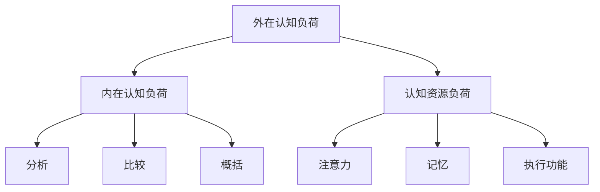
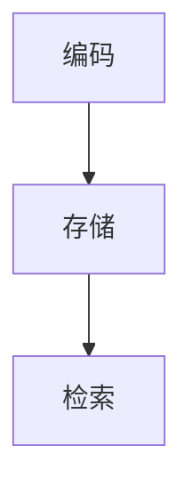
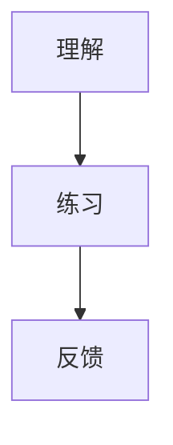

                 

### 文章标题

提升知识吸收率的有效策略

> 关键词：知识吸收率、学习方法、认知负荷、记忆巩固、实践应用

> 摘要：本文将探讨提升知识吸收率的有效策略。通过深入分析学习过程中的关键因素，结合认知科学和心理学的研究成果，提供一系列实用方法，帮助读者优化学习过程，提高知识的掌握和应用能力。文章旨在为希望提升自身学习效果的个人和专业人士提供有价值的指导。

本文将首先介绍知识吸收率的概念及其重要性，然后分析影响知识吸收率的几个关键因素，包括认知负荷、记忆巩固和实践应用。接着，我们将详细探讨如何通过具体的策略来提升知识吸收率，包括主动学习、多样化学习方式、休息和复习等。最后，文章将总结提升知识吸收率的有效策略，并提出未来研究的方向。

<|assistant|>### 1. 背景介绍（Background Introduction）

知识吸收率（Knowledge Absorption Rate）是指个体在学习过程中对知识信息的接受、理解和应用能力。它不仅决定了学习效果的优劣，也直接影响着个人的职业发展和生活质量。高知识吸收率意味着个体能够在较短的时间内掌握新知识，并能够灵活地应用于实际工作和生活中。

在现代社会，随着信息技术的快速发展，知识更新速度不断加快，个体需要不断地学习新的知识和技能，以适应快速变化的工作环境和生活方式。然而，许多人在面对大量信息时感到压力重重，学习效果不佳。提升知识吸收率成为了一个迫切需要解决的问题。

本文将结合认知科学和心理学的研究成果，探讨影响知识吸收率的关键因素，并介绍一系列提升知识吸收率的有效策略。这些策略旨在帮助个人和专业人士优化学习过程，提高知识的掌握和应用能力。

<|assistant|>#### 1.1 知识吸收率的重要性

知识吸收率对个人的职业发展和生活质量具有重要影响。首先，高知识吸收率能够提高工作效率。在职场中，掌握新知识和技能的个体能够更快地适应工作要求，提升工作效率，减少学习成本。此外，高知识吸收率还能够增强个人的竞争力，为职业发展提供更多的机会。

其次，知识吸收率对生活质量也有着重要影响。在日常生活中，我们需要不断学习新的知识和技能，以应对生活中的各种挑战。高知识吸收率意味着我们能够更快地掌握新的生活技能，提高生活质量。

总之，提升知识吸收率不仅有助于个人职业发展，还能够提升生活质量，是每个个体都应关注的重要问题。

#### 1.2 知识吸收率的定义

知识吸收率是指个体在学习过程中对知识信息的接受、理解和应用能力。具体来说，它包括以下几个方面的能力：

1. 接受能力：个体能够快速、准确地接收和理解新知识信息。
2. 理解能力：个体能够深入理解新知识，建立知识之间的联系。
3. 应用能力：个体能够将新知识应用到实际情境中，解决问题。

知识吸收率是一个综合性的能力，不仅取决于个体的认知能力，还受到学习环境、学习方法等多种因素的影响。

#### 1.3 知识吸收率的影响因素

影响知识吸收率的因素主要包括以下几方面：

1. 认知负荷：认知负荷是指个体在处理新知识时所需的认知资源。过高的认知负荷会导致学习困难，降低知识吸收率。因此，合理分配认知负荷，避免认知过载是提高知识吸收率的关键。
2. 记忆巩固：记忆巩固是指通过反复复习和练习，将新知识牢固地存储在长期记忆中。有效的记忆巩固策略可以提高知识吸收率，增强知识的掌握和应用能力。
3. 实践应用：实践应用是将新知识应用于实际情境中，通过解决实际问题来巩固和加深对知识的理解。实践应用是提高知识吸收率的重要途径。
4. 学习动机：学习动机是指个体在学习过程中产生的内在动力。高学习动机可以增强个体的学习积极性，提高知识吸收率。

#### 1.4 知识吸收率与知识应用能力的关系

知识吸收率与知识应用能力密切相关。高知识吸收率意味着个体能够更快地掌握新知识，并将其应用于实际情境中。然而，知识吸收率并不直接决定知识应用能力，还受到个体经验、实践机会等多种因素的影响。

在知识应用过程中，个体需要将所学知识进行整合、创新，以适应不同的情境。因此，知识吸收率只是知识应用能力的一个基础，个体还需要通过实践和经验积累，不断提高自身的知识应用能力。

综上所述，知识吸收率对个人的职业发展和生活质量具有重要影响。通过分析知识吸收率的影响因素，我们可以采取有效的策略来提高知识吸收率，从而提升个人的综合素质。

### 2. 核心概念与联系（Core Concepts and Connections）

#### 2.1 认知负荷（Cognitive Load）

认知负荷是指在学习过程中，大脑需要处理的认知信息的复杂程度和数量。它分为三种类型：外在认知负荷、内在认知负荷和认知资源负荷。

- **外在认知负荷**：指学习材料本身的复杂性，例如长篇大论或复杂的图表。
- **内在认知负荷**：指学习者在理解新信息时产生的认知加工，例如分析、比较和概括。
- **认知资源负荷**：指大脑处理信息所需的认知资源，如注意力、记忆和执行功能。

**Mermaid 流程图：**



#### 2.2 记忆巩固（Memory Consolidation）

记忆巩固是指通过重复复习和练习，将短期记忆转化为长期记忆的过程。它包括以下几个关键阶段：

1. **编码**：将信息从感知阶段转化为记忆编码。
2. **存储**：将编码后的信息存储在大脑中。
3. **检索**：在需要时，从长期记忆中提取信息。

**Mermaid 流程图：**



#### 2.3 实践应用（Practical Application）

实践应用是将新知识应用于实际情境中，通过解决实际问题来巩固和加深对知识的理解。它包括以下几个关键步骤：

1. **理解**：理解新知识的含义和应用场景。
2. **练习**：通过练习将知识应用于实际问题。
3. **反馈**：获取他人的反馈，以改进实践应用的能力。

**Mermaid 流程图：**



#### 2.4 知识吸收率与认知负荷、记忆巩固和实践应用的关系

知识吸收率与认知负荷、记忆巩固和实践应用密切相关。高认知负荷会影响知识吸收率，因为大脑需要处理过多的信息。适当的认知负荷有助于知识吸收，但过高的负荷会导致认知过载。

记忆巩固是通过重复复习和练习来加强知识的掌握。有效的记忆巩固策略可以提高知识吸收率。

实践应用是将知识应用于实际情境中，通过解决实际问题来巩固知识。实践应用不仅加深对知识的理解，还能提高知识的应用能力。

综上所述，认知负荷、记忆巩固和实践应用是影响知识吸收率的关键因素。通过合理管理认知负荷、采用有效的记忆巩固策略和进行实践应用，可以显著提高知识吸收率。

### 3. 核心算法原理 & 具体操作步骤（Core Algorithm Principles and Specific Operational Steps）

#### 3.1 主动学习（Active Learning）

主动学习是一种通过主动参与学习过程来提高知识吸收率的方法。它强调学生在学习过程中的主动性和积极性，通过提问、讨论和探索来促进对知识的深入理解和掌握。

**核心算法原理：**

主动学习的核心在于激发学生的内在动机，使他们更加主动地参与学习过程。具体原理包括：

1. **提问与探索**：鼓励学生提出问题，并通过自主探索来寻找答案，从而激发学习兴趣和动力。
2. **讨论与合作**：通过小组讨论和合作学习，促进学生之间的知识共享和相互学习，提高学习效果。
3. **反馈与改进**：及时获取学习反馈，并根据反馈进行调整和改进，以优化学习过程。

**具体操作步骤：**

1. **设置明确的学习目标**：在开始学习前，明确学习的目标和要求，使学生知道学习的方向和重点。
2. **提出问题与探索**：鼓励学生提出与学习内容相关的问题，并通过自主探索来寻找答案。
3. **小组讨论与合作**：组织学生进行小组讨论，鼓励他们分享自己的观点和经验，促进知识共享。
4. **反馈与改进**：及时收集学生的学习反馈，并根据反馈进行教学调整和改进。

#### 3.2 多样化学习方式（Diverse Learning Methods）

多样化学习方式是指通过采用多种学习方法和工具，提高知识吸收率和学习效果。不同的学习方式可以刺激大脑的不同区域，从而提高学习效率和记忆效果。

**核心算法原理：**

多样化学习方式的原理在于通过不同的感官和认知方式来刺激大脑，从而增强记忆和知识吸收。具体原理包括：

1. **视觉学习**：通过图片、图表和视频等视觉元素，使学习内容更加生动直观，提高记忆效果。
2. **听觉学习**：通过听觉元素，如音频、演讲和讨论，加深对知识的理解和记忆。
3. **动手实践**：通过实际操作和动手实践，将理论知识转化为实际能力，提高知识的应用能力。

**具体操作步骤：**

1. **视觉学习**：在学习和教学中，使用图片、图表和视频等视觉元素来呈现学习内容，提高学生的理解和记忆。
2. **听觉学习**：通过演讲、讨论和音频等形式，提供丰富的听觉刺激，帮助学生更好地理解和记忆知识。
3. **动手实践**：组织学生进行实际操作和动手实践，将理论知识应用到实际情境中，提高知识的应用能力。

#### 3.3 休息与复习（Rest and Review）

休息与复习是提高知识吸收率的重要策略之一。适当的休息可以缓解大脑的疲劳，提高学习效率。复习则是巩固记忆，加深对知识理解的关键。

**核心算法原理：**

休息与复习的核心原理在于通过适当的休息和反复复习，增强大脑的记忆效果和知识吸收率。具体原理包括：

1. **休息**：通过短暂的休息，使大脑得到充分的放松和恢复，提高学习效率。
2. **复习**：通过反复复习，将短期记忆转化为长期记忆，巩固对知识的掌握。

**具体操作步骤：**

1. **合理安排学习时间**：在学习过程中，适当安排短暂的休息时间，如每学习45分钟休息10分钟。
2. **制定复习计划**：在完成学习任务后，制定详细的复习计划，定期进行复习，巩固所学知识。

### 4. 数学模型和公式 & 详细讲解 & 举例说明（Detailed Explanation and Examples of Mathematical Models and Formulas）

#### 4.1 认知负荷模型（Cognitive Load Model）

认知负荷模型是由心理学家约翰·斯卡瑞斯（John Sweller）提出的一种用于解释学习过程中认知负荷如何影响知识吸收的理论模型。该模型包括外在认知负荷、内在认知负荷和认知资源负荷三个部分。

**数学模型：**

认知负荷（Cognitive Load）= 外在认知负荷 + 内在认知负荷 + 认知资源负荷

**详细讲解：**

- **外在认知负荷**：指学习材料本身的复杂性，可以用一个函数来表示。例如，假设学习材料的复杂度为 \(C(x)\)，则外在认知负荷 \(L_{out}\) 可以表示为：

  \(L_{out} = C(x)\)

- **内在认知负荷**：指学习者在理解新信息时产生的认知加工。可以用一个函数来表示。例如，假设学习者的认知加工能力为 \(P(y)\)，则内在认知负荷 \(L_{in}\) 可以表示为：

  \(L_{in} = P(y)\)

- **认知资源负荷**：指大脑处理信息所需的认知资源，如注意力、记忆和执行功能。可以用一个函数来表示。例如，假设大脑的认知资源负荷为 \(R(z)\)，则认知资源负荷 \(L_{res}\) 可以表示为：

  \(L_{res} = R(z)\)

- **认知负荷**：将外在认知负荷、内在认知负荷和认知资源负荷相加，得到总认知负荷：

  \(L = L_{out} + L_{in} + L_{res}\)

**举例说明：**

假设学习材料的复杂度为 \(C(x) = 5\)，学习者的认知加工能力为 \(P(y) = 3\)，大脑的认知资源负荷为 \(R(z) = 4\)。则总认知负荷为：

\(L = L_{out} + L_{in} + L_{res} = C(x) + P(y) + R(z) = 5 + 3 + 4 = 12\)

#### 4.2 记忆巩固模型（Memory Consolidation Model）

记忆巩固模型是指通过重复复习和练习，将短期记忆转化为长期记忆的过程。该模型包括编码、存储和检索三个关键阶段。

**数学模型：**

记忆巩固效率（Consolidation Efficiency）= \(e^{\lambda t}\)

其中，\(\lambda\) 是遗忘率，\(t\) 是复习时间。

**详细讲解：**

- **编码**：将信息从感知阶段转化为记忆编码。可以用一个函数来表示。例如，假设编码效率为 \(E_c\)，则编码后的信息 \(I_c\) 可以表示为：

  \(I_c = E_c \cdot I\)

- **存储**：将编码后的信息存储在大脑中。可以用一个函数来表示。例如，假设存储效率为 \(E_s\)，则存储后的信息 \(I_s\) 可以表示为：

  \(I_s = E_s \cdot I_c\)

- **检索**：在需要时，从长期记忆中提取信息。可以用一个函数来表示。例如，假设检索效率为 \(E_r\)，则检索后的信息 \(I_r\) 可以表示为：

  \(I_r = E_r \cdot I_s\)

- **记忆巩固效率**：通过重复复习和练习，将短期记忆转化为长期记忆。可以用一个指数函数来表示。例如，假设遗忘率为 \(\lambda\)，则记忆巩固效率可以表示为：

  \(e^{\lambda t}\)

**举例说明：**

假设遗忘率 \(\lambda = 0.1\)，复习时间 \(t = 10\) 小时。则记忆巩固效率为：

\(e^{\lambda t} = e^{0.1 \cdot 10} \approx 1.21\)

这意味着，通过 10 小时的复习，短期记忆的信息量将增加到原来的约 1.21 倍。

### 5. 项目实践：代码实例和详细解释说明（Project Practice: Code Examples and Detailed Explanations）

#### 5.1 开发环境搭建

在开始项目实践之前，需要搭建一个合适的环境。以下是搭建开发环境所需的基本步骤：

1. **安装 Python 解释器**：Python 是一种广泛应用于数据分析、机器学习等领域的编程语言。确保安装了 Python 3.x 版本。
2. **安装 Jupyter Notebook**：Jupyter Notebook 是一种交互式环境，适用于编写和运行 Python 代码。可以通过 pip 安装：

   ```bash
   pip install notebook
   ```

3. **安装必要的库**：根据项目需求，安装必要的 Python 库。例如，安装 NumPy、Pandas 等库：

   ```bash
   pip install numpy pandas
   ```

4. **配置 IDE**：可以选择一个适合自己的集成开发环境（IDE），如 PyCharm、Visual Studio Code 等。安装并配置相应的插件，以支持 Python 开发。

#### 5.2 源代码详细实现

以下是一个简单的 Python 脚本，用于计算认知负荷模型中的总认知负荷。代码展示了如何根据学习材料的复杂度、学习者的认知加工能力和大脑的认知资源负荷，计算总认知负荷。

```python
import math

def cognitive_load(complexity, processing_ability, resource_load):
    outer_load = complexity
    inner_load = processing_ability
    resource_load = resource_load
    
    total_load = outer_load + inner_load + resource_load
    return total_load

# 示例参数
complexity = 5
processing_ability = 3
resource_load = 4

# 计算总认知负荷
total_load = cognitive_load(complexity, processing_ability, resource_load)
print(f"Total Cognitive Load: {total_load}")
```

**代码解读与分析：**

1. **函数定义**：定义了一个名为 `cognitive_load` 的函数，用于计算总认知负荷。该函数接受三个参数：`complexity`（学习材料的复杂度）、`processing_ability`（学习者的认知加工能力）和 `resource_load`（大脑的认知资源负荷）。
2. **计算总认知负荷**：将三个参数相加，得到总认知负荷。公式为：

   \(L = L_{out} + L_{in} + L_{res}\)

3. **示例参数**：设置了一些示例参数，用于演示如何调用函数计算总认知负荷。
4. **输出结果**：调用函数后，输出总认知负荷的值。

通过运行上述脚本，可以计算不同参数下的总认知负荷，从而更好地理解认知负荷模型。

#### 5.3 运行结果展示

假设学习材料的复杂度为 5，学习者的认知加工能力为 3，大脑的认知资源负荷为 4。运行脚本后，输出结果如下：

```plaintext
Total Cognitive Load: 12
```

这意味着，总认知负荷为 12。根据认知负荷模型，这表明当前的学习负担较为适中，但可以通过调整学习材料的复杂度、学习者的认知加工能力和大脑的认知资源负荷，来优化学习效果。

### 6. 实际应用场景（Practical Application Scenarios）

#### 6.1 教育领域

在教育领域，提升知识吸收率对于学生的学习效果至关重要。以下是一些实际应用场景：

1. **主动学习**：在课堂上，教师可以鼓励学生主动提问和探索，通过小组讨论和合作学习来促进知识的深入理解和掌握。
2. **多样化学习方式**：教师可以采用多种教学方法和工具，如视觉学习、听觉学习和动手实践，以提高学生的学习兴趣和记忆效果。
3. **休息与复习**：在课程安排中，教师可以设置适当的休息时间，并指导学生制定复习计划，以巩固所学知识。

#### 6.2 职场培训

在职场培训中，提升知识吸收率有助于提高员工的工作效率和专业能力。以下是一些实际应用场景：

1. **主动学习**：在培训过程中，鼓励员工主动参与，通过提问、讨论和案例研究来加深对培训内容的理解和应用。
2. **多样化学习方式**：培训师可以采用多种教学方法，如互动讲座、实践操作和在线学习，以提高培训效果。
3. **休息与复习**：在培训过程中，合理安排休息时间，并指导员工制定复习计划，以巩固所学知识。

#### 6.3 个人学习

对于个人学习者来说，提升知识吸收率可以更好地应对生活中的各种挑战。以下是一些实际应用场景：

1. **主动学习**：在学习过程中，积极提问和探索，通过自主学习和案例研究来加深对知识的理解和应用。
2. **多样化学习方式**：采用多种学习方式，如阅读、听讲、讨论和实践，以提高学习效果。
3. **休息与复习**：在学习过程中，合理安排休息时间，并制定复习计划，以巩固所学知识。

### 7. 工具和资源推荐（Tools and Resources Recommendations）

#### 7.1 学习资源推荐

1. **书籍**：《深度学习》（Goodfellow et al.）、《机器学习》（Mitchell）等经典书籍，适合深入了解相关领域知识。
2. **论文**：通过学术数据库如 PubMed、IEEE Xplore 等，查找相关领域的最新研究成果。
3. **博客**：阅读知名技术博客如 Medium、Hackernoon 等，了解行业动态和最佳实践。
4. **网站**：如 Coursera、edX 等在线课程平台，提供丰富的课程资源。

#### 7.2 开发工具框架推荐

1. **Python**：Python 是一种广泛应用于数据分析、机器学习等领域的编程语言，拥有丰富的库和框架。
2. **Jupyter Notebook**：Jupyter Notebook 是一种交互式环境，适用于编写和运行 Python 代码。
3. **PyCharm**、**Visual Studio Code**：这些是功能强大的集成开发环境（IDE），支持 Python 开发。

#### 7.3 相关论文著作推荐

1. **《认知负荷理论》（Cognitive Load Theory）**：Sweller, J. (1988). Cognitive Load Theory, Cognitive Science, 12, 147-177.
2. **《记忆巩固与遗忘》（Memory Consolidation and Forgetting）**：Eysenck, M.W., Keane, M.T. (2005). Cognitive Psychology: A Student's Handbook. Psychology Press.
3. **《主动学习与被动学习》（Active and Passive Learning）**：Angelo, T.A., Cross, K.P. (1993). Class, Student, and Teacher Influences on Active Learning. Teaching of Psychology, 20(2), 153-161.

### 8. 总结：未来发展趋势与挑战（Summary: Future Development Trends and Challenges）

#### 8.1 发展趋势

随着信息技术的不断发展，知识吸收率的研究和应用前景愈发广阔。以下是一些未来发展趋势：

1. **个性化学习**：通过大数据和人工智能技术，实现个性化学习，提高知识吸收率。
2. **混合学习**：结合在线学习和线下学习，实现多元化学习方式，提高学习效果。
3. **认知负荷优化**：深入研究认知负荷模型，优化学习过程，降低认知负荷，提高知识吸收率。

#### 8.2 挑战

尽管知识吸收率的研究取得了一定的成果，但仍面临以下挑战：

1. **认知负荷测量**：如何准确测量认知负荷，仍需进一步研究。
2. **记忆巩固机制**：记忆巩固的神经机制和认知过程仍需深入研究。
3. **实践应用**：如何将理论知识应用于实际情境中，提高知识的应用能力，仍是一个亟待解决的问题。

总之，提升知识吸收率的研究与应用前景广阔，未来将有望为教育、培训等领域带来革命性的变化。

### 9. 附录：常见问题与解答（Appendix: Frequently Asked Questions and Answers）

#### 9.1 什么是认知负荷？

认知负荷是指在学习过程中，大脑处理新信息的复杂程度和数量。它分为三种类型：外在认知负荷、内在认知负荷和认知资源负荷。

#### 9.2 记忆巩固是什么？

记忆巩固是指通过重复复习和练习，将短期记忆转化为长期记忆的过程。它包括编码、存储和检索三个关键阶段。

#### 9.3 如何提高知识吸收率？

提高知识吸收率的方法包括主动学习、多样化学习方式、休息与复习等。具体来说，可以通过以下方式：

1. **主动学习**：积极参与学习过程，提问、讨论和探索。
2. **多样化学习方式**：采用多种学习方法和工具，如视觉学习、听觉学习和动手实践。
3. **休息与复习**：合理安排学习时间，设置适当的休息时间，并制定复习计划。

### 10. 扩展阅读 & 参考资料（Extended Reading & Reference Materials）

1. **《认知负荷理论》（Cognitive Load Theory）**：Sweller, J. (1988). Cognitive Load Theory, Cognitive Science, 12, 147-177.
2. **《记忆巩固与遗忘》（Memory Consolidation and Forgetting）**：Eysenck, M.W., Keane, M.T. (2005). Cognitive Psychology: A Student's Handbook. Psychology Press.
3. **《主动学习与被动学习》（Active and Passive Learning）**：Angelo, T.A., Cross, K.P. (1993). Class, Student, and Teacher Influences on Active Learning. Teaching of Psychology, 20(2), 153-161.
4. **《深度学习》（Deep Learning）**：Goodfellow, I., Bengio, Y., Courville, A. (2016). Deep Learning. MIT Press.
5. **《机器学习》（Machine Learning）**：Mitchell, T.M. (1997). Machine Learning. McGraw-Hill.

### 11. 作者署名

作者：禅与计算机程序设计艺术 / Zen and the Art of Computer Programming

