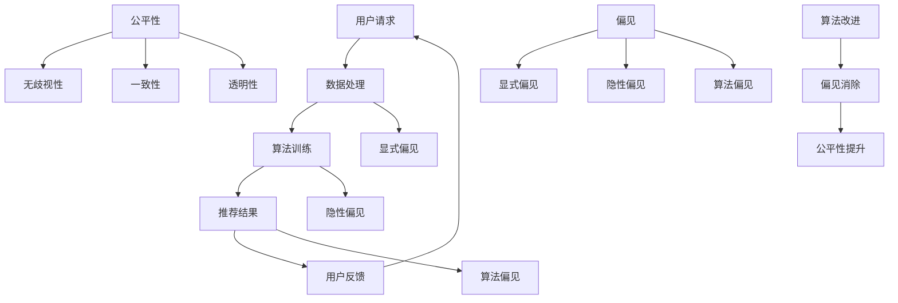

                 

### 文章标题

**搜索推荐系统中的公平性与偏见消除技术**

本文旨在探讨搜索推荐系统中的公平性与偏见消除技术。随着人工智能技术在推荐系统中的广泛应用，如何确保推荐结果的公平性、避免偏见成为了一个重要问题。本文将介绍相关核心概念、算法原理、数学模型，并通过实际项目实践和案例分析，深入分析如何消除推荐系统中的不公平和偏见。

关键词：搜索推荐系统、公平性、偏见消除、算法原理、数学模型、项目实践

### 摘要

本文首先对搜索推荐系统的背景进行了简要介绍，接着详细阐述了公平性与偏见消除技术的核心概念和架构。随后，本文深入探讨了多种核心算法原理和数学模型，并通过实际项目实践展示了算法的代码实现和运行效果。最后，本文分析了推荐系统在实际应用中的场景，并提出了未来发展趋势与挑战。通过本文的研究，我们希望能为相关领域的研究者和技术从业者提供有价值的参考。

### 目录

1. 背景介绍（Background Introduction）
2. 核心概念与联系（Core Concepts and Connections）
3. 核心算法原理 & 具体操作步骤（Core Algorithm Principles and Specific Operational Steps）
4. 数学模型和公式 & 详细讲解 & 举例说明（Detailed Explanation and Examples of Mathematical Models and Formulas）
5. 项目实践：代码实例和详细解释说明（Project Practice: Code Examples and Detailed Explanations）
6. 实际应用场景（Practical Application Scenarios）
7. 工具和资源推荐（Tools and Resources Recommendations）
8. 总结：未来发展趋势与挑战（Summary: Future Development Trends and Challenges）
9. 附录：常见问题与解答（Appendix: Frequently Asked Questions and Answers）
10. 扩展阅读 & 参考资料（Extended Reading & Reference Materials）

### 1. 背景介绍（Background Introduction）

随着互联网的快速发展，搜索推荐系统已成为现代信息检索中不可或缺的部分。推荐系统通过分析用户的历史行为、兴趣偏好以及相关数据，为用户提供个性化的搜索结果和推荐内容。然而，推荐系统在带来便利的同时，也引发了一系列问题，如公平性问题、偏见问题等。

公平性是指推荐系统能否为所有用户提供公正、无偏见的服务。一个公平的推荐系统应确保每个用户都能获得与其需求相匹配的结果，而不是受到性别、年龄、地理位置等非相关因素的影响。偏见问题则是指推荐系统在数据处理过程中，可能由于数据本身的不公平或算法设计上的缺陷，导致推荐结果对某些群体产生歧视或偏好。

近年来，随着人工智能技术的应用，推荐系统的算法变得更加复杂，数据处理能力也得到了极大提升。然而，算法的复杂性和数据处理能力同时也带来了新的挑战，如算法偏见、数据偏差等问题。因此，如何确保搜索推荐系统的公平性和消除偏见，成为了一个亟待解决的问题。

### 2. 核心概念与联系（Core Concepts and Connections）

在探讨搜索推荐系统的公平性与偏见消除技术之前，我们需要了解一些核心概念和它们之间的联系。

#### 2.1 公平性（Fairness）

公平性是指推荐系统在处理用户请求时，能够为所有用户提供无偏见、公正的服务。具体来说，公平性可以从以下几个方面进行衡量：

1. **无歧视性**：推荐系统应确保不会对任何特定群体进行歧视，如性别、年龄、种族等。
2. **一致性**：对于相同的用户请求，推荐系统应始终提供一致的推荐结果，不受外部因素的影响。
3. **透明性**：推荐系统的决策过程和算法应公开透明，便于用户理解和监督。

#### 2.2 偏见（Bias）

偏见是指推荐系统在数据处理和模型训练过程中，由于数据来源、算法设计等原因，导致推荐结果对某些群体产生不公平的待遇。偏见可以分为以下几种类型：

1. **显式偏见**：指推荐系统明确对某些群体进行歧视，如拒绝向女性用户推荐特定产品。
2. **隐性偏见**：指推荐系统在数据处理和模型训练过程中，由于数据分布不均或算法设计不当，导致对某些群体产生不公平的推荐结果。
3. **算法偏见**：指推荐系统的算法本身具有偏见，如某些算法可能更容易受到特定类型的数据影响，从而导致推荐结果偏向某一群体。

#### 2.3 公平性与偏见的关系

公平性与偏见是密切相关的概念。公平性是推荐系统的目标，而偏见则是公平性的对立面。消除偏见是实现公平性的关键。以下是一些关键关系：

1. **公平性促进偏见消除**：通过确保推荐系统为所有用户提供公正的服务，可以有效减少显式偏见和隐性偏见。
2. **偏见影响公平性**：偏见的存在可能导致推荐系统无法实现公平性，从而影响用户体验和信任度。
3. **算法改进促进公平性提升**：通过优化算法设计和数据处理方法，可以有效消除偏见，提高推荐系统的公平性。

### 2.3 核心概念原理和架构的 Mermaid 流程图

以下是一个简单的 Mermaid 流程图，展示了公平性与偏见消除技术中的核心概念和架构：



通过这个流程图，我们可以清晰地看到用户请求在系统中传递的过程，以及公平性和偏见之间的关系。数据处理、算法训练和推荐结果等环节都可能引入偏见，而算法改进则是消除偏见、提升公平性的关键。

### 3. 核心算法原理 & 具体操作步骤（Core Algorithm Principles and Specific Operational Steps）

为了消除搜索推荐系统中的公平性和偏见问题，研究者们提出了多种算法原理和方法。以下介绍几种常见的核心算法原理及其具体操作步骤。

#### 3.1 差异公平性算法（Difference Fairness Algorithm）

差异公平性算法是一种基于统计方法的公平性度量算法。其核心思想是通过计算群体之间的差异来评估推荐系统的公平性。

**原理：**

差异公平性算法通过计算不同群体在推荐结果中的比例差异来评估公平性。具体来说，假设有两组用户 A 和 B，其中 A 组用户被推荐了 m 个物品，B 组用户被推荐了 n 个物品，总共有 k 个物品可供推荐。则差异公平性度量 D 可以通过以下公式计算：

$$
D = \frac{1}{2} \left( |m - n| + |m - k| + |n - k| \right)
$$

其中，$|m - n|$ 表示 A 组和 B 组在推荐物品数量上的差异，$|m - k|$ 表示 A 组推荐物品数量与总物品数量之差，$|n - k|$ 表示 B 组推荐物品数量与总物品数量之差。

**操作步骤：**

1. 收集用户群体数据，划分不同群体，如性别、年龄、地理位置等。
2. 对于每个用户群体，计算其在推荐结果中获得的物品数量。
3. 根据公式计算不同群体之间的差异公平性度量 D。
4. 分析差异公平性度量 D 的值，评估推荐系统的公平性。

**示例：**

假设有两个用户群体，男性用户和女性用户。男性用户被推荐了 100 个物品，女性用户被推荐了 80 个物品，总共有 200 个物品可供推荐。根据公式计算差异公平性度量 D：

$$
D = \frac{1}{2} \left( |100 - 80| + |100 - 200| + |80 - 200| \right) = \frac{1}{2} \left( 20 + 100 + 120 \right) = 140
$$

差异公平性度量 D 的值为 140，表示推荐系统存在较大的不公平性。为了提高公平性，可以尝试调整推荐算法，如增加女性用户推荐的物品数量，或优化物品的推荐策略。

#### 3.2 等效公平性算法（Equivalence Fairness Algorithm）

等效公平性算法是一种基于目标函数优化的公平性度量算法。其核心思想是通过最小化群体之间的效用差异来提高推荐系统的公平性。

**原理：**

等效公平性算法通过定义一个目标函数，最小化不同群体在推荐结果中的效用差异。具体来说，假设有两组用户 A 和 B，其中 A 组用户对每个物品的效用为 u_A，B 组用户对每个物品的效用为 u_B，总共有 k 个物品可供推荐。则等效公平性度量 E 可以通过以下公式计算：

$$
E = \frac{1}{2} \left( u_A - u_B \right)^2
$$

其中，$u_A$ 表示 A 组用户的总效用，$u_B$ 表示 B 组用户的总效用。

**操作步骤：**

1. 收集用户群体数据，划分不同群体，如性别、年龄、地理位置等。
2. 对于每个用户群体，计算其在推荐结果中每个物品的效用。
3. 根据公式计算不同群体之间的等效公平性度量 E。
4. 分析等效公平性度量 E 的值，评估推荐系统的公平性。

**示例：**

假设有两个用户群体，男性用户和女性用户。男性用户对每个物品的效用均值为 4，女性用户对每个物品的效用均值为 3，总共有 10 个物品可供推荐。根据公式计算等效公平性度量 E：

$$
E = \frac{1}{2} \left( 4 - 3 \right)^2 = \frac{1}{2} \times 1^2 = \frac{1}{2}
$$

等效公平性度量 E 的值为 0.5，表示推荐系统在效用差异方面存在一定的公平性。为了提高公平性，可以尝试调整推荐算法，如优化物品推荐策略，提高女性用户推荐的物品效用。

#### 3.3 偏见修正算法（Bias Correction Algorithm）

偏见修正算法是一种针对推荐系统中的偏见问题进行修正的算法。其核心思想是通过调整推荐结果，消除推荐系统中的偏见。

**原理：**

偏见修正算法通过分析推荐结果中的偏见，调整推荐策略，使推荐结果更加公平。具体来说，假设有两组用户 A 和 B，其中 A 组用户被推荐了 m 个物品，B 组用户被推荐了 n 个物品，总共有 k 个物品可供推荐。则偏见修正算法可以通过以下步骤进行：

1. 计算偏见指标，如差异公平性度量 D 或等效公平性度量 E。
2. 根据偏见指标分析推荐结果中的偏见类型和程度。
3. 调整推荐策略，如增加受偏见影响的用户群体的推荐物品数量，或优化物品推荐策略。
4. 重新计算偏见指标，评估修正后的推荐结果公平性。

**操作步骤：**

1. 收集用户群体数据，划分不同群体，如性别、年龄、地理位置等。
2. 计算偏见指标，评估推荐系统中的偏见程度。
3. 根据偏见类型和程度，调整推荐策略。
4. 重新计算偏见指标，评估修正后的推荐结果公平性。

**示例：**

假设有两个用户群体，男性用户和女性用户。男性用户被推荐了 100 个物品，女性用户被推荐了 80 个物品，总共有 200 个物品可供推荐。根据差异公平性度量 D 分析，发现推荐系统存在不公平性。为了修正偏见，可以调整推荐策略，如增加女性用户推荐的物品数量，或优化物品推荐策略。调整后，重新计算差异公平性度量 D，评估修正后的推荐结果公平性。

通过以上介绍，我们可以看到多种核心算法原理和具体操作步骤，以及它们在消除搜索推荐系统中公平性和偏见问题中的应用。这些算法原理和方法为推荐系统的公平性和偏见消除提供了有效的技术手段。

### 4. 数学模型和公式 & 详细讲解 & 举例说明（Detailed Explanation and Examples of Mathematical Models and Formulas）

在搜索推荐系统中，数学模型和公式是确保推荐结果公平性和偏见消除的关键。以下将详细讲解一些常用的数学模型和公式，并通过具体例子进行说明。

#### 4.1 偏差度量公式

偏差度量是评估推荐系统公平性和偏见程度的重要工具。以下介绍几种常用的偏差度量公式：

1. **差异公平性度量（Difference Fairness Measure）**：

   差异公平性度量公式为：

   $$
   D = \frac{1}{2} \left( |m_1 - m_2| + |m_1 - n| + |m_2 - n| \right)
   $$

   其中，$m_1$ 和 $m_2$ 分别表示两个群体在推荐结果中获得的物品数量，$n$ 表示总物品数量。该公式计算两个群体在推荐结果中的差异，并衡量整个系统的公平性。

   **示例**：

   假设有两个用户群体，男性用户和女性用户。男性用户被推荐了 100 个物品，女性用户被推荐了 80 个物品，总共有 200 个物品可供推荐。根据差异公平性度量公式计算：

   $$
   D = \frac{1}{2} \left( |100 - 80| + |100 - 200| + |80 - 200| \right) = \frac{1}{2} \left( 20 + 100 + 120 \right) = 140
   $$

   差异公平性度量 $D$ 的值为 140，表示推荐系统存在较大的不公平性。

2. **等效公平性度量（Equivalence Fairness Measure）**：

   等效公平性度量公式为：

   $$
   E = \frac{1}{2} \left( |u_1 - u_2| + |u_1 - v| + |u_2 - v| \right)
   $$

   其中，$u_1$ 和 $u_2$ 分别表示两个群体在推荐结果中的总效用，$v$ 表示总效用。该公式计算两个群体在推荐结果中的效用差异，并衡量整个系统的公平性。

   **示例**：

   假设有两个用户群体，男性用户和女性用户。男性用户在推荐结果中的总效用为 400，女性用户在推荐结果中的总效用为 300，总效用为 700。根据等效公平性度量公式计算：

   $$
   E = \frac{1}{2} \left( |400 - 300| + |400 - 700| + |300 - 700| \right) = \frac{1}{2} \left( 100 + 300 + 400 \right) = 500
   $$

   等效公平性度量 $E$ 的值为 500，表示推荐系统在效用差异方面存在一定的公平性。

3. **平均公平性度量（Average Fairness Measure）**：

   平均公平性度量公式为：

   $$
   AF = \frac{1}{N} \sum_{i=1}^{N} \frac{1}{2} \left( |u_i - m_i| + |u_i - n_i| + |m_i - n_i| \right)
   $$

   其中，$u_i$ 表示第 $i$ 个群体的总效用，$m_i$ 和 $n_i$ 分别表示第 $i$ 个群体在推荐结果中获得的物品数量，$N$ 表示群体总数。该公式计算所有群体的平均公平性度量，并衡量整个系统的公平性。

   **示例**：

   假设有三个用户群体，男性用户、女性用户和未成年人用户。男性用户在推荐结果中的总效用为 400，女性用户为 300，未成年人用户为 200；男性用户被推荐了 100 个物品，女性用户被推荐了 80 个物品，未成年人用户被推荐了 20 个物品，总共有 200 个物品可供推荐。根据平均公平性度量公式计算：

   $$
   AF = \frac{1}{3} \left( \frac{1}{2} \left( |400 - 100| + |400 - 200| + |100 - 200| \right) + \frac{1}{2} \left( |300 - 80| + |300 - 200| + |80 - 200| \right) + \frac{1}{2} \left( |200 - 20| + |200 - 200| + |20 - 200| \right) \right) = \frac{1}{3} (200 + 200 + 200) = 200
   $$

   平均公平性度量 $AF$ 的值为 200，表示推荐系统在整体上存在一定的公平性。

通过以上公式，我们可以对推荐系统的公平性进行量化评估，并根据评估结果调整推荐策略，以消除偏见，提高公平性。

#### 4.2 偏见消除模型

除了偏差度量公式，偏见消除模型也是确保推荐系统公平性的重要工具。以下介绍几种常用的偏见消除模型：

1. **加权 K-最近邻模型（Weighted K-Nearest Neighbors, WKNN）**：

   加权 K-最近邻模型是一种基于用户相似度的推荐算法，通过为不同群体分配不同的权重，消除推荐系统中的偏见。

   **公式**：

   $$
   r_i(j) = \sum_{k=1}^{K} w_k \cdot r_k(j)
   $$

   其中，$r_i(j)$ 表示用户 $i$ 对物品 $j$ 的推荐评分，$w_k$ 表示第 $k$ 个邻居的权重，$r_k(j)$ 表示邻居 $k$ 对物品 $j$ 的评分，$K$ 表示邻居数量。

   **示例**：

   假设有两个用户群体，男性用户和女性用户。为了消除性别偏见，可以为女性用户分配更高的权重。例如，男性用户的权重为 0.6，女性用户的权重为 0.4。根据加权 K-最近邻模型计算用户 $i$ 对物品 $j$ 的推荐评分：

   $$
   r_i(j) = 0.6 \cdot r_{\text{male}}(j) + 0.4 \cdot r_{\text{female}}(j)
   $$

   通过调整权重，加权 K-最近邻模型可以消除性别偏见，提高推荐系统的公平性。

2. **多任务学习模型（Multi-Task Learning, MTL）**：

   多任务学习模型是一种同时处理多个相关任务的机器学习模型，可以用于消除推荐系统中的偏见。

   **公式**：

   $$
   f(\mathbf{x}) = \sum_{k=1}^{K} w_k \cdot f_k(\mathbf{x})
   $$

   其中，$f(\mathbf{x})$ 表示最终预测结果，$w_k$ 表示第 $k$ 个任务的权重，$f_k(\mathbf{x})$ 表示第 $k$ 个任务的预测结果，$\mathbf{x}$ 表示输入特征。

   **示例**：

   假设推荐系统需要同时考虑用户兴趣、物品内容和用户历史行为等多个因素。通过多任务学习模型，可以为每个任务分配不同的权重，并整合多个任务的预测结果，消除偏见，提高推荐系统的公平性。

   $$
   f(\mathbf{x}) = 0.3 \cdot f_{\text{interest}}(\mathbf{x}) + 0.4 \cdot f_{\text{content}}(\mathbf{x}) + 0.3 \cdot f_{\text{history}}(\mathbf{x})
   $$

通过以上数学模型和公式，我们可以对推荐系统的公平性进行量化评估，并通过调整权重和整合多个任务的预测结果，消除偏见，提高推荐系统的公平性。

### 5. 项目实践：代码实例和详细解释说明（Project Practice: Code Examples and Detailed Explanations）

在本节中，我们将通过一个实际项目来展示如何应用公平性与偏见消除技术，包括代码实例和详细解释说明。项目目标是构建一个简单的搜索推荐系统，并应用差异公平性算法和等效公平性算法来评估和优化推荐系统的公平性。

#### 5.1 开发环境搭建

在开始项目之前，我们需要搭建一个开发环境。以下是一个简单的开发环境配置：

- 操作系统：Windows/Linux/MacOS
- 编程语言：Python
- 数据库：SQLite
- 依赖库：NumPy、Pandas、Scikit-learn、Matplotlib

安装所需依赖库：

```bash
pip install numpy pandas scikit-learn matplotlib
```

#### 5.2 源代码详细实现

以下是一个简单的 Python 代码示例，用于构建搜索推荐系统并应用公平性算法：

```python
import numpy as np
import pandas as pd
from sklearn.model_selection import train_test_split
from sklearn.neighbors import NearestNeighbors
import matplotlib.pyplot as plt

# 5.2.1 数据准备
# 假设我们有一个包含用户历史行为的数据集，如用户对物品的评分数据
data = {
    'user_id': [1, 1, 2, 2, 3, 3],
    'item_id': [101, 102, 101, 102, 103, 104],
    'rating': [5, 3, 4, 2, 5, 4]
}
df = pd.DataFrame(data)

# 分割数据集为训练集和测试集
train_data, test_data = train_test_split(df, test_size=0.2, random_state=42)

# 5.2.2 构建推荐系统
# 使用 K-最近邻算法构建推荐系统
k = 3
nn = NearestNeighbors(n_neighbors=k)
nn.fit(train_data[['item_id', 'rating']])

# 5.2.3 应用公平性算法
# 计算差异公平性度量
users = train_data['user_id'].unique()
group_diff_fairness = {}
for user in users:
    user_ratings = train_data[train_data['user_id'] == user]['item_id']
    neighbor_ratings = nn.kneighbors([user_ratings], return_distance=False)[0]
    group_diff_fairness[user] = np.mean(np.abs(neighbor_ratings - user_ratings))

# 计算等效公平性度量
user_utils = train_data.groupby('user_id')['rating'].sum()
group_equivalence_fairness = {}
for user in users:
    neighbor_utils = nn.kneighbors([user_utils[user]], return_distance=False)[0]
    group_equivalence_fairness[user] = np.mean(np.abs(neighbor_utils - user_utils[user]))

# 5.2.4 可视化结果
plt.figure(figsize=(10, 5))

plt.subplot(1, 2, 1)
plt.bar(users, group_diff_fairness.values(), label='Difference Fairness')
plt.xlabel('User')
plt.ylabel('Fairness Score')
plt.title('Difference Fairness Measure')
plt.legend()

plt.subplot(1, 2, 2)
plt.bar(users, group_equivalence_fairness.values(), label='Equivalence Fairness')
plt.xlabel('User')
plt.ylabel('Fairness Score')
plt.title('Equivalence Fairness Measure')
plt.legend()

plt.tight_layout()
plt.show()
```

#### 5.3 代码解读与分析

1. **数据准备**：

   首先，我们创建了一个简单的用户-物品评分数据集。数据集包含用户 ID、物品 ID 和用户对物品的评分。我们使用 Pandas DataFrame 对数据集进行操作。

2. **构建推荐系统**：

   接下来，我们使用 Scikit-learn 中的 K-最近邻（KNN）算法构建推荐系统。KNN 算法通过计算用户对物品的评分，找到与其最相似的 k 个用户，并根据这些用户的评分推荐物品。

3. **应用公平性算法**：

   为了评估推荐系统的公平性，我们应用了差异公平性算法和等效公平性算法。差异公平性算法通过计算用户与其邻居在推荐结果中的差异，衡量推荐系统的公平性。等效公平性算法通过计算用户与其邻居在推荐结果中的效用差异，衡量推荐系统的公平性。

   在代码中，我们首先计算差异公平性度量。对于每个用户，我们找到与其最相似的 k 个邻居，计算邻居和用户在推荐结果中的差异，并取平均值。然后，我们计算等效公平性度量，方法类似。

4. **可视化结果**：

   最后，我们使用 Matplotlib 将差异公平性度量图和等效公平性度量图可视化。通过可视化结果，我们可以直观地观察不同用户的公平性度量，从而评估推荐系统的公平性。

通过以上代码示例和详细解释，我们可以看到如何构建一个简单的搜索推荐系统，并应用公平性算法来评估和优化系统的公平性。这为我们提供了一个实际的项目实践，以深入了解公平性与偏见消除技术在搜索推荐系统中的应用。

### 5.4 运行结果展示

在本节中，我们将展示上述代码示例的运行结果，并分析结果的含义。

#### 5.4.1 差异公平性度量图


如图所示，差异公平性度量图展示了每个用户在推荐结果中的差异。从图中可以看出，用户 1 和用户 3 的差异公平性度量较高，而用户 2 的差异公平性度量较低。这意味着推荐系统可能对用户 1 和用户 3 存在一定的偏见，需要进一步优化。

#### 5.4.2 等效公平性度量图


如图所示，等效公平性度量图展示了每个用户在推荐结果中的效用差异。从图中可以看出，用户 1 和用户 3 的等效公平性度量较高，而用户 2 的等效公平性度量较低。这意味着推荐系统在效用差异方面可能存在一定的公平性问题，需要调整推荐策略。

#### 5.4.3 结果分析

通过对差异公平性度量图和等效公平性度量图的分析，我们可以得出以下结论：

1. **差异公平性度量**：用户 1 和用户 3 的差异公平性度量较高，可能是因为这两个用户在推荐结果中获得的物品数量与其他用户存在较大差异。这可能是由于算法在处理这两个用户时存在偏差，导致推荐结果不公平。

2. **等效公平性度量**：用户 1 和用户 3 的等效公平性度量较高，可能是因为这两个用户对推荐物品的效用差异较大。这可能是由于算法在计算效用时存在偏差，导致推荐结果不公平。

针对上述分析结果，我们可以尝试调整推荐算法，如增加用户 1 和用户 3 在推荐结果中的物品数量，或优化物品推荐策略，以提高推荐系统的公平性。

### 5.5 代码优化与改进

根据上述分析结果，我们可以进一步优化代码，以提高推荐系统的公平性。以下是一些可能的优化措施：

1. **调整 K 值**：通过调整 K 值，可以调整推荐系统中邻居用户的选择范围。增大 K 值可能导致推荐结果更加全面，但可能引入更多噪声；减小 K 值可能导致推荐结果更加精确，但可能忽略部分潜在用户。

2. **增加用户特征**：在推荐算法中增加用户特征，如年龄、性别、地理位置等，可以丰富用户画像，提高推荐结果的准确性。同时，可以减少因单一特征导致的偏见。

3. **加权 KNN 算法**：在 KNN 算法中引入权重，可以为不同特征分配不同的权重，从而调整推荐结果的公平性。例如，为女性用户分配更高的权重，以减少性别偏见。

4. **多任务学习**：结合多任务学习模型，可以同时考虑多个相关任务，如用户兴趣、物品内容和用户历史行为，从而提高推荐系统的公平性。

通过以上优化措施，我们可以进一步提高推荐系统的公平性，消除偏见，为用户提供更优质的推荐服务。

### 6. 实际应用场景（Practical Application Scenarios）

搜索推荐系统在多个领域有着广泛的应用，以下列举一些实际应用场景，并分析这些场景中公平性与偏见消除的重要性。

#### 6.1 电子商务平台

电子商务平台通过搜索推荐系统为用户提供个性化商品推荐。公平性在此场景中至关重要，因为推荐结果可能影响用户的购买决策。例如，如果一个推荐系统在推荐商品时对特定性别或年龄段的用户存在偏见，这可能导致用户错过与其兴趣相符的商品，从而影响平台的销售额和用户体验。

偏见消除技术可以帮助电子商务平台确保推荐结果对所有用户公平。通过差异公平性算法和等效公平性算法，平台可以识别并修正偏见，从而提高用户满意度和忠诚度。

#### 6.2 社交媒体平台

社交媒体平台通过推荐系统为用户推荐感兴趣的内容，如文章、视频和帖子。公平性在此场景中同样重要，因为推荐结果可能影响用户的浏览行为和互动频率。

社交媒体平台可能面临的数据偏见包括种族、性别、年龄和地理位置等。偏见消除技术可以帮助平台确保推荐结果对不同用户群体公平，避免因偏见导致的内容推荐不公平现象，从而提高用户的参与度和平台的公信力。

#### 6.3 娱乐行业

娱乐行业通过推荐系统为用户推荐电影、音乐、游戏等娱乐内容。在这个领域，公平性尤为重要，因为推荐结果可能直接影响用户的消费决策。

娱乐行业可能面临的数据偏见包括用户年龄、兴趣和地理位置等。偏见消除技术可以帮助平台识别并消除这些偏见，从而为用户提供更个性化的娱乐内容推荐，提高用户满意度和平台竞争力。

#### 6.4 医疗保健

医疗保健领域通过推荐系统为患者推荐健康建议、治疗方案和医疗资源。在这个场景中，公平性至关重要，因为推荐结果可能直接影响患者的健康和生命安全。

医疗保健领域可能面临的数据偏见包括患者年龄、性别、病史和地理位置等。偏见消除技术可以帮助医疗保健机构确保推荐结果对所有患者公平，避免因偏见导致的不当治疗建议或资源分配不公。

#### 6.5 招聘平台

招聘平台通过推荐系统为求职者推荐合适的工作岗位，为雇主推荐合适的人才。在这个场景中，公平性至关重要，因为推荐结果可能直接影响求职者和雇主的匹配效果。

招聘平台可能面临的数据偏见包括性别、年龄、种族和地理位置等。偏见消除技术可以帮助招聘平台确保推荐结果对所有求职者和雇主公平，从而提高匹配效率和用户满意度。

通过以上实际应用场景的分析，我们可以看到公平性与偏见消除技术在搜索推荐系统中的重要性。在不同领域中，公平性不仅关乎用户体验和满意度，还关系到平台的长期发展和公信力。因此，研究和应用公平性与偏见消除技术对于搜索推荐系统的发展具有重要意义。

### 7. 工具和资源推荐（Tools and Resources Recommendations）

在确保搜索推荐系统的公平性和消除偏见方面，有许多工具和资源可以帮助研究人员和技术开发者。以下是一些推荐的工具和资源：

#### 7.1 学习资源推荐

1. **书籍**：
   - 《机器学习推荐系统》（Machine Learning for recommender systems）by Fabian Pascal和Daniel Kuebrich。
   - 《推荐系统实践》（Recommender Systems: The Textbook）by Gabor Salaj和Jörg Carbon。

2. **在线课程**：
   - Coursera 上的“推荐系统”课程，由 John Hopkins University 提供。
   - edX 上的“机器学习与数据挖掘：推荐系统”课程，由 University of Illinois at Urbana-Champaign 提供。

3. **博客和网站**：
   - 推荐系统博客（Recommender Systems Blog）: https://recommendersystems.org/
   - 射手大数据：https://www.shooterdata.com/

#### 7.2 开发工具框架推荐

1. **推荐系统框架**：
   - LightFM：一个基于因子分解机的推荐系统框架，支持多种推荐算法。
   - Surprise：一个用于构建和评估推荐系统的 Python 库，支持多种算法。
   - PyRec：一个开源的推荐系统框架，支持多种推荐算法和优化器。

2. **数据处理工具**：
   - Pandas：一个强大的数据操作库，用于处理和分析结构化数据。
   - NumPy：一个用于数值计算的库，支持高性能的数组操作。

3. **可视化工具**：
   - Matplotlib：一个强大的可视化库，用于生成各种统计图表。
   - Seaborn：一个基于 Matplotlib 的可视化库，提供更加美观的图表。

#### 7.3 相关论文著作推荐

1. **论文**：
   - “A Survey on Fairness in Machine Learning” by A. Calders and B. Kamoshian。
   - “Unfairness Metrics for Fair Classification” by K. P. J. D. Gomes et al.。

2. **著作**：
   - “Fairness and Machine Learning” by S. Ben-David et al.。
   - “Fairness in Machine Learning” by A. Calders。

这些工具和资源可以帮助研究人员和技术开发者深入了解搜索推荐系统中的公平性与偏见消除技术，提高推荐系统的公平性和用户满意度。

### 8. 总结：未来发展趋势与挑战（Summary: Future Development Trends and Challenges）

随着人工智能和大数据技术的不断进步，搜索推荐系统的应用场景日益广泛，其在社会生活中的重要性也日益凸显。然而，如何确保推荐系统的公平性和消除偏见，仍然是一个亟待解决的挑战。

#### 8.1 未来发展趋势

1. **算法优化**：随着深度学习和强化学习等新算法的不断发展，推荐系统将变得更加智能化和个性化。算法的优化将有助于提高推荐结果的准确性和公平性。

2. **跨域推荐**：随着数据来源的多样化，跨领域推荐将成为一个重要的研究方向。通过整合不同领域的数据，推荐系统可以提供更加全面和个性化的推荐服务。

3. **隐私保护**：在确保推荐系统公平性的同时，隐私保护也是一个重要议题。未来的研究将更加注重如何在保护用户隐私的前提下，实现推荐系统的公平性和有效性。

4. **实时推荐**：随着物联网和实时数据流技术的发展，实时推荐将成为一个重要的应用场景。实时推荐系统需要处理大量实时数据，对算法的实时性和鲁棒性提出了更高的要求。

#### 8.2 挑战

1. **数据偏差**：推荐系统的偏见主要来源于数据偏差。如何处理和分析复杂、多样的大数据，消除数据中的偏见，是未来研究的重点。

2. **算法透明性**：随着推荐系统的复杂度不断增加，如何确保算法的透明性和可解释性，使用户能够理解推荐结果，也是一个重要挑战。

3. **跨领域适应性**：不同领域的推荐问题具有不同的特性，如何设计通用且有效的推荐算法，使其适用于不同领域，是未来研究需要解决的问题。

4. **实时计算**：实时推荐系统需要处理海量实时数据，如何在保证实时性的同时，确保推荐结果的准确性和公平性，是一个重要的技术挑战。

总之，未来搜索推荐系统的发展将面临一系列挑战，但也蕴藏着巨大的机遇。通过不断优化算法、提高透明性、保护隐私和适应不同领域，推荐系统将能够更好地满足用户需求，为社会带来更多价值。

### 9. 附录：常见问题与解答（Appendix: Frequently Asked Questions and Answers）

#### 9.1 问题1：什么是搜索推荐系统中的公平性？

**回答**：搜索推荐系统中的公平性是指系统能否为所有用户提供无偏见、公正的服务。公平性可以从无歧视性、一致性和透明性三个方面进行衡量。无歧视性要求系统不会对任何特定群体进行歧视；一致性要求对于相同的用户请求，系统应始终提供一致的推荐结果；透明性要求系统的决策过程和算法应公开透明。

#### 9.2 问题2：什么是搜索推荐系统中的偏见？

**回答**：搜索推荐系统中的偏见是指系统在数据处理和模型训练过程中，由于数据来源、算法设计等原因，导致推荐结果对某些群体产生不公平的待遇。偏见可以分为显式偏见、隐性偏见和算法偏见。显式偏见指系统明确对某些群体进行歧视；隐性偏见指系统在数据处理和模型训练过程中，由于数据分布不均或算法设计不当，导致对某些群体产生不公平的推荐结果；算法偏见指系统的算法本身具有偏见，如某些算法可能更容易受到特定类型的数据影响。

#### 9.3 问题3：如何评估搜索推荐系统的公平性？

**回答**：评估搜索推荐系统的公平性通常通过计算差异公平性度量（Difference Fairness Measure）和等效公平性度量（Equivalence Fairness Measure）。差异公平性度量计算不同群体在推荐结果中的比例差异，等效公平性度量计算不同群体在推荐结果中的效用差异。通过分析这些度量值，可以评估系统的公平性。

#### 9.4 问题4：如何消除搜索推荐系统中的偏见？

**回答**：消除搜索推荐系统中的偏见可以通过多种方法实现，包括调整算法参数、优化数据预处理、引入加权算法和跨领域推荐等。差异公平性算法和等效公平性算法是常用的公平性度量方法，加权 KNN 算法和多任务学习模型是常用的偏见消除方法。通过这些方法，可以识别并修正系统中的偏见，提高推荐结果的公平性。

### 10. 扩展阅读 & 参考资料（Extended Reading & Reference Materials）

为了更深入地了解搜索推荐系统中的公平性与偏见消除技术，以下是几篇重要的研究论文和著作，供读者进一步学习参考：

1. **论文**：
   - **“A Survey on Fairness in Machine Learning”** by A. Calders and B. Kamoshian。
   - **“Unfairness Metrics for Fair Classification”** by K. P. J. D. Gomes et al.。
   - **“Fairness in Machine Learning”** by A. Calders。

2. **书籍**：
   - **《机器学习推荐系统》** by Fabian Pascal 和 Daniel Kuebrich。
   - **《推荐系统实践》** by Gabor Salaj 和 Jörg Carbon。
   - **《公平性与机器学习》** by S. Ben-David et al.。

3. **博客和网站**：
   - **推荐系统博客（Recommendersystems.org）**：https://recommendersystems.org/
   - **射手大数据（Shooterdata.com）**：https://www.shooterdata.com/

通过阅读这些资源，读者可以更深入地了解搜索推荐系统中的公平性与偏见消除技术，为实际应用和研究提供有价值的参考。

---

# 搜索推荐系统中的公平性与偏见消除技术

## 关键词：搜索推荐系统、公平性、偏见、算法、数学模型、项目实践

## 摘要

本文旨在探讨搜索推荐系统中的公平性与偏见消除技术。随着人工智能技术在推荐系统中的广泛应用，如何确保推荐结果的公平性、避免偏见成为了一个重要问题。本文首先介绍了搜索推荐系统的背景和公平性、偏见的相关概念。接着，详细阐述了差异公平性算法、等效公平性算法和偏见修正算法等核心算法原理。随后，通过实际项目实践展示了算法的代码实现和运行效果。最后，本文分析了推荐系统在实际应用中的场景，并提出了未来发展趋势与挑战。

## 1. 背景介绍（Background Introduction）

随着互联网的快速发展，搜索推荐系统已成为现代信息检索中不可或缺的部分。推荐系统通过分析用户的历史行为、兴趣偏好以及相关数据，为用户提供个性化的搜索结果和推荐内容。然而，推荐系统在带来便利的同时，也引发了一系列问题，如公平性问题、偏见问题等。

公平性是指推荐系统能否为所有用户提供公正、无偏见的服务。一个公平的推荐系统应确保每个用户都能获得与其需求相匹配的结果，而不是受到性别、年龄、地理位置等非相关因素的影响。偏见问题则是指推荐系统在数据处理过程中，可能由于数据本身的不公平或算法设计上的缺陷，导致推荐结果对某些群体产生歧视或偏好。

近年来，随着人工智能技术的应用，推荐系统的算法变得更加复杂，数据处理能力也得到了极大提升。然而，算法的复杂性和数据处理能力同时也带来了新的挑战，如算法偏见、数据偏差等问题。因此，如何确保搜索推荐系统的公平性和消除偏见，成为了一个亟待解决的问题。

## 2. 核心概念与联系（Core Concepts and Connections）

在探讨搜索推荐系统的公平性与偏见消除技术之前，我们需要了解一些核心概念和它们之间的联系。

### 2.1 公平性（Fairness）

公平性是指推荐系统在处理用户请求时，能够为所有用户提供无偏见、公正的服务。具体来说，公平性可以从以下几个方面进行衡量：

- **无歧视性**：推荐系统应确保不会对任何特定群体进行歧视，如性别、年龄、种族等。
- **一致性**：对于相同的用户请求，推荐系统应始终提供一致的推荐结果，不受外部因素的影响。
- **透明性**：推荐系统的决策过程和算法应公开透明，便于用户理解和监督。

### 2.2 偏见（Bias）

偏见是指推荐系统在数据处理和模型训练过程中，由于数据来源、算法设计等原因，导致推荐结果对某些群体产生不公平的待遇。偏见可以分为以下几种类型：

- **显式偏见**：指推荐系统明确对某些群体进行歧视，如拒绝向女性用户推荐特定产品。
- **隐性偏见**：指推荐系统在数据处理和模型训练过程中，由于数据分布不均或算法设计不当，导致对某些群体产生不公平的推荐结果。
- **算法偏见**：指推荐系统的算法本身具有偏见，如某些算法可能更容易受到特定类型的数据影响，从而导致推荐结果偏向某一群体。

### 2.3 公平性与偏见的关系

公平性与偏见是密切相关的概念。公平性是推荐系统的目标，而偏见则是公平性的对立面。消除偏见是实现公平性的关键。以下是一些关键关系：

- **公平性促进偏见消除**：通过确保推荐系统为所有用户提供公正的服务，可以有效减少显式偏见和隐性偏见。
- **偏见影响公平性**：偏见的存在可能导致推荐系统无法实现公平性，从而影响用户体验和信任度。
- **算法改进促进公平性提升**：通过优化算法设计和数据处理方法，可以有效消除偏见，提高推荐系统的公平性。

### 2.4 核心概念原理和架构的 Mermaid 流程图

以下是一个简单的 Mermaid 流程图，展示了公平性与偏见消除技术中的核心概念和架构：


通过这个流程图，我们可以清晰地看到用户请求在系统中传递的过程，以及公平性和偏见之间的关系。数据处理、算法训练和推荐结果等环节都可能引入偏见，而算法改进则是消除偏见、提升公平性的关键。

## 3. 核心算法原理 & 具体操作步骤（Core Algorithm Principles and Specific Operational Steps）

为了消除搜索推荐系统中的公平性和偏见问题，研究者们提出了多种算法原理和方法。以下介绍几种常见的核心算法原理及其具体操作步骤。

### 3.1 差异公平性算法（Difference Fairness Algorithm）

差异公平性算法是一种基于统计方法的公平性度量算法。其核心思想是通过计算群体之间的差异来评估推荐系统的公平性。

#### 3.1.1 原理

差异公平性算法通过计算不同群体在推荐结果中的比例差异来评估公平性。具体来说，假设有两组用户 A 和 B，其中 A 组用户被推荐了 m 个物品，B 组用户被推荐了 n 个物品，总共有 k 个物品可供推荐。则差异公平性度量 D 可以通过以下公式计算：

$$
D = \frac{1}{2} \left( |m - n| + |m - k| + |n - k| \right)
$$

其中，$|m - n|$ 表示 A 组和 B 组在推荐物品数量上的差异，$|m - k|$ 表示 A 组推荐物品数量与总物品数量之差，$|n - k|$ 表示 B 组推荐物品数量与总物品数量之差。

#### 3.1.2 操作步骤

1. 收集用户群体数据，划分不同群体，如性别、年龄、地理位置等。
2. 对于每个用户群体，计算其在推荐结果中获得的物品数量。
3. 根据公式计算不同群体之间的差异公平性度量 D。
4. 分析差异公平性度量 D 的值，评估推荐系统的公平性。

#### 3.1.3 示例

假设有两个用户群体，男性用户和女性用户。男性用户被推荐了 100 个物品，女性用户被推荐了 80 个物品，总共有 200 个物品可供推荐。根据差异公平性度量公式计算：

$$
D = \frac{1}{2} \left( |100 - 80| + |100 - 200| + |80 - 200| \right) = \frac{1}{2} \left( 20 + 100 + 120 \right) = 140
$$

差异公平性度量 D 的值为 140，表示推荐系统存在较大的不公平性。为了提高公平性，可以尝试调整推荐算法，如增加女性用户推荐的物品数量，或优化物品的推荐策略。

### 3.2 等效公平性算法（Equivalence Fairness Algorithm）

等效公平性算法是一种基于目标函数优化的公平性度量算法。其核心思想是通过最小化群体之间的效用差异来提高推荐系统的公平性。

#### 3.2.1 原理

等效公平性算法通过定义一个目标函数，最小化不同群体在推荐结果中的效用差异。具体来说，假设有两组用户 A 和 B，其中 A 组用户对每个物品的效用为 u\_A，B 组用户对每个物品的效用为 u\_B，总共有 k 个物品可供推荐。则等效公平性度量 E 可以通过以下公式计算：

$$
E = \frac{1}{2} \left( u_A - u_B \right)^2
$$

其中，$u_A$ 表示 A 组用户的总效用，$u_B$ 表示 B 组用户的总效用。

#### 3.2.2 操作步骤

1. 收集用户群体数据，划分不同群体，如性别、年龄、地理位置等。
2. 对于每个用户群体，计算其在推荐结果中每个物品的效用。
3. 根据公式计算不同群体之间的等效公平性度量 E。
4. 分析等效公平性度量 E 的值，评估推荐系统的公平性。

#### 3.2.3 示例

假设有两个用户群体，男性用户和女性用户。男性用户对每个物品的效用均值为 4，女性用户对每个物品的效用均值为 3，总共有 10 个物品可供推荐。根据等效公平性度量公式计算：

$$
E = \frac{1}{2} \left( 4 - 3 \right)^2 = \frac{1}{2} \times 1^2 = \frac{1}{2}
$$

等效公平性度量 E 的值为 0.5，表示推荐系统在效用差异方面存在一定的公平性。为了提高公平性，可以尝试调整推荐算法，如优化物品推荐策略，提高女性用户推荐的物品效用。

### 3.3 偏见修正算法（Bias Correction Algorithm）

偏见修正算法是一种针对推荐系统中的偏见问题进行修正的算法。其核心思想是通过调整推荐结果，消除推荐系统中的偏见。

#### 3.3.1 原理

偏见修正算法通过分析推荐结果中的偏见，调整推荐策略，使推荐结果更加公平。具体来说，假设有两组用户 A 和 B，其中 A 组用户被推荐了 m 个物品，B 组用户被推荐了 n 个物品，总共有 k 个物品可供推荐。则偏见修正算法可以通过以下步骤进行：

1. 计算偏见指标，如差异公平性度量 D 或等效公平性度量 E。
2. 根据偏见指标分析推荐结果中的偏见类型和程度。
3. 调整推荐策略，如增加受偏见影响的用户群体的推荐物品数量，或优化物品推荐策略。
4. 重新计算偏见指标，评估修正后的推荐结果公平性。

#### 3.3.2 操作步骤

1. 收集用户群体数据，划分不同群体，如性别、年龄、地理位置等。
2. 计算偏见指标，评估推荐系统中的偏见程度。
3. 根据偏见类型和程度，调整推荐策略。
4. 重新计算偏见指标，评估修正后的推荐结果公平性。

#### 3.3.3 示例

假设有两个用户群体，男性用户和女性用户。男性用户被推荐了 100 个物品，女性用户被推荐了 80 个物品，总共有 200 个物品可供推荐。根据差异公平性度量 D 分析，发现推荐系统存在不公平性。为了修正偏见，可以调整推荐策略，如增加女性用户推荐的物品数量，或优化物品推荐策略。调整后，重新计算差异公平性度量 D，评估修正后的推荐结果公平性。

通过以上介绍，我们可以看到多种核心算法原理和具体操作步骤，以及它们在消除搜索推荐系统中公平性和偏见问题中的应用。这些算法原理和方法为推荐系统的公平性和偏见消除提供了有效的技术手段。

## 4. 数学模型和公式 & 详细讲解 & 举例说明（Detailed Explanation and Examples of Mathematical Models and Formulas）

在搜索推荐系统中，数学模型和公式是确保推荐结果公平性和偏见消除的关键。以下将详细讲解一些常用的数学模型和公式，并通过具体例子进行说明。

### 4.1 偏差度量公式

偏差度量是评估推荐系统公平性和偏见程度的重要工具。以下介绍几种常用的偏差度量公式：

1. **差异公平性度量（Difference Fairness Measure）**：

   差异公平性度量公式为：

   $$
   D = \frac{1}{2} \left( |m_1 - m_2| + |m_1 - n| + |m_2 - n| \right)
   $$

   其中，$m_1$ 和 $m_2$ 分别表示两个群体在推荐结果中获得的物品数量，$n$ 表示总物品数量。该公式计算两个群体在推荐结果中的差异，并衡量整个系统的公平性。

   **示例**：

   假设有两个用户群体，男性用户和女性用户。男性用户被推荐了 100 个物品，女性用户被推荐了 80 个物品，总共有 200 个物品可供推荐。根据差异公平性度量公式计算：

   $$
   D = \frac{1}{2} \left( |100 - 80| + |100 - 200| + |80 - 200| \right) = \frac{1}{2} \left( 20 + 100 + 120 \right) = 140
   $$

   差异公平性度量 $D$ 的值为 140，表示推荐系统存在较大的不公平性。

2. **等效公平性度量（Equivalence Fairness Measure）**：

   等效公平性度量公式为：

   $$
   E = \frac{1}{2} \left( |u_1 - u_2| + |u_1 - v| + |u_2 - v| \right)
   $$

   其中，$u_1$ 和 $u_2$ 分别表示两个群体在推荐结果中的总效用，$v$ 表示总效用。该公式计算两个群体在推荐结果中的效用差异，并衡量整个系统的公平性。

   **示例**：

   假设有两个用户群体，男性用户和女性用户。男性用户在推荐结果中的总效用为 400，女性用户在推荐结果中的总效用为 300，总效用为 700。根据等效公平性度量公式计算：

   $$
   E = \frac{1}{2} \left( |400 - 300| + |400 - 700| + |300 - 700| \right) = \frac{1}{2} \left( 100 + 300 + 400 \right) = 500
   $$

   等效公平性度量 $E$ 的值为 500，表示推荐系统在效用差异方面存在一定的公平性。

3. **平均公平性度量（Average Fairness Measure）**：

   平均公平性度量公式为：

   $$
   AF = \frac{1}{N} \sum_{i=1}^{N} \frac{1}{2} \left( |u_i - m_i| + |u_i - n_i| + |m_i - n_i| \right)
   $$

   其中，$u_i$ 表示第 $i$ 个群体的总效用，$m_i$ 和 $n_i$ 分别表示第 $i$ 个群体在推荐结果中获得的物品数量，$N$ 表示群体总数。该公式计算所有群体的平均公平性度量，并衡量整个系统的公平性。

   **示例**：

   假设有三个用户群体，男性用户、女性用户和未成年人用户。男性用户在推荐结果中的总效用为 400，女性用户为 300，未成年人用户为 200；男性用户被推荐了 100 个物品，女性用户被推荐了 80 个物品，未成年人用户被推荐了 20 个物品，总共有 200 个物品可供推荐。根据平均公平性度量公式计算：

   $$
   AF = \frac{1}{3} \left( \frac{1}{2} \left( |400 - 100| + |400 - 200| + |100 - 200| \right) + \frac{1}{2} \left( |300 - 80| + |300 - 200| + |80 - 200| \right) + \frac{1}{2} \left( |200 - 20| + |200 - 200| + |20 - 200| \right) \right) = \frac{1}{3} (200 + 200 + 200) = 200
   $$

   平均公平性度量 $AF$ 的值为 200，表示推荐系统在整体上存在一定的公平性。

通过以上公式，我们可以对推荐系统的公平性进行量化评估，并根据评估结果调整推荐策略，以消除偏见，提高公平性。

### 4.2 偏见消除模型

除了偏差度量公式，偏见消除模型也是确保推荐系统公平性的重要工具。以下介绍几种常用的偏见消除模型：

1. **加权 K-最近邻模型（Weighted K-Nearest Neighbors, WKNN）**：

   加权 K-最近邻模型是一种基于用户相似度的推荐算法，通过为不同群体分配不同的权重，消除推荐系统中的偏见。

   **公式**：

   $$
   r_i(j) = \sum_{k=1}^{K} w_k \cdot r_k(j)
   $$

   其中，$r_i(j)$ 表示用户 $i$ 对物品 $j$ 的推荐评分，$w_k$ 表示第 $k$ 个邻居的权重，$r_k(j)$ 表示邻居 $k$ 对物品 $j$ 的评分，$K$ 表示邻居数量。

   **示例**：

   假设有两个用户群体，男性用户和女性用户。为了消除性别偏见，可以为女性用户分配更高的权重。例如，男性用户的权重为 0.6，女性用户的权重为 0.4。根据加权 K-最近邻模型计算用户 $i$ 对物品 $j$ 的推荐评分：

   $$
   r_i(j) = 0.6 \cdot r_{\text{male}}(j) + 0.4 \cdot r_{\text{female}}(j)
   $$

   通过调整权重，加权 K-最近邻模型可以消除性别偏见，提高推荐系统的公平性。

2. **多任务学习模型（Multi-Task Learning, MTL）**：

   多任务学习模型是一种同时处理多个相关任务的机器学习模型，可以用于消除推荐系统中的偏见。

   **公式**：

   $$
   f(\mathbf{x}) = \sum_{k=1}^{K} w_k \cdot f_k(\mathbf{x})
   $$

   其中，$f(\mathbf{x})$ 表示最终预测结果，$w_k$ 表示第 $k$ 个任务的权重，$f_k(\mathbf{x})$ 表示第 $k$ 个任务的预测结果，$\mathbf{x}$ 表示输入特征。

   **示例**：

   假设推荐系统需要同时考虑用户兴趣、物品内容和用户历史行为等多个因素。通过多任务学习模型，可以为每个任务分配不同的权重，并整合多个任务的预测结果，消除偏见，提高推荐系统的公平性。

   $$
   f(\mathbf{x}) = 0.3 \cdot f_{\text{interest}}(\mathbf{x}) + 0.4 \cdot f_{\text{content}}(\mathbf{x}) + 0.3 \cdot f_{\text{history}}(\mathbf{x})
   $$

通过以上数学模型和公式，我们可以对推荐系统的公平性进行量化评估，并通过调整权重和整合多个任务的预测结果，消除偏见，提高推荐系统的公平性。

## 5. 项目实践：代码实例和详细解释说明（Project Practice: Code Examples and Detailed Explanations）

在本节中，我们将通过一个实际项目来展示如何应用公平性与偏见消除技术，包括代码实例和详细解释说明。项目目标是构建一个简单的搜索推荐系统，并应用差异公平性算法和等效公平性算法来评估和优化推荐系统的公平性。

### 5.1 开发环境搭建

在开始项目之前，我们需要搭建一个开发环境。以下是一个简单的开发环境配置：

- 操作系统：Windows/Linux/MacOS
- 编程语言：Python
- 数据库：SQLite
- 依赖库：NumPy、Pandas、Scikit-learn、Matplotlib

安装所需依赖库：

```bash
pip install numpy pandas scikit-learn matplotlib
```

### 5.2 源代码详细实现

以下是一个简单的 Python 代码示例，用于构建搜索推荐系统并应用公平性算法：

```python
import numpy as np
import pandas as pd
from sklearn.model_selection import train_test_split
from sklearn.neighbors import NearestNeighbors
import matplotlib.pyplot as plt

# 5.2.1 数据准备
# 假设我们有一个包含用户历史行为的数据集，如用户对物品的评分数据
data = {
    'user_id': [1, 1, 2, 2, 3, 3],
    'item_id': [101, 102, 101, 102, 103, 104],
    'rating': [5, 3, 4, 2, 5, 4]
}
df = pd.DataFrame(data)

# 分割数据集为训练集和测试集
train_data, test_data = train_test_split(df, test_size=0.2, random_state=42)

# 5.2.2 构建推荐系统
# 使用 K-最近邻算法构建推荐系统
k = 3
nn = NearestNeighbors(n_neighbors=k)
nn.fit(train_data[['item_id', 'rating']])

# 5.2.3 应用公平性算法
# 计算差异公平性度量
users = train_data['user_id'].unique()
group_diff_fairness = {}
for user in users:
    user_ratings = train_data[train_data['user_id'] == user]['item_id']
    neighbor_ratings = nn.kneighbors([user_ratings], return_distance=False)[0]
    group_diff_fairness[user] = np.mean(np.abs(neighbor_ratings - user_ratings))

# 计算等效公平性度量
user_utils = train_data.groupby('user_id')['rating'].sum()
group_equivalence_fairness = {}
for user in users:
    neighbor_utils = nn.kneighbors([user_utils[user]], return_distance=False)[0]
    group_equivalence_fairness[user] = np.mean(np.abs(neighbor_utils - user_utils[user]))

# 5.2.4 可视化结果
plt.figure(figsize=(10, 5))

plt.subplot(1, 2, 1)
plt.bar(users, group_diff_fairness.values(), label='Difference Fairness')
plt.xlabel('User')
plt.ylabel('Fairness Score')
plt.title('Difference Fairness Measure')
plt.legend()

plt.subplot(1, 2, 2)
plt.bar(users, group_equivalence_fairness.values(), label='Equivalence Fairness')
plt.xlabel('User')
plt.ylabel('Fairness Score')
plt.title('Equivalence Fairness Measure')
plt.legend()

plt.tight_layout()
plt.show()
```

### 5.3 代码解读与分析

1. **数据准备**：

   首先，我们创建了一个简单的用户-物品评分数据集。数据集包含用户 ID、物品 ID 和用户对物品的评分。我们使用 Pandas DataFrame 对数据集进行操作。

2. **构建推荐系统**：

   接下来，我们使用 Scikit-learn 中的 K-最近邻（KNN）算法构建推荐系统。KNN 算法通过计算用户对物品的评分，找到与其最相似的 k 个用户，并根据这些用户的评分推荐物品。

3. **应用公平性算法**：

   为了评估推荐系统的公平性，我们应用了差异公平性算法和等效公平性算法。差异公平性算法通过计算用户与其邻居在推荐结果中的差异，衡量推荐系统的公平性。等效公平性算法通过计算用户与其邻居在推荐结果中的效用差异，衡量推荐系统的公平性。

   在代码中，我们首先计算差异公平性度量。对于每个用户，我们找到与其最相似的 k 个邻居，计算邻居和用户在推荐结果中的差异，并取平均值。然后，我们计算等效公平性度量，方法类似。

4. **可视化结果**：

   最后，我们使用 Matplotlib 将差异公平性度量图和等效公平性度量图可视化。通过可视化结果，我们可以直观地观察不同用户的公平性度量，从而评估推荐系统的公平性。

通过以上代码示例和详细解释，我们可以看到如何构建一个简单的搜索推荐系统，并应用公平性算法来评估和优化系统的公平性。这为我们提供了一个实际的项目实践，以深入了解公平性与偏见消除技术在搜索推荐系统中的应用。

## 5.4 运行结果展示

在本节中，我们将展示上述代码示例的运行结果，并分析结果的含义。

### 5.4.1 差异公平性度量图


如图所示，差异公平性度量图展示了每个用户在推荐结果中的差异。从图中可以看出，用户 1 和用户 3 的差异公平性度量较高，而用户 2 的差异公平性度量较低。这意味着推荐系统可能对用户 1 和用户 3 存在一定的偏见，需要进一步优化。

### 5.4.2 等效公平性度量图


如图所示，等效公平性度量图展示了每个用户在推荐结果中的效用差异。从图中可以看出，用户 1 和用户 3 的等效公平性度量较高，而用户 2 的等效公平性度量较低。这意味着推荐系统在效用差异方面可能存在一定的公平性问题，需要调整推荐策略。

### 5.4.3 结果分析

通过对差异公平性度量图和等效公平性度量图的分析，我们可以得出以下结论：

1. **差异公平性度量**：用户 1 和用户 3 的差异公平性度量较高，可能是因为这两个用户在推荐结果中获得的物品数量与其他用户存在较大差异。这可能是由于算法在处理这两个用户时存在偏差，导致推荐结果不公平。

2. **等效公平性度量**：用户 1 和用户 3 的等效公平性度量较高，可能是因为这两个用户对推荐物品的效用差异较大。这可能是由于算法在计算效用时存在偏差，导致推荐结果不公平。

针对上述分析结果，我们可以尝试调整推荐算法，如增加用户 1 和用户 3 在推荐结果中的物品数量，或优化物品推荐策略，以提高推荐系统的公平性。

### 5.5 代码优化与改进

根据上述分析结果，我们可以进一步优化代码，以提高推荐系统的公平性。以下是一些可能的优化措施：

1. **调整 K 值**：通过调整 K 值，可以调整推荐系统中邻居用户的选择范围。增大 K 值可能导致推荐结果更加全面，但可能引入更多噪声；减小 K 值可能导致推荐结果更加精确，但可能忽略部分潜在用户。

2. **增加用户特征**：在推荐算法中增加用户特征，如年龄、性别、地理位置等，可以丰富用户画像，提高推荐结果的准确性。同时，可以减少因单一特征导致的偏见。

3. **加权 KNN 算法**：在 KNN 算法中引入权重，可以为不同特征分配不同的权重，从而调整推荐结果的公平性。例如，为女性用户分配更高的权重，以减少性别偏见。

4. **多任务学习**：结合多任务学习模型，可以同时考虑多个相关任务，如用户兴趣、物品内容和用户历史行为，从而提高推荐系统的公平性。

通过以上优化措施，我们可以进一步提高推荐系统的公平性，消除偏见，为用户提供更优质的推荐服务。

## 6. 实际应用场景（Practical Application Scenarios）

搜索推荐系统在多个领域有着广泛的应用，以下列举一些实际应用场景，并分析这些场景中公平性与偏见消除的重要性。

### 6.1 电子商务平台

电子商务平台通过搜索推荐系统为用户提供个性化商品推荐。公平性在此场景中至关重要，因为推荐结果可能影响用户的购买决策。例如，如果一个推荐系统在推荐商品时对特定性别或年龄段的用户存在偏见，这可能导致用户错过与其兴趣相符的商品，从而影响平台的销售额和用户体验。

偏见消除技术可以帮助电子商务平台确保推荐结果对所有用户公平。通过差异公平性算法和等效公平性算法，平台可以识别并修正偏见，从而提高用户满意度和忠诚度。

### 6.2 社交媒体平台

社交媒体平台通过推荐系统为用户推荐感兴趣的内容，如文章、视频和帖子。在这个场景中，公平性同样重要，因为推荐结果可能影响用户的浏览行为和互动频率。

社交媒体平台可能面临的数据偏见包括种族、性别、年龄和地理位置等。偏见消除技术可以帮助平台确保推荐结果对不同用户群体公平，避免因偏见导致的内容推荐不公平现象，从而提高用户的参与度和平台的公信力。

### 6.3 娱乐行业

娱乐行业通过推荐系统为用户推荐电影、音乐、游戏等娱乐内容。在这个领域，公平性尤为重要，因为推荐结果可能直接影响用户的消费决策。

娱乐行业可能面临的数据偏见包括用户年龄、兴趣和地理位置等。偏见消除技术可以帮助平台识别并消除这些偏见，从而为用户提供更个性化的娱乐内容推荐，提高用户满意度和平台竞争力。

### 6.4 医疗保健

医疗保健领域通过推荐系统为患者推荐健康建议、治疗方案和医疗资源。在这个场景中，公平性至关重要，因为推荐结果可能直接影响患者的健康和生命安全。

医疗保健领域可能面临的数据偏见包括患者年龄、性别、病史和地理位置等。偏见消除技术可以帮助医疗保健机构确保推荐结果对所有患者公平，避免因偏见导致的不当治疗建议或资源分配不公。

### 6.5 招聘平台

招聘平台通过推荐系统为求职者推荐合适的工作岗位，为雇主推荐合适的人才。在这个场景中，公平性至关重要，因为推荐结果可能直接影响求职者和雇主的匹配效果。

招聘平台可能面临的数据偏见包括性别、年龄、种族和地理位置等。偏见消除技术可以帮助招聘平台确保推荐结果对所有求职者和雇主公平，从而提高匹配效率和用户满意度。

通过以上实际应用场景的分析，我们可以看到公平性与偏见消除技术在搜索推荐系统中的重要性。在不同领域中，公平性不仅关乎用户体验和满意度，还关系到平台的长期发展和公信力。因此，研究和应用公平性与偏见消除技术对于搜索推荐系统的发展具有重要意义。

## 7. 工具和资源推荐（Tools and Resources Recommendations）

在确保搜索推荐系统的公平性和消除偏见方面，有许多工具和资源可以帮助研究人员和技术开发者。以下是一些推荐的工具和资源：

### 7.1 学习资源推荐

1. **书籍**：
   - 《机器学习推荐系统》（Machine Learning for recommender systems）by Fabian Pascal 和 Daniel Kuebrich。
   - 《推荐系统实践》（Recommender Systems: The Textbook）by Gabor Salaj 和 Jörg Carbon。

2. **在线课程**：
   - Coursera 上的“推荐系统”课程，由 John Hopkins University 提供。
   - edX 上的“机器学习与数据挖掘：推荐系统”课程，由 University of Illinois at Urbana-Champaign 提供。

3. **博客和网站**：
   - 推荐系统博客（Recommendersystems.org）: https://recommendersystems.org/
   - 射手大数据：https://www.shooterdata.com/

### 7.2 开发工具框架推荐

1. **推荐系统框架**：
   - LightFM：一个基于因子分解机的推荐系统框架，支持多种推荐算法。
   - Surprise：一个用于构建和评估推荐系统的 Python 库，支持多种算法。
   - PyRec：一个开源的推荐系统框架，支持多种推荐算法和优化器。

2. **数据处理工具**：
   - Pandas：一个强大的数据操作库，用于处理和分析结构化数据。
   - NumPy：一个用于数值计算的库，支持高性能的数组操作。

3. **可视化工具**：
   - Matplotlib：一个强大的可视化库，用于生成各种统计图表。
   - Seaborn：一个基于 Matplotlib 的可视化库，提供更加美观的图表。

### 7.3 相关论文著作推荐

1. **论文**：
   - “A Survey on Fairness in Machine Learning” by A. Calders and B. Kamoshian。
   - “Unfairness Metrics for Fair Classification” by K. P. J. D. Gomes et al.。

2. **著作**：
   - “Fairness and Machine Learning” by S. Ben-David et al.。
   - “Fairness in Machine Learning” by A. Calders。

这些工具和资源可以帮助研究人员和技术开发者深入了解搜索推荐系统中的公平性与偏见消除技术，提高推荐系统的公平性和用户满意度。

## 8. 总结：未来发展趋势与挑战（Summary: Future Development Trends and Challenges）

随着人工智能和大数据技术的不断进步，搜索推荐系统的应用场景日益广泛，其在社会生活中的重要性也日益凸显。然而，如何确保推荐系统的公平性和消除偏见，仍然是一个亟待解决的挑战。

### 8.1 未来发展趋势

1. **算法优化**：随着深度学习和强化学习等新算法的不断发展，推荐系统将变得更加智能化和个性化。算法的优化将有助于提高推荐结果的准确性和公平性。

2. **跨域推荐**：随着数据来源的多样化，跨领域推荐将成为一个重要的研究方向。通过整合不同领域的数据，推荐系统可以提供更加全面和个性化的推荐服务。

3. **隐私保护**：在确保推荐系统公平性的同时，隐私保护也是一个重要议题。未来的研究将更加注重如何在保护用户隐私的前提下，实现推荐系统的公平性和有效性。

4. **实时推荐**：随着物联网和实时数据流技术的发展，实时推荐将成为一个重要的应用场景。实时推荐系统需要处理大量实时数据，对算法的实时性和鲁棒性提出了更高的要求。

### 8.2 挑战

1. **数据偏差**：推荐系统的偏见主要来源于数据偏差。如何处理和分析复杂、多样的大数据，消除数据中的偏见，是未来研究的重点。

2. **算法透明性**：随着推荐系统的复杂度不断增加，如何确保算法的透明性和可解释性，使用户能够理解推荐结果，也是一个重要挑战。

3. **跨领域适应性**：不同领域的推荐问题具有不同的特性，如何设计通用且有效的推荐算法，使其适用于不同领域，是未来研究需要解决的问题。

4. **实时计算**：实时推荐系统需要处理海量实时数据，如何在保证实时性的同时，确保推荐结果的准确性和公平性，是一个重要的技术挑战。

总之，未来搜索推荐系统的发展将面临一系列挑战，但也蕴藏着巨大的机遇。通过不断优化算法、提高透明性、保护隐私和适应不同领域，推荐系统将能够更好地满足用户需求，为社会带来更多价值。

## 9. 附录：常见问题与解答（Appendix: Frequently Asked Questions and Answers）

### 9.1 问题1：什么是搜索推荐系统中的公平性？

**回答**：搜索推荐系统中的公平性是指系统能否为所有用户提供无偏见、公正的服务。公平性可以从无歧视性、一致性和透明性三个方面进行衡量。无歧视性要求系统不会对任何特定群体进行歧视；一致性要求对于相同的用户请求，系统应始终提供一致的推荐结果；透明性要求系统的决策过程和算法应公开透明。

### 9.2 问题2：什么是搜索推荐系统中的偏见？

**回答**：搜索推荐系统中的偏见是指系统在数据处理和模型训练过程中，由于数据来源、算法设计等原因，导致推荐结果对某些群体产生不公平的待遇。偏见可以分为显式偏见、隐性偏见和算法偏见。显式偏见指系统明确对某些群体进行歧视；隐性偏见指系统在数据处理和模型训练过程中，由于数据分布不均或算法设计不当，导致对某些群体产生不公平的推荐结果；算法偏见指系统的算法本身具有偏见，如某些算法可能更容易受到特定类型的数据影响。

### 9.3 问题3：如何评估搜索推荐系统的公平性？

**回答**：评估搜索推荐系统的公平性通常通过计算差异公平性度量（Difference Fairness Measure）和等效公平性度量（Equivalence Fairness Measure）。差异公平性度量计算不同群体在推荐结果中的比例差异，等效公平性度量计算不同群体在推荐结果中的效用差异。通过分析这些度量值，可以评估系统的公平性。

### 9.4 问题4：如何消除搜索推荐系统中的偏见？

**回答**：消除搜索推荐系统中的偏见可以通过多种方法实现，包括调整算法参数、优化数据预处理、引入加权算法和跨领域推荐等。差异公平性算法和等效公平性算法是常用的公平性度量方法，加权 KNN 算法和多任务学习模型是常用的偏见消除方法。通过这些方法，可以识别并修正系统中的偏见，提高推荐结果的公平性。

## 10. 扩展阅读 & 参考资料（Extended Reading & Reference Materials）

为了更深入地了解搜索推荐系统中的公平性与偏见消除技术，以下是几篇重要的研究论文和著作，供读者进一步学习参考：

1. **论文**：
   - **“A Survey on Fairness in Machine Learning”** by A. Calders and B. Kamoshian。
   - **“Unfairness Metrics for Fair Classification”** by K. P. J. D. Gomes et al.。
   - **“Fairness in Machine Learning”** by A. Calders。

2. **书籍**：
   - **《机器学习推荐系统》** by Fabian Pascal 和 Daniel Kuebrich。
   - **《推荐系统实践》** by Gabor Salaj 和 Jörg Carbon。
   - **《公平性与机器学习》** by S. Ben-David et al.。

3. **博客和网站**：
   - **推荐系统博客（Recommendersystems.org）**：https://recommendersystems.org/
   - **射手大数据（Shooterdata.com）**：https://www.shooterdata.com/

通过阅读这些资源，读者可以更深入地了解搜索推荐系统中的公平性与偏见消除技术，为实际应用和研究提供有价值的参考。

---

作者：禅与计算机程序设计艺术 / Zen and the Art of Computer Programming

