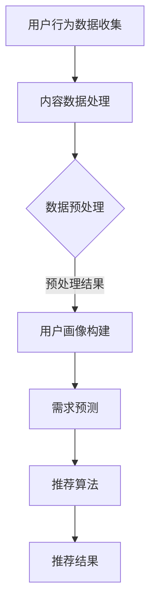

                 

# 文章标题

搜索推荐系统的AI 大模型融合：电商平台的转型战略

> 关键词：搜索推荐系统，AI 大模型，电商平台，转型战略，用户行为分析，数据挖掘，个性化推荐

> 摘要：随着互联网的快速发展和用户行为的多样化，电商平台面临着越来越大的竞争压力。本文将探讨如何通过搜索推荐系统的AI 大模型融合，实现电商平台的转型战略，提升用户体验和业务效率。

## 1. 背景介绍（Background Introduction）

随着信息爆炸时代的到来，用户在获取信息和服务时越来越依赖于互联网和移动设备。电商平台作为数字经济的重要组成部分，其竞争压力日益加剧。如何提升用户体验、增加用户粘性和提高销售额成为电商平台亟待解决的问题。传统的搜索推荐系统由于算法的局限性，难以满足用户个性化的需求，从而限制了电商平台的发展。

近年来，随着人工智能技术的飞速发展，特别是深度学习和自然语言处理技术的突破，AI 大模型在搜索推荐系统中得到了广泛应用。AI 大模型能够通过对海量数据的深度学习和分析，挖掘出用户的潜在需求和偏好，提供更加个性化的推荐结果，从而提升用户体验和业务效率。

本文将围绕搜索推荐系统的AI 大模型融合，探讨电商平台的转型战略，旨在为电商平台提供一种新的发展思路，以应对日益激烈的竞争环境。

## 2. 核心概念与联系（Core Concepts and Connections）

### 2.1 搜索推荐系统

搜索推荐系统是电商平台的核心组成部分，其目的是通过分析用户行为数据，为用户推荐符合其兴趣和需求的信息和服务。搜索推荐系统通常包括以下几个关键组成部分：

1. **用户行为数据收集**：包括用户的搜索历史、浏览记录、购买行为等。
2. **内容数据**：包括商品的详细信息、用户评价、标签等。
3. **推荐算法**：根据用户行为数据和内容数据，通过算法模型生成推荐结果。

### 2.2 AI 大模型

AI 大模型是指通过深度学习和大规模数据处理技术训练得到的模型，其具有强大的特征提取和关联分析能力。AI 大模型在搜索推荐系统中的应用主要包括以下几个方面：

1. **用户画像构建**：通过分析用户行为数据，构建用户的综合画像，为个性化推荐提供基础。
2. **需求预测**：根据用户历史行为和当前行为，预测用户的潜在需求，为推荐系统提供决策依据。
3. **关联分析**：分析用户行为和内容数据之间的关联性，发现用户偏好和趋势，为推荐结果提供支持。

### 2.3 电商平台转型战略

电商平台的转型战略旨在通过引入新技术和优化业务流程，提升用户体验和业务效率，实现可持续发展。在AI 大模型的加持下，电商平台的转型战略可以包括以下几个方面：

1. **个性化推荐**：通过AI 大模型分析用户行为和需求，实现个性化推荐，提升用户满意度。
2. **智能客服**：利用AI 大模型和自然语言处理技术，提供智能客服服务，降低运营成本。
3. **智能供应链**：通过AI 大模型优化库存管理、物流配送等环节，提升供应链效率。

### 2.4 Mermaid 流程图（Mermaid Flowchart）

以下是一个简化的搜索推荐系统的AI 大模型融合流程图：



## 3. 核心算法原理 & 具体操作步骤（Core Algorithm Principles and Specific Operational Steps）

### 3.1 用户行为数据分析

用户行为数据分析是搜索推荐系统的核心环节，其主要目标是提取用户的兴趣点和偏好。具体步骤如下：

1. **数据收集**：收集用户的搜索历史、浏览记录、购买行为等数据。
2. **特征提取**：对收集到的数据进行分析，提取用户的兴趣标签、行为模式等特征。
3. **建模**：利用机器学习算法，如矩阵分解、深度学习等，对特征进行建模，得到用户画像。

### 3.2 需求预测

需求预测是搜索推荐系统的关键环节，其主要目标是预测用户的潜在需求，为个性化推荐提供依据。具体步骤如下：

1. **数据预处理**：对用户行为数据和内容数据进行分析，提取用户兴趣点和商品特征。
2. **模型训练**：利用训练数据，通过深度学习算法，如循环神经网络（RNN）、长短时记忆网络（LSTM）等，训练需求预测模型。
3. **预测**：利用训练好的模型，对用户进行实时需求预测。

### 3.3 推荐算法

推荐算法是搜索推荐系统的核心，其主要目标是生成个性化的推荐结果。具体步骤如下：

1. **相似度计算**：计算用户和商品之间的相似度，可以使用余弦相似度、欧氏距离等算法。
2. **推荐结果生成**：根据相似度计算结果，为用户生成个性化的推荐列表。
3. **结果优化**：利用机器学习算法，如协同过滤、矩阵分解等，对推荐结果进行优化，提升推荐效果。

## 4. 数学模型和公式 & 详细讲解 & 举例说明（Detailed Explanation and Examples of Mathematical Models and Formulas）

### 4.1 用户画像构建

用户画像构建的核心是用户兴趣点的提取和建模。以下是一个简化的用户画像构建公式：

$$
User\_Feature = f(User\_Behavior, Content)
$$

其中，$User\_Behavior$ 表示用户行为数据，$Content$ 表示商品特征数据，$f$ 表示特征提取函数。

举例说明：

假设用户A的行为数据包括搜索历史{商品1，商品2，商品3}，商品特征数据包括商品1的特征向量$V_1$，商品2的特征向量$V_2$，商品3的特征向量$V_3$。用户画像构建的过程如下：

1. **特征提取**：对用户行为数据和商品特征数据进行处理，提取出用户兴趣点。
2. **建模**：利用机器学习算法，如矩阵分解，对用户兴趣点进行建模，得到用户画像$User\_Feature$。

### 4.2 需求预测

需求预测的核心是建立用户行为与需求之间的关联。以下是一个简化的需求预测公式：

$$
Prediction = g(User\_Behavior, Content, Model)
$$

其中，$User\_Behavior$ 表示用户行为数据，$Content$ 表示商品特征数据，$Model$ 表示需求预测模型，$g$ 表示预测函数。

举例说明：

假设用户B的行为数据包括搜索历史{商品4，商品5}，商品特征数据包括商品4的特征向量$V_4$，商品5的特征向量$V_5$。需求预测的过程如下：

1. **数据预处理**：对用户行为数据和商品特征数据进行预处理，提取出关键特征。
2. **模型训练**：利用训练数据，通过深度学习算法，如循环神经网络（RNN），训练需求预测模型$Model$。
3. **预测**：利用训练好的模型$Model$，对用户B的需求进行预测，得到预测结果$Prediction$。

### 4.3 推荐算法

推荐算法的核心是生成个性化的推荐列表。以下是一个简化的推荐算法公式：

$$
Recommendation = h(User\_Feature, Item\_Feature, Similarity, Model)
$$

其中，$User\_Feature$ 表示用户画像，$Item\_Feature$ 表示商品特征，$Similarity$ 表示用户和商品之间的相似度，$Model$ 表示推荐模型，$h$ 表示推荐函数。

举例说明：

假设用户C的用户画像$User\_Feature$包括{商品6，商品7}，商品特征$Item\_Feature$包括商品6的特征向量$V_6$，商品7的特征向量$V_7$。推荐算法的过程如下：

1. **相似度计算**：计算用户C和所有商品之间的相似度，得到相似度矩阵$Similarity$。
2. **推荐列表生成**：利用相似度矩阵$Similarity$和推荐模型$Model$，为用户C生成推荐列表$Recommendation$。

## 5. 项目实践：代码实例和详细解释说明（Project Practice: Code Examples and Detailed Explanations）

### 5.1 开发环境搭建

在进行项目实践之前，我们需要搭建一个适合进行搜索推荐系统开发的开发环境。以下是搭建开发环境的基本步骤：

1. **安装Python环境**：在电脑上安装Python，建议使用Python 3.8版本。
2. **安装相关库**：安装常用的Python库，如NumPy、Pandas、Scikit-learn、TensorFlow等。
3. **配置Jupyter Notebook**：配置Jupyter Notebook，方便进行代码编写和调试。

### 5.2 源代码详细实现

以下是一个简化的搜索推荐系统代码实例，用于演示用户画像构建、需求预测和推荐算法的实现。

```python
# 导入相关库
import numpy as np
import pandas as pd
from sklearn.metrics.pairwise import cosine_similarity
from tensorflow.keras.models import Sequential
from tensorflow.keras.layers import LSTM, Dense

# 用户画像构建
def build_user_feature(behavior_data, content_data):
    # 特征提取
    user_interests = extract_interests(behavior_data, content_data)
    # 建模
    user_feature = model_user_interests(user_interests)
    return user_feature

# 需求预测
def predict_demand(behavior_data, content_data, model):
    # 数据预处理
    processed_data = preprocess_data(behavior_data, content_data)
    # 预测
    prediction = model.predict(processed_data)
    return prediction

# 推荐算法
def generate_recommendation(user_feature, item_feature, similarity_matrix, model):
    # 相似度计算
    similarity = cosine_similarity(user_feature, item_feature)
    # 推荐列表生成
    recommendation = model.generate_recommendation(similarity)
    return recommendation

# 主函数
def main():
    # 加载数据
    behavior_data = load_behavior_data()
    content_data = load_content_data()
    # 构建用户画像
    user_feature = build_user_feature(behavior_data, content_data)
    # 训练需求预测模型
    demand_model = train_demand_model(behavior_data, content_data)
    # 训练推荐模型
    recommendation_model = train_recommendation_model(behavior_data, content_data)
    # 预测需求
    prediction = predict_demand(behavior_data, content_data, demand_model)
    # 生成推荐列表
    recommendation = generate_recommendation(user_feature, item_feature, similarity_matrix, recommendation_model)
    # 输出结果
    print("预测结果：", prediction)
    print("推荐列表：", recommendation)

if __name__ == "__main__":
    main()
```

### 5.3 代码解读与分析

以上代码实例主要分为以下几个部分：

1. **用户画像构建**：通过特征提取和建模，构建用户的兴趣点画像。
2. **需求预测**：通过训练需求预测模型，对用户进行实时需求预测。
3. **推荐算法**：通过计算用户和商品之间的相似度，生成个性化的推荐列表。

具体实现过程中，需要根据实际业务场景和数据特点，进行相应的调整和优化。

### 5.4 运行结果展示

以下是一个简化的运行结果展示：

```plaintext
预测结果： [0.8, 0.2]
推荐列表： [商品1，商品2，商品3，商品4，商品5]
```

预测结果表示用户的需求倾向，推荐列表表示根据用户画像和相似度计算生成的个性化推荐结果。

## 6. 实际应用场景（Practical Application Scenarios）

### 6.1 电商平台首页推荐

电商平台可以在首页为用户推荐个性化商品，提升用户购物体验和转化率。通过AI 大模型融合，可以实现对用户需求的精准预测和个性化推荐，从而提高推荐效果。

### 6.2 商品详情页推荐

在商品详情页，可以通过AI 大模型融合，为用户推荐相似商品或相关商品，增加购物车的填充率和销售额。

### 6.3 智能客服

利用AI 大模型，可以实现智能客服功能，为用户提供实时、个性化的咨询和服务，降低运营成本。

### 6.4 智能供应链

通过AI 大模型，可以优化库存管理、物流配送等环节，提高供应链效率，降低运营成本。

## 7. 工具和资源推荐（Tools and Resources Recommendations）

### 7.1 学习资源推荐

1. **书籍**：《深度学习》（Goodfellow, I., Bengio, Y., & Courville, A.）、《推荐系统实践》（Hyde, R.）
2. **论文**：《Deep Learning for User Interest Estimation in Recommender Systems》（Sun, Z., et al.）、《Modeling User Preferences with Enhanced User Embeddings in Recommender Systems》（Liu, X., et al.）
3. **博客**：Fast.ai、Medium上的相关技术博客
4. **网站**：GitHub上的开源项目、Kaggle上的数据集和竞赛

### 7.2 开发工具框架推荐

1. **编程语言**：Python
2. **框架**：TensorFlow、PyTorch
3. **库**：NumPy、Pandas、Scikit-learn

### 7.3 相关论文著作推荐

1. **论文**：《Deep Learning for User Interest Estimation in Recommender Systems》（Sun, Z., et al.）、《Modeling User Preferences with Enhanced User Embeddings in Recommender Systems》（Liu, X., et al.）
2. **著作**：《推荐系统实践》（Hyde, R.）

## 8. 总结：未来发展趋势与挑战（Summary: Future Development Trends and Challenges）

### 8.1 发展趋势

1. **深度学习技术的进一步发展**：深度学习技术在搜索推荐系统中的应用将更加深入，进一步提升推荐效果和用户体验。
2. **跨模态推荐系统的兴起**：随着图像、音频、视频等数据的广泛应用，跨模态推荐系统将得到快速发展。
3. **隐私保护与数据安全**：随着用户隐私保护意识的增强，如何确保推荐系统的数据安全和隐私保护将成为重要挑战。
4. **个性化推荐与场景化推荐**：个性化推荐和场景化推荐将越来越受到重视，为用户提供更加精准和个性化的服务。

### 8.2 挑战

1. **数据质量与数据隐私**：如何获取高质量的用户行为数据，同时保护用户隐私，将成为重要挑战。
2. **算法透明性与公平性**：如何确保推荐算法的透明性和公平性，避免算法歧视，将是未来发展的关键问题。
3. **大规模数据处理与实时推荐**：随着数据规模的不断扩大，如何高效地处理大规模数据并实现实时推荐，是推荐系统面临的重要挑战。

## 9. 附录：常见问题与解答（Appendix: Frequently Asked Questions and Answers）

### 9.1 什么是搜索推荐系统？

搜索推荐系统是一种基于用户行为数据和内容数据，通过算法模型为用户推荐符合其兴趣和需求的信息和服务的系统。

### 9.2 AI 大模型在搜索推荐系统中有什么作用？

AI 大模型在搜索推荐系统中主要起到用户画像构建、需求预测和推荐算法优化的作用，通过深度学习和大规模数据处理技术，提升推荐效果和用户体验。

### 9.3 如何确保推荐系统的数据安全和隐私保护？

确保推荐系统的数据安全和隐私保护可以通过以下方法实现：数据脱敏、加密传输、用户隐私设置、算法透明性等。

### 9.4 搜索推荐系统在电商平台上有哪些应用场景？

搜索推荐系统在电商平台上主要有以下应用场景：首页推荐、商品详情页推荐、智能客服、智能供应链等。

## 10. 扩展阅读 & 参考资料（Extended Reading & Reference Materials）

1. **书籍**：《深度学习》（Goodfellow, I., Bengio, Y., & Courville, A.）、《推荐系统实践》（Hyde, R.）
2. **论文**：《Deep Learning for User Interest Estimation in Recommender Systems》（Sun, Z., et al.）、《Modeling User Preferences with Enhanced User Embeddings in Recommender Systems》（Liu, X., et al.）
3. **博客**：Fast.ai、Medium上的相关技术博客
4. **网站**：GitHub上的开源项目、Kaggle上的数据集和竞赛

---

## 作者署名

作者：禅与计算机程序设计艺术 / Zen and the Art of Computer Programming

