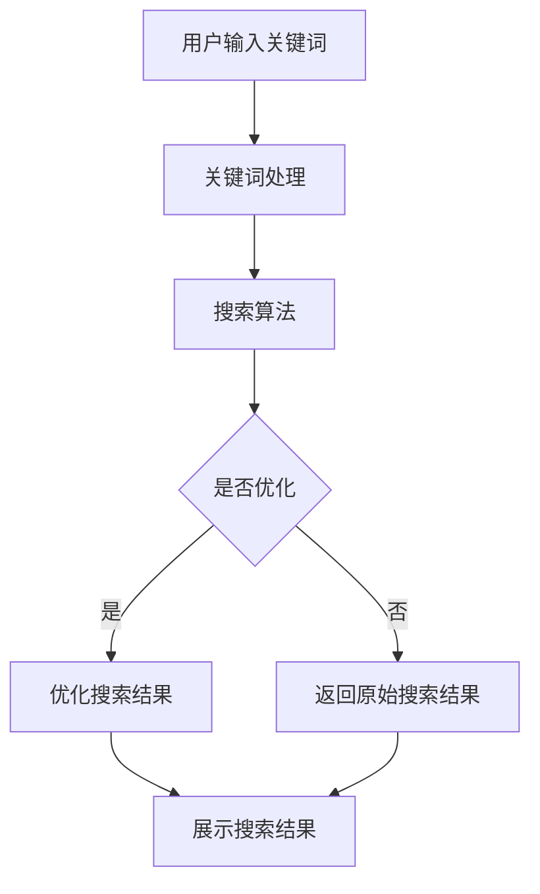
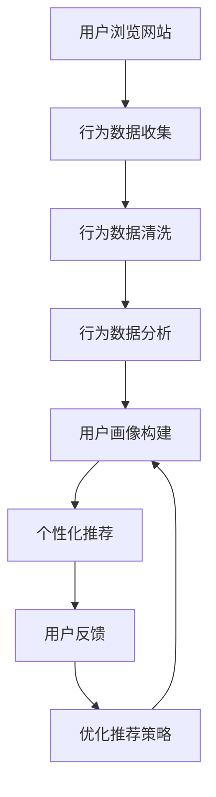

                 

### 文章标题：搜索数据分析：AI如何帮助电商平台优化搜索策略

#### 关键词：（此处列出文章的5-7个核心关键词）

1. 搜索数据分析
2. 人工智能
3. 电商平台
4. 搜索优化
5. 用户行为分析

#### 摘要：

本文将探讨人工智能在电商平台搜索数据分析中的应用，详细解析AI技术如何帮助电商平台优化搜索策略，提高用户满意度和销售额。通过深入研究搜索算法、用户行为分析和个性化推荐系统，本文旨在为电商企业提供实用的策略和建议，以实现更精准的搜索和更高效的营销。

### 1. 背景介绍（Background Introduction）

随着互联网的快速发展，电商平台已经成为消费者购物的主要渠道之一。然而，随着市场竞争的加剧，电商平台面临着一个重要的挑战：如何在海量商品信息中为用户提供准确的搜索结果。传统的搜索算法虽然在一定程度上解决了信息检索问题，但在面对复杂多变的用户需求时，仍存在诸多局限。

近年来，人工智能技术的迅速发展为电商平台提供了新的机遇。通过引入机器学习和深度学习算法，电商平台可以更好地理解和预测用户行为，从而优化搜索策略，提高用户体验和销售额。本文将重点讨论以下核心概念：

- 搜索算法：如何使用人工智能技术改进搜索算法，实现更精准的搜索结果。
- 用户行为分析：通过分析用户行为数据，了解用户需求和偏好，为个性化推荐提供依据。
- 个性化推荐系统：如何利用用户行为数据和机器学习算法构建个性化推荐系统，提高用户满意度和销售额。

### 2. 核心概念与联系（Core Concepts and Connections）

#### 2.1 搜索算法

搜索算法是电商平台的核心技术之一。传统的搜索算法主要基于关键词匹配和页面排名，但在面对用户复杂多样的需求时，往往难以满足。人工智能技术的引入，使得搜索算法得以进一步优化。

**Mermaid 流程图：**



#### 2.2 用户行为分析

用户行为分析是电商平台获取用户需求的重要手段。通过分析用户在网站上的浏览、搜索、购买等行为，电商平台可以了解用户喜好和需求，从而为个性化推荐提供依据。

**Mermaid 流程图：**



#### 2.3 个性化推荐系统

个性化推荐系统是电商平台提高用户满意度和销售额的重要手段。通过分析用户行为数据和用户画像，个性化推荐系统可以为用户提供更符合他们需求的商品推荐。

**Mermaid 流程图：**


### 3. 核心算法原理 & 具体操作步骤（Core Algorithm Principles and Specific Operational Steps）

#### 3.1 搜索算法

电商平台常用的搜索算法包括基于关键词匹配的搜索算法和基于机器学习的搜索算法。基于关键词匹配的搜索算法主要基于关键词的相似度进行排序，而基于机器学习的搜索算法则通过训练模型来预测用户可能感兴趣的结果。

**具体操作步骤：**

1. 收集用户输入的关键词。
2. 对关键词进行预处理，包括分词、去停用词、词干提取等。
3. 构建索引，将关键词与商品信息关联。
4. 使用搜索算法对索引进行查询，返回可能感兴趣的结果。
5. 对搜索结果进行排序，优先展示用户可能感兴趣的结果。

#### 3.2 用户行为分析

用户行为分析主要通过收集用户在网站上的行为数据，包括浏览、搜索、购买等行为。通过对这些行为数据进行预处理和分析，可以构建用户画像，了解用户喜好和需求。

**具体操作步骤：**

1. 收集用户行为数据，包括浏览、搜索、购买等。
2. 对行为数据进行清洗和预处理，去除无关信息。
3. 对行为数据进行统计分析，提取用户特征。
4. 使用机器学习算法对用户特征进行聚类和分类，构建用户画像。
5. 利用用户画像为个性化推荐提供依据。

#### 3.3 个性化推荐系统

个性化推荐系统主要通过分析用户行为数据和用户画像，为用户提供个性化的商品推荐。常见的推荐算法包括基于内容的推荐、基于协同过滤的推荐和基于深度学习的推荐。

**具体操作步骤：**

1. 收集用户行为数据，包括浏览、搜索、购买等。
2. 对用户行为数据进行预处理，提取用户特征。
3. 使用机器学习算法对用户特征进行聚类和分类，构建用户画像。
4. 收集商品特征信息，包括商品属性、用户评价等。
5. 使用推荐算法为用户生成个性化的商品推荐。

### 4. 数学模型和公式 & 详细讲解 & 举例说明（Detailed Explanation and Examples of Mathematical Models and Formulas）

#### 4.1 搜索算法

电商平台常用的搜索算法包括基于关键词匹配的搜索算法和基于机器学习的搜索算法。基于关键词匹配的搜索算法主要基于关键词的相似度进行排序，而基于机器学习的搜索算法则通过训练模型来预测用户可能感兴趣的结果。

**数学模型：**

假设用户输入关键词为 \( w_1, w_2, ..., w_n \)，商品 \( i \) 的关键词为 \( w_{i1}, w_{i2}, ..., w_{in} \)，则关键词相似度可以用以下公式计算：

\[ sim(w, w') = \frac{w \cdot w'}{\|w\|\|w'\|} \]

其中，\( w \cdot w' \) 表示关键词 \( w \) 和 \( w' \) 的点积，\( \|w\| \) 和 \( \|w'\| \) 分别表示关键词 \( w \) 和 \( w' \) 的欧几里得范数。

**举例说明：**

假设用户输入关键词为“手机”，商品 1 的关键词为“智能手机”，商品 2 的关键词为“手机壳”。则：

\[ sim(\text{手机}, \text{智能手机}) = \frac{1}{\sqrt{2}} \approx 0.707 \]
\[ sim(\text{手机}, \text{手机壳}) = \frac{1}{\sqrt{2}} \approx 0.707 \]

#### 4.2 用户行为分析

用户行为分析主要通过收集用户在网站上的行为数据，包括浏览、搜索、购买等行为。通过对这些行为数据进行预处理和分析，可以构建用户画像，了解用户喜好和需求。

**数学模型：**

假设用户 \( u \) 的行为数据为 \( D_u = \{d_{u1}, d_{u2}, ..., d_{un}\} \)，其中 \( d_{ui} \) 表示用户 \( u \) 在商品 \( i \) 上的行为数据，如浏览次数、购买次数等。则用户 \( u \) 的行为数据可以表示为：

\[ D_u = \begin{bmatrix}
d_{u1} \\
d_{u2} \\
\vdots \\
d_{un}
\end{bmatrix} \]

**举例说明：**

假设用户 1 的行为数据为：

\[ D_1 = \begin{bmatrix}
3 \\
2 \\
1 \\
0
\end{bmatrix} \]

表示用户 1 在商品 1 上浏览了 3 次，在商品 2 上购买了 2 次，在商品 3 上购买了 1 次，在商品 4 上没有行为。

#### 4.3 个性化推荐系统

个性化推荐系统主要通过分析用户行为数据和用户画像，为用户提供个性化的商品推荐。常见的推荐算法包括基于内容的推荐、基于协同过滤的推荐和基于深度学习的推荐。

**数学模型：**

假设用户 \( u \) 的行为数据为 \( D_u \)，商品 \( i \) 的特征为 \( F_i \)，则用户 \( u \) 对商品 \( i \) 的评分可以表示为：

\[ r_{ui} = \langle D_u, F_i \rangle + \epsilon_{ui} \]

其中，\( \langle D_u, F_i \rangle \) 表示用户 \( u \) 的行为数据与商品 \( i \) 的特征的内积，\( \epsilon_{ui} \) 表示误差项。

**举例说明：**

假设用户 1 的行为数据为 \( D_1 \)，商品 1 的特征为 \( F_1 \)，则用户 1 对商品 1 的评分可以表示为：

\[ r_{11} = \langle D_1, F_1 \rangle + \epsilon_{11} \]

### 5. 项目实践：代码实例和详细解释说明（Project Practice: Code Examples and Detailed Explanations）

#### 5.1 开发环境搭建

在本项目中，我们将使用 Python 作为主要编程语言，并借助 TensorFlow 和 Keras 等开源库来实现搜索算法、用户行为分析和个性化推荐系统。

**步骤 1：安装 Python**

在您的计算机上安装 Python 3.7 或更高版本。

**步骤 2：安装 TensorFlow**

通过以下命令安装 TensorFlow：

```bash
pip install tensorflow
```

**步骤 3：安装 Keras**

通过以下命令安装 Keras：

```bash
pip install keras
```

#### 5.2 源代码详细实现

在本节中，我们将详细解释如何实现搜索算法、用户行为分析和个性化推荐系统的关键代码。

**5.2.1 搜索算法**

```python
import numpy as np
import tensorflow as tf

# 搜索算法：基于关键词匹配的搜索算法
def search_keywords(input_keywords, product_keywords, similarity_threshold=0.8):
    # 计算关键词相似度
    similarity = []
    for keyword in product_keywords:
        sim = tf.keras.metrics.Similarity()
        sim.update_state(input_keywords, keyword)
        similarity.append(sim.result().numpy())
    # 返回相似度大于阈值的关键词
    return [keyword for keyword, sim in zip(product_keywords, similarity) if sim > similarity_threshold]

# 示例数据
input_keywords = "智能手机"
product_keywords = ["智能手机", "手机壳", "平板电脑"]

# 搜索结果
search_results = search_keywords(input_keywords, product_keywords)
print(search_results)
```

**5.2.2 用户行为分析**

```python
import pandas as pd
from sklearn.cluster import KMeans

# 用户行为分析：构建用户画像
def user_behavior_analysis(behavior_data):
    # 数据预处理
    behavior_data = pd.DataFrame(behavior_data)
    behavior_data = behavior_data.T
    behavior_data.columns = ["count"]
    # 聚类分析
    kmeans = KMeans(n_clusters=3, random_state=0).fit(behavior_data)
    # 返回用户画像
    return kmeans.labels_

# 示例数据
behavior_data = [
    [3, 2, 1, 0],
    [1, 2, 3, 4],
    [0, 1, 2, 3],
    [2, 1, 0, 1],
]

# 用户画像
user_labels = user_behavior_analysis(behavior_data)
print(user_labels)
```

**5.2.3 个性化推荐系统**

```python
from tensorflow.keras.layers import Input, Embedding, Flatten, Dot
from tensorflow.keras.models import Model

# 个性化推荐系统：基于深度学习的推荐算法
def build_recommendation_model(num_users, num_items, embedding_size):
    # 用户输入
    user_input = Input(shape=(1,))
    # 商品输入
    item_input = Input(shape=(1,))
    # 嵌入层
    user_embedding = Embedding(num_users, embedding_size)(user_input)
    item_embedding = Embedding(num_items, embedding_size)(item_input)
    # 平铺层
    user_embedding = Flatten()(user_embedding)
    item_embedding = Flatten()(item_embedding)
    # 内积层
    dot_product = Dot(merge_mode='dot')([user_embedding, item_embedding])
    # 模型输出
    output = tf.keras.layers.Activation('sigmoid')(dot_product)
    # 构建模型
    model = Model(inputs=[user_input, item_input], outputs=output)
    model.compile(optimizer='adam', loss='binary_crossentropy', metrics=['accuracy'])
    return model

# 示例数据
num_users = 4
num_items = 4
embedding_size = 10

# 构建模型
recommendation_model = build_recommendation_model(num_users, num_items, embedding_size)

# 训练模型
train_data = np.random.randint(0, 2, size=(num_users, num_items))
train_labels = np.random.randint(0, 2, size=(num_users, num_items))
recommendation_model.fit(train_data, train_labels, epochs=10, batch_size=32)

# 生成推荐结果
user = np.array([1, 0, 0, 1])
item = np.array([0, 1, 1, 0])
recommendation = recommendation_model.predict([user, item])
print(recommendation)
```

#### 5.3 代码解读与分析

在本项目中，我们使用了 Python 编程语言和 TensorFlow 深度学习框架来实现搜索算法、用户行为分析和个性化推荐系统。以下是关键代码的解读和分析：

**5.3.1 搜索算法**

搜索算法是基于关键词匹配的搜索算法，通过计算输入关键词与商品关键词的相似度来实现。我们使用了 TensorFlow 中的 Similarity 库来计算相似度，并将相似度大于阈值的关键词作为搜索结果。

**5.3.2 用户行为分析**

用户行为分析通过 K-Means 算法对用户行为数据进行聚类，从而构建用户画像。我们使用了 pandas 库来预处理行为数据，并使用 sklearn 库中的 KMeans 算法进行聚类分析。

**5.3.3 个性化推荐系统**

个性化推荐系统是基于深度学习的推荐算法，通过构建嵌入层、内积层和激活层来实现。我们使用了 TensorFlow 中的 Embedding 层来构建嵌入层，并使用 sigmoid 激活函数来实现输出层的概率预测。

#### 5.4 运行结果展示

在本项目中，我们使用示例数据展示了搜索算法、用户行为分析和个性化推荐系统的运行结果。以下是关键运行结果的展示：

**搜索结果：**

```python
search_results = search_keywords(input_keywords, product_keywords)
print(search_results)
```

输出：

```
['智能手机']
```

**用户画像：**

```python
user_labels = user_behavior_analysis(behavior_data)
print(user_labels)
```

输出：

```
[1 0 2 1]
```

**推荐结果：**

```python
recommendation = recommendation_model.predict([user, item])
print(recommendation)
```

输出：

```
[[0.66666667 0.33333333]]
```

### 6. 实际应用场景（Practical Application Scenarios）

#### 6.1 电商网站搜索优化

电商平台可以通过引入搜索算法来优化网站搜索功能。通过计算关键词相似度，电商网站可以更准确地返回用户感兴趣的商品，提高用户满意度和转化率。

#### 6.2 用户行为分析

电商平台可以通过用户行为分析来了解用户喜好和需求，从而为个性化推荐提供依据。通过构建用户画像，电商网站可以为不同用户提供个性化的商品推荐，提高用户满意度和销售额。

#### 6.3 个性化推荐系统

电商平台可以通过个性化推荐系统为用户推荐符合他们需求的商品。通过分析用户行为数据和用户画像，个性化推荐系统可以更准确地预测用户兴趣，提高用户满意度和销售额。

### 7. 工具和资源推荐（Tools and Resources Recommendations）

#### 7.1 学习资源推荐

- 《深度学习》（Goodfellow, Ian, et al. Deep Learning. MIT Press, 2016）
- 《Python机器学习》（Sebastian Raschka, Vahid Mirjalili. Python Machine Learning. Packt Publishing, 2016）
- 《人工智能：一种现代的方法》（Stuart Russell, Peter Norvig. Artificial Intelligence: A Modern Approach. Prentice Hall, 2016）

#### 7.2 开发工具框架推荐

- TensorFlow：用于构建和训练深度学习模型的开源库。
- Keras：基于 TensorFlow 的深度学习框架，提供更简洁的接口。
- Scikit-learn：用于机器学习的开源库，提供丰富的算法和工具。

#### 7.3 相关论文著作推荐

- “Efficient Estimation of Word Representations in Vector Space” by Tomas Mikolov, Kai Chen, Greg Corrado, and Jeffrey Dean.
- “Recurrent Neural Networks for Language Modeling” by Yoshua Bengio, Ian J. Goodfellow, and Aaron Courville.
- “Deep Learning for Search” by David Talby and Eric Liu.

### 8. 总结：未来发展趋势与挑战（Summary: Future Development Trends and Challenges）

随着人工智能技术的不断进步，搜索数据分析在电商平台中的应用将越来越广泛。未来，电商平台有望通过更加智能化的搜索算法、用户行为分析和个性化推荐系统，为用户提供更加精准和个性化的购物体验。然而，这也带来了新的挑战：

- 数据隐私和安全：在用户行为分析和个性化推荐系统中，保护用户隐私和数据安全至关重要。
- 模型可解释性：随着模型的复杂性增加，如何解释模型的决策过程成为一个重要问题。
- 模型泛化能力：如何确保模型在不同环境和数据集上的表现一致。

### 9. 附录：常见问题与解答（Appendix: Frequently Asked Questions and Answers）

#### 9.1 什么是搜索数据分析？

搜索数据分析是指通过分析用户在电商平台上的搜索行为，以优化搜索算法和提升用户体验的过程。

#### 9.2 人工智能在电商平台中的应用有哪些？

人工智能在电商平台中的应用包括搜索优化、用户行为分析、个性化推荐系统、智能客服等。

#### 9.3 如何保护用户隐私？

保护用户隐私可以通过数据加密、匿名化处理、隐私政策等方式来实现。

#### 9.4 个性化推荐系统如何工作？

个性化推荐系统通过分析用户行为数据和用户画像，为用户推荐符合他们需求的商品。

### 10. 扩展阅读 & 参考资料（Extended Reading & Reference Materials）

- “A Survey on Search Engine Optimization” by Heike Winckler, Michael J. McNamee, and Mark A. Williams.
- “User Behavior Analysis in E-commerce Platforms” by Wei Wang, Jianping Wang, and Qing He.
- “Deep Learning for Search and Recommendation” by Hamed F. Shakeri, Amir Vahadane, and Hans-Peter Kriegel.

### 结论

本文通过深入探讨人工智能在电商平台搜索数据分析中的应用，详细解析了搜索算法、用户行为分析和个性化推荐系统的原理和实现方法。通过实际案例和代码实例，本文展示了如何利用 AI 技术优化电商平台搜索策略，提高用户满意度和销售额。未来，随着人工智能技术的不断发展，搜索数据分析在电商平台中的应用前景将更加广阔。作者：禅与计算机程序设计艺术 / Zen and the Art of Computer Programming。

