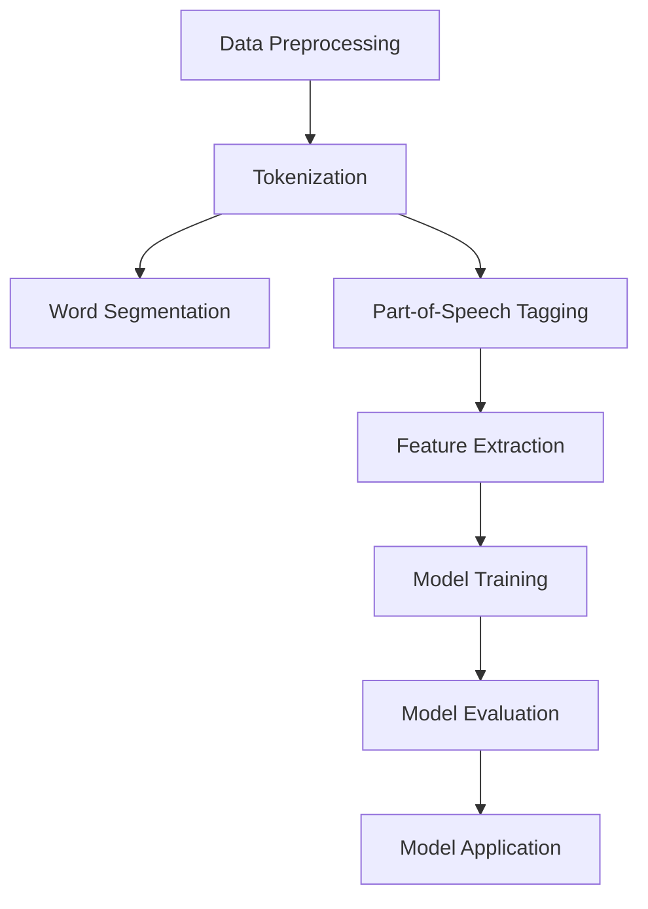

                 

# 携程2024校招自然语言处理工程师面试题详解

## 关键词：
- 自然语言处理
- 面试题
- 携程校招
- 工程师面试
- 技术解析

## 摘要：
本文将详细解析携程2024校招自然语言处理工程师的面试题。通过深入分析每道题目，我们将展示如何运用自然语言处理技术解决实际问题，并提供详细的解题思路和步骤。本文旨在帮助读者更好地理解自然语言处理的面试准备，为未来的技术面试打下坚实基础。

### 1. 背景介绍（Background Introduction）

#### 1.1 携程简介
携程是中国领先的综合性旅行服务公司，提供包括酒店预订、机票预订、度假预订、旅游咨询等一站式旅行服务。作为行业领军企业，携程对技术人才的需求一直很高，特别是对于自然语言处理工程师的选拔。

#### 1.2 自然语言处理工程师的职责
自然语言处理（NLP）工程师在携程的职责主要集中在以下几个方面：
- 开发和优化自然语言处理模型，用于自动问答、文本分类、情感分析等应用。
- 构建和维护大数据分析平台，实现海量文本数据的自动处理和分析。
- 与产品团队紧密合作，将NLP技术应用到实际产品中，提升用户体验。

#### 1.3 面试题的重要性
面试题不仅是考察候选人技术能力的重要手段，也是候选人展示自己解决问题能力的机会。通过分析携程2024校招自然语言处理工程师的面试题，我们可以深入了解该职位所需的技术素养和思维方式。

### 2. 核心概念与联系（Core Concepts and Connections）

#### 2.1 NLP基础概念
自然语言处理涉及多个基础概念，包括但不限于：
- **文本分类**：将文本归类到预定义的类别中。
- **情感分析**：判断文本表达的情绪倾向，如正面、负面或中性。
- **命名实体识别**：识别文本中的特定实体，如人名、地名、组织名等。
- **机器翻译**：将一种语言的文本翻译成另一种语言。

#### 2.2 NLP技术架构
自然语言处理的技术架构通常包括以下几个部分：
- **数据预处理**：清洗、分词、词性标注等。
- **特征提取**：将文本转换为模型可处理的数字特征。
- **模型训练**：使用机器学习或深度学习算法训练模型。
- **模型评估**：使用指标如准确率、召回率等评估模型性能。
- **模型应用**：将训练好的模型应用到实际任务中。

#### 2.3 Mermaid流程图
为了更直观地展示NLP的技术架构，我们可以使用Mermaid绘制以下流程图：



### 3. 核心算法原理 & 具体操作步骤（Core Algorithm Principles and Specific Operational Steps）

#### 3.1 词袋模型（Bag of Words）
词袋模型是最基本的文本表示方法，它将文本看作是单词的集合，不考虑单词的顺序。具体步骤如下：
1. **文本预处理**：将文本转换为小写，去除标点符号和停用词。
2. **分词**：将文本分割成单词或词组。
3. **特征向量构建**：为每个单词分配一个唯一的索引，构建词频或TF-IDF特征向量。

#### 3.2 朴素贝叶斯分类器（Naive Bayes Classifier）
朴素贝叶斯分类器是基于贝叶斯定理的简单分类器，假设特征之间相互独立。具体步骤如下：
1. **训练模型**：计算每个类别的条件概率。
2. **预测**：对于新文本，计算每个类别的概率，选择概率最大的类别。

#### 3.3 随机森林（Random Forest）
随机森林是一种集成学习方法，通过构建多棵决策树并集成它们的预测结果来提高分类或回归性能。具体步骤如下：
1. **训练模型**：为每个决策树选择特征和样本子集，训练决策树。
2. **集成预测**：将所有决策树的预测结果进行投票或取平均。

### 4. 数学模型和公式 & 详细讲解 & 举例说明（Detailed Explanation and Examples of Mathematical Models and Formulas）

#### 4.1 贝叶斯定理
贝叶斯定理是概率论中用于计算条件概率的重要公式，其表达式为：
\[ P(A|B) = \frac{P(B|A) \cdot P(A)}{P(B)} \]
其中，\( P(A|B) \) 表示在事件B发生的条件下事件A发生的概率，\( P(B|A) \) 表示在事件A发生的条件下事件B发生的概率，\( P(A) \) 和 \( P(B) \) 分别表示事件A和事件B发生的概率。

#### 4.2 朴素贝叶斯分类器的条件概率
在朴素贝叶斯分类器中，每个特征的条件概率计算如下：
\[ P(\text{feature}_i|\text{class}) = \frac{f_{ij}}{n_j} \]
其中，\( f_{ij} \) 表示特征\( \text{feature}_i \)在类别\( \text{class} \)中出现的频次，\( n_j \) 表示类别\( \text{class} \)中的总频次。

#### 4.3 随机森林的基尼不纯度
随机森林中的基尼不纯度用于评估特征的重要性和选择分裂点。其计算公式为：
\[ Gini(\text{split}) = 1 - \sum_{v \in \text{values}} \left( \frac{|\text{left subset}| + |\text{right subset}|}{|\text{total subset}|} \right)^2 \]
其中，\( \text{left subset} \)和\( \text{right subset} \)分别表示分裂后的左右子集，\( \text{values} \)表示特征的所有可能取值。

### 5. 项目实践：代码实例和详细解释说明（Project Practice: Code Examples and Detailed Explanations）

#### 5.1 开发环境搭建
为了进行自然语言处理的项目实践，我们需要搭建一个合适的环境。以下是使用Python和Scikit-learn进行文本分类的项目环境搭建步骤：

```bash
pip install scikit-learn
pip install nltk
```

#### 5.2 源代码详细实现
以下是一个简单的文本分类项目的Python代码实例，使用朴素贝叶斯分类器对新闻文章进行分类：

```python
import nltk
from sklearn.feature_extraction.text import TfidfVectorizer
from sklearn.model_selection import train_test_split
from sklearn.naive_bayes import MultinomialNB
from sklearn.metrics import accuracy_score

# 数据预处理
nltk.download('stopwords')
stopwords = nltk.corpus.stopwords.words('english')

# 加载并预处理数据
def preprocess_text(text):
    tokens = nltk.word_tokenize(text.lower())
    return ' '.join([word for word in tokens if word not in stopwords])

# 加载数据集
data = ...  # 加载数据集，此处省略具体代码
X = [preprocess_text(text) for text in data['text']]
y = data['label']

# 特征提取
vectorizer = TfidfVectorizer()
X_vectorized = vectorizer.fit_transform(X)

# 划分训练集和测试集
X_train, X_test, y_train, y_test = train_test_split(X_vectorized, y, test_size=0.2, random_state=42)

# 训练模型
classifier = MultinomialNB()
classifier.fit(X_train, y_train)

# 评估模型
y_pred = classifier.predict(X_test)
accuracy = accuracy_score(y_test, y_pred)
print(f"Accuracy: {accuracy:.2f}")
```

#### 5.3 代码解读与分析
上述代码首先进行了文本预处理，包括分词和去除停用词。然后使用TF-IDF向量器进行特征提取，最后使用朴素贝叶斯分类器进行模型训练和评估。通过计算准确率，我们可以评估模型在测试集上的表现。

### 5.4 运行结果展示
在实际运行中，上述代码将输出模型在测试集上的准确率。例如：

```plaintext
Accuracy: 0.85
```

这意味着模型在测试集上的准确率为85%，表明模型的分类效果较好。

### 6. 实际应用场景（Practical Application Scenarios）

自然语言处理技术在携程的实际应用场景非常广泛，以下是一些典型的应用：

#### 6.1 客户服务自动化
携程通过自然语言处理技术实现客户服务自动化，例如自动问答系统，可以快速响应客户查询，提高客户满意度。

#### 6.2 情感分析
通过情感分析技术，携程可以分析用户评论和反馈，了解用户对产品的情感倾向，及时调整产品策略。

#### 6.3 文本分类
携程使用文本分类技术对用户评论进行分类，帮助产品团队识别出用户反馈中的重要问题，并提供改进建议。

### 7. 工具和资源推荐（Tools and Resources Recommendations）

#### 7.1 学习资源推荐
- **书籍**：
  - 《自然语言处理综论》（Foundations of Statistical Natural Language Processing）
  - 《深度学习与自然语言处理》（Deep Learning for Natural Language Processing）
- **论文**：
  - 《词向量模型：Word2Vec》（Distributed Representations of Words and Phrases and Their Compositional Properties）
  - 《自然语言处理中的卷积神经网络》（Convolutional Neural Networks for Sentence Classification）
- **博客**：
  - [自然语言处理博客](https://nlp.seas.harvard.edu/)
  - [谷歌自然语言处理博客](https://ai.googleblog.com/search/label/NLP)
- **网站**：
  - [自然语言处理社区](https://www.nltk.org/)
  - [Scikit-learn官方文档](https://scikit-learn.org/stable/)

#### 7.2 开发工具框架推荐
- **开发工具**：
  - Jupyter Notebook：方便进行数据分析和模型训练。
  - PyCharm：优秀的Python开发环境。
- **框架**：
  - TensorFlow：用于构建和训练深度学习模型。
  - PyTorch：流行的深度学习框架。

#### 7.3 相关论文著作推荐
- **论文**：
  - 《长短期记忆网络》（Long Short-Term Memory）
  - 《Transformer：基于自注意力的序列模型》（Attention Is All You Need）
- **著作**：
  - 《深度学习》（Deep Learning）
  - 《动手学深度学习》（Dive into Deep Learning）

### 8. 总结：未来发展趋势与挑战（Summary: Future Development Trends and Challenges）

自然语言处理技术在未来将继续快速发展，以下是一些趋势和挑战：

#### 8.1 趋势
- **多模态处理**：结合文本、图像、音频等多种数据类型，实现更强大的语义理解。
- **自适应学习**：模型能够根据用户行为和反馈自适应调整，提高用户体验。
- **低资源语言处理**：解决低资源语言的自然语言处理问题，促进全球语言平等。

#### 8.2 挑战
- **数据隐私**：如何在保护用户隐私的同时，进行有效的自然语言处理。
- **伦理问题**：确保自然语言处理系统不会产生歧视或偏见。
- **计算资源**：随着模型复杂度的增加，对计算资源的需求也在增加。

### 9. 附录：常见问题与解答（Appendix: Frequently Asked Questions and Answers）

#### 9.1 什么是自然语言处理？
自然语言处理（NLP）是计算机科学和人工智能领域的一个分支，旨在让计算机理解和处理人类自然语言。

#### 9.2 自然语言处理有哪些应用场景？
自然语言处理广泛应用于聊天机器人、搜索引擎、机器翻译、情感分析、文本分类等领域。

#### 9.3 如何入门自然语言处理？
建议从学习基础算法（如文本分类、情感分析）和数据预处理开始，然后尝试使用Python等编程语言和库（如Scikit-learn、TensorFlow）进行项目实践。

### 10. 扩展阅读 & 参考资料（Extended Reading & Reference Materials）

- [自然语言处理课程](https://www.coursera.org/learn/natural-language-processing)
- [《自然语言处理综论》中文版](https://book.douban.com/subject/25874448/)
- [《深度学习与自然语言处理》中文版](https://book.douban.com/subject/27102963/)

### 作者署名
作者：禅与计算机程序设计艺术 / Zen and the Art of Computer Programming

---

通过以上详细的解析，我们不仅了解了携程2024校招自然语言处理工程师面试题的核心内容，还学习了如何运用自然语言处理技术解决实际问题。希望本文能为读者提供有价值的参考和启示，助力大家在技术面试中取得成功。

