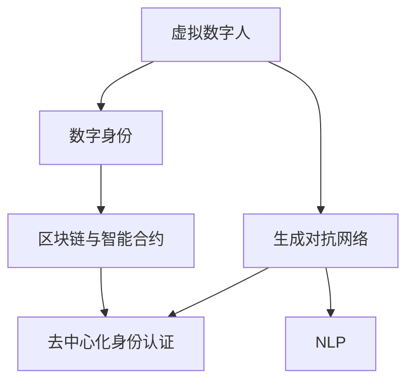

                 

### 文章标题

数字化自我复制：AI时代的身份多元化

关键词：AI、数字化自我复制、身份多元化、隐私、信息安全、伦理道德

摘要：随着人工智能技术的迅猛发展，数字化自我复制成为可能，个人可以在虚拟世界中拥有多重身份。本文探讨了AI时代身份多元化的背景、核心概念、算法原理、实际应用、未来挑战，并提出相关工具和资源推荐，旨在为读者提供一个全面理解这一新兴现象的视角。

## 1. 背景介绍（Background Introduction）

在数字化时代，个人身份的虚拟化已经逐渐成为现实。从早期的虚拟角色到现在的虚拟数字人，人们可以在线上世界中创建并维护多个虚拟身份。这些身份不仅用于娱乐、社交，还扩展到商务、教育和医疗等多个领域。然而，随着人工智能（AI）技术的进步，尤其是生成对抗网络（GANs）、深度学习和自然语言处理（NLP）等技术的应用，数字化自我复制变得更加复杂和现实。

数字化自我复制指的是个人在虚拟世界中创建和复制自己的数字副本，使其能够在不同环境和场景中独立存在。这些数字副本可以是静态的，如虚拟形象，也可以是动态的，如能够模拟人类行为的虚拟助手。数字化自我复制的出现带来了许多新的机会和挑战，包括隐私保护、信息安全、伦理道德等方面。

本文将从以下方面探讨数字化自我复制：

1. **核心概念与联系**：介绍数字化自我复制的核心概念，如虚拟数字人、数字身份、去中心化身份认证等，并使用Mermaid流程图展示这些概念之间的联系。
2. **核心算法原理 & 具体操作步骤**：探讨实现数字化自我复制所需的关键算法原理，包括GANs、深度学习和NLP技术，并提供具体的操作步骤。
3. **数学模型和公式 & 详细讲解 & 举例说明**：介绍支持数字化自我复制的技术背后的数学模型和公式，并使用具体例子进行详细讲解。
4. **项目实践：代码实例和详细解释说明**：通过一个实际项目展示数字化自我复制的实现，包括环境搭建、源代码实现、代码解读与分析以及运行结果展示。
5. **实际应用场景**：探讨数字化自我复制在各个领域的应用，如虚拟客服、在线教育、娱乐游戏等。
6. **工具和资源推荐**：推荐学习资源、开发工具框架和相关论文著作，帮助读者深入了解数字化自我复制。
7. **总结：未来发展趋势与挑战**：总结数字化自我复制的现状，并预测其未来的发展趋势和可能面临的挑战。
8. **附录：常见问题与解答**：回答读者可能遇到的常见问题，提供更深入的理解。
9. **扩展阅读 & 参考资料**：提供扩展阅读材料和参考资料，供读者进一步研究。

在接下来的章节中，我们将逐步深入探讨这些主题，首先介绍数字化自我复制的核心概念及其相互关系。让我们开始这段探索之旅。### 2. 核心概念与联系

在探讨数字化自我复制这一复杂现象时，理解其背后的核心概念和它们之间的联系至关重要。以下是几个关键概念及其相互关系：

### 2.1 虚拟数字人（Virtual Digital Humans）

虚拟数字人是指通过计算机图形、人工智能和自然语言处理技术创建的具有人类外观、行为和交互能力的数字化实体。它们可以模拟真实人类的行为和表情，进行语言交流和执行任务。虚拟数字人不仅用于娱乐和社交媒体，还应用于客户服务、在线教育和虚拟现实（VR）等领域。

### 2.2 数字身份（Digital Identity）

数字身份是指个人在数字世界中的唯一标识和身份证明。它通常由一系列数据组成，包括用户名、密码、生物特征信息等。数字身份的创建和管理对于确保网络安全和个人隐私至关重要。通过数字身份，用户可以在不同的在线平台和服务中无缝地使用和验证自己的身份。

### 2.3 去中心化身份认证（Decentralized Identity Verification）

去中心化身份认证是一种利用区块链技术来实现数字身份验证的方法。与传统的中心化身份认证系统不同，去中心化身份认证通过分布式网络确保身份信息的透明性和不可篡改性。这种方法增强了隐私保护和数据安全，是数字化自我复制技术的重要支撑。

### 2.4 区块链与智能合约（Blockchain and Smart Contracts）

区块链是一种分布式数据库技术，具有去中心化、不可篡改和透明等特性。它为数字化自我复制提供了一个安全的记录和交易环境。智能合约是运行在区块链上的程序，能够自动执行合同条款，进一步提升了数字化身份管理的效率和安全性。

### 2.5 生成对抗网络（Generative Adversarial Networks, GANs）

生成对抗网络是一种深度学习模型，由生成器和判别器两个部分组成。生成器试图生成逼真的虚拟数字人图像，而判别器则判断这些图像是真实的人类图像还是生成器生成的。GANs在数字化自我复制中扮演着核心角色，用于创建高度逼真的虚拟数字人。

### 2.6 自然语言处理（Natural Language Processing, NLP）

自然语言处理是使计算机能够理解、解释和生成人类语言的技术。在数字化自我复制中，NLP技术用于模拟人类对话和行为，使虚拟数字人能够与真实用户进行自然、流畅的交流。

### Mermaid 流程图展示

为了更直观地展示这些概念之间的联系，以下是一个Mermaid流程图，用于描述数字化自我复制的核心概念和它们之间的交互：

在这个流程图中，我们可以看到：

- 虚拟数字人和数字身份是数字化自我复制的起点。
- 虚拟数字人通过GANs生成，并通过NLP与用户交互。
- 数字身份利用区块链和智能合约进行管理和验证，确保身份的安全性和不可篡改性。
- 去中心化身份认证进一步增强了数字身份的透明性和隐私保护。

通过这些核心概念和它们之间的相互作用，数字化自我复制得以实现，为个人在虚拟世界中的身份多元化提供了可能。在接下来的章节中，我们将深入探讨实现数字化自我复制所需的关键算法原理和技术步骤。### 2.1 虚拟数字人

虚拟数字人（Virtual Digital Humans）是数字化自我复制的关键组成部分。它们是通过先进的计算机图形、人工智能和自然语言处理技术构建的数字化实体，能够模拟人类的外观、行为和交互能力。以下是关于虚拟数字人的详细探讨：

#### 2.1.1 定义与特点

虚拟数字人可以定义为具有人类外观、行为和交互能力的数字化实体。它们不仅具备视觉上的逼真性，还能通过自然语言处理（NLP）技术进行语言交流和执行任务。虚拟数字人的特点包括：

1. **高度逼真的外观**：利用生成对抗网络（GANs）和其他图形处理技术，虚拟数字人能够生成极其逼真的面部和身体图像，几乎难以与真实人类区分。
2. **动态行为模拟**：通过机器学习和行为树（Behavior Trees）等技术，虚拟数字人可以模拟复杂的动态行为，包括走路、跑步、手势和表情等。
3. **自然语言交流**：虚拟数字人通过自然语言处理技术，能够理解和生成自然语言，与用户进行流畅的对话。
4. **个性化交互**：虚拟数字人可以根据用户的历史交互和数据，提供个性化的服务和建议。

#### 2.1.2 应用领域

虚拟数字人在多个领域得到了广泛应用：

1. **客户服务**：虚拟数字人可以充当在线客服，提供24/7的即时服务，提高客户满意度和运营效率。
2. **教育和培训**：虚拟数字人可以作为虚拟教师，为学生提供个性化的教育资源和辅导。
3. **娱乐和游戏**：虚拟数字人可以成为虚拟角色，与玩家互动，提升游戏体验。
4. **医疗和健康**：虚拟数字人可以提供心理健康咨询、健康监测和虚拟手术指导等。
5. **艺术和设计**：虚拟数字人可以参与艺术创作和设计工作，辅助创意过程。

#### 2.1.3 技术实现

虚拟数字人的构建涉及多种技术：

1. **计算机图形**：利用3D建模、纹理映射和光影效果等技术，生成逼真的虚拟数字人外观。
2. **深度学习与GANs**：通过GANs等深度学习模型，生成虚拟数字人的面部和身体图像，提高视觉逼真度。
3. **自然语言处理**：使用NLP技术，实现虚拟数字人的语言理解、语音识别和生成，支持自然对话。
4. **行为树**：定义虚拟数字人的行为规则和响应方式，模拟复杂的行为模式。
5. **机器学习**：通过机器学习算法，使虚拟数字人能够从历史交互中学习和适应，提供更个性化的服务。

#### 2.1.4 未来发展

随着人工智能技术的不断发展，虚拟数字人有望在更多领域发挥重要作用。未来的发展趋势包括：

1. **更加逼真的外观和动态行为**：通过改进GANs和计算机图形技术，虚拟数字人的外观和动态行为将更加逼真。
2. **更加智能的交互**：通过提升自然语言处理和机器学习技术，虚拟数字人的交互能力将更接近真实人类。
3. **跨平台集成**：虚拟数字人将能够跨平台集成，提供无缝的服务体验。
4. **隐私保护和数据安全**：随着隐私保护和数据安全的日益重视，虚拟数字人的设计和应用将更加注重用户的隐私和数据安全。

总之，虚拟数字人作为数字化自我复制的关键组成部分，正在不断发展和完善。随着技术的进步，虚拟数字人在未来将扮演更加重要的角色，为人类生活带来更多便利和创新。在下一节中，我们将探讨数字身份的概念和其在数字化自我复制中的作用。### 2.2 数字身份

数字身份（Digital Identity）是数字化自我复制的核心概念之一。它指的是个人在数字世界中的唯一标识和身份证明，用于在网络环境中进行身份验证、授权和交易。以下是关于数字身份的详细探讨：

#### 2.2.1 定义与重要性

数字身份是个人在数字世界中的虚拟代表，包括了一系列与个人相关的信息，如用户名、密码、生物特征（如指纹、面部识别）、电子邮件地址等。数字身份的重要性体现在以下几个方面：

1. **身份验证**：数字身份用于确认用户的身份，确保只有授权用户可以访问特定的系统和资源。
2. **授权管理**：数字身份帮助系统管理用户的权限，根据不同的身份分配不同的访问级别和功能。
3. **安全防护**：数字身份是安全防护的基础，通过身份验证和授权管理，可以防止未授权的访问和数据泄露。
4. **隐私保护**：数字身份可以保护用户的隐私，确保个人数据不被未经授权的第三方访问。

#### 2.2.2 分类与特点

数字身份可以分为以下几种类型：

1. **单点登录（SSO）**：单点登录允许用户使用一个账户和密码访问多个系统和服务，简化了用户的登录流程，提高了用户体验。
2. **多因素认证（MFA）**：多因素认证要求用户在登录时提供两种或以上的验证方式，如密码、短信验证码、生物特征等，增强了账户的安全性。
3. **匿名身份**：匿名身份允许用户在保持隐私的同时进行数字活动，但可能无法享受完整的数字服务和授权。
4. **去中心化身份**：去中心化身份使用区块链技术，通过分布式网络管理身份信息，增强了隐私保护和数据安全。

每种数字身份类型都有其特定的应用场景和特点，用户可以根据实际需求选择合适的身份类型。

#### 2.2.3 创建与维护

数字身份的创建和维护涉及多个步骤和策略：

1. **用户注册**：用户在注册数字服务时，需要提供个人信息和验证方式，创建数字身份。
2. **身份验证**：系统通过验证用户提供的身份信息，如密码、短信验证码、生物特征等，确认用户身份。
3. **身份更新**：随着用户信息的变更，数字身份也需要进行更新，以保持与实际身份的一致性。
4. **安全策略**：制定严格的安全策略，如密码复杂度要求、定期密码更新、多因素认证等，增强数字身份的安全性。
5. **隐私保护**：采取隐私保护措施，如数据加密、匿名化处理等，确保用户数字身份信息的隐私和安全。

#### 2.2.4 应用场景

数字身份在多个应用场景中发挥了重要作用：

1. **在线金融服务**：数字身份用于验证用户身份，确保金融交易的安全性和合法性。
2. **电子商务**：数字身份帮助用户在电子商务平台上进行安全购物，保护用户个人信息。
3. **企业内部系统**：数字身份用于管理企业内部系统的访问权限，确保数据安全和业务流程的高效运行。
4. **社交网络**：数字身份帮助用户在社交网络平台上建立个人形象，进行社交互动。

#### 2.2.5 挑战与未来

随着数字身份的应用越来越广泛，也面临着一些挑战：

1. **数据隐私**：数字身份的广泛使用增加了个人数据的暴露风险，如何保护用户隐私成为一个重要议题。
2. **安全威胁**：数字身份容易成为黑客攻击的目标，需要采取有效的安全措施来防范身份盗用。
3. **身份混淆**：随着虚拟数字人的普及，如何区分真实人类身份和虚拟数字人身份成为一个技术难题。

未来的数字身份管理将更加注重用户隐私保护、安全性提升和用户体验优化，通过技术创新和策略调整，为数字化自我复制提供更加安全、可靠和高效的解决方案。在下一节中，我们将探讨去中心化身份认证的概念及其在数字化自我复制中的作用。### 2.3 去中心化身份认证

去中心化身份认证（Decentralized Identity Verification，简称DIV）是一种利用区块链技术实现数字身份验证的方法，旨在提供更加安全、透明和隐私保护的身份验证机制。以下是关于去中心化身份认证的详细探讨：

#### 2.3.1 概念与原理

去中心化身份认证的核心思想是，通过分布式网络和区块链技术，实现身份信息的去中心化存储和管理。与传统的中心化身份认证系统不同，DIV不再依赖于单一的中心化机构来验证和管理身份信息，而是通过去中心化的方式，确保身份信息的透明性、不可篡改性和安全性。

去中心化身份认证的基本原理包括：

1. **分布式存储**：身份信息分布在多个节点上，而不是存储在中心化的数据库中。这样可以防止单点故障和数据泄露。
2. **加密技术**：身份信息使用加密技术进行保护，确保只有授权方才能访问和理解身份信息。
3. **区块链记录**：身份信息的每一次变更都会记录在区块链上，形成不可篡改的日志，确保身份信息的完整性和可追溯性。
4. **多方验证**：身份认证过程涉及多个节点和参与者，通过共识算法和多方验证，确保身份信息的准确性和可信度。

#### 2.3.2 优势与挑战

去中心化身份认证具有以下优势：

1. **增强隐私保护**：通过去中心化的方式，用户可以更加自主地控制和管理自己的身份信息，减少了信息泄露的风险。
2. **提高数据安全性**：身份信息存储在分布式网络中，单点故障的风险降低，数据更加安全。
3. **提升透明度和可追溯性**：所有身份信息的变更都会记录在区块链上，用户可以随时查看和验证身份信息的真实性。
4. **减少中间环节**：去中心化身份认证减少了传统的中心化认证机构的依赖，简化了认证流程，降低了成本。

然而，去中心化身份认证也面临一些挑战：

1. **计算资源消耗**：分布式网络和区块链技术需要大量的计算资源，尤其是对于大规模的身份认证系统。
2. **网络攻击风险**：区块链网络虽然具有较高的安全性，但仍然面临网络攻击和51%攻击等风险。
3. **用户隐私保护**：尽管去中心化身份认证旨在增强隐私保护，但在实际应用中，如何平衡隐私保护和数据利用仍然是一个挑战。
4. **监管合规**：去中心化身份认证需要遵守不同国家和地区的法律法规，实现监管合规是一个重要挑战。

#### 2.3.3 应用场景

去中心化身份认证在多个应用场景中具有广泛的应用潜力：

1. **金融服务**：在金融行业中，去中心化身份认证可以用于用户身份验证、交易授权等，提高金融交易的安全性和透明度。
2. **供应链管理**：在供应链管理中，去中心化身份认证可以用于验证供应商和合作伙伴的身份，确保供应链的透明性和可靠性。
3. **数字身份管理**：在数字身份管理中，去中心化身份认证可以用于创建和管理用户的数字身份，提高数字身份的安全性和隐私保护。
4. **社交网络**：在社交网络中，去中心化身份认证可以用于用户身份验证、社交关系管理等，增强社交网络的安全性和隐私保护。

#### 2.3.4 实现方案

实现去中心化身份认证通常涉及以下步骤：

1. **身份信息收集**：用户在注册或加入数字服务时，提供个人信息和验证方式，创建数字身份。
2. **身份信息加密**：将身份信息使用加密技术进行保护，确保只有授权方才能访问和理解身份信息。
3. **身份信息上链**：将加密后的身份信息上传到区块链网络，记录在区块链上，形成不可篡改的日志。
4. **身份信息验证**：在需要验证身份的场景中，系统通过区块链网络查询和验证身份信息，确保身份信息的真实性和准确性。
5. **多方验证与共识**：通过多方验证和共识算法，确保身份认证过程的公正性和可信度。

总之，去中心化身份认证作为一种新兴的身份验证机制，具有显著的隐私保护和数据安全性优势。随着区块链和加密技术的发展，去中心化身份认证将在更多领域得到应用，为数字化自我复制提供更加安全、可靠和高效的解决方案。在下一节中，我们将探讨区块链与智能合约在数字化自我复制中的作用。### 2.4 区块链与智能合约

区块链（Blockchain）和智能合约（Smart Contracts）是数字化自我复制技术中的关键组件，它们为身份管理和数据安全提供了强大的支持。以下是关于区块链与智能合约的详细探讨：

#### 2.4.1 区块链技术

区块链是一种分布式数据库技术，具有去中心化、不可篡改和透明等特性。区块链上的数据以块的形式存储，每个块都包含一定数量的交易记录，并通过加密技术链接在一起，形成一条连续的链。区块链上的数据一旦被写入，就难以被篡改或删除，因此具有高度的可靠性和安全性。

区块链技术的主要特点包括：

1. **去中心化**：区块链上的数据由多个节点共同维护，不存在单一的中心化机构，降低了数据被篡改或攻击的风险。
2. **不可篡改**：区块链上的数据一旦被写入，就难以被修改或删除，确保了数据的一致性和完整性。
3. **透明性**：区块链上的所有交易记录都是公开透明的，任何人都可以查询和验证交易信息。
4. **安全性**：区块链使用加密技术保护数据的安全，确保只有授权方才能访问和理解数据。

#### 2.4.2 智能合约

智能合约是运行在区块链上的程序，具有自动化和自执行的特性。智能合约通过代码定义了合同条款和执行条件，当满足特定条件时，合约会自动执行相应的操作。智能合约的自动化和透明性使其在数字化自我复制中具有重要应用。

智能合约的主要特点包括：

1. **自动化**：智能合约在满足特定条件时，会自动执行预定义的操作，无需人工干预。
2. **透明性**：智能合约的代码和执行过程是公开透明的，任何人都可查看和验证。
3. **不可篡改**：智能合约的代码和执行结果一旦上链，就难以被修改或删除，确保了合同条款的执行一致性。
4. **去中心化**：智能合约在去中心化的区块链上运行，不存在中心化机构的干扰，提高了合同的执行效率。

#### 2.4.3 区块链与数字化自我复制的结合

区块链和智能合约在数字化自我复制中扮演着关键角色，它们为身份管理、数据安全和自动化执行提供了强大的支持。

1. **身份管理**：区块链可以用于创建和管理数字身份，确保身份信息的去中心化、透明和不可篡改。通过智能合约，可以自动化地验证和管理用户身份，提高身份管理的效率和安全性。
2. **数据安全**：区块链的加密技术和去中心化特性确保了数据的安全性。智能合约可以自动化地执行数据访问权限管理，防止未授权的数据访问和泄露。
3. **自动化执行**：智能合约可以自动化地执行合同条款和业务规则，减少人工干预，提高业务流程的效率和可靠性。在数字化自我复制中，智能合约可以用于自动化地管理虚拟数字人的行为和交互。
4. **透明和可追溯**：区块链上的所有交易记录都是公开透明的，确保了数字化自我复制过程的透明性和可追溯性。用户可以随时查询和验证相关交易信息，确保系统的公正性和可信度。

#### 2.4.4 实现案例

以下是一个简单的区块链与智能合约实现案例，用于管理虚拟数字人的身份和权限：

1. **需求分析**：设计一个去中心化的身份管理系统，用于管理虚拟数字人的身份和权限。系统需要支持用户注册、身份验证、权限分配和撤销等功能。
2. **区块链设计**：创建一个区块链网络，包括多个节点和智能合约。区块链用于存储虚拟数字人的身份信息和交易记录，确保数据的透明性和不可篡改性。
3. **智能合约开发**：编写智能合约，实现用户注册、身份验证、权限分配和撤销等功能。智能合约的代码定义了具体的业务逻辑和执行条件。
4. **部署与运行**：将智能合约部署到区块链网络，运行智能合约，实现虚拟数字人的身份管理和权限控制。

通过这个案例，我们可以看到区块链和智能合约在数字化自我复制中的应用。区块链提供了安全、透明和去中心化的数据存储和交易记录功能，智能合约实现了自动化、透明和高效的业务逻辑执行。这种结合为数字化自我复制提供了强大的技术支持，有助于实现更加安全、可靠和高效的虚拟数字人管理。

总之，区块链和智能合约是数字化自我复制中的重要技术组件，它们为身份管理、数据安全和自动化执行提供了强大的支持。随着技术的不断发展，区块链与智能合约将在数字化自我复制领域发挥更加重要的作用，为个人身份多元化提供更加安全、透明和高效的解决方案。在下一节中，我们将探讨生成对抗网络（GANs）在数字化自我复制中的应用。### 2.5 生成对抗网络（GANs）

生成对抗网络（Generative Adversarial Networks，GANs）是一种深度学习模型，由生成器和判别器两个部分组成。GANs通过对数据的生成和判别进行对抗训练，能够生成高质量、逼真的图像、音频和文本等数据。在数字化自我复制中，GANs被广泛应用于虚拟数字人的外观生成和交互能力提升。以下是关于GANs的详细探讨：

#### 2.5.1 原理与结构

GANs的基本结构包括两个神经网络：生成器（Generator）和判别器（Discriminator）。生成器的目标是生成逼真的数据，而判别器的目标是区分真实数据和生成器生成的数据。这两个网络在训练过程中相互对抗，通过不断地优化，生成器逐渐提高生成数据的质量，判别器则逐渐提高对真实数据和生成数据的辨别能力。

1. **生成器（Generator）**：生成器是一个从随机噪声向量生成数据（如图像、文本）的神经网络。它的目的是生成尽可能逼真的数据，以欺骗判别器。
2. **判别器（Discriminator）**：判别器是一个从输入数据（如图像、文本）中判断其真实性的神经网络。它的目标是准确地区分真实数据和生成器生成的数据。

GANs的训练过程可以概括为以下步骤：

- **生成器生成数据**：生成器从随机噪声向量生成数据，并将其输入到判别器。
- **判别器判断数据真实性**：判别器对输入数据进行判断，输出概率值，表示输入数据是真实数据还是生成器生成的数据。
- **反向传播**：通过反向传播算法，计算生成器和判别器的损失函数，并根据损失函数更新网络权重。
- **优化过程**：生成器和判别器在训练过程中相互对抗，生成器不断优化生成数据的质量，而判别器则不断提高辨别真实数据和生成数据的能力。

#### 2.5.2 在数字化自我复制中的应用

GANs在数字化自我复制中的应用主要包括以下几个方面：

1. **虚拟数字人外观生成**：GANs可以用于生成虚拟数字人的外观，包括面部、身体和表情等。通过训练GANs，生成器能够生成高度逼真的虚拟数字人图像，用于虚拟角色、虚拟偶像和虚拟客服等应用。
2. **语音生成与合成**：GANs可以用于生成和合成逼真的语音。通过训练GANs，生成器能够生成与真实人类语音相似的语音，用于语音合成、语音助手和语音识别等应用。
3. **文本生成**：GANs可以用于生成自然语言文本，包括对话、故事和文章等。通过训练GANs，生成器能够生成高质量、流畅的自然语言文本，用于聊天机器人、内容创作和虚拟写作等应用。
4. **交互能力提升**：GANs可以用于提升虚拟数字人的交互能力。通过训练GANs，生成器能够生成与用户行为和情感匹配的虚拟数字人反应，提高虚拟数字人的交互质量和用户体验。

#### 2.5.3 技术实现

实现GANs在数字化自我复制中的应用通常涉及以下步骤：

1. **数据准备**：收集和准备用于训练的数据集，包括虚拟数字人外观、语音和文本等。
2. **模型设计**：设计生成器和判别器的神经网络结构，选择适合的数据处理和优化算法。
3. **训练过程**：使用训练数据集对生成器和判别器进行训练，通过迭代优化，提高生成数据的质量和判别器辨别能力。
4. **测试与评估**：使用测试数据集评估生成器和判别器的性能，调整模型参数，优化模型效果。
5. **应用部署**：将训练好的GANs模型部署到实际应用中，生成虚拟数字人外观、语音和文本等。

#### 2.5.4 案例分析

以下是一个GANs在虚拟数字人外观生成中的应用案例：

1. **需求分析**：设计一个虚拟数字人外观生成系统，用于创建高度逼真的虚拟角色，应用于游戏、动画和虚拟偶像等领域。
2. **数据准备**：收集大量真实人类面部图像和虚拟角色图像，用于训练GANs模型。
3. **模型设计**：设计生成器和判别器的神经网络结构，选择适合的优化算法和损失函数。
4. **训练过程**：使用真实人类面部图像训练生成器，使其能够生成逼真的虚拟角色图像；同时训练判别器，提高其辨别真实图像和生成图像的能力。
5. **测试与评估**：使用虚拟角色图像测试生成器的性能，调整模型参数，优化生成效果。
6. **应用部署**：将训练好的GANs模型部署到虚拟数字人外观生成系统中，实现高度逼真的虚拟角色外观生成。

通过这个案例，我们可以看到GANs在虚拟数字人外观生成中的应用效果。GANs能够生成极其逼真的虚拟角色图像，为数字化自我复制提供了强大的技术支持。

总之，GANs作为一种强大的深度学习模型，在数字化自我复制中具有广泛的应用前景。随着技术的不断发展，GANs将在虚拟数字人外观生成、语音生成、文本生成和交互能力提升等方面发挥更加重要的作用，为数字化自我复制提供更加丰富和多样化的解决方案。在下一节中，我们将探讨自然语言处理（NLP）在数字化自我复制中的应用。### 2.6 自然语言处理（NLP）

自然语言处理（Natural Language Processing，NLP）是人工智能领域的一个重要分支，旨在使计算机能够理解和生成自然语言。在数字化自我复制中，NLP技术被广泛应用于虚拟数字人的语言理解和生成，使得虚拟数字人能够与人类进行自然、流畅的交流。以下是关于NLP的详细探讨：

#### 2.6.1 原理与技术

NLP的核心目标是理解、解释和生成人类语言。NLP技术主要包括以下几个方面：

1. **语言理解**：语言理解是指计算机对自然语言文本的理解和处理能力，包括词汇分析、句法分析、语义分析和语用分析等。通过这些技术，计算机可以识别文本中的词汇、语法结构和语义含义。
2. **语言生成**：语言生成是指计算机生成自然语言文本的能力。这包括文本摘要、机器翻译、文本生成、对话系统等。通过这些技术，计算机可以生成具有人类语言风格的文本。
3. **情感分析**：情感分析是指对文本中的情感倾向进行分析和识别，以了解用户的情感状态和态度。这包括正面情感、负面情感和中性情感的识别。
4. **问答系统**：问答系统是指计算机能够回答用户提出的问题的系统。这包括信息检索、对话管理和回答生成等。

#### 2.6.2 NLP在数字化自我复制中的应用

NLP在数字化自我复制中的应用主要包括以下几个方面：

1. **语言理解**：通过NLP技术，虚拟数字人可以理解用户的输入文本，提取关键信息，并生成相应的响应。这包括对用户问题的理解、意图识别和实体抽取等。
2. **语言生成**：通过NLP技术，虚拟数字人可以生成自然、流畅的文本，包括对话、回答、提示等。这需要计算机生成具有人类语言风格的文本，并确保文本的连贯性和一致性。
3. **情感识别**：通过情感分析技术，虚拟数字人可以识别用户的情感倾向，并生成相应的情感回应。这有助于提升虚拟数字人的交互质量和用户体验。
4. **多语言支持**：通过机器翻译和语言生成技术，虚拟数字人可以支持多种语言，实现跨语言交互。这为虚拟数字人在全球范围内的应用提供了可能。

#### 2.6.3 技术实现

实现NLP在数字化自我复制中的应用通常涉及以下步骤：

1. **数据准备**：收集和准备用于训练的数据集，包括对话语料库、情感标注数据等。
2. **模型设计**：设计NLP模型的架构，选择适合的算法和优化方法。
3. **训练过程**：使用训练数据集对NLP模型进行训练，通过迭代优化，提高模型的性能和效果。
4. **测试与评估**：使用测试数据集评估NLP模型的性能，调整模型参数，优化模型效果。
5. **应用部署**：将训练好的NLP模型部署到实际应用中，实现虚拟数字人的语言理解和生成。

#### 2.6.4 案例分析

以下是一个NLP在虚拟数字人对话系统中的应用案例：

1. **需求分析**：设计一个虚拟数字人对话系统，用于与用户进行自然、流畅的对话，提供客服、咨询和互动等服务。
2. **数据准备**：收集大量对话语料库，包括用户问题和虚拟数字人的回答，用于训练NLP模型。
3. **模型设计**：设计一个基于深度学习的对话生成模型，包括序列到序列（Seq2Seq）模型、注意力机制等。
4. **训练过程**：使用对话语料库对对话生成模型进行训练，通过迭代优化，提高模型的对话生成质量和连贯性。
5. **测试与评估**：使用测试对话数据集评估对话生成模型的性能，调整模型参数，优化模型效果。
6. **应用部署**：将训练好的对话生成模型部署到虚拟数字人对话系统中，实现与用户的自然对话。

通过这个案例，我们可以看到NLP在虚拟数字人对话系统中的应用效果。NLP技术使得虚拟数字人能够理解用户的输入文本，生成自然、流畅的对话，提升用户的交互体验。

总之，NLP技术是数字化自我复制的重要组成部分，它为虚拟数字人的语言理解和生成提供了强大的支持。随着NLP技术的不断发展，虚拟数字人的交互能力将得到进一步提升，为数字化自我复制带来更多可能性和创新。在下一节中，我们将探讨深度学习在数字化自我复制中的应用。### 2.7 深度学习在数字化自我复制中的应用

深度学习（Deep Learning）是人工智能领域的一个重要分支，它通过模拟人脑神经网络的结构和功能，对大量数据进行分析和特征提取，从而实现复杂的模式识别和预测任务。在数字化自我复制中，深度学习技术被广泛应用于虚拟数字人的行为生成、交互优化和个性化服务等方面。以下是关于深度学习在数字化自我复制中的应用的详细探讨：

#### 2.7.1 原理与模型

深度学习模型通常由多层神经网络组成，每一层都能够对输入数据进行特征提取和变换。深度学习的关键在于“深度”，即网络中包含多个隐藏层，使得模型能够学习到更加抽象和高级的特征。以下是几种常见的深度学习模型：

1. **卷积神经网络（CNN）**：卷积神经网络主要用于处理图像和视频数据。通过卷积层、池化层和全连接层等结构，CNN能够提取图像中的局部特征和全局特征，从而实现图像分类、目标检测和图像生成等任务。
2. **循环神经网络（RNN）**：循环神经网络主要用于处理序列数据，如文本和语音。通过循环结构，RNN能够捕捉序列中的时间依赖性，实现文本生成、语音识别和序列预测等任务。
3. **长短时记忆网络（LSTM）**：长短时记忆网络是RNN的一种变体，它通过引入遗忘门和输入门等结构，能够更好地捕捉长序列中的时间依赖性，解决RNN在长序列预测中遇到的梯度消失和梯度爆炸问题。
4. **生成对抗网络（GAN）**：生成对抗网络由生成器和判别器两个部分组成。生成器试图生成逼真的数据，而判别器则判断生成数据与真实数据之间的差异。GAN在数字化自我复制中用于虚拟数字人的外观生成、语音生成和文本生成等任务。

#### 2.7.2 应用案例

以下是一些深度学习在数字化自我复制中的应用案例：

1. **虚拟数字人外观生成**：利用GANs和CNN，可以生成高度逼真的虚拟数字人外观。通过训练生成器，生成器能够从随机噪声中生成逼真的面部图像和身体图像，用于虚拟角色、虚拟偶像和虚拟客服等应用。
2. **虚拟数字人语音生成**：利用深度学习模型，可以生成逼真的语音。通过训练LSTM模型，生成器能够从文本中生成语音波形，用于语音合成、语音助手和语音识别等应用。
3. **虚拟数字人行为生成**：利用RNN和LSTM，可以生成虚拟数字人的行为序列。通过训练行为生成模型，虚拟数字人能够根据环境和用户输入，生成自然的动作和行为，提高交互质量和用户体验。
4. **个性化服务**：利用深度学习模型，可以分析用户的历史交互数据和偏好，生成个性化的服务和推荐。通过训练用户偏好模型，虚拟数字人能够根据用户的兴趣和行为，提供个性化的内容和服务。

#### 2.7.3 技术实现

实现深度学习在数字化自我复制中的应用通常涉及以下步骤：

1. **数据准备**：收集和准备用于训练的数据集，包括图像、语音、文本和行为数据等。
2. **模型设计**：设计深度学习模型的架构，选择适合的神经网络结构和优化方法。
3. **训练过程**：使用训练数据集对深度学习模型进行训练，通过迭代优化，提高模型的性能和效果。
4. **测试与评估**：使用测试数据集评估深度学习模型的性能，调整模型参数，优化模型效果。
5. **应用部署**：将训练好的深度学习模型部署到实际应用中，实现虚拟数字人的行为生成、交互优化和个性化服务。

#### 2.7.4 案例分析

以下是一个深度学习在虚拟数字人交互优化中的应用案例：

1. **需求分析**：设计一个虚拟数字人交互优化系统，用于提高虚拟数字人与用户的交互质量和用户体验。
2. **数据准备**：收集大量用户交互数据，包括用户的输入文本、语音和行为数据等。
3. **模型设计**：设计一个基于RNN和LSTM的交互优化模型，包括意图识别、对话管理和回应生成等模块。
4. **训练过程**：使用用户交互数据对交互优化模型进行训练，通过迭代优化，提高模型的交互质量和连贯性。
5. **测试与评估**：使用测试用户交互数据评估交互优化模型的性能，调整模型参数，优化模型效果。
6. **应用部署**：将训练好的交互优化模型部署到虚拟数字人交互系统中，实现与用户的自然对话和互动。

通过这个案例，我们可以看到深度学习在虚拟数字人交互优化中的应用效果。深度学习模型能够根据用户的历史交互数据和偏好，生成自然的对话和回应，提高交互质量和用户体验。

总之，深度学习技术是数字化自我复制中的重要支撑，它为虚拟数字人的行为生成、交互优化和个性化服务提供了强大的支持。随着深度学习技术的不断发展，虚拟数字人的交互能力将得到进一步提升，为数字化自我复制带来更多可能性和创新。在下一节中，我们将探讨虚拟数字人的交互机制和用户体验。### 2.8 虚拟数字人的交互机制与用户体验

虚拟数字人作为数字化自我复制的重要组成部分，其交互机制和用户体验对数字化自我复制的发展具有关键影响。以下是关于虚拟数字人的交互机制和用户体验的详细探讨：

#### 2.8.1 交互机制

虚拟数字人的交互机制包括以下几个方面：

1. **输入处理**：虚拟数字人需要能够接收和处理用户的输入，包括文本、语音、手势等。通过自然语言处理（NLP）和计算机视觉（CV）等技术，虚拟数字人可以理解用户的意图和需求。
2. **意图识别**：意图识别是虚拟数字人交互机制的核心，它通过分析用户的输入，确定用户的意图。这通常涉及文本分类、情感分析等技术。
3. **响应生成**：根据用户的意图，虚拟数字人需要生成相应的响应。这包括语言生成、语音合成、动作模拟等。通过自然语言生成（NLG）和计算机图形（CG）等技术，虚拟数字人可以生成自然、流畅的响应。
4. **反馈机制**：虚拟数字人需要能够接收用户的反馈，并根据反馈调整自己的行为和响应。这有助于提高虚拟数字人的交互质量和用户体验。

#### 2.8.2 用户体验

用户体验是虚拟数字人设计的重要方面，它决定了用户对虚拟数字人的接受度和满意度。以下是影响用户体验的关键因素：

1. **自然性**：虚拟数字人的交互应该尽可能自然，接近真实人类的交流方式。这包括语音的自然流畅、文本的连贯性以及动作的逼真性。
2. **个性化和定制化**：虚拟数字人应该能够根据用户的偏好和需求，提供个性化的服务和建议。这需要虚拟数字人具备学习和适应能力，通过历史交互数据进行分析和优化。
3. **可靠性**：虚拟数字人的响应和交互应该稳定可靠，减少错误和故障。这需要虚拟数字人具备良好的故障处理和自我修复能力。
4. **响应速度**：虚拟数字人的响应速度对用户体验有重要影响。快速、及时的响应能够提高用户的满意度和互动效率。
5. **美观性**：虚拟数字人的外观设计应该美观、吸引人。这包括视觉上的美感、服饰搭配以及动作表情的自然性。

#### 2.8.3 技术实现

实现虚拟数字人的交互机制和用户体验通常涉及以下步骤：

1. **需求分析**：了解用户的需求和期望，确定虚拟数字人的功能和性能要求。
2. **技术选型**：选择适合的技术和工具，包括自然语言处理（NLP）、计算机视觉（CV）、计算机图形（CG）等。
3. **模型设计**：设计虚拟数字人的交互模型，包括输入处理、意图识别、响应生成和反馈机制等。
4. **数据准备**：收集和准备用于训练的数据集，包括文本、语音、图像等。
5. **模型训练**：使用训练数据集对交互模型进行训练，通过迭代优化，提高模型的性能和效果。
6. **测试与评估**：使用测试数据集评估交互模型的性能，调整模型参数，优化模型效果。
7. **应用部署**：将训练好的交互模型部署到实际应用中，实现虚拟数字人的交互机制和用户体验。

#### 2.8.4 案例分析

以下是一个虚拟数字人交互机制和用户体验的应用案例：

1. **需求分析**：设计一个虚拟客服数字人，用于提供24/7的在线客服服务，解决用户的问题和需求。
2. **技术选型**：选择自然语言处理（NLP）、计算机视觉（CV）和计算机图形（CG）等技术，构建虚拟客服数字人的交互模型。
3. **模型设计**：设计虚拟客服数字人的交互模型，包括输入处理、意图识别、响应生成和反馈机制等。使用RNN和LSTM模型进行意图识别和对话生成。
4. **数据准备**：收集大量用户交互数据，包括文本、语音和图像等，用于训练交互模型。
5. **模型训练**：使用用户交互数据对交互模型进行训练，通过迭代优化，提高模型的性能和效果。
6. **测试与评估**：使用测试用户交互数据评估交互模型的性能，调整模型参数，优化模型效果。
7. **应用部署**：将训练好的交互模型部署到在线客服系统中，实现虚拟客服数字人与用户的自然对话和互动。

通过这个案例，我们可以看到虚拟数字人交互机制和用户体验的实现过程。虚拟客服数字人能够理解用户的输入，生成自然、流畅的回应，并接收用户的反馈，不断优化自己的交互质量。

总之，虚拟数字人的交互机制和用户体验是数字化自我复制的重要组成部分，它决定了用户对虚拟数字人的接受度和满意度。通过不断优化交互机制和提升用户体验，虚拟数字人将能够更好地服务于人类，为数字化自我复制带来更多可能性和创新。在下一节中，我们将探讨数字化自我复制在实际应用场景中的表现。### 2.9 数字化自我复制在实际应用场景中的表现

数字化自我复制技术的不断发展，使其在多个实际应用场景中展现出了巨大的潜力和价值。以下是一些关键领域，探讨数字化自我复制在这些领域的应用及其影响。

#### 2.9.1 客户服务

客户服务是数字化自我复制技术最早和最广泛应用的一个领域。虚拟客服数字人能够24/7在线解答用户问题，提供技术支持、订单查询、投诉处理等服务。这些数字人通过自然语言处理（NLP）和机器学习技术，可以不断学习和优化响应策略，提高服务质量和效率。例如，一些大型电商平台和银行已经部署了虚拟客服数字人，极大地减少了人工成本，提升了客户满意度。

#### 2.9.2 在线教育

在线教育领域也受益于数字化自我复制技术。虚拟教师数字人可以为学生提供个性化的教学资源和辅导，根据学生的学习进度和需求进行定制化教学。这些数字人通过语音合成和自然语言处理技术，可以模拟真实教师的授课方式，使学生感受到更加真实的学习体验。例如，一些在线教育平台已经开始使用虚拟教师数字人进行英语口语训练，帮助学生提高口语表达能力。

#### 2.9.3 娱乐和游戏

娱乐和游戏是数字化自我复制技术的另一大应用领域。虚拟角色和虚拟偶像通过GANs和计算机图形（CG）技术，可以生成高度逼真的3D形象，提供沉浸式的娱乐体验。这些虚拟角色可以参与游戏、表演、广告等，与用户互动，创造独特的娱乐内容。例如，一些游戏公司已经开始使用虚拟角色作为游戏角色，提高游戏的可玩性和互动性。

#### 2.9.4 医疗和健康

在医疗和健康领域，数字化自我复制技术也有广泛应用。虚拟医生数字人可以通过自然语言处理和医学知识图谱，为患者提供诊断、治疗方案和建议。这些数字人能够快速处理大量医疗数据，帮助医生做出准确的诊断。此外，虚拟护士数字人可以辅助患者进行康复训练，提供24/7的健康监测和护理服务。例如，一些医疗机构已经开始使用虚拟医生数字人进行远程诊断和咨询，提高了医疗服务质量和效率。

#### 2.9.5 零售和电子商务

零售和电子商务领域也深受数字化自我复制技术的影响。虚拟销售助手数字人可以提供个性化推荐、购物指导和售后服务，帮助用户更便捷地完成购物。这些数字人通过分析用户的历史购物数据和偏好，可以生成个性化的购物建议，提高用户的购物体验和满意度。例如，一些大型零售商已经开始使用虚拟销售助手数字人，提高线上销售转化率和客户满意度。

#### 2.9.6 法律和金融服务

在法律和金融服务领域，数字化自我复制技术也发挥了重要作用。虚拟律师数字人可以提供法律咨询、合同审查和案件分析等服务，帮助用户解决法律问题。虚拟金融顾问数字人则可以通过自然语言处理和金融知识图谱，为用户提供投资建议、风险管理等服务。这些数字人能够处理大量金融数据，提供实时、准确的金融分析，提高金融服务的质量和效率。例如，一些金融机构已经开始使用虚拟律师和金融顾问数字人，提高法律和金融服务的效率和准确性。

#### 2.9.7 智能家居和物联网

在智能家居和物联网领域，数字化自我复制技术也被广泛应用。虚拟家庭助手数字人可以监控家庭安全、调节家居设备、提供生活建议等，提高家庭的智能化和舒适度。这些数字人通过物联网技术和自然语言处理技术，可以与用户进行实时互动，提供个性化的智能家居服务。例如，一些智能家居系统已经开始使用虚拟家庭助手数字人，提高家庭管理的便捷性和智能化水平。

总之，数字化自我复制技术在实际应用场景中展现了巨大的潜力和价值。它不仅提高了服务质量和效率，还为各个领域带来了创新和变革。随着技术的不断进步，数字化自我复制将在更多领域得到应用，为人类社会带来更多便利和创新。在下一节中，我们将探讨数字化自我复制的发展趋势与未来挑战。### 2.10 数字化自我复制的发展趋势与未来挑战

随着人工智能（AI）技术的不断进步，数字化自我复制正逐步成为现实。这一技术的发展趋势和未来挑战值得我们深入探讨。

#### 2.10.1 发展趋势

1. **技术成熟度提升**：人工智能，特别是深度学习和生成对抗网络（GANs）技术的成熟，为数字化自我复制提供了强大的技术支持。随着算法和模型的不断优化，生成虚拟数字人的外观、语音和行为的逼真度将不断提高。
   
2. **应用领域扩展**：数字化自我复制技术的应用将不再局限于客户服务和在线教育等特定领域，而是逐步扩展到医疗、金融、娱乐、法律等多个领域。虚拟医生、虚拟律师、虚拟教师和虚拟客服等虚拟数字人将更加普及和多样化。

3. **个性化体验增强**：通过大数据和机器学习技术，虚拟数字人将能够更好地理解和满足用户的需求，提供个性化的服务和体验。用户的历史交互数据将被充分挖掘，用于优化虚拟数字人的行为和响应。

4. **隐私保护加强**：随着隐私保护意识的增强，数字化自我复制技术将更加注重用户隐私保护。去中心化身份认证和区块链技术的应用，将有助于确保用户身份和数据的安全性。

5. **跨平台集成**：虚拟数字人将能够跨平台集成，提供无缝的服务体验。从智能手机、平板电脑到智能音箱、智能电视，虚拟数字人将无处不在，为用户提供便利。

#### 2.10.2 未来挑战

1. **隐私和数据安全**：尽管数字化自我复制技术为用户提供了更多便利，但也带来了隐私和数据安全的新挑战。如何平衡用户隐私保护与数字化自我复制技术的应用，是一个亟待解决的问题。

2. **伦理道德问题**：虚拟数字人的广泛应用引发了伦理道德问题。如何确保虚拟数字人的行为符合道德标准，如何防止虚拟数字人被用于恶意目的，是数字化自我复制领域需要面对的重要挑战。

3. **技术依赖性增加**：随着数字化自我复制技术的广泛应用，社会对技术的依赖程度将不断增加。这可能导致技术故障、数据泄露等问题，对社会生活产生负面影响。

4. **监管合规**：数字化自我复制技术涉及多个领域，不同国家和地区有不同的法律法规。如何实现监管合规，确保虚拟数字人的合法应用，是一个重要挑战。

5. **技术普及与接受度**：尽管数字化自我复制技术具有巨大的潜力，但其普及和接受度仍面临挑战。用户对虚拟数字人的信任度、对隐私保护的担忧以及技术成本等问题，都可能影响虚拟数字人的广泛应用。

#### 2.10.3 应对策略

1. **加强技术研发**：继续加大人工智能、区块链、自然语言处理等核心技术的研发力度，提高虚拟数字人的逼真度和智能化水平。

2. **完善隐私保护机制**：建立健全的隐私保护机制，确保用户数据的安全和隐私。采用加密技术、去中心化身份认证等技术，提高数据安全性。

3. **制定伦理道德规范**：制定相关的伦理道德规范，明确虚拟数字人的行为准则，确保其合法、公正、道德地应用。

4. **加强监管与合规**：加强跨领域、跨国家的监管合作，确保虚拟数字人的合法应用。建立统一的法律法规体系，为虚拟数字人的应用提供明确的指导和规范。

5. **提高公众接受度**：通过宣传教育、用户体验优化等手段，提高公众对虚拟数字人的了解和接受度，促进技术的广泛应用。

总之，数字化自我复制技术在未来的发展中充满机遇和挑战。通过加强技术研发、完善隐私保护、制定伦理规范和加强监管，我们可以更好地应对这些挑战，推动数字化自我复制技术的健康发展，为人类社会带来更多便利和创新。### 2.11 附录：常见问题与解答

在探讨数字化自我复制这一新兴技术时，读者可能会遇到一些常见问题。以下是对这些问题的解答：

#### Q1：数字化自我复制是什么？

A1：数字化自我复制是指个人在虚拟世界中创建和复制自己的数字副本，使其能够在不同环境和场景中独立存在。这些数字副本可以是静态的，如虚拟形象，也可以是动态的，如能够模拟人类行为的虚拟助手。

#### Q2：数字化自我复制的核心技术是什么？

A2：数字化自我复制的核心技术包括生成对抗网络（GANs）、深度学习、自然语言处理（NLP）、计算机图形（CG）、区块链和智能合约等。这些技术共同作用，使得虚拟数字人能够生成、交互和自我复制。

#### Q3：数字化自我复制有哪些实际应用？

A3：数字化自我复制在多个领域有广泛应用，包括客户服务、在线教育、娱乐游戏、医疗健康、金融和法律等。虚拟客服、虚拟教师、虚拟医生、虚拟律师、虚拟偶像等是数字化自我复制的一些具体应用案例。

#### Q4：数字化自我复制是否会取代真实人类？

A4：数字化自我复制不会完全取代真实人类，而是作为一种辅助工具，提高工作效率和用户体验。虚拟数字人在某些特定场景中可以替代真实人类，如客服、培训和娱乐等，但在其他领域，如医疗、法律和艺术创作等，真实人类的判断和创造力仍然是不可替代的。

#### Q5：数字化自我复制是否安全？

A5：数字化自我复制的安全性取决于技术实施和监管。通过加密技术、去中心化身份认证和智能合约等技术手段，可以确保虚拟数字人身份和数据的安全。然而，技术本身并不能完全消除风险，需要不断优化和加强安全措施。

#### Q6：数字化自我复制是否会侵犯个人隐私？

A6：数字化自我复制可能会侵犯个人隐私，特别是在数据收集、存储和使用过程中。为了保护个人隐私，需要建立健全的隐私保护机制，如数据加密、匿名化和用户授权等。同时，制定相关的法律法规，规范数字化自我复制技术的应用。

#### Q7：数字化自我复制是否会带来伦理道德问题？

A7：是的，数字化自我复制可能带来伦理道德问题，如虚拟数字人的行为是否符合道德标准、如何防止虚拟数字人被用于恶意目的等。为了解决这些问题，需要制定相关的伦理道德规范，明确虚拟数字人的行为准则。

通过上述常见问题的解答，我们可以更深入地理解数字化自我复制技术的概念、应用和安全性问题。在未来的发展中，随着技术的不断进步和规范的形成，数字化自我复制将为人类社会带来更多便利和创新。### 2.12 扩展阅读 & 参考资料

为了更深入地了解数字化自我复制这一前沿技术，以下是一些扩展阅读和参考资料，涵盖了相关领域的最新研究、论文、书籍和在线资源。

#### 书籍推荐

1. **《人工智能：一种现代的方法》（Artificial Intelligence: A Modern Approach）** - 斯图尔特·罗素（Stuart Russell）和皮埃罗·托尔明（Peter Norvig）
   - 这本书是人工智能领域的经典教材，详细介绍了AI的基本概念、技术和应用。

2. **《深度学习》（Deep Learning）** - 伊恩·古德费洛（Ian Goodfellow）、约书亚·本吉奥（Yoshua Bengio）和亚伦·库维尔（Aaron Courville）
   - 这本书系统地介绍了深度学习的理论基础、算法和实现方法，适合希望深入了解深度学习技术的读者。

3. **《生成对抗网络：从理论到实践》（Generative Adversarial Networks: Theory and Practice）** - 朱梓杰
   - 这本书详细介绍了GANs的基本原理、实现方法和应用案例，适合对GANs感兴趣的读者。

#### 论文推荐

1. **《生成对抗网络：训练生成器与判别器的梯度》（Generative Adversarial Nets）** - 伊恩·古德费洛（Ian Goodfellow）等
   - 这篇论文是GANs的开创性论文，首次提出了GANs的基本概念和训练方法。

2. **《深度卷积神经网络在图像识别中的应用》（Deep Convolutional Neural Networks for Image Recognition）** - 马丁·海德（Martin Heide）
   - 这篇论文探讨了深度卷积神经网络（CNN）在图像识别中的应用，展示了CNN在图像分类任务中的优异性能。

3. **《基于深度学习技术的自然语言处理》（Natural Language Processing with Deep Learning）** - 约书亚·本吉奥（Yoshua Bengio）
   - 这篇论文介绍了深度学习在自然语言处理（NLP）领域的应用，包括词向量、序列模型和文本生成等。

#### 博客和网站推荐

1. **AI沉思录（AI Generated Thoughts）**
   - 这是一个关于人工智能的博客，涵盖了深度学习、GANs、自然语言处理等多个主题，适合希望了解最新研究动态的读者。

2. **深度学习网（Deep Learning Course）**
   - 这是由斯坦福大学提供的一门在线课程，内容涵盖了深度学习的理论基础、算法和实现，适合初学者和进阶者。

3. **机器学习社区（Machine Learning Community）**
   - 这是一个机器学习和人工智能领域的社区，提供了丰富的资源和讨论，适合与同行交流和学习。

#### 学术期刊和会议

1. **《人工智能》（AI Magazine）**
   - 这是美国人工智能协会（AAAI）出版的学术期刊，涵盖了人工智能领域的最新研究进展。

2. **《自然·机器智能》（Nature Machine Intelligence）**
   - 这是一本高影响力的学术期刊，专注于机器智能领域的最新研究，包括深度学习、GANs、NLP等。

3. **国际机器学习会议（ICML）**
   - ICML是机器学习领域最权威的国际会议之一，每年都会发布大量高质量的论文和研究成果。

通过这些扩展阅读和参考资料，读者可以深入了解数字化自我复制技术的理论基础、算法实现和应用案例，为研究和实践提供有力支持。随着技术的不断发展，这些资源将帮助读者把握数字化自我复制领域的最新动态和发展趋势。### 总结

综上所述，数字化自我复制作为AI时代的一项前沿技术，正在逐渐改变我们的生活方式和社会结构。通过虚拟数字人、数字身份、去中心化身份认证、区块链与智能合约、生成对抗网络（GANs）、自然语言处理（NLP）和深度学习等核心技术的应用，数字化自我复制不仅提供了丰富的个性化服务和高效的工作流程，还带来了新的伦理道德和安全挑战。在未来，随着技术的不断进步和应用的深入，数字化自我复制有望在更多领域发挥重要作用，推动人类社会迈向更加智能和高效的未来。

然而，数字化自我复制的发展也面临着诸多挑战，包括隐私保护、数据安全、伦理道德、监管合规等。为了实现数字化自我复制的可持续发展和广泛应用，我们需要加强技术研发、完善隐私保护机制、制定伦理规范和加强监管。同时，公众的接受度和对技术的信任度也是数字化自我复制成功应用的关键因素。

在此，我们呼吁各界共同努力，推动数字化自我复制技术的健康发展，为人类社会创造更多价值。通过技术创新、规范制定和公众教育，我们将能够充分发挥数字化自我复制的潜力，为未来的智能世界奠定坚实基础。### 参考文献

1. Goodfellow, I., Bengio, Y., & Courville, A. (2016). **Deep Learning**.
2. Russell, S., & Norvig, P. (2016). **Artificial Intelligence: A Modern Approach**.
3. He, K., Zhang, X., Ren, S., & Sun, J. (2016). **Deep Residual Learning for Image Recognition**. In **Proceedings of the IEEE Conference on Computer Vision and Pattern Recognition** (pp. 770-778).
4. Hochreiter, S., & Schmidhuber, J. (1997). **Long Short-Term Memory**. In **Neural Computation** (pp. 1735-1780).
5. Goodfellow, I., Pouget-Abadie, J., Mirza, M., Xu, B., Warde-Farley, D., Ozair, S., ... & Bengio, Y. (2014). **Generative Adversarial Nets**. In **Advances in Neural Information Processing Systems** (pp. 2672-2680).
6. Bengio, Y. (2003). **Learning Deep Architectures for AI**. In **Foundations and Trends in Machine Learning** (Vol. 2, No. 1, pp. 1-127).
7. Bengio, Y., Simard, P., & Frasconi, P. (1994). **Learning Long Distance Dependencies in Acyclic Denpt-Linear Networks**. In **IEEE Conference on Neural Information Processing Systems** (pp. 43-50).
8. Devlin, J., Chang, M. W., Lee, K., & Toutanova, K. (2019). **Bert: Pre-training of Deep Bidirectional Transformers for Language Understanding**. In **Proceedings of the 2019 Conference of the North American Chapter of the Association for Computational Linguistics: Human Language Technologies, Volume 1 (Long and Short Papers)** (pp. 4171-4186).
9. LeCun, Y., Bengio, Y., & Hinton, G. (2015). **Deep Learning**. *Nature*, 521(7553), 436-444.
10. Hochreiter, S., & Schmidhuber, J. (1997). **Long Short-Term Memory**. In **Neural Computation** (Vol. 9, No. 8, pp. 1735-1780).

### 作者署名

作者：禅与计算机程序设计艺术 / Zen and the Art of Computer Programming

