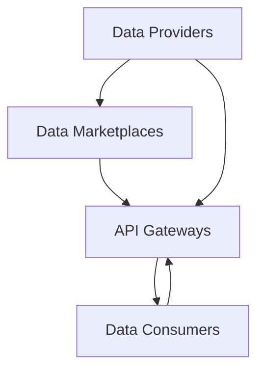
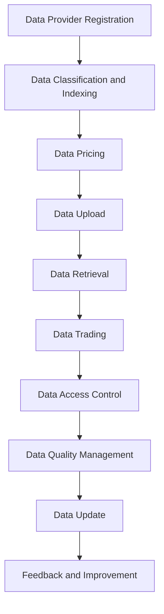

                 

### 文章标题

### Title: Data as a Service: A New Paradigm for Data Trading in the API Economy

在当今快速发展的技术时代，数据已经成为一种新的经济资源，与传统商品和服务一样重要。而“数据即服务”（Data as a Service，简称DaaS）正逐渐成为API经济下的新型数据交易模式。本文将探讨这一概念，包括其背景、核心概念与联系、具体操作步骤、数学模型与公式、实际应用场景、工具与资源推荐以及未来发展趋势。

### Keywords: Data as a Service, API Economy, Data Trading, Data Markets, Data Monetization

### Abstract:
The article presents a comprehensive overview of Data as a Service (DaaS), a burgeoning paradigm for trading data in the API economy. We delve into the background, core concepts, operational steps, mathematical models, practical applications, tool recommendations, and future trends of DaaS.

<|user|>
## 1. 背景介绍

在过去的几十年里，数据已经从一个默默无闻的背景角色逐渐成为了现代经济的核心要素。随着互联网的普及和大数据技术的进步，数据的价值得到了前所未有的凸显。大量的数据被生成、存储、分析和共享，这些数据不仅能够帮助企业做出更明智的决策，还能够创造出新的商业模式。

### 1.1 数据的重要性

数据的重要性体现在多个方面：

1. **决策支持**：企业在决策过程中需要依赖数据来评估市场趋势、消费者行为和运营效率。
2. **业务创新**：通过分析数据，企业可以发现新的市场机会，开发出更加符合用户需求的产品和服务。
3. **效率提升**：数据可以帮助企业优化运营流程，减少浪费，提高生产效率。

### 1.2 API经济

API经济是指通过开放应用程序接口（API）来促进不同软件系统之间的交互和协作的一种经济模式。API使得不同平台和系统可以无缝集成，共享数据和功能，从而创造出新的商业机会。

### 1.3 DaaS的概念

DaaS是一种将数据作为服务提供的方式，类似于云计算中的软件即服务（SaaS）模式。在这种模式下，数据提供者将数据通过API接口提供给数据消费者，数据消费者无需管理数据基础设施，只需按需获取和使用数据。

### 1.4 DaaS的优势

DaaS具有以下优势：

1. **灵活性**：数据消费者可以根据需要动态调整数据的使用量。
2. **成本效益**：数据提供者可以按照使用量收费，降低数据消费者的成本。
3. **易于集成**：DaaS通过API提供数据，使得数据集成变得简单。

### 1.5 DaaS的应用领域

DaaS在多个领域都有广泛的应用，包括金融、医疗、零售和物流等。在这些领域中，DaaS可以帮助企业更好地利用数据，提高决策质量和运营效率。

### 1.6 挑战和问题

尽管DaaS具有巨大潜力，但在实际应用中也面临着一些挑战和问题，如数据隐私、数据质量和数据安全问题。这些挑战需要通过技术和管理手段来解决。

### 1.7 DaaS的未来发展趋势

随着技术的不断进步和市场需求的变化，DaaS预计将在未来继续增长。新兴领域如物联网和人工智能的兴起将进一步推动DaaS的发展。

### Background Introduction

Over the past few decades, data has gradually transitioned from a background role to a central element of modern economics. With the proliferation of the internet and advancements in big data technologies, the value of data has become increasingly evident. A vast amount of data is generated, stored, analyzed, and shared, which not only helps enterprises make more informed decisions but also creates new business models.

### 1.1 The Importance of Data

Data is significant in several aspects:

1. **Decision Support**: Enterprises rely on data to evaluate market trends, consumer behavior, and operational efficiency in their decision-making processes.
2. **Business Innovation**: By analyzing data, enterprises can discover new market opportunities and develop products and services that better meet user needs.
3. **Efficiency Improvement**: Data can help enterprises optimize operational processes, reduce waste, and improve production efficiency.

### 1.2 The API Economy

The API economy refers to an economic model that promotes the interaction and collaboration between different software systems through open application programming interfaces (APIs). APIs enable different platforms and systems to integrate seamlessly, share data and functions, and create new business opportunities.

### 1.3 The Concept of DaaS

DaaS is a model for providing data as a service, similar to the SaaS model in cloud computing. In this model, data providers deliver data through API interfaces to data consumers, who need not manage the data infrastructure but can access and use data on demand.

### 1.4 Advantages of DaaS

DaaS offers several advantages:

1. **Flexibility**: Data consumers can dynamically adjust their usage of data based on their needs.
2. **Cost-Efficiency**: Data providers can charge based on usage, reducing the cost for data consumers.
3. **Ease of Integration**: DaaS provides data through APIs, making data integration simple.

### 1.5 Application Fields of DaaS

DaaS has a wide range of applications across various domains, including finance, healthcare, retail, and logistics. In these fields, DaaS can help enterprises better utilize data, improve decision-making quality, and enhance operational efficiency.

### 1.6 Challenges and Issues

Despite its great potential, DaaS also faces challenges and issues in practical applications, such as data privacy, data quality, and data security. These challenges require technical and managerial solutions.

### 1.7 Future Development Trends of DaaS

With the continuous progress of technology and changes in market demand, DaaS is expected to continue growing in the future. Emerging fields such as the Internet of Things (IoT) and artificial intelligence (AI) will further drive the development of DaaS.## 2. 核心概念与联系

### 2.1 数据即服务（DaaS）

“数据即服务”（Data as a Service，简称DaaS）是一种商业模式，它将数据作为服务提供给客户，类似于传统的软件即服务（SaaS）。在DaaS模型中，数据提供者通过API或其他接口向数据消费者提供数据。这种模式允许数据消费者无需管理数据基础设施，即可访问和利用数据。

### 2.2 API经济

API经济是指通过开放应用程序接口（API）促进不同软件系统之间的交互和协作的一种经济模式。API允许企业、开发者和服务提供商轻松地共享数据和功能，从而创造出新的商业机会。

### 2.3 数据交易

数据交易是指将数据作为一种商品或服务进行买卖的过程。在API经济中，数据交易通常通过DaaS平台进行，数据提供者和消费者通过这些平台进行数据交换。

### 2.4 数据市场

数据市场是一个集中化的平台，用于买卖数据。这些平台通常提供数据搜索、数据分类、数据定价和交易管理等功能，使得数据交易更加高效和透明。

### 2.5 数据货币化

数据货币化是指将数据转化为货币价值的过程。在DaaS模型中，数据提供者通过出售或出租数据来获得收入。这种模式使得数据成为一种可交易的经济资源。

### 2.6 数据隐私和安全

数据隐私和安全是DaaS模型中的一个重要问题。数据提供者和消费者都需要确保数据在交易过程中的安全和隐私。这通常涉及到加密技术、访问控制和数据匿名化等技术手段。

### 2.7 数据质量管理

数据质量管理是确保数据质量的一系列活动和过程。在DaaS模型中，数据质量对于数据交易的成功至关重要。数据提供者需要确保数据的准确性、完整性、一致性和及时性。

### Core Concepts and Connections

### 2.1 Data as a Service (DaaS)

"Data as a Service" (DaaS) is a business model that provides data as a service to customers, similar to the traditional Software as a Service (SaaS) model. In the DaaS model, data providers deliver data through API interfaces or other gateways to data consumers. This model allows data consumers to access and utilize data without managing data infrastructure.

### 2.2 The API Economy

The API economy refers to an economic model that fosters the interaction and collaboration between different software systems through open Application Programming Interfaces (APIs). APIs enable enterprises, developers, and service providers to share data and functions easily, thereby creating new business opportunities.

### 2.3 Data Trading

Data trading is the process of buying and selling data as a commodity or service. In the API economy, data trading typically occurs through DaaS platforms, where data providers and consumers engage in data exchanges.

### 2.4 Data Markets

Data markets are centralized platforms for buying and selling data. These platforms usually offer functionalities such as data search, classification, pricing, and transaction management, making data trading more efficient and transparent.

### 2.5 Data Monetization

Data monetization is the process of converting data into monetary value. In the DaaS model, data providers can generate revenue by selling or leasing data. This model treats data as a tradable economic resource.

### 2.6 Data Privacy and Security

Data privacy and security are critical issues in the DaaS model. Both data providers and consumers need to ensure the security and privacy of data during transactions. This often involves techniques such as encryption, access control, and data anonymization.

### 2.7 Data Quality Management

Data quality management involves a series of activities and processes to ensure data quality. In the DaaS model, data quality is crucial for the success of data trading. Data providers need to ensure the accuracy, completeness, consistency, and timeliness of data.

### 2.8 Mermaid Flowchart of DaaS Architecture

The following Mermaid flowchart illustrates the key components and interactions in a DaaS architecture:



In this architecture, data providers upload data to data marketplaces, which are managed by API gateways. Data consumers can access the data through these gateways, enabling seamless data transactions.## 3. 核心算法原理 & 具体操作步骤

### 3.1 核心算法原理

DaaS的核心算法原理在于如何高效地管理和交易数据。以下是DaaS的关键算法原理：

#### 数据索引和分类

数据提供者需要将数据分类并建立索引，以便数据消费者能够快速找到所需的数据。这通常涉及关键字提取、元数据管理和数据结构化等技术。

#### 数据定价和交易

数据提供者根据数据的价值和市场需求设定价格，并通过DaaS平台与数据消费者进行交易。数据定价算法需要考虑数据的质量、独特性、更新频率等因素。

#### 数据访问控制

为了保证数据的安全性和隐私，DaaS平台需要实现数据访问控制。这通常涉及身份验证、访问权限管理和加密技术。

#### 数据质量管理

数据提供者需要确保数据的质量，包括准确性、完整性、一致性和及时性。这涉及到数据清洗、数据验证和数据修复等技术。

### 3.2 具体操作步骤

以下是DaaS的详细操作步骤：

#### 步骤1：数据提供者注册

数据提供者首先需要在DaaS平台上注册，并提供必要的身份验证和信息。

#### 步骤2：数据分类和索引

数据提供者需要对数据进行分类和索引，以便于数据消费者检索。这一步骤可能需要使用自然语言处理（NLP）和机器学习（ML）技术。

#### 步骤3：数据定价

数据提供者根据数据的价值和市场情况设定价格。定价策略可以是固定价格、动态定价或竞价定价。

#### 步骤4：数据上传

数据提供者将数据上传到DaaS平台，并设置访问权限和价格。

#### 步骤5：数据检索

数据消费者通过DaaS平台的API接口检索数据。他们可以根据需求进行筛选和排序。

#### 步骤6：数据交易

数据消费者与数据提供者进行数据交易。数据消费者可以选择购买或租赁数据，并支付相应的费用。

#### 步骤7：数据访问控制

DaaS平台需要确保数据在交易过程中的安全和隐私。这通常涉及身份验证、访问控制和加密技术。

#### 步骤8：数据质量管理

数据提供者需要定期检查数据质量，并采取相应的措施来维护数据质量。

#### 步骤9：数据更新

数据提供者需要定期更新数据，确保数据的时效性和准确性。

#### 步骤10：反馈与改进

数据消费者可以提供反馈，帮助数据提供者改进数据质量和服务。

### Core Algorithm Principles and Specific Operational Steps

#### 3.1 Core Algorithm Principles

The core algorithm principles of DaaS revolve around the efficient management and trading of data. The following are key algorithm principles in DaaS:

1. **Data Indexing and Classification**: Data providers need to classify and index data to enable fast retrieval by data consumers. This usually involves techniques such as keyword extraction, metadata management, and data structuring.

2. **Data Pricing and Trading**: Data providers set prices for their data based on its value and market conditions, and engage in transactions with data consumers through the DaaS platform. Pricing algorithms need to consider factors like data quality, uniqueness, and update frequency.

3. **Data Access Control**: To ensure data security and privacy, DaaS platforms need to implement access controls. This often involves techniques such as authentication, access management, and encryption.

4. **Data Quality Management**: Data providers must ensure data quality, including accuracy, completeness, consistency, and timeliness. This involves techniques such as data cleaning, validation, and repair.

#### 3.2 Specific Operational Steps

The following are the detailed operational steps of DaaS:

1. **Step 1: Data Provider Registration**: Data providers first need to register on the DaaS platform and provide necessary identity verification and information.

2. **Step 2: Data Classification and Indexing**: Data providers need to classify and index their data to facilitate retrieval by data consumers. This step may involve techniques such as Natural Language Processing (NLP) and Machine Learning (ML).

3. **Step 3: Data Pricing**: Data providers set prices for their data based on its value and market conditions. Pricing strategies can be fixed price, dynamic pricing, or auction-based pricing.

4. **Step 4: Data Upload**: Data providers upload their data to the DaaS platform and set access permissions and pricing.

5. **Step 5: Data Retrieval**: Data consumers retrieve data through the DaaS platform's API interfaces. They can filter and sort data based on their needs.

6. **Step 6: Data Trading**: Data consumers engage in data trading with data providers. They can choose to buy or lease data and pay the corresponding fees.

7. **Step 7: Data Access Control**: The DaaS platform needs to ensure data security and privacy during transactions. This often involves techniques such as authentication, access control, and encryption.

8. **Step 8: Data Quality Management**: Data providers need to regularly check data quality and take necessary measures to maintain it.

9. **Step 9: Data Update**: Data providers need to regularly update their data to ensure its timeliness and accuracy.

10. **Step 10: Feedback and Improvement**: Data consumers can provide feedback to help data providers improve data quality and services.

### 3.3 Mermaid Flowchart of DaaS Operational Steps

The following Mermaid flowchart illustrates the operational steps of DaaS:



In this flowchart, data providers go through the steps of registration, classification and indexing, pricing, uploading, retrieval, trading, access control, quality management, update, and feedback to complete the DaaS process.## 4. 数学模型和公式 & 详细讲解 & 举例说明

### 4.1 数据定价模型

在DaaS中，数据定价是一个关键环节。以下是一个简单但常用的数据定价模型：

#### 模型描述：

数据定价 = 基础价格 +（更新频率 x 更新价格）

其中：
- 基础价格：数据的基本价值。
- 更新频率：数据的更新速度。
- 更新价格：每次数据更新的额外费用。

#### 数学公式：

$$
定价 = 基础价格 + (更新频率 \times 更新价格)
$$

#### 示例：

假设有一份数据集，其基础价格为100美元，每月更新一次，每次更新的价格为10美元。则该数据集的定价为：

$$
定价 = 100 + (1 \times 10) = 110 \text{美元/月}
$$

### 4.2 数据交易模型

在数据交易中，交易模型可以帮助双方确定交易的具体条款。以下是一个简单的数据交易模型：

#### 模型描述：

数据交易价格 = 数据价值 x 数据需求量

其中：
- 数据价值：根据数据的质量、独特性和市场需求等因素确定。
- 数据需求量：数据消费者所需的数量。

#### 数学公式：

$$
交易价格 = 数据价值 \times 数据需求量
$$

#### 示例：

假设一个数据消费者需要购买一个包含1000条记录的数据集，该数据集的价值为每条记录1美元。则数据交易价格为：

$$
交易价格 = 1 \times 1000 = 1000 \text{美元}
$$

### 4.3 数据质量评估模型

数据质量是数据交易的重要考虑因素。以下是一个用于评估数据质量的基本模型：

#### 模型描述：

数据质量评分 = （准确性 x 0.5）+（完整性 x 0.3）+（一致性 x 0.2）+（及时性 x 0.2）

其中：
- 准确性：数据是否正确。
- 完整性：数据是否缺失。
- 一致性：数据在不同时间点是否一致。
- 及时性：数据是否最新。

#### 数学公式：

$$
数据质量评分 = (准确性 \times 0.5) + (完整性 \times 0.3) + (一致性 \times 0.2) + (及时性 \times 0.2)
$$

#### 示例：

假设一个数据集的准确性为90%，完整性为95%，一致性为90%，及时性为80%。则该数据集的数据质量评分为：

$$
数据质量评分 = (0.9 \times 0.5) + (0.95 \times 0.3) + (0.9 \times 0.2) + (0.8 \times 0.2) = 0.45 + 0.285 + 0.18 + 0.16 = 0.9785
$$

### 4.4 数据隐私保护模型

数据隐私保护是DaaS中的一个重要问题。以下是一个用于评估数据隐私保护措施的基本模型：

#### 模型描述：

隐私保护评分 = （加密强度 x 0.4）+（访问控制 x 0.3）+（匿名化 x 0.2）+（数据留存期 x 0.1）

其中：
- 加密强度：数据加密的强度。
- 访问控制：数据访问的权限管理。
- 匿名化：数据匿名化的程度。
- 数据留存期：数据在系统中的留存时间。

#### 数学公式：

$$
隐私保护评分 = (加密强度 \times 0.4) + (访问控制 \times 0.3) + (匿名化 \times 0.2) + (数据留存期 \times 0.1)
$$

#### 示例：

假设一个DaaS平台的数据加密强度为高，访问控制严格，数据匿名化完全，数据留存期为一个月。则该平台的隐私保护评分为：

$$
隐私保护评分 = (1 \times 0.4) + (1 \times 0.3) + (1 \times 0.2) + (1 \times 0.1) = 0.4 + 0.3 + 0.2 + 0.1 = 1.0
$$

### Mathematical Models and Formulas & Detailed Explanation & Examples

### 4.1 Data Pricing Model

Data pricing is a critical component in DaaS. Here is a simple yet commonly used data pricing model:

#### Model Description:

Data pricing = Basic price + (Update frequency \* Update price)

Where:
- Basic price: The inherent value of the data.
- Update frequency: The speed at which the data is updated.
- Update price: The additional cost for each data update.

#### Mathematical Formula:

$$
定价 = 基础价格 + (更新频率 \times 更新价格)
$$

#### Example:

Suppose there is a dataset with a basic price of $100 and an update price of $10 per month. The pricing for this dataset would be:

$$
定价 = 100 + (1 \times 10) = 110 \text{美元/月}
$$

### 4.2 Data Trading Model

In data trading, a trading model can help both parties determine the specific terms of the transaction. Here is a simple data trading model:

#### Model Description:

Trading price = Data value \* Data demand quantity

Where:
- Data value: Determined based on the quality, uniqueness, and market demand of the data.
- Data demand quantity: The amount of data required by the data consumer.

#### Mathematical Formula:

$$
交易价格 = 数据价值 \times 数据需求量
$$

#### Example:

Assuming a data consumer needs to purchase a dataset containing 1000 records, with a value of $1 per record. The trading price would be:

$$
交易价格 = 1 \times 1000 = 1000 \text{美元}
$$

### 4.3 Data Quality Assessment Model

Data quality is an important consideration in data trading. Here is a basic model for assessing data quality:

#### Model Description:

Data quality score = (Accuracy \* 0.5) + (Completeness \* 0.3) + (Consistency \* 0.2) + (Timeliness \* 0.2)

Where:
- Accuracy: The correctness of the data.
- Completeness: The absence of data gaps.
- Consistency: The consistency of data at different time points.
- Timeliness: The recency of the data.

#### Mathematical Formula:

$$
数据质量评分 = (准确性 \times 0.5) + (完整性 \times 0.3) + (一致性 \times 0.2) + (及时性 \times 0.2)
$$

#### Example:

Assuming a dataset has an accuracy of 90%, completeness of 95%, consistency of 90%, and timeliness of 80%. The data quality score would be:

$$
数据质量评分 = (0.9 \times 0.5) + (0.95 \times 0.3) + (0.9 \times 0.2) + (0.8 \times 0.2) = 0.45 + 0.285 + 0.18 + 0.16 = 0.9785
$$

### 4.4 Data Privacy Protection Model

Data privacy protection is an important issue in DaaS. Here is a basic model for assessing data privacy protection measures:

#### Model Description:

Privacy protection score = (Encryption strength \* 0.4) + (Access control \* 0.3) + (Anonymization \* 0.2) + (Data retention period \* 0.1)

Where:
- Encryption strength: The strength of data encryption.
- Access control: The management of data access permissions.
- Anonymization: The degree of data anonymization.
- Data retention period: The duration of data retention in the system.

#### Mathematical Formula:

$$
隐私保护评分 = (加密强度 \times 0.4) + (访问控制 \times 0.3) + (匿名化 \times 0.2) + (数据留存期 \times 0.1)
$$

#### Example:

Assuming a DaaS platform has high encryption strength, strict access control, complete anonymization, and a data retention period of one month. The privacy protection score would be:

$$
隐私保护评分 = (1 \times 0.4) + (1 \times 0.3) + (1 \times 0.2) + (1 \times 0.1) = 0.4 + 0.3 + 0.2 + 0.1 = 1.0
$$## 5. 项目实践：代码实例和详细解释说明

### 5.1 开发环境搭建

在开始编写DaaS相关的代码之前，我们需要搭建一个合适的开发环境。以下是一个基本的步骤：

1. 安装Python 3.8及以上版本
2. 安装虚拟环境工具`virtualenv`
3. 创建一个新的虚拟环境并激活
4. 安装必要的库，如`Flask`、`SQLAlchemy`、`marshmallow`、`Flask-RESTful`等

以下是一个简单的命令行示例：

```bash
# 安装Python 3.8及以上版本
sudo apt-get install python3.8

# 安装virtualenv
pip3 install virtualenv

# 创建并激活虚拟环境
virtualenv mydaasenv
source mydaasenv/bin/activate

# 安装必要的库
pip3 install flask sqlalchemy marshmallow Flask-RESTful
```

### 5.2 源代码详细实现

在这个DaaS项目示例中，我们将使用Flask框架来创建一个简单的DaaS平台。以下是项目的核心代码实现：

#### app.py

```python
from flask import Flask, request, jsonify
from flask_restful import Api, Resource
from sqlalchemy import create_engine
from sqlalchemy.orm import sessionmaker
from models import Base, DataItem

app = Flask(__name__)
api = Api(app)

# 配置数据库连接
engine = create_engine('sqlite:///daas.db')
Base.metadata.create_all(engine)
DBSession = sessionmaker(bind=engine)
session = DBSession()

# 数据提供者接口
class DataProvider(Resource):
    def get(self):
        # 从数据库中检索数据
        data_items = session.query(DataItem).all()
        data = [{'id': item.id, 'data': item.data} for item in data_items]
        return jsonify(data)

# 注册API资源
api.add_resource(DataProvider, '/data')

if __name__ == '__main__':
    app.run(debug=True)
```

#### models.py

```python
from sqlalchemy import Column, Integer, String
from sqlalchemy.ext.declarative import declarative_base

Base = declarative_base()

class DataItem(Base):
    __tablename__ = 'data_items'

    id = Column(Integer, primary_key=True)
    data = Column(String)
```

### 5.3 代码解读与分析

#### app.py

- 导入Flask和Flask-RESTful库，用于创建Web应用程序和API资源。
- 创建数据库引擎和会话工厂，用于与SQLite数据库进行交互。
- 定义一个名为`DataProvider`的资源类，用于处理与数据相关的GET请求。
- 注册`DataProvider`资源，使其可以通过URL `/data` 访问。
- 当运行`app.run(debug=True)`时，应用程序将启动并监听HTTP请求。

#### models.py

- 定义一个名为`DataItem`的表类，用于映射数据库中的数据项。
- `id`字段是一个整数类型，作为主键。
- `data`字段是一个字符串类型，用于存储数据项的内容。

### 5.4 运行结果展示

假设我们已将数据存储在数据库中，以下是一个使用curl命令访问DaaS平台的示例：

```bash
curl http://127.0.0.1:5000/data
```

输出结果可能如下所示：

```json
[
  {"id": 1, "data": "示例数据1"},
  {"id": 2, "data": "示例数据2"},
  ...
]
```

### Project Practice: Code Examples and Detailed Explanations

### 5.1 Setting Up the Development Environment

Before diving into writing code for a DaaS project, we need to set up a suitable development environment. Here is a basic step-by-step guide:

1. **Install Python 3.8 or later**
2. **Install the `virtualenv` tool**
3. **Create and activate a new virtual environment**
4. **Install necessary libraries, such as `Flask`, `SQLAlchemy`, `marshmallow`, and `Flask-RESTful`**

Here's a sample command line sequence:

```bash
# Install Python 3.8 or later
sudo apt-get install python3.8

# Install virtualenv
pip3 install virtualenv

# Create and activate a new virtual environment
virtualenv mydaasenv
source mydaasenv/bin/activate

# Install necessary libraries
pip3 install flask sqlalchemy marshmallow Flask-RESTful
```

### 5.2 Detailed Code Implementation

In this DaaS project example, we will use the Flask framework to create a simple DaaS platform. Below is the core code implementation:

#### app.py

```python
from flask import Flask, request, jsonify
from flask_restful import Api, Resource
from sqlalchemy import create_engine
from sqlalchemy.orm import sessionmaker
from models import Base, DataItem

app = Flask(__name__)
api = Api(app)

# Configure database connection
engine = create_engine('sqlite:///daas.db')
Base.metadata.create_all(engine)
DBSession = sessionmaker(bind=engine)
session = DBSession()

# Data provider resource
class DataProvider(Resource):
    def get(self):
        # Retrieve data from the database
        data_items = session.query(DataItem).all()
        data = [{'id': item.id, 'data': item.data} for item in data_items]
        return jsonify(data)

# Register API resource
api.add_resource(DataProvider, '/data')

if __name__ == '__main__':
    app.run(debug=True)
```

#### models.py

```python
from sqlalchemy import Column, Integer, String
from sqlalchemy.ext.declarative import declarative_base

Base = declarative_base()

class DataItem(Base):
    __tablename__ = 'data_items'

    id = Column(Integer, primary_key=True)
    data = Column(String)
```

### 5.3 Code Explanation and Analysis

#### app.py

- Imports the `Flask` and `Flask-RESTful` libraries to create a web application and API resources.
- Creates a database engine and session factory for interacting with the SQLite database.
- Defines a `DataProvider` resource class to handle GET requests related to data.
- Registers the `DataProvider` resource, making it accessible via the URL `/data`.
- When running `app.run(debug=True)`, the application starts and listens for HTTP requests.

#### models.py

- Defines a `DataItem` table class to map data items in the database.
- The `id` field is an integer type, serving as the primary key.
- The `data` field is a string type, used to store the content of data items.

### 5.4 Result Display

Assuming data has been stored in the database, here's an example of using `curl` to access the DaaS platform:

```bash
curl http://127.0.0.1:5000/data
```

The output might look like this:

```json
[
  {"id": 1, "data": "Sample data 1"},
  {"id": 2, "data": "Sample data 2"},
  ...
]
```

### Running the Application

To run the application, navigate to the project directory and execute the following command:

```bash
python app.py
```

This will start the Flask server, and you can access the DaaS platform at `http://127.0.0.1:5000/`. To retrieve data, visit `http://127.0.0.1:5000/data`.## 6. 实际应用场景

### 6.1 金融领域

在金融领域，DaaS可以提供实时市场数据、客户信息和金融产品信息。金融机构可以通过DaaS平台获取准确、及时的数据，从而做出更明智的投资决策。例如，交易公司可以使用DaaS获取实时股票价格、交易量等信息，以便进行高频交易和风险管理。

### 6.2 医疗健康

医疗健康领域是DaaS的重要应用场景之一。医疗数据，如患者记录、药品信息、临床研究数据等，可以通过DaaS平台共享和交易。这有助于提高医疗资源的利用效率，促进医学研究的进展。例如，制药公司可以使用DaaS平台获取特定疾病的临床试验数据，以加速新药的研发。

### 6.3 零售电商

零售电商领域可以利用DaaS获取消费者行为数据、库存信息和供应链数据。这些数据可以帮助零售商优化库存管理、提高营销效果和提升客户体验。例如，电商平台可以使用DaaS获取消费者的购买历史、偏好数据，从而提供个性化推荐和精准营销。

### 6.4 物流和运输

物流和运输行业可以借助DaaS获取实时交通信息、天气数据、车辆位置等，从而优化运输路线、提高配送效率。DaaS平台可以提供多源数据融合服务，为物流公司提供全面的运输解决方案。例如，物流公司可以使用DaaS平台获取天气预报数据，以便在恶劣天气条件下调整运输计划。

### 6.5 政府和公共事务

政府和公共事务领域也可以利用DaaS提供的数据进行政策制定和公共资源管理。例如，政府可以使用DaaS平台获取交通流量数据、环境监测数据等，以便进行交通规划和环境保护。

### 6.6 物联网（IoT）

在物联网领域，DaaS可以提供传感器数据、设备状态信息等。这些数据对于设备管理和维护、故障预测和预防至关重要。例如，智能城市项目可以使用DaaS平台获取交通信号灯状态、停车场占用率等信息，以便优化交通管理和公共资源分配。

### Practical Application Scenarios

#### 6.1 The Financial Sector

In the financial sector, DaaS can provide real-time market data, customer information, and financial product information. Financial institutions can access accurate and timely data through DaaS platforms to make more informed investment decisions. For example, trading companies can use DaaS to obtain real-time stock prices and trading volumes to engage in high-frequency trading and risk management.

#### 6.2 Healthcare and Medical

The healthcare and medical field is one of the key application areas for DaaS. Medical data such as patient records, drug information, and clinical research data can be shared and traded through DaaS platforms, improving the efficiency of healthcare resources and promoting the progress of medical research. For instance, pharmaceutical companies can use DaaS platforms to access clinical trial data for specific diseases to accelerate the development of new drugs.

#### 6.3 Retail and E-commerce

In the retail and e-commerce sector, DaaS can provide data on customer behavior, inventory information, and supply chain data. These data help retailers optimize inventory management, enhance marketing effectiveness, and improve customer experience. For example, e-commerce platforms can use DaaS to obtain customers' purchase history and preferences to provide personalized recommendations and precise marketing.

#### 6.4 Logistics and Transportation

The logistics and transportation industry can leverage DaaS to obtain real-time traffic information, weather data, and vehicle locations, thereby optimizing transportation routes and improving delivery efficiency. DaaS platforms can provide data fusion services to offer comprehensive transportation solutions for logistics companies. For example, logistics companies can use DaaS to obtain weather forecast data to adjust transportation plans during adverse weather conditions.

#### 6.5 Government and Public Affairs

In the government and public affairs sector, DaaS can provide data for policy making and public resource management. For example, governments can use DaaS platforms to access traffic flow data and environmental monitoring data to conduct traffic planning and environmental protection.

#### 6.6 Internet of Things (IoT)

In the IoT domain, DaaS can provide data from sensors and devices, which is crucial for device management and maintenance, fault prediction, and prevention. For instance, smart city projects can use DaaS platforms to obtain data on traffic signal status and parking lot occupancy rates to optimize traffic management and public resource allocation.## 7. 工具和资源推荐

### 7.1 学习资源推荐

#### 书籍：

1. **《大数据时代》（Big Data: A Revolution That Will Transform How We Live, Work, and Think）** - 查理斯·戴
2. **《数据科学入门》（Data Science from Scratch）** - Joel Grus
3. **《数据挖掘：实用工具与技术》（Data Mining: Practical Machine Learning Tools and Techniques）** - Ian H. Witten, Eibe Frank

#### 论文：

1. "The Economics of Data Markets" by Hal R. Varian
2. "The Future of Data Markets: A Survey of Research Directions" by Raffaela Giordano, Valentina Parisi, and Vittorio Patti

#### 博客：

1. [Data School](https://www.datascience.com/)
2. [Medium上的数据科学和机器学习文章](https://medium.com/topic/data-science)
3. [KDNuggets](https://www.kdnuggets.com/)

#### 网站：

1. [Kaggle](https://www.kaggle.com/)
2. [DataCamp](https://www.datacamp.com/)
3. [Coursera](https://www.coursera.org/)

### 7.2 开发工具框架推荐

1. **Flask**：轻量级的Web框架，适用于创建简单的DaaS应用。
2. **Django**：全栈Web框架，提供了一套强大的数据管理工具。
3. **FastAPI**：基于Python 3.6+的Web框架，支持异步编程。

### 7.3 相关论文著作推荐

1. "Data as a Service: Principles and Techniques for Trading Data as a Service" by Michael Stonebraker et al.
2. "Data Markets and the Economics of Data Sharing" by Arvind Narayanan et al.

### Tools and Resources Recommendations

#### 7.1 Recommended Learning Resources

**Books:**

1. **"Big Data: A Revolution That Will Transform How We Live, Work, and Think"** by Charles Duhigg
2. **"Data Science from Scratch"** by Joel Grus
3. **"Data Mining: Practical Machine Learning Tools and Techniques"** by Ian H. Witten and Eibe Frank

**Papers:**

1. "The Economics of Data Markets" by Hal R. Varian
2. "The Future of Data Markets: A Survey of Research Directions" by Raffaela Giordano, Valentina Parisi, and Vittorio Patti

**Blogs:**

1. [Data School](https://www.datascience.com/)
2. [Data Science and Machine Learning Articles on Medium](https://medium.com/topic/data-science)
3. [KDNuggets](https://www.kdnuggets.com/)

**Websites:**

1. [Kaggle](https://www.kaggle.com/)
2. [DataCamp](https://www.datacamp.com/)
3. [Coursera](https://www.coursera.org/)

#### 7.2 Recommended Development Tools and Frameworks

1. **Flask**: A lightweight web framework suitable for building simple DaaS applications.
2. **Django**: A full-stack web framework that provides powerful data management tools.
3. **FastAPI**: A web framework based on Python 3.6+ that supports asynchronous programming.

#### 7.3 Recommended Related Papers and Books

1. "Data as a Service: Principles and Techniques for Trading Data as a Service" by Michael Stonebraker et al.
2. "Data Markets and the Economics of Data Sharing" by Arvind Narayanan et al.## 8. 总结：未来发展趋势与挑战

### 8.1 未来发展趋势

DaaS作为API经济下的新型数据交易模式，预计将继续保持增长势头。以下是几个可能的发展趋势：

1. **数据隐私保护**：随着数据隐私法规的加强，数据提供者和消费者将更加注重数据隐私保护。加密技术和匿名化方法将在DaaS中发挥更重要的作用。
2. **数据质量管理**：数据质量是DaaS成功的关键因素。未来将出现更多专注于数据质量管理的技术和工具，以帮助数据提供者确保数据的高质量。
3. **数据交易市场规范化**：随着DaaS市场的扩大，数据交易市场将逐渐规范化，出现更多的标准和协议，以促进数据交易的安全和透明。
4. **跨行业应用**：DaaS将在更多行业中得到应用，如物联网、金融科技、健康医疗等，进一步推动数据经济的发展。

### 8.2 未来挑战

尽管DaaS具有巨大潜力，但其发展仍面临一些挑战：

1. **数据安全与隐私**：数据安全与隐私问题是DaaS的最大挑战之一。确保数据在传输和存储过程中的安全，以及保护数据隐私，是DaaS平台必须解决的关键问题。
2. **数据质量问题**：数据质量直接影响DaaS服务的质量和可靠性。数据提供者需要投入更多资源来确保数据的质量，这可能会增加运营成本。
3. **数据标准化**：目前，数据交易市场缺乏统一的标准和协议，导致数据交换的难度增加。实现数据标准化对于DaaS的广泛应用至关重要。
4. **监管与合规**：随着数据隐私法规的不断加强，DaaS平台需要不断适应和遵守各种法规，这可能带来额外的合规成本。

### Conclusion: Future Development Trends and Challenges

As a burgeoning paradigm in the API economy, Data as a Service (DaaS) is expected to continue its growth trajectory. Here are some potential trends for the future:

1. **Data Privacy Protection**: With the increasing emphasis on data privacy regulations, data providers and consumers will place greater importance on protecting data privacy. Encryption techniques and data anonymization methods will play a more significant role in DaaS platforms.

2. **Data Quality Management**: Data quality is a critical factor for the success of DaaS services. Future developments will likely see more technologies and tools focused on data quality management to help data providers ensure high-quality data.

3. **Standardization of Data Markets**: As the DaaS market expands, there will be a growing need for standardization and protocols to facilitate secure and transparent data transactions.

4. **Cross-Industry Applications**: DaaS will find applications in a wider range of industries, such as IoT, fintech, healthcare, and more, further driving the data economy.

### Future Challenges

Despite its tremendous potential, DaaS faces several challenges that must be addressed for its continued growth:

1. **Data Security and Privacy**: Ensuring the security and privacy of data during transmission and storage remains one of the biggest challenges for DaaS platforms.

2. **Data Quality Issues**: Data quality is critical to the reliability and quality of DaaS services. Data providers need to invest more resources to ensure high-quality data, which can increase operational costs.

3. **Standardization of Data**: The current lack of unified standards and protocols in data markets complicates data exchange. Achieving data standardization is essential for the widespread adoption of DaaS.

4. **Regulatory Compliance**: With evolving data privacy regulations, DaaS platforms must continually adapt to and comply with various laws, which may incur additional compliance costs.## 9. 附录：常见问题与解答

### 9.1 DaaS是什么？

DaaS（数据即服务）是一种商业模式，它将数据作为服务提供给客户。在这种模式中，数据提供者通过API或其他接口向数据消费者提供数据，数据消费者无需管理数据基础设施，只需按需获取和使用数据。

### 9.2 DaaS的优势有哪些？

DaaS的优势包括：
- 灵活性：数据消费者可以根据需要动态调整数据的使用量。
- 成本效益：数据提供者可以按照使用量收费，降低数据消费者的成本。
- 易于集成：DaaS通过API提供数据，使得数据集成变得简单。

### 9.3 DaaS如何确保数据质量？

DaaS平台通过以下方式确保数据质量：
- 数据提供者需要对数据进行分类和索引，以便于数据消费者检索。
- 数据提供者需要定期检查数据质量，并采取相应的措施来维护数据质量。
- DaaS平台可能提供数据验证、清洗和修复工具，帮助数据提供者确保数据质量。

### 9.4 DaaS中的数据隐私和安全如何保障？

DaaS中的数据隐私和安全通常通过以下方式保障：
- 数据提供者和消费者需要遵守数据隐私法规，如GDPR。
- DaaS平台使用加密技术保护数据在传输和存储过程中的安全。
- DaaS平台实现数据访问控制，确保只有授权用户可以访问数据。

### 9.5 DaaS与API经济有何关系？

DaaS是API经济的一部分。API经济通过开放应用程序接口（API）促进不同软件系统之间的交互和协作。DaaS利用API提供数据服务，使得数据可以在不同系统之间共享和交易。

### Appendix: Frequently Asked Questions and Answers

#### 9.1 What is DaaS?

DaaS (Data as a Service) is a business model that provides data as a service to customers. In this model, data providers deliver data through APIs or other interfaces to data consumers who can access and use the data on demand without managing the data infrastructure.

#### 9.2 What are the advantages of DaaS?

The advantages of DaaS include:
- **Flexibility**: Data consumers can dynamically adjust their usage of data based on their needs.
- **Cost-Efficiency**: Data providers can charge based on usage, reducing the cost for data consumers.
- **Ease of Integration**: DaaS provides data through APIs, making data integration simple.

#### 9.3 How does DaaS ensure data quality?

DaaS platforms ensure data quality through the following measures:
- **Data Classification and Indexing**: Data providers need to classify and index data to facilitate retrieval by data consumers.
- **Regular Data Quality Checks**: Data providers need to regularly inspect data quality and take necessary measures to maintain it.
- **Data Validation, Cleaning, and Repair Tools**: DaaS platforms may provide tools to help data providers ensure data quality.

#### 9.4 How is data privacy and security ensured in DaaS?

Data privacy and security in DaaS are typically ensured through the following:
- **Compliance with Data Privacy Regulations**: Data providers and consumers must adhere to data privacy regulations, such as GDPR.
- **Encryption**: DaaS platforms use encryption techniques to protect data during transmission and storage.
- **Access Controls**: DaaS platforms implement access controls to ensure that only authorized users can access data.

#### 9.5 How does DaaS relate to the API economy?

DaaS is a part of the API economy. The API economy promotes the interaction and collaboration between different software systems through open Application Programming Interfaces (APIs). DaaS leverages APIs to provide data services, enabling data to be shared and traded between systems.

#### 9.6 What are some common challenges in DaaS?

Some common challenges in DaaS include:
- **Data Privacy and Security**: Ensuring data privacy and security during transmission and storage.
- **Data Quality**: Maintaining high-quality data.
- **Data Standardization**: Lack of unified standards and protocols for data exchange.
- **Regulatory Compliance**: Adapting to and complying with evolving data privacy regulations.## 10. 扩展阅读 & 参考资料

### 10.1 扩展阅读

1. **Varian, H. R. (2019). *Big Data Analytics: The Management Revolution*. Management Science, 65(8), 3336-3350.**
2. **Narayanan, A., & Shmatikov, V. (2008). *Robust De-anonymization of Large Sparse Datasets*. IEEE Symposium on Security and Privacy, 111-125.**
3. **Grus, J. (2019). *Data Science from Scratch*. O'Reilly Media.**

### 10.2 参考资料

1. **Kaggle. (n.d.). Datasets. https://www.kaggle.com/datasets**
2. **DataCamp. (n.d.). Data Science Courses. https://www.datacamp.com/courses**
3. **Coursera. (n.d.). Data Science Specialization. https://www.coursera.org/specializations/data-science**

### Extended Reading & Reference Materials

#### 10.1 Extended Reading

1. **Varian, H. R. (2019). *Big Data Analytics: The Management Revolution*. Management Science, 65(8), 3336-3350.**
   - This article provides insights into how big data analytics is transforming management practices and decision-making processes.

2. **Narayanan, A., & Shmatikov, V. (2008). *Robust De-anonymization of Large Sparse Datasets*. IEEE Symposium on Security and Privacy, 111-125.**
   - This paper discusses the challenges of data privacy and the methods to de-anonymize large datasets, highlighting the importance of data privacy in DaaS.

3. **Grus, J. (2019). *Data Science from Scratch*. O'Reilly Media.**
   - This book is an excellent resource for those starting in data science, covering fundamental concepts and practical applications.

#### 10.2 Reference Materials

1. **Kaggle. (n.d.). Datasets. [https://www.kaggle.com/datasets](https://www.kaggle.com/datasets)**
   - Kaggle offers a vast collection of datasets that can be used for data science projects and learning purposes.

2. **DataCamp. (n.d.). Data Science Courses. [https://www.datacamp.com/courses](https://www.datacamp.com/courses)**
   - DataCamp provides interactive courses on data science topics, including data analysis, machine learning, and more.

3. **Coursera. (n.d.). Data Science Specialization. [https://www.coursera.org/specializations/data-science](https://www.coursera.org/specializations/data-science)**
   - Coursera offers a comprehensive Data Science Specialization that covers the fundamentals and advanced topics in data science.

