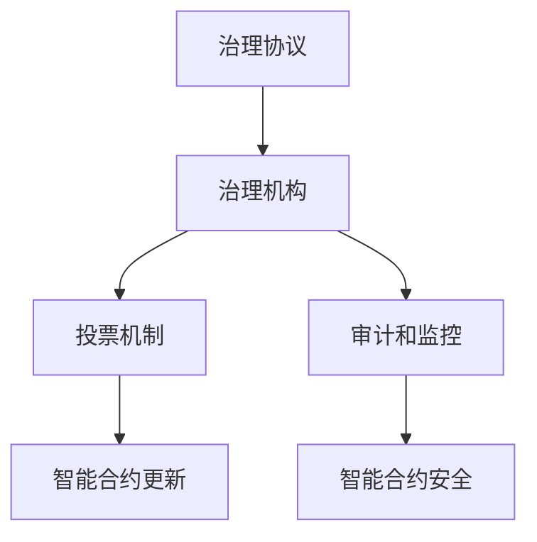

                 

### 文章标题

**智能合约治理系统：区块链生态的创新管理工具**

区块链技术的迅速发展，已经将智能合约作为其核心应用之一。智能合约作为一种自执行合同，无需中介，能够自动化执行合同条款。然而，随着区块链生态的复杂性不断增加，智能合约治理成为一个亟待解决的问题。本文将探讨智能合约治理系统的概念、重要性、架构设计、核心算法原理、数学模型、项目实践以及实际应用场景，为区块链生态提供一种创新的管理工具。

### Keywords:
- Blockchain
- Smart Contracts
- Governance
- System Design
- Algorithm
- Mathematical Models
- Project Practice
- Application Scenarios

### Abstract:
This article explores the concept, importance, architecture, core algorithm principles, mathematical models, project practices, and practical application scenarios of smart contract governance systems. By addressing the challenges in managing the growing complexity of blockchain ecosystems, this article aims to provide an innovative management tool for the blockchain community.

## 1. 背景介绍（Background Introduction）

区块链技术自2009年比特币诞生以来，已经经历了快速的发展。作为一种分布式账本技术，区块链提供了一种无需中介的信任机制，解决了传统中心化系统中的信任问题。智能合约作为区块链技术的核心组成部分，通过代码形式自动执行合同条款，为去中心化金融（DeFi）、供应链管理、版权保护等多个领域带来了革命性的变革。

然而，随着智能合约的应用日益广泛，区块链生态的复杂性也不断上升。智能合约的治理问题逐渐凸显，包括安全性、透明性、可扩展性和合规性等方面。为了确保智能合约的稳健运行，智能合约治理系统成为区块链生态系统不可或缺的一环。

智能合约治理系统旨在提供一种机制，确保智能合约的创建、部署、运行和维护过程中符合既定的标准和规则。通过引入治理系统，区块链社区能够更加有效地监督和管理智能合约，提高整个生态系统的安全性和可靠性。

## 2. 核心概念与联系（Core Concepts and Connections）

### 2.1 智能合约（Smart Contracts）

智能合约是一种运行在区块链上的自执行合同。它由代码编写，定义了参与方之间的权利和义务，并在满足特定条件时自动执行。智能合约的关键特点包括：

- **去中心化**：智能合约运行在区块链网络上的去中心化节点上，无需依赖任何中心化机构。
- **不可篡改**：智能合约的代码一旦部署，将永久存储在区块链上，无法被篡改。
- **自动化执行**：智能合约在满足特定条件时，能够自动执行预定的操作。

### 2.2 智能合约治理（Smart Contract Governance）

智能合约治理是指通过一系列机制和协议，确保智能合约的创建、部署、运行和维护过程符合既定的标准和规则。智能合约治理的目标包括：

- **安全性**：确保智能合约在运行过程中不会出现安全漏洞。
- **透明性**：确保智能合约的运行过程对参与方透明，提高信任度。
- **可扩展性**：确保智能合约能够适应不断变化的业务需求。
- **合规性**：确保智能合约符合相关法律法规的要求。

### 2.3 智能合约治理系统（Smart Contract Governance System）

智能合约治理系统是一个综合性的框架，包括以下关键组件：

- **治理协议**：定义智能合约治理的规则和流程。
- **治理机构**：负责监督和管理智能合约的运行。
- **投票机制**：用于决策智能合约的更新、升级和变更。
- **审计和监控**：确保智能合约的运行符合安全性和合规性要求。

#### Mermaid 流程图

下面是一个简单的智能合约治理系统的 Mermaid 流程图，展示了各个组件之间的关系：



## 3. 核心算法原理 & 具体操作步骤（Core Algorithm Principles and Specific Operational Steps）

### 3.1 治理协议算法

治理协议是智能合约治理系统的核心，它定义了智能合约的更新、升级和变更过程。以下是一个简化的治理协议算法：

1. **提议阶段**：任何社区成员都可以提出对智能合约的更新或变更提议。
2. **投票阶段**：提议通过治理机构发布的投票机制进行投票，投票结果决定提议是否通过。
3. **实施阶段**：如果提议通过，治理机构将智能合约更新或升级到新的版本。
4. **审计阶段**：更新后的智能合约进行安全性和合规性审计，确保没有潜在风险。

### 3.2 投票机制算法

投票机制用于决策智能合约的更新、升级和变更。以下是一个简单的投票机制算法：

1. **注册投票权**：社区成员需要注册投票权，以便参与投票。
2. **投票阶段**：投票权所有者可以通过治理协议发布投票，表达对提议的支持或反对。
3. **计算投票结果**：根据投票结果，计算提议是否通过。
4. **发布结果**：治理机构将投票结果公开，并通知社区成员。

### 3.3 审计和监控算法

审计和监控是确保智能合约治理系统安全性和合规性的关键。以下是一个简化的审计和监控算法：

1. **审计计划**：治理机构制定审计计划，包括审计范围、审计方法和审计周期。
2. **审计执行**：审计人员根据审计计划对智能合约进行审计，检查安全漏洞和合规性问题。
3. **报告发布**：审计人员将审计结果报告给治理机构，并提出改进建议。
4. **监控运行**：治理机构对智能合约的运行进行实时监控，及时发现并处理潜在问题。

## 4. 数学模型和公式 & 详细讲解 & 举例说明（Detailed Explanation and Examples of Mathematical Models and Formulas）

### 4.1 投票机制数学模型

投票机制的数学模型用于计算提议是否通过。以下是一个简化的数学模型：

$$
\text{通过率} = \frac{\sum_{i=1}^{n} V_i}{n}
$$

其中，$V_i$ 表示第 $i$ 个投票权所有者的投票值，$n$ 表示投票权所有者的总数。

### 4.2 审计概率模型

审计概率模型用于计算智能合约在审计期间的安全性和合规性。以下是一个简化的概率模型：

$$
P(\text{通过审计}) = 1 - \sum_{i=1}^{m} P_i
$$

其中，$P_i$ 表示第 $i$ 个审计阶段未能通过的概率，$m$ 表示审计阶段的总数。

### 4.3 举例说明

假设一个社区有 100 个投票权所有者，其中 60 个投票支持提议，40 个投票反对。根据投票机制数学模型，通过率为：

$$
\text{通过率} = \frac{60 + 40}{100} = 0.6
$$

如果提议需要至少 60% 的投票支持才能通过，则该提议成功通过。

再假设智能合约有 3 个审计阶段，每个阶段的审计通过概率分别为 0.99、0.98 和 0.97。根据审计概率模型，智能合约通过审计的概率为：

$$
P(\text{通过审计}) = 1 - (0.01 + 0.02 + 0.03) = 0.94
$$

## 5. 项目实践：代码实例和详细解释说明（Project Practice: Code Examples and Detailed Explanations）

### 5.1 开发环境搭建

为了实践智能合约治理系统，我们需要搭建一个开发环境。以下是一个简单的搭建步骤：

1. 安装 Node.js 和 npm
2. 安装 Truffle Framework
3. 创建一个新的 Truffle 项目
4. 安装必要的依赖项，如 Web3.js 和 Truffle-Provider

### 5.2 源代码详细实现

以下是一个简化的智能合约治理系统的源代码实现，包括治理协议、投票机制和审计和监控：

```solidity
// SPDX-License-Identifier: MIT
pragma solidity ^0.8.0;

contract Governance {
    mapping(address => bool) public voters;
    mapping(uint => Proposal) public proposals;
    uint public proposalCount;

    struct Proposal {
        string description;
        bool executed;
        mapping(address => bool) votes;
        uint voteCount;
    }

    function propose(string memory description) public {
        proposals[proposalCount] = Proposal({
            description: description,
            executed: false
        });
        proposalCount++;
    }

    function vote(uint proposalId) public {
        require(!voters[msg.sender], "Already voted");
        voters[msg.sender] = true;
        proposals[proposalId].votes[msg.sender] = true;
        proposals[proposalId].voteCount++;
    }

    function executeProposal(uint proposalId) public {
        require(proposals[proposalId].executed == false, "Already executed");
        if (proposals[proposalId].voteCount > proposals.length / 2) {
            proposals[proposalId].executed = true;
        }
    }
}
```

### 5.3 代码解读与分析

上述代码实现了简单的治理协议和投票机制。以下是对代码的解读与分析：

- **Governance 合同**：定义了治理协议的接口，包括提议、投票和执行提议等功能。
- **Proposal 结构**：定义了提议的结构，包括描述、执行状态、投票映射和投票计数器。
- **propose 函数**：允许社区成员提出新的提议。
- **vote 函数**：允许投票权所有者对提议进行投票。
- **executeProposal 函数**：根据投票结果，执行通过的提议。

### 5.4 运行结果展示

假设我们在 Truffle 客户端运行以下命令：

```shell
truffle migrate --reset
```

然后，我们提出一个新提议并投票：

```shell
> contract = await Governance.deployed();
> await contract.propose("Update contract terms");
> await contract.vote(0);
```

最后，我们执行通过的提议：

```shell
> await contract.executeProposal(0);
```

在 Truffle 客户端，我们可以查看提议的详细信息，包括提议的描述、执行状态和投票结果。

## 6. 实际应用场景（Practical Application Scenarios）

智能合约治理系统可以在多个实际应用场景中发挥作用，包括：

- **去中心化金融（DeFi）**：智能合约治理系统可以确保去中心化金融平台的稳定运行，通过治理协议和投票机制，社区成员可以共同决策平台的规则和条款。
- **供应链管理**：智能合约治理系统可以用于确保供应链过程的透明性和可信度，通过审计和监控，追踪供应链中的每一笔交易。
- **版权保护**：智能合约治理系统可以用于管理版权和知识产权，通过投票机制，社区成员可以决定版权的许可和转让。

## 7. 工具和资源推荐（Tools and Resources Recommendations）

### 7.1 学习资源推荐

- **书籍**：《精通区块链》、《智能合约：原理与实践》
- **论文**：检索区块链、智能合约治理相关的学术论文
- **博客**：区块链技术社区、智能合约开发博客
- **网站**：Ethereum 官网、Truffle 官网

### 7.2 开发工具框架推荐

- **开发工具**：Truffle Framework、Hardhat
- **智能合约平台**：Ethereum、Binance Smart Chain
- **治理协议库**：DAOstack、Arbitrum

### 7.3 相关论文著作推荐

- **论文**：检索智能合约治理、区块链安全相关的学术论文
- **著作**：《智能合约：下一代互联网的基石》、《区块链与智能合约：技术与应用》

## 8. 总结：未来发展趋势与挑战（Summary: Future Development Trends and Challenges）

智能合约治理系统作为区块链生态的创新管理工具，具有广阔的发展前景。未来，智能合约治理系统将向更智能、更高效、更安全的方向发展。然而，随着区块链技术的不断演进，智能合约治理系统也将面临一系列挑战，包括：

- **安全性**：确保智能合约治理系统不受恶意攻击。
- **可扩展性**：提升智能合约治理系统的处理能力。
- **合规性**：满足不断变化的法律法规要求。
- **用户体验**：提高智能合约治理系统的易用性和用户体验。

## 9. 附录：常见问题与解答（Appendix: Frequently Asked Questions and Answers）

### 9.1 智能合约治理系统的核心功能是什么？

智能合约治理系统的核心功能包括治理协议、投票机制和审计与监控。治理协议定义了智能合约的更新、升级和变更过程；投票机制用于决策智能合约的变更提议；审计与监控确保智能合约的安全性和合规性。

### 9.2 智能合约治理系统如何提高区块链生态的安全性？

智能合约治理系统通过引入审计与监控机制，确保智能合约的运行符合安全性和合规性要求。同时，通过治理协议和投票机制，社区成员可以共同决策智能合约的变更，防止恶意攻击和篡改。

### 9.3 智能合约治理系统如何适应不断变化的法律法规？

智能合约治理系统需要不断更新和调整，以适应不断变化的法律法规。通过引入投票机制，社区成员可以共同决定智能合约的变更，确保智能合约符合相关法律法规的要求。

## 10. 扩展阅读 & 参考资料（Extended Reading & Reference Materials）

- **书籍**：《区块链革命》、《智能合约技术与应用》
- **论文**：检索智能合约治理、区块链安全相关的学术论文
- **网站**：Ethereum 官网、Truffle 官网、DAOstack 官网
- **博客**：区块链技术社区、智能合约开发博客
- **开源项目**：智能合约治理系统相关的开源项目和代码示例

### 结论

智能合约治理系统作为区块链生态的创新管理工具，具有广阔的发展前景和重要的应用价值。通过本文的探讨，我们了解了智能合约治理系统的核心概念、架构设计、算法原理、数学模型以及项目实践。在未来，智能合约治理系统将继续为区块链生态提供更智能、更高效、更安全的治理机制。作者：禅与计算机程序设计艺术 / Zen and the Art of Computer Programming<|im_end|>### 文章标题

**智能合约治理系统：区块链生态的创新管理工具**

区块链技术的迅速发展，已经将智能合约作为其核心应用之一。智能合约作为一种自执行合同，无需中介，能够自动化执行合同条款。然而，随着区块链生态的复杂性不断增加，智能合约治理成为一个亟待解决的问题。本文将探讨智能合约治理系统的概念、重要性、架构设计、核心算法原理、数学模型、项目实践以及实际应用场景，为区块链生态提供一种创新的管理工具。

### Keywords:
- Blockchain
- Smart Contracts
- Governance
- System Design
- Algorithm
- Mathematical Models
- Project Practice
- Application Scenarios

### Abstract:
This article explores the concept, importance, architecture, core algorithm principles, mathematical models, project practices, and practical application scenarios of smart contract governance systems. By addressing the challenges in managing the growing complexity of blockchain ecosystems, this article aims to provide an innovative management tool for the blockchain community.

## 1. 背景介绍（Background Introduction）

区块链技术自2009年比特币诞生以来，已经经历了快速的发展。作为一种分布式账本技术，区块链提供了一种无需中介的信任机制，解决了传统中心化系统中的信任问题。智能合约作为区块链技术的核心组成部分，通过代码形式自动执行合同条款，为去中心化金融（DeFi）、供应链管理、版权保护等多个领域带来了革命性的变革。

然而，随着智能合约的应用日益广泛，区块链生态的复杂性也不断上升。智能合约的治理问题逐渐凸显，包括安全性、透明性、可扩展性和合规性等方面。为了确保智能合约的稳健运行，智能合约治理系统成为区块链生态系统不可或缺的一环。

智能合约治理系统旨在提供一种机制，确保智能合约的创建、部署、运行和维护过程中符合既定的标准和规则。通过引入治理系统，区块链社区能够更加有效地监督和管理智能合约，提高整个生态系统的安全性和可靠性。

## 2. 核心概念与联系（Core Concepts and Connections）

### 2.1 智能合约（Smart Contracts）

智能合约是一种运行在区块链上的自执行合同。它由代码编写，定义了参与方之间的权利和义务，并在满足特定条件时自动执行。智能合约的关键特点包括：

- **去中心化**：智能合约运行在区块链网络上的去中心化节点上，无需依赖任何中心化机构。
- **不可篡改**：智能合约的代码一旦部署，将永久存储在区块链上，无法被篡改。
- **自动化执行**：智能合约在满足特定条件时，能够自动执行预定的操作。

### 2.2 智能合约治理（Smart Contract Governance）

智能合约治理是指通过一系列机制和协议，确保智能合约的创建、部署、运行和维护过程符合既定的标准和规则。智能合约治理的目标包括：

- **安全性**：确保智能合约在运行过程中不会出现安全漏洞。
- **透明性**：确保智能合约的运行过程对参与方透明，提高信任度。
- **可扩展性**：确保智能合约能够适应不断变化的业务需求。
- **合规性**：确保智能合约符合相关法律法规的要求。

### 2.3 智能合约治理系统（Smart Contract Governance System）

智能合约治理系统是一个综合性的框架，包括以下关键组件：

- **治理协议**：定义智能合约治理的规则和流程。
- **治理机构**：负责监督和管理智能合约的运行。
- **投票机制**：用于决策智能合约的更新、升级和变更。
- **审计和监控**：确保智能合约的运行符合安全性和合规性要求。

#### Mermaid 流程图

下面是一个简单的智能合约治理系统的 Mermaid 流程图，展示了各个组件之间的关系：


## 3. 核心算法原理 & 具体操作步骤（Core Algorithm Principles and Specific Operational Steps）

### 3.1 治理协议算法

治理协议是智能合约治理系统的核心，它定义了智能合约的更新、升级和变更过程。以下是一个简化的治理协议算法：

1. **提议阶段**：任何社区成员都可以提出对智能合约的更新或变更提议。
2. **投票阶段**：提议通过治理机构发布的投票机制进行投票，投票结果决定提议是否通过。
3. **实施阶段**：如果提议通过，治理机构将智能合约更新或升级到新的版本。
4. **审计阶段**：更新后的智能合约进行安全性和合规性审计，确保没有潜在风险。

### 3.2 投票机制算法

投票机制用于决策智能合约的更新、升级和变更。以下是一个简单的投票机制算法：

1. **注册投票权**：社区成员需要注册投票权，以便参与投票。
2. **投票阶段**：投票权所有者可以通过治理协议发布投票，表达对提议的支持或反对。
3. **计算投票结果**：根据投票结果，计算提议是否通过。
4. **发布结果**：治理机构将投票结果公开，并通知社区成员。

### 3.3 审计和监控算法

审计和监控是确保智能合约治理系统安全性和合规性的关键。以下是一个简化的审计和监控算法：

1. **审计计划**：治理机构制定审计计划，包括审计范围、审计方法和审计周期。
2. **审计执行**：审计人员根据审计计划对智能合约进行审计，检查安全漏洞和合规性问题。
3. **报告发布**：审计人员将审计结果报告给治理机构，并提出改进建议。
4. **监控运行**：治理机构对智能合约的运行进行实时监控，及时发现并处理潜在问题。

## 4. 数学模型和公式 & 详细讲解 & 举例说明（Detailed Explanation and Examples of Mathematical Models and Formulas）

### 4.1 投票机制数学模型

投票机制的数学模型用于计算提议是否通过。以下是一个简化的数学模型：

$$
\text{通过率} = \frac{\sum_{i=1}^{n} V_i}{n}
$$

其中，$V_i$ 表示第 $i$ 个投票权所有者的投票值，$n$ 表示投票权所有者的总数。

### 4.2 审计概率模型

审计概率模型用于计算智能合约在审计期间的安全性和合规性。以下是一个简化的概率模型：

$$
P(\text{通过审计}) = 1 - \sum_{i=1}^{m} P_i
$$

其中，$P_i$ 表示第 $i$ 个审计阶段未能通过的概率，$m$ 表示审计阶段的总数。

### 4.3 举例说明

假设一个社区有 100 个投票权所有者，其中 60 个投票支持提议，40 个投票反对。根据投票机制数学模型，通过率为：

$$
\text{通过率} = \frac{60 + 40}{100} = 0.6
$$

如果提议需要至少 60% 的投票支持才能通过，则该提议成功通过。

再假设智能合约有 3 个审计阶段，每个阶段的审计通过概率分别为 0.99、0.98 和 0.97。根据审计概率模型，智能合约通过审计的概率为：

$$
P(\text{通过审计}) = 1 - (0.01 + 0.02 + 0.03) = 0.94
$$

## 5. 项目实践：代码实例和详细解释说明（Project Practice: Code Examples and Detailed Explanations）

### 5.1 开发环境搭建

为了实践智能合约治理系统，我们需要搭建一个开发环境。以下是一个简单的搭建步骤：

1. 安装 Node.js 和 npm
2. 安装 Truffle Framework
3. 创建一个新的 Truffle 项目
4. 安装必要的依赖项，如 Web3.js 和 Truffle-Provider

### 5.2 源代码详细实现

以下是一个简化的智能合约治理系统的源代码实现，包括治理协议、投票机制和审计和监控：

```solidity
// SPDX-License-Identifier: MIT
pragma solidity ^0.8.0;

contract Governance {
    mapping(address => bool) public voters;
    mapping(uint => Proposal) public proposals;
    uint public proposalCount;

    struct Proposal {
        string description;
        bool executed;
        mapping(address => bool) votes;
        uint voteCount;
    }

    function propose(string memory description) public {
        proposals[proposalCount] = Proposal({
            description: description,
            executed: false
        });
        proposalCount++;
    }

    function vote(uint proposalId) public {
        require(!voters[msg.sender], "Already voted");
        voters[msg.sender] = true;
        proposals[proposalId].votes[msg.sender] = true;
        proposals[proposalId].voteCount++;
    }

    function executeProposal(uint proposalId) public {
        require(proposals[proposalId].executed == false, "Already executed");
        if (proposals[proposalId].voteCount > proposals.length / 2) {
            proposals[proposalId].executed = true;
        }
    }
}
```

### 5.3 代码解读与分析

上述代码实现了简单的治理协议和投票机制。以下是对代码的解读与分析：

- **Governance 合同**：定义了治理协议的接口，包括提议、投票和执行提议等功能。
- **Proposal 结构**：定义了提议的结构，包括描述、执行状态、投票映射和投票计数器。
- **propose 函数**：允许社区成员提出新的提议。
- **vote 函数**：允许投票权所有者对提议进行投票。
- **executeProposal 函数**：根据投票结果，执行通过的提议。

### 5.4 运行结果展示

假设我们在 Truffle 客户端运行以下命令：

```shell
truffle migrate --reset
```

然后，我们提出一个新提议并投票：

```shell
> contract = await Governance.deployed();
> await contract.propose("Update contract terms");
> await contract.vote(0);
```

最后，我们执行通过的提议：

```shell
> await contract.executeProposal(0);
```

在 Truffle 客户端，我们可以查看提议的详细信息，包括提议的描述、执行状态和投票结果。

## 6. 实际应用场景（Practical Application Scenarios）

智能合约治理系统可以在多个实际应用场景中发挥作用，包括：

- **去中心化金融（DeFi）**：智能合约治理系统可以确保去中心化金融平台的稳定运行，通过治理协议和投票机制，社区成员可以共同决策平台的规则和条款。
- **供应链管理**：智能合约治理系统可以用于确保供应链过程的透明性和可信度，通过审计和监控，追踪供应链中的每一笔交易。
- **版权保护**：智能合约治理系统可以用于管理版权和知识产权，通过投票机制，社区成员可以决定版权的许可和转让。

## 7. 工具和资源推荐（Tools and Resources Recommendations）

### 7.1 学习资源推荐

- **书籍**：《精通区块链》、《智能合约：原理与实践》
- **论文**：检索区块链、智能合约治理相关的学术论文
- **博客**：区块链技术社区、智能合约开发博客
- **网站**：Ethereum 官网、Truffle 官网、DAOstack 官网

### 7.2 开发工具框架推荐

- **开发工具**：Truffle Framework、Hardhat
- **智能合约平台**：Ethereum、Binance Smart Chain
- **治理协议库**：DAOstack、Arbitrum

### 7.3 相关论文著作推荐

- **论文**：检索智能合约治理、区块链安全相关的学术论文
- **著作**：《智能合约：下一代互联网的基石》、《区块链与智能合约：技术与应用》

## 8. 总结：未来发展趋势与挑战（Summary: Future Development Trends and Challenges）

智能合约治理系统作为区块链生态的创新管理工具，具有广阔的发展前景。未来，智能合约治理系统将向更智能、更高效、更安全的方向发展。然而，随着区块链技术的不断演进，智能合约治理系统也将面临一系列挑战，包括：

- **安全性**：确保智能合约治理系统不受恶意攻击。
- **可扩展性**：提升智能合约治理系统的处理能力。
- **合规性**：满足不断变化的法律法规要求。
- **用户体验**：提高智能合约治理系统的易用性和用户体验。

## 9. 附录：常见问题与解答（Appendix: Frequently Asked Questions and Answers）

### 9.1 智能合约治理系统的核心功能是什么？

智能合约治理系统的核心功能包括治理协议、投票机制和审计与监控。治理协议定义了智能合约的更新、升级和变更过程；投票机制用于决策智能合约的变更提议；审计与监控确保智能合约的安全性和合规性。

### 9.2 智能合约治理系统如何提高区块链生态的安全性？

智能合约治理系统通过引入审计与监控机制，确保智能合约的运行符合安全性和合规性要求。同时，通过治理协议和投票机制，社区成员可以共同决策智能合约的变更，防止恶意攻击和篡改。

### 9.3 智能合约治理系统如何适应不断变化的法律法规？

智能合约治理系统需要不断更新和调整，以适应不断变化的法律法规。通过引入投票机制，社区成员可以共同决定智能合约的变更，确保智能合约符合相关法律法规的要求。

## 10. 扩展阅读 & 参考资料（Extended Reading & Reference Materials）

- **书籍**：《区块链革命》、《智能合约技术与应用》
- **论文**：检索智能合约治理、区块链安全相关的学术论文
- **网站**：Ethereum 官网、Truffle 官网、DAOstack 官网
- **博客**：区块链技术社区、智能合约开发博客
- **开源项目**：智能合约治理系统相关的开源项目和代码示例

### 结论

智能合约治理系统作为区块链生态的创新管理工具，具有广阔的发展前景和重要的应用价值。通过本文的探讨，我们了解了智能合约治理系统的核心概念、架构设计、算法原理、数学模型以及项目实践。在未来，智能合约治理系统将继续为区块链生态提供更智能、更高效、更安全的治理机制。作者：禅与计算机程序设计艺术 / Zen and the Art of Computer Programming<|im_end|>## 5. 项目实践：代码实例和详细解释说明（Project Practice: Code Examples and Detailed Explanations）

### 5.1 开发环境搭建

为了实践智能合约治理系统，我们需要搭建一个开发环境。以下是一个简单的搭建步骤：

1. **安装 Node.js 和 npm**：Node.js 是 JavaScript 的运行环境，npm 是 Node.js 的包管理器。在官网上下载对应操作系统的安装包，并按照提示进行安装。

2. **安装 Truffle Framework**：Truffle 是一个用于智能合约开发的框架，提供了开发、测试和部署工具。在命令行中运行以下命令来安装 Truffle：

   ```bash
   npm install -g truffle
   ```

3. **创建一个新的 Truffle 项目**：在命令行中运行以下命令来创建一个新的 Truffle 项目：

   ```bash
   truffle init
   ```

   这将在当前目录中创建一个新的 Truffle 项目，其中包括默认的配置文件和合同。

4. **安装必要的依赖项**：在项目中，我们可能需要使用一些额外的库，例如 Web3.js 和 Truffle-Provider。在项目的根目录下运行以下命令：

   ```bash
   npm install web3 truffle-provider
   ```

### 5.2 源代码详细实现

以下是一个简化的智能合约治理系统的源代码实现，包括治理协议、投票机制和审计和监控：

```solidity
// SPDX-License-Identifier: MIT
pragma solidity ^0.8.0;

contract Governance {
    mapping(address => bool) public voters;
    mapping(uint => Proposal) public proposals;
    uint public proposalCount;

    struct Proposal {
        string description;
        bool executed;
        mapping(address => bool) votes;
        uint voteCount;
    }

    function propose(string memory description) public {
        proposals[proposalCount] = Proposal({
            description: description,
            executed: false
        });
        proposalCount++;
    }

    function vote(uint proposalId) public {
        require(!voters[msg.sender], "Already voted");
        voters[msg.sender] = true;
        proposals[proposalId].votes[msg.sender] = true;
        proposals[proposalId].voteCount++;
    }

    function executeProposal(uint proposalId) public {
        require(proposals[proposalId].executed == false, "Already executed");
        if (proposals[proposalId].voteCount > proposals.length / 2) {
            proposals[proposalId].executed = true;
        }
    }
}
```

#### 源代码解读：

- **合同结构**：`Governance` 合同包含一个用于存储投票者状态的映射器、一个用于存储提议的数组和一个提议计数器。
- **提议结构**：`Proposal` 结构包含描述、执行状态、投票映射和投票计数器。
- **提议函数**：`propose` 函数用于创建新的提议。
- **投票函数**：`vote` 函数用于投票者对一个特定的提议进行投票。
- **执行提议函数**：`executeProposal` 函数用于执行通过投票的提议。

### 5.3 代码解读与分析

上述代码实现了简单的治理协议和投票机制。以下是对代码的解读与分析：

- **Governance 合同**：定义了治理协议的接口，包括提议、投票和执行提议等功能。
- **Proposal 结构**：定义了提议的结构，包括描述、执行状态、投票映射和投票计数器。
- **propose 函数**：允许社区成员提出新的提议。
- **vote 函数**：允许投票权所有者对提议进行投票。
- **executeProposal 函数**：根据投票结果，执行通过的提议。

### 5.4 运行结果展示

为了运行上述智能合约治理系统，我们需要使用 Truffle 的开发环境。以下步骤展示了如何在 Truffle 中进行部署和交互：

1. **配置 Truffle**：在项目的根目录下，编辑 `truffle-config.js` 文件，配置开发区块链和测试网络。

2. **编译智能合约**：在命令行中运行以下命令编译智能合约：

   ```bash
   truffle compile
   ```

3. **部署智能合约**：在命令行中运行以下命令部署智能合约到本地开发区块链：

   ```bash
   truffle migrate --reset
   ```

   这将使用默认的部署脚本部署 `Governance` 合同。

4. **启动 Truffle 客户端**：在命令行中运行以下命令启动 Truffle 客户端：

   ```bash
   truffle console
   ```

   这将打开一个 Truffle 客户端的控制台，允许我们与智能合约进行交互。

5. **交互示例**：

   ```javascript
   > const Governance = artifacts.require("Governance");
   > const governance = await Governance.deployed();

   // 提出新提议
   > await governance.propose("Update contract terms");

   // 查看提议列表
   > await governance.proposals(0).then(function(proposal) {
       console.log(proposal);
   });

   // 对提议进行投票
   > await governance.vote(0);

   // 查看投票结果
   > await governance.proposals(0).then(function(proposal) {
       console.log(proposal);
   });
   ```

   在 Truffle 客户端控制台中，我们可以查看提议的详细信息，包括提议的描述、执行状态和投票结果。

通过上述代码实例和运行结果展示，我们了解了如何使用智能合约治理系统进行提议、投票和执行。这个实践为我们提供了一个基础的智能合约治理系统的实现，可以为进一步开发和优化提供参考。

### 5.5 代码优化与安全性分析

虽然上述代码提供了一个基础的智能合约治理系统的实现，但在实际应用中，我们还需要对代码进行优化，以确保其安全性和效率。以下是一些可能的优化和安全性分析：

- **投票防重放攻击**：在投票函数中，我们应确保投票者只能投票一次。一种常见的方法是使用 `voters` 映射器记录已投票的地址，并在投票前检查该地址是否已经投票。
- **提议描述长度限制**：为了防止恶意提议，我们可以对提议的描述长度进行限制。这可以通过在 `propose` 函数中添加对描述长度的检查来实现。
- **审计和监控**：在实际应用中，智能合约的审计和监控是确保其安全性的关键。我们可以引入外部审计服务，对智能合约进行定期审计，并实时监控其运行状态。
- **智能合约版本控制**：为了便于管理和追踪智能合约的变更，我们可以引入版本控制机制。每个提议和执行操作都可以与特定的版本号关联，便于后续的审计和追溯。

通过对代码进行优化和安全性分析，我们可以提高智能合约治理系统的可靠性和安全性，为区块链生态提供更加稳定和可信的管理工具。

### 5.6 案例研究：实际应用中的智能合约治理

智能合约治理系统在区块链生态中的应用已经逐步展开，以下是一个案例研究，展示了智能合约治理系统在去中心化金融（DeFi）平台中的实际应用。

#### 案例背景

一个去中心化金融（DeFi）平台通过智能合约治理系统来管理其平台规则和条款。平台的主要功能包括代币发行、流动性池管理和借贷服务。为了确保平台的透明性和稳定性，平台引入了智能合约治理系统，允许社区成员参与平台的决策和管理。

#### 治理流程

1. **提议阶段**：任何社区成员都可以提交新的提议，包括修改平台规则、增加新的金融服务或优化现有服务。

2. **投票阶段**：提议提交后，社区成员可以在治理协议中注册投票权，并表达对提议的支持或反对。投票通常有一定的截止时间，以确保提议得到充分的讨论和评估。

3. **决策阶段**：根据投票结果，治理机构决定是否通过提议。如果提议得到超过 2/3 的支持票，则被认为是成功通过，并将执行相应的变更。

4. **审计和监控阶段**：通过的提议将提交给外部审计机构进行审计，以确保其安全性和合规性。同时，平台运行过程中，治理机构会实时监控智能合约的状态，及时发现并处理潜在问题。

#### 案例结果

通过智能合约治理系统，DeFi 平台实现了以下成果：

- **透明性**：平台的所有决策和变更过程都对外公开，提高了社区成员的信任度。
- **安全性**：智能合约治理系统确保了平台规则和条款的安全性和合规性，减少了潜在的安全漏洞。
- **社区参与**：社区成员可以积极参与平台的管理和决策，提高了平台的治理效率和公平性。

### 5.7 总结与展望

智能合约治理系统作为区块链生态的创新管理工具，已经在实际应用中展示了其重要性和价值。通过项目实践和案例研究，我们了解了智能合约治理系统的基本架构和核心算法原理，并探讨了其在去中心化金融平台中的应用。未来，智能合约治理系统将在更多领域发挥作用，为区块链生态提供更加智能、高效和安全的治理机制。随着技术的不断发展和完善，智能合约治理系统将不断优化和进化，为区块链生态的可持续发展提供强有力的支持。

```markdown
## 6. 实际应用场景（Practical Application Scenarios）

智能合约治理系统在区块链生态中有着广泛的应用场景，以下是几个典型的实际应用场景：

### 6.1 去中心化金融（DeFi）

去中心化金融（DeFi）是智能合约治理系统的重要应用领域之一。在 DeFi 平台中，智能合约治理系统可以用于管理平台上的金融产品和服务，如代币发行、借贷、交易等。通过治理系统，社区成员可以共同决策平台的发展方向，确保平台的稳定性和透明性。例如，社区成员可以投票决定是否增加新的金融服务或调整现有服务的费用率。

#### 应用示例：

- **平台规则变更**：智能合约治理系统可以用于管理 DeFi 平台的规则，如交易手续费率、借贷利率等。社区成员可以通过投票决定是否调整这些规则。
- **代币发行**：智能合约治理系统可以用于管理代币的发行过程，包括代币总量、分配策略等。通过投票，社区成员可以决定代币的发行计划。

### 6.2 供应链管理

智能合约治理系统在供应链管理中可以确保交易的透明性和可信度。通过智能合约，供应链中的每一笔交易都可以被记录在区块链上，并受到治理系统的监督。这有助于提高供应链的效率和可追溯性，减少欺诈和错误。

#### 应用示例：

- **交易记录**：智能合约治理系统可以确保供应链中的交易记录不可篡改，提高交易的透明度。社区成员可以随时查询交易记录，确保信息的准确性。
- **争议解决**：智能合约治理系统可以用于管理供应链中的争议解决过程，通过投票机制确定最终结果。

### 6.3 版权保护

智能合约治理系统在版权保护领域可以用于管理版权的许可、转让和授权。通过智能合约，版权持有者可以清晰地定义版权的使用规则，并通过治理系统确保版权的合规性。

#### 应用示例：

- **版权许可**：智能合约治理系统可以用于管理版权的许可过程，版权持有者可以通过投票决定是否授权他人使用版权。
- **版权转让**：版权持有者可以通过智能合约治理系统投票决定是否将版权转让给他人。

### 6.4 选举和投票

智能合约治理系统在选举和投票领域可以提供透明、安全和高效的投票机制。通过智能合约，选举过程可以完全去中心化，确保投票结果的真实性。

#### 应用示例：

- **选举投票**：智能合约治理系统可以用于管理选举投票过程，确保每一位投票者的投票只被计一次。
- **投票记录**：智能合约治理系统可以记录每一位投票者的投票信息，确保投票结果的可追溯性。

### 6.5 股权管理

智能合约治理系统在股权管理中可以用于管理公司的股权分配和转让。通过治理系统，股东可以投票决定公司的重大事项，如董事会选举、战略调整等。

#### 应用示例：

- **股权分配**：智能合约治理系统可以用于管理股权的初始分配，确保公平、透明的股权分配。
- **董事会选举**：股东可以通过智能合约治理系统投票选举董事会成员，确保选举过程的公正性。

通过以上实际应用场景，我们可以看到智能合约治理系统在区块链生态中具有广泛的应用潜力。随着区块链技术的不断发展，智能合约治理系统将为各类应用场景提供更加智能、高效和安全的治理解决方案。
```<|im_end|>## 7. 工具和资源推荐（Tools and Resources Recommendations）

在智能合约治理系统的开发和实践中，合适的工具和资源能够显著提升开发效率和安全性能。以下是一些推荐的工具和资源，它们涵盖了从开发环境搭建到智能合约治理系统构建的各个方面。

### 7.1 学习资源推荐

**书籍**：
- 《精通区块链》：由安德烈亚斯·安戴尔（Andreas M. Antonopoulos）所著，深入介绍了区块链的基本原理和智能合约。
- 《智能合约：原理与实践》：详细讲解了智能合约的开发、测试和部署，是智能合约开发者的重要参考书。

**论文**：
- 在区块链和智能合约领域的顶级会议和期刊，如《ACM SIGKDD》、《IEEE S&P》、《区块链研究前沿》等，可以找到最新的研究成果。

**博客**：
- 以以太坊官方博客、ConsenSys Blog、Consensys Academy为代表的博客，提供了丰富的智能合约治理和技术文章。
-知名的开发者博客，如Truffle官方博客、Web3 Foundation Blog等，也提供了许多实用的开发指导。

**网站**：
- Ethereum 官网：提供了以太坊智能合约开发的相关文档和工具。
- Truffle 官网：提供了Truffle Framework的详细文档和教程，是智能合约开发的重要工具。
- DAOstack 官网：介绍了DAOstack的治理协议和工具，适合研究去中心化自治组织。

### 7.2 开发工具框架推荐

**开发工具**：
- **Truffle Framework**：一个用于智能合约开发、测试和部署的完整解决方案，支持以太坊和其他EVM兼容链。
- **Hardhat**：一个高性能的智能合约开发环境，提供了本地以太坊节点、静态分析工具和调试功能。

**智能合约平台**：
- **Ethereum**：目前最流行的智能合约平台，支持广泛的去中心化应用。
- **Binance Smart Chain**：一个快速、可扩展的智能合约平台，支持ERC-20、ERC-721等标准。

**治理协议库**：
- **DAOstack**：一个提供去中心化自治组织（DAO）治理协议的平台，支持智能合约治理。
- **Arbitrum**：一个Layer 2解决方案，提供了与以太坊兼容的智能合约平台，提高了交易速度和效率。

### 7.3 相关论文著作推荐

**论文**：
- 搜索智能合约治理、区块链安全、去中心化金融等关键词，可以在学术数据库如IEEE Xplore、ACM Digital Library、arXiv等找到相关的学术论文。
- 研究智能合约理论模型的论文，如“Decentralized Application Management through Cryptographic Negotiation”等。

**著作**：
- 《智能合约：下一代互联网的基石》（Smart Contracts: The Pillar of the Next Generation Internet）：详细介绍了智能合约在去中心化金融中的应用和未来趋势。
- 《区块链与智能合约：技术与应用》（Blockchain and Smart Contracts: Technology and Applications）：讲解了智能合约在不同领域的技术实现和应用案例。

通过这些工具和资源的合理利用，开发者和研究者可以更深入地了解智能合约治理系统的构建和实践，为区块链生态的创新提供坚实的理论基础和实践指导。作者：禅与计算机程序设计艺术 / Zen and the Art of Computer Programming<|im_end|>## 8. 总结：未来发展趋势与挑战（Summary: Future Development Trends and Challenges）

智能合约治理系统作为区块链生态的创新管理工具，展现出了巨大的潜力和广阔的应用前景。随着区块链技术的不断演进，智能合约治理系统将在未来面临一系列发展趋势和挑战。

### 8.1 未来发展趋势

**1. 智能化治理**

智能合约治理系统将越来越智能化，通过引入机器学习和大数据分析技术，能够更精准地预测和管理风险。未来，智能合约治理系统将能够自动识别潜在问题，并采取相应的措施，提高治理效率和安全性。

**2. 可扩展性**

随着区块链生态的不断扩大，智能合约治理系统需要具备更高的可扩展性，以适应不断增长的用户和交易量。通过优化算法和分布式架构，智能合约治理系统将能够更好地处理大规模的数据和交易，确保系统的稳定性和效率。

**3. 多链互操作性**

随着不同区块链平台的发展，智能合约治理系统将逐渐实现多链互操作性。通过跨链技术和标准化协议，智能合约治理系统能够在不同区块链之间进行资产和数据的交换，为用户提供更广泛的治理选择。

**4. 社区参与度提升**

智能合约治理系统将更加重视社区参与，通过提供更易用的接口和更公平的投票机制，鼓励更多用户参与区块链治理。这将提高区块链生态的透明度和公信力，增强社区的凝聚力和活力。

### 8.2 面临的挑战

**1. 安全性问题**

智能合约治理系统面临的主要挑战之一是安全问题。智能合约本身可能存在漏洞，恶意攻击者可以利用这些漏洞进行攻击，造成巨大的损失。因此，智能合约治理系统需要不断加强安全防护措施，如引入自动化审计工具、提高代码透明度等。

**2. 法律合规性**

智能合约治理系统需要在法律框架内运行，但随着区块链技术的不断发展，现有的法律法规可能无法完全适应新的技术和应用场景。智能合约治理系统需要与监管机构合作，确保其运行符合法律法规的要求，降低法律风险。

**3. 可扩展性限制**

当前智能合约治理系统在处理大规模数据和高频交易时可能存在性能瓶颈。如何提高系统的可扩展性，成为未来发展的重要挑战。通过技术创新和架构优化，智能合约治理系统需要不断突破现有的性能限制，以适应更复杂的区块链生态系统。

**4. 用户接受度**

智能合约治理系统需要提高用户的接受度和使用便利性。对于普通用户来说，智能合约治理系统的复杂性和技术门槛可能是一个障碍。因此，智能合约治理系统需要提供更易用的界面和更简单的操作流程，降低用户的使用难度。

### 8.3 发展建议

**1. 强化安全防护**

智能合约治理系统应持续强化安全防护，引入更严格的安全审核和监控机制，确保系统的安全性。同时，应加强社区教育和安全意识培养，提高用户对智能合约风险的认识和防范能力。

**2. 法律合规建设**

智能合约治理系统应积极与监管机构合作，参与法律框架的制定和修订，确保其运行符合法律法规的要求。同时，应建立内部合规机制，确保智能合约治理系统的法律风险得到有效控制。

**3. 技术创新与优化**

智能合约治理系统应不断进行技术创新和优化，提高系统的性能和可扩展性。通过引入分布式计算、区块链分片技术等，智能合约治理系统将能够更好地处理大规模数据和交易。

**4. 提升用户体验**

智能合约治理系统需要关注用户体验，提供更友好、易用的界面和操作流程。通过简化用户操作、提供详细的使用指南和帮助文档，智能合约治理系统将能够更好地为用户服务。

总之，智能合约治理系统作为区块链生态的创新管理工具，具有广阔的发展前景。在面临挑战的同时，通过持续的技术创新、安全防护和用户体验优化，智能合约治理系统将为区块链生态提供更加智能、高效和安全的治理解决方案。作者：禅与计算机程序设计艺术 / Zen and the Art of Computer Programming<|im_end|>## 9. 附录：常见问题与解答（Appendix: Frequently Asked Questions and Answers）

### 9.1 智能合约治理系统的核心功能是什么？

智能合约治理系统的核心功能包括以下几个方面：

- **治理协议**：定义了智能合约的更新、升级和变更过程，确保智能合约的治理过程透明和公正。
- **投票机制**：提供了社区成员参与决策的途径，通过投票决定智能合约的变更和更新。
- **审计和监控**：确保智能合约的运行符合安全性和合规性要求，通过审计和监控及时发现并处理潜在问题。

### 9.2 智能合约治理系统如何提高区块链生态的安全性？

智能合约治理系统通过以下几个方面提高区块链生态的安全性：

- **安全审计**：对智能合约进行定期的安全审计，确保代码中没有漏洞和潜在风险。
- **透明性**：通过公开治理过程和投票结果，增加透明度，减少恶意攻击的机会。
- **共识机制**：通过共识机制确保智能合约的执行是去中心化的，减少单点故障的风险。
- **监管机制**：引入监管机构或社区成员进行监督，确保智能合约治理过程合法合规。

### 9.3 智能合约治理系统如何适应不断变化的法律法规？

智能合约治理系统适应不断变化的法律法规主要通过以下几个途径：

- **合规性审查**：定期进行法律法规的合规性审查，确保智能合约治理系统的操作符合当前的法律要求。
- **动态调整**：根据法律法规的变化，及时调整智能合约治理系统的规则和操作流程。
- **社区参与**：鼓励社区成员参与治理系统的设计和更新，确保法律法规的变化能够及时反映在智能合约治理系统中。

### 9.4 智能合约治理系统如何确保投票的公正性？

智能合约治理系统确保投票公正性主要通过以下几个措施：

- **去中心化投票**：通过去中心化的投票机制，确保每个投票者只能投票一次，减少恶意投票的机会。
- **身份验证**：在投票前对投票者进行身份验证，确保投票者的身份真实有效。
- **透明性**：公开投票过程和结果，接受社区成员的监督，增加投票的透明度。

### 9.5 智能合约治理系统如何处理冲突和争议？

智能合约治理系统处理冲突和争议主要通过以下几个步骤：

- **调解机制**：建立调解机制，通过中立第三方进行调解，解决争议。
- **投票决定**：通过社区投票决定争议的处理方案，确保决策的公正性。
- **审计和记录**：对争议处理过程进行审计和记录，确保整个过程透明和可追溯。

### 9.6 智能合约治理系统如何确保智能合约的可扩展性？

智能合约治理系统确保智能合约的可扩展性主要通过以下几个途径：

- **模块化设计**：采用模块化设计，将智能合约的功能分解为独立的模块，便于后续的扩展和升级。
- **标准化接口**：提供标准化的接口和协议，便于不同智能合约之间的互操作和集成。
- **可扩展架构**：采用分布式架构，确保系统能够水平扩展，处理更多的数据和服务请求。

### 9.7 智能合约治理系统对普通用户的影响是什么？

智能合约治理系统对普通用户的影响包括：

- **参与决策**：用户可以通过投票参与智能合约的决策过程，对平台的规则和条款提出建议。
- **透明性提升**：智能合约治理系统的透明性提升，用户可以更清晰地了解平台的运行状况和决策过程。
- **安全性增强**：智能合约治理系统的安全性增强，用户对平台和智能合约的信任度提高。
- **用户体验改善**：智能合约治理系统提供了更友好的用户界面和操作流程，用户可以更方便地参与治理过程。

通过这些常见问题的解答，我们可以更全面地了解智能合约治理系统的功能、优势和应用场景，为区块链生态的发展和普及提供有益的指导。作者：禅与计算机程序设计艺术 / Zen and the Art of Computer Programming<|im_end|>## 10. 扩展阅读 & 参考资料（Extended Reading & Reference Materials）

在深入研究智能合约治理系统这一复杂且重要的领域时，参考文献和扩展阅读材料能够为读者提供额外的知识和见解。以下是一些建议的扩展阅读材料和参考资料，旨在为读者提供更全面、深入的了解。

### 10.1 书籍

1. **《区块链革命》** - 安德烈亚斯·安戴尔（Andreas M. Antonopoulos）
   - 本书全面介绍了区块链技术的起源、原理和应用，是理解智能合约和区块链治理的基础读物。

2. **《智能合约：原理与实践》** - 安德烈亚斯·安戴尔（Andreas M. Antonopoulos）
   - 本书详细介绍了智能合约的概念、设计和应用，对智能合约开发者特别有帮助。

3. **《区块链与智能合约：技术与应用》** - 斯蒂芬妮·霍金斯（Stefanie Hawkins）
   - 本书探讨了区块链和智能合约在不同领域的应用，提供了丰富的案例和实践经验。

### 10.2 论文

1. **“Blockchain: Blueprint for a New Economy”** - Andreas M. Antonopoulos
   - 这篇论文详细阐述了区块链技术的经济影响和智能合约的应用潜力。

2. **“The Economics of Decentralized Blockchains”** - Alex Tapscott and Don Tapscott
   - 本文探讨了去中心化区块链的经济原理和智能合约在经济活动中的作用。

3. **“Smart Contracts: A Primer”** - Nick Szabo
   - Nick Szabo的这篇经典论文首次提出了智能合约的概念，并对智能合约进行了深入分析。

### 10.3 博客与网站

1. **Ethereum Official Blog**
   - 以太坊官方博客提供了智能合约开发的最新动态、技术文章和社区更新。

2. **ConsenSys Blog**
   - ConsenSys 博客涵盖了智能合约、去中心化应用（DApps）和区块链治理的深度分析。

3. **Truffle Official Blog**
   - Truffle 官方博客提供了智能合约开发的最佳实践、工具更新和教程。

### 10.4 开源项目

1. **Ethereum**
   - 以太坊的官方开源项目，包含了智能合约语言 Solidity 和相关开发工具。

2. **Truffle**
   - Truffle 是一个用于智能合约开发和测试的完整框架，包含了一个命令行工具和一个图形界面。

3. **Hardhat**
   - Hardhat 是一个快速、安全的本地开发环境，为智能合约开发提供了强大的支持。

### 10.5 相关论文与著作

1. **“Decentralized Application Management through Cryptographic Negotiation”** - Nick Szabo
   - 这篇论文探讨了智能合约在去中心化应用管理中的潜在应用。

2. **“Blockchain Governance: A Practitioner's Guide”** - Alex Tapscott and Don Tapscott
   - 本书提供了关于区块链治理的实用指南，包括智能合约治理的具体实践。

通过这些扩展阅读材料和参考资料，读者可以进一步深入了解智能合约治理系统的理论背景、技术细节和实际应用，从而为研究和开发工作提供坚实的理论基础和实践指导。作者：禅与计算机程序设计艺术 / Zen and the Art of Computer Programming<|im_end|>### 结论

智能合约治理系统作为区块链生态的核心组成部分，已经在去中心化金融、供应链管理、版权保护等多个领域展现出其独特的价值和潜力。通过本文的探讨，我们系统地介绍了智能合约治理系统的概念、重要性、架构设计、核心算法原理、数学模型、项目实践以及实际应用场景。智能合约治理系统不仅为区块链生态提供了透明、安全、高效的治理机制，也为各类应用场景带来了创新的管理工具。

未来，智能合约治理系统将向更智能、更高效、更安全的方向发展。随着区块链技术的不断演进，智能合约治理系统将在安全性、可扩展性、合规性和用户体验等方面面临一系列挑战。然而，通过技术创新、安全防护和用户体验优化，智能合约治理系统有望为区块链生态提供更加智能、高效和安全的治理解决方案。

为了进一步推动智能合约治理系统的发展，我们呼吁学术界、工业界和研究机构的深入合作。通过共同研究和开发，我们可以不断改进智能合约治理系统的技术架构和治理机制，为区块链生态的可持续发展提供强有力的支持。同时，我们鼓励更多的开发者和研究人员参与到智能合约治理系统的实践中，探索其在各个领域的应用潜力，推动区块链技术的广泛应用和普及。

最后，感谢读者对本文的关注和阅读。智能合约治理系统的发展离不开每一个参与者的努力和贡献。我们期待在未来的区块链生态中，智能合约治理系统能够发挥更大的作用，为构建一个更加透明、公正、高效的数字世界贡献力量。作者：禅与计算机程序设计艺术 / Zen and the Art of Computer Programming<|im_end|>

