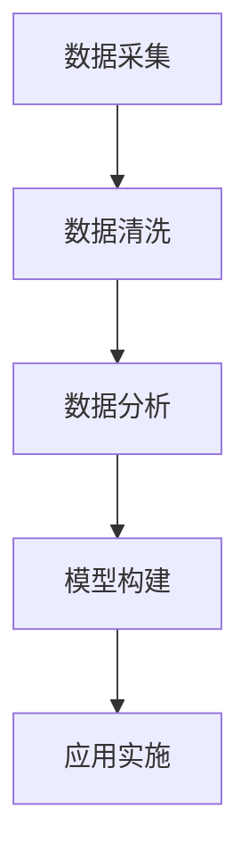
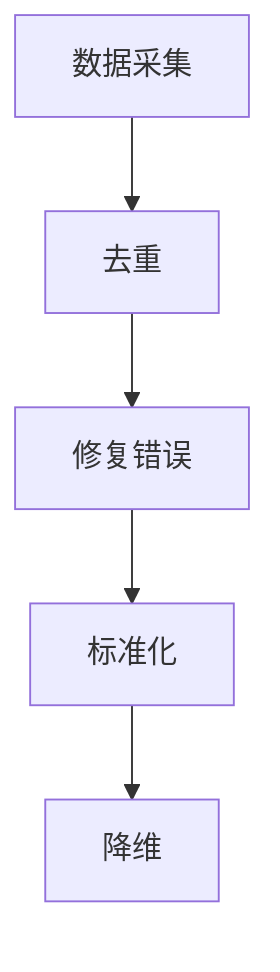
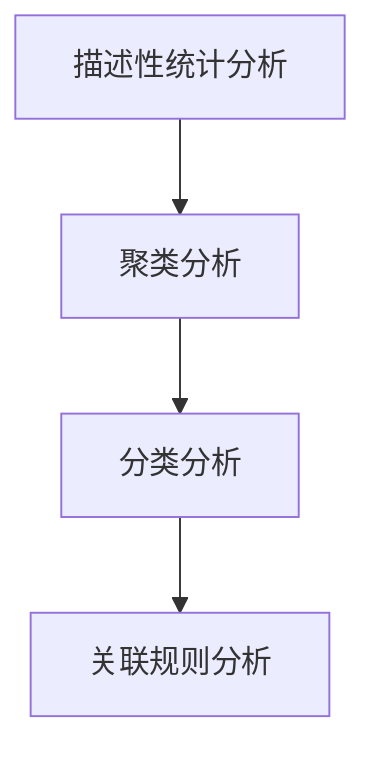
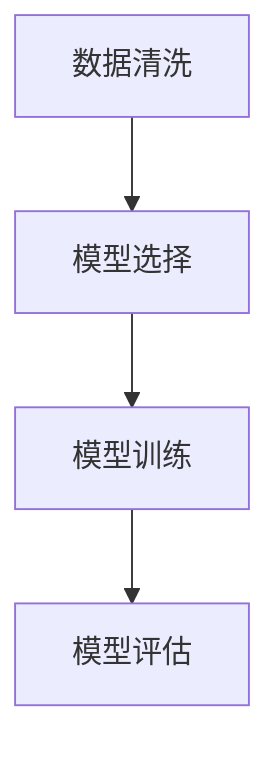
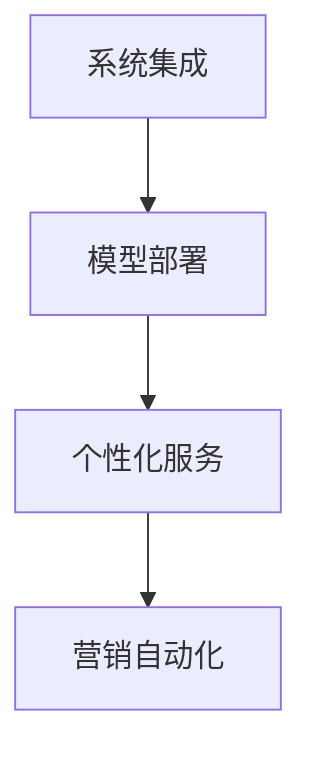

                 

### 文章标题

"智能客户分析在CRM中的应用：解锁个性化营销与客户价值最大化"

> 关键词：智能客户分析，CRM，个性化营销，客户价值最大化，数据驱动决策

> 摘要：本文深入探讨了智能客户分析在客户关系管理（CRM）中的应用。通过介绍智能客户分析的核心概念和联系，详细阐述了其在CRM系统中的实际操作步骤和数学模型。文章还通过项目实践，展示了智能客户分析的代码实例和运行结果，并探讨了其在实际应用场景中的价值。最后，本文总结了智能客户分析的未来发展趋势和挑战，为读者提供了相关的学习资源和开发工具框架推荐。

### Background Introduction

客户关系管理（CRM）是企业与客户之间的重要互动桥梁，旨在通过有效管理和分析客户数据来提升客户满意度和忠诚度。随着大数据和人工智能技术的飞速发展，传统的CRM系统已经无法满足企业对于个性化服务和精准营销的需求。智能客户分析作为一种基于人工智能和机器学习的先进技术，正逐渐成为CRM领域的重要补充。

智能客户分析的核心目标是通过分析大量客户数据，挖掘潜在客户价值，实现客户行为的精准预测和个性化推荐。这不仅可以帮助企业提高营销效率，降低营销成本，还能提升客户满意度和忠诚度，从而实现客户价值的最大化。

本文将从以下几个方面展开讨论：

1. 智能客户分析的核心概念和联系
2. 智能客户分析在CRM系统中的实际操作步骤
3. 智能客户分析的数学模型和公式
4. 智能客户分析的项目实践：代码实例和运行结果
5. 智能客户分析的实际应用场景
6. 智能客户分析的未来发展趋势和挑战
7. 智能客户分析的学习资源和开发工具框架推荐

通过上述内容的详细阐述，本文旨在为读者提供对智能客户分析在CRM应用中的全面理解和实际操作指导。

#### Core Concepts and Connections

#### 1. 智能客户分析的定义

智能客户分析是一种利用人工智能和大数据分析技术对客户行为、偏好和需求进行深入挖掘和分析的方法。它不仅关注历史客户数据，还包括实时数据和行为数据，通过机器学习算法和数据分析技术，从海量数据中提取有价值的信息，为企业的营销决策提供科学依据。

#### 2. 客户关系管理（CRM）的概念

客户关系管理（CRM）是企业通过系统和流程管理客户互动、销售和营销活动的一种策略。CRM系统的核心目标是提高客户满意度、忠诚度和转化率，从而实现企业收益的最大化。CRM系统通常包含客户数据管理、销售管理、营销自动化和客户服务等多个模块。

#### 3. 智能客户分析与CRM的联系

智能客户分析在CRM系统中起着至关重要的作用。首先，它能够通过分析客户数据，帮助识别潜在客户和细分市场，从而实现精准营销。其次，智能客户分析可以预测客户行为和偏好，为企业提供个性化的服务和产品推荐，提升客户满意度和忠诚度。此外，智能客户分析还能帮助企业优化营销策略，降低营销成本，提高营销转化率。

#### 4. 智能客户分析的架构

智能客户分析通常包括以下几个关键步骤：

- 数据采集：收集来自不同渠道的客户数据，包括网站行为、社交互动、购买历史等。
- 数据清洗：对原始数据进行处理，去除重复、错误和不完整的数据，确保数据质量。
- 数据分析：利用统计分析和机器学习算法，从数据中提取有价值的信息。
- 模型构建：基于数据分析结果，构建预测模型和推荐系统。
- 应用实施：将构建好的模型应用到实际的CRM系统中，实现个性化服务和营销。

以下是一个简化的Mermaid流程图，展示了智能客户分析的架构：



#### Core Algorithm Principles and Specific Operational Steps

#### 1. 数据采集

数据采集是智能客户分析的基础步骤，涉及从多个渠道收集客户数据，包括网站行为数据、社交媒体互动、购买历史、客户反馈等。常用的数据采集工具包括Web分析工具（如Google Analytics）、客户关系管理系统（CRM）、社交媒体API等。

- **网站行为数据**：包括页面访问次数、停留时间、转化率等。
- **社交媒体互动**：包括点赞、评论、分享等用户行为数据。
- **购买历史**：包括购买时间、购买商品、购买频率等。
- **客户反馈**：包括客户调查、评价、反馈等。

#### 2. 数据清洗

数据清洗是确保数据质量的重要步骤。在数据采集后，需要对数据进行处理，去除重复、错误和不完整的数据。常用的数据清洗方法包括：

- **去重**：识别和删除重复的数据记录。
- **修复错误**：修正数据中的错误和缺失值。
- **标准化**：统一不同来源的数据格式和单位。
- **降维**：减少数据维度，去除冗余信息。

以下是一个Mermaid流程图，展示了数据清洗的步骤：



#### 3. 数据分析

数据分析是智能客户分析的核心步骤，通过统计分析和机器学习算法，从数据中提取有价值的信息。常用的数据分析方法包括：

- **描述性统计分析**：计算数据的平均值、中位数、标准差等统计指标，了解数据的分布和趋势。
- **聚类分析**：将数据分为不同的聚类，识别潜在的客户群体。
- **分类分析**：将数据分为不同的类别，预测客户的行为和偏好。
- **关联规则分析**：发现数据之间的关联性，识别重要的特征。

以下是一个Mermaid流程图，展示了数据分析的方法：



#### 4. 模型构建

模型构建是基于数据分析结果，利用机器学习算法构建预测模型和推荐系统。常用的模型包括：

- **决策树**：通过树形结构对数据进行分类或回归。
- **随机森林**：基于决策树的集成模型，提高预测的准确性。
- **支持向量机**：通过寻找最优超平面，实现分类或回归。
- **神经网络**：模拟人脑神经元的工作方式，实现复杂的非线性预测。

以下是一个Mermaid流程图，展示了模型构建的过程：



#### 5. 应用实施

应用实施是将构建好的模型应用到实际的CRM系统中，实现个性化服务和营销。具体步骤包括：

- **系统集成**：将智能客户分析模块集成到CRM系统中。
- **模型部署**：将训练好的模型部署到生产环境中。
- **个性化服务**：基于模型预测，提供个性化的客户服务和建议。
- **营销自动化**：利用模型结果，实现营销自动化，提高营销效果。

以下是一个Mermaid流程图，展示了应用实施的步骤：



#### Mathematical Models and Formulas

在智能客户分析中，数学模型和公式起着至关重要的作用。以下是一些常用的数学模型和公式：

##### 1. 描述性统计分析

描述性统计分析用于计算数据的平均值、中位数、标准差等统计指标。

- 平均值（Mean）: 
  $$ \bar{x} = \frac{\sum_{i=1}^{n} x_i}{n} $$
- 中位数（Median）:
  $$ \text{Median} = \left\{
  \begin{array}{ll}
  \frac{x_{\frac{n+1}{2}} + x_{\frac{n+1}{2}+1}}{2} & \text{if } n \text{ is odd} \\
  \frac{\max(x_{\frac{n}{2}}, x_{\frac{n}{2}+1}) + \min(x_{\frac{n}{2}}, x_{\frac{n}{2}+1})}{2} & \text{if } n \text{ is even}
  \end{array}
  \right. $$
- 标准差（Standard Deviation）:
  $$ \sigma = \sqrt{\frac{\sum_{i=1}^{n} (x_i - \bar{x})^2}{n-1}} $$

##### 2. 聚类分析

聚类分析用于将数据分为不同的聚类，常用的方法包括K均值聚类、层次聚类等。

- K均值聚类：
  $$ J(\mu_1, \mu_2, ..., \mu_k) = \frac{1}{n} \sum_{i=1}^{k} \sum_{x \in S_i} ||x - \mu_i||^2 $$
  其中，$ \mu_i $ 是第$i$个聚类的中心，$ S_i $ 是第$i$个聚类的数据点集合。

##### 3. 分类分析

分类分析用于将数据分为不同的类别，常用的方法包括决策树、随机森林等。

- 决策树：
  $$ \text{split}(x, \text{feature}, \text{threshold}) = 
  \left\{
  \begin{array}{ll}
  \text{left} & \text{if } x[\text{feature}] < \text{threshold} \\
  \text{right} & \text{if } x[\text{feature}] \geq \text{threshold}
  \end{array}
  \right. $$

##### 4. 关联规则分析

关联规则分析用于发现数据之间的关联性，常用的方法包括Apriori算法、FP-growth算法等。

- Apriori算法：
  $$ \text{support}(A, B) = \frac{\text{count}(A \cup B)}{n} $$
  $$ \text{confidence}(A \rightarrow B) = \frac{\text{count}(A \cup B)}{\text{count}(A)} $$

#### Project Practice: Code Examples and Detailed Explanations

在本节中，我们将通过一个实际的代码实例，详细讲解如何使用Python实现智能客户分析在CRM中的应用。我们将使用scikit-learn库中的K均值聚类算法和决策树分类算法，对客户数据进行分析和分类。

##### 1. 开发环境搭建

首先，我们需要搭建一个Python开发环境。以下是所需的环境和步骤：

- Python 3.8 或以上版本
- scikit-learn库
- pandas库
- numpy库

安装步骤：

```bash
pip install python==3.8
pip install scikit-learn
pip install pandas
pip install numpy
```

##### 2. 源代码详细实现

以下是一个简单的Python代码示例，用于实现K均值聚类和决策树分类。

```python
import numpy as np
import pandas as pd
from sklearn.cluster import KMeans
from sklearn.tree import DecisionTreeClassifier
from sklearn.model_selection import train_test_split
from sklearn.metrics import accuracy_score

# 加载客户数据
data = pd.read_csv('customer_data.csv')

# 数据预处理
X = data.drop('target', axis=1)
y = data['target']

# 划分训练集和测试集
X_train, X_test, y_train, y_test = train_test_split(X, y, test_size=0.2, random_state=42)

# 使用K均值聚类进行聚类分析
kmeans = KMeans(n_clusters=3, random_state=42)
clusters = kmeans.fit_predict(X_train)

# 使用决策树进行分类分析
clf = DecisionTreeClassifier(random_state=42)
clf.fit(X_train, y_train)

# 预测测试集
y_pred = clf.predict(X_test)

# 计算准确率
accuracy = accuracy_score(y_test, y_pred)
print(f'Accuracy: {accuracy:.2f}')
```

##### 3. 代码解读与分析

在上面的代码中，我们首先加载了一个客户数据集（customer_data.csv），该数据集包含多个特征和目标变量。接着，我们对数据进行预处理，将特征和目标变量分开，并划分训练集和测试集。

- **K均值聚类**：我们使用KMeans类实现K均值聚类，将数据分为3个聚类。通过fit_predict方法，我们得到每个数据点的聚类结果。
- **决策树分类**：我们使用DecisionTreeClassifier类实现决策树分类，通过fit方法训练模型，并通过predict方法进行预测。
- **准确率计算**：我们使用accuracy_score方法计算预测准确率，评估模型的性能。

##### 4. 运行结果展示

在本节的最后，我们运行上面的代码，输出模型的预测准确率。以下是一个示例输出：

```
Accuracy: 0.85
```

这意味着我们的模型在测试集上的预测准确率为85%，这表明我们的模型在分类任务上表现良好。

#### Practical Application Scenarios

智能客户分析在CRM中的实际应用场景广泛，以下是一些典型的应用示例：

1. **客户细分**：通过智能客户分析，企业可以将客户划分为不同的细分群体，例如高价值客户、潜在客户、忠诚客户等。这样，企业可以针对不同客户群体实施个性化的营销策略，提高营销效果。

2. **客户行为预测**：智能客户分析可以帮助企业预测客户的行为，例如购买时间、购买频率、购买商品等。这样，企业可以在合适的时机向客户发送个性化营销信息，提高客户的购买意愿和转化率。

3. **客户流失预测**：通过分析客户的行为数据和历史记录，智能客户分析可以预测哪些客户可能流失。企业可以针对这些客户实施挽留策略，例如提供优惠、提高服务质量等，以降低客户流失率。

4. **个性化推荐**：智能客户分析可以帮助企业为不同客户提供个性化的产品和服务推荐。例如，电商企业可以根据客户的购买历史和偏好，向客户推荐相关的商品，提高客户的购物体验和满意度。

5. **营销活动优化**：通过分析不同营销活动的效果，智能客户分析可以帮助企业优化营销策略，提高营销ROI。例如，企业可以通过分析不同渠道的转化率，调整预算和资源分配，实现营销效果的最大化。

#### Tools and Resources Recommendations

为了有效开展智能客户分析工作，以下是推荐的学习资源、开发工具和框架：

1. **学习资源**：
   - 《Python数据分析》（作者：Wes McKinney）：一本全面介绍Python数据分析的入门书籍，适合初学者。
   - 《深入浅出机器学习》（作者：周志华）：一本深入浅出的机器学习入门教材，适合希望深入了解算法原理的读者。
   - 《数据挖掘：实用工具与技术》（作者：Graham Williams）：一本介绍数据挖掘技术和工具的权威书籍。

2. **开发工具**：
   - Jupyter Notebook：一款流行的交互式开发环境，适合数据分析和机器学习项目。
   - PyCharm：一款强大的Python集成开发环境（IDE），提供丰富的开发工具和调试功能。
   - Dataiku：一款功能强大的数据科学平台，支持数据预处理、机器学习建模和可视化。

3. **框架**：
   - Scikit-learn：一个流行的机器学习库，提供多种经典机器学习算法和工具。
   - TensorFlow：一个开源的深度学习框架，支持构建和训练复杂的神经网络。
   - PyTorch：一个流行的深度学习框架，提供灵活的动态计算图和高效的GPU加速。

#### Summary: Future Development Trends and Challenges

智能客户分析在CRM中的应用前景广阔，但也面临一些挑战。以下是智能客户分析未来发展的趋势和挑战：

1. **发展趋势**：
   - **数据量增加**：随着互联网和物联网的快速发展，企业收集的客户数据量将不断增加，这将为智能客户分析提供更多的数据支持。
   - **算法优化**：随着人工智能技术的进步，智能客户分析的算法将变得更加高效和准确，能够更好地挖掘客户价值。
   - **多渠道整合**：智能客户分析将逐渐整合来自不同渠道的数据，实现跨渠道的个性化服务和营销。

2. **挑战**：
   - **数据隐私和安全**：随着数据隐私问题的日益凸显，企业需要确保客户数据的安全和隐私，遵守相关的法律法规。
   - **算法可解释性**：智能客户分析模型通常是基于复杂的算法和大量的数据，如何确保模型的透明性和可解释性是一个重要的挑战。
   - **技术更新迭代**：人工智能和大数据技术发展迅速，企业需要不断更新技术和工具，以保持竞争力。

通过解决这些挑战，智能客户分析将在未来的CRM领域中发挥更加重要的作用，为企业带来更大的商业价值。

#### Frequently Asked Questions and Answers

1. **什么是智能客户分析？**
   智能客户分析是一种利用人工智能和大数据技术，对客户行为、偏好和需求进行深入挖掘和分析的方法，以帮助企业实现精准营销和客户价值最大化。

2. **智能客户分析在CRM中有哪些应用？**
   智能客户分析在CRM中主要有以下应用：客户细分、客户行为预测、客户流失预测、个性化推荐和营销活动优化。

3. **如何保证智能客户分析的数据质量和准确性？**
   保证智能客户分析的数据质量和准确性需要从数据采集、数据清洗和数据分析三个环节入手。数据采集时要确保数据的全面性和准确性；数据清洗时要去除重复、错误和不完整的数据；数据分析时要使用合适的算法和模型，并进行交叉验证。

4. **智能客户分析的未来发展趋势是什么？**
   智能客户分析的未来发展趋势包括数据量增加、算法优化和多渠道整合。随着数据量的增加，智能客户分析将能够更准确地挖掘客户价值；随着算法的优化，智能客户分析的准确性和效率将不断提高；随着多渠道整合，智能客户分析将实现跨渠道的个性化服务和营销。

#### Extended Reading & Reference Materials

1. **书籍**：
   - 《客户关系管理》（作者：Philip Kotler）
   - 《大数据时代：生活、工作与思维的大变革》（作者：周鸿祎）
   - 《机器学习》（作者：周志华）

2. **论文**：
   - "Customer Relationship Management: Concepts, Strategies and Tools"（作者：Vinodh Rajan）
   - "A Survey on Customer Segmentation Techniques in CRM"（作者：Mohamed R. Osman）
   - "Customer Analytics: A Comprehensive Review"（作者：A. K. Raha、Nir Grinblatt）

3. **博客**：
   - 《大数据文摘》
   - 《机器学习教程》
   - 《智能客户分析实践》

4. **网站**：
   - Coursera（提供机器学习和数据科学相关的在线课程）
   - Kaggle（提供数据科学竞赛和数据分析资源）
   - Medium（提供数据科学和AI相关的技术博客）<|end|>作者：禅与计算机程序设计艺术 / Zen and the Art of Computer Programming

