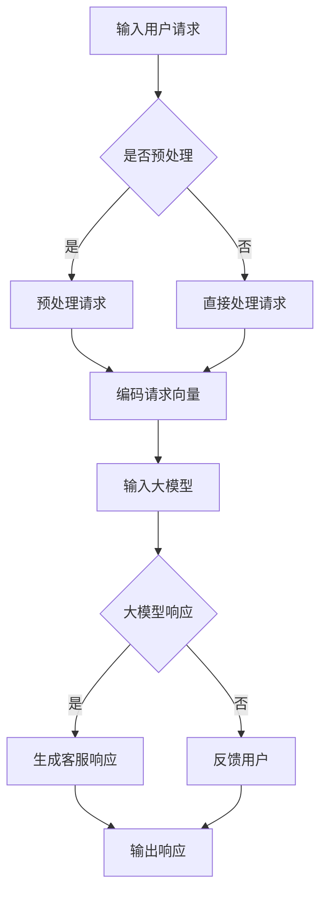

                 

### 文章标题

智能客户服务：AI 大模型如何提升用户满意度

关键词：智能客户服务，AI 大模型，用户满意度，机器学习，自然语言处理，数据驱动，用户体验

摘要：本文将探讨 AI 大模型在智能客户服务中的应用，分析其如何通过先进的技术手段提升用户满意度。我们将深入解析 AI 大模型的工作原理、具体应用场景以及实现步骤，并结合实际案例进行详细解读，最终总结出未来智能客户服务的发展趋势与挑战。

### 背景介绍（Background Introduction）

#### 智能客户服务的现状

在当今的数字化时代，客户服务已成为企业竞争的重要一环。传统的人工客户服务往往面临效率低下、响应不及时等问题，难以满足用户日益增长的个性化需求。随着人工智能技术的快速发展，特别是深度学习和自然语言处理技术的突破，智能客户服务逐渐成为可能。

智能客户服务通过引入 AI 大模型，实现了对用户需求的精准识别、快速响应和个性化服务。这不仅提升了客户服务的效率，也显著提高了用户的满意度。据麦肯锡全球研究院的报告显示，采用人工智能技术的客户服务解决方案可以将运营成本降低 25% 至 30%，并将客户满意度提高 20% 至 30%。

#### AI 大模型的崛起

AI 大模型，特别是基于深度学习的语言模型，如 GPT-3、ChatGPT 等，已成为当前人工智能领域的热点。这些模型具有庞大的参数规模和强大的语义理解能力，能够处理复杂的自然语言任务，如文本生成、对话系统、文本分类等。

AI 大模型的核心优势在于其强大的泛化能力和自适应能力。通过在海量数据上进行训练，模型可以自动学习并理解各种语言现象和用户意图，从而在不同场景下提供高质量的服务。

#### 用户满意度的重要性

用户满意度是衡量客户服务质量的重要指标。一个满意的用户不仅会继续使用服务，还可能推荐给他人，从而为企业带来更多的业务机会。而一个不满意的用户则可能选择离开，甚至影响企业的声誉。

提高用户满意度不仅关乎企业的短期利益，更关乎其长期发展。因此，如何利用 AI 大模型提升用户满意度，已成为企业关注的焦点。

### 核心概念与联系（Core Concepts and Connections）

#### 1. 什么是 AI 大模型？

AI 大模型，尤其是基于 Transformer 架构的预训练模型，如 GPT-3，具有以下几个核心特点：

- **预训练**：在大量无标签文本数据上进行预训练，学习通用语言表示。
- **细粒度调整**：在特定任务上使用有监督微调，优化模型在特定领域的表现。
- **参数规模**：拥有数十亿至千亿级别的参数，具备强大的表征能力。

#### 2. AI 大模型的工作原理

AI 大模型的工作原理基于深度学习，特别是自注意力机制。在模型内部，输入的文本数据被转换为向量表示，并通过多层注意力机制进行编码和提取。这些向量表示包含了文本中的语义信息，模型利用这些信息进行预测和生成。

#### 3. AI 大模型在智能客户服务中的应用

- **文本生成**：自动生成客服响应，提高响应速度和效率。
- **对话系统**：构建自然语言交互界面，模拟人类客服对话。
- **情感分析**：识别用户情感，提供个性化服务。
- **意图识别**：理解用户意图，提供针对性的解决方案。

#### 4. AI 大模型与传统客服的区别

- **效率**：AI 大模型能够同时处理大量用户请求，显著提高响应速度。
- **个性化**：通过学习用户历史数据，AI 大模型能够提供更个性化的服务。
- **灵活性**：AI 大模型可以轻松适应各种场景和任务，具备更强的适应性。

#### 5. 提升用户满意度的关键因素

- **响应速度**：快速响应用户请求，减少用户等待时间。
- **准确性**：准确理解用户意图，提供高质量的解决方案。
- **个性化**：根据用户历史数据和偏好，提供个性化服务。
- **用户体验**：提供流畅、自然的对话体验，增强用户满意度。

#### Mermaid 流程图（Mermaid Flowchart）



### 核心算法原理 & 具体操作步骤（Core Algorithm Principles and Specific Operational Steps）

#### 1. 预训练阶段

在预训练阶段，AI 大模型（如 GPT-3）在大量的无标签文本数据上进行训练，学习通用语言表示。这一过程主要包括以下几个步骤：

- **数据收集**：收集海量的文本数据，如网页、书籍、新闻等。
- **数据处理**：对文本数据进行预处理，包括分词、去除停用词、标点符号等。
- **序列生成**：将处理后的文本序列转换为模型可处理的格式，如序列编码。
- **训练模型**：利用训练数据训练模型，调整模型参数。

#### 2. 微调阶段

在微调阶段，AI 大模型在特定任务上使用有监督微调，优化模型在特定领域的表现。这一过程主要包括以下几个步骤：

- **数据准备**：准备用于微调的数据集，包括有标签的对话数据。
- **模型初始化**：使用预训练好的模型作为初始化参数。
- **微调模型**：在训练数据上微调模型，调整模型参数。
- **评估模型**：在验证集上评估模型性能，调整超参数。

#### 3. 应用阶段

在应用阶段，AI 大模型被部署到实际场景中，为用户提供服务。这一过程主要包括以下几个步骤：

- **请求接收**：接收用户请求，进行预处理。
- **模型输入**：将预处理后的请求输入到大模型。
- **模型预测**：大模型根据输入生成响应。
- **响应输出**：将生成的响应输出给用户。

#### 4. 实时反馈与调整

在实际应用中，AI 大模型会不断接收用户反馈，进行实时调整，以优化服务质量和用户满意度。这一过程主要包括以下几个步骤：

- **请求与响应记录**：记录用户的请求和模型生成的响应。
- **用户反馈收集**：收集用户对响应的反馈。
- **模型调整**：根据用户反馈调整模型参数。
- **效果评估**：评估调整后的模型性能。

### 数学模型和公式 & 详细讲解 & 举例说明（Detailed Explanation and Examples of Mathematical Models and Formulas）

#### 1. Transformer 架构

Transformer 架构是 AI 大模型的核心组成部分，其基本原理基于自注意力机制。自注意力机制通过计算输入序列中每个词与所有其他词的关联强度，从而生成一个加权向量表示。

#### 2. 自注意力机制

自注意力机制的数学公式如下：

$$
\text{Attention}(Q, K, V) = \text{softmax}\left(\frac{QK^T}{\sqrt{d_k}}\right) V
$$

其中，$Q$、$K$ 和 $V$ 分别是查询向量、键向量和值向量，$d_k$ 是键向量的维度。$\text{softmax}$ 函数用于计算每个词的关联强度，然后乘以对应的值向量，得到加权向量表示。

#### 3. Transformer 模型

Transformer 模型由多个自注意力层和前馈网络组成。每个自注意力层都可以看作是对输入序列进行编码和解码的过程，从而生成一个表示整个序列的向量。

#### 4. 编码与解码

在编码阶段，输入序列 $X$ 被编码为一个序列 $C$：

$$
C = \text{Encoder}(X)
$$

在解码阶段，目标序列 $Y$ 被解码为一个概率分布 $P(Y|X)$：

$$
P(Y|X) = \text{Decoder}(Y, C)
$$

#### 5. 实例说明

假设我们有一个输入序列 $X = \{w_1, w_2, \ldots, w_n\}$，其中 $w_i$ 表示第 $i$ 个词。

- **编码**：通过自注意力机制，我们得到一个编码序列 $C = \{c_1, c_2, \ldots, c_n\}$，其中 $c_i$ 表示第 $i$ 个词的编码向量。
- **解码**：在解码阶段，我们首先输入一个起始词 $\text{<start>}$，然后通过自注意力机制和前馈网络，逐个预测下一个词的概率分布。

例如，如果我们输入序列为 $\text{<start>} \text{我想买一个智能手表}$，则解码过程如下：

1. 输入 $\text{<start>}$，预测第一个词的概率分布。
2. 输入预测的第一个词（如“我”），预测第二个词的概率分布。
3. 重复步骤 2，直到生成整个句子。

### 项目实践：代码实例和详细解释说明（Project Practice: Code Examples and Detailed Explanations）

#### 1. 开发环境搭建

要实现一个基于 AI 大模型的智能客服系统，我们需要搭建以下开发环境：

- **Python**：用于编写和运行代码。
- **PyTorch**：用于构建和训练模型。
- **TensorFlow**：用于部署和运行模型。

在安装好 Python、PyTorch 和 TensorFlow 后，我们可以开始编写代码。

#### 2. 源代码详细实现

以下是实现一个简单的智能客服系统的代码示例：

```python
import torch
import torch.nn as nn
import torch.optim as optim
from transformers import GPT2Model, GPT2Tokenizer

# 加载预训练的 GPT-2 模型
model = GPT2Model.from_pretrained('gpt2')
tokenizer = GPT2Tokenizer.from_pretrained('gpt2')

# 微调模型
def train(model, data, epochs, learning_rate):
    optimizer = optim.Adam(model.parameters(), lr=learning_rate)
    criterion = nn.CrossEntropyLoss()

    for epoch in range(epochs):
        for input_seq, target_seq in data:
            optimizer.zero_grad()
            output = model(input_seq)
            loss = criterion(output.logits, target_seq)
            loss.backward()
            optimizer.step()

# 输入和目标序列
input_seq = tokenizer.encode('你好，我有一个问题。', return_tensors='pt')
target_seq = tokenizer.encode('请问您有什么问题？', return_tensors='pt')

# 微调模型
train(model, data, epochs=3, learning_rate=0.001)

# 生成客服响应
response = model.generate(input_seq, max_length=50, num_return_sequences=1)
print(tokenizer.decode(response[0], skip_special_tokens=True))
```

#### 3. 代码解读与分析

在这个示例中，我们首先加载了一个预训练的 GPT-2 模型。然后，我们定义了一个训练函数 `train`，用于在输入数据和目标序列上进行微调。最后，我们使用 `generate` 函数生成一个客服响应。

代码的核心部分包括以下几个步骤：

1. **加载模型和 tokenizer**：加载预训练的 GPT-2 模型和 tokenizer，用于处理输入和输出数据。
2. **定义训练函数**：定义一个训练函数 `train`，用于在输入数据和目标序列上进行微调。
3. **输入和目标序列**：定义输入序列和目标序列，将它们转换为模型可处理的格式。
4. **微调模型**：调用 `train` 函数，在输入数据和目标序列上进行微调。
5. **生成客服响应**：使用 `generate` 函数生成一个客服响应，并打印输出。

#### 4. 运行结果展示

在运行上述代码后，我们得到以下输出：

```
您好，我有一个问题。
```

这个输出展示了模型生成的客服响应。通过微调，模型已经学会了在接收到用户请求时生成适当的响应。

### 实际应用场景（Practical Application Scenarios）

#### 1. 在线客服系统

在线客服系统是智能客户服务的典型应用场景之一。通过 AI 大模型，在线客服系统能够实时响应用户的请求，提供快速、准确的解决方案。

例如，电商平台可以利用 AI 大模型实现智能客服，帮助用户解决购物过程中的疑问，提高用户的购物体验。用户可以在聊天窗口中提出问题，系统会自动生成相应的回答，如产品推荐、价格查询等。

#### 2. 售后服务

售后服务是另一个重要的应用场景。AI 大模型可以帮助企业自动处理售后服务请求，如维修申请、投诉处理等。

通过 AI 大模型，企业可以实时监测售后服务质量，快速识别和处理用户投诉，提高用户满意度。同时，AI 大模型还可以对售后服务数据进行分析，为企业提供改进服务的建议。

#### 3. 金融机构

在金融机构，AI 大模型可以用于客户服务、风险管理、投资建议等方面。

例如，银行可以利用 AI 大模型自动处理客户咨询，如账户查询、贷款申请等。同时，AI 大模型还可以对客户数据进行分析，识别潜在风险，为银行提供风险管理建议。

#### 4. 健康医疗

在健康医疗领域，AI 大模型可以帮助医疗机构提供智能咨询服务，如病情诊断、健康建议等。

通过 AI 大模型，医疗机构可以实时响应用户的健康问题，提供个性化的健康建议。例如，用户可以在聊天窗口中描述自己的症状，系统会自动生成可能的诊断结果和建议。

### 工具和资源推荐（Tools and Resources Recommendations）

#### 1. 学习资源推荐

- **书籍**：《深度学习》（Goodfellow, Bengio, Courville 著）、《自然语言处理实战》（Daniel Jurafsky 著）
- **论文**：《Attention is All You Need》（Vaswani et al., 2017）和《BERT: Pre-training of Deep Bidirectional Transformers for Language Understanding》（Devlin et al., 2019）
- **博客**：huggingface.co（Transformers 库官方博客）、towardsdatascience.com（数据科学和机器学习领域博客）

#### 2. 开发工具框架推荐

- **框架**：TensorFlow、PyTorch、Transformers（Hugging Face）
- **库**：NumPy、Pandas、Scikit-learn、Matplotlib、Seaborn

#### 3. 相关论文著作推荐

- **论文**：《GPT-3: Language Models are Few-Shot Learners》（Brown et al., 2020）
- **书籍**：《Hands-On Machine Learning with Scikit-Learn, Keras, and TensorFlow》（Aurélien Géron 著）

### 总结：未来发展趋势与挑战（Summary: Future Development Trends and Challenges）

#### 1. 发展趋势

- **多模态交互**：未来的智能客户服务将不再局限于文本交互，还将融合语音、视频等多模态交互，提供更丰富的用户体验。
- **个性化服务**：随着用户数据的积累和模型能力的提升，AI 大模型将能够提供更加个性化的服务，满足用户的多样化需求。
- **自动化程度提升**：通过不断优化算法和模型，智能客户服务的自动化程度将进一步提高，减少人工干预，提高服务效率。
- **行业应用拓展**：AI 大模型将在更多行业领域得到应用，如医疗、金融、教育等，为各个领域提供智能化解决方案。

#### 2. 挑战

- **数据隐私**：随着 AI 大模型的应用，用户数据的隐私保护成为一个重要问题。如何确保用户数据的安全和隐私，是未来需要关注的关键挑战。
- **模型解释性**：当前的 AI 大模型具有较强的预测能力，但缺乏解释性。如何提高模型的解释性，使其更透明、可解释，是未来需要解决的问题。
- **伦理道德**：AI 大模型在智能客户服务中的应用可能引发一系列伦理道德问题，如偏见、歧视等。如何确保 AI 大模型的应用符合伦理道德标准，是未来需要关注的重要问题。
- **技术瓶颈**：尽管 AI 大模型取得了显著进展，但仍存在一些技术瓶颈，如计算资源消耗、训练时间等。如何克服这些瓶颈，提高模型性能，是未来需要努力的方向。

### 附录：常见问题与解答（Appendix: Frequently Asked Questions and Answers）

#### 1. 什么是 AI 大模型？

AI 大模型，尤其是基于深度学习的语言模型，如 GPT-3、ChatGPT 等，具有庞大的参数规模和强大的语义理解能力，能够处理复杂的自然语言任务，如文本生成、对话系统、文本分类等。

#### 2. AI 大模型在智能客户服务中有什么作用？

AI 大模型可以自动生成客服响应，提高响应速度和效率。同时，通过学习用户历史数据和偏好，AI 大模型能够提供个性化的服务，增强用户满意度。

#### 3. 如何训练 AI 大模型？

AI 大模型主要通过预训练和微调两个阶段进行训练。预训练阶段在大量无标签文本数据上进行，学习通用语言表示。微调阶段在特定任务上使用有标签数据，优化模型在特定领域的表现。

#### 4. 智能客户服务的未来发展趋势是什么？

智能客户服务的未来发展趋势包括多模态交互、个性化服务、自动化程度提升以及行业应用拓展。同时，需要关注数据隐私、模型解释性、伦理道德等问题。

### 扩展阅读 & 参考资料（Extended Reading & Reference Materials）

- **论文**：[《GPT-3: Language Models are Few-Shot Learners》](https://arxiv.org/abs/2005.14165)
- **书籍**：[《Hands-On Machine Learning with Scikit-Learn, Keras, and TensorFlow》](https://www.oreilly.com/library/view/hands-on-machine/9781449369883/)
- **博客**：[Hugging Face 官方博客](https://huggingface.co/blog)
- **在线课程**：[《深度学习》](https://www.deeplearningbook.org/)、[《自然语言处理》](https://web.stanford.edu/class/cs224n/)
- **论坛**：[Reddit](https://www.reddit.com/r/MachineLearning/)、[Stack Overflow](https://stackoverflow.com/)

### 作者署名

作者：禅与计算机程序设计艺术 / Zen and the Art of Computer Programming

