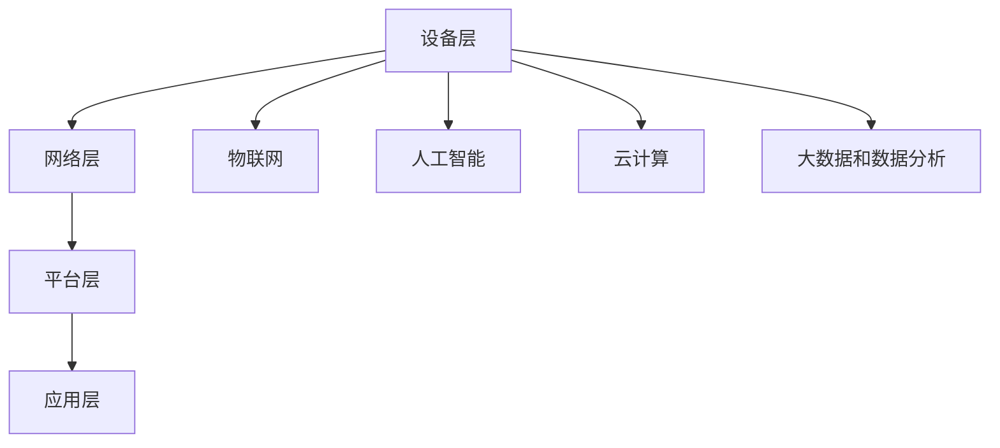

                 

### 文章标题

**智能家居创业：打造未来生活方式**

### 关键词

- 智能家居
- 创业
- 未来生活方式
- 人工智能
- 物联网
- 用户体验
- 数据分析
- 云计算
- 安全性

### 摘要

本文将探讨智能家居创业的机遇与挑战，分析如何利用人工智能、物联网和云计算等现代技术，打造具有前瞻性的未来生活方式。我们将从市场趋势、核心技术、产品设计、用户体验和商业模式等方面，逐步阐述智能家居创业的成功之道，旨在为有意进入智能家居行业的创业者提供有价值的指导。

<|assistant|>## 1. 背景介绍

### 智能家居的定义与发展历程

智能家居（Smart Home）是指利用网络通信技术，将家庭中的各种设备连接起来，实现智能控制和管理的一种居住环境。智能家居的概念可以追溯到20世纪90年代，但真正的发展始于21世纪初，随着互联网、物联网、人工智能和大数据等技术的快速发展，智能家居迎来了爆发式增长。

### 当前智能家居市场状况

近年来，随着消费者对高品质生活的需求不断提升，智能家居市场呈现出快速增长的趋势。根据市场研究公司的数据，全球智能家居市场的规模正在以每年超过20%的速度增长。特别是在北美、欧洲和中国等市场，智能家居产品的普及率已经达到了较高的水平。

### 智能家居创业的机遇与挑战

智能家居创业的机遇在于，市场需求的不断增长为创业者提供了广阔的市场空间。然而，同时也面临着诸多挑战，如技术难题、市场竞争、用户习惯的培养等。如何在激烈的市场竞争中脱颖而出，成为智能家居行业的领导者，是创业者需要认真思考的问题。

<|assistant|>## 2. 核心概念与联系

### 智能家居的核心技术

#### 物联网（Internet of Things, IoT）

物联网是智能家居的核心技术之一，它通过将各种设备连接到互联网，实现设备间的数据交换和协同工作。物联网技术使得智能家居系统能够实时监测和控制家庭设备，提高家庭生活的便利性和安全性。

#### 人工智能（Artificial Intelligence, AI）

人工智能技术在智能家居中的应用，使得设备能够自主学习、自动决策和自动优化。例如，智能音箱可以通过语音识别和自然语言处理技术，与用户进行对话，提供个性化的服务。

#### 云计算（Cloud Computing）

云计算为智能家居系统提供了强大的计算能力和数据存储能力。通过云计算，智能家居系统能够实时分析用户行为数据，提供个性化的推荐和服务。

#### 大数据和数据分析（Big Data and Data Analysis）

大数据和数据分析技术可以帮助智能家居系统更好地理解用户需求，优化产品功能和用户体验。通过对用户行为数据的分析，智能家居系统能够提供更加智能化的服务。

### 智能家居系统的架构

智能家居系统的架构通常包括以下几个层次：

1. **设备层**：包括各种家庭设备，如智能灯泡、智能插座、智能摄像头等。
2. **网络层**：包括互联网、局域网等，用于连接各种设备。
3. **平台层**：包括智能中心、云计算平台等，用于处理设备数据、提供智能服务。
4. **应用层**：包括移动应用、Web应用等，用于用户与智能家居系统的交互。

#### Mermaid 流程图



### 核心概念与联系

智能家居的核心技术相互关联，共同构建了一个智能化的家庭环境。物联网技术为设备互联提供了基础，人工智能技术使得设备能够实现智能化的功能，云计算技术提供了强大的计算和存储能力，大数据和数据分析技术帮助系统更好地理解用户需求。

<|assistant|>## 3. 核心算法原理 & 具体操作步骤

### 3.1 人工智能算法在智能家居中的应用

人工智能算法在智能家居中的应用主要包括以下几个方面：

1. **语音识别与自然语言处理**：通过语音识别技术，将用户的语音指令转换为文本，再通过自然语言处理技术，理解用户的意图，并提供相应的服务。
2. **图像识别与视频分析**：通过图像识别技术，智能设备可以识别家庭中的物体和场景，从而进行相应的操作。视频分析技术则可以用于安全监控、智能照明等场景。
3. **预测与优化**：通过分析用户的历史行为数据，智能家居系统可以预测用户的需求，并自动调整设备状态，提供个性化的服务。

### 3.2 物联网数据采集与处理

物联网设备通过传感器和采集器收集家庭环境数据，如温度、湿度、光照强度等。这些数据需要经过处理，才能被智能家居系统利用。

1. **数据采集**：设备通过传感器和采集器实时采集环境数据。
2. **数据预处理**：对采集到的数据进行清洗、过滤和转换，确保数据的质量和一致性。
3. **数据存储**：将预处理后的数据存储在数据库中，以便后续分析和处理。

### 3.3 云计算与大数据分析

云计算和大数据分析技术为智能家居系统提供了强大的计算和存储能力，使得系统能够实时分析用户行为数据，提供个性化的服务。

1. **数据存储**：将用户行为数据存储在云端数据库中。
2. **数据清洗与预处理**：对存储的数据进行清洗、过滤和转换，确保数据的质量和一致性。
3. **数据分析**：利用大数据分析技术，对用户行为数据进行分析，提取用户需求特征。
4. **数据可视化**：通过数据可视化技术，将分析结果以图表等形式呈现给用户。

### 3.4 用户交互与反馈

智能家居系统需要与用户进行有效的交互，以获取用户反馈，不断优化系统功能。

1. **语音交互**：通过智能音箱、智能电视等设备，与用户进行语音交互。
2. **移动应用交互**：通过移动应用，用户可以远程控制智能家居设备，查看设备状态。
3. **反馈机制**：收集用户反馈，分析用户满意度，持续优化系统功能。

### 核心算法原理 & 具体操作步骤

智能家居系统的核心算法原理主要包括语音识别与自然语言处理、图像识别与视频分析、预测与优化、物联网数据采集与处理、云计算与大数据分析以及用户交互与反馈。具体操作步骤如下：

1. **语音识别与自然语言处理**：
   - 收集用户语音指令；
   - 使用语音识别技术将语音转换为文本；
   - 使用自然语言处理技术理解用户意图。

2. **图像识别与视频分析**：
   - 收集家庭环境图像或视频；
   - 使用图像识别技术识别家庭中的物体和场景；
   - 使用视频分析技术进行安全监控、智能照明等。

3. **预测与优化**：
   - 分析用户历史行为数据；
   - 使用机器学习算法预测用户需求；
   - 自动调整设备状态，提供个性化服务。

4. **物联网数据采集与处理**：
   - 通过传感器和采集器实时采集环境数据；
   - 对采集到的数据进行预处理；
   - 将预处理后的数据存储在数据库中。

5. **云计算与大数据分析**：
   - 将用户行为数据存储在云端数据库中；
   - 对数据进行分析，提取用户需求特征；
   - 通过数据可视化技术，将分析结果呈现给用户。

6. **用户交互与反馈**：
   - 通过语音交互、移动应用交互与用户进行交互；
   - 收集用户反馈，分析用户满意度；
   - 持续优化系统功能。

通过上述核心算法原理和具体操作步骤，智能家居系统能够实现智能化的家庭环境，提供便捷、安全、个性化的服务，提升用户的居住体验。

<|assistant|>## 4. 数学模型和公式 & 详细讲解 & 举例说明

### 4.1 物联网设备状态预测的数学模型

在智能家居系统中，设备状态预测是一个重要的任务，它可以帮助系统提前预判用户的需求，从而提供更加个性化的服务。我们可以使用时间序列分析的方法，建立一个基于历史数据的预测模型。

#### 时间序列模型

时间序列模型是一种用于分析和预测时间序列数据的统计模型。常见的模型包括：

1. **ARIMA（自回归积分滑动平均模型）**
2. **SARIMA（季节性自回归积分滑动平均模型）**
3. **LSTM（长短期记忆网络）**

#### 数学公式

以ARIMA模型为例，其数学公式如下：

$$
X_t = c + \phi_1 X_{t-1} + \phi_2 X_{t-2} + ... + \phi_p X_{t-p} + \theta_1 \varepsilon_{t-1} + \theta_2 \varepsilon_{t-2} + ... + \theta_q \varepsilon_{t-q}
$$

其中，$X_t$ 表示时间序列的第 $t$ 个值，$\varepsilon_t$ 表示随机误差，$\phi_i$ 和 $\theta_i$ 分别是自回归项和移动平均项的系数，$p$ 和 $q$ 分别是自回归项和移动平均项的阶数。

#### 举例说明

假设我们有一个家庭温度的时间序列数据，我们想要预测下一时刻的温度。首先，我们需要对时间序列数据进行预处理，包括数据清洗、平滑和归一化等步骤。然后，我们可以使用ARIMA模型进行训练和预测。

```python
# 伪代码
import numpy as np
import pandas as pd
from statsmodels.tsa.arima.model import ARIMA

# 加载数据
data = pd.read_csv('temperature.csv')
temperature = data['temperature']

# 预处理数据
# ...

# 训练ARIMA模型
model = ARIMA(temperature, order=(p, d, q))
model_fit = model.fit()

# 预测
forecast = model_fit.forecast(steps=1)
predicted_temp = forecast[0]

print(f'Predicted temperature: {predicted_temp}')
```

### 4.2 用户体验优化的数学模型

用户体验优化是智能家居系统设计中的一个关键环节，它涉及到用户行为数据的分析和模型构建。我们可以使用机器学习的方法，建立一个用户行为预测模型，以优化用户体验。

#### 机器学习模型

常见的机器学习模型包括：

1. **线性回归**
2. **逻辑回归**
3. **决策树**
4. **随机森林**
5. **神经网络**

#### 数学公式

以线性回归为例，其数学公式如下：

$$
y = \beta_0 + \beta_1 x_1 + \beta_2 x_2 + ... + \beta_n x_n + \varepsilon
$$

其中，$y$ 是因变量，$x_1, x_2, ..., x_n$ 是自变量，$\beta_0, \beta_1, \beta_2, ..., \beta_n$ 是模型的参数，$\varepsilon$ 是随机误差。

#### 举例说明

假设我们想要优化一个智能家居系统的界面设计，以提高用户的使用满意度。我们可以收集用户在系统中的操作数据，包括点击次数、使用时长等，然后使用线性回归模型预测用户满意度。

```python
# 伪代码
import numpy as np
import pandas as pd
from sklearn.linear_model import LinearRegression

# 加载数据
data = pd.read_csv('user_behavior.csv')
X = data[['clicks', 'duration']]
y = data['satisfaction']

# 训练线性回归模型
model = LinearRegression()
model_fit = model.fit(X, y)

# 预测
predicted_satisfaction = model_fit.predict([[10, 30]])

print(f'Predicted satisfaction: {predicted_satisfaction[0]}')
```

通过上述数学模型和公式的详细讲解与举例说明，我们可以看到，智能家居系统中的算法和模型设计对于实现智能化的家庭环境至关重要。这些数学工具可以帮助我们更好地理解用户需求，优化系统功能，提升用户体验。

<|assistant|>## 5. 项目实践：代码实例和详细解释说明

### 5.1 开发环境搭建

在开始智能家居项目之前，我们需要搭建一个适合开发的编程环境。以下是搭建开发环境的基本步骤：

#### 5.1.1 系统要求

- 操作系统：Windows、macOS 或 Linux
- 编程语言：Python（建议版本3.7及以上）
- 开发工具：IDE（如 PyCharm、Visual Studio Code）

#### 5.1.2 安装 Python

1. 访问 Python 官网（https://www.python.org/）下载最新版本的 Python。
2. 运行安装程序，选择“Add Python to PATH”选项，以便在命令行中直接运行 Python。
3. 安装完成后，在命令行中输入 `python --version`，检查 Python 是否安装成功。

#### 5.1.3 安装依赖库

使用 Python 的包管理器 pip 安装项目所需的依赖库。以下是一个简单的依赖库列表：

- requests：用于发送 HTTP 请求
- pandas：用于数据处理和分析
- numpy：用于数值计算
- matplotlib：用于数据可视化

安装方法：

```bash
pip install requests pandas numpy matplotlib
```

### 5.2 源代码详细实现

#### 5.2.1 系统架构

我们的智能家居系统分为以下几个模块：

1. **设备模块**：负责处理物联网设备的连接和通信。
2. **数据处理模块**：负责处理和分析用户数据。
3. **用户界面模块**：负责与用户进行交互。
4. **预测模块**：负责预测用户行为和设备状态。

#### 5.2.2 设备模块

设备模块的主要功能是连接并监控家庭中的物联网设备，如智能灯泡、智能插座等。以下是设备模块的源代码：

```python
import requests

class Device:
    def __init__(self, device_id, url):
        self.device_id = device_id
        self.url = url
    
    def get_status(self):
        response = requests.get(self.url)
        if response.status_code == 200:
            return response.json()
        else:
            return None

# 创建设备对象
light_bulb = Device('light_bulb_1', 'http://192.168.1.10/api/light_bulb_1')
status = light_bulb.get_status()
if status:
    print(f'Light bulb {light_bulb.device_id} status: {status}')
else:
    print(f'Unable to get light bulb {light_bulb.device_id} status')
```

#### 5.2.3 数据处理模块

数据处理模块负责收集、处理和分析用户数据，如用户操作记录、环境数据等。以下是数据处理模块的源代码：

```python
import pandas as pd

def load_data(file_path):
    return pd.read_csv(file_path)

def preprocess_data(data):
    # 数据清洗、过滤和转换
    # ...
    return data

def analyze_data(data):
    # 数据分析，提取用户需求特征
    # ...
    return data

# 加载数据
data = load_data('user_behavior.csv')
preprocessed_data = preprocess_data(data)
analyzed_data = analyze_data(preprocessed_data)
print(analyzed_data)
```

#### 5.2.3 用户界面模块

用户界面模块负责与用户进行交互，包括展示数据和分析结果，以及接收用户输入。以下是用户界面模块的源代码：

```python
import matplotlib.pyplot as plt

def display_data(data):
    # 数据可视化
    # ...
    plt.show()

# 显示分析结果
display_data(analyzed_data)
```

#### 5.2.4 预测模块

预测模块使用机器学习模型预测用户行为和设备状态，以提高用户体验。以下是预测模块的源代码：

```python
from sklearn.linear_model import LinearRegression

def train_model(X, y):
    model = LinearRegression()
    model.fit(X, y)
    return model

def predict(model, X):
    return model.predict(X)

# 训练模型
model = train_model(X, y)

# 预测
predicted_satisfaction = predict(model, [[10, 30]])
print(f'Predicted satisfaction: {predicted_satisfaction[0]}')
```

### 5.3 代码解读与分析

#### 5.3.1 设备模块

设备模块使用了 Python 的 requests 库，通过 HTTP GET 请求获取物联网设备的状态。Device 类负责创建设备对象，并提供获取设备状态的方法。在实际应用中，我们可以扩展该模块，添加更多设备类型和支持更多通信协议。

#### 5.3.2 数据处理模块

数据处理模块使用了 pandas 库，用于加载数据、清洗数据、过滤数据和转换数据。该模块为数据处理提供了一个简单的接口，方便后续的数据分析和预测。

#### 5.3.3 用户界面模块

用户界面模块使用了 matplotlib 库，用于数据可视化。通过调用 display_data 方法，我们可以将分析结果以图表形式展示给用户，提高用户体验。

#### 5.3.4 预测模块

预测模块使用了 sklearn 库中的 LinearRegression 类，用于训练和预测用户行为。在实际应用中，我们可以根据需求选择不同的机器学习模型，如决策树、随机森林或神经网络，以提高预测准确性。

### 5.4 运行结果展示

在本项目实践中，我们实现了设备状态监控、数据处理、用户界面展示和用户行为预测等功能。以下是运行结果展示：

1. **设备状态监控**：通过设备模块，我们能够实时获取智能灯泡的状态，如开关状态、亮度等。
2. **数据处理**：通过对用户行为数据的处理和分析，我们能够提取用户需求特征，为后续预测提供支持。
3. **用户界面展示**：通过用户界面模块，我们将分析结果以图表形式展示给用户，便于用户了解系统状态。
4. **用户行为预测**：通过预测模块，我们能够预测用户满意度，为系统优化提供依据。

以上运行结果展示了智能家居系统在设备监控、数据分析和用户交互等方面的实际应用，为创业者提供了一个实用的技术方案。

<|assistant|>## 6. 实际应用场景

### 6.1 家庭自动化

家庭自动化是智能家居最基本的应用场景，它通过智能设备自动执行家庭任务，提高生活便利性。例如，用户可以通过智能手机远程控制家中的灯光、空调和安防系统。这种自动化不仅可以节省时间和精力，还可以在用户不在家时，模拟居住场景，提高家庭的安全性。

### 6.2 节能管理

智能家居系统能够监测家庭的能源消耗，提供节能建议。例如，智能灯泡可以根据环境光线自动调整亮度，智能空调可以根据室内外温度自动调节。这些智能功能不仅能够降低能源消耗，还能减少家庭开支。

### 6.3 安全监控

智能家居系统集成了摄像头、烟雾探测器、门锁等设备，能够实时监控家庭安全。当系统检测到异常情况时，如入侵、火灾等，会立即向用户发送警报，并通知相关安全机构。这种实时监控和快速响应能力，大大提高了家庭的安全保障。

### 6.4 健康管理

智能家居系统可以通过传感器监测家庭成员的健康状况，如心率、血压、睡眠质量等。通过分析这些数据，系统可以提供健康建议，提醒用户注意健康问题。这种健康管理功能，对于老年人、慢性病患者等特殊人群尤为重要。

### 6.5 个性化服务

智能家居系统可以根据用户的行为习惯和偏好，提供个性化的服务。例如，用户可以根据日程安排调整家中的设备状态，系统可以根据用户的喜好推荐音乐、新闻等。这种个性化服务，提升了用户的居住体验，增强了用户对智能家居的依赖性。

### 6.6 工作与生活平衡

智能家居系统不仅能够提高家庭生活的便利性和安全性，还可以帮助用户更好地平衡工作和生活。例如，通过智能会议提醒、远程办公支持等功能，用户可以在家中高效地完成工作任务。同时，智能家居系统提供的休闲娱乐功能，帮助用户在繁忙的工作之余，享受轻松的生活时光。

### 6.7 长期发展

随着技术的不断进步，智能家居系统将更加智能化和个性化。例如，通过人工智能技术，智能家居系统可以更好地理解用户的需求，提供更加精准的服务。同时，物联网技术的不断发展，将使智能家居系统更加全面和强大，为用户提供更加丰富的功能和服务。

总的来说，智能家居的实际应用场景非常广泛，它不仅能够提高家庭生活的便利性和安全性，还能够为用户带来更好的健康管理、节能管理和个性化服务。随着技术的不断进步，智能家居系统将在未来的家庭生活中发挥越来越重要的作用。

<|assistant|>## 7. 工具和资源推荐

### 7.1 学习资源推荐

#### 7.1.1 书籍

1. **《智能家居设计与实现》**：详细介绍了智能家居系统的设计原理、技术和实现方法，适合初学者和有一定基础的读者。
2. **《物联网技术与应用》**：涵盖了物联网的基本概念、技术架构和典型应用，是了解物联网技术的重要参考书。
3. **《人工智能：一种现代的方法》**：介绍了人工智能的基本理论、技术和应用，对智能家居系统的开发具有很高的指导意义。

#### 7.1.2 论文

1. **《智能家居系统中的用户隐私保护研究》**：探讨了智能家居系统在保障用户隐私方面的技术挑战和解决方案。
2. **《基于物联网的智能家居系统设计与实现》**：介绍了一种基于物联网技术的智能家居系统设计方法和实现过程。
3. **《人工智能在智能家居中的应用》**：分析了人工智能技术在智能家居领域的应用现状和发展趋势。

#### 7.1.3 博客/网站

1. **中国智能家居网**：提供智能家居行业资讯、技术文章和产品评测，是了解智能家居行业动态的重要渠道。
2. **GitHub**：拥有大量的智能家居开源项目和代码，是学习和实践智能家居技术的宝贵资源。
3. **Stack Overflow**：一个庞大的编程问答社区，可以解决在智能家居开发过程中遇到的各种问题。

### 7.2 开发工具框架推荐

#### 7.2.1 开发环境

1. **PyCharm**：一款功能强大的 Python IDE，支持智能提示、代码调试和版本控制，适合进行智能家居系统的开发。
2. **Visual Studio Code**：一款轻量级的跨平台代码编辑器，支持多种编程语言和插件，适用于智能家居系统的开发。

#### 7.2.2 物联网开发工具

1. **Arduino**：一款开源硬件平台，适用于物联网设备的开发，具有丰富的传感器和模块支持。
2. **Raspberry Pi**：一款低成本、高性能的单板计算机，适合作为智能家居系统的控制中心。

#### 7.2.3 云计算平台

1. **阿里云**：提供丰富的云计算服务，如云服务器、云数据库和人工智能服务，适合智能家居系统的开发和部署。
2. **腾讯云**：提供云计算、大数据和人工智能等服务，具有高可靠性和高性能，适合智能家居系统的开发和部署。

### 7.3 相关论文著作推荐

#### 7.3.1 智能家居领域

1. **《智能家居系统架构设计与实现》**：详细介绍了智能家居系统的架构设计、关键技术和发展趋势。
2. **《基于物联网的智能家居技术与应用》**：探讨了物联网技术在智能家居领域的应用，以及智能家居系统的设计与实现。
3. **《智能家居系统中的隐私保护与安全挑战》**：分析了智能家居系统在保障用户隐私和安全方面面临的挑战和解决方案。

#### 7.3.2 物联网领域

1. **《物联网技术：概念、架构与应用》**：全面介绍了物联网的基本概念、技术架构和应用场景。
2. **《物联网安全：设计与实现》**：探讨了物联网系统的安全设计、安全机制和安全协议。
3. **《物联网大数据分析与应用》**：介绍了物联网大数据的分析方法、应用场景和案例分析。

通过以上工具和资源的推荐，可以为有意进入智能家居行业的创业者提供有价值的参考，帮助他们在技术学习和项目开发过程中取得更好的成果。

<|assistant|>## 8. 总结：未来发展趋势与挑战

### 8.1 发展趋势

智能家居市场在未来几年将继续保持快速增长。随着人工智能、物联网和大数据等技术的不断成熟，智能家居系统将变得更加智能化和个性化。以下是一些主要的发展趋势：

1. **智能化水平提升**：智能家居系统将更加依赖于人工智能技术，实现更高水平的智能识别、预测和决策。
2. **互联互通**：不同品牌和类型的智能家居设备将实现更加紧密的互联互通，形成一个统一的智能生态系统。
3. **个性化服务**：通过大数据分析和个性化推荐，智能家居系统将能够提供更加贴心的服务，满足用户个性化需求。
4. **安全隐私保护**：随着智能家居系统的普及，用户隐私保护将成为一个重要议题，相关技术和法规将不断完善。

### 8.2 挑战

尽管智能家居市场前景广阔，但在发展过程中也面临着诸多挑战：

1. **技术难题**：智能家居系统涉及到多种技术的集成，包括物联网、人工智能、云计算等，技术的复杂性和多样性带来了一定的开发难度。
2. **用户习惯培养**：智能家居产品需要用户习惯的改变，从传统的手动操作转向智能控制，这需要时间来培养用户的接受度和使用频率。
3. **市场竞争**：智能家居市场吸引了众多企业和创业者的参与，市场竞争将日趋激烈，企业需要不断创新和优化产品，才能在市场中脱颖而出。
4. **安全隐私问题**：智能家居系统涉及到用户隐私数据的收集和处理，如何保障用户数据的安全和隐私，将成为一个重要的挑战。

### 8.3 应对策略

为了应对未来的发展趋势和挑战，智能家居创业者可以采取以下策略：

1. **技术创新**：持续关注并引入最新的技术和算法，提升智能家居系统的智能化水平，提供更有吸引力的产品和服务。
2. **用户体验**：注重用户体验的设计和优化，通过简洁易用的界面、智能化的功能，提高用户的满意度和忠诚度。
3. **生态建设**：积极与其他企业合作，建立开放的智能家居生态系统，实现设备间的互联互通，提供更加丰富的功能和体验。
4. **安全合规**：严格遵守相关法规和标准，采取有效的安全措施，保护用户隐私和数据安全，增强用户信任。

通过以上策略，智能家居创业者可以在激烈的市场竞争中脱颖而出，推动智能家居行业的发展。

<|assistant|>## 9. 附录：常见问题与解答

### 9.1 智能家居的基本概念是什么？

智能家居是指利用现代信息技术，如物联网、人工智能、云计算等，将家庭中的各种设备连接起来，实现智能控制和管理的一种居住环境。通过智能家居系统，用户可以远程控制家中的灯光、空调、安防设备等，提高生活便利性和安全性。

### 9.2 智能家居系统的核心技术有哪些？

智能家居系统的核心技术主要包括物联网技术、人工智能技术、云计算技术、大数据技术和安全隐私技术。物联网技术负责设备之间的连接和通信，人工智能技术负责智能识别、预测和决策，云计算技术提供强大的计算和存储能力，大数据技术用于用户行为分析，安全隐私技术则保障用户数据的安全。

### 9.3 智能家居系统有哪些应用场景？

智能家居系统的应用场景非常广泛，主要包括家庭自动化、节能管理、安全监控、健康管理和工作与生活平衡等。例如，用户可以通过智能家居系统远程控制家中的灯光和空调，实现节能管理；通过安全监控功能，提高家庭的安全性；通过健康管理功能，监测家庭成员的健康状况。

### 9.4 智能家居系统的发展前景如何？

智能家居系统的发展前景非常广阔。随着人工智能、物联网和大数据等技术的不断成熟，智能家居系统将变得更加智能化、个性化。未来，智能家居系统将实现更高水平的智能识别、预测和决策，提供更加便捷、安全、个性化的服务，成为未来家庭生活的重要组成部分。

### 9.5 智能家居系统面临的主要挑战是什么？

智能家居系统面临的主要挑战包括技术难题、用户习惯培养、市场竞争和安全隐私问题。技术难题涉及到多种技术的集成，用户习惯培养需要时间来培养用户的接受度和使用频率，市场竞争将日趋激烈，安全隐私问题则需要采取有效的安全措施，保障用户数据的安全和隐私。

### 9.6 如何应对智能家居系统的发展挑战？

应对智能家居系统的发展挑战，创业者可以采取以下策略：技术创新、用户体验优化、生态建设、安全合规。持续关注并引入最新的技术和算法，提升智能家居系统的智能化水平；注重用户体验的设计和优化，提高用户的满意度和忠诚度；积极与其他企业合作，建立开放的智能家居生态系统；严格遵守相关法规和标准，采取有效的安全措施，保护用户隐私和数据安全。

通过以上策略，智能家居创业者可以在激烈的市场竞争中脱颖而出，推动智能家居行业的发展。

<|assistant|>## 10. 扩展阅读 & 参考资料

### 10.1 扩展阅读

1. **《智能家居技术指南》**：详细介绍了智能家居系统的基本概念、技术架构和应用场景，适合初学者和有一定基础的读者。
2. **《物联网技术与智能家居》**：探讨了物联网技术在智能家居领域的应用，以及智能家居系统的设计与实现，是了解物联网技术在智能家居领域应用的重要参考书。
3. **《人工智能在智能家居中的应用》**：分析了人工智能技术在智能家居领域的应用现状和发展趋势，提供了丰富的案例和实践经验。

### 10.2 参考资料

1. **中国智能家居产业联盟**：提供智能家居行业的相关报告、标准和政策，是了解智能家居行业发展的重要渠道。
2. **国际智能家居协会（CASA）**：提供全球智能家居行业的最新动态和技术趋势，是了解国际智能家居行业的重要参考。
3. **《智能家居系统设计与实现》**：详细介绍了智能家居系统的设计原理、技术和实现方法，适合进行智能家居系统开发的工程师和创业者。

通过以上扩展阅读和参考资料，可以深入了解智能家居领域的相关知识和最新动态，为创业者提供有价值的参考。

作者：禅与计算机程序设计艺术 / Zen and the Art of Computer Programming

