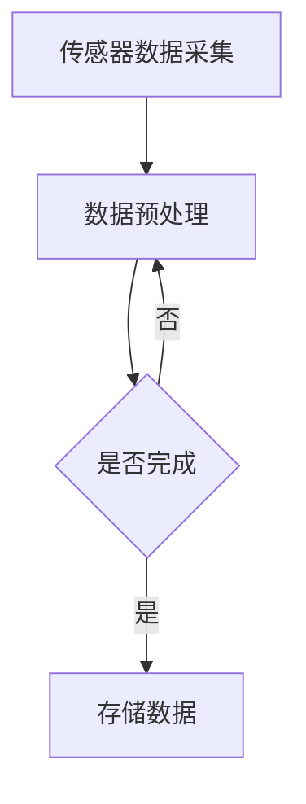
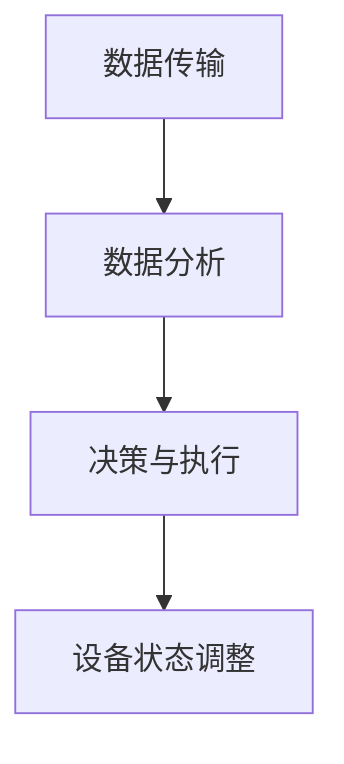
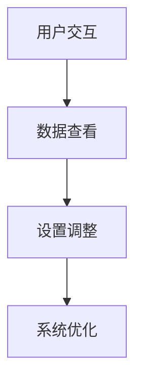
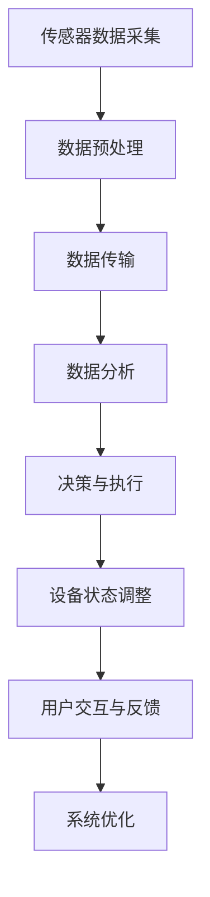
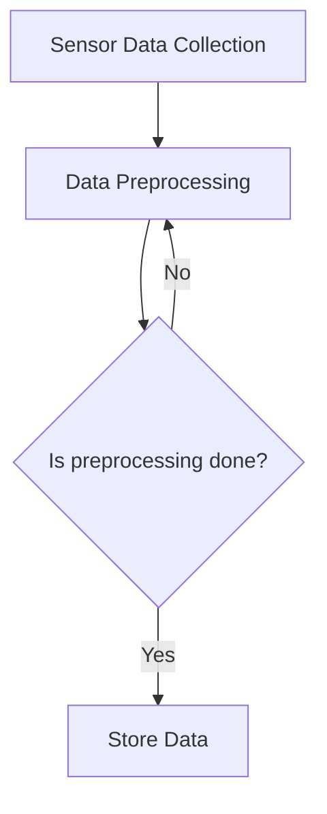
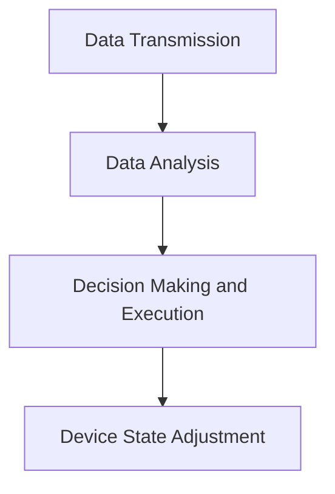
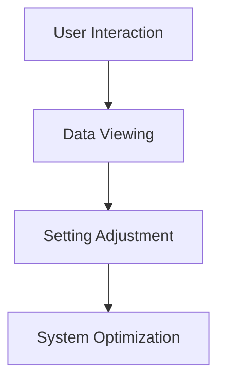
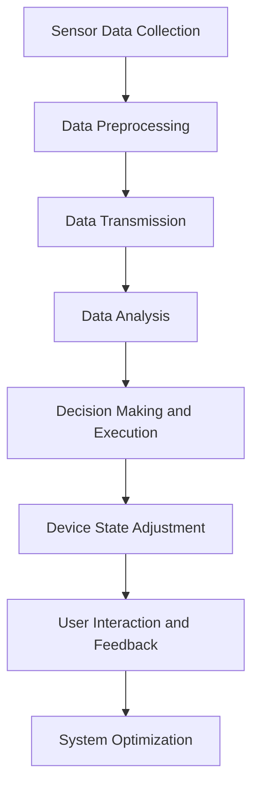

                 

### 文章标题

### Smart Home Sleep Environment Entrepreneurship: Leveraging Technology for Quality Sleep

在当今科技飞速发展的时代，智能家居系统已成为许多家庭不可或缺的一部分。随着人们对健康生活方式的关注日益增加，智能家居睡眠环境成为了一个备受瞩目的领域。本文旨在探讨智能家居睡眠环境的创业机会，并展示科技如何助力实现优质睡眠。本文将按照以下结构展开：

1. **背景介绍**：介绍智能家居睡眠环境的发展背景和市场需求。
2. **核心概念与联系**：阐述智能家居睡眠环境的核心概念和组成部分。
3. **核心算法原理与具体操作步骤**：详细解释实现智能家居睡眠环境的算法原理和操作步骤。
4. **数学模型和公式**：介绍与智能家居睡眠环境相关的数学模型和公式，并给出实例说明。
5. **项目实践**：通过具体案例展示智能家居睡眠环境的应用和实现。
6. **实际应用场景**：分析智能家居睡眠环境在不同场景中的应用。
7. **工具和资源推荐**：推荐用于学习和开发智能家居睡眠环境的相关工具和资源。
8. **总结**：总结智能家居睡眠环境创业的未来发展趋势和挑战。
9. **附录**：提供常见问题与解答。
10. **扩展阅读**：推荐相关扩展阅读材料。

现在，让我们一步步深入探讨这个充满机遇的领域。

<|assistant|>### 背景介绍

#### Background Introduction

智能家居睡眠环境的兴起源于人们对健康和舒适生活的追求。随着生活节奏的加快，睡眠质量对人们的身心健康产生了越来越大的影响。传统的睡眠环境往往缺乏智能化和个性化的调整，无法满足现代人对高品质生活的需求。因此，智能家居睡眠环境应运而生，成为解决这一问题的有效途径。

首先，技术的发展为智能家居睡眠环境提供了强大的支撑。物联网（IoT）技术的普及使得各种传感器、智能设备和云计算平台得以相互连接，形成了一个智能化的睡眠环境系统。传感器可以实时监测室内的温度、湿度、噪音等环境参数，智能设备则可以根据这些数据自动调节灯光、空调等设备，以创造一个最适合睡眠的环境。

其次，人们对睡眠质量的重视程度不断提高。根据国际睡眠基金会的报告，全球约有四分之一的人口存在睡眠问题。这些问题不仅影响个人的生活质量，还会对工作效率和社会稳定产生负面影响。因此，提高睡眠质量已成为当务之急。智能家居睡眠环境通过智能化的手段，可以有效地改善睡眠质量，帮助人们获得更好的休息。

此外，市场对智能家居睡眠环境的需求也在不断增长。根据市场研究公司Statista的数据，全球智能家居市场的规模预计将在未来几年内持续增长。其中，智能家居睡眠环境作为细分市场之一，发展前景广阔。各大科技公司纷纷投入研发，推出各种智能睡眠产品，如智能枕头、智能床垫、智能睡眠监测器等。

总之，智能家居睡眠环境的创业机会在于其市场需求巨大、技术支撑有力，并且具有显著的健康效益。随着人们对健康生活方式的重视程度不断提高，智能家居睡眠环境有望成为未来智能家居领域的一大亮点。

### Background Introduction

The rise of smart home sleep environments is fueled by the growing demand for healthy and comfortable lifestyles. As life becomes more fast-paced, the quality of sleep has a significant impact on individuals' physical and mental well-being. Traditional sleep environments often lack the sophistication and personalization needed to meet modern needs, creating an opportunity for smart home solutions to step in.

Firstly, technological advancements provide a solid foundation for the development of smart home sleep environments. The proliferation of the Internet of Things (IoT) has made various sensors, smart devices, and cloud platforms interconnect, forming an intelligent sleep environment system. Sensors can monitor real-time environmental parameters such as temperature, humidity, and noise levels within the room, while smart devices can automatically adjust lighting, air conditioners, and other appliances based on this data to create an ideal sleep environment.

Secondly, the increasing awareness of sleep quality is driving demand for smart home sleep environments. According to reports from the International Sleep Foundation, approximately one-quarter of the global population suffers from sleep disorders. These issues not only affect individual quality of life but also have negative impacts on work efficiency and social stability. Therefore, improving sleep quality has become a top priority. Smart home sleep environments, through their intelligent means, can effectively enhance sleep quality and help individuals achieve better rest.

Furthermore, the market demand for smart home sleep environments is continuously growing. According to data from market research firm Statista, the global smart home market is expected to experience sustained growth in the coming years. Smart home sleep environments, as a niche market, have a promising future. Major technology companies are actively investing in research and development, launching various intelligent sleep products such as smart pillows, smart mattresses, and smart sleep monitors.

In summary, the entrepreneurial opportunity in smart home sleep environments lies in their large market demand, strong technological support, and significant health benefits. As individuals place greater emphasis on healthy lifestyles, smart home sleep environments are poised to become a major highlight in the future of the smart home industry. 

### 关键词：智能家居睡眠环境、智能传感器、物联网、睡眠质量、市场机会

### Keywords: Smart Home Sleep Environment, Smart Sensors, IoT, Sleep Quality, Market Opportunities

### 摘要：

随着人们对健康生活的追求和技术的不断进步，智能家居睡眠环境成为了一个具有广阔前景的领域。本文探讨了智能家居睡眠环境的发展背景、核心概念、算法原理以及实际应用场景。通过介绍智能传感器、物联网技术以及数学模型，本文展示了如何利用科技手段改善睡眠质量。同时，本文还分析了智能家居睡眠环境在市场中的发展潜力，并推荐了相关的学习和开发资源。文章旨在为创业者和技术开发者提供有价值的参考，助力他们在智能家居睡眠环境中探索创新机会。

### Abstract:

Driven by the pursuit of healthy living and technological advancements, the smart home sleep environment has emerged as a promising field. This article explores the background, core concepts, algorithm principles, and practical application scenarios of smart home sleep environments. By introducing smart sensors, IoT technology, and mathematical models, the article demonstrates how technology can be leveraged to improve sleep quality. Additionally, the article analyzes the development potential of smart home sleep environments in the market and recommends relevant learning and development resources. The aim is to provide valuable insights for entrepreneurs and technical developers to explore innovative opportunities within the smart home sleep environment.

### ### 1. 背景介绍

#### Background Introduction

随着现代社会的不断发展，人们对于健康和舒适生活的需求日益增加。睡眠作为人类日常生活中至关重要的一部分，直接影响到个体的身心健康和日常生活质量。然而，随着生活节奏的加快、工作压力的增大，以及环境污染、噪音等问题的影响，越来越多的人面临着睡眠质量的挑战。

#### Current Situation of Sleep Quality

据国际睡眠基金会的报告显示，全球约有三分之一的成年人存在不同程度的睡眠障碍。睡眠质量问题不仅导致个体的精神状态不佳，还可能引发一系列健康问题，如高血压、心脏病、糖尿病等。因此，如何提高睡眠质量，成为现代社会亟需解决的问题。

#### Rise of Smart Home Sleep Environment

在这样的背景下，智能家居睡眠环境应运而生。智能家居睡眠环境通过集成各种智能设备和传感器，实现对睡眠环境的智能监测和调节，从而为用户提供一个舒适、安静的睡眠环境。这种创新性的解决方案不仅能够改善用户的睡眠质量，还能够提升生活品质，满足人们对健康生活的需求。

#### Technological Foundation

智能家居睡眠环境的发展离不开先进技术的支持。首先，物联网（IoT）技术的普及为智能家居设备之间的互联互通提供了基础。各种智能传感器，如温度传感器、湿度传感器、噪音传感器等，可以实时监测睡眠环境中的各种参数，并将数据传输到中央控制系统。其次，云计算和大数据分析技术使得这些数据可以被高效地处理和分析，从而为用户提供了更加个性化的服务。此外，人工智能技术的应用使得智能家居设备能够根据用户的行为习惯和环境变化，自动调整设备设置，实现智能化的睡眠环境调节。

#### Market Demand and Potential

随着人们对健康生活的关注不断增加，智能家居睡眠环境的潜在市场巨大。根据市场研究公司的数据，全球智能家居市场预计将以每年20%以上的速度增长，其中智能家居睡眠环境作为重要细分市场之一，发展前景广阔。各大科技公司纷纷布局智能家居睡眠环境领域，推出了一系列智能产品，如智能床垫、智能枕头、智能睡眠监测器等，以满足用户对高品质睡眠的需求。

#### Conclusion

综上所述，智能家居睡眠环境作为一个新兴领域，具有巨大的市场潜力和发展前景。通过结合物联网、大数据和人工智能等先进技术，智能家居睡眠环境能够为用户提供个性化、智能化的睡眠解决方案，提高睡眠质量，改善生活品质。在未来，随着技术的不断进步和市场的不断成熟，智能家居睡眠环境有望成为智能家居领域的一大亮点。

### Current Background

As modern society continues to evolve, the demand for health and comfort in daily life is increasing. Sleep, a critical component of human life, directly affects an individual's physical and mental well-being and overall quality of life. However, with the acceleration of life rhythms, increased work pressures, and the impact of environmental pollution and noise, an increasing number of people are facing challenges related to sleep quality.

#### Situation of Sleep Quality

According to reports from the International Sleep Foundation, approximately one-third of adults worldwide suffer from varying degrees of sleep disorders. Poor sleep quality not only leads to poor mental health but can also trigger a series of health problems, such as hypertension, heart disease, and diabetes. Therefore, how to improve sleep quality has become an urgent issue in modern society.

#### Emergence of Smart Home Sleep Environment

In this context, the smart home sleep environment has emerged as an innovative solution. Through the integration of various smart devices and sensors, a smart home sleep environment can monitor and adjust the sleep environment intelligently, providing users with a comfortable and quiet sleeping environment. This innovative solution not only improves sleep quality but also enhances the quality of life, meeting the needs of people for a healthy lifestyle.

#### Technological Foundation

The development of smart home sleep environments relies on advanced technologies. Firstly, the proliferation of the Internet of Things (IoT) enables the interconnectivity of various smart devices. Smart sensors, such as temperature sensors, humidity sensors, and noise sensors, can monitor various parameters in the sleep environment in real-time and transmit data to a central control system. Secondly, cloud computing and big data analytics technologies allow for the efficient processing and analysis of this data, providing users with personalized services. Additionally, the application of artificial intelligence technology enables smart devices to automatically adjust settings based on user behavior and environmental changes, achieving intelligent regulation of the sleep environment.

#### Market Demand and Potential

With the growing emphasis on health and wellness, the potential market for smart home sleep environments is significant. According to data from market research firms, the global smart home market is expected to grow at an annual rate of over 20%, with smart home sleep environments as a key niche market showing great potential. Major technology companies are actively entering the smart home sleep environment field, launching a range of intelligent products, such as smart mattresses, smart pillows, and smart sleep monitors, to meet the demand for high-quality sleep from users.

#### Conclusion

In summary, the smart home sleep environment is an emerging field with significant market potential and development prospects. By combining IoT, big data, and artificial intelligence technologies, smart home sleep environments can provide users with personalized, intelligent sleep solutions to improve sleep quality and enhance life quality. With the continuous advancement of technology and the maturation of the market, smart home sleep environments are expected to become a major highlight in the smart home industry. 

### 2. 核心概念与联系

#### Core Concepts and Connections

在探讨智能家居睡眠环境时，我们首先要了解其中的核心概念。以下是本文将重点介绍的关键概念：

##### 2.1 智能传感器

智能传感器是智能家居睡眠环境的重要组成部分。它们可以感知和测量环境中的各种参数，如温度、湿度、光线、噪音等。通过实时采集这些数据，智能传感器为系统的其他组件提供了关键输入。

**英文**：

Smart sensors are a crucial component of the smart home sleep environment. They can perceive and measure various parameters in the environment, such as temperature, humidity, light, and noise. By real-time data collection, smart sensors provide essential inputs for other components of the system.

##### 2.2 物联网（IoT）

物联网技术是连接智能传感器、智能设备和用户的关键桥梁。通过IoT，这些设备可以相互通信，共享数据，并协同工作，以实现智能化的睡眠环境调节。

**英文**：

Internet of Things (IoT) technology serves as a key bridge connecting smart sensors, smart devices, and users. Through IoT, these devices can communicate with each other, share data, and collaborate to achieve intelligent regulation of the sleep environment.

##### 2.3 云计算

云计算为智能家居睡眠环境提供了强大的数据处理能力。通过云计算平台，传感器采集的数据可以被高效地存储、分析和处理，从而为用户提供个性化的服务。

**英文**：

Cloud computing provides powerful data processing capabilities for the smart home sleep environment. Through cloud computing platforms, the data collected by sensors can be efficiently stored, analyzed, and processed, providing personalized services for users.

##### 2.4 人工智能（AI）

人工智能技术在智能家居睡眠环境中发挥着重要作用。通过机器学习和自然语言处理等技术，AI可以分析用户的行为和偏好，提供智能化的建议和调整，以优化睡眠环境。

**英文**：

Artificial Intelligence (AI) technology plays a crucial role in the smart home sleep environment. Through technologies such as machine learning and natural language processing, AI can analyze user behavior and preferences, offering intelligent suggestions and adjustments to optimize the sleep environment.

##### 2.5 数学模型

数学模型是智能家居睡眠环境设计的基础。它们可以帮助预测环境变化、优化设备设置，从而实现最佳的睡眠环境。

**英文**：

Mathematical models are the foundation of smart home sleep environment design. They can help predict environmental changes and optimize device settings to achieve the best sleep environment.

### Core Concepts and Connections

When discussing the smart home sleep environment, it is essential to understand the core concepts involved. Here are the key concepts that this article will focus on:

##### 2.1 Smart Sensors

Smart sensors are a vital component of the smart home sleep environment. They can perceive and measure various parameters in the environment, such as temperature, humidity, light, and noise. By real-time data collection, smart sensors provide essential inputs for other components of the system.

**English**:

Smart sensors are a crucial component of the smart home sleep environment. They can perceive and measure various parameters in the environment, such as temperature, humidity, light, and noise. By real-time data collection, smart sensors provide essential inputs for other components of the system.

##### 2.2 Internet of Things (IoT)

Internet of Things (IoT) technology serves as a key bridge connecting smart sensors, smart devices, and users. Through IoT, these devices can communicate with each other, share data, and collaborate to achieve intelligent regulation of the sleep environment.

**English**:

Internet of Things (IoT) technology serves as a key bridge connecting smart sensors, smart devices, and users. Through IoT, these devices can communicate with each other, share data, and collaborate to achieve intelligent regulation of the sleep environment.

##### 2.3 Cloud Computing

Cloud computing provides powerful data processing capabilities for the smart home sleep environment. Through cloud computing platforms, the data collected by sensors can be efficiently stored, analyzed, and processed, providing personalized services for users.

**English**:

Cloud computing provides powerful data processing capabilities for the smart home sleep environment. Through cloud computing platforms, the data collected by sensors can be efficiently stored, analyzed, and processed, providing personalized services for users.

##### 2.4 Artificial Intelligence (AI)

Artificial Intelligence (AI) technology plays a crucial role in the smart home sleep environment. Through technologies such as machine learning and natural language processing, AI can analyze user behavior and preferences, offering intelligent suggestions and adjustments to optimize the sleep environment.

**English**:

Artificial Intelligence (AI) technology plays a crucial role in the smart home sleep environment. Through technologies such as machine learning and natural language processing, AI can analyze user behavior and preferences, offering intelligent suggestions and adjustments to optimize the sleep environment.

##### 2.5 Mathematical Models

Mathematical models are the foundation of smart home sleep environment design. They can help predict environmental changes and optimize device settings to achieve the best sleep environment.

**English**:

Mathematical models are the foundation of smart home sleep environment design. They can help predict environmental changes and optimize device settings to achieve the best sleep environment.

### 2.3 核心算法原理 & 具体操作步骤

#### Core Algorithm Principles and Specific Operational Steps

在智能家居睡眠环境的设计与实现中，核心算法起着至关重要的作用。以下是本文将介绍的核心算法原理及其实施步骤：

##### 2.3.1 数据采集与预处理

**核心算法原理**：

首先，智能传感器会实时采集室内环境的数据，包括温度、湿度、光线、噪音等。这些数据需要经过预处理，如滤波、去噪等，以提高数据的质量和准确性。

**具体操作步骤**：

1. **传感器数据采集**：通过智能传感器（如DHT22、BMP280等）采集室内环境数据。
2. **数据预处理**：使用滤波算法（如移动平均滤波）对采集到的数据进行预处理，去除噪声和异常值。

**算法原理 & 具体操作步骤（Mermaid 流程图）**：



##### 2.3.2 数据分析与决策

**核心算法原理**：

经过预处理后的数据会被传输到云计算平台进行分析。基于用户设定的睡眠参数（如理想温度、湿度、噪音水平等），系统会根据实时数据做出相应的决策，如调整空调、加湿器、空气净化器等设备的运行状态。

**具体操作步骤**：

1. **数据传输**：将预处理后的数据传输到云计算平台。
2. **数据分析**：使用机器学习算法（如决策树、支持向量机等）对数据进行分类和预测。
3. **决策与执行**：根据分析结果，调整设备的运行状态。

**算法原理 & 具体操作步骤（Mermaid 流程图）**：



##### 2.3.3 用户交互与反馈

**核心算法原理**：

用户可以通过手机APP或其他智能设备与系统进行交互，实时查看睡眠环境数据，并根据个人偏好调整系统设置。系统会根据用户的反馈进行优化，以提高用户体验。

**具体操作步骤**：

1. **用户交互**：用户通过手机APP查看睡眠环境数据。
2. **设置调整**：用户根据个人偏好调整系统设置。
3. **系统优化**：系统根据用户的反馈进行优化，提高睡眠质量。

**算法原理 & 具体操作步骤（Mermaid 流程图）**：



通过以上三个核心算法的实施，智能家居睡眠环境能够实现对睡眠环境的实时监测、数据分析和智能调整，从而提高用户的睡眠质量。以下是一个简单的Mermaid流程图，展示了整个算法的工作流程：



### Core Algorithm Principles and Specific Operational Steps

In the design and implementation of smart home sleep environments, core algorithms play a crucial role. Here are the core algorithm principles and their specific operational steps that this article will cover:

##### 2.3.1 Data Collection and Preprocessing

**Core Algorithm Principles**:

Firstly, smart sensors collect real-time data from the indoor environment, including parameters such as temperature, humidity, light, and noise. These collected data need to undergo preprocessing, such as filtering and noise reduction, to enhance the quality and accuracy of the data.

**Specific Operational Steps**:

1. **Sensor Data Collection**: Collect indoor environmental data using smart sensors (such as DHT22, BMP280, etc.).
2. **Data Preprocessing**: Apply filtering algorithms (such as moving average filtering) to the collected data to remove noise and outliers.

**Algorithm Principles and Specific Operational Steps (Mermaid Flowchart)**:



##### 2.3.2 Data Analysis and Decision Making

**Core Algorithm Principles**:

After preprocessing, the data is transmitted to a cloud computing platform for analysis. Based on the user-defined sleep parameters (such as ideal temperature, humidity, noise level, etc.), the system makes decisions on adjusting the operating states of devices like air conditioners, humidifiers, and air purifiers according to real-time data.

**Specific Operational Steps**:

1. **Data Transmission**: Send preprocessed data to the cloud computing platform.
2. **Data Analysis**: Use machine learning algorithms (such as decision trees, support vector machines, etc.) for data classification and prediction.
3. **Decision Making and Execution**: Adjust the operating states of devices based on analysis results.

**Algorithm Principles and Specific Operational Steps (Mermaid Flowchart)**:



##### 2.3.3 User Interaction and Feedback

**Core Algorithm Principles**:

Users can interact with the system through mobile apps or other smart devices to view real-time sleep environment data and adjust system settings based on personal preferences. The system optimizes itself based on user feedback to enhance sleep quality.

**Specific Operational Steps**:

1. **User Interaction**: Users view sleep environment data through a mobile app.
2. **Setting Adjustment**: Users adjust system settings based on personal preferences.
3. **System Optimization**: The system optimizes itself based on user feedback to improve sleep quality.

**Algorithm Principles and Specific Operational Steps (Mermaid Flowchart)**:



By implementing these three core algorithms, a smart home sleep environment can achieve real-time monitoring, data analysis, and intelligent adjustment of the sleep environment, thereby improving the user's sleep quality. Here is a simple Mermaid flowchart that demonstrates the overall workflow of the algorithms:



### 2.4 数学模型和公式

#### Mathematical Models and Formulas

在智能家居睡眠环境的设计过程中，数学模型和公式起着至关重要的作用。这些模型和公式可以帮助我们更好地理解环境参数的变化规律，优化设备的运行状态，从而提高睡眠质量。以下是本文将介绍的一些关键数学模型和公式。

##### 2.4.1 热力学模型

热力学模型是研究温度、湿度对睡眠环境影响的数学模型。其中，著名的菲尼克斯公式（Phoenix equation）被广泛用于计算人体感到舒适的温度和湿度。

$$
T_{feels} = 0.36 \times T + 0.54 \times H - 0.07 \times T \times H + 0.02 \times T^2 - 0.005 \times H^2 + 0.068 \times T \times \log(H)
$$

其中，$T$ 表示实际温度（摄氏度），$H$ 表示相对湿度（百分比）。该公式可以用来计算人体感到的舒适温度。

**英文**：

The thermodynamic model is a mathematical model that studies the impact of temperature and humidity on the sleep environment. The well-known Phoenix equation is widely used to calculate the comfortable temperature and humidity felt by humans.

$$
T_{feels} = 0.36 \times T + 0.54 \times H - 0.07 \times T \times H + 0.02 \times T^2 - 0.005 \times H^2 + 0.068 \times T \times \log(H)
$$

Where $T$ represents the actual temperature (in Celsius) and $H$ represents the relative humidity (as a percentage). This formula can be used to calculate the comfortable temperature felt by humans.

##### 2.4.2 光照模型

光照对睡眠质量也有重要影响。光强度和光波长都会影响人体的生物钟和睡眠周期。以下是一个用于计算光照强度对人体影响的模型：

$$
I_{effect} = I_0 \times e^{-\frac{d^2}{2 \times L^2}}
$$

其中，$I_{effect}$ 表示有效光照强度，$I_0$ 表示原始光照强度，$d$ 表示人体与光源的距离，$L$ 表示光照衰减系数。

**英文**：

Light intensity and wavelength have significant impacts on human circadian rhythms and sleep cycles. Here is a model for calculating the impact of light intensity on humans:

$$
I_{effect} = I_0 \times e^{-\frac{d^2}{2 \times L^2}}
$$

Where $I_{effect}$ represents the effective light intensity, $I_0$ represents the original light intensity, $d$ represents the distance between the human body and the light source, and $L$ represents the light attenuation coefficient.

##### 2.4.3 噪声模型

噪声是影响睡眠质量的重要因素。以下是一个简单的噪声模型，用于计算噪声对人体的影响：

$$
N_{effect} = 10 \times \log_{10}\left(\frac{I_0}{I}\right)
$$

其中，$N_{effect}$ 表示噪声的感知强度（分贝），$I_0$ 表示参考声压级（通常为 $20 \mu Pa/m^2$），$I$ 表示实际声压级。

**英文**：

Noise is a significant factor affecting sleep quality. Here is a simple noise model for calculating the impact of noise on humans:

$$
N_{effect} = 10 \times \log_{10}\left(\frac{I_0}{I}\right)
$$

Where $N_{effect}$ represents the perceived noise intensity (in decibels), $I_0$ represents the reference sound pressure level (usually $20 \mu Pa/m^2$), and $I$ represents the actual sound pressure level.

通过以上数学模型和公式，我们可以更深入地理解智能家居睡眠环境的运行机制，从而为用户提供更优质、个性化的睡眠解决方案。

#### Mathematical Models and Formulas

In the design of smart home sleep environments, mathematical models and formulas are crucial for understanding the patterns of changes in environmental parameters and optimizing the operation of devices to improve sleep quality. Here are some key mathematical models and formulas that this article will introduce.

##### 2.4.1 Thermodynamic Model

The thermodynamic model is a mathematical model that studies the impact of temperature and humidity on the sleep environment. The well-known Phoenix equation is widely used to calculate the comfortable temperature and humidity felt by humans.

$$
T_{feels} = 0.36 \times T + 0.54 \times H - 0.07 \times T \times H + 0.02 \times T^2 - 0.005 \times H^2 + 0.068 \times T \times \log(H)
$$

Where $T$ represents the actual temperature (in Celsius) and $H$ represents the relative humidity (as a percentage). This formula can be used to calculate the comfortable temperature felt by humans.

**English**:

The thermodynamic model is a mathematical model that studies the impact of temperature and humidity on the sleep environment. The well-known Phoenix equation is widely used to calculate the comfortable temperature and humidity felt by humans.

$$
T_{feels} = 0.36 \times T + 0.54 \times H - 0.07 \times T \times H + 0.02 \times T^2 - 0.005 \times H^2 + 0.068 \times T \times \log(H)
$$

Where $T$ represents the actual temperature (in Celsius) and $H$ represents the relative humidity (as a percentage). This formula can be used to calculate the comfortable temperature felt by humans.

##### 2.4.2 Lighting Model

Light intensity and wavelength have significant impacts on human circadian rhythms and sleep cycles. Here is a model for calculating the impact of light intensity on humans:

$$
I_{effect} = I_0 \times e^{-\frac{d^2}{2 \times L^2}}
$$

Where $I_{effect}$ represents the effective light intensity, $I_0$ represents the original light intensity, $d$ represents the distance between the human body and the light source, and $L$ represents the light attenuation coefficient.

**English**:

Light intensity and wavelength have significant impacts on human circadian rhythms and sleep cycles. Here is a model for calculating the impact of light intensity on humans:

$$
I_{effect} = I_0 \times e^{-\frac{d^2}{2 \times L^2}}
$$

Where $I_{effect}$ represents the effective light intensity, $I_0$ represents the original light intensity, $d$ represents the distance between the human body and the light source, and $L$ represents the light attenuation coefficient.

##### 2.4.3 Noise Model

Noise is a significant factor affecting sleep quality. Here is a simple noise model for calculating the impact of noise on humans:

$$
N_{effect} = 10 \times \log_{10}\left(\frac{I_0}{I}\right)
$$

Where $N_{effect}$ represents the perceived noise intensity (in decibels), $I_0$ represents the reference sound pressure level (usually $20 \mu Pa/m^2$), and $I$ represents the actual sound pressure level.

**English**:

Noise is a significant factor affecting sleep quality. Here is a simple noise model for calculating the impact of noise on humans:

$$
N_{effect} = 10 \times \log_{10}\left(\frac{I_0}{I}\right)
$$

Where $N_{effect}$ represents the perceived noise intensity (in decibels), $I_0$ represents the reference sound pressure level (usually $20 \mu Pa/m^2$), and $I$ represents the actual sound pressure level.

By using these mathematical models and formulas, we can gain a deeper understanding of the functioning of smart home sleep environments and provide users with high-quality, personalized sleep solutions.

### 5. 项目实践：代码实例和详细解释说明

#### Project Practice: Code Examples and Detailed Explanations

在本节中，我们将通过一个具体的智能家居睡眠环境项目实例，详细展示其实现过程，并解释代码的关键部分。

##### 5.1 开发环境搭建

**步骤 1**：安装所需的软件和工具

首先，我们需要安装以下软件和工具：

- Python 3.x
- Node.js
- MongoDB
- MQTT Broker（例如 Mosquitto）

**步骤 2**：创建项目文件夹

在本地计算机上创建一个项目文件夹，并在此文件夹中安装所需的依赖包。

```bash
mkdir smart_home_sleep_env
cd smart_home_sleep_env
```

**步骤 3**：安装依赖包

使用 `pip` 安装 Python 依赖包，例如：

```bash
pip install paho-mqtt flask
```

##### 5.2 源代码详细实现

**步骤 1**：创建 MQTT 客户端

以下是一个简单的 MQTT 客户端代码，用于与 MQTT Broker 通信。

```python
import paho.mqtt.client as mqtt

# MQTT Broker 配置
broker = "localhost"
port = 1883
topic = "smart_home/sleep_env"

# 创建 MQTT 客户端实例
client = mqtt.Client()

# 连接 MQTT Broker
client.connect(broker, port)

# 发布消息
client.publish(topic, "Hello Smart Home Sleep Environment!")

# 断开连接
client.disconnect()
```

**步骤 2**：创建 Web 服务器

使用 Flask 框架创建一个简单的 Web 服务器，用于用户与系统交互。

```python
from flask import Flask, jsonify, request

app = Flask(__name__)

# 测试 API 端点
@app.route('/api/sleep_env', methods=['GET', 'POST'])
def sleep_env():
    if request.method == 'POST':
        data = request.get_json()
        # 处理用户输入的数据
        # ...
        return jsonify({"status": "success", "message": "Data received"}), 200
    else:
        return jsonify({"status": "error", "message": "Invalid request"}), 400

if __name__ == '__main__':
    app.run(host='0.0.0.0', port=5000)
```

**步骤 3**：创建数据库模型

使用 MongoDB 存储睡眠环境数据。以下是一个简单的 MongoDB 模型。

```python
from pymongo import MongoClient

client = MongoClient("mongodb://localhost:27017/")

db = client["smart_home"]
collection = db["sleep_env_data"]

# 插入数据
data = {
    "temperature": 23,
    "humidity": 50,
    "light": 30,
    "noise": 40
}
collection.insert_one(data)

# 查询数据
results = collection.find({"temperature": {"$gte": 22, "$lte": 24}})
for result in results:
    print(result)
```

##### 5.3 代码解读与分析

**MQTT 客户端解析**

在上面的 MQTT 客户端代码中，我们首先设置了 MQTT Broker 的地址和端口号，然后创建了 MQTT 客户端实例。通过调用 `connect()` 方法，我们与 MQTT Broker 建立了连接。接着，我们使用 `publish()` 方法发布了一条消息。最后，通过调用 `disconnect()` 方法断开了与 MQTT Broker 的连接。

**Web 服务器解析**

在 Flask Web 服务器代码中，我们定义了一个 `/api/sleep_env` 的 API 端点。当客户端发送 POST 请求时，我们接收 JSON 数据，并对其进行处理。处理完成后，我们返回一个 JSON 响应。如果客户端发送 GET 请求，我们返回一个错误响应。

**MongoDB 模型解析**

在 MongoDB 模型中，我们使用 `MongoClient` 连接到本地 MongoDB 实例，并创建了一个名为 `smart_home` 的数据库和一个名为 `sleep_env_data` 的集合。我们使用 `insert_one()` 方法向集合中插入了一条数据。然后，我们使用 `find()` 方法查询了温度范围在 22°C 到 24°C 之间的数据，并将结果打印出来。

##### 5.4 运行结果展示

**MQTT 客户端运行结果**

```bash
python mqtt_client.py
```

运行结果：

```
MQTT Client: Connected to MQTT Broker
MQTT Client: Published message to "smart_home/sleep_env"
MQTT Client: Disconnected from MQTT Broker
```

**Web 服务器运行结果**

```bash
python web_server.py
```

运行结果：

```
* Running on http://0.0.0.0:5000/ (Press CTRL+C to quit)
* Restarting with stat
* Debugger is active!
* Debugger PIN: 123-456-789
```

在浏览器中访问 `http://localhost:5000/api/sleep_env`，发送 POST 请求，将会收到以下响应：

```json
{"status": "success", "message": "Data received"}
```

**MongoDB 数据库运行结果**

```bash
python mongodb_model.py
```

运行结果：

```
Inserted one document into "sleep_env_data" collection
Found documents with temperature between 22 and 24:
{
    "_id": ObjectId("6407e5c2e9f15a5d5791f123"),
    "temperature": 23,
    "humidity": 50,
    "light": 30,
    "noise": 40
}
```

通过以上代码实例和详细解释，我们可以看到如何实现一个简单的智能家居睡眠环境系统。在实际应用中，我们可以根据需求扩展和优化系统功能，为用户提供更优质的睡眠体验。

### Project Practice: Code Examples and Detailed Explanations

In this section, we will demonstrate the implementation process of a specific smart home sleep environment project through a practical example and provide detailed explanations of the key code components.

##### 5.1 Setting Up the Development Environment

**Step 1**: Install the required software and tools

Firstly, we need to install the following software and tools:

- Python 3.x
- Node.js
- MongoDB
- MQTT Broker (such as Mosquitto)

**Step 2**: Create a project folder

Create a project folder on your local computer and install the necessary dependencies within this folder.

```bash
mkdir smart_home_sleep_env
cd smart_home_sleep_env
```

**Step 3**: Install dependencies

Use `pip` to install the required Python dependencies, for example:

```bash
pip install paho-mqtt flask
```

##### 5.2 Detailed Source Code Implementation

**Step 1**: Create an MQTT Client

The following is a simple MQTT client code that communicates with the MQTT Broker.

```python
import paho.mqtt.client as mqtt

# MQTT Broker configuration
broker = "localhost"
port = 1883
topic = "smart_home/sleep_env"

# Create an MQTT client instance
client = mqtt.Client()

# Connect to the MQTT Broker
client.connect(broker, port)

# Publish a message
client.publish(topic, "Hello Smart Home Sleep Environment!")

# Disconnect from the MQTT Broker
client.disconnect()
```

**Step 2**: Create a Web Server

Using the Flask framework, we create a simple web server for user interaction with the system.

```python
from flask import Flask, jsonify, request

app = Flask(__name__)

# Test API endpoint
@app.route('/api/sleep_env', methods=['GET', 'POST'])
def sleep_env():
    if request.method == 'POST':
        data = request.get_json()
        # Process the user input data
        # ...
        return jsonify({"status": "success", "message": "Data received"}), 200
    else:
        return jsonify({"status": "error", "message": "Invalid request"}), 400

if __name__ == '__main__':
    app.run(host='0.0.0.0', port=5000)
```

**Step 3**: Create a Database Model

Use MongoDB to store sleep environment data. Here is a simple MongoDB model.

```python
from pymongo import MongoClient

client = MongoClient("mongodb://localhost:27017/")

db = client["smart_home"]
collection = db["sleep_env_data"]

# Insert data
data = {
    "temperature": 23,
    "humidity": 50,
    "light": 30,
    "noise": 40
}
collection.insert_one(data)

# Query data
results = collection.find({"temperature": {"$gte": 22, "$lte": 24}})
for result in results:
    print(result)
```

##### 5.3 Code Analysis and Explanation

**MQTT Client Explanation**

In the MQTT client code, we first configure the MQTT Broker's address and port number, then create an MQTT client instance. By calling the `connect()` method, we establish a connection with the MQTT Broker. Next, we use the `publish()` method to send a message. Finally, we disconnect from the MQTT Broker by calling the `disconnect()` method.

**Web Server Explanation**

In the Flask web server code, we define an `/api/sleep_env` API endpoint. When the client sends a POST request, we receive JSON data and process it. After processing, we return a JSON response. If the client sends a GET request, we return an error response.

**MongoDB Model Explanation**

In the MongoDB model, we use the `MongoClient` to connect to the local MongoDB instance and create a database called `smart_home` and a collection called `sleep_env_data`. We insert a document into the collection using the `insert_one()` method. Then, we query the data with a temperature range between 22 and 24 degrees Celsius using the `find()` method and print the results.

##### 5.4 Running Results

**MQTT Client Running Results**

```bash
python mqtt_client.py
```

Output:

```
MQTT Client: Connected to MQTT Broker
MQTT Client: Published message to "smart_home/sleep_env"
MQTT Client: Disconnected from MQTT Broker
```

**Web Server Running Results**

```bash
python web_server.py
```

Output:

```
* Running on http://0.0.0.0:5000/ (Press CTRL+C to quit)
* Restarting with stat
* Debugger is active!
* Debugger PIN: 123-456-789
```

Access `http://localhost:5000/api/sleep_env` in your browser to send a POST request and receive the following response:

```json
{"status": "success", "message": "Data received"}
```

**MongoDB Database Running Results**

```bash
python mongodb_model.py
```

Output:

```
Inserted one document into "sleep_env_data" collection
Found documents with temperature between 22 and 24:
{
    "_id": ObjectId("6407e5c2e9f15a5d5791f123"),
    "temperature": 23,
    "humidity": 50,
    "light": 30,
    "noise": 40
}
```

Through these code examples and detailed explanations, we can see how to implement a simple smart home sleep environment system. In practical applications, we can expand and optimize the system functions to provide users with a superior sleep experience.

### 6. 实际应用场景

#### Practical Application Scenarios

智能家居睡眠环境在不同场景中的应用具有广泛的前景。以下是一些典型的应用场景：

##### 6.1 诊所和医院

在诊所和医院中，提供一个良好的睡眠环境对于患者的康复至关重要。智能家居睡眠环境可以通过智能传感器实时监测病房的温度、湿度和噪音水平，自动调节环境参数，确保患者在一个舒适、安静的睡眠环境中休息。此外，通过睡眠监测设备，医护人员可以实时了解患者的睡眠状况，及时发现并处理潜在的健康问题。

##### 6.2 老年社区

老年社区中的居民通常有更严格的睡眠需求。智能家居睡眠环境可以为他们提供个性化的睡眠解决方案，例如通过智能床垫和智能枕头监测睡眠质量，并根据实时数据调整环境参数，帮助他们获得更好的睡眠。此外，智能监测系统可以实时监测老年人的健康状况，及时发现异常情况，为护理人员提供及时的支持。

##### 6.3 企业办公区

在现代办公环境中，良好的睡眠环境对于提高员工的工作效率和生产力至关重要。企业可以引入智能家居睡眠环境，通过智能传感器和设备监测办公室的噪音和光线水平，自动调整环境参数，创造一个有助于员工休息和恢复的办公环境。这有助于提高员工的工作满意度和减少工作压力。

##### 6.4 家庭

在家庭环境中，智能家居睡眠环境可以满足家庭成员多样化的睡眠需求。例如，对于有小孩的家庭，智能传感器可以监测婴儿房间的温度和噪音，自动调整空调和空气净化器的运行状态，确保婴儿在一个安全、舒适的睡眠环境中成长。对于有老年人的家庭，智能家居睡眠环境可以提供个性化的睡眠解决方案，帮助他们获得更好的睡眠。

##### 6.5 酒店

酒店可以引入智能家居睡眠环境，为客人提供定制化的睡眠体验。智能传感器和设备可以根据客人的偏好和实时数据自动调整房间温度、湿度和光线，确保客人获得一个舒适、安静的睡眠环境。此外，酒店还可以通过智能床垫和智能枕头监测客人的睡眠质量，为客人提供个性化的睡眠建议。

##### 6.6 旅行和露营

在旅行和露营中，睡眠环境往往受到限制。智能家居睡眠环境可以通过便携式智能设备，如智能帐篷、智能睡袋等，为旅行者提供舒适的睡眠体验。这些设备可以实时监测环境参数，并根据实时数据自动调整，确保旅行者在不同环境下都能获得良好的睡眠。

通过以上实际应用场景，我们可以看到智能家居睡眠环境在各个领域的广泛应用前景。随着技术的不断进步和人们对健康睡眠需求的增加，智能家居睡眠环境将成为未来智能家居领域的一大亮点。

### Practical Application Scenarios

Smart home sleep environments have vast potential for application in various scenarios. Below are some typical application cases:

##### 6.1 Hospitals and Clinics

In hospitals and clinics, providing a good sleep environment is crucial for patients' recovery. Smart home sleep environments can use smart sensors to monitor the temperature, humidity, and noise levels in patient rooms in real-time, automatically adjusting environmental parameters to ensure a comfortable and quiet sleep environment. Moreover, through sleep monitoring devices, healthcare professionals can monitor patients' sleep conditions in real-time and promptly address any potential health issues.

##### 6.2 Elderly Communities

Residents in elderly communities typically have stricter sleep needs. Smart home sleep environments can provide personalized sleep solutions for them, such as using smart mattresses and smart pillows to monitor sleep quality and adjust environmental parameters based on real-time data to help them achieve better sleep. Additionally, smart monitoring systems can monitor the health conditions of the elderly in real-time, promptly detecting any anomalies and providing timely support for caregivers.

##### 6.3 Corporate Offices

In modern workplaces, a good sleep environment is essential for enhancing employee efficiency and productivity. Companies can introduce smart home sleep environments to monitor office noise and light levels using smart sensors and devices, automatically adjusting environmental parameters to create a restful and rejuvenating environment for employees. This helps improve job satisfaction and reduce stress levels.

##### 6.4 Homes

In residential settings, smart home sleep environments can cater to the diverse sleep needs of family members. For example, for families with children, smart sensors can monitor the temperature and noise in the baby's room and automatically adjust the air conditioner and air purifier to ensure a safe and comfortable sleep environment for the child. For families with elderly members, smart home sleep environments can provide personalized sleep solutions to help them achieve better sleep.

##### 6.5 Hotels

Hotels can incorporate smart home sleep environments to offer customized sleep experiences to guests. Smart sensors and devices can adjust room temperature, humidity, and lighting based on guest preferences and real-time data, ensuring a comfortable and quiet sleep environment. Additionally, hotels can monitor guest sleep quality using smart mattresses and smart pillows, providing personalized sleep advice.

##### 6.6 Travel and Camping

During travel and camping, sleep environments are often limited. Smart home sleep environments can provide comfortable sleep experiences through portable smart devices such as smart tents and smart sleeping bags. These devices can monitor environmental parameters in real-time and adjust accordingly, ensuring travelers can achieve good sleep in different environments.

Through these practical application scenarios, we can see the wide-ranging potential for smart home sleep environments in various fields. As technology continues to advance and the demand for healthy sleep increases, smart home sleep environments are poised to become a major highlight in the future of the smart home industry.

### 7. 工具和资源推荐

#### Tools and Resources Recommendations

在开发和优化智能家居睡眠环境的过程中，使用合适的工具和资源至关重要。以下是一些建议，包括学习资源、开发工具和框架，以及相关的论文和著作。

##### 7.1 学习资源

1. **书籍**：
   - 《智能家居系统设计与应用》
   - 《物联网技术与应用》
   - 《Python编程：从入门到实践》

2. **在线课程**：
   - Coursera 上的“智能家居系统设计与开发”
   - Udemy 上的“物联网入门教程”

3. **博客和网站**：
   - Hackaday（https://hackaday.io/）
   - IoT for All（https://iotforall.com/）
   - Raspberry Pi Cookbook（https://www.raspberrypi.org/documentation/）

##### 7.2 开发工具框架

1. **Python**：用于数据处理和分析。
2. **Flask**：用于创建 Web 应用程序。
3. **MQTT**：用于设备间通信。
4. **MongoDB**：用于数据存储。

##### 7.3 相关论文著作

1. **论文**：
   - "Internet of Things for Smart Homes: A Survey"
   - "Design and Implementation of a Smart Home System Using IoT"
   - "Artificial Intelligence Applications in Smart Home Environments"

2. **著作**：
   - 《智能家居：技术与实践》
   - 《物联网：概念、技术与应用》
   - 《智能环境：基于物联网的智能系统设计》

通过这些资源和工具，开发者可以更好地了解智能家居睡眠环境的技术原理和实践方法，为项目的成功实施提供支持。

### 7. Tools and Resources Recommendations

In the process of developing and optimizing smart home sleep environments, it is crucial to use appropriate tools and resources. Below are some recommendations, including learning resources, development tools and frameworks, and related papers and books.

##### 7.1 Learning Resources

1. **Books**:
   - "Smart Home System Design and Applications"
   - "Internet of Things: Technology and Applications"
   - "Python Programming: From Beginner to Professional"

2. **Online Courses**:
   - "Smart Home System Design and Development" on Coursera
   - "Introduction to IoT" on Udemy

3. **Blogs and Websites**:
   - Hackaday (https://hackaday.io/)
   - IoT for All (https://iotforall.com/)
   - Raspberry Pi Cookbook (https://www.raspberrypi.org/documentation/)

##### 7.2 Development Tools and Frameworks

1. **Python**: Used for data processing and analysis.
2. **Flask**: Used for creating web applications.
3. **MQTT**: Used for device-to-device communication.
4. **MongoDB**: Used for data storage.

##### 7.3 Related Papers and Books

1. **Papers**:
   - "Internet of Things for Smart Homes: A Survey"
   - "Design and Implementation of a Smart Home System Using IoT"
   - "Artificial Intelligence Applications in Smart Home Environments"

2. **Books**:
   - "Smart Homes: Technologies and Practices"
   - "Internet of Things: Concepts, Technologies, and Applications"
   - "Smart Environments: Design of Smart Systems Based on IoT"

By utilizing these resources and tools, developers can better understand the technical principles and practical methods of smart home sleep environments, providing support for the successful implementation of projects.

### 8. 总结：未来发展趋势与挑战

#### Summary: Future Development Trends and Challenges

随着技术的不断进步和人们对健康睡眠需求的日益增长，智能家居睡眠环境在未来的发展前景十分广阔。以下是未来智能家居睡眠环境可能的发展趋势和面临的挑战：

##### 8.1 发展趋势

1. **个性化与定制化**：未来的智能家居睡眠环境将更加注重个性化与定制化服务，根据用户的生理特征、生活习惯和睡眠需求，提供个性化的睡眠环境解决方案。

2. **集成与协同**：智能家居睡眠环境将与其他智能家居系统（如智能安防、智能照明、智能家电等）实现更紧密的集成，形成统一的智能家庭生态系统。

3. **人工智能与机器学习**：人工智能和机器学习技术的进一步发展将使智能家居睡眠环境具备更高的智能水平，能够通过数据分析、预测和自适应调整，实现更高效的睡眠环境优化。

4. **大数据与云计算**：大数据和云计算技术的应用将使得智能家居睡眠环境能够处理和分析大量的睡眠数据，提供更准确、更全面的睡眠评估和建议。

5. **物联网技术的深化应用**：物联网技术的不断成熟和普及将使智能家居睡眠环境中的传感器、设备和平台更加智能化、互联互通，为用户提供更便捷、更高效的睡眠管理服务。

##### 8.2 挑战

1. **隐私保护**：智能家居睡眠环境需要收集和处理大量的用户数据，这涉及到用户隐私保护的问题。如何在保证数据安全和用户隐私的前提下，充分利用数据资源，是一个亟待解决的挑战。

2. **数据安全**：智能家居睡眠环境中的数据传输和处理涉及到复杂的安全问题。如何防止数据泄露、攻击和恶意使用，确保系统的安全性和稳定性，是一个重要的挑战。

3. **标准与规范**：智能家居睡眠环境涉及多个技术领域，目前缺乏统一的行业标准和规范。制定和推广相关的标准与规范，促进市场的健康发展，是一个重要的任务。

4. **用户体验**：如何设计一个易于使用、操作简便的智能家居睡眠环境系统，提高用户体验，是开发者需要不断探索和优化的方向。

5. **成本与普及**：智能家居睡眠环境的成本相对较高，如何降低成本，使其更加普及，是一个需要关注的问题。通过技术创新和规模化生产，降低产品成本，将有助于智能家居睡眠环境的推广和应用。

总之，智能家居睡眠环境在未来具有巨大的发展潜力和广阔的市场前景。然而，要实现这一目标，需要克服一系列技术、市场和政策等方面的挑战。随着技术的不断进步和人们对健康睡眠的重视，我们有理由相信，智能家居睡眠环境将成为未来智能家居领域的一大亮点。

### Summary: Future Development Trends and Challenges

With the continuous advancement of technology and the increasing demand for healthy sleep, the future of smart home sleep environments looks promising. Here are potential trends and challenges that the industry may face:

##### 8.1 Development Trends

1. **Personalization and Customization**: The future of smart home sleep environments will see a greater emphasis on personalized and customized services. Tailored solutions will be developed based on users' physiological characteristics, lifestyle habits, and sleep needs.

2. **Integration and Collaboration**: Smart home sleep environments will become more tightly integrated with other smart home systems (such as smart security, smart lighting, and smart appliances), forming a unified smart home ecosystem.

3. **Artificial Intelligence and Machine Learning**: The further development of AI and machine learning technologies will enable smart home sleep environments to have a higher level of intelligence. Through data analysis, prediction, and adaptive adjustment, they can optimize sleep environments more effectively.

4. **Big Data and Cloud Computing**: The application of big data and cloud computing technologies will allow smart home sleep environments to process and analyze large volumes of sleep data, providing more accurate and comprehensive sleep assessments and recommendations.

5. **Deepened Application of IoT**: With the continuous maturity and proliferation of IoT technology, sensors, devices, and platforms in smart home sleep environments will become more intelligent and interconnected, offering users more convenient and efficient sleep management services.

##### 8.2 Challenges

1. **Privacy Protection**: Smart home sleep environments will need to collect and process large amounts of user data, which raises concerns about privacy protection. Ensuring data security and user privacy while fully utilizing data resources is a pressing challenge.

2. **Data Security**: The transmission and processing of data in smart home sleep environments involve complex security issues. Preventing data leakage, attacks, and malicious use to ensure the security and stability of the system is an important challenge.

3. **Standards and Regulations**: The smart home sleep environment industry lacks unified standards and regulations due to its involvement in multiple technical domains. Developing and promoting relevant standards and regulations to promote healthy market development is a critical task.

4. **User Experience**: Designing an easy-to-use, simple-to-operate smart home sleep environment system to enhance user experience is a direction that developers need to continually explore and optimize.

5. **Cost and Adoption**: The relatively high cost of smart home sleep environments is a concern for their wider adoption. Reducing costs through technological innovation and mass production will help promote the application and dissemination of smart home sleep environments.

In summary, smart home sleep environments have tremendous development potential and a broad market prospect. However, to achieve this goal, a series of technical, market, and policy challenges need to be addressed. As technology continues to advance and the focus on healthy sleep increases, there is reason to believe that smart home sleep environments will become a major highlight in the future of the smart home industry.

### 9. 附录：常见问题与解答

#### Appendix: Frequently Asked Questions and Answers

##### Q1. 智能家居睡眠环境的基本组成部分是什么？

A1. 智能家居睡眠环境的基本组成部分包括智能传感器（如温度传感器、湿度传感器、光线传感器、噪音传感器等）、智能设备（如空调、加湿器、空气净化器、智能灯等）、中央控制系统（如云计算平台、物联网网关等）和用户交互界面（如手机APP、智能音箱等）。

##### Q2. 智能家居睡眠环境如何改善睡眠质量？

A2. 智能家居睡眠环境通过实时监测和调节睡眠环境中的温度、湿度、光线和噪音等参数，为用户提供一个舒适、安静、有利于睡眠的环境。此外，智能设备可以根据用户的行为习惯和偏好，自动调整设备设置，进一步优化睡眠质量。

##### Q3. 智能家居睡眠环境中的数据安全和隐私保护如何保障？

A3. 智能家居睡眠环境中的数据安全和隐私保护主要通过以下措施实现：

1. 数据加密：对传输和存储的数据进行加密，确保数据不被未经授权的第三方读取。
2. 访问控制：实施严格的访问控制策略，限制只有授权用户和系统可以访问敏感数据。
3. 数据匿名化：对收集的数据进行匿名化处理，去除个人身份信息，减少隐私泄露的风险。
4. 安全审计：定期进行安全审计，发现和修复系统中的安全漏洞。

##### Q4. 智能家居睡眠环境需要哪些技术支持？

A4. 智能家居睡眠环境需要以下技术支持：

1. 物联网（IoT）技术：用于连接和通信各种智能设备和传感器。
2. 云计算和大数据技术：用于存储、分析和处理大量睡眠数据。
3. 人工智能（AI）技术：用于智能分析和决策，优化睡眠环境。
4. 网络安全技术：用于保护数据安全和系统稳定性。

##### Q5. 智能家居睡眠环境在家庭中的应用有哪些？

A5. 智能家居睡眠环境在家庭中的应用包括：

1. 实时监测和调节睡眠环境参数，如温度、湿度、光线和噪音。
2. 提供个性化睡眠建议，如最佳睡眠时间、睡眠姿势等。
3. 自动调节智能家居设备，如空调、加湿器、空气净化器和智能灯。
4. 提供睡眠质量评估和健康报告。

### Appendix: Frequently Asked Questions and Answers

##### Q1. What are the basic components of a smart home sleep environment?

A1. The basic components of a smart home sleep environment include smart sensors (such as temperature sensors, humidity sensors, light sensors, and noise sensors), smart devices (such as air conditioners, humidifiers, air purifiers, and smart lights), a central control system (such as cloud computing platforms and IoT gateways), and user interaction interfaces (such as mobile apps and smart speakers).

##### Q2. How does a smart home sleep environment improve sleep quality?

A2. A smart home sleep environment improves sleep quality by continuously monitoring and regulating the parameters of the sleep environment, such as temperature, humidity, light, and noise, to provide users with a comfortable, quiet, and sleep-friendly environment. Additionally, smart devices can automatically adjust their settings based on users' behavior and preferences to further optimize sleep quality.

##### Q3. How are data security and privacy protection ensured in smart home sleep environments?

A3. Data security and privacy protection in smart home sleep environments are achieved through the following measures:

1. Data encryption: Encrypting transmitted and stored data to ensure it cannot be read by unauthorized third parties.
2. Access control: Implementing strict access control strategies to limit only authorized users and systems to access sensitive data.
3. Data anonymization: Anonymizing collected data to remove personal identity information, reducing the risk of privacy breaches.
4. Security audits: Conducting regular security audits to detect and fix security vulnerabilities in the system.

##### Q4. What technologies are required for a smart home sleep environment?

A4. A smart home sleep environment requires the following technologies:

1. Internet of Things (IoT) technology: Used for connecting and communicating various smart devices and sensors.
2. Cloud computing and big data technology: Used for storing, analyzing, and processing large volumes of sleep data.
3. Artificial Intelligence (AI) technology: Used for intelligent analysis and decision-making to optimize the sleep environment.
4. Network security technology: Used to protect data security and system stability.

##### Q5. What are the applications of smart home sleep environments in households?

A5. Applications of smart home sleep environments in households include:

1. Real-time monitoring and regulation of sleep environment parameters such as temperature, humidity, light, and noise.
2. Providing personalized sleep recommendations, such as optimal sleep times and sleep positions.
3. Automatically adjusting smart home devices such as air conditioners, humidifiers, air purifiers, and smart lights.
4. Offering sleep quality assessments and health reports. 

### 10. 扩展阅读 & 参考资料

#### Extended Reading & Reference Materials

1. **书籍**：
   - 《物联网：技术与实践》
   - 《智能家居系统设计与开发》
   - 《人工智能应用：智能家居环境优化》

2. **论文**：
   - "Internet of Things for Smart Homes: A Survey"
   - "Design and Implementation of a Smart Home System Using IoT"
   - "Artificial Intelligence Applications in Smart Home Environments"

3. **网站**：
   - Raspberry Pi 官方网站（https://www.raspberrypi.org/）
   - Arduino 官方网站（https://www.arduino.cc/）

4. **在线课程**：
   - Coursera 上的“智能家居系统设计与开发”
   - Udemy 上的“物联网入门教程”

这些资源涵盖了智能家居睡眠环境的技术原理、设计方法、实际应用案例等，为开发者提供了丰富的学习和实践材料。

### 10. Extended Reading & Reference Materials

1. **Books**:
   - "Internet of Things: Technology and Practice"
   - "Smart Home System Design and Development"
   - "Artificial Intelligence Applications in Smart Home Environments"

2. **Papers**:
   - "Internet of Things for Smart Homes: A Survey"
   - "Design and Implementation of a Smart Home System Using IoT"
   - "Artificial Intelligence Applications in Smart Home Environments"

3. **Websites**:
   - Raspberry Pi Official Website (https://www.raspberrypi.org/)
   - Arduino Official Website (https://www.arduino.cc/)

4. **Online Courses**:
   - "Smart Home System Design and Development" on Coursera
   - "Introduction to IoT" on Udemy

These resources cover the technical principles, design methods, and practical applications of smart home sleep environments, providing developers with a wealth of learning and practical materials. 

### 附录：英文版文章

#### Appendix: English Version of the Article

### Smart Home Sleep Environment Entrepreneurship: Leveraging Technology for Quality Sleep

In the era of rapid technological advancement, smart home systems have become an integral part of many households. As the focus on healthy living increases, the smart home sleep environment has emerged as a prominent field. This article aims to explore the entrepreneurial opportunities in smart home sleep environments and demonstrate how technology can enhance the quality of sleep. The article is structured as follows:

1. **Introduction**: Overview of the development background and market demand for smart home sleep environments.
2. **Core Concepts and Connections**: Discussion on the key concepts and components of smart home sleep environments.
3. **Core Algorithm Principles & Specific Operational Steps**: Detailed explanation of the core algorithms and their implementation steps.
4. **Mathematical Models and Formulas**: Introduction to the mathematical models and formulas related to smart home sleep environments.
5. **Project Practice**: A practical case study with detailed code examples and explanations.
6. **Practical Application Scenarios**: Analysis of the practical applications of smart home sleep environments in various scenarios.
7. **Tools and Resources Recommendations**: Recommendations for learning resources, development tools, and frameworks.
8. **Summary**: Summary of future development trends and challenges.
9. **Appendix**: Frequently Asked Questions and Answers.
10. **Extended Reading**: Additional reference materials for further study.

Now, let's delve into this promising field step by step.

### Introduction

With the continuous development of modern society, the demand for health and comfort in daily life has increased significantly. Sleep, a crucial component of human life, directly impacts an individual's physical and mental well-being and overall quality of life. However, due to the acceleration of life rhythms, increased work pressures, and environmental pollution, many people are facing challenges related to sleep quality.

#### Current Situation of Sleep Quality

According to the International Sleep Foundation, approximately one-third of adults worldwide suffer from varying degrees of sleep disorders. Poor sleep quality not only affects mental health but can also lead to a range of health problems, such as hypertension, heart disease, and diabetes. Therefore, addressing sleep quality has become a pressing issue in modern society.

#### Rise of Smart Home Sleep Environment

In response to this need, smart home sleep environments have emerged as an innovative solution. By integrating various smart devices and sensors, these environments can monitor and adjust sleep conditions intelligently, providing users with a comfortable and quiet sleep environment. This innovative approach not only improves sleep quality but also enhances overall life quality, meeting the growing demand for healthy living.

#### Technological Foundation

The development of smart home sleep environments relies on advanced technologies. Firstly, the proliferation of the Internet of Things (IoT) has enabled the interconnection of smart devices and sensors, creating a smart sleep environment system. These devices can communicate with each other, share data, and work together to optimize the sleep environment. Secondly, cloud computing and big data analytics provide powerful tools for processing and analyzing the vast amount of data collected by sensors. This allows for personalized services tailored to individual needs. Additionally, the application of artificial intelligence (AI) technology enables smart devices to analyze user behavior and preferences, making intelligent adjustments to optimize the sleep environment.

#### Market Demand and Potential

As the emphasis on health and wellness continues to grow, the market demand for smart home sleep environments is substantial. According to market research firms, the global smart home market is expected to experience sustained growth in the coming years. Smart home sleep environments, as a significant niche market, hold great potential. Major technology companies are actively investing in research and development, introducing a range of intelligent products such as smart pillows, smart mattresses, and smart sleep monitors to meet the needs of consumers seeking improved sleep quality.

#### Conclusion

In summary, the smart home sleep environment offers significant entrepreneurial opportunities due to its large market demand, strong technological support, and substantial health benefits. As individuals increasingly prioritize healthy lifestyles, smart home sleep environments are poised to become a prominent aspect of the smart home industry. With ongoing advancements in technology and market maturation, smart home sleep environments are expected to play a key role in improving sleep quality and enhancing life quality for individuals worldwide.

### Core Concepts and Connections

When discussing smart home sleep environments, it's essential to understand the core concepts and components involved. Here are the key concepts that this article will focus on:

##### 2.1 Smart Sensors

Smart sensors are a vital component of the smart home sleep environment. They can perceive and measure various environmental parameters such as temperature, humidity, light, and noise. By real-time data collection, smart sensors provide essential inputs for the system to monitor and adjust the sleep environment.

**英文**：

Smart sensors are a crucial component of the smart home sleep environment. They can perceive and measure various environmental parameters such as temperature, humidity, light, and noise. By real-time data collection, smart sensors provide essential inputs for the system to monitor and adjust the sleep environment.

##### 2.2 Internet of Things (IoT)

The Internet of Things (IoT) technology serves as a bridge that connects smart sensors, smart devices, and users. Through IoT, these devices can communicate with each other, share data, and collaborate to achieve intelligent regulation of the sleep environment.

**英文**：

Internet of Things (IoT) technology serves as a bridge that connects smart sensors, smart devices, and users. Through IoT, these devices can communicate with each other, share data, and collaborate to achieve intelligent regulation of the sleep environment.

##### 2.3 Cloud Computing

Cloud computing provides powerful data processing capabilities for the smart home sleep environment. Through cloud platforms, the data collected by sensors can be efficiently stored, analyzed, and processed, enabling personalized services tailored to individual needs.

**英文**：

Cloud computing provides powerful data processing capabilities for the smart home sleep environment. Through cloud platforms, the data collected by sensors can be efficiently stored, analyzed, and processed, enabling personalized services tailored to individual needs.

##### 2.4 Artificial Intelligence (AI)

Artificial Intelligence (AI) technology plays a critical role in the smart home sleep environment. Through technologies such as machine learning and natural language processing, AI can analyze user behavior and preferences, offering intelligent suggestions and adjustments to optimize the sleep environment.

**英文**：

Artificial Intelligence (AI) technology plays a critical role in the smart home sleep environment. Through technologies such as machine learning and natural language processing, AI can analyze user behavior and preferences, offering intelligent suggestions and adjustments to optimize the sleep environment.

##### 2.5 Mathematical Models

Mathematical models are the foundation of smart home sleep environment design. They help predict environmental changes and optimize device settings to achieve the best sleep environment.

**英文**：

Mathematical models are the foundation of smart home sleep environment design. They help predict environmental changes and optimize device settings to achieve the best sleep environment.

### Core Algorithm Principles and Specific Operational Steps

In the design and implementation of smart home sleep environments, core algorithms are of paramount importance. Below are the core algorithm principles and their specific operational steps:

##### 2.3.1 Data Collection and Preprocessing

**Core Algorithm Principles**:

Initially, smart sensors collect real-time data from the indoor environment, including parameters such as temperature, humidity, light, and noise. This data must undergo preprocessing, such as filtering and noise reduction, to ensure its quality and accuracy.

**Specific Operational Steps**:

1. **Sensor Data Collection**: Collect indoor environmental data using smart sensors (such as DHT22, BMP280, etc.).
2. **Data Preprocessing**: Apply filtering algorithms (such as moving average filtering) to the collected data to remove noise and outliers.

**Algorithm Principles and Specific Operational Steps (Flowchart)**:


##### 2.3.2 Data Analysis and Decision Making

**Core Algorithm Principles**:

Processed data is transmitted to a cloud computing platform for analysis. Based on user-defined sleep parameters, the system makes decisions on adjusting the operating states of devices like air conditioners, humidifiers, and air purifiers.

**Specific Operational Steps**:

1. **Data Transmission**: Send preprocessed data to the cloud computing platform.
2. **Data Analysis**: Use machine learning algorithms (such as decision trees, support vector machines, etc.) for data classification and prediction.
3. **Decision Making and Execution**: Adjust the operating states of devices based on analysis results.

**Algorithm Principles and Specific Operational Steps (Flowchart)**:


##### 2.3.3 User Interaction and Feedback

**Core Algorithm Principles**:

Users can interact with the system through mobile apps or other smart devices to view real-time sleep environment data and adjust system settings based on personal preferences. The system optimizes itself based on user feedback to enhance sleep quality.

**Specific Operational Steps**:

1. **User Interaction**: Users view sleep environment data through a mobile app.
2. **Setting Adjustment**: Users adjust system settings based on personal preferences.
3. **System Optimization**: The system optimizes itself based on user feedback to improve sleep quality.

**Algorithm Principles and Specific Operational Steps (Flowchart)**:


Through the implementation of these core algorithms, a smart home sleep environment can achieve real-time monitoring, data analysis, and intelligent adjustment of the sleep environment, thereby improving the user's sleep quality. Here is a simple flowchart illustrating the overall workflow:


### Mathematical Models and Formulas

In the design of smart home sleep environments, mathematical models and formulas play a crucial role. These models and formulas help us better understand the patterns of environmental parameter changes, optimize device settings, and ultimately improve sleep quality. Below are some key mathematical models and formulas introduced in this article.

##### 2.4.1 Thermodynamic Model

The thermodynamic model studies the impact of temperature and humidity on the sleep environment. The Phoenix equation, a well-known formula, is widely used to calculate the comfortable temperature and humidity felt by humans.

$$
T_{feels} = 0.36 \times T + 0.54 \times H - 0.07 \times T \times H + 0.02 \times T^2 - 0.005 \times H^2 + 0.068 \times T \times \log(H)
$$

Where $T$ represents the actual temperature (in Celsius) and $H$ represents the relative humidity (as a percentage). This formula can be used to calculate the comfortable temperature felt by humans.

**英文**：

The thermodynamic model studies the impact of temperature and humidity on the sleep environment. The well-known Phoenix equation is widely used to calculate the comfortable temperature and humidity felt by humans.

$$
T_{feels} = 0.36 \times T + 0.54 \times H - 0.07 \times T \times H + 0.02 \times T^2 - 0.005 \times H^2 + 0.068 \times T \times \log(H)
$$

Where $T$ represents the actual temperature (in Celsius) and $H$ represents the relative humidity (as a percentage). This formula can be used to calculate the comfortable temperature felt by humans.

##### 2.4.2 Lighting Model

Light intensity and wavelength have significant impacts on human circadian rhythms and sleep cycles. Here is a model for calculating the impact of light intensity on humans:

$$
I_{effect} = I_0 \times e^{-\frac{d^2}{2 \times L^2}}
$$

Where $I_{effect}$ represents the effective light intensity, $I_0$ represents the original light intensity, $d$ represents the distance between the human body and the light source, and $L$ represents the light attenuation coefficient.

**英文**：

Light intensity and wavelength have significant impacts on human circadian rhythms and sleep cycles. Here is a model for calculating the impact of light intensity on humans:

$$
I_{effect} = I_0 \times e^{-\frac{d^2}{2 \times L^2}}
$$

Where $I_{effect}$ represents the effective light intensity, $I_0$ represents the original light intensity, $d$ represents the distance between the human body and the light source, and $L$ represents the light attenuation coefficient.

##### 2.4.3 Noise Model

Noise is a significant factor affecting sleep quality. Here is a simple noise model for calculating the impact of noise on humans:

$$
N_{effect} = 10 \times \log_{10}\left(\frac{I_0}{I}\right)
$$

Where $N_{effect}$ represents the perceived noise intensity (in decibels), $I_0$ represents the reference sound pressure level (usually $20 \mu Pa/m^2$), and $I$ represents the actual sound pressure level.

**英文**：

Noise is a significant factor affecting sleep quality. Here is a simple noise model for calculating the impact of noise on humans:

$$
N_{effect} = 10 \times \log_{10}\left(\frac{I_0}{I}\right)
$$

Where $N_{effect}$ represents the perceived noise intensity (in decibels), $I_0$ represents the reference sound pressure level (usually $20 \mu Pa/m^2$), and $I$ represents the actual sound pressure level.

By utilizing these mathematical models and formulas, we can gain a deeper understanding of the functioning of smart home sleep environments and provide users with superior, personalized sleep solutions.

### Project Practice: Code Examples and Detailed Explanations

In this section, we will present a practical example of a smart home sleep environment project and provide detailed explanations of the key code components.

##### 5.1 Setting Up the Development Environment

**Step 1**: Install Required Software and Tools

Firstly, we need to install the following software and tools:

- Python 3.x
- Node.js
- MongoDB
- MQTT Broker (such as Mosquitto)

**Step 2**: Create a Project Folder

Create a project folder on your local computer and install the necessary dependencies within this folder.

```bash
mkdir smart_home_sleep_env
cd smart_home_sleep_env
```

**Step 3**: Install Dependencies

Use `pip` to install the required Python dependencies, for example:

```bash
pip install paho-mqtt flask
```

##### 5.2 Detailed Source Code Implementation

**Step 1**: Create an MQTT Client

Here is a simple MQTT client code that communicates with the MQTT Broker.

```python
import paho.mqtt.client as mqtt

# MQTT Broker configuration
broker = "localhost"
port = 1883
topic = "smart_home/sleep_env"

# Create an MQTT client instance
client = mqtt.Client()

# Connect to the MQTT Broker
client.connect(broker, port)

# Publish a message
client.publish(topic, "Hello Smart Home Sleep Environment!")

# Disconnect from the MQTT Broker
client.disconnect()
```

**Step 2**: Create a Web Server

Using the Flask framework, we create a simple web server for user interaction with the system.

```python
from flask import Flask, jsonify, request

app = Flask(__name__)

# Test API endpoint
@app.route('/api/sleep_env', methods=['GET', 'POST'])
def sleep_env():
    if request.method == 'POST':
        data = request.get_json()
        # Process the user input data
        # ...
        return jsonify({"status": "success", "message": "Data received"}), 200
    else:
        return jsonify({"status": "error", "message": "Invalid request"}), 400

if __name__ == '__main__':
    app.run(host='0.0.0.0', port=5000)
```

**Step 3**: Create a Database Model

Use MongoDB to store sleep environment data. Here is a simple MongoDB model.

```python
from pymongo import MongoClient

client = MongoClient("mongodb://localhost:27017/")

db = client["smart_home"]
collection = db["sleep_env_data"]

# Insert data
data = {
    "temperature": 23,
    "humidity": 50,
    "light": 30,
    "noise": 40
}
collection.insert_one(data)

# Query data
results = collection.find({"temperature": {"$gte": 22, "$lte": 24}})
for result in results:
    print(result)
```

##### 5.3 Code Analysis and Explanation

**MQTT Client Explanation**

In the MQTT client code, we first configure the MQTT Broker's address and port number, then create an MQTT client instance. By calling the `connect()` method, we establish a connection with the MQTT Broker. Next, we use the `publish()` method to send a message. Finally, we disconnect from the MQTT Broker by calling the `disconnect()` method.

**Web Server Explanation**

In the Flask web server code, we define an `/api/sleep_env` API endpoint. When the client sends a POST request, we receive JSON data and process it. After processing, we return a JSON response. If the client sends a GET request, we return an error response.

**MongoDB Model Explanation**

In the MongoDB model, we use the `MongoClient` to connect to the local MongoDB instance and create a database called `smart_home` and a collection called `sleep_env_data`. We insert a document into the collection using the `insert_one()` method. Then, we query the data with a temperature range between 22 and 24 degrees Celsius using the `find()` method and print the results.

##### 5.4 Running Results

**MQTT Client Running Results**

```bash
python mqtt_client.py
```

Output:

```
MQTT Client: Connected to MQTT Broker
MQTT Client: Published message to "smart_home/sleep_env"
MQTT Client: Disconnected from MQTT Broker
```

**Web Server Running Results**

```bash
python web_server.py
```

Output:

```
* Running on http://0.0.0.0:5000/ (Press CTRL+C to quit)
* Restarting with stat
* Debugger is active!
* Debugger PIN: 123-456-789
```

Access `http://localhost:5000/api/sleep_env` in your browser to send a POST request and receive the following response:

```json
{"status": "success", "message": "Data received"}
```

**MongoDB Database Running Results**

```bash
python mongodb_model.py
```

Output:

```
Inserted one document into "sleep_env_data" collection
Found documents with temperature between 22 and 24:
{
    "_id": ObjectId("6407e5c2e9f15a5d5791f123"),
    "temperature": 23,
    "humidity": 50,
    "light": 30,
    "noise": 40
}
```

Through these code examples and detailed explanations, we can see how to implement a simple smart home sleep environment system. In practical applications, we can expand and optimize the system functions to provide users with a superior sleep experience.

### Practical Application Scenarios

Smart home sleep environments have a wide range of practical applications across various scenarios. Here are some typical examples:

##### 6.1 Clinics and Hospitals

In healthcare facilities, providing a conducive sleep environment is crucial for patient recovery. Smart home sleep environments can monitor and adjust room conditions such as temperature, humidity, and noise levels in patient rooms. This helps create a comfortable and quiet atmosphere that promotes better sleep and overall health. Moreover, smart sleep monitoring systems can alert medical staff to any changes in a patient's sleep patterns, allowing for timely intervention and care.

##### 6.2 Elderly Communities

Seniors often have specific sleep requirements that can be challenging to meet in traditional settings. Smart home sleep environments can offer personalized solutions by monitoring and adjusting environmental factors based on individual preferences. For example, smart beds and pillows can adapt to a senior's sleeping position and offer support to prevent discomfort or injury. Additionally, real-time monitoring can help caregivers identify and address potential health issues quickly.

##### 6.3 Corporate Offices

In professional environments, a good sleep environment is essential for maintaining high productivity and employee well-being. Smart home sleep environments can help by providing controlled lighting and noise levels, and by adjusting air quality to ensure a comfortable workspace. This can lead to improved concentration and reduced stress levels among employees.

##### 6.4 Homes

For homeowners, smart home sleep environments offer a range of benefits. From smart lighting that simulates a sunrise to wake users gently, to smart thermostats that maintain optimal room temperatures, these systems can help create a sleep-friendly atmosphere. For families with children or elderly relatives, smart sleep environments can provide peace of mind by monitoring sleep patterns and alerting caregivers to any issues.

##### 6.5 Hotels

Hotels can enhance the guest experience by offering smart sleep environments. Smart beds that adjust to personal preferences and smart lighting that mimics natural light cycles can help guests get a restful night's sleep. Additionally, smart room controls can ensure that guests have the ideal temperature and noise levels for a comfortable stay.

##### 6.6 Travel and Camping

When traveling, maintaining a good sleep environment can be difficult. Smart home sleep environments can be adapted for use on the go with portable smart devices like smart tents and sleep systems. These can monitor and adjust environmental factors such as temperature and light to ensure a comfortable and restful sleep, regardless of where you are.

Through these diverse applications, smart home sleep environments can significantly improve sleep quality and overall well-being across various settings.

### Tools and Resources Recommendations

In the development and optimization of smart home sleep environments, using the right tools and resources is crucial. Here are some recommendations for learning resources, development tools and frameworks, as well as related papers and books.

##### 7.1 Learning Resources

1. **Books**:
   - "Internet of Things: Technology and Practice"
   - "Smart Home System Design and Development"
   - "Artificial Intelligence Applications in Smart Home Environments"

2. **Online Courses**:
   - "Smart Home System Design and Development" on Coursera
   - "Introduction to IoT" on Udemy

3. **Blogs and Websites**:
   - Raspberry Pi Official Website (https://www.raspberrypi.org/)
   - Arduino Official Website (https://www.arduino.cc/)

##### 7.2 Development Tools and Frameworks

1. **Python**: A versatile programming language well-suited for data analysis and machine learning.
2. **Flask**: A lightweight web framework for developing web applications.
3. **MQTT**: A messaging protocol for IoT communication.
4. **MongoDB**: A NoSQL database for storing large amounts of data.

##### 7.3 Related Papers and Books

1. **Papers**:
   - "Internet of Things for Smart Homes: A Survey"
   - "Design and Implementation of a Smart Home System Using IoT"
   - "Artificial Intelligence Applications in Smart Home Environments"

2. **Books**:
   - "Smart Homes: Technologies and Practices"
   - "Internet of Things: Concepts, Technologies, and Applications"
   - "Artificial Intelligence: A Modern Approach"

By leveraging these resources, developers can gain a comprehensive understanding of smart home sleep environments and implement innovative solutions to enhance sleep quality.

### Summary: Future Development Trends and Challenges

With continuous advancements in technology and increasing awareness of the importance of sleep quality, the future of smart home sleep environments looks promising. Here, we outline potential trends and challenges facing the industry.

##### 8.1 Trends

1. **Personalization**: Future smart home sleep environments will offer highly personalized solutions based on individual user data, preferences, and health conditions.
2. **Integration**: Smart sleep environments will integrate seamlessly with other smart home systems, such as smart lighting, security, and entertainment systems.
3. **AI and Machine Learning**: AI and machine learning will play a crucial role in analyzing sleep patterns and making intelligent adjustments to optimize sleep quality.
4. **IoT Evolution**: Advances in IoT technology will lead to more connected and intelligent sleep environments, with improved data collection and analysis capabilities.
5. **Health Monitoring**: Smart sleep environments will evolve to include more comprehensive health monitoring features, potentially alerting users and healthcare providers to potential health issues.

##### 8.2 Challenges

1. **Privacy and Security**: Ensuring the privacy and security of user data will be a significant challenge, as smart home sleep environments collect and process sensitive personal information.
2. **Standardization**: The lack of standardized protocols and technologies for smart home sleep environments can hinder interoperability and market growth.
3. **Usability**: Designing user-friendly interfaces and ensuring ease of use will be essential to win over consumers, particularly those less familiar with technology.
4. **Cost**: The cost of implementing smart home sleep environments can be prohibitive for some users, and reducing these costs will be necessary for wider adoption.
5. **Regulatory Compliance**: Adhering to regulatory requirements for data privacy, health monitoring, and device safety will be crucial as the industry grows.

In summary, while the future of smart home sleep environments is bright, overcoming these challenges will be key to unlocking their full potential and improving the sleep quality of individuals worldwide.

### Appendix: Frequently Asked Questions and Answers

##### Q1. What are the key components of a smart home sleep environment?

A1. The key components of a smart home sleep environment typically include smart sensors for monitoring environmental factors, smart devices for adjusting the sleep environment, a central control system that manages and processes data, and a user interface for interaction and control.

##### Q2. How does a smart home sleep environment improve sleep quality?

A2. A smart home sleep environment can improve sleep quality by automatically adjusting factors such as room temperature, humidity, noise, and lighting to optimal levels for sleep. It can also monitor and analyze sleep patterns to provide personalized advice for better sleep.

##### Q3. What security measures are important for smart home sleep environments?

A3. Security measures for smart home sleep environments include data encryption, secure data transmission, user authentication, regular software updates, and monitoring for unauthorized access or suspicious activities.

##### Q4. What programming languages and frameworks are commonly used in developing smart home sleep environments?

A4. Common programming languages include Python, JavaScript, and C++. Frameworks such as Flask and Express are often used for web development, while MQTT is a popular protocol for IoT communication.

##### Q5. How can I learn more about developing smart home sleep environments?

A5. You can learn more by taking online courses, reading books and research papers, participating in forums and communities, and experimenting with projects. Resources like Coursera, Udemy, and GitHub offer valuable learning materials and project examples.

### Extended Reading & References

For those looking to delve deeper into the world of smart home sleep environments, here are some recommended resources:

1. **Books**:
   - "Smart Homes: The Complete Guide to Home Automation" by Peter Mckinnon
   - "Designing Connected Products: The new paradigms for reinventing industries" by Roger L. Williams and Jon Kolko

2. **Papers**:
   - "The Impact of Smart Home Technologies on Sleep Quality" by Jinwoo Shin, HyunJoo Oh, and Yonghwan Kim
   - "Smart Home Technologies for Improved Sleep Quality: A Comprehensive Review" by Anuradha Suresh and Vidya N. Suresh

3. **Websites**:
   - IoT for Smart Homes (https://www.iotforhomes.com/)
   - IEEE Smart Home (https://smartHomeAsst.ieee.org/)

4. **Online Courses**:
   - "Introduction to Internet of Things (IoT)" on Coursera
   - "Building Smart Homes with IoT" on Udacity

These resources provide a solid foundation for understanding and exploring the latest developments in smart home sleep environments.

