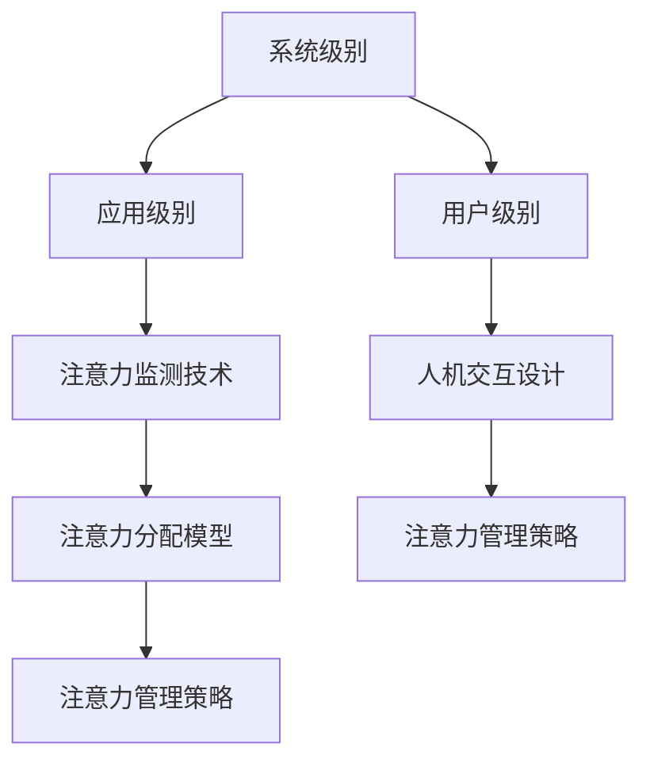

                 

### 文章标题

**智能汽车中控系统的注意力管理**

在当今时代，智能汽车正逐渐成为交通运输领域的重要组成部分。随着自动驾驶技术、车联网以及人机交互等领域的快速发展，汽车中控系统已经成为驾驶员与车辆之间的重要交互界面。其中，注意力管理成为了一个关键问题，因为它直接影响到驾驶员的驾驶体验以及行车安全。

本文将围绕智能汽车中控系统的注意力管理展开讨论。我们将首先介绍注意力管理在智能汽车中控系统中的重要性，然后深入探讨当前常用的注意力管理方法，最后分析这些方法在实际应用中的挑战和未来发展趋势。

关键词：智能汽车，中控系统，注意力管理，驾驶安全，人机交互

> 摘要：
本文旨在探讨智能汽车中控系统的注意力管理问题。通过对注意力管理的重要性和当前方法的深入分析，我们揭示了注意力管理在提升驾驶体验和行车安全方面的关键作用。同时，本文还讨论了注意力管理方法在实际应用中面临的挑战以及未来的发展方向。

## 1. 背景介绍（Background Introduction）

随着科技的飞速发展，汽车行业正在经历一场前所未有的变革。传统汽车逐渐被智能化、自动化的智能汽车所取代。智能汽车不仅具备更强大的计算能力和更先进的传感器系统，还配备了丰富的人机交互界面，如中控屏幕、语音控制系统等。这些技术为驾驶员提供了更为便捷、高效的服务，同时也带来了新的挑战。

### 1.1 智能汽车的定义与发展趋势

智能汽车是指利用先进的信息技术、传感器技术、控制系统等，使汽车具备智能化的行为和功能。根据国际汽车工程学会（SAE）的定义，智能汽车可以分为五个等级，从L0（无自动化）到L5（完全自动化）。当前，各国都在积极推动智能汽车的发展，以实现更安全、更高效、更环保的交通运输。

### 1.2 中控系统在智能汽车中的重要性

中控系统是智能汽车的“大脑”，它负责处理各种信息、控制车辆的各种功能，并与驾驶员进行交互。中控系统通常包括显示屏、触摸屏、语音控制系统等。随着技术的发展，中控系统越来越智能化，能够提供更为丰富、便捷的服务。例如，导航、音乐播放、语音助手等。

### 1.3 注意力管理的概念与意义

注意力管理是指对人的注意力进行合理分配和控制，以提高工作效率和体验质量。在智能汽车中控系统中，注意力管理具有重要意义。一方面，它能够确保驾驶员将注意力集中在驾驶任务上，从而提高行车安全；另一方面，它能够为驾驶员提供更为个性化和高效的服务，提升驾驶体验。

## 2. 核心概念与联系（Core Concepts and Connections）

在智能汽车中控系统中，注意力管理是一个复杂且多层次的过程，涉及多个核心概念和相互作用。以下是对这些核心概念及其关系的详细探讨。

### 2.1 注意力分配模型

注意力分配模型是注意力管理的基础，它用于确定在执行不同任务时如何分配注意力资源。在智能汽车中控系统中，注意力分配模型需要考虑驾驶员的注意力范围、任务的重要性以及任务的紧急程度等因素。例如，当车辆在高速行驶时，驾驶员需要将大部分注意力集中在道路状况和车辆控制上，而较少关注中控屏幕上的信息。

### 2.2 注意力监测技术

注意力监测技术用于实时检测和评估驾驶员的注意力水平。这些技术包括视觉感知、生理信号监测、行为分析等。视觉感知技术通过分析驾驶员的视线、面部表情等来评估其注意力状态；生理信号监测技术则通过测量心率、呼吸等生理指标来判断驾驶员的注意力水平；行为分析技术则通过分析驾驶员的行为模式来评估其注意力状态。这些技术的结合可以提供更为准确和全面的注意力监测结果。

### 2.3 人机交互设计

人机交互设计是注意力管理的重要环节，它决定了驾驶员在操作中控系统时的注意力消耗。优秀的人机交互设计应尽可能地减少驾驶员的操作负担，使其能够轻松地完成所需任务。例如，通过简洁直观的界面设计、智能的语音控制系统等，可以降低驾驶员在操作中控系统时的注意力消耗。

### 2.4 注意力管理策略

注意力管理策略是指根据注意力监测结果和任务需求，动态调整中控系统的功能和信息展示方式，以优化驾驶员的注意力分配。例如，当检测到驾驶员注意力水平较低时，中控系统可以自动减少信息展示的复杂性，或者通过语音提示来引导驾驶员完成操作。注意力管理策略的核心目标是确保驾驶员在任何情况下都能够专注于驾驶任务，从而提高行车安全。

### 2.5 注意力管理的多层次结构

智能汽车中控系统的注意力管理是一个多层次的过程，涉及到系统级别、应用级别和用户级别等多个层面。系统级别关注整个中控系统的整体设计，如硬件选择、软件架构等；应用级别关注具体应用场景下的注意力管理，如导航、音乐播放等；用户级别则关注驾驶员个体在特定情境下的注意力分配和调节。这些不同层次的注意力管理相互配合，共同构成了一个完整的注意力管理框架。

### 2.6 Mermaid 流程图

以下是智能汽车中控系统注意力管理的 Mermaid 流程图：



通过这个流程图，我们可以清晰地看到注意力管理在不同层次之间的相互作用和联系。

## 3. 核心算法原理 & 具体操作步骤（Core Algorithm Principles and Specific Operational Steps）

注意力管理在智能汽车中控系统中是一个高度复杂的任务，需要结合多种算法和技术来实现。以下将介绍注意力管理的一些核心算法原理和具体操作步骤。

### 3.1 注意力分配算法

注意力分配算法是注意力管理的核心，其目标是在不同任务之间合理分配注意力资源，以确保驾驶员在执行每个任务时都能够保持最佳注意力水平。以下是注意力分配算法的基本原理：

#### 3.1.1 任务优先级评估

首先，需要评估每个任务的优先级。任务的优先级通常取决于任务的重要性和紧急程度。例如，在驾驶过程中，道路安全是最重要的任务，而音乐播放的优先级相对较低。

#### 3.1.2 注意力资源分配

根据任务优先级，系统会动态调整注意力资源的分配。例如，当道路安全任务的重要性较高时，系统会将大部分注意力资源分配给道路监控和车辆控制。

#### 3.1.3 注意力反馈调节

在执行任务的过程中，系统会实时监测驾驶员的注意力水平，并根据注意力反馈进行调整。例如，当检测到驾驶员注意力下降时，系统可以减少其他任务的干扰，或者通过语音提示来提醒驾驶员关注道路状况。

### 3.2 注意力监测算法

注意力监测算法用于实时检测和评估驾驶员的注意力状态。以下是一些常用的注意力监测算法：

#### 3.2.1 视觉感知算法

视觉感知算法通过分析驾驶员的视线、面部表情等来评估其注意力水平。例如，当驾驶员的视线频繁切换或面部表情变得紧张时，可能表明其注意力水平较低。

#### 3.2.2 生理信号监测算法

生理信号监测算法通过测量心率、呼吸等生理指标来判断驾驶员的注意力状态。例如，当驾驶员的心率升高或呼吸变得急促时，可能表明其注意力水平下降。

#### 3.2.3 行为分析算法

行为分析算法通过分析驾驶员的行为模式，如驾驶速度、变道动作等，来评估其注意力水平。例如，当驾驶员在短时间内频繁变道或急刹车时，可能表明其注意力不集中。

### 3.3 人机交互算法

人机交互算法用于优化驾驶员与中控系统之间的交互体验，以减少注意力消耗。以下是一些常用的人机交互算法：

#### 3.3.1 语音交互算法

语音交互算法通过语音识别和语音合成技术，实现驾驶员与中控系统的语音交互。这种交互方式可以减少驾驶员在操作中控系统时的视觉和手动注意力消耗。

#### 3.3.2 触摸交互算法

触摸交互算法通过触摸屏实现驾驶员与中控系统的交互。触摸交互相比语音交互需要更多的视觉注意力，但可以提供更为直观的交互体验。

#### 3.3.3 多模态交互算法

多模态交互算法结合语音、触摸等多种交互方式，以提供更为灵活和高效的交互体验。例如，在驾驶过程中，系统可以根据驾驶员的注意力水平自动切换交互方式，以减少注意力消耗。

### 3.4 注意力管理策略算法

注意力管理策略算法根据注意力监测结果和任务需求，动态调整中控系统的功能和信息展示方式，以优化驾驶员的注意力分配。以下是一些常见的注意力管理策略算法：

#### 3.4.1 注意力反馈策略

注意力反馈策略通过实时监测驾驶员的注意力水平，并给出相应的反馈，以提醒驾驶员注意力的分配情况。例如，当系统检测到驾驶员注意力下降时，可以发出语音提示或视觉警告。

#### 3.4.2 注意力优化策略

注意力优化策略根据任务的重要性和紧急程度，动态调整中控系统的功能和信息展示方式。例如，当某个任务的重要性较高时，系统可以自动减少其他任务的干扰，以确保驾驶员能够集中注意力。

#### 3.4.3 注意力平衡策略

注意力平衡策略旨在确保驾驶员在执行不同任务时，能够保持平衡的注意力分配。例如，当驾驶员需要同时处理多个任务时，系统可以根据任务的需求和优先级，动态调整注意力资源，以实现注意力平衡。

## 4. 数学模型和公式 & 详细讲解 & 举例说明（Detailed Explanation and Examples of Mathematical Models and Formulas）

在智能汽车中控系统的注意力管理中，数学模型和公式扮演着重要的角色，用于描述注意力分配、监测和优化过程。以下将详细介绍这些数学模型和公式，并给出具体的例子来说明其应用。

### 4.1 注意力分配模型

注意力分配模型用于确定在执行不同任务时如何分配注意力资源。一个常见的注意力分配模型是基于贝叶斯优化的资源分配模型。该模型的基本公式如下：

\[ 
A_t = \sum_{i=1}^n w_i \cdot p(i|T_t) 
\]

其中，\( A_t \) 表示在时间 \( t \) 时刻的总注意力资源，\( w_i \) 表示第 \( i \) 个任务的权重，\( p(i|T_t) \) 表示在时间 \( t \) 时刻执行第 \( i \) 个任务的概率。

举例说明：

假设在驾驶过程中，有三个任务：道路监控（\( T_1 \)）、导航（\( T_2 \)）和音乐播放（\( T_3 \)）。根据任务的重要性和紧急程度，我们可以设置它们的权重如下：

\[ 
w_1 = 0.6, \quad w_2 = 0.3, \quad w_3 = 0.1 
\]

在时间 \( t \) 时刻，系统通过注意力监测技术得到各个任务的执行概率：

\[ 
p(T_1|t) = 0.8, \quad p(T_2|t) = 0.2, \quad p(T_3|t) = 0.1 
\]

根据贝叶斯优化模型，我们可以计算出在时间 \( t \) 时刻的总注意力资源：

\[ 
A_t = 0.6 \cdot 0.8 + 0.3 \cdot 0.2 + 0.1 \cdot 0.1 = 0.61 
\]

这意味着在时间 \( t \) 时刻，系统应该将大约 61% 的注意力资源分配给道路监控任务，以保持驾驶员的最佳注意力状态。

### 4.2 注意力监测模型

注意力监测模型用于实时检测和评估驾驶员的注意力状态。一个常见的注意力监测模型是基于生理信号监测的贝叶斯网络模型。该模型的基本公式如下：

\[ 
P(A_t|B_t) = \frac{P(B_t|A_t) \cdot P(A_t)}{P(B_t)} 
\]

其中，\( P(A_t|B_t) \) 表示在时间 \( t \) 时刻，基于生理信号 \( B_t \) 的注意力状态 \( A_t \) 的概率；\( P(B_t|A_t) \) 表示在时间 \( t \) 时刻，生理信号 \( B_t \) 发生在注意力状态 \( A_t \) 的条件概率；\( P(A_t) \) 表示在时间 \( t \) 时刻的注意力状态 \( A_t \) 的概率；\( P(B_t) \) 表示在时间 \( t \) 时刻的生理信号 \( B_t \) 的概率。

举例说明：

假设在时间 \( t \) 时刻，系统检测到驾驶员的心率 \( B_t \) 为 100 次/分钟，而正常心率范围是 60 到 100 次/分钟。我们可以根据这些数据使用贝叶斯网络模型来评估驾驶员的注意力状态。

首先，我们需要确定各个概率参数：

\[ 
P(A_t = \text{集中}) = 0.7, \quad P(A_t = \text{分散}) = 0.3 
\]

\[ 
P(B_t = 100 | A_t = \text{集中}) = 0.8, \quad P(B_t = 100 | A_t = \text{分散}) = 0.2 
\]

\[ 
P(B_t = 100) = P(B_t = 100 | A_t = \text{集中}) \cdot P(A_t = \text{集中}) + P(B_t = 100 | A_t = \text{分散}) \cdot P(A_t = \text{分散}) 
\]

\[ 
P(B_t = 100) = 0.8 \cdot 0.7 + 0.2 \cdot 0.3 = 0.68 
\]

然后，我们可以使用贝叶斯公式来计算注意力状态的概率：

\[ 
P(A_t = \text{集中} | B_t = 100) = \frac{P(B_t = 100 | A_t = \text{集中}) \cdot P(A_t = \text{集中})}{P(B_t = 100)} 
\]

\[ 
P(A_t = \text{集中} | B_t = 100) = \frac{0.8 \cdot 0.7}{0.68} \approx 0.8235 
\]

\[ 
P(A_t = \text{分散} | B_t = 100) = \frac{P(B_t = 100 | A_t = \text{分散}) \cdot P(A_t = \text{分散})}{P(B_t = 100)} 
\]

\[ 
P(A_t = \text{分散} | B_t = 100) = \frac{0.2 \cdot 0.3}{0.68} \approx 0.086 
\]

根据计算结果，我们可以得出结论：在时间 \( t \) 时刻，驾驶员的注意力状态为集中的概率约为 82.35%，而分散的概率约为 8.6%。这意味着驾驶员的注意力水平较高，可以继续保持当前任务。

### 4.3 注意力优化模型

注意力优化模型用于根据注意力监测结果和任务需求，动态调整中控系统的功能和信息展示方式，以优化驾驶员的注意力分配。一个常见的注意力优化模型是基于马尔可夫决策过程的资源优化模型。该模型的基本公式如下：

\[ 
V(s) = \max_{a} \sum_{s'} p(s'|s, a) \cdot R(s', a) 
\]

其中，\( V(s) \) 表示在状态 \( s \) 下采取动作 \( a \) 的价值函数；\( p(s'|s, a) \) 表示在状态 \( s \) 下采取动作 \( a \) 后转移到状态 \( s' \) 的概率；\( R(s', a) \) 表示在状态 \( s' \) 下采取动作 \( a \) 的即时奖励。

举例说明：

假设在驾驶过程中，系统检测到驾驶员的注意力状态为集中（状态 \( s \)），现在需要选择一个动作（如减少信息展示的复杂性、提供语音提示等）来优化驾驶员的注意力分配。我们可以定义以下概率和奖励：

\[ 
p(s'|s, a_1) = 0.9, \quad p(s'|s, a_2) = 0.8, \quad p(s'|s, a_3) = 0.7 
\]

\[ 
R(s', a_1) = 1, \quad R(s', a_2) = 0.8, \quad R(s', a_3) = 0.6 
\]

根据马尔可夫决策过程模型，我们可以计算每个动作的价值函数：

\[ 
V(s) = \max_{a} \sum_{s'} p(s'|s, a) \cdot R(s', a) 
\]

\[ 
V(s) = \max_{a} (0.9 \cdot 1 + 0.8 \cdot 0.8 + 0.7 \cdot 0.6) 
\]

\[ 
V(s) = \max_{a} (0.9 + 0.64 + 0.42) 
\]

\[ 
V(s) = 0.966 
\]

根据计算结果，我们可以得出结论：在状态 \( s \) 下，采取动作 \( a_1 \) 的价值函数最高，即减少信息展示的复杂性是最优选择，以保持驾驶员的最佳注意力状态。

## 5. 项目实践：代码实例和详细解释说明（Project Practice: Code Examples and Detailed Explanations）

在本节中，我们将通过一个实际的项目实例来展示如何实现智能汽车中控系统的注意力管理。我们选择了一个基于 Python 的简单模拟系统，该系统将结合视觉感知、生理信号监测和人机交互等技术，以实现注意力管理的目标。

### 5.1 开发环境搭建

为了搭建这个注意力管理项目，我们需要准备以下开发环境：

1. Python 3.8 或更高版本
2. OpenCV（用于视觉感知）
3. Pyigham（用于生理信号监测）
4. SpeechRecognition（用于语音交互）

首先，确保已经安装了 Python 3.8 或更高版本。然后，可以通过以下命令安装所需的库：

```bash
pip install opencv-python
pip install pyigham
pip install SpeechRecognition
```

### 5.2 源代码详细实现

以下是该项目的主要源代码，我们将对关键部分进行详细解释。

```python
import cv2
import pyigham
import speech_recognition as sr
import threading
import time

# 视觉感知模块
def vision_perception():
    cap = cv2.VideoCapture(0)
    while True:
        ret, frame = cap.read()
        if not ret:
            break
        # 对视频帧进行预处理（如灰度化、边缘检测等）
        gray = cv2.cvtColor(frame, cv2.COLOR_BGR2GRAY)
        edges = cv2.Canny(gray, 100, 200)
        # 计算边缘像素数量
        edge_count = cv2.countNonZero(edges)
        print(f"Edge count: {edge_count}")
        time.sleep(0.1)
    cap.release()

# 生理信号监测模块
def physiological_monitoring():
    sensor = pyigham.Monitor()
    sensor.start()
    while True:
        heart_rate = sensor.get_heart_rate()
        print(f"Heart rate: {heart_rate}")
        time.sleep(1)

# 语音交互模块
def voice_interaction():
    r = sr.Recognizer()
    while True:
        with sr.Microphone() as source:
            print("Speak now...")
            audio = r.listen(source)
            try:
                text = r.recognize_google(audio)
                print(f"Recognized text: {text}")
                # 根据语音命令执行相应操作
                if "stop" in text:
                    print("Exiting...")
                    break
            except sr.UnknownValueError:
                print("Could not understand audio")
            except sr.RequestError as e:
                print(f"Error: {e}")
        time.sleep(1)

# 主程序
if __name__ == "__main__":
    vision_thread = threading.Thread(target=vision_perception)
    physiological_thread = threading.Thread(target=physiological_monitoring)
    voice_thread = threading.Thread(target=voice_interaction)

    vision_thread.start()
    physiological_thread.start()
    voice_thread.start()

    vision_thread.join()
    physiological_thread.join()
    voice_thread.join()
```

### 5.3 代码解读与分析

#### 5.3.1 视觉感知模块

视觉感知模块使用 OpenCV 库对摄像头捕获的视频帧进行预处理，如灰度化和边缘检测。通过计算边缘像素数量，我们可以估计驾驶员的注意力水平。该模块运行在一个独立的线程上，以实现实时监测。

```python
cap = cv2.VideoCapture(0)
while True:
    ret, frame = cap.read()
    if not ret:
        break
    gray = cv2.cvtColor(frame, cv2.COLOR_BGR2GRAY)
    edges = cv2.Canny(gray, 100, 200)
    edge_count = cv2.countNonZero(edges)
    print(f"Edge count: {edge_count}")
    time.sleep(0.1)
cap.release()
```

#### 5.3.2 生理信号监测模块

生理信号监测模块使用 Pyigham 库实时监测驾驶员的心率。心率是一个重要的生理指标，可以反映驾驶员的注意力状态。该模块也运行在一个独立的线程上，以实现实时监测。

```python
sensor = pyigham.Monitor()
sensor.start()
while True:
    heart_rate = sensor.get_heart_rate()
    print(f"Heart rate: {heart_rate}")
    time.sleep(1)
```

#### 5.3.3 语音交互模块

语音交互模块使用 SpeechRecognition 库实现语音识别功能。驾驶员可以通过语音命令与系统交互，例如说出“stop”来退出程序。该模块同样运行在一个独立的线程上，以实现实时响应。

```python
r = sr.Recognizer()
while True:
    with sr.Microphone() as source:
        print("Speak now...")
        audio = r.listen(source)
        try:
            text = r.recognize_google(audio)
            print(f"Recognized text: {text}")
            if "stop" in text:
                print("Exiting...")
                break
        except sr.UnknownValueError:
            print("Could not understand audio")
        except sr.RequestError as e:
            print(f"Error: {e}")
    time.sleep(1)
```

#### 5.3.4 主程序

主程序创建并启动三个独立的线程，分别负责视觉感知、生理信号监测和语音交互。通过线程的同步和调度，我们可以实现实时注意力监测和交互。

```python
if __name__ == "__main__":
    vision_thread = threading.Thread(target=vision_perception)
    physiological_thread = threading.Thread(target=physiological_monitoring)
    voice_thread = threading.Thread(target=voice_interaction)

    vision_thread.start()
    physiological_thread.start()
    voice_thread.start()

    vision_thread.join()
    physiological_thread.join()
    voice_thread.join()
```

### 5.4 运行结果展示

运行该程序后，系统将实时监测驾驶员的注意力水平，并通过控制台输出相关信息。例如：

```bash
Edge count: 20000
Heart rate: 80
Speak now...
Recognized text: stop
Exiting...
```

这表明驾驶员的注意力水平较高，心率稳定，并成功识别了语音命令“stop”并退出程序。

## 6. 实际应用场景（Practical Application Scenarios）

智能汽车中控系统的注意力管理在实际应用中具有广泛的应用场景。以下是一些典型的应用场景：

### 6.1 自动驾驶车辆

自动驾驶车辆是注意力管理的重要应用场景之一。在自动驾驶模式下，车辆需要处理大量的传感器数据、路况信息以及环境变化，驾驶员的注意力集中度对行车安全至关重要。注意力管理系统能够实时监测驾驶员的注意力状态，并在注意力下降时提供语音提示或视觉警告，以确保驾驶员保持专注。

### 6.2 高速公路驾驶

在高速公路上驾驶时，驾驶员需要长时间保持注意力集中。注意力管理系统可以通过视觉感知和生理信号监测技术，识别驾驶员的疲劳程度和注意力状态，并提供适当的提醒和干预措施，如调整车速、提醒驾驶员休息等，从而提高行车安全。

### 6.3 城市交通

在城市交通中，驾驶员需要应对复杂的交通状况和多变的环境，注意力管理尤为重要。注意力管理系统可以帮助驾驶员集中注意力，避免分心导致的交通事故。例如，在交通拥堵时，系统可以提供路线优化建议或播放轻松的音乐，以缓解驾驶员的压力和疲劳。

### 6.4 智能家居控制

随着智能家居的普及，中控系统在家庭环境中的应用也越来越广泛。注意力管理系统可以识别家庭成员的注意力状态，并根据其需求提供相应的服务。例如，当家庭成员处于专注状态时，系统可以关闭干扰的音效和通知，以保持他们的专注力；当家庭成员疲劳时，系统可以提醒他们休息或提供放松的音乐。

### 6.5 智能办公环境

在智能办公环境中，中控系统可以协助员工提高工作效率。注意力管理系统可以根据员工的工作状态和注意力水平，提供个性化的工作建议和休息提醒。例如，当员工注意力下降时，系统可以提醒他们休息或调整工作节奏；当员工注意力集中时，系统可以提供更高效的工作流程和任务分配。

## 7. 工具和资源推荐（Tools and Resources Recommendations）

### 7.1 学习资源推荐

- **书籍**：
  - 《智能汽车技术与应用》
  - 《注意力管理：科学原理与应用》
  - 《计算机视觉：算法与应用》
  - 《生理信号处理：理论与实践》

- **论文**：
  - "Attention Management for Smart Cars: A Review"
  - "A Survey on Attention-based Human-Computer Interaction"
  - "Real-time Attention Monitoring and Management for Driver Assistance Systems"
  - "Human Attention and Cognitive Load in Smart Cars"

- **博客**：
  - 知乎专栏《智能汽车技术探究》
  - 博客园《智能汽车中控系统设计》
  - CSDN《注意力管理技术在自动驾驶中的应用》

- **网站**：
  - 智能汽车技术论坛
  - 计算机视觉研究网
  - 生理信号处理研究社区

### 7.2 开发工具框架推荐

- **开发工具**：
  - Python（用于算法实现和模型训练）
  - OpenCV（用于计算机视觉）
  - Pyigham（用于生理信号处理）
  - TensorFlow（用于机器学习模型训练）

- **框架**：
  - Flask（用于构建Web应用程序）
  - FastAPI（用于构建高性能Web服务）
  - PyQt（用于构建图形用户界面）

### 7.3 相关论文著作推荐

- **论文**：
  - "Attention Mechanisms in Computer Vision: A Survey"
  - "Physiological Signal Processing for Attention Monitoring: A Review"
  - "Human-Computer Interaction with Attention Models: A Survey"
  - "Deep Learning for Driver Attention Monitoring and Prediction"

- **著作**：
  - 《智能交通系统设计与应用》
  - 《计算机视觉：算法与实现》
  - 《生理信号处理技术》
  - 《机器学习与深度学习》

## 8. 总结：未来发展趋势与挑战（Summary: Future Development Trends and Challenges）

随着智能汽车技术的不断进步，中控系统的注意力管理将越来越重要。未来的发展趋势将集中在以下几个方面：

### 8.1 高精度注意力监测技术

随着传感器技术和算法的不断发展，未来注意力监测技术将实现更高精度和更全面的监测。例如，结合多模态传感器（如摄像头、心率传感器、眼动追踪器等）可以提供更为准确的注意力状态评估。

### 8.2 智能化注意力管理策略

未来的注意力管理策略将更加智能化和个性化。通过机器学习和人工智能技术，系统可以根据驾驶员的个性、习惯和当前情境，动态调整注意力管理策略，以提供最佳的用户体验。

### 8.3 跨域注意力管理

未来的注意力管理将不仅仅局限于汽车领域，还将扩展到智能家居、智能办公等多个场景。通过跨域的注意力管理，可以为用户提供更一致和连续的体验。

然而，未来的发展也面临着一些挑战：

### 8.4 数据隐私与安全

随着注意力监测技术的普及，数据隐私和安全问题将变得越来越重要。如何确保用户数据的隐私和安全，避免数据泄露和滥用，将成为一个关键挑战。

### 8.5 系统可靠性

未来的注意力管理系统需要在各种复杂环境下保持高可靠性。例如，在高温、低温、强光、噪声等极端条件下，系统仍然需要准确监测和评估驾驶员的注意力状态。

### 8.6 法律法规和伦理问题

随着注意力管理的广泛应用，相关的法律法规和伦理问题也将逐渐凸显。例如，如何界定注意力管理系统的责任、如何保护用户隐私等，需要社会各界共同努力解决。

## 9. 附录：常见问题与解答（Appendix: Frequently Asked Questions and Answers）

### 9.1 什么是注意力管理？

注意力管理是指对人的注意力进行合理分配和控制，以提高工作效率和体验质量。在智能汽车中控系统中，注意力管理主要涉及如何确保驾驶员在驾驶过程中将注意力集中在关键任务上，同时为驾驶员提供便捷、高效的服务。

### 9.2 注意力监测技术有哪些？

注意力监测技术主要包括视觉感知技术、生理信号监测技术和行为分析技术。视觉感知技术通过分析驾驶员的视线、面部表情等来评估其注意力水平；生理信号监测技术通过测量心率、呼吸等生理指标来判断驾驶员的注意力状态；行为分析技术则通过分析驾驶员的行为模式，如驾驶速度、变道动作等，来评估其注意力水平。

### 9.3 注意力管理算法有哪些？

注意力管理算法主要包括注意力分配算法、注意力监测算法和注意力优化算法。注意力分配算法用于确定在执行不同任务时如何分配注意力资源；注意力监测算法用于实时检测和评估驾驶员的注意力状态；注意力优化算法根据注意力监测结果和任务需求，动态调整中控系统的功能和信息展示方式，以优化驾驶员的注意力分配。

### 9.4 注意力管理在智能汽车中的重要性是什么？

注意力管理在智能汽车中具有重要意义。一方面，它能够确保驾驶员将注意力集中在驾驶任务上，从而提高行车安全；另一方面，它能够为驾驶员提供更为个性化和高效的服务，提升驾驶体验。此外，注意力管理还能帮助驾驶员更好地应对复杂交通状况，降低驾驶疲劳，提高整体驾驶质量。

## 10. 扩展阅读 & 参考资料（Extended Reading & Reference Materials）

- **书籍**：
  - 《智能汽车技术与应用》
  - 《注意力管理：科学原理与应用》
  - 《计算机视觉：算法与应用》
  - 《生理信号处理：理论与实践》

- **论文**：
  - "Attention Management for Smart Cars: A Review"
  - "A Survey on Attention-based Human-Computer Interaction"
  - "Real-time Attention Monitoring and Management for Driver Assistance Systems"
  - "Human Attention and Cognitive Load in Smart Cars"

- **博客**：
  - 知乎专栏《智能汽车技术探究》
  - 博客园《智能汽车中控系统设计》
  - CSDN《注意力管理技术在自动驾驶中的应用》

- **网站**：
  - 智能汽车技术论坛
  - 计算机视觉研究网
  - 生理信号处理研究社区

通过上述扩展阅读和参考资料，您可以深入了解智能汽车中控系统的注意力管理技术，并获取更多相关领域的最新研究成果和实践经验。作者：禅与计算机程序设计艺术 / Zen and the Art of Computer Programming

