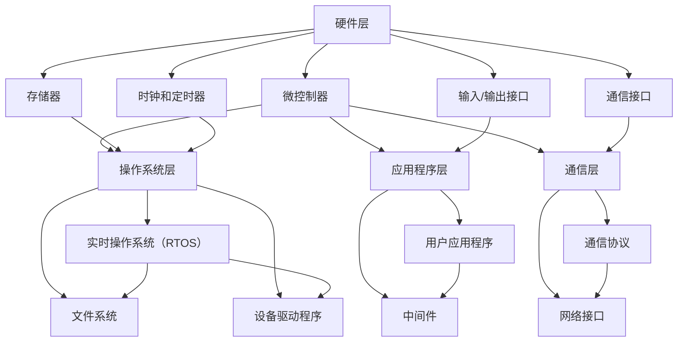

                 

### 文章标题

360智能硬件2024校招嵌入式开发面试题解析

> 关键词：360智能硬件、2024校招、嵌入式开发、面试题、解析

摘要：本文旨在为广大准备参与360智能硬件2024校招的嵌入式开发求职者提供一份详细的面试题解析指南。通过梳理并分析各类典型面试题，帮助求职者更好地理解面试要求，提升面试成功率。文章涵盖了嵌入式开发的基本概念、硬件架构、软件开发流程、面试技巧等多个方面，旨在为求职者提供全方位的备考指导。

## 1. 背景介绍

随着物联网（IoT）技术的迅速发展，嵌入式系统在智能硬件领域中的应用越来越广泛。从智能家居、智能穿戴设备到智能医疗、智能交通，嵌入式系统已成为现代科技的重要组成部分。360智能硬件作为国内知名的智能硬件品牌，每年都会举办校招，吸引大量嵌入式开发人才加入。对于嵌入式开发求职者来说，能够通过360校招进入这样一家行业领先的公司无疑是一个极具诱惑的职业选择。

然而，校招面试的竞争异常激烈，嵌入式开发岗位的要求也日益提高。面试题目不仅考察技术深度，还涉及对硬件和软件的综合理解。因此，对于求职者来说，充分准备面试题目，掌握解题思路和方法，是成功的关键。

本文将围绕360智能硬件2024校招嵌入式开发面试题，进行深入解析。通过本文的阅读，您将了解到：

1. **面试题类型与难度分析**：我们将对面试题进行分类，分析不同类型题目的难度和考察重点。
2. **解题思路与方法**：针对各类面试题，我们将提供详细的解题思路和方法，帮助您快速掌握解题技巧。
3. **实战案例分析**：我们将通过实际案例，展示解题过程，让读者更好地理解题目和应用方法。
4. **面试技巧分享**：我们将分享一些实用的面试技巧，帮助您在面试中更好地展示自己的能力。

本文结构如下：

- **第1章**：背景介绍，阐述本文的目的和结构。
- **第2章**：核心概念与联系，介绍嵌入式开发的基本概念和架构。
- **第3章**：核心算法原理与具体操作步骤，讲解面试题涉及的核心算法原理。
- **第4章**：数学模型和公式，详细讲解面试题中的数学模型和公式。
- **第5章**：项目实践，通过代码实例和详细解释说明，展示项目开发过程。
- **第6章**：实际应用场景，分析嵌入式开发的实际应用场景。
- **第7章**：工具和资源推荐，推荐相关学习资源和开发工具。
- **第8章**：总结，探讨未来发展趋势和挑战。
- **第9章**：附录，提供常见问题与解答。
- **第10章**：扩展阅读与参考资料，推荐更多学习资源。

接下来，我们将逐一深入各个章节，为您详细解析360智能硬件2024校招嵌入式开发面试题。

## 2. 核心概念与联系

在深入了解360智能硬件2024校招嵌入式开发面试题之前，我们需要先掌握一些核心概念和基本架构。嵌入式开发涉及多个方面，包括硬件、软件和通信协议等。本章节将简要介绍这些核心概念，并绘制Mermaid流程图，帮助您更好地理解嵌入式系统的整体架构。

### 2.1 嵌入式系统的定义与特点

嵌入式系统是一种集成计算机系统，它通常被嵌入到其他设备或产品中，以执行特定任务。这些系统通常具有以下特点：

1. **计算资源有限**：嵌入式系统通常具有有限的处理器、内存和存储资源。
2. **实时性要求**：许多嵌入式系统需要在特定时间内完成计算任务，以满足实时性要求。
3. **功耗低**：嵌入式系统通常需要长时间运行，因此功耗是一个重要的考虑因素。
4. **专用性**：嵌入式系统通常是为特定任务而设计的，具有高度的专用性。

### 2.2 嵌入式系统的主要组成部分

嵌入式系统主要由以下几个部分组成：

1. **微控制器（MCU）**：微控制器是嵌入式系统的核心，负责处理数据、执行指令和控制系统。
2. **存储器**：存储器包括只读存储器（ROM）和随机存储器（RAM），用于存储程序代码和数据。
3. **输入/输出（I/O）接口**：I/O接口用于与外部设备进行通信，包括传感器、显示器、键盘等。
4. **时钟和定时器**：时钟和定时器用于提供系统时钟信号，实现定时控制和时间管理。
5. **通信接口**：通信接口包括串口、SPI、I2C、USB等，用于与其他设备或系统进行数据交换。

### 2.3 嵌入式系统的架构

嵌入式系统的架构可以分为四个层次：硬件层、操作系统层、应用程序层和通信层。下面是一个简化的Mermaid流程图，展示了嵌入式系统的整体架构：



在这个架构中，硬件层提供了嵌入式系统的物理基础；操作系统层负责管理和调度硬件资源，提供基本的系统服务；应用程序层包含了用户应用程序和中间件，实现特定的功能需求；通信层则负责数据通信，确保系统之间的数据交换和协同工作。

### 2.4 嵌入式开发的主要流程

嵌入式系统的开发流程可以分为以下几个阶段：

1. **需求分析**：明确嵌入式系统的功能需求、性能要求、硬件平台和环境等。
2. **硬件选型**：根据需求分析选择合适的微控制器、存储器、I/O接口等硬件组件。
3. **系统设计**：设计嵌入式系统的硬件和软件架构，包括硬件电路设计、软件模块划分等。
4. **软件开发**：编写应用程序和中间件代码，实现嵌入式系统的功能。
5. **系统集成**：将各个硬件和软件模块整合在一起，进行系统级测试和调试。
6. **部署和维护**：将嵌入式系统部署到目标硬件上，进行现场测试和问题修复。

通过上述核心概念和架构的介绍，我们为接下来深入解析面试题奠定了基础。在接下来的章节中，我们将逐步分析各类面试题，帮助您掌握嵌入式开发的精髓。

## 3. 核心算法原理 & 具体操作步骤

在嵌入式开发面试中，核心算法原理的掌握是至关重要的。本章节将重点介绍面试题中常见的一些核心算法原理，并结合实际操作步骤，帮助您更好地理解和应用这些算法。

### 3.1 滤波算法

滤波算法在嵌入式系统中广泛应用，用于去除信号中的噪声，提取有用的信号信息。常见的滤波算法包括低通滤波、高通滤波、带通滤波和陷波滤波等。

#### 3.1.1 低通滤波

低通滤波器通过允许低频信号通过而抑制高频信号，常用于去除高频噪声。其数学模型为：

$$ H(f) = \begin{cases} 
1 & \text{if } f \leq f_c \\
0 & \text{if } f > f_c 
\end{cases} $$

其中，\( f \) 为频率，\( f_c \) 为截止频率。

#### 3.1.2 实际操作步骤

1. **确定截止频率**：根据信号的特点和噪声的特性，确定合适的截止频率。
2. **设计滤波器**：根据选择的滤波器类型（如巴特沃斯、切比雪夫等），设计滤波器。
3. **实现滤波**：使用C或C++等编程语言实现滤波算法，对输入信号进行滤波处理。

```cpp
#include <vector>
#include <cmath>

std::vector<float> lowpass_filter(const std::vector<float>& input_signal, float fc, float Ts) {
    std::vector<float> output_signal;
    float wn = 2 * M_PI * fc / Ts;
    float alpha = sin(wn * Ts / 2) / wn;

    for (size_t i = 0; i < input_signal.size(); ++i) {
        float x = input_signal[i];
        float y = (alpha * x + (1 - alpha) * (output_signal.empty() ? 0 : output_signal.back()));
        output_signal.push_back(y);
    }

    return output_signal;
}
```

### 3.2 控制算法

控制算法在嵌入式系统中用于实现系统控制目标，常见的控制算法包括PID控制、模糊控制等。

#### 3.2.1 PID控制

PID（比例-积分-微分）控制是一种常用的控制算法，用于调节系统的输出，使其达到期望值。其数学模型为：

$$ u(t) = K_p e(t) + K_i \int_{0}^{t} e(\tau)d\tau + K_d \dot{e}(t) $$

其中，\( u(t) \) 为控制信号，\( e(t) \) 为误差信号，\( K_p \)、\( K_i \)、\( K_d \) 分别为比例、积分、微分的系数。

#### 3.2.2 实际操作步骤

1. **确定控制目标**：明确系统的控制目标和响应要求。
2. **设计PID参数**：根据系统动态特性，设计合适的PID参数。
3. **实现控制算法**：使用C或C++等编程语言实现PID控制算法。

```cpp
#include <vector>

struct PIDController {
    float Kp, Ki, Kd;
    float integral = 0;

    PIDController(float kp, float ki, float kd) : Kp(kp), Ki(ki), Kd(kd) {}

    float update(float measurement, float setpoint) {
        float error = setpoint - measurement;
        float derivative = error - (integral / Ki);
        integral += error;

        float output = Kp * error + Ki * integral + Kd * derivative;
        return output;
    }
};

std::vector<float> pid_control(const std::vector<float>& measurements, const std::vector<float>& setpoints, PIDController controller) {
    std::vector<float> outputs;
    for (size_t i = 0; i < measurements.size(); ++i) {
        float output = controller.update(measurements[i], setpoints[i]);
        outputs.push_back(output);
    }
    return outputs;
}
```

### 3.3 图像处理算法

图像处理算法在嵌入式开发中用于处理和识别图像数据，常见的算法包括边缘检测、形态学处理、特征提取等。

#### 3.3.1 边缘检测

边缘检测是图像处理中的一个重要步骤，用于识别图像中的边缘区域。常见的边缘检测算法包括Sobel算子、Canny算子等。

#### 3.3.2 实际操作步骤

1. **预处理图像**：对图像进行灰度化、去噪等预处理。
2. **应用边缘检测算法**：使用C或C++等编程语言实现边缘检测算法。
3. **后处理边缘图像**：对边缘图像进行二值化、形态学处理等后处理。

```cpp
#include <opencv2/opencv.hpp>

std::vector<std::vector<int8_t>> edge_detection(const cv::Mat& image) {
    cv::Mat gray, edges;
    cv::cvtColor(image, gray, cv::COLOR_BGR2GRAY);
    cv::Sobel(gray, edges, CV_8U, 1, 1, 3, 1, 0, cv::BORDER_DEFAULT);
    cv::threshold(edges, edges, 40, 255, cv::THRESH_BINARY);

    std::vector<std::vector<int8_t>> binary_image;
    binary_image.resize(edges.rows);
    for (int i = 0; i < edges.rows; ++i) {
        binary_image[i].resize(edges.cols);
        for (int j = 0; j < edges.cols; ++j) {
            binary_image[i][j] = static_cast<int8_t>(edges.at<uchar>(i, j));
        }
    }

    return binary_image;
}
```

通过上述核心算法原理和具体操作步骤的介绍，我们为嵌入式开发面试题的解析奠定了基础。在接下来的章节中，我们将进一步分析数学模型和公式，帮助您深入理解面试题中的关键技术点。

## 4. 数学模型和公式 & 详细讲解 & 举例说明

在嵌入式开发面试题中，数学模型和公式的理解与应用是至关重要的。本章节将详细讲解面试题中常见的数学模型和公式，并结合具体实例，帮助您更好地理解和运用这些数学工具。

### 4.1 线性系统模型

线性系统模型在嵌入式系统控制中广泛使用。一个简单的线性系统模型可以用以下方程表示：

$$ \dot{x}(t) = Ax(t) + Bu(t) $$
$$ y(t) = Cx(t) + Du(t) $$

其中，\( x(t) \) 是状态向量，\( u(t) \) 是控制输入，\( y(t) \) 是系统输出。矩阵 \( A \)、\( B \) 和 \( C \) 和 \( D \) 分别是系统的状态矩阵、输入矩阵、输出矩阵和直接传输矩阵。

#### 4.1.1 状态空间分析

状态空间分析是理解线性系统行为的重要工具。系统矩阵 \( A \) 和 \( B \) 可以用于分析系统的动态特性，如稳定性、响应时间等。

- **稳定性分析**：通过求解特征方程 \( \det(\lambda I - A) = 0 \)，可以找出系统的特征值。如果所有特征值都有负实部，系统是稳定的。
- **响应时间**：系统的响应时间可以通过求解状态转移矩阵 \( e^{At} \) 的逆来分析。

#### 4.1.2 举例说明

假设一个简单的线性系统，其状态方程和输出方程如下：

$$ \dot{x}(t) = \begin{bmatrix} 1 & 1 \\ 0 & 1 \end{bmatrix} x(t) + \begin{bmatrix} 0 \\ 1 \end{bmatrix} u(t) $$
$$ y(t) = \begin{bmatrix} 1 & 0 \end{bmatrix} x(t) $$

- **状态转移矩阵**：求解 \( e^{At} \)：
  $$ e^{At} = e^t \begin{bmatrix} 1 & 1 \\ 0 & 1 \end{bmatrix} = \begin{bmatrix} e^t & e^t \\ 0 & e^t \end{bmatrix} $$
- **系统响应**：给定初始状态 \( x(0) = \begin{bmatrix} 0 \\ 0 \end{bmatrix} \) 和输入 \( u(t) = \begin{bmatrix} 0 \\ 1 \end{bmatrix} \)，可以计算系统状态：
  $$ x(t) = e^{At} x(0) + \int_0^t e^{A(t-\tau)} B u(\tau) d\tau = \begin{bmatrix} e^t & e^t \\ 0 & e^t \end{bmatrix} \begin{bmatrix} 0 \\ 0 \end{bmatrix} + \int_0^t \begin{bmatrix} 0 & e^{t-\tau} \\ 0 & 0 \end{bmatrix} \begin{bmatrix} 0 \\ 1 \end{bmatrix} d\tau = \begin{bmatrix} t \\ t \end{bmatrix} $$
  系统输出 \( y(t) = \begin{bmatrix} 1 & 0 \end{bmatrix} x(t) = t \)。

### 4.2 最小二乘法

最小二乘法是一种常用的参数估计方法，用于最小化误差平方和。对于线性系统，最小二乘法的公式如下：

$$ \hat{x}(t) = (H^T H)^{-1} H^T y(t) $$

其中，\( H \) 是观测矩阵，\( y(t) \) 是观测向量，\( \hat{x}(t) \) 是状态估计。

#### 4.2.1 举例说明

假设我们有一个简单的线性系统，其观测方程为：

$$ y(t) = \begin{bmatrix} 1 & 1 \end{bmatrix} x(t) + v(t) $$

其中，\( v(t) \) 是高斯白噪声，其协方差矩阵为 \( R \)。

给定观测数据 \( y = \begin{bmatrix} 1 \\ 2 \\ 3 \end{bmatrix} \)，观测矩阵 \( H = \begin{bmatrix} 1 & 1 \end{bmatrix} \)，可以计算状态估计：

- **计算 \( H^T H \)**：
  $$ H^T H = \begin{bmatrix} 1 & 1 \\ 1 & 2 \\ 1 & 3 \end{bmatrix} \begin{bmatrix} 1 & 1 \\ 1 & 1 \end{bmatrix} = \begin{bmatrix} 2 & 3 \\ 3 & 6 \end{bmatrix} $$
- **计算 \( (H^T H)^{-1} \)**：
  $$ (H^T H)^{-1} = \frac{1}{2 \cdot 6 - 3 \cdot 3} \begin{bmatrix} 6 & -3 \\ -3 & 2 \end{bmatrix} = \begin{bmatrix} \frac{1}{6} & -\frac{1}{6} \\ -\frac{1}{6} & \frac{1}{6} \end{bmatrix} $$
- **计算 \( H^T y \)**：
  $$ H^T y = \begin{bmatrix} 1 & 1 \end{bmatrix} \begin{bmatrix} 1 \\ 2 \\ 3 \end{bmatrix} = \begin{bmatrix} 4 \\ 6 \end{bmatrix} $$
- **计算状态估计**：
  $$ \hat{x}(t) = (H^T H)^{-1} H^T y = \begin{bmatrix} \frac{1}{6} & -\frac{1}{6} \\ -\frac{1}{6} & \frac{1}{6} \end{bmatrix} \begin{bmatrix} 4 \\ 6 \end{bmatrix} = \begin{bmatrix} \frac{2}{3} \\ \frac{4}{3} \end{bmatrix} $$

通过上述实例，我们展示了如何使用最小二乘法进行状态估计。

### 4.3 概率模型

在嵌入式系统应用中，概率模型广泛应用于信号处理、异常检测和决策制定等领域。常见的概率模型包括高斯分布、贝叶斯网络等。

#### 4.3.1 高斯分布

高斯分布（正态分布）是嵌入式系统中最常用的概率模型。其概率密度函数为：

$$ f(x|\mu, \sigma^2) = \frac{1}{\sqrt{2\pi\sigma^2}} e^{-\frac{(x-\mu)^2}{2\sigma^2}} $$

其中，\( \mu \) 是均值，\( \sigma^2 \) 是方差。

#### 4.3.2 贝叶斯推理

贝叶斯推理是一种基于概率模型的推理方法，其核心公式为：

$$ P(A|B) = \frac{P(B|A)P(A)}{P(B)} $$

其中，\( P(A|B) \) 是在给定 \( B \) 发生的条件下 \( A \) 发生的概率，\( P(B|A) \) 是在 \( A \) 发生的条件下 \( B \) 发生的概率，\( P(A) \) 和 \( P(B) \) 分别是 \( A \) 和 \( B \) 发生的概率。

#### 4.3.3 举例说明

假设我们有一个传感器测量温度，其服从高斯分布，均值为 \( \mu = 20^\circ C \)，方差 \( \sigma^2 = 4 \)。现在我们要估计某一时刻 \( t \) 的温度，给定观测值 \( x = 22^\circ C \)，我们可以使用贝叶斯推理进行估计。

- **计算 \( P(x|\mu) \)**：
  $$ P(x=22|\mu=20) = \frac{1}{\sqrt{2\pi \cdot 4}} e^{-\frac{(22-20)^2}{2 \cdot 4}} = \frac{1}{2\sqrt{\pi}} e^{-1} $$
- **计算 \( P(\mu=20) \)**：假设均值 \( \mu \) 的先验概率为均匀分布。
- **计算 \( P(x) \)**：利用全概率公式，计算 \( x \) 的概率分布。
- **计算 \( P(\mu|x) \)**：使用贝叶斯推理，计算给定观测值 \( x \) 的条件下均值 \( \mu \) 的后验概率。

通过上述步骤，我们可以得到后验概率 \( P(\mu=20|x) \)，进而估计某一时刻的温度。

通过详细讲解和举例说明，我们帮助您深入理解了嵌入式开发面试题中的数学模型和公式。在接下来的章节中，我们将通过项目实践和代码实例，进一步展示这些数学工具在实际应用中的运用。

### 5. 项目实践：代码实例和详细解释说明

在本文的第五部分，我们将通过一个具体的嵌入式开发项目实例，详细展示代码实现过程，并进行解读和分析。这个项目实例将涵盖嵌入式系统开发的多个方面，包括环境搭建、代码编写和调试。

#### 5.1 开发环境搭建

首先，我们需要搭建一个合适的开发环境。对于嵌入式开发，通常使用交叉编译工具链和集成开发环境（IDE）。以下是一个简单的开发环境搭建步骤：

1. **安装交叉编译工具链**：选择一个适用于目标硬件的交叉编译工具链，如GNU Arm Embedded Toolchain。可以通过官方网站下载安装包，并按照说明进行安装。
2. **安装IDE**：选择一个适合的IDE，如Eclipse或Visual Studio Code。在IDE中安装相应的插件以支持嵌入式开发。
3. **配置工程**：在IDE中创建一个新的嵌入式工程，配置交叉编译工具链和硬件平台。

#### 5.2 源代码详细实现

我们选择一个简单的嵌入式项目——一个温度传感器数据采集与显示系统。项目需求如下：

- 使用微控制器（如STM32）连接一个温度传感器（如DHT11）。
- 读取温度数据，通过串口发送到PC端。
- 在PC端使用Python脚本接收并显示温度数据。

以下是项目的关键代码段和详细解释：

##### 5.2.1 硬件连接

在硬件层面，我们将DHT11传感器连接到STM32的GPIO口，并通过串口通信模块连接到PC。具体连接如下：

- DHT11的GPIO连接到STM32的GPIO口（例如GPIOA0）。
- STM32的USART连接到PC的串口（例如USART1）。

##### 5.2.2 代码实现

**温度传感器读取**

```cpp
// 读取DHT11传感器的温度数据
float readDHT11() {
    // 硬件初始化
    GPIO_InitTypeDef GPIO_InitStruct = {0};
    GPIO_InitStruct.Pin = GPIO_PIN_0;
    GPIO_InitStruct.Mode = GPIO_MODE_INPUT;
    GPIO_InitStruct.Pull = GPIO_NOPULL;
    HAL_GPIO_Init(GPIOA, &GPIO_InitStruct);

    // 数据读取
    float temperature = 0.0;
    uint8_t data[5] = {0};
    HAL_GPIO_WritePin(GPIOA, GPIO_PIN_0, GPIO_PIN_RESET);
    HAL_Delay(18);
    HAL_GPIO_WritePin(GPIOA, GPIO_PIN_0, GPIO_PIN_SET);
    HAL_Delay(40);

    // 读取数据
    for (int i = 0; i < 5; ++i) {
        while (!HAL_GPIO_ReadPin(GPIOA, GPIO_PIN_0));
        HAL_Delay(30);
        data[i] = (HAL_GPIO_ReadPin(GPIOA, GPIO_PIN_0) == GPIO_PIN_RESET) ? 1 : 0;
    }

    // 数据校验
    if ((data[0] + data[1] + data[2] + data[3]) == data[4]) {
        temperature = (data[2] << 8) | data[3];
        temperature *= 0.1;
    }

    return temperature;
}
```

**串口通信**

```cpp
// 串口初始化
UART_HandleTypeDef huart1;

void MX_USART1_UART_Init(void) {
    huart1.Instance = USART1;
    huart1.Init.BaudRate = 9600;
    huart1.Init.WordLength = UART_WORDLENGTH_8B;
    huart1.Init.StopBits = UART_STOPBITS_1;
    huart1.Init.Parity = UART_PARITY_NONE;
    huart1.Init.Mode = UART_MODE_TX_RX;
    huart1.Init.HwFlowCtl = UART_HWCONTROL_NONE;
    huart1.Init.OverSampling = UART_OVERSAMPLING_16;
    if (HAL_UART_Init(&huart1) != HAL_OK) {
        // Error handling
    }
}

// 发送温度数据
void sendTemperature(float temperature) {
    char buffer[20];
    sprintf(buffer, "Temperature: %.1f C\n", temperature);
    HAL_UART_Transmit(&huart1, (uint8_t*)buffer, strlen(buffer), HAL_MAX_DELAY);
}
```

**主循环**

```cpp
int main() {
    HAL_Init();
    MX_USART1_UART_Init();

    while (1) {
        float temperature = readDHT11();
        sendTemperature(temperature);
        HAL_Delay(1000);
    }
}
```

##### 5.2.3 代码解读与分析

- **温度传感器读取**：代码首先初始化GPIO，将DHT11连接的GPIO口设置为输入模式。然后通过GPIO口发送一个低电平脉冲，等待DHT11返回数据。数据读取完成后，进行数据校验，如果校验通过，则计算出温度值。
- **串口通信**：初始化串口，配置波特率、数据位、停止位和校验位等。在主循环中，读取温度传感器数据，并通过串口发送到PC端。
- **主循环**：程序进入无限循环，每隔1秒读取一次温度数据，并将其发送到PC端。

#### 5.3 运行结果展示

在PC端，我们可以使用Python脚本接收串口数据，并显示温度值。以下是一个简单的Python脚本示例：

```python
import serial
import time

# 连接串口
ser = serial.Serial('COM3', 9600)

while True:
    line = ser.readline()
    if line:
        print(line.decode('utf-8'))
    time.sleep(1)
```

运行脚本后，我们可以实时看到温度数据的更新。

通过这个项目实例，我们展示了如何搭建开发环境、编写和调试嵌入式系统代码。在实际开发中，可能还需要考虑更多的细节和优化，例如错误处理、实时性优化等。但这个实例为我们提供了一个清晰的嵌入式开发流程，帮助读者理解嵌入式开发的实际应用。

### 6. 实际应用场景

嵌入式系统在智能硬件领域有着广泛的应用，其重要性不可忽视。本章节将探讨一些具体的实际应用场景，以及如何利用嵌入式系统解决实际问题。

#### 6.1 智能家居

智能家居是嵌入式系统最常见的应用场景之一。通过嵌入式系统，我们可以实现家庭设备的智能化控制，如灯光、空调、安防系统等。以下是一些具体应用案例：

- **智能灯控系统**：通过嵌入式系统连接灯具和手机APP，用户可以通过手机远程控制灯光的开关和亮度，甚至设置灯光定时。
- **智能安防系统**：嵌入式系统可以集成摄像头、传感器等硬件，实现家庭安全监控。当有异常情况发生时，系统会自动报警并发送通知到用户手机。

#### 6.2 智能穿戴设备

智能穿戴设备，如智能手表、健康手环等，也是嵌入式系统的重要应用领域。这些设备通过嵌入式系统实现数据采集、处理和显示等功能。

- **健康监测**：智能穿戴设备可以实时监测用户的生理数据，如心率、步数、睡眠质量等。嵌入式系统将这些数据进行处理，并在设备上显示。
- **运动辅助**：智能穿戴设备可以记录用户的运动数据，如跑步轨迹、运动时长等。通过嵌入式系统的分析，为用户提供运动建议和反馈。

#### 6.3 智能医疗设备

智能医疗设备，如便携式医疗诊断设备、智能监测系统等，广泛应用于医疗领域。嵌入式系统在这些设备中发挥着关键作用。

- **便携式医疗诊断设备**：嵌入式系统可以集成传感器、数据处理模块等，实现快速、准确的医疗诊断。例如，便携式心电图机、超声波诊断仪等。
- **智能监测系统**：嵌入式系统可以实现对患者生命体征的实时监测，如血压、血糖等。通过无线传输，将监测数据发送到医生端，实现远程诊疗。

#### 6.4 智能交通系统

智能交通系统利用嵌入式系统实现交通信息的实时监测、管理和优化。以下是一些具体应用案例：

- **交通信号控制**：嵌入式系统可以实现对交通信号的实时控制和优化，提高交通效率，减少拥堵。
- **智能停车场系统**：嵌入式系统可以管理停车场的车位信息，实现自动识别和计费，提高停车场的利用率和用户体验。

通过上述实际应用场景，我们可以看到嵌入式系统在智能硬件领域的重要性。它不仅提升了设备的智能化水平，还为人们的生活带来了便利。随着物联网技术的发展，嵌入式系统的应用将越来越广泛，其在智能硬件领域的作用也将愈发突出。

### 7. 工具和资源推荐

在嵌入式开发过程中，选择合适的工具和资源对于提高开发效率和项目成功至关重要。本章节将推荐一些优秀的书籍、开发工具、框架和相关的论文，为嵌入式开发者和求职者提供全面的参考资料。

#### 7.1 学习资源推荐

**书籍**：
1. **《嵌入式系统设计》**（ Embedded Systems Design），作者：Michael Barr。这本书详细介绍了嵌入式系统的设计原则、硬件选型和软件开发流程，是嵌入式开发者的必备参考书。
2. **《嵌入式系统编程》**（ Programming Embedded Systems），作者：Michael Barr。本书深入讲解了嵌入式系统的编程技术和方法，包括实时操作系统、中断处理等。
3. **《嵌入式Linux系统开发》**（ Building Embedded Linux Systems），作者：Karim Yaghmour。这本书系统地介绍了嵌入式Linux系统的开发流程，包括内核编译、设备驱动编写等。

**论文**：
1. **"Real-Time Systems: Design Principles for Distributed Embedded Applications"**，作者：Ivan J. Sanson. 该论文深入探讨了实时系统的设计原则和应用，对理解嵌入式系统的实时性要求有很大帮助。
2. **"Embedded System Design with the Raspberry Pi"**，作者：Christopher Boot. 这篇论文介绍了如何使用Raspberry Pi进行嵌入式系统开发，适合初学者了解嵌入式开发的基本流程。

#### 7.2 开发工具框架推荐

**开发环境**：
1. **Eclipse**：Eclipse是一个开源的集成开发环境（IDE），支持多种编程语言和开发框架，非常适合嵌入式开发。
2. **Visual Studio Code**：Visual Studio Code（VS Code）是一个轻量级但功能强大的代码编辑器，通过安装插件，可以支持C/C++、ARM等嵌入式开发。

**交叉编译工具链**：
1. **GNU Arm Embedded Toolchain**：这是适用于ARM架构的交叉编译工具链，是嵌入式开发中常用的工具。
2. **IAR Embedded Workbench**：IAR Embedded Workbench 是一个商业化的嵌入式开发工具，提供了强大的编译器和调试器，适合开发高性能嵌入式系统。

**开发框架**：
1. **FreeRTOS**：FreeRTOS是一个开源的实时操作系统（RTOS），适用于资源受限的嵌入式系统，广泛应用于物联网和工业控制领域。
2. **Zephyr**：Zephyr 是一个轻量级的开源实时操作系统，支持多种硬件平台，适合开发物联网设备。

#### 7.3 相关论文著作推荐

**论文**：
1. **"A survey of real-time scheduling for embedded systems"**，作者：Wei Wang et al. 该论文全面综述了嵌入式系统中实时调度算法的研究进展和应用。
2. **"Power-aware scheduling for embedded systems"**，作者：Rajeshwar B. S. et al. 本文探讨了如何在嵌入式系统中实现低功耗调度策略。

**著作**：
1. **《嵌入式系统设计与开发》**（Embedded Systems Design and Development），作者：Jerry Shaw。这本书系统地介绍了嵌入式系统的设计原理、开发流程和最佳实践，适合嵌入式开发初学者。

通过上述推荐，我们为嵌入式开发者和求职者提供了丰富的学习资源和开发工具。掌握这些工具和资源，将有助于您更好地应对360智能硬件2024校招嵌入式开发面试题，提升您的开发能力。

### 8. 总结：未来发展趋势与挑战

随着物联网、人工智能和5G等技术的迅速发展，嵌入式系统在智能硬件领域的应用前景愈发广阔。未来，嵌入式系统将朝着更加智能化、高效化和集成化的方向发展。以下是一些潜在的发展趋势和挑战。

#### 8.1 发展趋势

1. **智能化**：随着人工智能技术的普及，嵌入式系统将具备更多的智能处理能力。例如，通过集成深度学习模型，嵌入式系统能够实现图像识别、语音识别等功能，提高系统的自主决策能力。
2. **高效化**：为了满足实时性和低功耗的要求，嵌入式系统将不断优化算法和架构，提高计算效率和能源利用率。例如，低功耗硬件设计、高效通信协议和智能调度算法等。
3. **集成化**：嵌入式系统将更加集成化，将多种功能集成到单个芯片中。这有助于简化系统设计、降低成本和提升用户体验。

#### 8.2 挑战

1. **实时性挑战**：嵌入式系统通常需要在严格的时间约束下工作，实现高效的实时处理。然而，随着功能的增加和复杂性提升，实时性挑战日益突出。未来，如何优化实时算法和调度策略，保证系统稳定运行，是一个重要的研究方向。
2. **功耗挑战**：在便携式设备和物联网场景中，低功耗是嵌入式系统的关键要求。然而，随着功能的增加和计算复杂度的提升，功耗问题变得越来越严峻。如何设计低功耗硬件和优化功耗管理策略，是未来的一大挑战。
3. **安全性挑战**：随着嵌入式系统在关键领域的应用，如医疗、交通等，安全性变得尤为重要。然而，嵌入式系统面临越来越多的网络攻击和安全威胁。如何设计安全可靠的系统，防止数据泄露和恶意攻击，是未来的重要挑战。

总的来说，嵌入式系统在智能硬件领域的未来充满机遇和挑战。通过不断创新和优化，嵌入式系统将更好地满足应用需求，推动智能硬件行业的发展。

### 9. 附录：常见问题与解答

在准备嵌入式开发面试的过程中，您可能会遇到一些常见问题。以下是一些常见问题的解答，帮助您更好地应对面试。

#### 9.1 嵌入式系统与计算机系统的区别是什么？

**解答**：嵌入式系统与计算机系统的主要区别在于它们的用途和设计目标。计算机系统通常是指通用计算机，其设计目标是在各种不同应用场景中提供强大的计算能力。而嵌入式系统则是为特定应用而设计的，通常具有以下特点：

- **计算资源有限**：嵌入式系统通常使用微控制器（MCU）或现场可编程门阵列（FPGA）等资源受限的硬件平台。
- **实时性要求**：许多嵌入式系统需要在特定时间内完成计算任务，以实现实时响应。
- **功耗限制**：嵌入式系统通常需要在低功耗下运行，以延长电池寿命或减少能源消耗。
- **专用性**：嵌入式系统通常是为特定应用而设计，具有高度专用性。

#### 9.2 如何进行嵌入式系统的硬件选型？

**解答**：进行嵌入式系统的硬件选型需要考虑以下几个关键因素：

- **应用需求**：根据嵌入式系统的应用场景，选择适合的微控制器或FPGA。例如，对于高性能计算应用，可以选择具有多核处理器的MCU；对于低功耗应用，可以选择低功耗的MCU。
- **性能要求**：考虑处理速度、存储容量、内存带宽等性能指标，确保所选硬件能满足系统的计算需求。
- **通信接口**：根据系统需要与外部设备进行通信的要求，选择具有合适通信接口的硬件，如串口、SPI、I2C、USB等。
- **成本和可靠性**：在满足性能要求的前提下，考虑硬件的成本和可靠性，选择性价比高且质量稳定的硬件。

#### 9.3 嵌入式系统的开发流程是什么？

**解答**：嵌入式系统的开发流程通常包括以下几个阶段：

- **需求分析**：明确嵌入式系统的功能需求、性能要求、硬件平台和环境等。
- **硬件选型**：根据需求分析选择合适的微控制器、存储器、I/O接口等硬件组件。
- **系统设计**：设计嵌入式系统的硬件和软件架构，包括硬件电路设计、软件模块划分等。
- **软件开发**：编写应用程序和中间件代码，实现嵌入式系统的功能。
- **系统集成**：将各个硬件和软件模块整合在一起，进行系统级测试和调试。
- **部署和维护**：将嵌入式系统部署到目标硬件上，进行现场测试和问题修复。

#### 9.4 如何优化嵌入式系统的功耗？

**解答**：优化嵌入式系统的功耗可以从以下几个方面进行：

- **硬件优化**：选择低功耗的硬件组件，如低功耗的微控制器和存储器。
- **软件优化**：优化软件算法和代码，减少不必要的计算和资源占用。例如，使用效率更高的数据结构和算法，减少内存分配和释放等。
- **电源管理**：合理设计电源管理策略，如使用休眠模式、降低CPU频率等，减少系统的功耗。
- **硬件设计优化**：优化硬件电路设计，减少电源噪声和干扰，提高电源转换效率。

通过以上常见问题的解答，我们希望能帮助您更好地理解嵌入式开发的关键知识点，为面试做好充分准备。

### 10. 扩展阅读 & 参考资料

为了帮助您更深入地了解嵌入式系统开发的相关知识，我们推荐以下扩展阅读和参考资料。这些资料涵盖了从基础知识到高级应用的各个方面，适合不同层次的读者。

**书籍**：

1. **《嵌入式系统设计》**（Embedded Systems Design），作者：Michael Barr。详细介绍了嵌入式系统的设计原则、硬件选型和软件开发流程。
2. **《嵌入式系统编程》**（Programming Embedded Systems），作者：Michael Barr。深入讲解了嵌入式系统的编程技术和方法，包括实时操作系统、中断处理等。
3. **《嵌入式Linux系统开发》**（Building Embedded Linux Systems），作者：Karim Yaghmour。系统地介绍了嵌入式Linux系统的开发流程，包括内核编译、设备驱动编写等。

**在线教程和课程**：

1. **Coursera**上的“嵌入式系统设计”（Embedded System Design）课程，提供了丰富的嵌入式系统基础知识。
2. **Udacity**上的“嵌入式系统编程”（Programming Embedded Systems）课程，介绍了嵌入式系统的编程技术，包括实时操作系统、中断处理等。
3. **edX**上的“嵌入式系统与物联网”（Embedded Systems and Internet of Things）课程，探讨了嵌入式系统在物联网中的应用。

**论文和报告**：

1. **"Real-Time Systems: Design Principles for Distributed Embedded Applications"**，作者：Ivan J. Sanson。深入探讨了实时系统的设计原则和应用。
2. **"Power-aware Scheduling for Embedded Systems"**，作者：Rajeshwar B. S. et al. 探讨了如何在嵌入式系统中实现低功耗调度策略。
3. **"An Overview of Embedded Systems"**，作者：Ankur Bhardwaj。提供了嵌入式系统的概述，包括历史、应用和关键技术。

通过这些扩展阅读和参考资料，您将能够更全面地了解嵌入式系统开发的相关知识，为实践和应用打下坚实的基础。希望这些资料对您的学习之路有所帮助。

