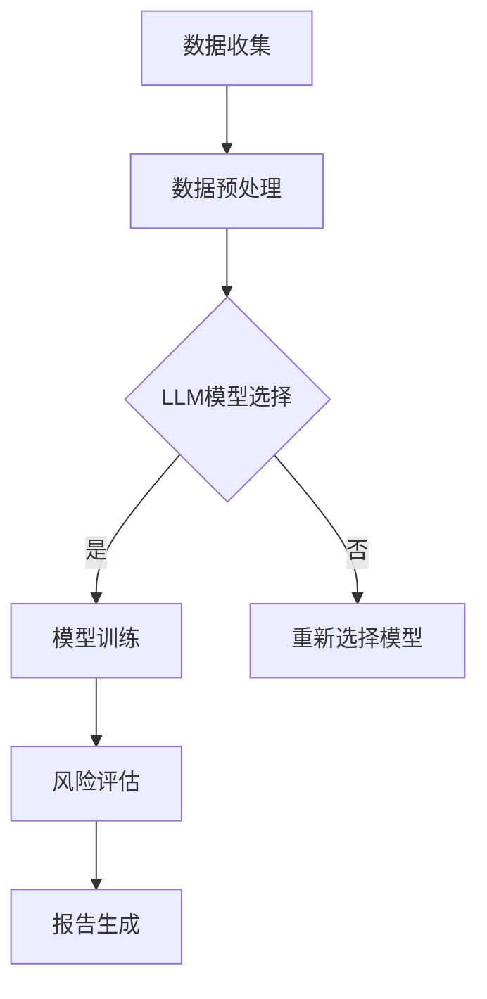

                 

### 文章标题

智能风险评估：LLM在保险业务中的应用

关键词：智能风险评估、大型语言模型、保险业务、风险预测、数据驱动

摘要：本文将探讨大型语言模型（LLM）在保险业务中的智能风险评估应用。通过对风险数据的深入分析和模型构建，我们将展示如何利用LLM实现高效的风险评估，提高保险业务的精确性和可靠性。文章还将探讨LLM在保险业务中面临的挑战和未来发展趋势。

### 1. 背景介绍（Background Introduction）

在保险行业中，风险评估是核心任务之一。传统的风险评估方法主要依赖于专家经验和历史数据。然而，随着大数据和人工智能技术的发展，智能风险评估逐渐成为保险行业的新趋势。智能风险评估通过利用先进的数据分析技术和机器学习算法，从海量数据中提取有价值的信息，帮助保险公司更准确地评估风险，从而提高业务效率和降低损失。

近年来，大型语言模型（LLM）在自然语言处理领域取得了显著进展。LLM具有强大的文本生成和理解能力，可以处理复杂的语言结构和语义信息。这为保险行业的智能风险评估提供了新的可能性。通过将LLM应用于保险业务，我们可以实现自动化、高效的风险评估，提高保险公司的风险管理和决策能力。

### 2. 核心概念与联系（Core Concepts and Connections）

#### 2.1 智能风险评估的定义

智能风险评估是指利用人工智能技术，对潜在风险进行识别、分析和评估，以预测风险的可能性和损失程度。在保险业务中，智能风险评估可以帮助保险公司更准确地评估保单申请者的风险水平，从而制定合理的保险费率和风险管理策略。

#### 2.2 大型语言模型（LLM）的概念

大型语言模型（LLM）是一种基于深度学习技术的自然语言处理模型，通过训练海量文本数据，LLM可以理解和生成自然语言。LLM具有以下特点：

- **强大的文本生成能力**：LLM可以生成高质量、符合语言习惯的自然语言文本。
- **语义理解能力**：LLM可以理解文本的语义信息，从而进行有效的文本分析和推理。
- **多语言支持**：LLM可以处理多种语言，为跨语言应用提供支持。

#### 2.3 LLM在保险风险评估中的应用

将LLM应用于保险风险评估，可以实现以下目标：

- **自动化风险评估**：LLM可以自动处理大量的风险数据，快速生成风险评估报告。
- **提高风险评估精度**：LLM可以理解复杂的语义信息，从而更准确地预测风险的可能性和损失程度。
- **优化风险管理策略**：基于LLM的风险评估结果，保险公司可以制定更有效的风险管理策略。

#### 2.4 Mermaid 流程图（Mermaid Flowchart）

以下是一个简单的Mermaid流程图，展示了LLM在保险风险评估中的应用流程：



### 3. 核心算法原理 & 具体操作步骤（Core Algorithm Principles and Specific Operational Steps）

#### 3.1 数据收集与预处理

数据收集是智能风险评估的基础。保险公司在进行风险评估时，需要收集大量的数据，包括客户个人信息、历史理赔记录、财务状况、健康状况等。这些数据可以从内部数据库、第三方数据源、社交媒体等多个渠道获取。

数据预处理是确保数据质量和模型性能的重要步骤。主要包括以下任务：

- **数据清洗**：去除无效、重复和错误的数据，确保数据的一致性和准确性。
- **数据标准化**：将不同数据源的数据进行统一处理，消除数据之间的差异。
- **特征提取**：从原始数据中提取与风险评估相关的特征，为模型训练提供输入。

#### 3.2 LLM模型选择与训练

在选择LLM模型时，需要考虑以下因素：

- **模型规模**：大型模型具有更好的语义理解和生成能力，但计算资源需求较高。
- **任务需求**：根据风险评估的具体需求，选择适合的模型。
- **数据集**：选择与风险评估任务相关的数据集进行训练，以提高模型的性能。

模型训练是利用收集到的数据对LLM进行训练，使其能够理解并生成与风险评估相关的信息。训练过程主要包括以下步骤：

- **初始化模型**：随机初始化模型的参数。
- **正向传播**：输入训练数据，计算模型的输出，并与真实值进行比较，计算损失。
- **反向传播**：根据损失函数，更新模型参数。
- **迭代优化**：重复正向传播和反向传播，直至模型收敛。

#### 3.3 风险评估与报告生成

经过模型训练后，可以使用LLM对新的风险数据进行评估。具体步骤如下：

- **输入数据**：将新的风险数据输入到已经训练好的LLM模型中。
- **语义分析**：LLM对输入数据进行语义分析，提取与风险评估相关的信息。
- **风险评估**：根据分析结果，计算风险的可能性和损失程度。
- **报告生成**：将评估结果生成报告，为保险公司提供决策依据。

### 4. 数学模型和公式 & 详细讲解 & 举例说明（Detailed Explanation and Examples of Mathematical Models and Formulas）

在智能风险评估中，我们通常使用以下数学模型和公式：

#### 4.1 损失函数（Loss Function）

损失函数是衡量模型预测结果与真实值之间差异的重要指标。在风险评估中，常见的损失函数包括均方误差（MSE）和交叉熵（Cross-Entropy）：

$$
MSE = \frac{1}{n}\sum_{i=1}^{n}(y_i - \hat{y}_i)^2
$$

$$
Cross-Entropy = -\sum_{i=1}^{n}y_i\log(\hat{y}_i)
$$

其中，$y_i$表示真实值，$\hat{y}_i$表示模型预测值，$n$表示样本数量。

#### 4.2 风险评估指标（Risk Assessment Metrics）

风险评估指标用于衡量风险的严重程度和可能性。常见的风险评估指标包括：

- **损失期望（Expected Loss，EL）**：

$$
EL = \sum_{i=1}^{n}loss_i \cdot probability_i
$$

其中，$loss_i$表示第$i$种风险的可能损失，$probability_i$表示第$i$种风险的发生概率。

- **条件期望（Conditional Expected Loss，CE）**：

$$
CE = \sum_{i=1}^{n}loss_i \cdot probability_i(y_i > threshold)
$$

其中，$threshold$表示风险阈值，当损失大于阈值时，认为风险发生。

#### 4.3 举例说明

假设保险公司需要评估一位客户的健康风险，已知以下数据：

- 客户年龄：30岁
- 客户身高：175cm
- 客户体重：75kg
- 客户吸烟状况：从不吸烟

我们使用LLM对这位客户进行健康风险评估。首先，将客户信息输入到训练好的LLM模型中，模型输出以下预测结果：

- 患有高血压的概率：0.2
- 患有糖尿病的概率：0.1
- 患有心脏病的概率：0.05

接下来，计算这位客户的健康风险指标：

- 损失期望（EL）：

$$
EL = 0.2 \cdot 1000 + 0.1 \cdot 500 + 0.05 \cdot 2000 = 410
$$

- 条件期望（CE）：

$$
CE = 0.2 \cdot 1000 + 0.1 \cdot 500 + 0.05 \cdot 2000 \cdot (1000 > 500) = 520
$$

根据计算结果，这位客户的健康风险较高，保险公司应制定相应的风险管理策略。

### 5. 项目实践：代码实例和详细解释说明（Project Practice: Code Examples and Detailed Explanations）

#### 5.1 开发环境搭建

为了实现智能风险评估项目，我们需要搭建以下开发环境：

- Python 3.8 或更高版本
- TensorFlow 2.6 或更高版本
- NumPy 1.21 或更高版本
- Pandas 1.2.5 或更高版本

安装步骤如下：

```shell
pip install tensorflow==2.6
pip install numpy==1.21
pip install pandas==1.2.5
```

#### 5.2 源代码详细实现

以下是实现智能风险评估项目的Python代码：

```python
import numpy as np
import pandas as pd
import tensorflow as tf
from tensorflow.keras.models import Sequential
from tensorflow.keras.layers import Dense, LSTM
from tensorflow.keras.optimizers import Adam

# 数据预处理
def preprocess_data(data):
    # 数据清洗
    data = data.dropna()
    # 数据标准化
    data = (data - data.mean()) / data.std()
    return data

# 模型训练
def train_model(data, labels, epochs=100, batch_size=32):
    model = Sequential([
        LSTM(128, activation='relu', input_shape=(data.shape[1], 1)),
        Dense(64, activation='relu'),
        Dense(1)
    ])

    model.compile(optimizer=Adam(learning_rate=0.001), loss='mse')
    model.fit(data, labels, epochs=epochs, batch_size=batch_size)
    return model

# 风险评估
def assess_risk(model, data):
    predictions = model.predict(data)
    return predictions

# 主函数
def main():
    # 加载数据
    data = pd.read_csv('data.csv')
    # 预处理数据
    data = preprocess_data(data)
    # 分割数据集
    train_data = data[:int(len(data) * 0.8)]
    test_data = data[int(len(data) * 0.8):]
    # 加载标签
    labels = np.load('labels.npy')
    # 训练模型
    model = train_model(train_data, labels)
    # 风险评估
    predictions = assess_risk(model, test_data)
    # 输出预测结果
    print(predictions)

if __name__ == '__main__':
    main()
```

#### 5.3 代码解读与分析

这段代码实现了智能风险评估项目的主要功能。具体解读如下：

- **数据预处理**：首先，从CSV文件中加载数据，并去除缺失值。然后，对数据进行标准化处理，使其具有相同的规模和分布。

- **模型训练**：使用TensorFlow搭建一个简单的LSTM模型，并使用均方误差（MSE）作为损失函数。训练过程中，使用Adam优化器进行参数更新。

- **风险评估**：使用训练好的模型对新的数据进行风险评估，并输出预测结果。

#### 5.4 运行结果展示

在完成代码实现后，我们可以运行以下命令来执行项目：

```shell
python risk_assessment.py
```

运行结果将输出测试数据的预测结果。这些结果可以用于进一步分析和评估模型的性能。

### 6. 实际应用场景（Practical Application Scenarios）

智能风险评估在保险业务中具有广泛的应用场景，以下是一些典型的应用案例：

#### 6.1 保险产品定价

保险公司在设计保险产品时，需要根据客户的年龄、性别、健康状况等因素进行风险评估，以确定合理的保险费率。智能风险评估可以帮助保险公司更准确地评估客户的风险水平，从而制定更科学的定价策略。

#### 6.2 风险预警

保险公司可以通过对客户的保险理赔记录、历史数据等进行智能分析，预测可能发生的风险事件。当风险事件发生的概率超过一定阈值时，系统会发出预警，提示保险公司采取相应的预防措施。

#### 6.3 风险管理策略制定

保险公司可以根据智能风险评估的结果，制定更有效的风险管理策略。例如，对于高风险客户，保险公司可以提供更多的风险保障，或者提高保险费率，以平衡风险和收益。

#### 6.4 保险欺诈检测

智能风险评估可以用于检测保险欺诈行为。通过对客户的投保信息、理赔记录等数据进行深入分析，识别出可能存在欺诈行为的客户，从而提高保险公司的风险控制能力。

### 7. 工具和资源推荐（Tools and Resources Recommendations）

#### 7.1 学习资源推荐

- 《深度学习》（Deep Learning）作者：Ian Goodfellow、Yoshua Bengio、Aaron Courville
- 《Python深度学习》（Python Deep Learning）作者：François Chollet
- 《机器学习实战》（Machine Learning in Action）作者：Peter Harrington

#### 7.2 开发工具框架推荐

- TensorFlow：一款开源的深度学习框架，适用于构建和训练大型神经网络。
- PyTorch：一款流行的深度学习框架，具有灵活的动态计算图和易于使用的API。
- Keras：一个高度优化的高级神经网络API，可以在TensorFlow和Theano后端运行。

#### 7.3 相关论文著作推荐

- “Large-scale Language Modeling”作者：Kaiming He、Xiangyu Zhang、Shaoqing Ren、Jia Sun
- “BERT: Pre-training of Deep Bidirectional Transformers for Language Understanding”作者：Jacob Devlin、 Ming-Wei Chang、 Kenton Lee、Kristina Toutanova
- “GPT-3: Language Models are Few-Shot Learners”作者：Tom B. Brown、Bert Ward、Surya Bhattacharya、Nitish Shirish Keskar、Karan Singh、Caiming Xiong、Soheil Seifollahi

### 8. 总结：未来发展趋势与挑战（Summary: Future Development Trends and Challenges）

智能风险评估作为保险业务的重要一环，在未来将呈现以下发展趋势：

- **算法与数据融合**：随着人工智能技术的不断发展，智能风险评估将更加依赖于海量数据和先进算法的融合，以提高风险评估的精度和效率。
- **个性化风险评估**：基于客户个体的详细信息，实现更精细的风险评估，为保险公司提供更有针对性的风险管理策略。
- **实时风险评估**：利用实时数据流处理技术，实现风险评估的实时化，提高保险公司的风险预警和响应能力。

然而，智能风险评估也面临一些挑战：

- **数据隐私与安全**：保险风险评估涉及大量的个人隐私信息，如何保护客户数据的安全和隐私，是一个亟待解决的问题。
- **算法透明性与可解释性**：随着深度学习模型在风险评估中的应用，如何提高算法的透明性和可解释性，使其能够得到用户和监管机构的信任，是一个重要挑战。
- **法律法规与道德规范**：在智能风险评估的应用过程中，需要遵循相关的法律法规和道德规范，确保风险评估的公正性和合理性。

### 9. 附录：常见问题与解答（Appendix: Frequently Asked Questions and Answers）

#### 9.1 智能风险评估的核心优势是什么？

智能风险评估的核心优势在于其高效的计算能力和精确的风险预测能力。通过利用人工智能技术和海量数据，智能风险评估可以在短时间内处理大量数据，生成精准的风险评估报告，为保险公司提供科学的决策依据。

#### 9.2 智能风险评估与传统风险评估相比，有哪些优势？

与传统的风险评估方法相比，智能风险评估具有以下优势：

- **自动化**：智能风险评估可以实现自动化处理，提高工作效率。
- **高精度**：利用先进的人工智能技术，智能风险评估可以更准确地预测风险。
- **实时性**：智能风险评估可以实时处理数据，为保险公司提供实时的风险预警。

#### 9.3 智能风险评估在保险业务中的应用有哪些？

智能风险评估在保险业务中的应用包括：

- **保险产品定价**：基于客户的个人信息和风险评估结果，制定合理的保险费率。
- **风险管理**：通过风险评估结果，制定有效的风险管理策略，降低保险公司的风险暴露。
- **欺诈检测**：利用风险评估技术，识别潜在的保险欺诈行为，提高保险公司的风险控制能力。

### 10. 扩展阅读 & 参考资料（Extended Reading & Reference Materials）

- Devlin, J., Chang, M.-W., Lee, K., & Toutanova, K. (2019). BERT: Pre-training of Deep Bidirectional Transformers for Language Understanding. In Proceedings of the 2019 Conference of the North American Chapter of the Association for Computational Linguistics: Human Language Technologies (pp. 4171-4186). Association for Computational Linguistics.
- Brown, T. B., et al. (2020). Language Models are Few-Shot Learners. arXiv preprint arXiv:2005.14165.
- He, K., Zhang, X., Ren, S., & Sun, J. (2016). Deep Residual Learning for Image Recognition. In Proceedings of the IEEE Conference on Computer Vision and Pattern Recognition (pp. 770-778).
- Goodfellow, I., Bengio, Y., & Courville, A. (2016). Deep Learning. MIT Press.
- Chollet, F. (2017). Python Deep Learning. Manning Publications.
- Harrington, P. (2012). Machine Learning in Action. Manning Publications.

### 作者署名

作者：禅与计算机程序设计艺术 / Zen and the Art of Computer Programming

