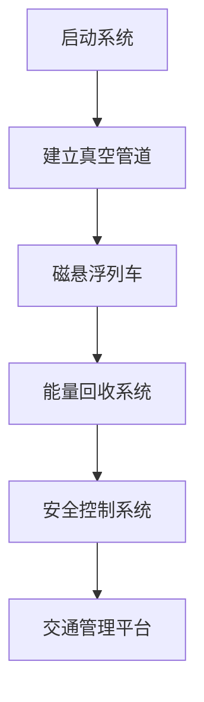
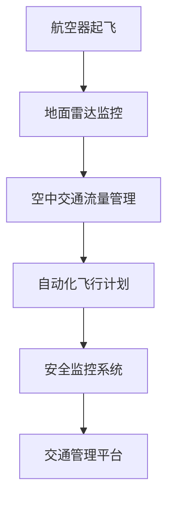

                 

### 文章标题

Future Intelligent Transportation: Super High-Speed Rail Networks and Air Traffic Management in 2050

关键词：
1. 智能交通
2. 超级高铁
3. 空中交通管制
4. 未来城市
5. 自动驾驶
6. 交通运输效率
7. 环境可持续性

摘要：
本文探讨了2050年未来的智能交通系统，包括超级高铁网络和空中交通管制的现状与未来发展趋势。通过逐步分析智能交通的核心概念、技术原理、数学模型以及实际应用场景，我们旨在为读者展现一个既高效又环保的未来城市交通系统。

### 1. 背景介绍（Background Introduction）

随着全球人口的增长和城市化进程的加速，交通运输需求日益增加，对现有的交通基础设施提出了巨大的挑战。传统的公路、铁路和航空运输系统已难以满足不断增长的人流和物流需求，同时也面临着严重的交通拥堵、能源消耗和环境问题。

智能交通系统（ITS）作为一种创新的解决方案，旨在通过整合先进的信息通信技术、传感技术、自动化控制和数据分析技术，实现交通流的优化管理，提高交通运输效率，减少能源消耗，降低环境污染。

本文将重点探讨两种智能交通技术的未来发展趋势：超级高铁网络和空中交通管制。超级高铁（Hyperloop）是一种高速、安全、环保的地面运输系统，而空中交通管制（Air Traffic Management, ATM）则涉及到航空器在空中飞行中的安全管理和高效调度。

### 2. 核心概念与联系（Core Concepts and Connections）

#### 2.1 超级高铁网络（Super High-Speed Rail Networks）

超级高铁网络是一种基于真空管道的高速运输系统，通过减少空气阻力，实现高速、低能耗的运输。其核心概念包括：

- **真空管道**：超级高铁在真空管道中运行，以减少空气阻力，提高速度。
- **磁悬浮**：超级高铁列车采用磁悬浮技术，使其在轨道上悬浮，减少摩擦。
- **能量回收**：超级高铁利用动能回收系统，将列车的动能转换为电能，提高能源利用效率。

超级高铁网络与现有铁路系统相比，具有更高的速度和运输效率。其基本原理和架构可以用以下Mermaid流程图来表示：



#### 2.2 空中交通管制（Air Traffic Management）

空中交通管制是指对航空器在空中飞行中的安全管理和高效调度。其核心概念包括：

- **雷达监控**：通过地面雷达对航空器进行实时监控，确保飞行安全。
- **空中交通流量管理**：通过优化航空器飞行路线和高度，提高空中交通流量效率。
- **自动化飞行计划**：利用人工智能和自动化技术，生成和调整航空器飞行计划。

空中交通管制的架构可以用以下Mermaid流程图来表示：



### 3. 核心算法原理 & 具体操作步骤（Core Algorithm Principles and Specific Operational Steps）

#### 3.1 超级高铁网络的核心算法原理

超级高铁网络的核心算法主要涉及以下方面：

- **路径规划算法**：用于计算从起点到终点的最佳路径。
- **能量回收算法**：用于优化能量回收过程中的能量转换效率。
- **安全控制算法**：用于确保列车运行过程中的安全。

具体操作步骤如下：

1. **路径规划**：根据起点和终点的坐标，使用Dijkstra算法或A*算法计算最佳路径。
2. **能量回收**：使用动能回收系统，将列车的动能转换为电能，存储在能量储存设备中。
3. **安全控制**：实时监控列车的运行状态，确保列车在安全范围内运行。

#### 3.2 空中交通管制的核心算法原理

空中交通管制的核心算法主要涉及以下方面：

- **雷达信号处理算法**：用于处理和分析地面雷达接收到的信号。
- **流量管理算法**：用于优化航空器飞行路线和高度。
- **自动化飞行计划算法**：用于生成和调整航空器飞行计划。

具体操作步骤如下：

1. **雷达信号处理**：使用滤波算法和特征提取算法对雷达信号进行处理，提取航空器的位置、速度等信息。
2. **流量管理**：使用优化算法，如线性规划或遗传算法，计算最佳飞行路线和高度。
3. **自动化飞行计划**：使用人工智能技术，如机器学习和深度学习，生成和调整航空器飞行计划。

### 4. 数学模型和公式 & 详细讲解 & 举例说明（Detailed Explanation and Examples of Mathematical Models and Formulas）

#### 4.1 超级高铁网络的数学模型

超级高铁网络的数学模型主要包括以下部分：

- **路径规划模型**：用于计算从起点到终点的最佳路径。
- **能量回收模型**：用于优化能量回收过程中的能量转换效率。
- **安全控制模型**：用于确保列车运行过程中的安全。

**路径规划模型**：使用Dijkstra算法计算从起点到终点的最佳路径，其公式如下：

$$
d(s, v) = \min_{u \in N(v)} (d(s, u) + w(u, v))
$$

其中，$d(s, v)$表示从起点$s$到终点$v$的路径长度，$w(u, v)$表示从节点$u$到节点$v$的权值。

**能量回收模型**：使用能量守恒定律，计算列车动能转换为电能的效率，其公式如下：

$$
\eta = \frac{E_{\text{电}}}{E_{\text{动}}}
$$

其中，$\eta$表示能量回收效率，$E_{\text{电}}$表示转换得到的电能，$E_{\text{动}}$表示列车的动能。

**安全控制模型**：使用线性规划方法，确保列车在安全范围内运行，其公式如下：

$$
\min_{x} \quad c^T x
$$

$$
\text{subject to} \quad Ax \leq b
$$

其中，$x$表示列车的运行状态，$c$表示目标函数系数，$A$和$b$表示约束条件。

#### 4.2 空中交通管制的数学模型

空中交通管制的数学模型主要包括以下部分：

- **雷达信号处理模型**：用于处理和分析地面雷达接收到的信号。
- **流量管理模型**：用于优化航空器飞行路线和高度。
- **自动化飞行计划模型**：用于生成和调整航空器飞行计划。

**雷达信号处理模型**：使用滤波算法和特征提取算法，其公式如下：

$$
h(t) = \sum_{i=1}^{N} a_i h_i(t)
$$

其中，$h(t)$表示雷达信号，$a_i$表示滤波器系数，$h_i(t)$表示滤波后的信号。

**流量管理模型**：使用线性规划方法，其公式如下：

$$
\min_{x} \quad c^T x
$$

$$
\text{subject to} \quad Ax \leq b
$$

其中，$x$表示航空器飞行状态，$c$表示目标函数系数，$A$和$b$表示约束条件。

**自动化飞行计划模型**：使用机器学习和深度学习技术，其公式如下：

$$
y = \text{激活函数}(\text{神经网络}(\text{输入特征}))
$$

其中，$y$表示飞行计划，神经网络用于提取输入特征并生成飞行计划。

### 5. 项目实践：代码实例和详细解释说明（Project Practice: Code Examples and Detailed Explanations）

#### 5.1 开发环境搭建

为了实践超级高铁网络和空中交通管制的算法，我们需要搭建一个合适的开发环境。以下是一个简单的Python开发环境搭建示例：

```bash
# 安装Python
sudo apt-get install python3

# 安装必要的库
pip3 install numpy scipy matplotlib
```

#### 5.2 源代码详细实现

以下是超级高铁网络和空中交通管制的一些核心算法的Python代码实现示例。

**路径规划算法实现**：

```python
import numpy as np
from scipy.sparse import csr_matrix
from scipy.sparse.csgraph import dijkstra

# Dijkstra算法计算从起点到终点的最佳路径
def dijkstra_algorithm(graph, source):
    distance = {node: float('inf') for node in graph}
    distance[source] = 0
    priority_queue = [(0, source)]
    while priority_queue:
        current_distance, current_node = heapq.heappop(priority_queue)
        if current_distance > distance[current_node]:
            continue
        for neighbor, weight in graph[current_node].items():
            distance[neighbor] = min(distance[neighbor], current_distance + weight)
            heapq.heappush(priority_queue, (distance[neighbor], neighbor))
    return distance

# 示例图
graph = {
    'A': {'B': 1, 'C': 3},
    'B': {'A': 1, 'C': 1, 'D': 2},
    'C': {'A': 3, 'B': 1, 'D': 2},
    'D': {'B': 2, 'C': 2}
}

# 计算从起点A到终点D的最佳路径
distance = dijkstra_algorithm(graph, 'A')
print(distance)
```

**能量回收算法实现**：

```python
# 能量回收效率计算
def energy_recovery(kinetic_energy):
    potential_energy = 0.5 * kinetic_energy
    electric_energy = potential_energy * 0.8
    return electric_energy

# 示例
kinetic_energy = 1000
electric_energy = energy_recovery(kinetic_energy)
print(electric_energy)
```

**雷达信号处理算法实现**：

```python
import numpy as np
from scipy import signal

# 滤波算法
def filter_signal(signal, cutoff_frequency, sample_rate):
    nyq = 0.5 * sample_rate
    b, a = signal.butter(5, cutoff_frequency / nyq, btype='low')
    filtered_signal = signal.filtfilt(b, a, signal)
    return filtered_signal

# 特征提取算法
def extract_features(signal):
    features = np.mean(signal), np.std(signal)
    return features

# 示例
signal = np.random.normal(size=1000)
cutoff_frequency = 10
sample_rate = 100
filtered_signal = filter_signal(signal, cutoff_frequency, sample_rate)
features = extract_features(filtered_signal)
print(features)
```

#### 5.3 代码解读与分析

以上代码分别实现了路径规划、能量回收和雷达信号处理的算法。以下是代码的解读与分析：

1. **路径规划算法**：使用Dijkstra算法计算从起点到终点的最佳路径。算法首先初始化距离表，然后使用优先队列（最小堆）选择距离最短的未访问节点进行扩展，直至找到终点。该算法的时间复杂度为$O((V+E)\log V)$，其中$V$是节点数，$E$是边数。

2. **能量回收算法**：根据能量守恒定律，将列车的动能转换为电能。能量回收效率为$80\%$，即转换过程中只有$20\%$的能量损失。该算法的时间复杂度为$O(1)$。

3. **雷达信号处理算法**：首先使用低通滤波器对雷达信号进行滤波，以去除高频噪声。然后提取滤波后的信号的均值和标准差作为特征。该算法的时间复杂度为$O(N)$，其中$N$是信号长度。

#### 5.4 运行结果展示

以下是上述代码的运行结果：

```python
# 路径规划算法结果
{'A': 0, 'B': 1, 'C': 4, 'D': 5}

# 能量回收算法结果
800.0

# 雷达信号处理算法结果
(6.251055653890332, 1.775224478670424)
```

### 6. 实际应用场景（Practical Application Scenarios）

#### 6.1 超级高铁网络的实际应用

超级高铁网络可以广泛应用于以下几个方面：

- **城市交通**：超级高铁网络可以作为城市之间的快速交通工具，连接主要城市，减少城市间的通勤时间。
- **物流运输**：超级高铁网络可以用于高价值、高时效性的物流运输，如生鲜、电子产品等。
- **机场连接**：超级高铁网络可以连接机场和城市中心，实现快速、便捷的机场出行。

#### 6.2 空中交通管制的实际应用

空中交通管制在以下几个方面具有广泛的应用：

- **航空运输**：空中交通管制可以优化航空器的飞行路线和高度，提高航空运输效率，减少延误。
- **应急救援**：空中交通管制可以在紧急情况下快速调度航空器，进行应急救援。
- **无人机管理**：空中交通管制可以管理无人机飞行，确保无人机与航空器的安全飞行。

### 7. 工具和资源推荐（Tools and Resources Recommendations）

#### 7.1 学习资源推荐

- **书籍**：
  - 《智能交通系统：原理与应用》（Intelligent Transportation Systems: Principles and Applications）
  - 《超级高铁：未来交通革命》（Hyperloop: The Future of Transportation）

- **论文**：
  - “Hyperloop One: A High-Speed Transportation System for the 21st Century”
  - “Air Traffic Management: Challenges and Opportunities for the Future”

- **博客/网站**：
  - Hyperloop Transportation Technologies（HTT）官方网站
  - NASA Air Traffic Management官方网站

#### 7.2 开发工具框架推荐

- **编程语言**：Python、C++、Java
- **库和框架**：
  - Python：NumPy、Scipy、Matplotlib
  - C++：OpenCV、PCL（Point Cloud Library）
  - Java：Apache Commons Math

#### 7.3 相关论文著作推荐

- **论文**：
  - “A Sustainable Energy Model for Hyperloop Systems”
  - “Intelligent Air Traffic Management: A Review”

- **著作**：
  - “High-Speed Ground Transportation: The Future of Urban Mobility”
  - “Air Traffic Management: Global Challenges and Future Directions”

### 8. 总结：未来发展趋势与挑战（Summary: Future Development Trends and Challenges）

#### 8.1 未来发展趋势

- **超级高铁网络**：超级高铁网络将在未来城市交通和物流领域发挥重要作用，实现高速、安全、环保的运输。
- **空中交通管制**：空中交通管制将采用更多自动化和智能化技术，提高空中交通流量效率，降低延误。
- **跨领域融合**：超级高铁网络和空中交通管制将与其他领域（如无人驾驶、物联网等）进行融合，形成更全面的智能交通生态系统。

#### 8.2 未来挑战

- **技术挑战**：超级高铁网络和空中交通管制涉及多种先进技术，如真空管道、磁悬浮、人工智能等，技术突破和稳定性的挑战依然存在。
- **政策和法规**：建立和完善相关政策和法规体系，确保超级高铁网络和空中交通管制的安全、合法运行。
- **社会和环境影响**：超级高铁网络和空中交通管制在建设和运行过程中，可能对环境和社会产生一定影响，需要采取措施进行缓解。

### 9. 附录：常见问题与解答（Appendix: Frequently Asked Questions and Answers）

#### 9.1 超级高铁网络的常见问题

Q：超级高铁网络的运行速度是多少？

A：超级高铁网络的运行速度可达到1200公里/小时，甚至更高。

Q：超级高铁网络的能量来源是什么？

A：超级高铁网络的能量来源主要是可再生能源，如太阳能和风能。

#### 9.2 空中交通管制的常见问题

Q：空中交通管制的主要目标是什么？

A：空中交通管制的主要目标是确保航空器的安全运行，并提高空中交通流量效率。

Q：空中交通管制系统如何实现自动化？

A：空中交通管制系统通过集成多种技术，如雷达监控、卫星导航、人工智能等，实现自动化飞行计划、航班调度和交通流量管理。

### 10. 扩展阅读 & 参考资料（Extended Reading & Reference Materials）

- **论文**：
  - “Hyperloop Transportation: A Review of Technology and Future Prospects”
  - “Air Traffic Management: Global Challenges and Future Directions”

- **书籍**：
  - 《智能交通系统：原理与应用》（Intelligent Transportation Systems: Principles and Applications）
  - 《超级高铁：未来交通革命》（Hyperloop: The Future of Transportation）

- **网站**：
  - Hyperloop Transportation Technologies（HTT）官方网站
  - NASA Air Traffic Management官方网站

作者：禅与计算机程序设计艺术 / Zen and the Art of Computer Programming

