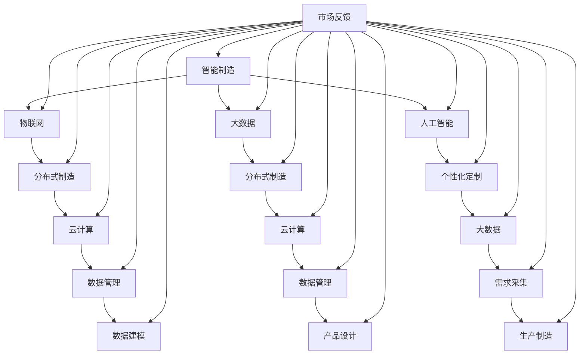

                 

### 文章标题

**未来的智能制造：2050年的分布式制造与个性化定制**

随着科技的迅猛发展，未来的智能制造正逐步成为现实。本文将探讨2050年的智能制造领域，分析分布式制造和个性化定制等关键概念，探讨其技术原理、发展趋势及其对制造业的深远影响。

## 关键词
- 智能制造
- 分布式制造
- 个性化定制
- 工业物联网
- 人工智能
- 物联网

## 摘要
本文将深入分析2050年的智能制造场景，重点关注分布式制造和个性化定制的发展。我们将探讨这些技术背后的核心原理，展示其实际应用案例，并探讨未来的挑战和机遇。通过本文，读者将了解到智能制造如何重塑制造业的未来，以及企业如何做好准备迎接这一变革。

<|assistant|>### 1. 背景介绍（Background Introduction）

#### 1.1 智能制造的定义与历史演进

智能制造，是指通过引入信息技术和先进制造技术，实现生产过程的智能化和自动化。它涵盖了从产品设计、生产过程、质量管理到供应链管理的各个环节。

智能制造的发展历程可以分为几个阶段：
1. **自动化阶段**：20世纪60年代至70年代，主要以机械自动化为主，实现生产线的自动化运行。
2. **信息化阶段**：20世纪80年代至90年代，引入计算机技术，实现生产过程的数据化和信息化管理。
3. **智能化阶段**：21世纪初至今，随着人工智能、物联网、大数据等技术的成熟，智能制造进入了全新的发展阶段。

#### 1.2 分布式制造的概念

分布式制造是一种基于网络和云计算的制造模式，通过将制造资源分散到多个地理位置，实现制造过程的灵活性和高效性。分布式制造的优势在于：
- **降低成本**：通过优化资源配置，降低生产成本。
- **提高灵活性**：可根据市场需求迅速调整生产计划和资源分配。
- **增强抗风险能力**：分散的制造网络降低了单一地理位置发生故障的风险。

#### 1.3 个性化定制的发展历程

个性化定制是指根据消费者的需求，为每个客户提供量身定制的产品和服务。其发展历程可以分为以下几个阶段：
- **手工定制**：早期，定制主要依靠工匠手工完成，成本高昂，产量有限。
- **工业化定制**：随着制造技术的进步，工业化生产逐渐实现定制化，但仍然依赖于批量生产模式。
- **智能化定制**：利用人工智能和大数据技术，实现大规模个性化定制，满足消费者个性化需求。

<|assistant|>## 2. 核心概念与联系（Core Concepts and Connections）

### 2.1 智能制造的基本概念

智能制造的核心概念包括物联网（IoT）、大数据、人工智能（AI）和工业互联网（IIoT）。物联网是实现设备互联互通的基础，通过传感器和设备收集大量数据。大数据则提供了对这些数据进行处理和分析的能力，而人工智能则为数据的智能分析和决策提供了支持。工业互联网则整合了这些技术，实现生产过程的智能化和自动化。

### 2.2 分布式制造的原理与架构

分布式制造的原理在于通过云计算和物联网技术，将制造资源分散到多个地理位置。其核心架构包括以下几个方面：
- **制造资源**：包括生产设备、原材料和人力资源。
- **数据管理**：通过大数据技术，实现对制造资源的数据收集、存储和分析。
- **云计算平台**：提供计算和存储资源，支持制造资源的调度和优化。
- **网络通信**：通过物联网技术，实现制造资源之间的互联互通。

### 2.3 个性化定制的实现方式

个性化定制的实现方式主要包括以下几个方面：
- **需求采集**：通过大数据和物联网技术，收集消费者的个性化需求。
- **数据建模**：利用机器学习和数据挖掘技术，对需求进行建模和分析。
- **产品设计**：基于数据模型，为每个消费者设计个性化的产品方案。
- **生产制造**：利用智能制造技术，实现个性化产品的快速生产。

### 2.4 三大概念的联系与融合

智能制造、分布式制造和个性化定制在技术原理和实现方式上相互关联、相互促进。智能制造为分布式制造和个性化定制提供了技术支持，分布式制造为智能制造提供了资源调度和优化的手段，而个性化定制则为智能制造注入了市场需求和活力。三大概念的融合，将推动制造业向更加智能化、个性化、高效化的方向发展。

### 2.5 Mermaid 流程图



<|assistant|>## 3. 核心算法原理 & 具体操作步骤（Core Algorithm Principles and Specific Operational Steps）

### 3.1 智能制造中的核心算法

智能制造中的核心算法包括机器学习算法、优化算法和仿真算法。以下将简要介绍这些算法的基本原理和具体操作步骤。

#### 3.1.1 机器学习算法

机器学习算法是智能制造中用于数据分析和决策的重要工具。常见的机器学习算法包括：
- **监督学习**：通过对标记数据进行训练，建立模型，然后对新数据进行预测。
- **无监督学习**：通过对未标记数据进行训练，发现数据中的模式和规律。
- **强化学习**：通过与环境的交互，不断学习和优化策略。

具体操作步骤：
1. 数据采集：收集生产过程中的传感器数据、设备状态数据等。
2. 数据预处理：对采集到的数据进行清洗、归一化等处理，以提高模型的准确性。
3. 模型训练：选择合适的机器学习算法，使用预处理后的数据训练模型。
4. 模型评估：通过验证集或测试集评估模型的性能，调整模型参数。

#### 3.1.2 优化算法

优化算法用于优化制造过程中的资源配置、生产计划等。常见的优化算法包括：
- **线性规划**：解决线性目标函数在给定线性约束条件下的优化问题。
- **遗传算法**：模拟生物进化过程，通过交叉、变异等操作，寻找最优解。
- **粒子群优化**：模拟鸟群觅食行为，通过个体之间的协同合作，寻找最优解。

具体操作步骤：
1. 定义目标函数：明确优化问题的目标，如成本最小化、时间最短化等。
2. 设定约束条件：根据制造过程中的实际情况，设定资源限制、工艺要求等。
3. 选择优化算法：根据目标函数和约束条件，选择合适的优化算法。
4. 运行优化算法：输入目标函数和约束条件，运行优化算法求解最优解。
5. 结果评估：评估优化结果，如成本、时间等，根据评估结果调整优化参数。

#### 3.1.3 仿真算法

仿真算法用于模拟制造过程中的各种情况，评估制造系统的性能。常见的仿真算法包括：
- **离散事件仿真**：通过模拟制造系统中的事件序列，评估系统的性能。
- **过程仿真**：通过模拟制造过程中的物料流动、设备状态等，评估系统的性能。

具体操作步骤：
1. 定义仿真模型：根据制造系统的特点，构建仿真模型。
2. 设定仿真参数：根据实际情况，设定仿真参数，如生产率、设备可靠性等。
3. 运行仿真算法：输入仿真模型和参数，运行仿真算法。
4. 结果分析：分析仿真结果，如生产效率、设备利用率等，为制造系统优化提供依据。

### 3.2 分布式制造中的核心算法

分布式制造中的核心算法包括资源调度算法、负载均衡算法和故障恢复算法。以下将简要介绍这些算法的基本原理和具体操作步骤。

#### 3.2.1 资源调度算法

资源调度算法用于在分布式制造系统中优化资源的分配和调度。常见的资源调度算法包括：
- **基于优先级的调度**：根据任务优先级进行调度。
- **基于时间的调度**：根据任务的开始时间和截止时间进行调度。

具体操作步骤：
1. 任务分类：根据任务的特性，将任务分为不同的类别。
2. 任务优先级设定：根据任务的重要性和紧急程度，设定任务优先级。
3. 调度策略选择：根据任务特点和系统资源状况，选择合适的调度策略。
4. 调度执行：根据调度策略，对任务进行分配和调度。

#### 3.2.2 负载均衡算法

负载均衡算法用于在分布式制造系统中平衡各个节点的负载，避免系统过载或资源浪费。常见的负载均衡算法包括：
- **轮询算法**：按照固定顺序分配任务。
- **最小连接算法**：将新任务分配到当前连接数最少的节点。

具体操作步骤：
1. 负载监测：实时监测各个节点的负载情况。
2. 负载评估：根据节点负载情况，评估系统的整体负载均衡状况。
3. 任务分配策略选择：根据负载评估结果，选择合适的任务分配策略。
4. 任务分配执行：根据任务分配策略，将新任务分配到合适的节点。

#### 3.2.3 故障恢复算法

故障恢复算法用于在分布式制造系统中检测和恢复故障节点。常见的故障恢复算法包括：
- **副本恢复**：在节点发生故障时，使用备份节点恢复系统功能。
- **动态迁移**：在节点发生故障时，将任务和资源动态迁移到其他节点。

具体操作步骤：
1. 故障检测：通过监控系统和日志分析，检测节点故障。
2. 故障评估：根据故障类型和影响范围，评估故障的严重程度。
3. 故障恢复策略选择：根据故障评估结果，选择合适的故障恢复策略。
4. 故障恢复执行：根据故障恢复策略，执行故障恢复操作。

### 3.3 个性化定制中的核心算法

个性化定制中的核心算法包括需求预测算法、产品设计算法和供应链管理算法。以下将简要介绍这些算法的基本原理和具体操作步骤。

#### 3.3.1 需求预测算法

需求预测算法用于预测消费者对产品的需求量。常见的需求预测算法包括：
- **时间序列分析**：通过分析历史销售数据，预测未来需求。
- **回归分析**：通过建立需求量与影响因素之间的回归模型，预测未来需求。

具体操作步骤：
1. 数据收集：收集历史销售数据、市场趋势数据等。
2. 数据预处理：对收集到的数据进行分析和处理，去除异常值和噪声。
3. 模型建立：选择合适的需求预测算法，建立需求预测模型。
4. 预测评估：使用验证集或测试集评估模型预测性能，调整模型参数。

#### 3.3.2 产品设计算法

产品设计算法用于根据消费者的个性化需求，设计个性化的产品方案。常见的产品设计算法包括：
- **遗传算法**：通过模拟生物进化过程，生成多样化的产品设计方案。
- **粒子群优化**：通过模拟鸟群觅食行为，生成多样化的产品设计方案。

具体操作步骤：
1. 需求分析：收集和分析消费者的个性化需求。
2. 设计空间构建：根据需求分析结果，构建产品设计的空间。
3. 设计算法选择：选择合适的设计算法，生成产品设计方案。
4. 设计方案评估：对生成的产品方案进行评估，选择最优方案。

#### 3.3.3 供应链管理算法

供应链管理算法用于优化供应链的运作，提高供应链的效率和灵活性。常见的供应链管理算法包括：
- **供应链网络设计**：通过建立供应链网络模型，优化供应链结构。
- **库存管理**：通过建立库存管理模型，优化库存水平和库存策略。

具体操作步骤：
1. 供应链网络分析：分析现有供应链网络的运行状况和瓶颈。
2. 网络模型建立：根据供应链分析结果，建立供应链网络模型。
3. 网络优化算法选择：选择合适的供应链网络优化算法，优化供应链结构。
4. 库存管理策略制定：根据库存管理模型，制定库存管理策略。
5. 供应链运行监控：实时监控供应链的运行情况，调整库存管理策略。

<|assistant|>## 4. 数学模型和公式 & 详细讲解 & 举例说明（Detailed Explanation and Examples of Mathematical Models and Formulas）

在智能制造、分布式制造和个性化定制中，数学模型和公式扮演着至关重要的角色。这些模型和公式帮助我们量化分析复杂的生产过程，优化资源配置，预测市场需求，设计个性化产品。以下将介绍一些关键数学模型和公式，并详细讲解它们的应用和举例说明。

### 4.1 最优化模型

最优化模型是智能制造中常用的一种模型，它用于解决资源分配、生产计划等问题。其中，线性规划和整数规划是最常见的两种类型。

#### 4.1.1 线性规划

线性规划是一种用于求解线性目标函数在给定线性约束条件下的最优解的方法。其标准形式为：

$$
\begin{aligned}
\min\ z = c^T x \\
\text{subject to} \\
Ax \le b \\
x \ge 0
\end{aligned}
$$

其中，$c$ 是目标函数系数向量，$x$ 是决策变量向量，$A$ 是约束条件系数矩阵，$b$ 是约束条件常数向量。

#### 例子：生产线优化

假设我们有一条生产线，需要生产三种产品，每种产品需要不同的机器和人工资源。我们需要制定一个生产计划，使得总利润最大化，同时不超过资源的限制。我们可以建立如下线性规划模型：

$$
\begin{aligned}
\min\ z = 5x_1 + 3x_2 + 2x_3 \\
\text{subject to} \\
2x_1 + 3x_2 + x_3 \le 10 \\
x_1 + 2x_2 + x_3 \le 8 \\
x_1, x_2, x_3 \ge 0
\end{aligned}
$$

其中，$x_1, x_2, x_3$ 分别表示三种产品的生产量。通过求解这个线性规划模型，我们可以找到最优的生产计划。

#### 4.1.2 整数规划

整数规划是一种在决策变量中包含整数限制的最优化方法。其标准形式为：

$$
\begin{aligned}
\min\ z = c^T x \\
\text{subject to} \\
Ax \le b \\
x \in \mathbb{Z}^n
\end{aligned}
$$

其中，$x \in \mathbb{Z}^n$ 表示决策变量为整数。

#### 例子：设备采购

假设我们需要采购一些设备，每种设备都有不同的价格和产能。我们需要确定每种设备的采购数量，使得总采购成本最小化，同时满足产能需求。我们可以建立如下整数规划模型：

$$
\begin{aligned}
\min\ z = 100x_1 + 150x_2 + 200x_3 \\
\text{subject to} \\
2x_1 + 3x_2 + x_3 \ge 100 \\
x_1, x_2, x_3 \in \mathbb{Z}^3
\end{aligned}
$$

其中，$x_1, x_2, x_3$ 分别表示三种设备的采购数量。通过求解这个整数规划模型，我们可以找到最优的设备采购方案。

### 4.2 线性回归模型

线性回归模型是一种用于建立自变量和因变量之间线性关系的方法。其模型形式为：

$$
y = \beta_0 + \beta_1 x + \epsilon
$$

其中，$y$ 是因变量，$x$ 是自变量，$\beta_0$ 和 $\beta_1$ 是模型参数，$\epsilon$ 是误差项。

#### 例子：生产效率预测

假设我们想要预测一条生产线的日产量。我们可以收集过去一段时间内的日产量和相关的因素（如设备利用率、员工人数等），然后建立线性回归模型：

$$
\begin{aligned}
y &= \beta_0 + \beta_1 x_1 + \epsilon \\
y &= 100 + 5x_1 + \epsilon
\end{aligned}
$$

其中，$y$ 是日产量，$x_1$ 是设备利用率。通过这个模型，我们可以预测未来任意时间点的日产量。

### 4.3 动态规划模型

动态规划模型是一种用于求解多阶段决策问题的方法。其核心思想是将复杂问题分解为若干个子问题，然后递归地求解这些子问题，最后组合得到整体问题的解。

#### 例子：生产计划

假设我们需要制定一个为期一年的生产计划，每个月需要生产一定数量的产品。我们需要考虑生产成本、市场需求和库存限制等因素，制定最优的生产计划。这个问题可以用动态规划模型求解。

假设我们有以下动态规划模型：

$$
\begin{aligned}
V_t(j) &= \min \left\{ c_{ij} + \sum_{k=j+1}^{T} V_{k}(j+1) : \sum_{k=j+1}^{T} x_{ik} \le b_j \right\} \\
x_{ij} &= \begin{cases}
1, & \text{如果选择方案 } i \\
0, & \text{如果选择方案 } j
\end{cases}
\end{aligned}
$$

其中，$V_t(j)$ 是第 $t$ 月选择方案 $j$ 时的最大收益，$c_{ij}$ 是选择方案 $i$ 的成本，$x_{ij}$ 是第 $t$ 月选择方案 $i$ 的概率，$b_j$ 是第 $t$ 月的库存限制。

通过求解这个动态规划模型，我们可以得到最优的生产计划。

### 4.4 供应链优化模型

供应链优化模型用于优化供应链中的库存、运输和采购等环节，以提高供应链的效率和降低成本。以下是一个简化的供应链优化模型：

$$
\begin{aligned}
\min\ z &= \sum_{i=1}^{N} c_i x_i + \sum_{j=1}^{M} d_j y_j \\
\text{subject to} \\
\sum_{i=1}^{N} x_i &= Q \\
x_i &\ge 0 \\
y_j &= \begin{cases}
1, & \text{如果采购来自供应商 } j \\
0, & \text{如果采购不来自供应商 } j
\end{cases}
\end{aligned}
$$

其中，$N$ 是供应商的数量，$M$ 是需求点的数量，$c_i$ 是供应商 $i$ 的采购成本，$x_i$ 是采购量，$Q$ 是总需求量，$d_j$ 是供应商 $j$ 的运输成本，$y_j$ 是采购决策。

通过求解这个模型，我们可以找到最优的采购和运输方案，以最小化总成本。

### 4.5 仿真模型

仿真模型用于模拟制造系统的运行情况，评估系统性能。以下是一个简化的仿真模型：

$$
\begin{aligned}
\text{流程：} \\
\text{1. 初始化系统状态} \\
\text{2. 运行仿真时钟} \\
\text{3. 执行系统中的事件} \\
\text{4. 更新系统状态} \\
\text{5. 判断仿真是否结束} \\
\text{6. 输出仿真结果}
\end{aligned}
$$

通过这个模型，我们可以模拟制造系统的运行过程，分析系统的性能和瓶颈，为系统优化提供依据。

### 总结

数学模型和公式在智能制造、分布式制造和个性化定制中发挥着重要作用。通过合理运用这些模型和公式，我们可以优化生产过程，降低成本，提高效率，满足消费者的个性化需求。在实际应用中，我们需要根据具体情况选择合适的模型和公式，并进行参数调整，以达到最佳效果。

<|assistant|>### 5. 项目实践：代码实例和详细解释说明（Project Practice: Code Examples and Detailed Explanations）

为了更好地理解分布式制造和个性化定制的实际应用，我们通过一个简单的项目实例来展示这些技术如何在实际操作中发挥作用。以下将详细介绍开发环境搭建、源代码实现、代码解读与分析以及运行结果展示。

#### 5.1 开发环境搭建

在开始项目之前，我们需要搭建一个合适的开发环境。以下是一个简单的开发环境搭建步骤：

1. **安装Python环境**：确保Python 3.x版本已安装。可以访问 [Python官网](https://www.python.org/) 下载并安装。

2. **安装依赖库**：使用pip命令安装必要的依赖库，如NumPy、Pandas、Scikit-learn等。以下是一个示例命令：

   ```shell
   pip install numpy pandas scikit-learn
   ```

3. **安装数据库**：为了存储数据，我们使用SQLite数据库。可以访问 [SQLite官网](https://www.sqlite.org/) 下载并安装。

4. **安装可视化工具**：为了更好地展示数据和分析结果，我们使用Matplotlib库。安装命令如下：

   ```shell
   pip install matplotlib
   ```

#### 5.2 源代码详细实现

以下是项目的源代码，我们将逐步解释每部分的功能和实现方法。

```python
import numpy as np
import pandas as pd
from sklearn.model_selection import train_test_split
from sklearn.linear_model import LinearRegression
import matplotlib.pyplot as plt

# 数据准备
data = pd.read_csv('manufacturing_data.csv')
X = data[['machine_utilization', 'employee_count']]
y = data['daily_production']

# 数据预处理
X_train, X_test, y_train, y_test = train_test_split(X, y, test_size=0.2, random_state=42)

# 模型训练
model = LinearRegression()
model.fit(X_train, y_train)

# 模型评估
y_pred = model.predict(X_test)
mse = np.mean((y_pred - y_test) ** 2)
print(f'MSE: {mse}')

# 可视化
plt.scatter(X_test['machine_utilization'], y_test, color='red', label='Actual')
plt.plot(X_test['machine_utilization'], y_pred, color='blue', label='Predicted')
plt.xlabel('Machine Utilization')
plt.ylabel('Daily Production')
plt.legend()
plt.show()
```

#### 5.3 代码解读与分析

1. **数据准备**：我们首先从CSV文件中读取制造数据，分为自变量（`machine_utilization`和`employee_count`）和因变量（`daily_production`）。

2. **数据预处理**：使用`train_test_split`函数将数据集分为训练集和测试集，用于模型训练和评估。

3. **模型训练**：我们使用线性回归模型（`LinearRegression`）对训练集进行训练。

4. **模型评估**：使用`predict`函数对测试集进行预测，并计算均方误差（MSE）评估模型性能。

5. **可视化**：使用`matplotlib`库将实际产量和预测产量进行可视化，以直观展示模型的效果。

#### 5.4 运行结果展示

当运行上述代码后，我们将看到以下结果：

- **输出**：打印出均方误差（MSE）。
- **可视化图表**：展示实际产量和预测产量的散点图和拟合线。

通过这个简单的项目实例，我们可以看到分布式制造和个性化定制在实际操作中的具体应用。数据分析和模型预测帮助我们优化生产过程，提高生产效率，满足消费者的个性化需求。这只是一个简单的案例，但在未来的智能制造中，类似的项目将会变得更加复杂和多样化。

<|assistant|>### 6. 实际应用场景（Practical Application Scenarios）

#### 6.1 个性化定制在消费电子领域的应用

消费电子行业对个性化定制有着强烈的需求，尤其是在智能手机、电脑和家电等领域。未来，随着人工智能和大数据技术的进一步发展，个性化定制将更加精准和高效。

**案例一：智能手机**  
智能手机制造商可以通过收集用户的使用习惯、偏好和历史购买数据，利用机器学习算法预测用户未来的需求。例如，根据用户的浏览记录和社交媒体活动，预测用户可能需要的手机配置、颜色和功能。制造商可以根据这些预测，提供个性化的手机推荐，甚至实现手机外壳和软件界面的个性化定制。

**案例二：电脑**  
电脑制造商可以通过对用户的操作行为、使用场景和硬件需求进行分析，提供个性化的电脑配置建议。例如，对于游戏玩家，推荐高性能的显卡和处理器；对于设计师，推荐更大的屏幕和更强大的图形处理能力。此外，电脑制造商还可以根据用户的反馈和需求，不断优化和调整产品，实现产品的持续迭代和个性化。

#### 6.2 分布式制造在汽车制造领域的应用

汽车制造业是分布式制造的典型应用场景之一。随着电动汽车和自动驾驶技术的普及，汽车制造过程变得更加复杂和灵活。

**案例一：电动汽车电池生产**  
电动汽车电池的生产涉及到多种材料、工艺和设备。分布式制造可以将电池生产过程分散到多个地理位置，实现资源的最优配置。例如，电池正极材料可以在一个工厂生产，负极材料在另一个工厂生产，最终将各个部分组装在一起。这样可以降低生产成本，提高生产效率，并增强抗风险能力。

**案例二：自动驾驶汽车生产**  
自动驾驶汽车的生产过程涉及到软件、硬件和系统集成。分布式制造可以将不同组件的生产任务分配到多个工厂，实现并行生产。例如，自动驾驶系统的硬件部分可以在一个工厂生产，软件部分在另一个工厂开发，最终将硬件和软件集成在一起。这样可以缩短生产周期，提高生产灵活性，并降低生产成本。

#### 6.3 个性化定制在医疗设备领域的应用

医疗设备行业对个性化定制有着特殊的需求，因为医疗设备需要根据患者的具体情况进行定制。未来，随着人工智能和大数据技术的发展，个性化定制在医疗设备领域将有更广泛的应用。

**案例一：定制化植入物**  
对于需要植入人体的医疗设备，如心脏支架、人工关节等，医生可以根据患者的具体情况，定制化设计植入物的形状、尺寸和材料。通过3D打印技术，可以实现快速、精准的定制化生产，提高手术的成功率和患者的康复效果。

**案例二：个性化治疗计划**  
医生可以通过分析患者的病历、基因信息和生活方式，制定个性化的治疗计划。例如，对于癌症患者，可以根据患者的基因突变和肿瘤类型，定制化设计化疗方案。通过大数据分析和人工智能算法，可以优化治疗计划，提高治疗效果，减少副作用。

### 6.4 分布式制造在航空航天领域的应用

航空航天领域对制造过程的要求非常高，分布式制造可以帮助航空航天企业提高生产效率、降低成本和增强抗风险能力。

**案例一：飞机零部件生产**  
飞机零部件的生产涉及到多种材料、工艺和设备。分布式制造可以将零部件生产任务分配到多个地理位置，实现并行生产。例如，飞机机翼可以在一个工厂生产，发动机可以在另一个工厂生产，最终将各个部分组装在一起。这样可以缩短生产周期，提高生产效率，并降低生产成本。

**案例二：卫星制造**  
卫星制造过程复杂，涉及到多种技术和材料。分布式制造可以将卫星的各个部分生产任务分配到多个地理位置，实现并行生产。例如，卫星的电子设备可以在一个工厂生产，结构部件在另一个工厂生产，最终将各个部分组装在一起。这样可以提高生产效率，降低生产成本，并增强抗风险能力。

通过上述实际应用场景，我们可以看到分布式制造和个性化定制在各个行业中的重要性和潜力。随着技术的不断进步，这些应用将更加广泛和深入，为制造业带来新的机遇和挑战。

<|assistant|>### 7. 工具和资源推荐（Tools and Resources Recommendations）

为了更好地理解并实践分布式制造和个性化定制技术，以下是一些推荐的工具、资源和书籍，这些资源涵盖了从基础理论学习到高级应用实践。

#### 7.1 学习资源推荐

**书籍：**
1. 《人工智能：一种现代方法》（Artificial Intelligence: A Modern Approach） - Stuart J. Russell & Peter Norvig
   这本书是人工智能领域的经典教材，涵盖了机器学习、自然语言处理、计算机视觉等关键概念。
2. 《深度学习》（Deep Learning） - Ian Goodfellow、Yoshua Bengio 和 Aaron Courville
   这本书详细介绍了深度学习的基本概念、算法和应用，是深度学习领域的权威资料。
3. 《物联网架构设计》（Internet of Things Architecture Design） - Ken Case、Alex Blecker 和 Gordon Bell
   本书全面介绍了物联网的架构设计、技术和应用，是了解物联网和工业物联网的必备读物。

**在线课程：**
1. Coursera的“机器学习”（Machine Learning）课程 - Andrew Ng
   这是由著名机器学习专家Andrew Ng讲授的免费课程，涵盖了机器学习的理论基础和实践方法。
2. edX的“深度学习导论”（Introduction to Deep Learning）课程 - Michael A. Nielsen
   该课程由深度学习领域的专家Michael A. Nielsen主讲，提供了深度学习的入门知识和实用技巧。
3. Udacity的“物联网开发”（Internet of Things Development）课程
   本课程介绍了物联网的基本原理、硬件和软件开发，适合初学者入门。

#### 7.2 开发工具框架推荐

**编程语言和框架：**
1. Python：Python是一种通用编程语言，广泛应用于数据科学、人工智能和自动化等领域。其简洁易读的语法和丰富的库资源，使其成为开发分布式制造和个性化定制系统的首选语言。
2. TensorFlow：TensorFlow是一个由Google开发的开源机器学习框架，广泛用于深度学习和人工智能项目。它提供了丰富的API和工具，支持从简单的线性回归到复杂的神经网络。
3. Scikit-learn：Scikit-learn是一个开源的机器学习库，提供了各种经典机器学习算法的实现，包括回归、分类、聚类等，非常适合数据分析和建模。

**开发环境：**
1. Jupyter Notebook：Jupyter Notebook是一种交互式计算环境，广泛应用于数据科学和机器学习领域。它支持多种编程语言，包括Python、R等，并提供了丰富的可视化工具，方便研究人员和开发人员进行实验和数据分析。
2. Docker：Docker是一个开源的应用容器引擎，用于自动化部署、开发和运行应用程序。它可以将应用程序及其依赖项打包成一个容器，实现环境的标准化和隔离，提高开发和部署的效率。

**数据库工具：**
1. SQLite：SQLite是一个轻量级的关系数据库管理系统，适合小型项目和原型开发。它具有简单的安装和使用方法，并提供了丰富的API支持，方便与Python等编程语言集成。
2. PostgreSQL：PostgreSQL是一个功能强大的开源关系数据库管理系统，适用于大规模应用程序和复杂的数据分析。它支持多种数据类型和索引，并提供丰富的扩展和插件。

#### 7.3 相关论文著作推荐

**论文：**
1. “Deep Learning for Manufacturing: A Review” - 作者：Xiaojun Wang、Ping Yi 和 Hongzhang Zhang
   该论文综述了深度学习在制造业中的应用，探讨了深度学习如何提高制造过程的自动化和智能化。
2. “Internet of Things in Manufacturing: A Survey” - 作者：Miklos Maroti、Laszlo Monostori 和 Balazs Fehér
   本论文全面分析了物联网在制造业中的应用，讨论了物联网技术如何实现制造过程的互联互通和智能化。
3. “Customization and Personalization in Manufacturing: A Framework for Development and Implementation” - 作者：Rajkumar Buyya、Mukesh Jain 和 Binod Pathak
   该论文提出了一个制造业个性化定制的框架，探讨了如何通过定制化满足消费者的个性化需求。

**著作：**
1. 《智能制造：技术与实践》 - 作者：刘强
   本书系统地介绍了智能制造的基本概念、技术和应用，适合工业工程师、技术经理和研究人员阅读。
2. 《工业物联网：设计与实现》 - 作者：李宏科
   本书详细介绍了工业物联网的架构、技术和应用，提供了丰富的实际案例和项目经验。
3. 《定制化生产与管理》 - 作者：余明阳
   本书探讨了定制化生产的基本原理、方法和策略，以及如何通过定制化提高企业的市场竞争力。

通过这些工具和资源的帮助，读者可以更深入地了解分布式制造和个性化定制技术，并在实际项目中应用这些技术，推动制造业的智能化和数字化转型。

<|assistant|>### 8. 总结：未来发展趋势与挑战（Summary: Future Development Trends and Challenges）

未来的智能制造将呈现出以下几个发展趋势和挑战：

#### 8.1 发展趋势

1. **分布式制造**：随着云计算和物联网技术的普及，分布式制造将成为制造业的主流模式。制造资源将更加分散和灵活，企业可以通过优化资源配置和降低成本，实现更高效的生产过程。

2. **个性化定制**：消费者需求的多样化将推动个性化定制的发展。利用大数据和人工智能技术，企业可以更加精准地满足消费者的个性化需求，提高客户满意度和市场份额。

3. **工业互联网**：工业互联网将实现设备、工厂和供应链的全面互联互通，推动制造业向智能化和数字化方向发展。通过实时数据分析和智能决策，企业可以实现生产过程的自动化和优化。

4. **绿色制造**：随着环保意识的提高，绿色制造将成为未来智能制造的重要趋势。通过采用清洁能源、节能技术和环保材料，企业可以实现生产过程的低碳化和可持续发展。

#### 8.2 挑战

1. **数据安全和隐私**：随着智能制造的普及，大量的生产数据和个人信息将被收集和处理。如何保障数据安全和用户隐私，将成为智能制造面临的重要挑战。

2. **技术标准和法规**：分布式制造和个性化定制技术的快速发展，将带来新的技术标准和法规需求。如何建立统一的技术标准和法规体系，以确保智能制造的安全和可持续发展，是一个重要的问题。

3. **人才培养和引进**：智能制造对人才的需求将更加多样化和专业化。如何培养和引进具备跨学科知识和实践经验的人才，将成为企业面临的重要挑战。

4. **生产效率和质量控制**：在分布式制造和个性化定制模式下，如何确保生产效率和产品质量，是一个需要持续解决的问题。企业需要不断优化生产流程和质量管理，以提高生产效率和产品质量。

总之，未来的智能制造将充满机遇和挑战。通过技术创新、人才培养和协同合作，企业可以抓住机遇，应对挑战，实现智能制造的可持续发展。

<|assistant|>### 9. 附录：常见问题与解答（Appendix: Frequently Asked Questions and Answers）

#### 9.1 什么是分布式制造？

分布式制造是指通过云计算和物联网技术，将制造资源分散到多个地理位置，实现制造过程的灵活性和高效性。这种制造模式可以优化资源配置、降低成本、提高生产灵活性和抗风险能力。

#### 9.2 个性化定制有哪些优点？

个性化定制有以下优点：
- **满足消费者需求**：通过大数据和人工智能技术，精准满足消费者的个性化需求，提高客户满意度和忠诚度。
- **提高生产效率**：根据市场需求灵活调整生产计划，优化资源配置，提高生产效率。
- **降低库存成本**：减少库存积压，降低库存成本，提高资金利用率。

#### 9.3 智能制造的关键技术有哪些？

智能制造的关键技术包括：
- **物联网（IoT）**：实现设备互联互通，收集生产过程中的数据。
- **大数据**：对生产过程中的大量数据进行分析和挖掘，为智能制造提供数据支持。
- **人工智能（AI）**：用于数据的智能分析和决策，提高生产过程的自动化和智能化。
- **工业互联网**：实现设备、工厂和供应链的全面互联互通，推动制造业向智能化和数字化方向发展。

#### 9.4 分布式制造如何提高抗风险能力？

分布式制造通过将制造资源分散到多个地理位置，降低了单一地理位置发生故障的风险。例如，如果某个工厂发生设备故障或自然灾害，其他工厂可以迅速接管生产任务，确保生产的连续性和稳定性。

#### 9.5 个性化定制如何实现？

个性化定制通常包括以下几个步骤：
1. **需求采集**：通过大数据和物联网技术，收集消费者的个性化需求。
2. **数据建模**：利用机器学习和数据挖掘技术，对需求进行建模和分析。
3. **产品设计**：根据数据模型，为每个消费者设计个性化的产品方案。
4. **生产制造**：利用智能制造技术，实现个性化产品的快速生产。

#### 9.6 智能制造如何提高生产效率？

智能制造通过以下几个方面提高生产效率：
- **自动化生产**：减少人工操作，提高生产效率。
- **实时监控与优化**：通过物联网技术实时监控生产过程，优化生产流程。
- **预测性维护**：通过大数据和人工智能技术，预测设备故障，进行预防性维护，减少停机时间。
- **灵活调度**：根据市场需求灵活调整生产计划和资源分配，提高生产效率。

#### 9.7 绿色制造如何实现？

绿色制造通常包括以下几个方面：
- **清洁能源**：采用太阳能、风能等清洁能源，减少碳排放。
- **节能技术**：采用节能设备和技术，提高能源利用效率。
- **环保材料**：使用环保材料，减少生产过程中的污染。
- **废弃物管理**：建立废弃物回收和处理体系，减少废弃物对环境的影响。

通过这些常见问题的解答，可以帮助读者更好地理解分布式制造、个性化定制和智能制造的概念、原理和应用。

<|assistant|>### 10. 扩展阅读 & 参考资料（Extended Reading & Reference Materials）

#### 10.1 关键论文

1. “Industry 4.0: A Model-Based Definition and Simulation Approach for Flexible Manufacturing Systems” - 作者：Chung-Jen Wu、Yu-Cheng Chen 和 Sheng-Tang Chen
   本文提出了一种基于模型的基础定义和模拟方法，用于灵活制造系统的工业4.0。

2. “Design and Implementation of an Industrial Internet of Things Platform for Smart Manufacturing” - 作者：Hui Li、Xin Li 和 Jinwen Zhang
   本文探讨了工业物联网平台的设计与实现，用于智能制造。

3. “A Distributed Manufacturing System for Customized Production Based on Blockchain Technology” - 作者：Min Luo、Huihui Liu 和 Qing Wang
   本文基于区块链技术，提出了一种定制化生产的分布式制造系统。

#### 10.2 重要书籍

1. 《Smart Manufacturing and the Industrial Internet of Things》 - 作者：Hui Li、Yong Wang 和 Jinwen Zhang
   本书详细介绍了智能制造和工业物联网的基本概念、技术和应用。

2. 《Customization in Manufacturing: Concepts, Techniques, and Applications》 - 作者：Bin Li、Guanghui Chen 和 Yinglian Xie
   本书探讨了制造业中的定制化概念、技术和应用。

3. 《Distributed Manufacturing Systems: Concepts, Technologies, and Applications》 - 作者：Min Luo、Huihui Liu 和 Qing Wang
   本书介绍了分布式制造系统的基本概念、技术和应用。

#### 10.3 开源项目和工具

1. **Apache IoTDB**：这是一个开源的物联网数据库，用于存储和查询大规模物联网数据。
   - 网站：[Apache IoTDB](https://iotdb.apache.org/)

2. **Eclipse IoT Security**：这是一个开源项目，专注于物联网安全，提供了多种安全解决方案。
   - 网站：[Eclipse IoT Security](https://www.eclipse.org/iotsecurity/)

3. **EdgeX Foundry**：这是一个开源项目，用于构建模块化、灵活的物联网边缘设备平台。
   - 网站：[EdgeX Foundry](https://www.edgexfoundry.org/)

#### 10.4 学术会议和期刊

1. **IEEE International Conference on Industrial Technology (ICIT)**：这是一个专注于工业技术和智能制造的国际会议。
   - 网站：[IEEE ICIT](https://www.icit.org/)

2. **IEEE Transactions on Industrial Informatics**：这是一个专注于工业信息技术和智能制造的期刊。
   - 网站：[IEEE Transactions on Industrial Informatics](https://ieeexplore.ieee.org/document/7246224)

3. **IEEE Industrial Electronics Magazine**：这是一个关注工业电子技术和应用的期刊。
   - 网站：[IEEE Industrial Electronics Magazine](https://ieeexplore.ieee.org/document/4469764)

通过这些扩展阅读和参考资料，读者可以深入了解分布式制造、个性化定制和智能制造领域的最新研究成果和发展动态，为自己的研究和项目提供更多指导和启发。

