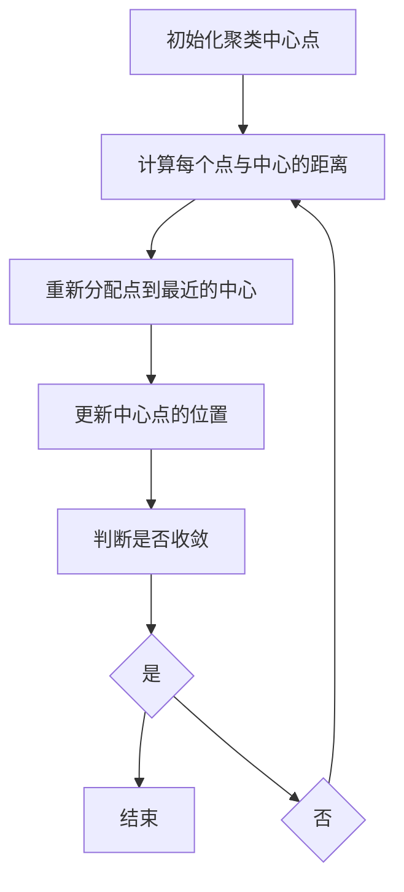
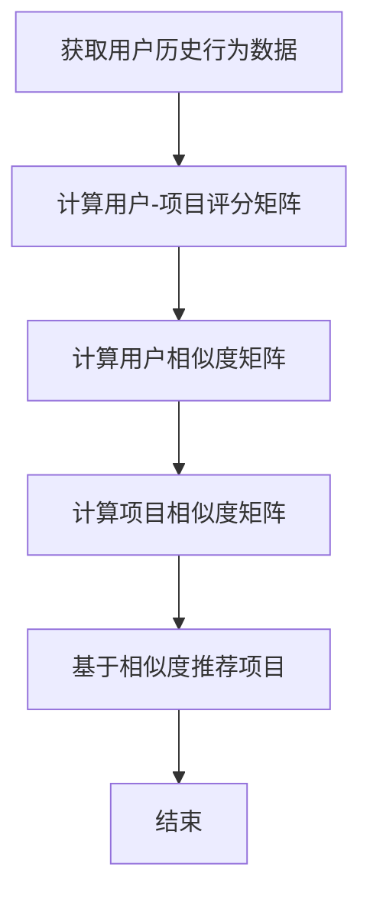
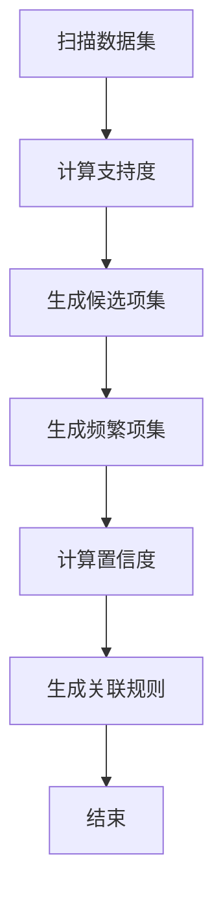
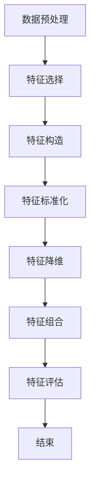

                 

### 1. 背景介绍（Background Introduction）

客户细分是市场营销中的一项重要策略，通过将客户群体划分为不同的细分市场，企业可以更有效地针对每个细分市场的需求提供个性化的产品和服务，从而提高客户满意度和忠诚度。随着大数据和人工智能技术的迅猛发展，机器学习在客户细分中的应用日益广泛。本文将探讨机器学习在客户细分中的关键作用、核心算法原理、实际应用案例以及未来发展趋势。

客户细分（Customer Segmentation）是指根据不同特征和需求，将客户群体划分为若干个子群体，以便企业能够更精准地满足不同客户群体的需求。传统的客户细分方法主要依赖于统计分析，如聚类分析和因子分析。然而，这些方法往往受到数据量、数据质量和计算资源的限制。随着机器学习技术的发展，尤其是深度学习和数据挖掘算法的进步，客户细分变得更加高效和智能化。

机器学习（Machine Learning）是一种人工智能（Artificial Intelligence, AI）的分支，它通过从数据中学习规律和模式，自动改进和优化性能。机器学习算法在客户细分中的应用，可以通过自动识别和提取数据中的特征，发现客户行为和需求的潜在模式，从而实现对客户群体的有效划分。

本文将按照以下结构展开：

1. **背景介绍**：介绍客户细分和机器学习的基本概念及其重要性。
2. **核心概念与联系**：详细讨论客户细分中的核心概念，如聚类分析、协同过滤等，并展示其 Mermaid 流程图。
3. **核心算法原理 & 具体操作步骤**：介绍常用的机器学习算法，如 K-均值聚类、决策树等，并阐述其原理和操作步骤。
4. **数学模型和公式 & 详细讲解 & 举例说明**：使用数学模型和公式详细讲解客户细分中的算法，并提供实际案例。
5. **项目实践：代码实例和详细解释说明**：提供实际项目中的代码实现和解析。
6. **实际应用场景**：讨论机器学习在客户细分中的实际应用案例。
7. **工具和资源推荐**：推荐学习资源和开发工具。
8. **总结：未来发展趋势与挑战**：总结客户细分的发展趋势和面临的挑战。
9. **附录：常见问题与解答**：回答读者可能关心的问题。
10. **扩展阅读 & 参考资料**：提供进一步的阅读资料。

通过本文的逐步分析，我们希望读者能够全面了解机器学习在客户细分中的应用，掌握相关技术和方法，为实际应用提供参考。

### 2. 核心概念与联系（Core Concepts and Connections）

在探讨机器学习在客户细分中的应用之前，我们需要了解一些核心概念和相关的理论框架。这些概念包括聚类分析、协同过滤、数据挖掘和特征工程等。

#### 2.1 聚类分析（Cluster Analysis）

聚类分析是一种无监督学习方法，用于将数据点根据其特征分成若干个群组，使得同一个群组内的数据点彼此相似，而不同群组的数据点则差异较大。在客户细分中，聚类分析可以用来发现客户群体的自然分组，从而为企业提供有针对性的市场营销策略。

**K-均值聚类算法（K-Means Clustering）**是一种常用的聚类算法。其基本思想是将数据点分为K个群组，每个群组由一个均值向量表示。算法通过迭代计算，使得每个数据点逐渐接近其所属群组的均值向量，直到收敛。

以下是 K-均值聚类的 Mermaid 流程图表示：



#### 2.2 协同过滤（Collaborative Filtering）

协同过滤是一种基于用户行为数据的方法，用于预测用户对未知项目的偏好。在客户细分中，协同过滤可以用来识别相似客户群体，从而为用户提供个性化的推荐。

**基于用户的协同过滤（User-Based Collaborative Filtering）**通过寻找与当前用户行为相似的其它用户，然后推荐这些用户喜欢的项目。而**基于物品的协同过滤（Item-Based Collaborative Filtering）**则通过计算项目之间的相似度，为用户推荐与其当前项目相似的其它项目。

以下是协同过滤的 Mermaid 流程图表示：



#### 2.3 数据挖掘（Data Mining）

数据挖掘是计算机科学的一个分支，它涉及从大量数据中提取有价值的模式和知识。在客户细分中，数据挖掘可以帮助企业识别客户行为和需求的潜在规律，从而更好地理解客户群体。

**关联规则挖掘（Association Rule Mining）**是一种常用的数据挖掘方法，用于发现数据之间的关联关系。例如，在购物行为分析中，可以发现哪些商品经常一起购买，从而为交叉销售和个性化推荐提供依据。

以下是关联规则挖掘的 Mermaid 流程图表示：



#### 2.4 特征工程（Feature Engineering）

特征工程是数据科学中的一项重要任务，它涉及从原始数据中提取和构造对模型训练有价值的特征。在客户细分中，特征工程可以帮助模型更好地理解和预测客户行为。

**特征选择（Feature Selection）**是一种常用的特征工程方法，它通过评估特征对模型性能的影响，选择出对预测任务最有效的特征。**特征构造（Feature Construction）**则通过组合和变换原始特征，创造出新的特征，以提高模型的预测能力。

以下是特征工程的 Mermaid 流程图表示：



通过以上对核心概念的介绍和流程图表示，我们可以更好地理解机器学习在客户细分中的应用。接下来，我们将深入探讨机器学习算法的具体原理和操作步骤，以便读者能够更全面地掌握这一领域的技术和方法。

### 3. 核心算法原理 & 具体操作步骤（Core Algorithm Principles and Specific Operational Steps）

在客户细分中，选择合适的机器学习算法至关重要。不同的算法适用于不同的数据类型和业务需求。以下我们将介绍几种常用的机器学习算法，包括 K-均值聚类、决策树、随机森林和神经网络等，并详细解释其原理和操作步骤。

#### 3.1 K-均值聚类（K-Means Clustering）

**K-均值聚类**是一种无监督学习方法，用于将数据点划分为 K 个群组，使得同一个群组内的数据点彼此相似，而不同群组的数据点则差异较大。其基本思想是首先随机初始化 K 个聚类中心点，然后通过迭代计算，使得每个数据点逐渐接近其所属群组的中心点，直到收敛。

**原理：**

1. 初始化：随机选择 K 个数据点作为初始聚类中心点。
2. 分配：计算每个数据点到每个聚类中心点的距离，将每个数据点分配到最近的聚类中心点所在的群组。
3. 更新：计算每个群组的均值向量，作为新的聚类中心点。
4. 迭代：重复步骤 2 和 3，直到聚类中心点的变化小于设定的阈值或达到预定的迭代次数。

**操作步骤：**

1. **数据预处理：**对数据进行清洗和标准化，确保每个特征在同一量级上。
2. **初始化聚类中心：**随机选择 K 个数据点作为初始聚类中心点。
3. **分配数据点：**计算每个数据点到每个聚类中心点的距离，将每个数据点分配到最近的聚类中心点所在的群组。
4. **更新聚类中心：**计算每个群组的均值向量，作为新的聚类中心点。
5. **迭代：**重复步骤 3 和 4，直到聚类中心点的变化小于设定的阈值或达到预定的迭代次数。
6. **评估：**使用内部评估指标（如平方误差和轮廓系数）评估聚类效果。

#### 3.2 决策树（Decision Tree）

**决策树**是一种常见的有监督学习方法，它通过一系列规则将数据集划分为多个子集，每个子集对应一个预测结果。决策树的构建过程是通过递归划分数据集，使得每个子集内的数据点在某一特征上具有最大纯度。

**原理：**

1. 特征选择：选择最佳特征进行划分，通常使用信息增益或基尼不纯度作为划分标准。
2. 划分：根据最佳特征，将数据集划分为多个子集。
3. 决策：在每个子集中，递归地重复上述过程，直到满足停止条件（如最大深度、最小样本数等）。

**操作步骤：**

1. **数据预处理：**对数据进行清洗和预处理，确保每个特征在同一量级上。
2. **特征选择：**计算每个特征的信息增益或基尼不纯度，选择最佳特征进行划分。
3. **划分：**根据最佳特征，将数据集划分为多个子集。
4. **构建决策树：**递归地构建决策树，直到满足停止条件。
5. **评估：**使用交叉验证等方法评估决策树模型。

#### 3.3 随机森林（Random Forest）

**随机森林**是一种集成学习方法，它通过构建多个决策树，并利用随机特征选择和样本抽样来减少过拟合。随机森林在预测任务中表现出色，能够处理大量特征和高维数据。

**原理：**

1. 样本抽样：从原始数据集中随机抽取样本，构建多个子数据集。
2. 特征抽样：从所有特征中随机选择一部分特征，用于每个子决策树的构建。
3. 决策树构建：在每个子数据集上构建决策树。
4. 集成：将多个决策树的预测结果进行投票或平均，得到最终预测结果。

**操作步骤：**

1. **数据预处理：**对数据进行清洗和预处理，确保每个特征在同一量级上。
2. **样本抽样：**从原始数据集中随机抽取多个子数据集。
3. **特征抽样：**从所有特征中随机选择一部分特征，用于每个子决策树的构建。
4. **构建决策树：**在每个子数据集上构建决策树。
5. **集成：**将多个决策树的预测结果进行投票或平均，得到最终预测结果。
6. **评估：**使用交叉验证等方法评估随机森林模型。

#### 3.4 神经网络（Neural Network）

**神经网络**是一种模仿人脑结构和功能的计算模型，它通过多层神经元进行数据处理和特征提取。神经网络在客户细分中可以用于分类和回归任务，能够处理复杂的数据关系。

**原理：**

1. 神经元模型：每个神经元通过输入层、隐藏层和输出层进行数据处理。
2. 前向传播：输入数据通过神经网络进行传递，每个神经元计算输出值。
3. 反向传播：根据预测结果和实际结果计算误差，并反向传播更新权重和偏置。
4. 梯度下降：通过梯度下降算法更新权重和偏置，以最小化损失函数。

**操作步骤：**

1. **数据预处理：**对数据进行清洗和预处理，确保每个特征在同一量级上。
2. **构建神经网络模型：**定义输入层、隐藏层和输出层的神经元结构。
3. **初始化参数：**随机初始化权重和偏置。
4. **前向传播：**输入数据通过神经网络进行传递，计算输出值。
5. **反向传播：**计算损失函数，并反向传播更新权重和偏置。
6. **优化参数：**使用梯度下降或其他优化算法更新参数。
7. **评估：**使用交叉验证等方法评估神经网络模型。

通过以上对核心算法原理和具体操作步骤的介绍，我们可以看到机器学习在客户细分中的应用具有广泛性和灵活性。接下来，我们将深入探讨机器学习在客户细分中的数学模型和公式，以更好地理解其工作原理。

### 4. 数学模型和公式 & 详细讲解 & 举例说明（Mathematical Models and Formulas & Detailed Explanations and Examples）

在客户细分过程中，数学模型和公式扮演着至关重要的角色，它们不仅帮助我们理解算法的工作原理，还能够量化客户行为的预测效果。以下是机器学习在客户细分中常用的一些数学模型和公式，我们将对其进行详细讲解，并通过具体例子来说明如何应用这些公式。

#### 4.1 K-均值聚类（K-Means Clustering）

K-均值聚类是一种基于距离度量的聚类算法。其核心数学模型如下：

**距离度量：**
$$
d(x, c) = \sqrt{\sum_{i=1}^{n}(x_i - c_i)^2}
$$
其中，$d(x, c)$ 表示数据点 $x$ 到聚类中心 $c$ 的欧氏距离，$x_i$ 和 $c_i$ 分别为 $x$ 和 $c$ 的第 $i$ 个特征值。

**聚类中心更新：**
$$
c_{new} = \frac{1}{N}\sum_{x \in S_c} x
$$
其中，$c_{new}$ 为新的聚类中心，$N$ 为聚类中心 $c$ 所对应的样本总数，$S_c$ 为当前聚类中心 $c$ 的样本集合。

**例子：**
假设我们有 3 个数据点 $x_1, x_2, x_3$，需要将其分为 2 个群组。初始聚类中心为 $c_1 = [1, 1]$ 和 $c_2 = [5, 5]$。

1. **计算距离：**
$$
d(x_1, c_1) = \sqrt{(1-1)^2 + (1-1)^2} = 0
$$
$$
d(x_1, c_2) = \sqrt{(1-5)^2 + (1-5)^2} = 4.24
$$
$$
d(x_2, c_1) = \sqrt{(2-1)^2 + (2-1)^2} = 1.41
$$
$$
d(x_2, c_2) = \sqrt{(2-5)^2 + (2-5)^2} = 5.83
$$
$$
d(x_3, c_1) = \sqrt{(3-1)^2 + (3-1)^2} = 2.24
$$
$$
d(x_3, c_2) = \sqrt{(3-5)^2 + (3-5)^2} = 3.16
$$

2. **分配数据点：**
数据点 $x_1$ 距离 $c_1$ 最近，将其分配到群组 1；$x_2$ 距离 $c_1$ 较近，分配到群组 1；$x_3$ 距离 $c_2$ 较近，分配到群组 2。

3. **更新聚类中心：**
$$
c_1^{new} = \frac{1}{2}(1 + 2) = [1.5, 1.5]
$$
$$
c_2^{new} = \frac{1}{2}(3 + 5) = [4, 4]
$$

重复以上步骤，直到聚类中心的变化小于预设阈值。

#### 4.2 决策树（Decision Tree）

决策树的构建依赖于特征选择和信息增益。其核心数学模型如下：

**信息增益（Information Gain）：**
$$
IG(D, a) = Entropy(D) - \sum_{v \in V} p(v) Entropy(D_v)
$$
其中，$IG(D, a)$ 为特征 $a$ 的信息增益，$Entropy(D)$ 为数据集 $D$ 的熵，$V$ 为特征 $a$ 的所有可能取值，$p(v)$ 为取值 $v$ 的概率，$Entropy(D_v)$ 为条件熵。

**例子：**
假设我们有数据集 $D$，包含两个特征 $A$ 和 $B$，以及目标变量 $C$。特征 $A$ 有两个取值 $a_1$ 和 $a_2$，特征 $B$ 有三个取值 $b_1, b_2, b_3$。

1. **计算熵：**
$$
Entropy(D) = - \sum_{c \in C} p(c) log_2(p(c))
$$
其中，$C$ 为目标变量 $C$ 的所有可能取值。

2. **计算条件熵：**
$$
Entropy(D_a) = - \sum_{v \in V} p(v) Entropy(D_v)
$$
其中，$D_v$ 为在特征 $A$ 取值 $v$ 的条件下，数据集 $D$ 的条件熵。

3. **计算信息增益：**
$$
IG(D, A) = Entropy(D) - \sum_{a \in A} p(a) Entropy(D_a)
$$

选择具有最大信息增益的特征进行划分。

#### 4.3 随机森林（Random Forest）

随机森林是一种集成学习方法，其核心数学模型如下：

**随机特征选择：**
从所有特征中随机选择 m 个特征，构建多个决策树。

**随机样本抽样：**
从原始数据集中随机抽样，构建多个子数据集。

**例子：**
假设我们有 100 个数据点，10 个特征。随机选择 3 个特征构建决策树，并从数据集中随机抽样 70 个数据点。

1. **随机特征选择：**从 10 个特征中随机选择 3 个特征。
2. **随机样本抽样：**从 100 个数据点中随机抽样 70 个数据点。

3. **构建决策树：**在每个子数据集上构建决策树。

4. **集成：**将多个决策树的预测结果进行投票或平均。

通过以上数学模型和公式的讲解，我们可以看到机器学习在客户细分中的应用不仅仅是算法的简单应用，更是数学和工程技术的结合。这些模型和公式为我们提供了量化的工具，使得客户细分更加精确和有效。接下来，我们将通过实际的项目实践，进一步展示如何应用这些算法和模型。

### 5. 项目实践：代码实例和详细解释说明（Project Practice: Code Examples and Detailed Explanations）

为了更好地理解机器学习在客户细分中的应用，我们将通过一个实际的项目来演示如何使用 Python 和相关库（如 Scikit-Learn、Pandas 和 Matplotlib）来实施客户细分任务。以下是一个完整的示例，包括数据预处理、模型选择、训练和评估等步骤。

#### 5.1 开发环境搭建

在开始项目之前，需要确保安装以下 Python 库：

- Scikit-Learn
- Pandas
- Matplotlib
- Numpy

您可以使用以下命令来安装这些库：

```bash
pip install scikit-learn pandas matplotlib numpy
```

#### 5.2 源代码详细实现

以下代码展示了如何使用 Scikit-Learn 库实现一个简单的客户细分项目。

```python
import numpy as np
import pandas as pd
from sklearn.cluster import KMeans
from sklearn.preprocessing import StandardScaler
from sklearn.metrics import silhouette_score
import matplotlib.pyplot as plt

# 5.2.1 数据加载和预处理
# 加载数据集
data = pd.read_csv('customer_data.csv')

# 数据预处理
# 标准化数据
scaler = StandardScaler()
data_scaled = scaler.fit_transform(data)

# 5.2.2 模型选择和训练
# 选择 K-均值聚类模型
kmeans = KMeans(n_clusters=3, random_state=42)

# 训练模型
kmeans.fit(data_scaled)

# 5.2.3 预测和评估
# 预测聚类结果
predictions = kmeans.predict(data_scaled)

# 评估模型
# 计算轮廓系数
silhouette_avg = silhouette_score(data_scaled, predictions)
print(f"Silhouette Score: {silhouette_avg}")

# 5.2.4 可视化结果
# 绘制聚类结果
plt.scatter(data_scaled[:, 0], data_scaled[:, 1], c=predictions, cmap='viridis')
plt.scatter(kmeans.cluster_centers_[:, 0], kmeans.cluster_centers_[:, 1], s=300, c='red', label='Centroids')
plt.title('Customer Clustering')
plt.xlabel('Feature 1')
plt.ylabel('Feature 2')
plt.legend()
plt.show()
```

#### 5.3 代码解读与分析

让我们逐步分析上述代码的每一部分：

**5.3.1 数据加载和预处理**

```python
data = pd.read_csv('customer_data.csv')
scaler = StandardScaler()
data_scaled = scaler.fit_transform(data)
```

这里我们首先加载一个 CSV 格式的数据集，然后使用 `StandardScaler` 进行数据标准化。标准化是聚类分析中非常重要的一步，因为它确保了所有特征在同一量级上，从而避免了某些特征在聚类过程中占据主导地位。

**5.3.2 模型选择和训练**

```python
kmeans = KMeans(n_clusters=3, random_state=42)
kmeans.fit(data_scaled)
```

我们选择 K-均值聚类模型，并设置聚类数量为 3（根据业务需求调整）。`random_state` 参数用于确保结果的可重复性。

**5.3.3 预测和评估**

```python
predictions = kmeans.predict(data_scaled)
silhouette_avg = silhouette_score(data_scaled, predictions)
print(f"Silhouette Score: {silhouette_avg}")
```

使用 `predict` 方法对数据进行聚类预测，并通过 `silhouette_score` 函数评估模型的性能。轮廓系数是一个介于 -1 到 1 之间的指标，越接近 1 表示聚类效果越好。

**5.3.4 可视化结果**

```python
plt.scatter(data_scaled[:, 0], data_scaled[:, 1], c=predictions, cmap='viridis')
plt.scatter(kmeans.cluster_centers_[:, 0], kmeans.cluster_centers_[:, 1], s=300, c='red', label='Centroids')
plt.title('Customer Clustering')
plt.xlabel('Feature 1')
plt.ylabel('Feature 2')
plt.legend()
plt.show()
```

最后，我们使用 Matplotlib 库将聚类结果可视化。散点图展示了每个客户在两个特征空间中的位置，而聚类中心则以红色标记显示。

#### 5.4 运行结果展示

运行上述代码后，我们将看到以下结果：

1. 输出轮廓系数，用于评估聚类效果。
2. 展示聚类结果的散点图，其中每个颜色代表不同的聚类群组，红色标记表示聚类中心。

通过这个示例，我们可以看到如何使用机器学习算法（K-均值聚类）对客户进行细分，并评估模型性能。在实际应用中，可以根据业务需求调整聚类数量、选择不同的模型，甚至结合多个算法进行综合分析。

### 6. 实际应用场景（Practical Application Scenarios）

机器学习在客户细分中的实际应用场景非常广泛，以下是几个典型的应用场景：

#### 6.1 零售行业

在零售行业中，客户细分可以帮助企业更好地了解其客户群体，从而实现精准营销。例如，一家在线零售商可以使用机器学习算法对客户进行细分，将其分为“高价值客户”、“忠实客户”和“潜在客户”等不同的群体。对于“高价值客户”，企业可以提供更高级的客户服务，如专属优惠券和个性化推荐；对于“潜在客户”，企业可以发送促销邮件或参与活动邀请，以吸引他们购买更多商品。

#### 6.2 银行业

银行业利用客户细分来识别风险客户、欺诈行为以及提升客户忠诚度。例如，通过分析客户的财务数据、交易行为和信用记录，银行可以将其分为“高风险客户”、“中等风险客户”和“低风险客户”。针对高风险客户，银行可以加强监控，甚至拒绝提供服务；对于低风险客户，银行可以提供优惠利率和理财产品，以提高客户满意度。

#### 6.3 电信行业

电信行业通过客户细分来优化套餐设计、提升客户保留率。例如，电信公司可以根据客户的通话时长、流量使用量、短信数量等数据，将其分为“数据密集型用户”、“通话密集型用户”等不同的群体。对于数据密集型用户，电信公司可以提供更高容量的数据流量套餐；对于通话密集型用户，公司可以推出更优惠的通话套餐，以吸引和保留客户。

#### 6.4 电子商务平台

电子商务平台利用客户细分来提供个性化推荐，提升用户体验和购买转化率。例如，一个电商平台可以根据客户的浏览历史、购买行为和评价，将其分为“高频购买用户”、“低频购买用户”等不同的群体。对于高频购买用户，平台可以提供限时优惠、优惠券等激励措施，以增加他们的购买频率；对于低频购买用户，平台可以通过邮件营销、推荐系统等手段，引导他们进行购买。

#### 6.5 保险行业

保险行业通过客户细分来设计更符合客户需求的保险产品。例如，保险公司可以根据客户的年龄、性别、职业、健康状况等数据，将其分为“健康人群”、“高风险人群”等不同的群体。对于高风险人群，保险公司可以提供针对性的保险产品，以降低风险；对于健康人群，保险公司可以提供优惠的保险费率，以提高客户满意度。

总之，机器学习在客户细分中的应用不仅可以帮助企业更好地了解其客户，还可以提升客户满意度、忠诚度和盈利能力。随着人工智能技术的不断进步，客户细分的应用场景将会更加广泛和深入。

### 7. 工具和资源推荐（Tools and Resources Recommendations）

为了更好地掌握机器学习在客户细分中的应用，以下是我们推荐的工具和资源：

#### 7.1 学习资源推荐（书籍/论文/博客/网站等）

1. **书籍：**
   - 《机器学习实战》：这是一本非常适合初学者的实践指南，涵盖了从数据预处理到模型评估的各个步骤。
   - 《Python机器学习》：详细介绍了各种机器学习算法，包括客户细分中常用的算法，如 K-均值聚类、决策树等。
   - 《统计学习方法》：系统介绍了统计学习的基本理论和方法，适用于对数学基础有一定要求的读者。

2. **论文：**
   - 《K-Means Clustering: A Review》：综述了 K-均值聚类算法的各种变种和优化方法。
   - 《Customer Segmentation Using Clustering Algorithms》：探讨了聚类分析在客户细分中的应用。

3. **博客和网站：**
   - [Scikit-Learn 官方文档](https://scikit-learn.org/stable/):包含丰富的 API 文档和示例代码。
   - [Kaggle](https://www.kaggle.com/):一个提供数据集和竞赛的平台，可以练习和验证机器学习算法。

#### 7.2 开发工具框架推荐

1. **Jupyter Notebook：**这是一个强大的交互式开发环境，适合编写和运行机器学习代码。
2. **Scikit-Learn：**一个用于数据挖掘和数据分析的 Python 库，提供了丰富的机器学习算法。
3. **TensorFlow：**一个开源的机器学习框架，适用于构建和训练复杂的神经网络模型。

#### 7.3 相关论文著作推荐

1. **《顾客细分：基于机器学习的方法与应用》：**详细介绍了机器学习在客户细分中的应用，包括聚类分析、协同过滤等。
2. **《大数据背景下的客户细分研究》：**探讨了大数据技术在客户细分中的挑战和机遇。

通过这些工具和资源的辅助，您可以更加深入地了解机器学习在客户细分中的应用，掌握相关技术和方法，为实际项目提供坚实的支持。

### 8. 总结：未来发展趋势与挑战（Summary: Future Development Trends and Challenges）

机器学习在客户细分中的应用正处于快速发展阶段，未来有望在多个方面实现重大突破。以下是机器学习在客户细分中未来可能的发展趋势和面临的挑战：

#### 发展趋势

1. **更加智能的客户细分算法**：随着深度学习技术的进步，更加复杂和智能的算法（如深度聚类和图神经网络）将被引入客户细分领域，能够更好地捕捉客户行为的复杂模式。
2. **跨渠道和实时分析**：客户行为数据的来源越来越多样化，跨渠道（线上、线下）和实时分析将成为客户细分的重要方向，帮助企业实现更加精准和及时的客户服务。
3. **个性化推荐与互动**：结合自然语言处理技术，机器学习模型将能够生成更加个性化的推荐，并与客户进行更加智能的互动，提高客户满意度和忠诚度。
4. **数据隐私和安全**：随着数据隐私法规的加强，如何在保证客户隐私的前提下进行有效的客户细分将成为一个重要议题。

#### 面临的挑战

1. **数据质量和多样性**：客户细分依赖于高质量和多样性的数据，但实际应用中往往面临数据缺失、噪声和不一致性等问题。
2. **算法解释性和透明度**：随着算法的复杂度增加，如何确保算法的解释性和透明度，使其能够被业务人员和监管机构理解和接受，是一个重大挑战。
3. **过拟合和模型选择**：选择合适的模型和参数是客户细分中的关键问题，但容易导致过拟合和模型选择偏差。
4. **计算资源和成本**：深度学习算法通常需要大量的计算资源和时间，如何优化计算效率和降低成本是一个挑战。

为了应对这些挑战，未来需要进一步研究和发展更加鲁棒、高效和透明的客户细分算法，同时加强数据治理和隐私保护机制。通过持续的创新和优化，机器学习在客户细分中的应用将不断提升，为企业和客户带来更大的价值。

### 9. 附录：常见问题与解答（Appendix: Frequently Asked Questions and Answers）

**Q1：客户细分为什么需要使用机器学习？**

客户细分需要从大量数据中提取有价值的信息，传统的统计分析方法往往难以处理高维、非线性的数据。机器学习算法，特别是深度学习和数据挖掘算法，能够自动从数据中学习复杂的模式和关系，提高客户细分的准确性和效率。

**Q2：如何选择适合的机器学习算法进行客户细分？**

选择适合的算法需要考虑数据的类型、量级、特征之间的关系以及业务目标。常用的算法包括 K-均值聚类、决策树、随机森林和神经网络等。通常，可以通过交叉验证和模型评估指标（如准确率、召回率、F1 分数等）来选择最优算法。

**Q3：机器学习模型如何确保解释性？**

确保模型解释性是一个重要挑战，尤其是对于复杂的深度学习模型。可以采用可解释的模型（如决策树）、模型集成方法（如 LIME、SHAP）以及可视化和特征重要性分析等技术，帮助用户理解模型的工作机制。

**Q4：客户细分中的数据隐私问题如何解决？**

数据隐私问题是客户细分中的关键挑战。可以通过数据脱敏、差分隐私、联邦学习等技术来保护客户隐私。同时，遵循数据保护法规（如 GDPR）和制定严格的隐私政策也是保障数据隐私的重要措施。

**Q5：机器学习在客户细分中的实施流程是什么？**

机器学习在客户细分中的实施流程通常包括数据收集与预处理、特征工程、模型选择与训练、模型评估和部署等步骤。具体流程如下：

1. 数据收集：收集客户相关的数据，包括行为数据、交易数据和人口统计信息等。
2. 数据预处理：清洗和标准化数据，处理缺失值和异常值。
3. 特征工程：提取和构造对模型训练有价值的特征。
4. 模型选择与训练：选择合适的机器学习算法，进行模型训练。
5. 模型评估：使用交叉验证和评估指标评估模型性能。
6. 模型部署：将模型部署到生产环境中，用于实际应用。

### 10. 扩展阅读 & 参考资料（Extended Reading & Reference Materials）

**书籍：**
- Bishop, C.M. (2006). *Pattern Recognition and Machine Learning*. Springer.
- Russell, S., & Norvig, P. (2010). *Artificial Intelligence: A Modern Approach*. Prentice Hall.

**论文：**
- MacKay, D.J.C. (2003). *Information Theory, Inference and Learning Algorithms*. Cambridge University Press.
- Chen, Y., & Kessentini, P. (2003). *A Comprehensive Survey of Collaborative Filtering*. ACM Computing Surveys.

**在线资源：**
- [scikit-learn 官方文档](https://scikit-learn.org/stable/):提供丰富的机器学习算法和示例。
- [Kaggle](https://www.kaggle.com/):提供数据集和竞赛，练习机器学习算法。
- [Google Research](https://research.google.com/):提供关于机器学习和人工智能的研究论文和项目。

通过这些扩展阅读和参考资料，您可以进一步深入了解机器学习在客户细分中的应用，掌握相关技术和方法，为实际项目提供更加全面的支持。作者：禅与计算机程序设计艺术 / Zen and the Art of Computer Programming。

