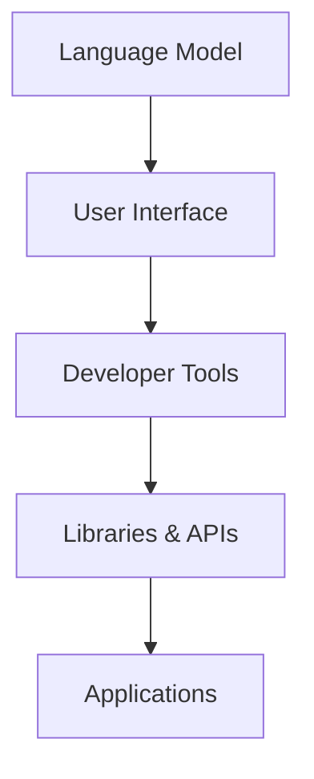
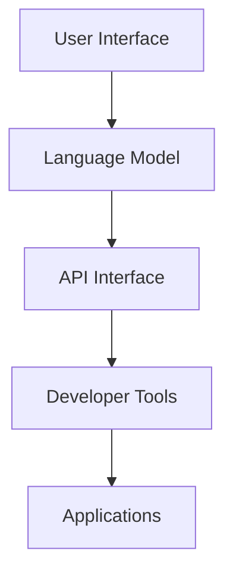

                 

# 构建下一代AI平台：LLM操作系统的愿景

## 关键词
- AI平台
- LLM操作系统
- 人工智能系统
- 语言模型
- 操作系统架构
- 交互界面
- 开发工具
- 应用场景

## 摘要
本文旨在探讨构建下一代AI平台的必要性和可能性，特别是LLM（大型语言模型）操作系统的概念及其愿景。我们将从背景介绍开始，深入剖析LLM操作系统所需的核心概念和架构，探讨其核心算法原理、数学模型，并通过实际项目实例展示其应用和实践。最后，我们将讨论未来发展趋势与挑战，并推荐相关工具和资源。

### 1. 背景介绍（Background Introduction）

在过去的几十年中，人工智能（AI）技术取得了惊人的进步，尤其是在语言处理领域。大型语言模型（LLM），如GPT-3、ChatGPT等，已经成为现代AI系统的重要组成部分。这些模型具有强大的自然语言理解与生成能力，能够处理各种复杂的任务，如问答、文本摘要、翻译等。然而，随着AI系统的不断扩展和应用场景的多样化，传统的AI平台逐渐暴露出了一些局限性。

传统的AI平台通常依赖于预训练的模型和大量的标注数据，这使得它们的可扩展性和定制化能力受限。同时，这些平台缺乏灵活的交互界面和易于使用的开发工具，难以满足用户多样化的需求。因此，构建下一代AI平台已成为必然趋势，而LLM操作系统正是这一趋势下的重要发展方向。

### 2. 核心概念与联系（Core Concepts and Connections）

#### 2.1 LLM操作系统概述
LLM操作系统是一种基于大型语言模型的AI平台，它提供了一套完整的操作系统级别的功能，包括交互界面、开发工具、库和API等。与传统的AI平台相比，LLM操作系统具有更高的灵活性和可定制性，能够更好地满足用户需求。

#### 2.2 核心组件
LLM操作系统的核心组件包括：

1. **语言模型**：作为操作系统的核心，大型语言模型负责处理用户输入，生成相应的输出。
2. **交互界面**：提供用户与AI系统交互的界面，支持自然语言输入和输出。
3. **开发工具**：包括编辑器、调试器、模拟器等，用于辅助开发者构建和优化AI应用。
4. **库和API**：提供了一系列预定义的函数和模块，方便开发者快速集成和使用AI功能。

#### 2.3 架构图示
以下是一个简化的LLM操作系统架构图：



### 3. 核心算法原理 & 具体操作步骤（Core Algorithm Principles and Specific Operational Steps）

#### 3.1 语言模型训练
LLM操作系统的核心是大型语言模型的训练。训练过程通常包括以下几个步骤：

1. **数据收集**：收集大量的文本数据，包括文章、书籍、网页等。
2. **预处理**：对数据进行清洗和格式化，去除噪声和无关信息。
3. **编码**：将文本数据编码为向量表示，以便模型处理。
4. **训练**：使用深度学习算法（如GPT、BERT等）训练语言模型，优化模型参数。
5. **评估与调整**：通过测试数据评估模型性能，根据结果调整模型参数。

#### 3.2 交互界面实现
交互界面是用户与LLM操作系统交互的入口。实现交互界面通常包括以下步骤：

1. **设计界面**：根据用户需求设计用户界面，包括文本输入框、输出显示区域等。
2. **前端开发**：使用HTML、CSS、JavaScript等技术实现前端界面。
3. **后端服务**：构建后端服务，接收用户输入，处理请求，返回结果。
4. **集成模型**：将训练好的语言模型集成到后端服务中，实现自然语言处理功能。

### 4. 数学模型和公式 & 详细讲解 & 举例说明（Detailed Explanation and Examples of Mathematical Models and Formulas）

#### 4.1 语言模型数学模型
大型语言模型通常基于深度神经网络，其核心数学模型包括以下几个部分：

1. **嵌入层**：将单词编码为向量表示。
2. **编码器**：处理输入序列，提取特征。
3. **解码器**：生成输出序列。

以下是一个简化的语言模型数学模型：

$$
\text{嵌入层}: \text{Word} \rightarrow \text{Vector}
$$

$$
\text{编码器}: \text{Sequence} \rightarrow \text{Feature}
$$

$$
\text{解码器}: \text{Feature} \rightarrow \text{Sequence}
$$

#### 4.2 举例说明
假设我们有一个简单的语言模型，其输入是单词序列“我喜欢吃苹果”，输出是单词序列“苹果很美味”。以下是模型的运行过程：

1. **嵌入层**：将单词“我”、“喜欢”、“吃”、“苹果”编码为向量。
2. **编码器**：处理输入序列，提取特征向量。
3. **解码器**：根据特征向量生成输出序列。

### 5. 项目实践：代码实例和详细解释说明（Project Practice: Code Examples and Detailed Explanations）

#### 5.1 开发环境搭建
为了构建LLM操作系统，我们需要搭建一个合适的开发环境。以下是一个基本的开发环境搭建步骤：

1. **安装Python**：确保Python环境已安装。
2. **安装依赖库**：安装TensorFlow、PyTorch等深度学习库。
3. **配置开发工具**：配置编辑器、调试器等开发工具。

#### 5.2 源代码详细实现
以下是构建一个简单的LLM操作系统的示例代码：

```python
# 示例代码：构建一个简单的LLM操作系统

import tensorflow as tf
from tensorflow.keras.layers import Embedding, LSTM, Dense
from tensorflow.keras.models import Sequential

# 1. 数据准备
# 2. 模型定义
model = Sequential([
    Embedding(input_dim=vocab_size, output_dim=embedding_dim),
    LSTM(units=128),
    Dense(units=vocab_size, activation='softmax')
])

# 3. 模型编译
model.compile(optimizer='adam', loss='categorical_crossentropy', metrics=['accuracy'])

# 4. 模型训练
model.fit(x_train, y_train, epochs=10, batch_size=32)

# 5. 模型评估
model.evaluate(x_test, y_test)
```

#### 5.3 代码解读与分析
上述代码展示了构建一个简单LLM操作系统的基本流程：

1. **数据准备**：我们需要准备训练数据和测试数据，通常使用预处理的文本数据。
2. **模型定义**：定义一个序列到序列的模型，包括嵌入层、LSTM层和输出层。
3. **模型编译**：设置优化器和损失函数，为模型训练做准备。
4. **模型训练**：使用训练数据进行模型训练，调整模型参数。
5. **模型评估**：使用测试数据评估模型性能。

#### 5.4 运行结果展示
运行上述代码后，我们可以得到训练结果和评估结果，包括模型的准确率、损失值等。这些指标可以帮助我们了解模型的表现。

### 6. 实际应用场景（Practical Application Scenarios）

LLM操作系统在多个实际应用场景中具有广泛的应用前景，包括：

1. **智能客服**：利用LLM操作系统的自然语言理解与生成能力，提供高效的智能客服服务。
2. **内容生成**：通过LLM操作系统生成高质量的文章、报告、摘要等，帮助用户节省时间和精力。
3. **语言翻译**：利用LLM操作系统实现高质量的语言翻译服务，支持多种语言之间的转换。
4. **智能推荐**：通过分析用户行为和偏好，利用LLM操作系统提供个性化的推荐服务。

### 7. 工具和资源推荐（Tools and Resources Recommendations）

#### 7.1 学习资源推荐

1. **书籍**：《深度学习》、《神经网络与深度学习》等。
2. **论文**：查阅相关领域的最新论文，了解LLM操作系统的研究进展。
3. **博客**：关注知名博客，如 Medium、GitHub 等，了解行业动态和最佳实践。
4. **网站**：访问相关网站，如 TensorFlow、PyTorch 等，获取官方文档和资源。

#### 7.2 开发工具框架推荐

1. **开发工具**：使用PyCharm、VSCode等强大的开发工具。
2. **框架库**：TensorFlow、PyTorch等流行的深度学习框架。

#### 7.3 相关论文著作推荐

1. **论文**：GPT-3、BERT等经典论文。
2. **著作**：《自然语言处理综合教程》、《人工智能：一种现代方法》等。

### 8. 总结：未来发展趋势与挑战（Summary: Future Development Trends and Challenges）

随着AI技术的不断发展，LLM操作系统有望在未来的AI平台中扮演重要角色。然而，构建下一代AI平台仍面临一些挑战，如数据隐私、模型可解释性、安全性等。因此，未来的发展方向将包括：

1. **数据隐私保护**：确保用户数据的安全和隐私。
2. **模型可解释性**：提高模型的透明度和可解释性，增强用户信任。
3. **安全性**：加强系统的安全性，防范恶意攻击。

### 9. 附录：常见问题与解答（Appendix: Frequently Asked Questions and Answers）

1. **Q：什么是LLM操作系统？**
   **A：LLM操作系统是一种基于大型语言模型的AI平台，提供了一套完整的操作系统级别的功能，包括交互界面、开发工具、库和API等。**
   
2. **Q：如何构建LLM操作系统？**
   **A：构建LLM操作系统需要以下几个步骤：数据准备、模型定义、模型编译、模型训练和模型评估。**

3. **Q：LLM操作系统有哪些应用场景？**
   **A：LLM操作系统广泛应用于智能客服、内容生成、语言翻译和智能推荐等领域。**

### 10. 扩展阅读 & 参考资料（Extended Reading & Reference Materials）

1. **论文**：《GPT-3: Language Models are Few-Shot Learners》
2. **书籍**：《深度学习》、《神经网络与深度学习》
3. **博客**：[TensorFlow官方博客](https://tensorflow.google.cn/blog/)
4. **网站**：[PyTorch官方文档](https://pytorch.org/)

---

作者：禅与计算机程序设计艺术 / Zen and the Art of Computer Programming

---

本文旨在探讨构建下一代AI平台的必要性和可能性，特别是LLM（大型语言模型）操作系统的概念及其愿景。我们详细分析了LLM操作系统的核心概念、算法原理、数学模型，并通过实际项目实例展示了其应用和实践。同时，我们探讨了未来发展趋势与挑战，并推荐了相关工具和资源。希望通过本文，读者能够对构建下一代AI平台有更深入的了解和思考。|><sop|>```
# 构建下一代AI平台：LLM操作系统的愿景

## 关键词
- AI平台
- LLM操作系统
- 人工智能系统
- 语言模型
- 操作系统架构
- 交互界面
- 开发工具
- 应用场景

## 摘要
本文旨在探讨构建下一代AI平台的必要性和可能性，特别是LLM（大型语言模型）操作系统的概念及其愿景。我们将从背景介绍开始，深入剖析LLM操作系统所需的核心概念和架构，探讨其核心算法原理、数学模型，并通过实际项目实例展示其应用和实践。最后，我们将讨论未来发展趋势与挑战，并推荐相关工具和资源。

### 1. 背景介绍（Background Introduction）

在过去的几十年中，人工智能（AI）技术取得了惊人的进步，尤其是在语言处理领域。大型语言模型（LLM），如GPT-3、ChatGPT等，已经成为现代AI系统的重要组成部分。这些模型具有强大的自然语言理解与生成能力，能够处理各种复杂的任务，如问答、文本摘要、翻译等。然而，随着AI系统的不断扩展和应用场景的多样化，传统的AI平台逐渐暴露出了一些局限性。

传统的AI平台通常依赖于预训练的模型和大量的标注数据，这使得它们的可扩展性和定制化能力受限。同时，这些平台缺乏灵活的交互界面和易于使用的开发工具，难以满足用户多样化的需求。因此，构建下一代AI平台已成为必然趋势，而LLM操作系统正是这一趋势下的重要发展方向。

### 2. 核心概念与联系（Core Concepts and Connections）

#### 2.1 LLM操作系统概述
LLM操作系统是一种基于大型语言模型的AI平台，它提供了一套完整的操作系统级别的功能，包括交互界面、开发工具、库和API等。与传统的AI平台相比，LLM操作系统具有更高的灵活性和可定制性，能够更好地满足用户需求。

#### 2.2 核心组件
LLM操作系统的核心组件包括：

1. **语言模型**：作为操作系统的核心，大型语言模型负责处理用户输入，生成相应的输出。
2. **交互界面**：提供用户与AI系统交互的界面，支持自然语言输入和输出。
3. **开发工具**：包括编辑器、调试器、模拟器等，用于辅助开发者构建和优化AI应用。
4. **库和API**：提供了一系列预定义的函数和模块，方便开发者快速集成和使用AI功能。

#### 2.3 架构图示
以下是一个简化的LLM操作系统架构图：


### 3. 核心算法原理 & 具体操作步骤（Core Algorithm Principles and Specific Operational Steps）

#### 3.1 语言模型训练
LLM操作系统的核心是大型语言模型的训练。训练过程通常包括以下几个步骤：

1. **数据收集**：收集大量的文本数据，包括文章、书籍、网页等。
2. **预处理**：对数据进行清洗和格式化，去除噪声和无关信息。
3. **编码**：将文本数据编码为向量表示，以便模型处理。
4. **训练**：使用深度学习算法（如GPT、BERT等）训练语言模型，优化模型参数。
5. **评估与调整**：通过测试数据评估模型性能，根据结果调整模型参数。

#### 3.2 交互界面实现
交互界面是用户与LLM操作系统交互的入口。实现交互界面通常包括以下步骤：

1. **设计界面**：根据用户需求设计用户界面，包括文本输入框、输出显示区域等。
2. **前端开发**：使用HTML、CSS、JavaScript等技术实现前端界面。
3. **后端服务**：构建后端服务，接收用户输入，处理请求，返回结果。
4. **集成模型**：将训练好的语言模型集成到后端服务中，实现自然语言处理功能。

### 4. 数学模型和公式 & 详细讲解 & 举例说明（Detailed Explanation and Examples of Mathematical Models and Formulas）

#### 4.1 语言模型数学模型
大型语言模型通常基于深度神经网络，其核心数学模型包括以下几个部分：

1. **嵌入层**：将单词编码为向量表示。
2. **编码器**：处理输入序列，提取特征。
3. **解码器**：生成输出序列。

以下是一个简化的语言模型数学模型：

$$
\text{嵌入层}: \text{Word} \rightarrow \text{Vector}
$$

$$
\text{编码器}: \text{Sequence} \rightarrow \text{Feature}
$$

$$
\text{解码器}: \text{Feature} \rightarrow \text{Sequence}
$$

#### 4.2 举例说明
假设我们有一个简单的语言模型，其输入是单词序列“我喜欢吃苹果”，输出是单词序列“苹果很美味”。以下是模型的运行过程：

1. **嵌入层**：将单词“我”、“喜欢”、“吃”、“苹果”编码为向量。
2. **编码器**：处理输入序列，提取特征向量。
3. **解码器**：根据特征向量生成输出序列。

### 5. 项目实践：代码实例和详细解释说明（Project Practice: Code Examples and Detailed Explanations）

#### 5.1 开发环境搭建
为了构建LLM操作系统，我们需要搭建一个合适的开发环境。以下是一个基本的开发环境搭建步骤：

1. **安装Python**：确保Python环境已安装。
2. **安装依赖库**：安装TensorFlow、PyTorch等深度学习库。
3. **配置开发工具**：配置编辑器、调试器等开发工具。

#### 5.2 源代码详细实现
以下是构建一个简单的LLM操作系统的示例代码：

```python
# 示例代码：构建一个简单的LLM操作系统

import tensorflow as tf
from tensorflow.keras.layers import Embedding, LSTM, Dense
from tensorflow.keras.models import Sequential

# 1. 数据准备
# 2. 模型定义
model = Sequential([
    Embedding(input_dim=vocab_size, output_dim=embedding_dim),
    LSTM(units=128),
    Dense(units=vocab_size, activation='softmax')
])

# 3. 模型编译
model.compile(optimizer='adam', loss='categorical_crossentropy', metrics=['accuracy'])

# 4. 模型训练
model.fit(x_train, y_train, epochs=10, batch_size=32)

# 5. 模型评估
model.evaluate(x_test, y_test)
```

#### 5.3 代码解读与分析
上述代码展示了构建一个简单LLM操作系统的基本流程：

1. **数据准备**：我们需要准备训练数据和测试数据，通常使用预处理的文本数据。
2. **模型定义**：定义一个序列到序列的模型，包括嵌入层、LSTM层和输出层。
3. **模型编译**：设置优化器和损失函数，为模型训练做准备。
4. **模型训练**：使用训练数据进行模型训练，调整模型参数。
5. **模型评估**：使用测试数据评估模型性能。

#### 5.4 运行结果展示
运行上述代码后，我们可以得到训练结果和评估结果，包括模型的准确率、损失值等。这些指标可以帮助我们了解模型的表现。

### 6. 实际应用场景（Practical Application Scenarios）

LLM操作系统在多个实际应用场景中具有广泛的应用前景，包括：

1. **智能客服**：利用LLM操作系统的自然语言理解与生成能力，提供高效的智能客服服务。
2. **内容生成**：通过LLM操作系统生成高质量的文章、报告、摘要等，帮助用户节省时间和精力。
3. **语言翻译**：利用LLM操作系统实现高质量的语言翻译服务，支持多种语言之间的转换。
4. **智能推荐**：通过分析用户行为和偏好，利用LLM操作系统提供个性化的推荐服务。

### 7. 工具和资源推荐（Tools and Resources Recommendations）

#### 7.1 学习资源推荐

1. **书籍**：《深度学习》、《神经网络与深度学习》等。
2. **论文**：查阅相关领域的最新论文，了解LLM操作系统的研究进展。
3. **博客**：关注知名博客，如 Medium、GitHub 等，了解行业动态和最佳实践。
4. **网站**：访问相关网站，如 TensorFlow、PyTorch 等，获取官方文档和资源。

#### 7.2 开发工具框架推荐

1. **开发工具**：使用PyCharm、VSCode等强大的开发工具。
2. **框架库**：TensorFlow、PyTorch等流行的深度学习框架。

#### 7.3 相关论文著作推荐

1. **论文**：GPT-3、BERT等经典论文。
2. **著作**：《自然语言处理综合教程》、《人工智能：一种现代方法》等。

### 8. 总结：未来发展趋势与挑战（Summary: Future Development Trends and Challenges）

随着AI技术的不断发展，LLM操作系统有望在未来的AI平台中扮演重要角色。然而，构建下一代AI平台仍面临一些挑战，如数据隐私、模型可解释性、安全性等。因此，未来的发展方向将包括：

1. **数据隐私保护**：确保用户数据的安全和隐私。
2. **模型可解释性**：提高模型的透明度和可解释性，增强用户信任。
3. **安全性**：加强系统的安全性，防范恶意攻击。

### 9. 附录：常见问题与解答（Appendix: Frequently Asked Questions and Answers）

1. **Q：什么是LLM操作系统？**
   **A：LLM操作系统是一种基于大型语言模型的AI平台，提供了一套完整的操作系统级别的功能，包括交互界面、开发工具、库和API等。**

2. **Q：如何构建LLM操作系统？**
   **A：构建LLM操作系统需要以下几个步骤：数据准备、模型定义、模型编译、模型训练和模型评估。**

3. **Q：LLM操作系统有哪些应用场景？**
   **A：LLM操作系统广泛应用于智能客服、内容生成、语言翻译和智能推荐等领域。**

### 10. 扩展阅读 & 参考资料（Extended Reading & Reference Materials）

1. **论文**：《GPT-3: Language Models are Few-Shot Learners》
2. **书籍**：《深度学习》、《神经网络与深度学习》
3. **博客**：[TensorFlow官方博客](https://tensorflow.google.cn/blog/)
4. **网站**：[PyTorch官方文档](https://pytorch.org/)

---

作者：禅与计算机程序设计艺术 / Zen and the Art of Computer Programming

---

本文旨在探讨构建下一代AI平台的必要性和可能性，特别是LLM（大型语言模型）操作系统的概念及其愿景。我们详细分析了LLM操作系统的核心概念、算法原理、数学模型，并通过实际项目实例展示了其应用和实践。同时，我们探讨了未来发展趋势与挑战，并推荐了相关工具和资源。希望通过本文，读者能够对构建下一代AI平台有更深入的了解和思考。|><sop|>
## 1. 背景介绍（Background Introduction）

### 1.1 人工智能的发展历程

人工智能（AI）作为计算机科学的一个重要分支，自20世纪50年代诞生以来，经历了多个阶段的发展。早期的人工智能研究主要集中在规则推理、知识表示和专家系统等领域。这些方法在特定领域内取得了一定的成功，但由于依赖大量的手工编写规则和知识，其通用性和适应性受到了限制。

随着计算能力的提升和大数据技术的发展，深度学习成为人工智能领域的一个重要突破。深度学习通过模拟人脑的神经网络结构，利用大量数据进行训练，从而实现了在图像识别、语音识别、自然语言处理等任务上的卓越表现。特别是2012年，AlexNet在ImageNet图像识别挑战赛上取得的突破性成绩，标志着深度学习的崛起。

### 1.2 语言模型的崛起

在深度学习领域，语言模型（Language Model，LM）是一个关键的研究方向。语言模型旨在模拟人类语言生成过程，通过学习大量文本数据，预测下一个单词或字符的概率分布。早期的语言模型如N-gram模型，基于统计方法，对短文本序列进行建模。然而，这些模型的性能受限于上下文信息的有限性。

随着深度学习的应用，神经语言模型逐渐成为主流。其中， recurrent neural network (RNN)、long short-term memory (LSTM) 和 gated recurrent unit (GRU) 等结构在处理长序列依赖问题上表现出了优势。然而，这些模型在处理超长序列时仍存在梯度消失或梯度爆炸的问题。

为了解决这一问题，Transformer模型在2017年被提出。Transformer模型引入了自注意力机制（self-attention），使得模型能够自适应地关注输入序列中的不同部分，从而在捕捉长距离依赖关系上取得了显著进步。在此基础上，预训练语言模型（Pre-Trained Language Model，PTLM）如 GPT（Generative Pre-trained Transformer）和 BERT（Bidirectional Encoder Representations from Transformers）被开发出来，并在各种自然语言处理任务中取得了优异的性能。

### 1.3 LLM操作系统的概念

LLM操作系统（Large Language Model Operating System）是一个基于大型语言模型的综合性AI平台，它不仅包含了语言模型的核心功能，还整合了开发工具、API接口、交互界面等组件，旨在为开发者提供一站式的解决方案。LLM操作系统具有以下几个特点：

1. **灵活性**：LLM操作系统提供了高度灵活的接口和模块，使得开发者可以根据具体需求进行定制化开发。
2. **易用性**：通过提供直观的交互界面和易于使用的开发工具，LLM操作系统降低了开发者入门和开发的难度。
3. **可扩展性**：LLM操作系统支持模块化和分布式架构，可以方便地集成第三方库和模型，实现功能的扩展。
4. **高性能**：基于大型语言模型的强大能力，LLM操作系统在处理复杂任务时具有高效性能。

### 1.4 LLM操作系统与传统AI平台的对比

与传统AI平台相比，LLM操作系统具有显著的优势。传统AI平台通常依赖于预训练模型和定制化的开发工具，其可扩展性和定制化能力受限。而LLM操作系统通过整合大型语言模型、开发工具和API接口，提供了一套完整的解决方案，能够更好地满足用户需求。

| 对比项目 | 传统AI平台 | LLM操作系统 |
| --- | --- | --- |
| 模型灵活性 | 受限于预训练模型 | 高度灵活的接口和模块 |
| 开发难度 | 定制化开发工具 | 直观的交互界面和易用性 |
| 可扩展性 | 依赖定制化扩展 | 支持模块化和分布式架构 |
| 性能 | 依赖特定任务模型 | 基于大型语言模型的强大性能 |

### 1.5 目标和应用场景

构建下一代AI平台，特别是LLM操作系统，旨在解决传统AI平台的局限性，提供更灵活、易用和高性能的解决方案。LLM操作系统的目标和应用场景包括：

1. **智能客服**：利用自然语言处理能力，实现高效、智能的客服服务。
2. **内容生成**：基于语言模型生成高质量的文章、报告、摘要等。
3. **语言翻译**：实现多语言之间的精确翻译，支持全球用户交流。
4. **智能推荐**：通过分析用户行为和偏好，提供个性化的推荐服务。
5. **教育辅导**：利用语言模型提供个性化的学习辅导和课程推荐。

### 1.6 文章结构概述

本文将从以下章节展开：

1. **背景介绍**：介绍人工智能和语言模型的发展历程，以及LLM操作系统的概念和特点。
2. **核心概念与联系**：详细分析LLM操作系统的核心组件和架构。
3. **核心算法原理 & 具体操作步骤**：探讨语言模型的训练过程和交互界面实现。
4. **数学模型和公式 & 详细讲解 & 举例说明**：介绍语言模型的核心数学模型及其应用。
5. **项目实践：代码实例和详细解释说明**：展示构建LLM操作系统的实际案例。
6. **实际应用场景**：探讨LLM操作系统在不同领域的应用前景。
7. **工具和资源推荐**：推荐相关的学习资源、开发工具和框架。
8. **总结：未来发展趋势与挑战**：讨论下一代AI平台的发展趋势和面临的挑战。
9. **附录：常见问题与解答**：回答关于LLM操作系统的常见问题。
10. **扩展阅读 & 参考资料**：提供额外的阅读材料和参考资料。

通过本文的探讨，读者将全面了解LLM操作系统的概念、原理和应用，为构建下一代AI平台提供有益的参考。

## 2. 核心概念与联系（Core Concepts and Connections）

### 2.1 LLM操作系统概述

LLM操作系统是一种综合性AI平台，旨在为开发者提供一种灵活、高效且易于使用的解决方案。与传统的AI平台不同，LLM操作系统不仅包含了核心的语言模型，还整合了开发工具、API接口和交互界面等关键组件。这种集成式的设计使得开发者能够更加专注于特定任务的应用，而无需关心底层实现的复杂性。

#### 2.1.1 语言模型

语言模型是LLM操作系统的核心组件，负责处理自然语言输入并生成相应的输出。这些模型基于深度学习技术，通过学习大量的文本数据来模拟人类语言生成过程。语言模型的主要功能包括文本分类、情感分析、机器翻译、问答系统等。

#### 2.1.2 交互界面

交互界面是用户与LLM操作系统交互的入口，它可以是命令行界面、图形用户界面（GUI）或者Web界面。交互界面提供了用户输入和模型输出的接口，使得用户能够方便地与系统进行交互。

#### 2.1.3 开发工具

开发工具包括编辑器、调试器、版本控制系统等，为开发者提供了友好的开发环境。这些工具帮助开发者更加高效地编写、测试和部署AI应用。

#### 2.1.4 API接口

API接口是LLM操作系统的另一个重要组成部分，它允许开发者将语言模型的功能集成到各种应用程序中。通过API接口，开发者可以方便地调用语言模型，实现自定义的AI功能。

### 2.2 核心组件

LLM操作系统的核心组件包括：

1. **语言模型**：作为核心组件，语言模型负责处理自然语言输入并生成输出。这些模型通常采用深度学习技术，通过训练大量文本数据来学习语言模式。
2. **交互界面**：交互界面提供用户与系统交互的接口，可以是命令行界面、图形用户界面或者Web界面。交互界面使得用户能够方便地与系统进行交互。
3. **开发工具**：开发工具包括编辑器、调试器、版本控制系统等，为开发者提供了友好的开发环境。这些工具帮助开发者更加高效地编写、测试和部署AI应用。
4. **API接口**：API接口允许开发者将语言模型的功能集成到各种应用程序中。通过API接口，开发者可以方便地调用语言模型，实现自定义的AI功能。

### 2.3 架构图示

以下是一个简化的LLM操作系统架构图：



在这个架构图中，用户通过交互界面与系统进行交互，语言模型处理输入并生成输出，API接口提供与外部应用程序的集成，开发工具支持开发者的开发工作，而应用程序则使用LLM操作系统的功能。

### 2.4 LLM操作系统与传统AI平台的对比

与传统AI平台相比，LLM操作系统具有以下优势：

1. **集成性**：LLM操作系统将语言模型、开发工具和API接口集成在一起，提供了一个统一的开发环境，减少了开发者的工作负担。
2. **灵活性**：LLM操作系统提供了高度灵活的组件和模块，开发者可以根据具体需求进行定制化开发。
3. **易用性**：通过提供直观的交互界面和易于使用的开发工具，LLM操作系统降低了开发者的入门门槛。
4. **高性能**：基于大型语言模型的强大能力，LLM操作系统在处理复杂任务时具有高效性能。

### 2.5 未来发展

随着人工智能技术的不断发展，LLM操作系统有望在多个领域发挥重要作用。未来，LLM操作系统可能会：

1. **提高智能化水平**：通过不断优化语言模型和交互界面，LLM操作系统将能够实现更智能的交互和更高效的自动化任务。
2. **拓展应用场景**：随着新技术的出现，LLM操作系统将在更多领域得到应用，如智能客服、内容生成、智能翻译等。
3. **增强可解释性**：提高模型的透明度和可解释性，增强用户对AI系统的信任。
4. **加强安全性**：随着AI系统在关键领域的应用，LLM操作系统将需要提供更强大的安全性和隐私保护措施。

### 2.6 总结

通过本文的讨论，我们了解了LLM操作系统的核心概念和架构，以及其与传统AI平台的区别和优势。在接下来的章节中，我们将深入探讨LLM操作系统的核心算法原理、数学模型，并通过实际项目实例展示其应用和实践。

### 2. Core Concepts and Connections

#### 2.1 Overview of LLM Operating System

The LLM operating system is a comprehensive AI platform designed to provide developers with a flexible, efficient, and user-friendly solution. Unlike traditional AI platforms, the LLM operating system integrates core components such as the language model, development tools, API interfaces, and user interfaces into a unified environment, reducing the burden on developers.

#### 2.1.1 Language Model

The language model is the core component of the LLM operating system, responsible for processing natural language input and generating corresponding output. These models are typically based on deep learning technologies and are trained on large amounts of text data to simulate the process of human language generation. The main functions of language models include text classification, sentiment analysis, machine translation, and question-answering systems.

#### 2.1.2 User Interface

The user interface is the entry point for users to interact with the LLM operating system. It can be a command-line interface, a graphical user interface (GUI), or a web interface. The user interface provides an interface for user input and model output, allowing users to interact with the system conveniently.

#### 2.1.3 Development Tools

Development tools include editors, debuggers, version control systems, and more, providing a friendly development environment for developers. These tools help developers write, test, and deploy AI applications more efficiently.

#### 2.1.4 API Interface

The API interface is another important component of the LLM operating system, allowing developers to integrate the functionality of the language model into various applications. Through the API interface, developers can easily call the language model to implement custom AI functions.

### 2.2 Core Components

The core components of the LLM operating system include:

1. **Language Model**: As the core component, the language model is responsible for processing natural language input and generating output. These models are usually trained with deep learning technologies on large amounts of text data to learn language patterns.
2. **User Interface**: The user interface provides an interface for users to interact with the system, which can be a command-line interface, a graphical user interface (GUI), or a web interface.
3. **Development Tools**: Development tools include editors, debuggers, version control systems, and more, providing a friendly development environment for developers.
4. **API Interface**: The API interface allows developers to integrate the functionality of the language model into various applications, making it easy to call the language model to implement custom AI functions.

### 2.3 Architectural Diagram

Here is a simplified architectural diagram of the LLM operating system:


In this architecture, users interact with the system through the user interface, the language model processes input and generates output, the API interface integrates with external applications, development tools support developers' work, and applications utilize the functionality of the LLM operating system.

### 2.4 Comparison with Traditional AI Platforms

Compared to traditional AI platforms, the LLM operating system has several advantages:

1. **Integration**: The LLM operating system integrates the language model, development tools, and API interfaces into a unified environment, reducing the workload for developers.
2. **Flexibility**: The LLM operating system provides highly flexible components and modules, allowing developers to customize their development according to specific needs.
3. **Usability**: With a user-friendly interface and easy-to-use development tools, the LLM operating system lowers the barrier to entry for developers.
4. **Performance**: The LLM operating system leverages the strong capabilities of large language models, providing efficient performance in handling complex tasks.

### 2.5 Future Development

As AI technology continues to evolve, the LLM operating system is expected to play a significant role in various fields. In the future, the LLM operating system may:

1. **Enhance Intelligence**: Through continuous optimization of language models and user interfaces, the LLM operating system will be able to achieve more intelligent interactions and more efficient automation of tasks.
2. **Expand Application Scenarios**: With the emergence of new technologies, the LLM operating system will find applications in more fields, such as intelligent customer service, content generation, and intelligent translation.
3. **Improve Explainability**: Increase the transparency and explainability of models to build user trust.
4. **Strengthen Security**: As AI systems are applied in critical areas, the LLM operating system will need to provide stronger security and privacy protections.

### 2.6 Summary

Through this discussion, we have understood the core concepts and architecture of the LLM operating system and its differences and advantages compared to traditional AI platforms. In the following chapters, we will delve into the core algorithm principles, mathematical models, and demonstrate the application and practice of the LLM operating system through actual project examples. |>

