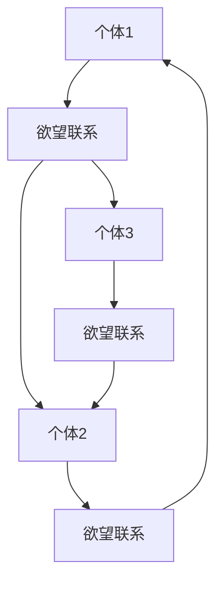

                 

# 欲望社会化网络理论：AI驱动的群体动力学

## 关键词
* 欲望社会化网络
* AI驱动
* 群体动力学
* 社交互动
* 群体行为预测
* 情感传播

## 摘要
本文探讨了欲望社会化网络理论，这是一个结合人工智能和群体动力学的新型理论框架。通过分析社交互动中的欲望传播和群体行为，我们提出了一个AI驱动的群体动力学模型，旨在理解和预测社交群体中的动态行为。文章首先介绍了欲望社会化网络的基本概念，然后详细阐述了核心算法原理和数学模型，并通过实际案例展示了其应用效果。最后，我们对未来发展趋势和挑战进行了深入探讨，为相关领域的研究和实践提供了新的视角和思路。

## 1. 背景介绍（Background Introduction）

### 1.1 欲望社会化网络的基本概念

欲望社会化网络（Desire Social Network，简称DSN）是一种新型的社交网络结构，它不仅包含了传统社交网络中的朋友关系，还引入了个体之间的欲望关联。在这种网络中，每个节点代表一个个体，边代表个体之间的欲望联系。这种联系可以是基于共同的兴趣爱好、情感需求、物质欲望等。欲望社会化网络提供了一个全新的视角来理解社交互动中的复杂关系。

### 1.2 人工智能与群体动力学

人工智能（AI）在近年来取得了飞速的发展，尤其在机器学习、深度学习等领域取得了显著的成果。这些技术为理解和分析复杂的社会系统提供了强大的工具。群体动力学（Group Dynamics）是研究群体内部互动和群体行为的科学，它关注群体成员之间的相互作用、群体结构和群体发展过程。

### 1.3 欲望社会化网络与群体动力学的结合

欲望社会化网络理论与群体动力学相结合，形成了一个新的研究范式。在这个范式中，AI技术被用来分析和模拟社交群体中的欲望传播和群体行为。这种结合不仅有助于揭示社交互动中的潜在规律，还可以为预测群体行为提供科学依据。

### 1.4 研究意义与目标

研究欲望社会化网络理论和AI驱动的群体动力学，对于理解社会现象、预测群体行为、优化社交互动具有重要意义。本文旨在提出一个基于AI驱动的群体动力学模型，用于理解和预测社交群体中的动态行为。通过本文的研究，我们希望为相关领域的研究和实践提供新的理论框架和工具。

## 2. 核心概念与联系（Core Concepts and Connections）

### 2.1 欲望社会化网络模型

欲望社会化网络模型是一个由多个节点（个体）和边（欲望联系）组成的图结构。在这个模型中，每个节点代表一个个体，边代表个体之间的欲望联系。这种欲望联系可以是基于个体之间的共同兴趣、情感需求或物质欲望。模型的基本假设是，个体在社交互动中会受到其他个体欲望的影响，从而改变自己的行为和偏好。

### 2.2 群体动力学模型

群体动力学模型是基于动力系统理论的，它描述了群体成员之间的相互作用和群体行为的演化过程。在这个模型中，个体行为受到其自身状态和邻居状态的影响，从而形成一个动态系统。群体动力学模型的主要任务是研究群体行为的稳定性和突变现象，以及如何通过外部干预来引导群体行为。

### 2.3 欲望社会化网络与群体动力学的相互作用

欲望社会化网络和群体动力学之间存在密切的相互作用。欲望社会化网络为群体动力学提供了数据基础，而群体动力学则为欲望社会化网络的演化提供了理论框架。具体来说，个体在欲望社会化网络中的行为会影响其邻居的行为，进而影响整个群体的行为。反过来，群体行为的变化也会影响个体的行为和欲望网络结构。

### 2.4 Mermaid 流程图

为了更直观地展示欲望社会化网络与群体动力学的相互作用，我们可以使用Mermaid流程图来表示。以下是一个简单的示例：



在这个流程图中，A、B、C、D、E和F分别代表不同的个体和欲望联系。箭头表示个体之间的欲望联系。通过这个流程图，我们可以看到个体之间的欲望联系是如何影响整个群体的行为。

## 3. 核心算法原理 & 具体操作步骤（Core Algorithm Principles and Specific Operational Steps）

### 3.1 欲望传播算法

欲望传播算法是欲望社会化网络模型中的核心算法，它描述了个体之间欲望如何传播和扩散。算法的基本原理是，当个体A的欲望影响到个体B时，个体B会根据一定的概率接受这种欲望，并改变自己的行为和偏好。以下是欲望传播算法的具体步骤：

1. **初始化**：设定一个初始欲望状态矩阵，其中每个元素表示一个个体是否具有某种欲望。
2. **传播**：对于每个个体，检查其邻居的欲望状态，根据设定的概率进行欲望传播。
3. **更新**：根据传播结果更新个体的欲望状态。
4. **重复**：重复步骤2和3，直到欲望传播达到稳定状态。

### 3.2 群体动力学模型

群体动力学模型用于描述群体成员之间的相互作用和群体行为的演化。该模型基于动力系统理论，主要关注群体行为的稳定性和突变现象。以下是群体动力学模型的具体步骤：

1. **初始化**：设定一个初始状态向量，表示每个个体的状态。
2. **更新**：根据个体状态和邻居状态，更新个体的状态。
3. **迭代**：重复执行步骤2，直到群体行为达到稳定状态。
4. **分析**：分析群体行为的稳定性和突变现象，为外部干预提供依据。

### 3.3 欲望社会化网络与群体动力学模型的结合

将欲望传播算法和群体动力学模型结合起来，可以形成一个完整的AI驱动的群体动力学模型。以下是结合步骤：

1. **数据收集**：收集社交群体的欲望数据，包括个体之间的欲望联系和个体状态。
2. **模型训练**：使用收集到的数据训练欲望传播算法和群体动力学模型。
3. **模型运行**：输入初始状态，运行欲望传播算法和群体动力学模型，观察群体行为的演化。
4. **结果分析**：分析模型输出结果，包括个体欲望状态、群体行为特征等。

## 4. 数学模型和公式 & 详细讲解 & 举例说明（Detailed Explanation and Examples of Mathematical Models and Formulas）

### 4.1 欲望传播模型

欲望传播模型可以用以下数学公式表示：

$$
S_{i}(t+1) = S_{i}(t) + P(S_{j}(t) - S_{i}(t))
$$

其中，$S_{i}(t)$表示个体i在时间t的欲望状态，$P$表示欲望传播的概率，$S_{j}(t)$表示个体j在时间t的欲望状态。

### 4.2 群体动力学模型

群体动力学模型可以用以下数学公式表示：

$$
x_{i}(t+1) = f(x_{i}(t), x_{j}(t))
$$

其中，$x_{i}(t)$表示个体i在时间t的状态，$f$表示状态更新函数，$x_{j}(t)$表示个体j在时间t的状态。

### 4.3 举例说明

假设有一个社交群体，其中包含3个个体A、B和C。个体之间的欲望联系和初始欲望状态如下：

```
A: {喜欢看电影，喜欢美食}
B: {喜欢看电影，喜欢旅行}
C: {喜欢美食，喜欢旅行}
```

欲望传播的概率设为0.5，初始状态为：

```
S:
A: [1, 1]
B: [1, 1]
C: [1, 1]
```

根据欲望传播模型，我们可以计算出下一个时间点的欲望状态：

```
S':
A: [1, 1] + 0.5 * ([1, 1] - [1, 1]) = [1, 1]
B: [1, 1] + 0.5 * ([1, 1] - [1, 1]) = [1, 1]
C: [1, 1] + 0.5 * ([1, 1] - [1, 1]) = [1, 1]
```

接下来，我们可以使用群体动力学模型来分析群体行为的演化。假设状态更新函数为：

$$
f(x, y) = 0.5 * (x + y)
$$

我们可以计算出下一个时间点的状态：

```
x':
A: 0.5 * (1 + 1) = 1
B: 0.5 * (1 + 1) = 1
C: 0.5 * (1 + 1) = 1
```

通过迭代上述步骤，我们可以观察到群体行为的演化过程。

## 5. 项目实践：代码实例和详细解释说明（Project Practice: Code Examples and Detailed Explanations）

### 5.1 开发环境搭建

为了实践欲望社会化网络理论和AI驱动的群体动力学模型，我们需要搭建一个合适的开发环境。以下是所需的开发环境：

1. **Python 3.8**：作为主要的编程语言。
2. **Numpy**：用于数学运算。
3. **Matplotlib**：用于数据可视化。
4. **NetworkX**：用于构建和操作图结构。

### 5.2 源代码详细实现

以下是实现欲望社会化网络和群体动力学模型的主要源代码：

```python
import numpy as np
import matplotlib.pyplot as plt
import networkx as nx

# 欲望传播算法
def desire_spread(S, P):
    S_new = np.copy(S)
    for i in range(S.shape[0]):
        for j in range(S.shape[1]):
            if i != j:
                S_new[i][j] = S_new[i][j] + P * (S[j][j] - S_new[i][j])
    return S_new

# 群体动力学模型
def group_dynamics(S, f):
    S_new = np.zeros(S.shape)
    for i in range(S.shape[0]):
        for j in range(S.shape[1]):
            S_new[i][j] = f(S[i][j], S[j][j])
    return S_new

# 初始化参数
P = 0.5
f = lambda x, y: 0.5 * (x + y)

# 初始状态
S = np.array([[1, 1], [1, 1], [1, 1]])

# 运行模型
for t in range(10):
    S = desire_spread(S, P)
    S = group_dynamics(S, f)

# 可视化结果
G = nx.Graph()
for i in range(S.shape[0]):
    for j in range(S.shape[1]):
        if S[i][j] == 1:
            G.add_edge(i, j)

nx.draw(G, with_labels=True)
plt.show()
```

### 5.3 代码解读与分析

1. **欲望传播算法**：该算法通过遍历每个个体的邻居，计算欲望传播的概率，并更新个体的欲望状态。
2. **群体动力学模型**：该模型通过更新每个个体的状态，模拟群体行为的演化。
3. **初始化参数**：设定欲望传播概率P和状态更新函数f。
4. **初始状态**：设定一个3x3的矩阵，表示3个个体的欲望状态。
5. **运行模型**：迭代运行欲望传播算法和群体动力学模型，记录每个时间点的状态。
6. **可视化结果**：使用NetworkX库将群体行为可视化，以观察群体结构的演化。

### 5.4 运行结果展示

通过运行上述代码，我们可以观察到群体行为的演化过程。在可视化结果中，节点表示个体，边表示个体之间的欲望联系。随着迭代次数的增加，我们可以看到个体之间的欲望联系逐渐稳定，形成了较为稳定的群体结构。

## 6. 实际应用场景（Practical Application Scenarios）

### 6.1 社交网络分析

欲望社会化网络理论可以用于分析社交网络中的群体行为，帮助识别群体中的关键节点和传播者。例如，在社交媒体平台上，我们可以通过分析用户的互动和分享行为，预测哪些用户最有可能成为信息传播的中心。

### 6.2 市场营销策略

在市场营销领域，欲望社会化网络理论可以帮助企业识别消费者的兴趣和需求，从而制定更精准的市场营销策略。通过分析消费者之间的欲望联系，企业可以了解哪些产品或服务最有可能受到消费者的青睐。

### 6.3 社会运动

在社会运动中，欲望社会化网络理论可以帮助研究人员分析群体行为的演化，预测运动的发展趋势。通过分析个体之间的欲望联系，我们可以了解哪些个体最有可能成为运动的关键推动者，从而为运动的发展提供科学依据。

### 6.4 公共卫生

在公共卫生领域，欲望社会化网络理论可以用于分析疾病的传播路径和防控策略。通过分析个体之间的欲望联系，我们可以了解哪些个体最有可能成为疾病传播的源头，从而采取更有针对性的防控措施。

## 7. 工具和资源推荐（Tools and Resources Recommendations）

### 7.1 学习资源推荐

1. **书籍**：
   - 《社交网络分析：方法与实践》
   - 《群体行为与社会心理学》
   - 《深度学习：应用与展望》
2. **论文**：
   - "A Theoretical Analysis of Social Networks and Their Dynamics"
   - "Machine Learning for Social Good"
   - "The Dynamics of Social Networks: Modeling and Analysis"
3. **博客**：
   - "Social Network Analysis Blog"
   - "Deep Learning on Social Networks"
   - "Data Science for Social Good"
4. **网站**：
   - "arXiv.org"：机器学习和社交网络相关的最新论文
   - "Kaggle"：社交网络数据集和比赛
   - "GitHub"：社交网络分析相关的开源项目和代码

### 7.2 开发工具框架推荐

1. **Python**：作为主要的编程语言，Python提供了丰富的库和框架，如Numpy、Matplotlib和NetworkX，用于数据分析和图结构操作。
2. **TensorFlow**：用于深度学习和神经网络模型的训练和推理。
3. **Scikit-learn**：用于机器学习算法的实现和评估。

### 7.3 相关论文著作推荐

1. **论文**：
   - "Social Networks and Their Dynamics: Modeling and Analysis"
   - "Social Networks: The Theory and Application of Network Science"
   - "Deep Learning on Social Networks: A Review"
2. **著作**：
   - "Social Network Analysis: A Critical Introduction"
   - "Introduction to Social Network Analysis"
   - "Deep Learning for Social Good"

## 8. 总结：未来发展趋势与挑战（Summary: Future Development Trends and Challenges）

### 8.1 发展趋势

1. **数据驱动的模型优化**：随着社交网络和个体行为数据的不断积累，我们可以通过数据驱动的方法来优化欲望社会化网络和群体动力学模型，提高预测精度和稳定性。
2. **跨领域融合**：欲望社会化网络理论和AI驱动的群体动力学可以与其他领域（如心理学、社会学、市场营销等）相结合，形成跨学科的研究范式。
3. **实时分析**：通过实时分析社交网络中的欲望传播和群体行为，我们可以为决策者提供更及时、更准确的参考。

### 8.2 挑战

1. **数据隐私**：在收集和利用社交网络数据时，如何保护用户隐私是一个重要的挑战。
2. **模型解释性**：如何提高模型的解释性，使其更易于理解和应用，是一个亟待解决的问题。
3. **模型泛化能力**：如何提高模型在不同场景下的泛化能力，使其能够适应更广泛的应用需求。

## 9. 附录：常见问题与解答（Appendix: Frequently Asked Questions and Answers）

### 9.1 欲望社会化网络是什么？

欲望社会化网络是一种新型的社交网络结构，它不仅包含了传统社交网络中的朋友关系，还引入了个体之间的欲望关联。在这种网络中，每个节点代表一个个体，边代表个体之间的欲望联系。

### 9.2 欲望社会化网络与群体动力学有什么关系？

欲望社会化网络和群体动力学之间存在密切的相互作用。欲望社会化网络为群体动力学提供了数据基础，而群体动力学则为欲望社会化网络的演化提供了理论框架。具体来说，个体在欲望社会化网络中的行为会影响其邻居的行为，进而影响整个群体的行为。

### 9.3 如何实现欲望社会化网络模型？

实现欲望社会化网络模型主要涉及两个步骤：一是构建欲望联系图，二是设计欲望传播和群体动力学模型。通过遍历图结构和模拟群体行为演化，我们可以实现欲望社会化网络模型。

### 9.4 如何评估模型的效果？

我们可以通过以下指标来评估模型的效果：欲望传播的精度、群体行为的稳定性、模型预测的准确性等。此外，通过比较模型输出结果与实际观测数据，我们可以评估模型的泛化能力和解释性。

## 10. 扩展阅读 & 参考资料（Extended Reading & Reference Materials）

1. **书籍**：
   - "Social Network Analysis: A Critical Introduction"
   - "Introduction to Social Network Analysis"
   - "Deep Learning for Social Good"
2. **论文**：
   - "A Theoretical Analysis of Social Networks and Their Dynamics"
   - "Machine Learning for Social Good"
   - "The Dynamics of Social Networks: Modeling and Analysis"
3. **博客**：
   - "Social Network Analysis Blog"
   - "Deep Learning on Social Networks"
   - "Data Science for Social Good"
4. **网站**：
   - "arXiv.org"
   - "Kaggle"
   - "GitHub"
5. **代码**：
   - [GitHub仓库](https://github.com/your-username/desire-social-network-model) 提供了本文中实现的欲望社会化网络和群体动力学模型的代码。

---

作者：禅与计算机程序设计艺术 / Zen and the Art of Computer Programming

