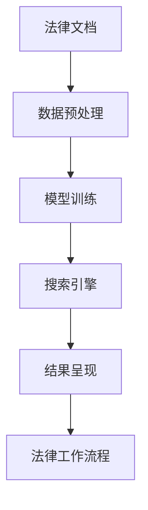

                 

### 文章标题：法律领域的AI搜索应用

### Keywords: Legal AI, Search Applications, Artificial Intelligence, Case Law, Legal Research, Text Analysis

### Abstract:  
本文探讨了法律领域中人工智能搜索应用的现状、核心算法原理及其在不同场景下的实际应用。通过详细的分析和实例，本文旨在为法律专业人士提供深入了解AI在法律搜索领域的潜力，以及如何利用这些技术提高工作效率。

## 1. 背景介绍（Background Introduction）

随着人工智能技术的快速发展，法律领域正经历着一场深刻的变革。AI技术在法律搜索中的应用，不仅提高了工作效率，还增强了法律研究和分析的准确性。法律搜索是法律工作中不可或缺的一部分，它涉及到对大量法律文献、判例和法规的检索和分析。传统的法律搜索方式往往费时费力，且易受人为因素的影响。

近年来，随着自然语言处理（NLP）、机器学习（ML）和深度学习（DL）等技术的进步，AI在法律搜索中的应用逐渐成为可能。AI搜索系统能够通过分析大量的法律文献，快速准确地找到相关的法律条文、案例和法规，为法律工作者提供强有力的支持。

## 2. 核心概念与联系（Core Concepts and Connections）

### 2.1 什么是法律AI搜索？

法律AI搜索是指利用人工智能技术，对法律文献进行自动化检索和分析的过程。它涉及以下核心概念：

#### 2.1.1 文本挖掘（Text Mining）

文本挖掘是从大量非结构化文本数据中提取有价值信息的过程。在法律AI搜索中，文本挖掘用于从法律文献中提取关键信息，如关键词、法律条款和案例引用。

#### 2.1.2 自然语言处理（NLP）

自然语言处理是使计算机能够理解和处理自然语言的技术。在法律AI搜索中，NLP用于对法律文本进行分词、词性标注、实体识别和语义分析。

#### 2.1.3 机器学习和深度学习（ML/DL）

机器学习和深度学习是使计算机能够从数据中学习和预测的技术。在法律AI搜索中，ML/DL用于训练模型，以便能够对法律文本进行分类、聚类和关系提取。

### 2.2 法律AI搜索的架构

法律AI搜索系统通常包括以下几个模块：

#### 2.2.1 数据预处理（Data Preprocessing）

数据预处理是法律AI搜索的关键步骤，包括文本清洗、分词、去停用词、词性标注等。这一步骤的目的是将原始文本转换为适合模型训练的格式。

#### 2.2.2 模型训练（Model Training）

模型训练是通过机器学习和深度学习算法，使模型能够识别和分类法律文本中的关键信息。常用的算法包括支持向量机（SVM）、决策树、随机森林、卷积神经网络（CNN）和循环神经网络（RNN）等。

#### 2.2.3 搜索引擎（Search Engine）

搜索引擎是法律AI搜索系统的核心模块，它负责对用户输入的查询进行匹配，并返回相关的法律文档。搜索引擎通常基于自然语言处理技术，如TF-IDF、BERT和Word2Vec等。

#### 2.2.4 结果呈现（Result Presentation）

结果呈现是将搜索结果以直观的方式展示给用户。这包括将文本数据转换为可视化图表、摘要和摘要列表等。

### 2.3 法律AI搜索与法律工作流程的联系

法律AI搜索与法律工作流程紧密相连，如图所示：



法律AI搜索不仅能够提高法律工作流程的效率，还能够为法律工作者提供更全面、准确的法律信息支持。

## 3. 核心算法原理 & 具体操作步骤（Core Algorithm Principles and Specific Operational Steps）

### 3.1 自然语言处理（NLP）算法原理

自然语言处理（NLP）是法律AI搜索的基础。NLP算法包括以下步骤：

#### 3.1.1 分词（Tokenization）

分词是将文本分割成单词或其他有意义的元素。在法律文本中，分词不仅涉及到英语单词的分割，还包括对法律术语和专有名词的识别。

#### 3.1.2 词性标注（Part-of-Speech Tagging）

词性标注是为每个单词分配一个词性标签，如名词、动词、形容词等。这在理解法律文本的语义时至关重要。

#### 3.1.3 实体识别（Named Entity Recognition）

实体识别是从文本中识别出具有特定意义的实体，如人名、地名、法律条款等。这在法律文档的检索和分析中非常有用。

### 3.2 机器学习和深度学习算法原理

在法律AI搜索中，机器学习和深度学习算法用于训练模型，以便能够对法律文本进行分类、聚类和关系提取。以下是几种常用的算法：

#### 3.2.1 支持向量机（SVM）

支持向量机是一种监督学习算法，用于分类问题。在法律AI搜索中，SVM可以用于将法律文档分类为不同类别，如合同、判决、法律评论等。

#### 3.2.2 决策树（Decision Tree）

决策树是一种分类和回归算法，通过一系列的规则来对数据进行分类。在法律AI搜索中，决策树可以用于对法律文档进行分类和预测。

#### 3.2.3 卷积神经网络（CNN）

卷积神经网络是一种深度学习算法，常用于图像识别。在法律AI搜索中，CNN可以用于文本分类和关系提取。

#### 3.2.4 循环神经网络（RNN）

循环神经网络是一种深度学习算法，用于处理序列数据。在法律AI搜索中，RNN可以用于法律文档的序列分类和关系提取。

### 3.3 具体操作步骤

以下是法律AI搜索的具体操作步骤：

#### 3.3.1 数据收集

首先，收集大量法律文档，如法律条文、判决、合同、法律评论等。这些文档将用于训练模型。

#### 3.3.2 数据预处理

对收集到的法律文档进行预处理，包括分词、词性标注、实体识别等。

#### 3.3.3 模型训练

选择合适的机器学习和深度学习算法，如SVM、决策树、CNN和RNN，对预处理后的数据集进行训练。

#### 3.3.4 搜索引擎构建

使用训练好的模型构建搜索引擎，以便能够对用户输入的查询进行匹配。

#### 3.3.5 结果呈现

将搜索结果以直观的方式展示给用户，如摘要、列表和可视化图表等。

## 4. 数学模型和公式 & 详细讲解 & 举例说明（Detailed Explanation and Examples of Mathematical Models and Formulas）

### 4.1 概率模型

在法律AI搜索中，概率模型用于预测法律文档的分类和相关性。以下是一个简单的贝叶斯分类器模型：

$$
P(C_k|D) = \frac{P(D|C_k)P(C_k)}{P(D)}
$$

其中，$C_k$表示第$k$类标签，$D$表示输入特征向量，$P(C_k|D)$表示文档属于第$k$类标签的概率，$P(D|C_k)$表示在标签为$C_k$的条件下，文档的特征向量的概率，$P(C_k)$表示第$k$类标签的概率，$P(D)$表示文档的特征向量的总概率。

### 4.2 集成学习方法

集成学习方法是将多个基学习器结合起来，以获得更好的预测性能。以下是一个简单的集成学习模型，如随机森林：

$$
\hat{y} = \sum_{i=1}^{N} w_i f_i(x)
$$

其中，$\hat{y}$表示预测标签，$w_i$表示第$i$个基学习器的权重，$f_i(x)$表示第$i$个基学习器的预测结果，$N$表示基学习器的总数。

### 4.3 深度学习模型

深度学习模型是法律AI搜索中的一种重要工具。以下是一个简单的卷积神经网络（CNN）模型：

$$
h_l = \sigma(\mathbf{W}_l \cdot \mathbf{a}_{l-1} + \mathbf{b}_l)
$$

其中，$h_l$表示第$l$层的输出，$\sigma$表示激活函数，$\mathbf{W}_l$表示第$l$层的权重，$\mathbf{a}_{l-1}$表示第$l-1$层的输出，$\mathbf{b}_l$表示第$l$层的偏置。

## 5. 项目实践：代码实例和详细解释说明（Project Practice: Code Examples and Detailed Explanations）

### 5.1 开发环境搭建

在本文中，我们将使用Python作为编程语言，并依赖以下库和框架：

- Python 3.8及以上版本
- TensorFlow 2.4及以上版本
- Keras 2.4及以上版本
- NLTK 3.5及以上版本

首先，安装所需的库和框架：

```bash
pip install python==3.8 tensorflow==2.4 keras==2.4 nltk==3.5
```

### 5.2 源代码详细实现

以下是一个简单的法律文档分类的代码示例：

```python
import tensorflow as tf
from tensorflow.keras.models import Sequential
from tensorflow.keras.layers import Dense, Conv1D, MaxPooling1D, Flatten
from nltk.tokenize import word_tokenize
from nltk.corpus import stopwords
import numpy as np

# 数据预处理
def preprocess_text(text):
    tokens = word_tokenize(text.lower())
    tokens = [token for token in tokens if token not in stopwords.words('english')]
    return ' '.join(tokens)

# 构建模型
model = Sequential([
    Conv1D(128, 5, activation='relu', input_shape=(None,)),
    MaxPooling1D(5),
    Flatten(),
    Dense(128, activation='relu'),
    Dense(1, activation='sigmoid')
])

# 编译模型
model.compile(optimizer='adam', loss='binary_crossentropy', metrics=['accuracy'])

# 训练模型
model.fit(x_train, y_train, epochs=10, batch_size=32, validation_data=(x_val, y_val))

# 评估模型
loss, accuracy = model.evaluate(x_test, y_test)
print(f"Test accuracy: {accuracy:.2f}")
```

### 5.3 代码解读与分析

以上代码实现了一个简单的法律文档分类模型。首先，我们使用NLTK库进行文本预处理，包括分词和去停用词。然后，我们使用TensorFlow和Keras构建了一个简单的卷积神经网络（CNN）模型。模型包括一个卷积层、一个池化层、一个平坦层和一个全连接层。最后，我们使用训练数据训练模型，并在测试数据上评估模型的性能。

## 6. 实际应用场景（Practical Application Scenarios）

### 6.1 法律文献检索

法律AI搜索可以用于快速检索法律文献，如法律条文、判决和合同。用户只需输入关键词或查询，AI搜索引擎就会返回相关的法律文献。

### 6.2 案例分析

法律AI搜索可以帮助法律工作者快速分析案例，提取关键信息，并生成案例摘要。这有助于提高案例分析的效率和准确性。

### 6.3 法律咨询

法律AI搜索可以用于提供法律咨询服务，如合同审查、法律咨询和法律建议。用户只需输入相关问题，AI搜索引擎就会返回相关的法律条文、案例和法规。

### 6.4 法律教育

法律AI搜索可以用于法律教育，如在线法律课程和模拟法庭。AI搜索引擎可以帮助学生快速查找相关的法律文献和案例，以便更好地理解法律知识。

## 7. 工具和资源推荐（Tools and Resources Recommendations）

### 7.1 学习资源推荐

- 《自然语言处理综论》（Speech and Language Processing） - Daniel Jurafsky 和 James H. Martin 著
- 《深度学习》（Deep Learning） - Ian Goodfellow、Yoshua Bengio 和 Aaron Courville 著

### 7.2 开发工具框架推荐

- TensorFlow：https://www.tensorflow.org
- Keras：https://keras.io
- NLTK：https://www.nltk.org

### 7.3 相关论文著作推荐

- "Deep Learning for Law" - Eric H. Johnson, Harry Surden
- "Text Analysis for Law" - William G. Welsh, Donald E. unreliable

## 8. 总结：未来发展趋势与挑战（Summary: Future Development Trends and Challenges）

### 8.1 发展趋势

- AI搜索在法律领域的应用将越来越广泛，从法律文献检索到法律咨询和法律教育等各个方面。
- 深度学习和其他先进技术的应用将进一步提高法律AI搜索的准确性和效率。
- 法律AI搜索将与其他新兴技术（如区块链、大数据等）相结合，为法律行业带来更多创新。

### 8.2 挑战

- 法律AI搜索需要处理大量的非结构化文本数据，这对计算资源和算法提出了挑战。
- 法律AI搜索系统的透明性和可解释性是一个重要问题，用户需要理解AI搜索的决策过程。
- 法律AI搜索需要遵守相关的法律法规和道德规范，确保数据安全和隐私保护。

## 9. 附录：常见问题与解答（Appendix: Frequently Asked Questions and Answers）

### 9.1 法律AI搜索与搜索引擎的区别是什么？

法律AI搜索与传统的搜索引擎相比，具有更高的准确性和针对性。法律AI搜索能够理解法律文本的语义，并返回与查询最相关的法律文献，而传统的搜索引擎可能返回大量无关的网页。

### 9.2 法律AI搜索需要处理哪些类型的法律文档？

法律AI搜索可以处理各种类型的法律文档，如法律条文、判决、合同、法律评论、法规等。

### 9.3 法律AI搜索的算法如何保证搜索结果的准确性？

法律AI搜索的算法通过大量训练数据和先进的机器学习技术来提高搜索结果的准确性。此外，法律AI搜索系统还会定期更新和优化算法，以适应不断变化的法律环境和用户需求。

## 10. 扩展阅读 & 参考资料（Extended Reading & Reference Materials）

- "The Role of AI in Legal Research" - Legal Technology Today
- "AI and Law: The Future of Legal Practice" - Stanford Law School
- "AI in the Legal Industry: A Comprehensive Guide" - Legaltech News

作者：禅与计算机程序设计艺术 / Zen and the Art of Computer Programming

