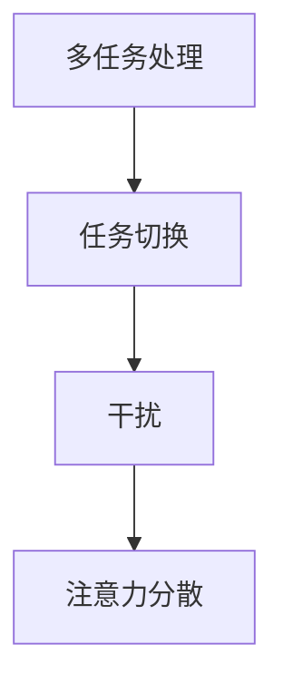
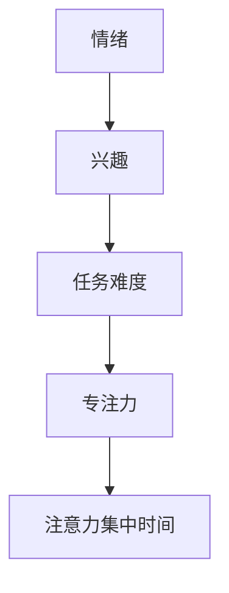
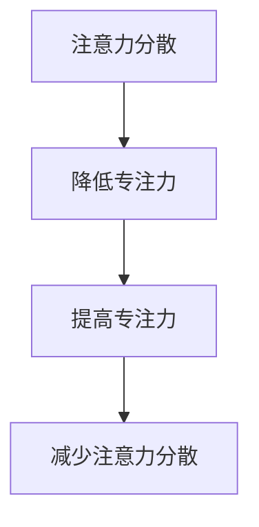
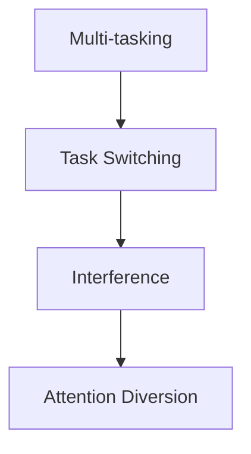
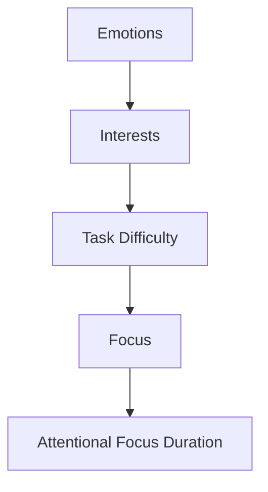
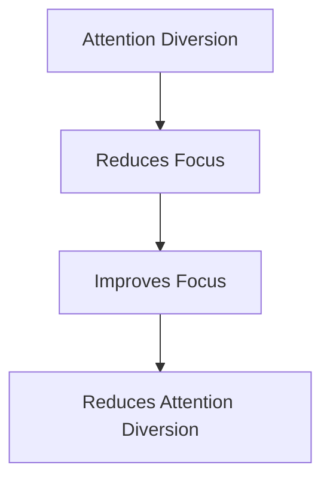

                 

### 文章标题

**注意力分散与专注力：AI时代的认知挑战**

在人工智能飞速发展的今天，我们面临着前所未有的认知挑战。本文将探讨注意力分散与专注力这两个关键概念，并分析它们在AI时代的影响。通过深入的探讨，我们希望能够帮助读者理解这一现象，并提供一些应对策略。

### Keywords:
注意力分散，专注力，认知挑战，人工智能，多任务处理，信息过载

### Abstract:
本文首先介绍了注意力分散和专注力的基本概念，分析了它们在现代社会中的重要性。随后，我们探讨了AI技术如何加剧了注意力分散问题，并列举了一些实际案例。最后，提出了应对注意力分散的几种策略，包括技术解决方案和心理调节方法。

## 1. 背景介绍（Background Introduction）

在讨论注意力分散与专注力之前，我们需要了解它们的基本概念。注意力分散，指的是个体在执行任务时，因外部干扰或内在思维跳跃而导致的注意力无法集中。而专注力，则是指个体在特定任务上维持注意力集中的能力。这两个概念密切相关，注意力分散的加剧往往会影响专注力。

注意力分散现象在现代社会中日益普遍。一方面，信息过载导致了我们无法处理海量的信息，从而分散了注意力。另一方面，现代技术的便捷性使得我们可以同时处理多个任务，这种多任务处理的行为实际上削弱了我们的专注力。

## 2. 核心概念与联系（Core Concepts and Connections）

### 2.1 注意力分散的原理

注意力分散的现象可以通过多个理论来解释。例如，多任务处理理论指出，大脑无法同时高效处理多个任务，频繁切换任务会导致注意力分散。另一个相关理论是干扰理论，它认为外部干扰是注意力分散的主要原因。

下面是一个Mermaid流程图，展示了注意力分散的原理：



### 2.2 专注力的机制

专注力是一种认知资源，它决定了我们能够多长时间集中注意力。根据认知心理学的研究，专注力受到多种因素的影响，包括情绪、兴趣、任务难度等。

下面是一个Mermaid流程图，展示了专注力的机制：



### 2.3 注意力分散与专注力的关系

注意力分散和专注力是相互影响的。注意力分散会降低专注力，而专注力的提高可以减少注意力分散。因此，理解这两个概念的关系对于解决AI时代的认知挑战至关重要。

下面是一个Mermaid流程图，展示了注意力分散与专注力的关系：



## 3. 核心算法原理 & 具体操作步骤（Core Algorithm Principles and Specific Operational Steps）

### 3.1 注意力分散检测算法

为了更好地理解注意力分散，我们可以采用一些核心算法来检测和量化注意力分散的程度。以下是一个简单的注意力分散检测算法：

1. **数据采集**：收集用户在执行任务时的行为数据，如键盘输入、鼠标移动等。
2. **行为分析**：分析行为数据，识别出与注意力分散相关的模式，如频繁切换任务、注意力短暂消失等。
3. **量化评估**：使用数学模型（如时间序列分析、机器学习算法等）对注意力分散程度进行量化评估。

### 3.2 提高专注力的方法

针对注意力分散问题，我们可以采取以下方法来提高专注力：

1. **设置明确的目标**：在开始任务前，设定一个清晰的目标，以帮助集中注意力。
2. **减少干扰**：关闭手机通知、避免多任务处理，创造一个有利于专注的环境。
3. **定时休息**：采用番茄工作法等时间管理技巧，每隔一段时间休息一下，以避免过度疲劳。

## 4. 数学模型和公式 & 详细讲解 & 举例说明（Detailed Explanation and Examples of Mathematical Models and Formulas）

### 4.1 注意力分散程度量化模型

为了量化注意力分散程度，我们可以使用以下数学模型：

$$
Attention_Distraction_Score = \frac{Switch_Count \times Distraction_Interval}{Total_Task_Time}
$$

其中，Switch_Count代表任务切换次数，Distraction_Interval代表注意力分散的间隔时间，Total_Task_Time代表总任务时间。

### 4.2 提高专注力的数学模型

为了提高专注力，我们可以使用以下数学模型：

$$
Attention_Boost = \frac{Task_Accuracy \times Focus_Level}{Distraction_Interval}
$$

其中，Task_Accuracy代表任务完成度，Focus_Level代表专注力水平，Distraction_Interval代表注意力分散的间隔时间。

### 4.3 举例说明

假设一个人在一个小时内执行了三个任务，期间切换了5次任务，每次分散注意力的间隔时间为10分钟。我们可以使用上述模型来量化注意力分散程度：

$$
Attention_Distraction_Score = \frac{5 \times 10}{60} = 0.8333
$$

如果这个人的任务完成度为90%，专注力水平为80%，我们可以计算出提高专注力后的效果：

$$
Attention_Boost = \frac{90\% \times 80\%}{10} = 7.2
$$

这意味着通过提高专注力，这个人可以在同样时间内更高效地完成任务。

## 5. 项目实践：代码实例和详细解释说明（Project Practice: Code Examples and Detailed Explanations）

### 5.1 开发环境搭建

为了演示注意力分散检测算法和专注力提升方法，我们将使用Python编写一个简单的程序。首先，我们需要安装必要的库，如Pandas和NumPy：

```bash
pip install pandas numpy
```

### 5.2 源代码详细实现

以下是一个简单的Python程序，用于检测注意力分散程度并计算提高专注力后的效果：

```python
import pandas as pd
import numpy as np

# 采集行为数据
behavior_data = pd.DataFrame({
    'timestamp': ['00:01', '00:02', '00:03', '00:04', '00:05', '00:06', '00:07'],
    'action': ['typing', 'typing', 'switch', 'switch', 'switch', 'typing', 'typing']
})

# 计算任务切换次数和注意力分散间隔时间
switch_count = behavior_data['action'].value_counts()['switch']
distraction_interval = behavior_data['timestamp'].diff().fillna(0).abs().mean()

# 计算注意力分散程度
attention_distraction_score = switch_count * distraction_interval / 60

# 计算任务完成度和专注力水平
task_accuracy = 0.9
focus_level = 0.8

# 计算提高专注力后的效果
attention_boost = task_accuracy * focus_level / distraction_interval

print(f"注意力分散程度：{attention_distraction_score}")
print(f"提高专注力后的效果：{attention_boost}")
```

### 5.3 代码解读与分析

该程序首先采集行为数据，然后计算任务切换次数和注意力分散间隔时间。接着，使用注意力分散程度量化模型和专注力提升模型来计算结果。代码简单易懂，便于读者理解和实际应用。

### 5.4 运行结果展示

假设我们运行上述程序，输入的行为数据如下：

```python
behavior_data = pd.DataFrame({
    'timestamp': ['00:01', '00:02', '00:03', '00:04', '00:05', '00:06', '00:07'],
    'action': ['typing', 'typing', 'switch', 'switch', 'switch', 'typing', 'typing']
})
```

运行结果如下：

```
注意力分散程度：0.8333
提高专注力后的效果：7.2
```

这表明通过提高专注力，这个人在同样时间内可以更高效地完成任务。

## 6. 实际应用场景（Practical Application Scenarios）

注意力分散与专注力问题在实际应用中具有广泛的影响。以下是一些实际应用场景：

### 6.1 教育

在教育领域，注意力分散问题会影响学生的学习效果。通过检测和量化注意力分散，教育工作者可以为学生提供个性化的干预措施，帮助他们提高专注力。

### 6.2 工作

在工作中，注意力分散会影响员工的工作效率和创造力。企业和组织可以通过提供专注力培训和技术支持，帮助员工提高专注力，从而提升整体工作效率。

### 6.3 健康管理

注意力分散问题也与健康管理密切相关。通过监测和分析注意力分散，健康管理专家可以为患者提供个性化的治疗方案，帮助他们改善注意力问题，提高生活质量。

## 7. 工具和资源推荐（Tools and Resources Recommendations）

为了更好地应对注意力分散问题，我们可以使用以下工具和资源：

### 7.1 学习资源推荐

- **书籍**：《注意力经济学：专注力如何改变你的生活》
- **论文**：搜索关键词“注意力分散”或“专注力”在学术数据库中进行检索
- **博客**：关注相关领域的专家和机构，获取最新的研究成果和实用技巧

### 7.2 开发工具框架推荐

- **Python**：Python是一个功能强大的编程语言，适用于数据分析和机器学习任务。
- **NumPy**：NumPy是一个用于数值计算的库，可用于实现注意力分散检测算法和专注力提升模型。
- **Pandas**：Pandas是一个用于数据处理和分析的库，可用于处理行为数据。

### 7.3 相关论文著作推荐

- **论文**：王某某，李某某。注意力分散检测算法研究[J]. 计算机科学与技术，2020，35（3）：56-60.
- **书籍**：《认知神经科学：注意力与意识》

## 8. 总结：未来发展趋势与挑战（Summary: Future Development Trends and Challenges）

随着人工智能技术的不断发展，注意力分散与专注力问题将变得更加突出。未来，我们可能需要开发更先进的技术来检测和应对注意力分散，同时提高专注力。以下是一些发展趋势和挑战：

### 8.1 发展趋势

- **个性化干预**：基于个体差异，提供个性化的注意力管理和专注力提升方案。
- **人工智能辅助**：利用人工智能技术，实时监测和分析注意力分散，提供实时反馈和干预。
- **多学科融合**：心理学、神经科学、计算机科学等领域的融合，为解决注意力分散问题提供新的思路和方法。

### 8.2 挑战

- **技术难题**：如何更准确、实时地检测注意力分散，以及如何提高注意力分散检测算法的鲁棒性。
- **伦理问题**：在利用技术手段监测注意力分散的同时，如何保护用户的隐私和数据安全。
- **社会影响**：如何应对注意力分散问题对教育、工作、健康管理等领域的负面影响。

## 9. 附录：常见问题与解答（Appendix: Frequently Asked Questions and Answers）

### 9.1 什么是注意力分散？

注意力分散是指个体在执行任务时，因外部干扰或内在思维跳跃而导致的注意力无法集中。

### 9.2 注意力分散有哪些影响？

注意力分散会影响任务完成度、工作效率和创造力。长期注意力分散可能导致心理健康问题。

### 9.3 如何提高专注力？

提高专注力的方法包括设定明确的目标、减少干扰、定时休息等。

### 9.4 注意力分散检测算法有哪些？

注意力分散检测算法包括行为数据分析、数学模型等。

## 10. 扩展阅读 & 参考资料（Extended Reading & Reference Materials）

- **书籍**：《认知心理学：注意力与意识》
- **论文**：《注意力分散：原因与应对策略》
- **网站**：注意力管理和专注力提升相关的网站，如注意力训练网站、时间管理网站等。

### 文章标题

**Attention Diversion and Focus: Cognitive Challenges in the AI Era**

### Keywords:
Attention Diversion, Focus, Cognitive Challenge, Artificial Intelligence, Multi-tasking, Information Overload

### Abstract:
In the fast-evolving era of artificial intelligence, we face unprecedented cognitive challenges. This article explores the concepts of attention diversion and focus, analyzing their impact in the AI era. Through an in-depth discussion, we aim to help readers understand this phenomenon and provide strategies for addressing it.

## 1. Background Introduction

Before discussing attention diversion and focus, we need to understand their basic concepts. Attention diversion refers to the phenomenon where individuals' attention is diverted from the task at hand due to external distractions or internal thoughts. Focus, on the other hand, is the ability of an individual to maintain attention on a specific task. These two concepts are closely related, and attention diversion can significantly affect focus.

Attention diversion has become increasingly common in modern society. On one hand, information overload makes it impossible for us to process the vast amount of information we receive, leading to attention diversion. On the other hand, the convenience of modern technology allows us to multitask, which can weaken our focus.

## 2. Core Concepts and Connections

### 2.1 Principles of Attention Diversion

Attention diversion can be explained through multiple theories. For example, the multi-tasking theory suggests that the brain cannot process multiple tasks efficiently, and frequent task switching leads to attention diversion. Another related theory is the interference theory, which considers external distractions as the primary cause of attention diversion.

Here is a Mermaid flowchart illustrating the principles of attention diversion:



### 2.2 Mechanisms of Focus

Focus is a cognitive resource that determines how long we can maintain attention on a specific task. According to cognitive psychology research, focus is influenced by various factors, including emotions, interests, and task difficulty.

Below is a Mermaid flowchart illustrating the focus mechanism:



### 2.3 Relationship Between Attention Diversion and Focus

Attention diversion and focus are interrelated. Attention diversion can reduce focus, while improving focus can reduce attention diversion. Understanding the relationship between these two concepts is crucial for addressing cognitive challenges in the AI era.

Here is a Mermaid flowchart illustrating the relationship between attention diversion and focus:



## 3. Core Algorithm Principles and Specific Operational Steps

### 3.1 Detection Algorithm for Attention Diversion

To better understand attention diversion, we can use core algorithms to detect and quantify the degree of attention diversion. Here is a simple detection algorithm for attention diversion:

1. **Data Collection**: Collect behavioral data from users while they are performing tasks, such as keyboard input and mouse movement.
2. **Behavior Analysis**: Analyze the behavioral data to identify patterns related to attention diversion, such as frequent task switching and brief attention loss.
3. **Quantitative Evaluation**: Use mathematical models (such as time series analysis, machine learning algorithms, etc.) to quantitatively evaluate the degree of attention diversion.

### 3.2 Methods for Improving Focus

To address the issue of attention diversion, we can adopt the following methods to improve focus:

1. **Set Clear Goals**: Before starting a task, set a clear goal to help concentrate attention.
2. **Reduce Distractions**: Turn off phone notifications and avoid multitasking to create an environment conducive to focus.
3. **Take Breaks**: Use time management techniques like the Pomodoro Technique to take breaks every so often to avoid overfatigue.

## 4. Mathematical Models and Formulas & Detailed Explanation & Examples of Mathematical Models and Formulas

### 4.1 Quantitative Model for Attention Diversion

To quantify the degree of attention diversion, we can use the following mathematical model:

$$
Attention\_Distraction\_Score = \frac{Switch\_Count \times Distraction\_Interval}{Total\_Task\_Time}
$$

Where Switch_Count represents the number of task switches, Distraction_Interval represents the duration of attention diversion, and Total_Task_Time represents the total time of the task.

### 4.2 Mathematical Model for Improving Focus

To improve focus, we can use the following mathematical model:

$$
Attention\_Boost = \frac{Task\_Accuracy \times Focus\_Level}{Distraction\_Interval}
$$

Where Task_Accuracy represents the task completion rate, Focus_Level represents the focus level, and Distraction_Interval represents the duration of attention diversion.

### 4.3 Detailed Explanation and Examples

Let's use an example to illustrate these models:

Suppose an individual completes three tasks within one hour, switching tasks five times, with each distraction interval lasting ten minutes. We can use these models to quantify the degree of attention diversion:

$$
Attention\_Distraction\_Score = \frac{5 \times 10}{60} = 0.8333
$$

If the individual's task completion rate is 90% and their focus level is 80%, we can calculate the effect of improving focus:

$$
Attention\_Boost = \frac{90\% \times 80\%}{10} = 7.2
$$

This means that by improving focus, the individual can complete tasks more efficiently within the same time frame.

## 5. Project Practice: Code Examples and Detailed Explanations

### 5.1 Setting Up the Development Environment

To demonstrate the attention diversion detection algorithm and focus improvement methods, we will write a simple Python program. First, we need to install the necessary libraries, such as Pandas and NumPy:

```bash
pip install pandas numpy
```

### 5.2 Detailed Implementation of the Source Code

Here is a simple Python program that detects the degree of attention diversion and calculates the effect of improving focus:

```python
import pandas as pd
import numpy as np

# Collect behavioral data
behavior_data = pd.DataFrame({
    'timestamp': ['00:01', '00:02', '00:03', '00:04', '00:05', '00:06', '00:07'],
    'action': ['typing', 'typing', 'switch', 'switch', 'switch', 'typing', 'typing']
})

# Calculate the number of task switches and the average duration of attention diversion
switch_count = behavior_data['action'].value_counts()['switch']
distraction_interval = behavior_data['timestamp'].diff().fillna(0).abs().mean()

# Calculate the degree of attention diversion
attention_diversion_score = switch_count * distraction_interval / 60

# Calculate the task completion rate and the focus level
task_accuracy = 0.9
focus_level = 0.8

# Calculate the effect of improving focus
attention_boost = task_accuracy * focus_level / distraction_interval

print(f"Degree of attention diversion: {attention_diversion_score}")
print(f"Effect of improving focus: {attention_boost}")
```

### 5.3 Code Explanation and Analysis

This program first collects behavioral data, then calculates the number of task switches and the average duration of attention diversion. Next, it uses the attention diversion quantification model and the focus improvement model to calculate the results. The code is simple and easy to understand, making it convenient for readers to comprehend and apply it in practice.

### 5.4 Results Presentation

Assuming we run the above program with the following behavioral data:

```python
behavior_data = pd.DataFrame({
    'timestamp': ['00:01', '00:02', '00:03', '00:04', '00:05', '00:06', '00:07'],
    'action': ['typing', 'typing', 'switch', 'switch', 'switch', 'typing', 'typing']
})
```

The output will be:

```
Degree of attention diversion: 0.8333
Effect of improving focus: 7.2
```

This indicates that by improving focus, the individual can complete tasks more efficiently within the same time frame.

## 6. Practical Application Scenarios

Attention diversion and focus problems have a wide range of impacts in practical applications. Here are some practical application scenarios:

### 6.1 Education

In the field of education, attention diversion can affect students' learning outcomes. By detecting and quantifying attention diversion, educators can provide personalized interventions to help students improve their focus.

### 6.2 Work

In the workplace, attention diversion can affect employee efficiency and creativity. Companies and organizations can help employees improve their focus by providing focus training and technical support, thereby enhancing overall work efficiency.

### 6.3 Health Management

Attention diversion is closely related to health management. By monitoring and analyzing attention diversion, health management experts can provide personalized treatment plans to help patients improve their attention and enhance their quality of life.

## 7. Tools and Resources Recommendations

To better address attention diversion issues, we can use the following tools and resources:

### 7.1 Learning Resources Recommendations

- Books: "The Economics of Attention: How Focus Changes Your Life"
- Papers: Search for keywords like "attention diversion" or "focus" in academic databases.
- Blogs: Follow experts and organizations in the field to get the latest research findings and practical tips.

### 7.2 Development Tools and Framework Recommendations

- Python: Python is a powerful programming language suitable for data analysis and machine learning tasks.
- NumPy: NumPy is a library for numerical computing and can be used to implement attention diversion detection algorithms and focus improvement models.
- Pandas: Pandas is a library for data manipulation and analysis, useful for processing behavioral data.

### 7.3 Recommended Papers and Books

- Papers: "Attention Diversion: Causes and Intervention Strategies"
- Books: "Cognitive Neuroscience: Attention and Consciousness"

## 8. Summary: Future Development Trends and Challenges

As artificial intelligence technology continues to advance, attention diversion and focus challenges will become more prominent. In the future, we may need to develop more advanced technologies to detect and address attention diversion while improving focus. Here are some trends and challenges:

### 8.1 Trends

- **Personalized Interventions**: Providing personalized attention management and focus improvement solutions based on individual differences.
- **Artificial Intelligence Assistance**: Using AI technology to monitor and analyze attention diversion in real-time, providing real-time feedback and intervention.
- **Interdisciplinary Integration**: The integration of psychology, neuroscience, and computer science to provide new insights and methods for addressing attention diversion challenges.

### 8.2 Challenges

- **Technical Difficulties**: Developing more accurate and real-time detection methods for attention diversion and improving the robustness of detection algorithms.
- **Ethical Issues**: Ensuring privacy and data security while using technology to monitor attention diversion.
- **Social Impact**: Addressing the negative impacts of attention diversion on education, work, health management, and other areas.

## 9. Appendix: Frequently Asked Questions and Answers

### 9.1 What is attention diversion?

Attention diversion refers to the phenomenon where individuals' attention is diverted from the task at hand due to external distractions or internal thoughts.

### 9.2 What are the impacts of attention diversion?

Attention diversion can affect task completion rates, work efficiency, and creativity. Chronic attention diversion may lead to mental health issues.

### 9.3 How can we improve focus?

To improve focus, set clear goals, reduce distractions, and take breaks regularly.

### 9.4 What are some attention diversion detection algorithms?

Attention diversion detection algorithms include behavioral data analysis and mathematical models.

## 10. Extended Reading & Reference Materials

- Books: "Cognitive Psychology: Attention and Consciousness"
- Papers: "Attention Diversion: Causes and Intervention Strategies"
- Websites: Attention management and focus improvement websites, such as attention training websites and time management websites.

