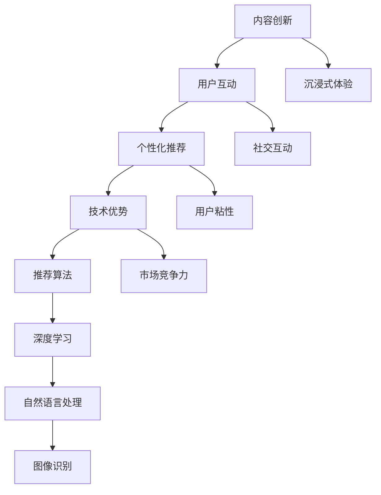

                 

### 文章标题

《注意力战争策略：元宇宙信息主导权的竞争》

### Keywords:  
Metaverse, Attention Wars, Information Dominance, Competition Strategies

### Abstract:  
随着元宇宙的兴起，信息主导权成为各大科技巨头争夺的焦点。本文深入探讨了元宇宙中的注意力战争，分析了其核心概念、算法原理、实际应用场景，并提出了未来发展趋势与挑战。通过案例解析和策略建议，为企业在元宇宙中争夺信息主导权提供指导。

## 1. 背景介绍（Background Introduction）

元宇宙（Metaverse）是一个由虚拟现实、增强现实、游戏、社交网络等构成的虚拟世界，用户可以通过数字化身在其中进行互动、工作和娱乐。随着技术的不断发展，元宇宙逐渐成为一个全新的商业模式和社会形态。

### 1.1 元宇宙的兴起

近年来，元宇宙概念在全球范围内迅速崛起，成为各大科技公司的战略重点。Facebook（现更名为Meta）在2021年宣布全面转型元宇宙，微软、谷歌、腾讯等公司也纷纷加大对元宇宙的投入。元宇宙的发展不仅推动了硬件设备的创新，如虚拟现实头盔、增强现实眼镜等，还催生了大量的虚拟商品和服务。

### 1.2 信息主导权的争夺

在元宇宙中，信息主导权成为各大科技公司争夺的焦点。谁能够占据更多的用户注意力、掌握更全面的信息资源，谁就能在元宇宙中获得更大的竞争优势。因此，如何制定有效的注意力战争策略，成为元宇宙竞争中至关重要的一环。

## 2. 核心概念与联系（Core Concepts and Connections）

在探讨注意力战争策略之前，我们需要了解一些核心概念和架构，以便更好地理解元宇宙中的信息竞争。

### 2.1 什么是注意力？

注意力是一种有限的认知资源，用于处理和理解信息。在元宇宙中，用户的注意力被视为一种宝贵的资源，各大科技公司通过提供有趣、有价值的虚拟体验来吸引用户的注意力。

### 2.2 注意力战争的核心概念

注意力战争（Attention Wars）是指元宇宙中的各大科技公司为争夺用户注意力而展开的竞争。这场战争涉及以下几个方面：

1. **内容创新**：通过提供新颖、有趣的虚拟内容来吸引用户的注意力。
2. **用户互动**：通过增强用户之间的互动体验，提高用户的参与度和忠诚度。
3. **个性化推荐**：根据用户的兴趣和行为，提供个性化的内容和服务，以增加用户的粘性。
4. **技术优势**：通过技术创新，提高虚拟体验的沉浸感和互动性，吸引用户的注意力。

### 2.3 注意力战争中的算法原理

在注意力战争中，算法原理起着至关重要的作用。以下是一些核心算法原理：

1. **推荐算法**：通过分析用户的兴趣和行为，推荐用户可能感兴趣的内容，从而提高用户的粘性。
2. **深度学习**：利用深度学习技术，提高虚拟体验的沉浸感和互动性。
3. **自然语言处理**：通过自然语言处理技术，实现用户与虚拟世界的自然交互。
4. **图像识别**：通过图像识别技术，实现虚拟世界的现实感知和互动。

### 2.4 注意力战争中的联系

注意力战争中的各个核心概念和算法原理相互关联，共同构成了一个复杂的生态体系。以下是一个简化的 Mermaid 流程图，展示了注意力战争中的主要联系：

## 3. 核心算法原理 & 具体操作步骤（Core Algorithm Principles and Specific Operational Steps）

在注意力战争中，核心算法原理是各大科技公司争夺用户注意力的关键。以下将介绍一些核心算法原理，并给出具体操作步骤。

### 3.1 推荐算法

推荐算法是一种根据用户的兴趣和行为，为用户推荐相关内容的技术。以下是推荐算法的具体操作步骤：

1. **数据收集**：收集用户在元宇宙中的行为数据，如浏览记录、互动行为、购买记录等。
2. **数据预处理**：对收集到的数据进行清洗、去噪和归一化处理，以便后续分析。
3. **特征提取**：根据用户行为数据，提取用户兴趣特征，如热门话题、兴趣标签等。
4. **模型训练**：利用机器学习技术，如协同过滤、矩阵分解等，训练推荐模型。
5. **推荐生成**：根据训练好的推荐模型，为用户生成个性化的推荐列表。
6. **反馈调整**：根据用户对推荐内容的反馈，调整推荐算法，以提高推荐效果。

### 3.2 深度学习

深度学习是一种通过模拟人脑神经元连接的网络结构，实现自动特征提取和模式识别的技术。以下是深度学习在注意力战争中的应用步骤：

1. **数据准备**：收集元宇宙中的大量图像、音频、文本等数据。
2. **模型架构设计**：设计合适的深度学习模型架构，如卷积神经网络（CNN）、循环神经网络（RNN）等。
3. **模型训练**：利用大量数据进行模型训练，优化模型参数。
4. **模型评估**：通过验证集和测试集，评估模型性能，调整模型参数。
5. **模型部署**：将训练好的模型部署到元宇宙平台，实现实时图像识别、语音识别等功能。

### 3.3 自然语言处理

自然语言处理是一种通过计算机技术理解和生成自然语言的技术。以下是自然语言处理在注意力战争中的应用步骤：

1. **数据准备**：收集元宇宙中的对话、文本评论等数据。
2. **文本预处理**：对文本数据进行清洗、分词、去停用词等处理。
3. **特征提取**：利用词袋模型、词嵌入等技术，提取文本特征。
4. **模型训练**：利用机器学习技术，如循环神经网络（RNN）、Transformer等，训练自然语言处理模型。
5. **模型评估**：通过验证集和测试集，评估模型性能，调整模型参数。
6. **模型部署**：将训练好的模型部署到元宇宙平台，实现实时对话生成、文本理解等功能。

### 3.4 图像识别

图像识别是一种通过计算机视觉技术，从图像中提取目标对象的技术。以下是图像识别在注意力战争中的应用步骤：

1. **数据准备**：收集元宇宙中的大量图像数据。
2. **图像预处理**：对图像数据进行缩放、旋转、裁剪等处理，提高模型训练效果。
3. **特征提取**：利用卷积神经网络（CNN）等模型，提取图像特征。
4. **模型训练**：利用大量图像数据进行模型训练，优化模型参数。
5. **模型评估**：通过验证集和测试集，评估模型性能，调整模型参数。
6. **模型部署**：将训练好的模型部署到元宇宙平台，实现实时图像识别、目标检测等功能。

## 4. 数学模型和公式 & 详细讲解 & 举例说明（Detailed Explanation and Examples of Mathematical Models and Formulas）

在注意力战争中，数学模型和公式起着至关重要的作用。以下将介绍一些常用的数学模型和公式，并给出详细的讲解和示例。

### 4.1 推荐算法中的协同过滤

协同过滤是一种基于用户行为数据，为用户推荐相似物品的技术。其核心思想是利用用户之间的相似度来预测用户对物品的兴趣。

1. **相似度计算**

   假设用户集为 U = {u1, u2, ..., un}，物品集为 I = {i1, i2, ..., im}。对于任意两个用户 ui 和 uj，他们的相似度可以通过余弦相似度计算：

   $$cosine\_similarity(ui, uj) = \frac{ui \cdot uj}{\|ui\| \|uj\|}$$

   其中，ui 和 uj 分别表示用户 ui 和 uj 的行为向量，\|ui\| 和 \|uj\| 分别表示用户 ui 和 uj 的行为向量范数。

2. **推荐生成**

   假设用户 ui 对物品 ik 的兴趣为 ri，推荐列表中包含 k 个物品。对于每个未评分的物品 ij，其推荐分值可以通过以下公式计算：

   $$score(ui, ij) = \sum_{ui \in U, ik \in I, ki > 0} ki \cdot cosine\_similarity(ui, uj)$$

   其中，ki 表示用户 ui 对物品 ik 的兴趣。

### 4.2 深度学习中的卷积神经网络（CNN）

卷积神经网络是一种基于卷积操作的深度学习模型，广泛应用于图像识别、目标检测等领域。其核心思想是通过多层卷积和池化操作，提取图像特征。

1. **卷积操作**

   假设输入图像为 X，卷积核为 K，步长为 s，填充为 p。卷积操作可以通过以下公式计算：

   $$C_{ij} = \sum_{k=1}^{K} X_{i+kj+p} \cdot K_{kj}$$

   其中，Cij 表示卷积结果，Xi+kj+p 表示输入图像中对应位置像素值，Kkj 表示卷积核中对应位置像素值。

2. **池化操作**

   池化操作用于减少特征图的空间维度，提高模型鲁棒性。常见的池化操作有最大池化和平均池化。

   最大池化公式如下：

   $$P_{ij} = \max_{k} X_{ij+k}$$

   其中，Pij 表示池化结果，Xij+k 表示输入特征图中对应位置像素值。

### 4.3 自然语言处理中的词嵌入

词嵌入是一种将词汇映射到高维向量空间的技术，用于表示词汇之间的关系。常见的词嵌入方法有 Word2Vec、GloVe 等。

1. **Word2Vec**

   Word2Vec 是一种基于神经网络的词嵌入方法，其核心思想是通过训练神经网络，将词汇映射到高维向量空间。

   假设输入词汇为 w，隐藏层状态为 h，输出层状态为 v。Word2Vec 的损失函数可以通过以下公式计算：

   $$loss(w, v) = \frac{1}{2} \sum_{h'} (v - h')(v - h')^T$$

   其中，h' 表示隐藏层状态，v 表示输出层状态。

2. **GloVe**

   GloVe 是一种基于全局上下文信息的词嵌入方法，其核心思想是通过计算词汇在全局上下文中的共现矩阵，学习词汇的向量表示。

   假设词汇 v 在文档 D 中出现的次数为 f(v, D)，词汇 v 的向量表示为 v。GloVe 的损失函数可以通过以下公式计算：

   $$loss(v, v') = \frac{1}{2} (v - v')^T (v - v')$$

   其中，v' 表示与词汇 v 共现的词汇的向量表示。

### 4.4 图像识别中的目标检测

目标检测是一种在图像中检测并定位感兴趣的目标的技术。常见的目标检测算法有 R-CNN、Faster R-CNN、YOLO 等。

1. **R-CNN**

   R-CNN 是一种基于区域提议和分类的目标检测算法。其核心思想是首先通过区域提议方法生成候选区域，然后对每个候选区域进行分类。

   区域提议公式如下：

   $$R_{ij} = \frac{1}{C} \sum_{c=1}^{C} (x_c - x_j)^2 + (y_c - y_j)^2$$

   其中，Rij 表示候选区域，xc 和 yc 分别表示候选区域的中心点坐标，C 表示候选区域数量。

   分类公式如下：

   $$P(y_j = 1 | R_{ij}) = \frac{1}{1 + e^{-\beta (R_{ij} - \theta)}}$$

   其中，y

