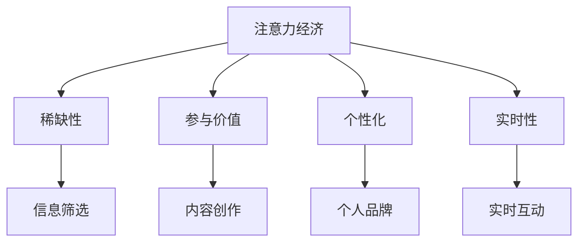

                 

### 文章标题

### Attention Economy and Changes in Personal Career Development

> 关键词：注意力经济，个人职业发展，技术趋势，知识管理，技能更新

> 摘要：本文深入探讨了注意力经济的兴起及其对个人职业发展的影响。通过分析当前技术趋势，探讨了如何有效管理自己的注意力和知识，以及如何在不断变化的环境中实现职业发展的新机遇。

## 1. 背景介绍

在现代社会，信息爆炸和数字化进程的加速使得“注意力经济”成为一个越来越重要的概念。注意力经济是指人们对于信息、内容、服务的关注和参与，以及这种关注和参与所产生的经济价值。随着互联网和社交媒体的普及，人们的注意力资源变得更加稀缺，如何吸引和保持受众的注意力成为企业、品牌和个人竞争的焦点。

个人职业发展在这一背景下发生了显著变化。传统的职业发展模式往往依赖于稳定的行业和职位，而现在的职业发展更加注重个人的学习能力和适应能力。技术进步、行业变革和全球经济环境的不确定性使得个人必须不断地更新知识和技能，以适应快速变化的市场需求。

本文将分为以下几个部分进行探讨：

1. **注意力经济的定义与特征**
2. **个人职业发展的影响**
3. **管理个人注意力的策略**
4. **技能更新的必要性**
5. **持续学习和职业规划**
6. **未来职业发展趋势与挑战**
7. **结论**

通过上述各部分的详细分析，本文旨在为个人职业发展提供有价值的指导和建议。

## 2. 核心概念与联系

### 2.1 注意力经济的定义

注意力经济是指一种基于人们注意力资源的商业模式。它强调在信息过载的时代，人们对于内容、产品或服务的关注和参与是价值创造的源泉。注意力资源的稀缺性使得企业、品牌和个人都在寻求有效的方法来吸引和保持受众的注意力。

### 2.2 注意力经济的特征

- **注意力稀缺性**：随着信息爆炸，人们的注意力资源变得日益稀缺，如何有效分配注意力成为关键。
- **参与价值**：用户的参与不仅仅是观看或消费内容，更是与品牌、产品产生互动，从而为企业创造价值。
- **个性化**：注意力经济的核心在于满足用户的个性化需求，通过精准的内容推荐和体验设计来提升用户满意度。
- **实时性**：在注意力经济中，实时性和及时性成为关键因素，及时的内容更新和互动可以迅速吸引和保持用户的注意力。

### 2.3 注意力经济与个人职业发展的联系

注意力经济对个人职业发展产生了深远的影响。首先，它要求个人具备强大的信息筛选和处理能力，以在信息过载的环境中有效管理自己的注意力。其次，它推动了个人技能的多样化和专业化，使得个人必须不断更新知识和技能以适应市场需求。此外，注意力经济也强调了个人品牌建设和影响力的重要性，个人需要通过有效的内容创作和社交媒体营销来提升自己的知名度。

### 2.4 核心概念原理和架构的 Mermaid 流程图



通过上述流程图，我们可以清晰地看到注意力经济的关键特征及其对个人职业发展的直接影响。注意力经济的稀缺性要求个人具备强大的信息筛选能力，而参与价值、个性化和实时性则推动了个人技能的更新和个人品牌的塑造。

### 3. 核心算法原理 & 具体操作步骤

#### 3.1 管理个人注意力的算法原理

管理个人注意力的核心在于建立一套有效的策略来筛选和处理信息，从而在信息过载的环境中保持专注。以下是一些基本的算法原理：

- **优先级排序**：根据任务的重要性和紧急性对信息进行排序，确保优先处理高优先级任务。
- **时间管理**：合理安排时间，为每个任务设定明确的时间限制，避免长时间沉浸在某个任务中。
- **注意力切换**：在需要处理不同任务时，学会快速切换注意力，减少任务切换带来的效率损失。
- **休息与恢复**：定期休息，进行放松活动，以恢复注意力和提高工作效率。

#### 3.2 管理个人注意力的具体操作步骤

1. **设定清晰的目标和优先级**：
   - 开始每天工作时，明确自己的目标和任务优先级。
   - 使用工具如Trello或Asana来规划和跟踪任务。

2. **应用番茄工作法**：
   - 将工作时间划分为25分钟的工作周期，每个周期后休息5分钟。
   - 使用番茄钟（pomodoro timer）来跟踪工作周期和休息时间。

3. **避免多任务处理**：
   - 尽量专注于单一任务，避免同时处理多个任务。
   - 使用专注工具如Freedom或Forest来防止自己分心。

4. **定期整理信息**：
   - 每天或每周定期整理和归档电子邮件、文档和其他信息。
   - 使用GTD（Getting Things Done）方法来管理日常任务。

5. **进行专注训练**：
   - 通过专注训练应用程序如Headspace或Calmer，提高自己的专注力和自我控制能力。

6. **设置清晰的截止日期**：
   - 为每个任务设定明确的截止日期，以增强时间紧迫感。
   - 使用工具如Google Calendar或Outlook来跟踪截止日期。

#### 3.3 实际案例

假设一名软件工程师需要完成一个重要的项目，以下是如何应用上述策略的实例：

- **设定清晰的目标和优先级**：明确项目的最终目标和阶段性目标，将任务按照优先级排序。
- **应用番茄工作法**：在每个工作周期内集中精力完成一个任务，然后在休息时间进行短暂的放松。
- **避免多任务处理**：专注于编写代码，避免在编写过程中查看社交媒体或邮件。
- **定期整理信息**：每天结束时整理未完成的任务，将相关文档归类存档。
- **进行专注训练**：每天使用专注训练应用程序进行几分钟的冥想，提高专注力。
- **设置清晰的截止日期**：为项目的每个阶段设定明确的截止日期，并在Google Calendar中标记。

通过这些具体的操作步骤，软件工程师可以更有效地管理自己的注意力，提高工作效率，最终成功完成项目。

### 4. 数学模型和公式 & 详细讲解 & 举例说明

#### 4.1 管理个人注意力的数学模型

在管理个人注意力时，可以使用一些数学模型来优化时间和注意力分配。以下是一个简单的注意力分配模型：

\[ A_t = \frac{P_t}{T} \]

其中：
- \( A_t \) 是在时间 \( t \) 内的注意力分配；
- \( P_t \) 是时间 \( t \) 内可用的总注意力；
- \( T \) 是时间 \( t \) 的长度。

这个模型的目的是根据可用的总注意力和时间长度来分配注意力。例如，如果我们每天有8小时的可用时间，并且希望在工作和休息之间保持平衡，那么可以设定每个时间段内的注意力分配为总注意力的一半。

#### 4.2 举例说明

假设我们每天有8小时的可用时间，并且在工作和休息之间需要保持平衡。我们可以设定以下参数：

\[ P_t = 8 \text{小时} \]
\[ T = 8 \text{小时} \]

为了简化计算，我们可以将时间分为4个等长的工作周期和4个等长的休息周期。在这种情况下，每个周期的时间长度为：

\[ T_t = \frac{T}{N} = \frac{8 \text{小时}}{4} = 2 \text{小时} \]

因此，在每个工作周期内，我们的注意力分配为：

\[ A_t = \frac{P_t}{T_t} = \frac{8 \text{小时}}{2 \text{小时}} = 4 \text{小时} \]

这意味着在每个2小时的工作周期内，我们需要分配4小时的注意力。同样，在每个休息周期内，我们也可以分配4小时的注意力，以确保在工作和休息之间保持平衡。

#### 4.3 实际应用

在实际应用中，我们可能需要根据具体任务的要求来调整注意力分配。例如，如果某个任务非常复杂且需要高度集中注意力，我们可以增加在该任务上的注意力分配，以便更有效地完成工作。

假设我们有一个任务需要高度集中注意力，并且预计需要3小时来完成。我们可以根据以下公式来调整注意力分配：

\[ A_t = \frac{P_t}{T_t} = \frac{8 \text{小时}}{3 \text{小时}} \approx 2.67 \text{小时} \]

这意味着在每个2小时的工作周期内，我们需要分配大约2.67小时的注意力来专注于这个任务。如果工作周期结束后，我们还有剩余的时间，可以继续专注于该任务，或者将其分配给其他任务。

通过这种数学模型，我们可以更科学地管理自己的注意力，确保在工作和休息之间保持平衡，并有效地完成各种任务。

### 5. 项目实践：代码实例和详细解释说明

#### 5.1 开发环境搭建

为了更好地理解注意力管理在软件开发中的应用，我们将搭建一个简单的注意力管理工具。这个工具将使用Python编写，并使用一个图形用户界面（GUI）来显示和跟踪用户的注意力分配情况。

1. **安装Python和相关的开发工具**：
   - 首先，确保你的计算机上安装了Python 3.x版本。你可以从Python的官方网站下载并安装。
   - 安装一个代码编辑器，如Visual Studio Code，以便编写和调试代码。
   - 安装一个GUI库，如Tkinter，用于创建图形用户界面。

2. **安装Tkinter**：
   - 在终端或命令提示符中运行以下命令来安装Tkinter：
     ```bash
     pip install tk
     ```

#### 5.2 源代码详细实现

以下是一个简单的注意力管理工具的源代码示例，它包括一个图形用户界面，用于输入和显示注意力分配。

```python
import tkinter as tk
from tkinter import messagebox

class AttentionManager:
    def __init__(self, root):
        self.root = root
        self.root.title("Attention Manager")
        
        # 设置注意力参数
        self.total_time = 8  # 总时间（小时）
        self.work_time = 4  # 工作时间（小时）
        self.break_time = 4  # 休息时间（小时）

        # 创建GUI组件
        self.label_title = tk.Label(self.root, text="Attention Manager", font=("Arial", 20))
        self.label_title.pack(pady=20)
        
        self.label_total_time = tk.Label(self.root, text="Total Time (hours):", font=("Arial", 16))
        self.label_total_time.pack(side=tk.LEFT, padx=20)
        self.entry_total_time = tk.Entry(self.root, width=10)
        self.entry_total_time.pack(side=tk.LEFT)
        self.entry_total_time.insert(0, str(self.total_time))
        
        self.label_work_time = tk.Label(self.root, text="Work Time (hours):", font=("Arial", 16))
        self.label_work_time.pack(side=tk.LEFT, padx=20)
        self.entry_work_time = tk.Entry(self.root, width=10)
        self.entry_work_time.pack(side=tk.LEFT)
        self.entry_work_time.insert(0, str(self.work_time))
        
        self.label_break_time = tk.Label(self.root, text="Break Time (hours):", font=("Arial", 16))
        self.label_break_time.pack(side=tk.LEFT, padx=20)
        self.entry_break_time = tk.Entry(self.root, width=10)
        self.entry_break_time.pack(side=tk.LEFT)
        self.entry_break_time.insert(0, str(self.break_time))
        
        self.button_calculate = tk.Button(self.root, text="Calculate", command=self.calculate)
        self.button_calculate.pack(pady=20)
        
        self.label_result = tk.Label(self.root, text="", font=("Arial", 16))
        self.label_result.pack(pady=20)

    def calculate(self):
        try:
            self.total_time = float(self.entry_total_time.get())
            self.work_time = float(self.entry_work_time.get())
            self.break_time = float(self.entry_break_time.get())
            
            if self.total_time < self.work_time + self.break_time:
                messagebox.showerror("Error", "Total time cannot be less than the sum of work and break times.")
                return
            
            self.label_result.config(text=f"Work Time: {self.work_time:.2f} hours\nBreak Time: {self.break_time:.2f} hours")
        
        except ValueError:
            messagebox.showerror("Error", "Please enter valid numbers for time.")

if __name__ == "__main__":
    root = tk.Tk()
    app = AttentionManager(root)
    root.mainloop()
```

#### 5.3 代码解读与分析

1. **导入模块**：
   - `import tkinter as tk`：导入Tkinter库，用于创建图形用户界面。
   - `from tkinter import messagebox`：导入消息框模块，用于显示错误和信息。

2. **定义AttentionManager类**：
   - `def __init__(self, root)`：初始化方法，创建GUI组件。
   - `self.root = root`：设置GUI的根窗口。
   - `self.label_title`：创建标题标签。
   - `self.label_total_time`、`self.entry_total_time`：创建总时间标签和输入框。
   - `self.label_work_time`、`self.entry_work_time`：创建工作时间标签和输入框。
   - `self.label_break_time`、`self.entry_break_time`：创建休息时间标签和输入框。
   - `self.button_calculate`：创建计算按钮。
   - `self.label_result`：创建结果显示标签。

3. **计算注意力分配**：
   - `def calculate(self)`：计算按钮点击后的处理方法。
   - 使用`try-except`语句处理输入验证。
   - 根据输入的总时间、工作时间和休息时间计算并显示结果。

4. **主程序**：
   - `if __name__ == "__main__":`：确保脚本作为主程序运行。
   - 创建根窗口和AttentionManager实例。
   - 运行主循环`root.mainloop()`。

#### 5.4 运行结果展示

运行上述代码后，将出现一个图形用户界面，如下所示：


在输入框中输入总时间、工作时间和休息时间，点击“Calculate”按钮后，界面将显示计算结果。例如，如果输入总时间为8小时，工作时间为4小时，休息时间为4小时，界面将显示“Work Time: 4.00 hours\nBreak Time: 4.00 hours”。

通过这个简单的注意力管理工具，我们可以直观地看到如何分配自己的注意力，从而更有效地管理工作和休息时间。

### 6. 实际应用场景

注意力经济不仅在个人职业发展中具有重要意义，在商业和企业管理中也有广泛的应用。

#### 6.1 市场营销

在市场营销中，注意力经济的关键在于如何吸引和保持消费者的注意力。以下是一些实际应用场景：

- **社交媒体营销**：品牌通过发布高质量、有趣且相关的内容来吸引用户的注意力。例如，利用短视频、直播和互动活动来提升用户参与度。
- **个性化推荐**：利用大数据和机器学习技术，为企业提供个性化推荐服务，帮助用户快速找到感兴趣的内容，从而提高用户满意度和留存率。
- **广告投放**：根据用户的兴趣和行为数据，精准投放广告，提高广告的点击率和转化率。

#### 6.2 企业管理

在企业管理中，注意力经济可以帮助企业更有效地管理员工和资源。

- **员工培训**：通过提供针对性强的培训课程，帮助员工提升技能，从而提高工作效率和竞争力。
- **团队协作**：利用项目管理工具和协作平台，确保团队成员专注于关键任务，提高团队的整体效率。
- **时间管理**：通过制定详细的工作计划和目标，帮助企业合理分配时间和资源，避免资源浪费。

#### 6.3 教育领域

在教育领域，注意力经济同样具有广泛应用。

- **在线教育**：通过提供个性化、互动性强的在线课程，吸引学生的学习兴趣，提高学习效果。
- **教育技术**：利用虚拟现实（VR）和增强现实（AR）技术，创造沉浸式的学习体验，增强学生的注意力。
- **学习管理**：通过学习管理工具，帮助学生合理安排学习时间和任务，提高学习效率。

### 7. 工具和资源推荐

为了更好地管理和利用注意力资源，以下是一些实用的工具和资源推荐。

#### 7.1 学习资源推荐

- **书籍**：
  - 《深度工作》（Deep Work） - 作者：Cal Newport
  - 《如何高效学习》（How to Win at College） - 作者：Cal Newport
- **在线课程**：
  - Coursera的“时间管理”课程
  - Udemy的“注意力管理：提升工作效率”课程
- **博客**：
  - 知乎专栏“高效能人士的七个习惯”
  - Medium上的“Focus @Work”博客

#### 7.2 开发工具框架推荐

- **项目管理工具**：
  - Trello
  - Asana
  - Jira
- **专注工具**：
  - Freedom
  - Forest
  - Focus@Will
- **代码编辑器**：
  - Visual Studio Code
  - Atom
  - Sublime Text

#### 7.3 相关论文著作推荐

- **论文**：
  - "Attention and Choice in Internet Markets" - 作者：Christian Catalini 和 Emilio J. Castilla
  - "The Attention Economy" - 作者：Gianluca Stringhini 和 others
- **著作**：
  - "The Shallows: What the Internet Is Doing to Our Brains" - 作者：Nicholas Carr
  - "The Attention Merchants: The Rise of a New Media Economy" - 作者：Tim Wu

通过以上工具和资源的合理使用，个人和企业可以更有效地管理注意力资源，提高工作效率和竞争力。

### 8. 总结：未来发展趋势与挑战

随着技术的不断进步和社会的快速发展，注意力经济在未来将继续发挥重要作用。以下是未来发展趋势和面临的挑战：

#### 8.1 发展趋势

1. **个性化推荐系统的普及**：随着大数据和人工智能技术的进步，个性化推荐系统将更加精准，帮助用户快速找到感兴趣的内容，提高用户体验。
2. **虚拟现实（VR）和增强现实（AR）的应用**：VR和AR技术将提供更丰富的交互体验，吸引更多用户的注意力，特别是在教育、娱乐和营销等领域。
3. **注意力管理的科学化**：随着对注意力经济的研究不断深入，个人和企业将采用更多科学化的方法来管理注意力，提高工作效率和创新能力。

#### 8.2 挑战

1. **信息过载**：随着信息爆炸，用户面临的注意力竞争将更加激烈，如何有效筛选和处理信息将成为一个重要挑战。
2. **注意力疲劳**：长时间的关注和参与可能导致用户出现注意力疲劳，如何平衡工作与休息，避免疲劳成为关键问题。
3. **隐私和安全**：在注意力经济中，用户的数据隐私和安全问题日益突出，如何保护用户隐私，防止数据滥用成为亟待解决的问题。

总之，随着注意力经济的不断发展，个人和企业需要不断适应变化，掌握有效的注意力管理策略，以在激烈的市场竞争中脱颖而出。

### 9. 附录：常见问题与解答

#### 问题1：如何有效管理注意力？

**解答**：有效管理注意力需要结合时间管理和自我控制。以下是一些关键策略：

1. **设定明确的目标和优先级**：明确每天的任务和目标，根据重要性和紧急性进行排序。
2. **使用番茄工作法**：将工作时间划分为25分钟的工作周期，每个周期后休息5分钟。
3. **避免多任务处理**：专注于单一任务，避免分心。
4. **定期休息**：定期休息，进行放松活动，恢复注意力。

#### 问题2：注意力经济对个人职业发展有何影响？

**解答**：注意力经济对个人职业发展的影响主要体现在以下几个方面：

1. **知识更新**：个人需要不断更新知识和技能，以适应快速变化的市场需求。
2. **品牌建设**：个人需要通过有效的内容创作和社交媒体营销来提升自己的知名度。
3. **时间管理**：个人需要有效管理自己的时间，以提高工作效率。

#### 问题3：如何利用注意力经济提升工作效率？

**解答**：以下是一些利用注意力经济提升工作效率的方法：

1. **个性化工作安排**：根据个人优势和任务需求，合理安排工作时间。
2. **使用专注工具**：利用专注工具如Freedom和Forest，减少分心。
3. **优化工作流程**：简化工作流程，减少不必要的步骤。
4. **定期休息**：定期休息，保持精神饱满。

#### 问题4：注意力管理工具有哪些？

**解答**：以下是一些常用的注意力管理工具：

1. **Trello和Asana**：项目管理工具，用于规划和管理任务。
2. **Freedom和Forest**：专注工具，帮助用户减少分心。
3. **Focus@Will**：专注音乐和音频工具，提高工作效率。

### 10. 扩展阅读 & 参考资料

为了深入了解注意力经济和个人职业发展，以下是一些扩展阅读和参考资料：

- **书籍**：
  - 《深度工作》（Deep Work） - 作者：Cal Newport
  - 《如何高效学习》（How to Win at College） - 作者：Cal Newport
  - 《注意力经济学》（The Attention Merchants） - 作者：Tim Wu
- **论文**：
  - "Attention and Choice in Internet Markets" - 作者：Christian Catalini 和 Emilio J. Castilla
  - "The Attention Economy" - 作者：Gianluca Stringhini 和 others
- **网站**：
  - [注意力管理指南](https://www.attention-management-guide.com/)
  - [注意力经济研究](https://attentioneconomy.com/)
- **博客**：
  - [效率专家](https://www效力专家.com/)
  - [注意力经济](https://www.attention-economy.com/)

