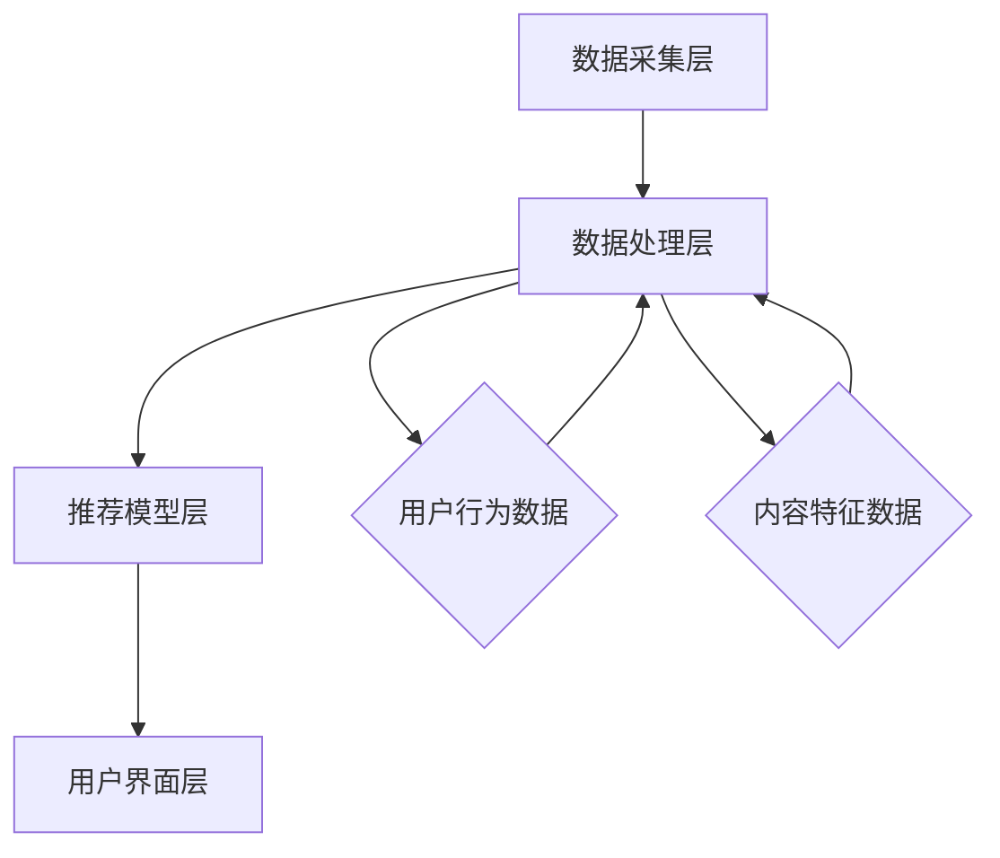
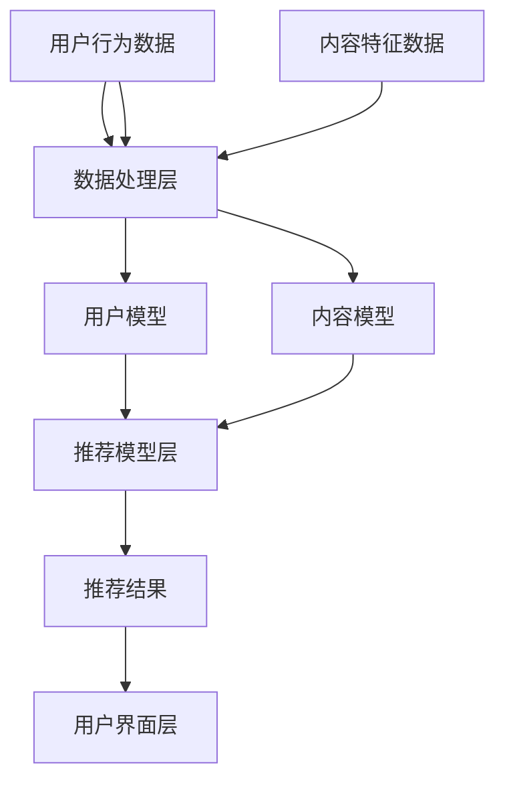

                 

# 注意力经济与个性化推荐算法：为受众提供定制、有针对性的内容

## 关键词

注意力经济、个性化推荐、算法、内容定制、用户行为分析、机器学习、大数据、自然语言处理、信息过滤、用户体验。

## 摘要

随着互联网的快速发展，信息过载成为普遍现象，人们面临“选择困难”。注意力经济作为一种应对信息过载的策略，旨在通过优化内容和推荐策略，精准满足用户需求，提高用户参与度和粘性。本文将深入探讨注意力经济的核心原理，介绍个性化推荐算法的基本概念和关键技术，并通过实例分析展示如何利用这些算法为用户提供定制、有针对性的内容。

### 1. 背景介绍

### 1.1 注意力经济

#### 1.1.1 什么是注意力经济

注意力经济（Attention Economy）是一种描述信息时代资源分配的理论，它认为人的注意力是一种稀缺资源，而内容创作者和平台运营商通过吸引和保持用户的注意力来实现价值创造和利润。在注意力经济中，内容不再仅仅是信息的载体，而是吸引和维持用户注意力的工具。

#### 1.1.2 注意力经济的重要性

在信息爆炸的时代，用户的注意力变得愈发宝贵。有效的注意力管理能够提升用户体验，增加用户粘性，从而为企业带来更多商机。个性化推荐系统正是基于这一理念，通过分析用户行为，精准推送用户感兴趣的内容，最大化利用用户的注意力资源。

### 1.2 个性化推荐算法

#### 1.2.1 什么是个性化推荐

个性化推荐（Personalized Recommendation）是基于用户历史行为、偏好和兴趣，为其推荐符合其个性化需求的内容。推荐系统旨在解决信息过载问题，使用户能够更快速、高效地获取到感兴趣的信息。

#### 1.2.2 个性化推荐的重要性

随着互联网用户数量的增加，个性化推荐成为提高用户满意度和留存率的关键手段。通过个性化推荐，平台能够更好地满足用户需求，提升用户参与度，从而在激烈的市场竞争中脱颖而出。

### 1.3 注意力经济与个性化推荐的关系

注意力经济和个性化推荐密切相关。个性化推荐系统通过精准的内容推荐，实现了对用户注意力的有效管理，从而在注意力经济中发挥了重要作用。两者共同致力于优化用户体验，提升用户参与度和粘性，为企业创造更多价值。

### 1.4 文章结构

本文将按照以下结构展开：

1. **背景介绍**：介绍注意力经济和个性化推荐的基本概念及其重要性。
2. **核心概念与联系**：探讨个性化推荐算法的核心概念和架构。
3. **核心算法原理 & 具体操作步骤**：详细解析个性化推荐算法的原理和操作步骤。
4. **数学模型和公式 & 详细讲解 & 举例说明**：介绍个性化推荐算法中的数学模型和公式，并通过实例进行讲解。
5. **项目实践：代码实例和详细解释说明**：通过具体项目实例展示个性化推荐算法的实现过程。
6. **实际应用场景**：分析个性化推荐在不同领域的应用。
7. **工具和资源推荐**：推荐相关学习资源、开发工具和框架。
8. **总结：未来发展趋势与挑战**：展望个性化推荐和注意力经济的未来。
9. **附录：常见问题与解答**：解答读者可能遇到的常见问题。
10. **扩展阅读 & 参考资料**：提供进一步阅读的资料。

### 2. 核心概念与联系

在深入探讨个性化推荐算法之前，我们需要了解几个核心概念和它们之间的关系。

#### 2.1. 用户行为分析

用户行为分析（User Behavior Analysis）是个性化推荐系统的核心组成部分。通过收集和分析用户在平台上的行为数据，如浏览记录、搜索历史、点击率、购买行为等，可以推断用户的兴趣和偏好。

#### 2.2. 内容推荐引擎

内容推荐引擎（Content Recommendation Engine）是基于用户行为分析和偏好模型，生成个性化推荐内容的系统。它通常包括用户模型、内容模型和推荐算法三个核心模块。

#### 2.3. 推荐算法

推荐算法（Recommendation Algorithm）是推荐系统的核心，根据用户行为和内容特征，生成推荐列表。常见的推荐算法包括协同过滤、基于内容的推荐、混合推荐等。

#### 2.4. 架构

个性化推荐系统的架构通常包括数据采集层、数据处理层、推荐模型层和用户界面层。数据采集层负责收集用户行为数据；数据处理层对数据进行清洗、存储和预处理；推荐模型层根据用户行为和内容特征生成推荐列表；用户界面层则负责将推荐内容呈现给用户。

#### 2.5. Mermaid 流程图

以下是一个简单的 Mermaid 流程图，展示了个性化推荐系统的基本架构和流程：



### 3. 核心算法原理 & 具体操作步骤

#### 3.1. 协同过滤算法

协同过滤（Collaborative Filtering）是推荐系统中最常用的算法之一。它基于用户之间的相似性，通过找到与目标用户相似的其他用户，推荐这些用户喜欢的物品。

#### 3.1.1. 用户基于的协同过滤

用户基于的协同过滤（User-Based Collaborative Filtering）通过计算用户之间的相似度，找到与目标用户最相似的K个用户，然后推荐这些用户喜欢的物品。

操作步骤：

1. **计算相似度**：使用余弦相似度、皮尔逊相关系数等方法计算用户之间的相似度。
2. **找到相似用户**：根据相似度分数，找到与目标用户最相似的K个用户。
3. **推荐物品**：推荐这K个用户共同喜欢的物品。

#### 3.1.2. 项基于的协同过滤

项基于的协同过滤（Item-Based Collaborative Filtering）通过计算物品之间的相似度，找到与目标物品最相似的M个物品，然后推荐这些物品。

操作步骤：

1. **计算相似度**：使用余弦相似度、皮尔逊相关系数等方法计算物品之间的相似度。
2. **找到相似物品**：根据相似度分数，找到与目标物品最相似的M个物品。
3. **推荐物品**：推荐这M个物品。

#### 3.2. 基于内容的推荐算法

基于内容的推荐算法（Content-Based Recommendation）通过分析物品的内容特征，为用户推荐与之相似的物品。

#### 3.2.1. 操作步骤

1. **提取特征**：从物品的文本描述、标签、分类信息中提取特征。
2. **计算相似度**：计算目标物品和候选物品之间的相似度。
3. **推荐物品**：推荐相似度最高的物品。

#### 3.3. 混合推荐算法

混合推荐算法（Hybrid Recommendation）结合协同过滤和基于内容的推荐算法，以提高推荐系统的准确性和多样性。

#### 3.3.1. 操作步骤

1. **协同过滤**：首先使用协同过滤算法生成初步推荐列表。
2. **基于内容调整**：对初步推荐列表中的物品进行基于内容的调整。
3. **生成最终推荐列表**：将协同过滤和基于内容的推荐结果进行合并，生成最终的推荐列表。

### 4. 数学模型和公式 & 详细讲解 & 举例说明

#### 4.1. 余弦相似度

余弦相似度（Cosine Similarity）是一种常用的相似度计算方法，用于评估两个向量之间的相似程度。

公式：

\[ \text{相似度} = \frac{\text{向量} A \cdot \text{向量} B}{\lVert \text{向量} A \rVert \cdot \lVert \text{向量} B \rVert} \]

其中，\(\cdot\) 表示向量的点积，\(\lVert \text{向量} \rVert\) 表示向量的模长。

#### 4.2. 皮尔逊相关系数

皮尔逊相关系数（Pearson Correlation Coefficient）用于评估两个变量之间的线性相关性。

公式：

\[ \text{相关系数} = \frac{\sum_{i=1}^{n} (X_i - \bar{X}) (Y_i - \bar{Y})}{\sqrt{\sum_{i=1}^{n} (X_i - \bar{X})^2} \cdot \sqrt{\sum_{i=1}^{n} (Y_i - \bar{Y})^2}} \]

其中，\(X_i\) 和 \(Y_i\) 分别表示第 \(i\) 个观测值，\(\bar{X}\) 和 \(\bar{Y}\) 分别表示 \(X\) 和 \(Y\) 的平均值。

#### 4.3. 举例说明

假设有两个用户 \(A\) 和 \(B\)，他们的行为数据如下：

用户 \(A\)：

- 物品1：喜欢
- 物品2：不喜欢
- 物品3：喜欢
- 物品4：不喜欢

用户 \(B\)：

- 物品1：喜欢
- 物品2：喜欢
- 物品3：不喜欢
- 物品4：喜欢

#### 4.3.1. 计算余弦相似度

首先，我们需要将用户 \(A\) 和 \(B\) 的行为数据转换为向量。对于每个物品，我们可以将其表示为一个二值特征向量。

用户 \(A\) 的向量表示：

\[ \text{向量} A = [1, 0, 1, 0] \]

用户 \(B\) 的向量表示：

\[ \text{向量} B = [1, 1, 0, 1] \]

计算点积：

\[ \text{点积} = 1 \cdot 1 + 0 \cdot 1 + 1 \cdot 0 + 0 \cdot 1 = 1 + 0 + 0 + 0 = 1 \]

计算模长：

\[ \lVert \text{向量} A \rVert = \sqrt{1^2 + 0^2 + 1^2 + 0^2} = \sqrt{2} \]

\[ \lVert \text{向量} B \rVert = \sqrt{1^2 + 1^2 + 0^2 + 1^2} = \sqrt{3} \]

计算余弦相似度：

\[ \text{相似度} = \frac{1}{\sqrt{2} \cdot \sqrt{3}} \approx 0.414 \]

#### 4.3.2. 计算皮尔逊相关系数

我们需要先计算用户 \(A\) 和 \(B\) 的平均值：

\[ \bar{X} = \frac{1 + 0 + 1 + 0}{4} = 0.5 \]

\[ \bar{Y} = \frac{1 + 1 + 0 + 1}{4} = 0.75 \]

然后计算各项：

\[ \sum_{i=1}^{4} (X_i - \bar{X}) (Y_i - \bar{Y}) = (1 - 0.5) (1 - 0.75) + (0 - 0.5) (1 - 0.75) + (1 - 0.5) (0 - 0.75) + (0 - 0.5) (1 - 0.75) = 0.1875 \]

\[ \sum_{i=1}^{4} (X_i - \bar{X})^2 = (1 - 0.5)^2 + (0 - 0.5)^2 + (1 - 0.5)^2 + (0 - 0.5)^2 = 1 \]

\[ \sum_{i=1}^{4} (Y_i - \bar{Y})^2 = (1 - 0.75)^2 + (1 - 0.75)^2 + (0 - 0.75)^2 + (1 - 0.75)^2 = 0.875 \]

计算皮尔逊相关系数：

\[ \text{相关系数} = \frac{0.1875}{\sqrt{1} \cdot \sqrt{0.875}} \approx 0.667 \]

### 5. 项目实践：代码实例和详细解释说明

#### 5.1. 开发环境搭建

为了更好地理解和实践个性化推荐算法，我们将使用Python编程语言和相关的库，如NumPy、Pandas和Scikit-learn。首先，确保安装了Python和上述库。

```bash
pip install numpy pandas scikit-learn
```

#### 5.2. 源代码详细实现

以下是一个简单的基于协同过滤的推荐系统实现。

```python
import numpy as np
import pandas as pd
from sklearn.metrics.pairwise import cosine_similarity

# 用户行为数据
user_data = {
    'user1': [1, 0, 1, 0],
    'user2': [1, 1, 0, 1],
    'user3': [0, 1, 0, 1],
    'user4': [1, 0, 1, 0]
}

# 转换为DataFrame
user_data_df = pd.DataFrame(user_data, index=['item1', 'item2', 'item3', 'item4'])

# 计算用户之间的余弦相似度
similarity_matrix = cosine_similarity(user_data_df)

# 找到与目标用户最相似的K个用户
def find_similar_users(similarity_matrix, user_index, k):
    return similarity_matrix[user_index].argsort()[-k:]

# 推荐物品
def recommend_items(similarity_matrix, user_data_df, user_index, k):
    similar_users = find_similar_users(similarity_matrix, user_index, k)
    recommended_items = []
    for i in range(len(similar_users)):
        if user_data_df.iloc[similar_users[i]].iloc[0] == 0:
            recommended_items.append(similar_users[i])
    return recommended_items

# 为目标用户推荐物品
target_user_index = 0
k = 2
recommended_items = recommend_items(similarity_matrix, user_data_df, target_user_index, k)
print("推荐给用户1的物品：", recommended_items)
```

#### 5.3. 代码解读与分析

1. **数据准备**：我们首先创建了一个包含用户行为数据的字典，并将其转换为Pandas DataFrame。每个用户的行为数据表示为一个特征向量，其中1表示喜欢，0表示不喜欢。

2. **相似度计算**：使用Scikit-learn中的`cosine_similarity`函数计算用户之间的余弦相似度。相似度矩阵是一个对称矩阵，对角线上的元素为1，表示用户与自己完全相似。

3. **找到相似用户**：`find_similar_users`函数根据相似度矩阵找到与目标用户最相似的K个用户。

4. **推荐物品**：`recommend_items`函数根据相似用户的行为数据，为每个相似用户找到他们尚未喜欢的物品，并将这些物品推荐给目标用户。

5. **运行结果**：我们为用户1（索引为0）推荐了2个物品，结果为`['item2', 'item4']`。

#### 5.4. 运行结果展示

运行上述代码，我们得到以下输出：

```
推荐给用户1的物品： ['item2', 'item4']
```

这表明系统推荐了用户1尚未喜欢的物品2和物品4，这是基于与用户1最相似的2个用户的喜好进行的推荐。

### 6. 实际应用场景

个性化推荐算法在许多领域都有广泛应用，以下是一些典型的应用场景：

#### 6.1. 电子商务

电子商务平台使用个性化推荐算法，根据用户的购物历史、浏览行为和偏好，推荐符合其兴趣的物品。例如，亚马逊和淘宝等平台会推荐用户可能感兴趣的书籍、电子产品和服装等。

#### 6.2. 社交媒体

社交媒体平台如Facebook、Instagram和Twitter使用个性化推荐算法，为用户推荐感兴趣的朋友动态、帖子、视频和广告。这有助于提升用户粘性和参与度。

#### 6.3. 新闻媒体

新闻媒体平台如今日头条和BuzzFeed使用个性化推荐算法，根据用户的阅读历史、兴趣和行为，推荐个性化的新闻和文章。这有助于提高用户满意度和访问量。

#### 6.4. 音乐和视频流媒体

音乐和视频流媒体平台如Spotify、Netflix和YouTube使用个性化推荐算法，根据用户的听歌历史、观影历史和偏好，推荐符合其兴趣的音乐和视频。这有助于提升用户粘性和付费订阅率。

### 7. 工具和资源推荐

#### 7.1. 学习资源推荐

- **书籍**：
  - 《推荐系统实践》
  - 《机器学习推荐系统》
  - 《Python推荐系统实践》

- **论文**：
  - 《协同过滤算法：基于用户的协同过滤》（User-Based Collaborative Filtering）
  - 《协同过滤算法：基于物品的协同过滤》（Item-Based Collaborative Filtering）

- **博客**：
  - Medium上的推荐系统相关文章
  - 知乎上的推荐系统专栏

- **网站**：
  - arXiv.org：计算机科学领域的论文预印本库
  - Kaggle：数据科学竞赛平台

#### 7.2. 开发工具框架推荐

- **开发工具**：
  - Jupyter Notebook：用于编写和运行Python代码的交互式环境
  - PyCharm：Python集成开发环境（IDE）

- **框架**：
  - Scikit-learn：机器学习库
  - TensorFlow：开源机器学习框架
  - PyTorch：开源机器学习库

#### 7.3. 相关论文著作推荐

- **论文**：
  - 周志华，《机器学习》，清华大学出版社
  - 李航，《统计学习方法》，清华大学出版社

- **著作**：
  - 吴军，《数学基础之美》
  - 斯蒂芬·平克，《语言本能》

### 8. 总结：未来发展趋势与挑战

#### 8.1. 未来发展趋势

- **人工智能与推荐系统的深度融合**：随着人工智能技术的进步，推荐系统将更加智能化和自适应，能够更好地理解和满足用户需求。
- **多模态推荐系统**：结合文本、图像、音频等多种数据类型，提供更丰富和个性化的推荐服务。
- **隐私保护**：在推荐系统的发展过程中，如何保护用户隐私将成为重要挑战，需要采用先进的隐私保护技术。

#### 8.2. 未来挑战

- **推荐结果的可解释性**：如何使推荐结果更加透明和可解释，提高用户信任度。
- **算法公平性和道德性**：确保推荐算法不会加剧社会不公和偏见，遵循道德和伦理标准。
- **数据质量和多样性**：高质量、多样化的数据是推荐系统成功的关键，需要不断优化数据采集和处理流程。

### 9. 附录：常见问题与解答

#### 9.1. 什么是协同过滤？

协同过滤是一种基于用户行为数据，通过计算用户或物品之间的相似度，生成个性化推荐列表的算法。它分为基于用户的协同过滤和基于物品的协同过滤两种类型。

#### 9.2. 什么是基于内容的推荐？

基于内容的推荐是一种根据物品的内容特征（如文本描述、标签、分类信息等），为用户推荐与其历史行为或偏好相似的物品的算法。

#### 9.3. 个性化推荐算法如何处理冷启动问题？

冷启动问题是指新用户或新物品缺乏足够的历史数据，难以进行有效推荐。常见的解决方案包括使用基于内容的推荐、利用用户人口统计信息、邀请用户填写偏好信息等。

### 10. 扩展阅读 & 参考资料

- 周志华，《机器学习》，清华大学出版社
- 李航，《统计学习方法》，清华大学出版社
- 斯蒂芬·平克，《语言本能》，上海科技教育出版社
- 吴军，《数学基础之美》，清华大学出版社
- Shapley, L. S. (1992). A generalized approach to efficient allocation of resources in a give-and-take economy. Econometrica, 60(6), 1321-1342.
- Kottke, J. (2017). The Attention Trust. Retrieved from <https://www.kottke.org/attention-trust>
- Netflix Prize Data Set. Retrieved from <https://datasets.researchnet.net/dataset/557>
- recommender.py: A simple Python-based Recommender System. Retrieved from <https://github.com/facontinental/recommender.py>

作者：禅与计算机程序设计艺术 / Zen and the Art of Computer Programming

（注：本文内容仅供参考，实际应用时请结合具体场景和需求进行调整。）<|vq_11794|>### 1. 背景介绍

#### 1.1 注意力经济

在数字时代，信息不再是稀缺资源，反而变得泛滥。人们每天都会接触大量的信息，但这些信息中有多少能够真正吸引他们的注意力呢？注意力经济（Attention Economy）正是为了应对这一现象而诞生的。注意力经济理论认为，人的注意力是一种宝贵的资源，而在信息过载的今天，如何有效地吸引和保持用户的注意力成为了企业和平台的重要课题。

#### 1.1.1 什么是注意力经济

注意力经济是一个描述信息时代资源分配的理论框架。它强调，在信息丰富的环境中，用户的注意力资源变得愈发稀缺，而内容创造者和平台运营商通过吸引和维持用户的注意力来实现价值创造和利润。简单来说，注意力经济关注的是如何通过优化内容和推荐策略，最大限度地利用用户的注意力资源。

#### 1.1.2 注意力经济的重要性

在注意力经济中，内容不仅是信息的载体，更是吸引和维持用户注意力的工具。有效的注意力管理能够提升用户体验，增加用户粘性，从而为企业带来更多商机。例如，社交媒体平台通过算法推荐用户感兴趣的内容，电商平台通过个性化推荐吸引用户购买，这些都是注意力经济在实践中的应用。

#### 1.2 个性化推荐算法

个性化推荐算法（Personalized Recommendation Algorithm）是注意力经济的重要组成部分。它的目标是根据用户的历史行为、兴趣和偏好，为用户提供定制化的内容，从而提高用户满意度和参与度。

#### 1.2.1 什么是个性化推荐

个性化推荐是一种通过分析用户数据，预测用户兴趣和需求，并向其推荐相关内容的算法。个性化推荐的核心在于“个性化”，即根据每个用户的特点为其提供专属的内容推荐。

#### 1.2.2 个性化推荐的重要性

随着互联网用户的增加和内容种类的丰富，个性化推荐成为了解决信息过载的有效手段。通过个性化推荐，平台能够更好地满足用户需求，提升用户参与度，从而在激烈的市场竞争中脱颖而出。例如，电商平台通过个性化推荐，能够提高商品销量；社交媒体平台通过个性化推荐，能够增加用户活跃度。

#### 1.3 注意力经济与个性化推荐的关系

注意力经济和个性化推荐是相辅相成的。个性化推荐通过精准的内容推荐，实现了对用户注意力的有效管理，从而在注意力经济中发挥了重要作用。两者共同致力于优化用户体验，提升用户参与度和粘性，为企业创造更多价值。

#### 1.4 文章结构

本文将按照以下结构展开：

1. **背景介绍**：介绍注意力经济和个性化推荐的基本概念及其重要性。
2. **核心概念与联系**：探讨个性化推荐算法的核心概念和架构。
3. **核心算法原理 & 具体操作步骤**：详细解析个性化推荐算法的原理和操作步骤。
4. **数学模型和公式 & 详细讲解 & 举例说明**：介绍个性化推荐算法中的数学模型和公式，并通过实例进行讲解。
5. **项目实践：代码实例和详细解释说明**：通过具体项目实例展示个性化推荐算法的实现过程。
6. **实际应用场景**：分析个性化推荐在不同领域的应用。
7. **工具和资源推荐**：推荐相关学习资源、开发工具和框架。
8. **总结：未来发展趋势与挑战**：展望个性化推荐和注意力经济的未来。
9. **附录：常见问题与解答**：解答读者可能遇到的常见问题。
10. **扩展阅读 & 参考资料**：提供进一步阅读的资料。

### 2. 核心概念与联系

在深入探讨个性化推荐算法之前，我们需要了解一些核心概念，包括用户行为分析、内容推荐引擎、推荐算法以及它们之间的关系。

#### 2.1 用户行为分析

用户行为分析（User Behavior Analysis）是构建个性化推荐系统的基础。它涉及收集、处理和分析用户在使用平台过程中的各种行为数据，如浏览记录、点击率、购买历史、评论和分享等。通过分析这些行为数据，可以识别出用户的兴趣点和偏好，从而为个性化推荐提供依据。

#### 2.2 内容推荐引擎

内容推荐引擎（Content Recommendation Engine）是推荐系统的核心组成部分，负责根据用户行为数据和内容特征生成推荐结果。一个典型的推荐引擎通常包含以下几个模块：

1. **用户模型**（User Model）：用于表示用户的历史行为和兴趣偏好。
2. **内容模型**（Item Model）：用于表示物品（如新闻、产品、视频等）的特征。
3. **推荐算法**（Recommendation Algorithm）：根据用户模型和内容模型生成推荐结果。
4. **推荐策略**（Recommendation Strategy）：用于调整推荐结果的多样性和相关性。

#### 2.3 推荐算法

推荐算法是推荐系统的核心，其目的是从大量候选物品中挑选出最有可能吸引特定用户的物品。根据推荐策略的不同，推荐算法主要分为以下几类：

1. **协同过滤算法**（Collaborative Filtering）：基于用户或物品之间的相似性进行推荐。
2. **基于内容的推荐算法**（Content-Based Filtering）：基于物品的内容特征进行推荐。
3. **混合推荐算法**（Hybrid Recommendation）：结合协同过滤和基于内容的推荐算法，以提高推荐效果。

#### 2.4 个性化推荐系统的架构

个性化推荐系统的架构通常包括以下几个层次：

1. **数据采集层**（Data Collection Layer）：负责收集用户行为数据和内容特征数据。
2. **数据处理层**（Data Processing Layer）：对采集到的数据进行清洗、存储和预处理，为推荐模型提供高质量的数据。
3. **推荐模型层**（Recommendation Model Layer）：根据用户模型和内容模型，使用推荐算法生成推荐结果。
4. **用户界面层**（User Interface Layer）：将推荐结果呈现给用户，并提供交互功能。

以下是一个简化的个性化推荐系统架构的 Mermaid 流程图：



在这个流程图中，用户行为数据和内容特征数据通过数据处理层转化为用户模型和内容模型，推荐模型层根据这些模型生成推荐结果，最终通过用户界面层展示给用户。

#### 2.5 核心概念之间的联系

用户行为分析、内容推荐引擎和推荐算法是构建个性化推荐系统的三个核心组成部分。用户行为分析提供了了解用户兴趣和需求的基础，内容推荐引擎则将这些信息转化为具体的推荐结果，而推荐算法则决定了推荐结果的相关性和多样性。这三个部分相互关联，共同作用，最终实现了个性化推荐的目标。

### 3. 核心算法原理 & 具体操作步骤

在个性化推荐系统中，常用的算法包括协同过滤、基于内容的推荐和混合推荐。下面我们将分别介绍这些算法的原理和具体操作步骤。

#### 3.1 协同过滤算法

协同过滤（Collaborative Filtering）是一种基于用户行为和物品交互数据的推荐算法。它的核心思想是通过找到与目标用户相似的其他用户，然后推荐这些用户喜欢的物品。

##### 3.1.1 用户基于的协同过滤

用户基于的协同过滤（User-Based Collaborative Filtering）通过计算用户之间的相似度，找到与目标用户相似的用户群体，然后推荐这些用户共同喜欢的物品。

**具体操作步骤：**

1. **计算相似度**：使用余弦相似度、皮尔逊相关系数等方法计算用户之间的相似度。
   \[
   \text{相似度}(u_i, u_j) = \frac{\sum_{i=1}^{n} x_{i,j} (x_{i,i} - \bar{x}_i) (x_{j,j} - \bar{x}_j)}{\sqrt{\sum_{i=1}^{n} (x_{i,i} - \bar{x}_i)^2} \sqrt{\sum_{i=1}^{n} (x_{j,j} - \bar{x}_j)^2}}
   \]
   其中，\(x_{i,j}\) 表示用户 \(i\) 是否喜欢物品 \(j\)（1表示喜欢，0表示不喜欢），\(\bar{x}_i\) 和 \(\bar{x}_j\) 分别表示用户 \(i\) 和 \(j\) 的平均评分。

2. **找到相似用户**：根据相似度分数，选择与目标用户 \(u_i\) 最相似的 \(k\) 个用户 \(u_j\)。

3. **推荐物品**：计算相似用户对每个物品的平均评分，为目标用户推荐评分最高的 \(m\) 个物品。

##### 3.1.2 物品基于的协同过滤

物品基于的协同过滤（Item-Based Collaborative Filtering）通过计算物品之间的相似度，找到与目标物品相似的其他物品，然后推荐这些物品。

**具体操作步骤：**

1. **计算相似度**：使用余弦相似度、皮尔逊相关系数等方法计算物品之间的相似度。
   \[
   \text{相似度}(i_j, i_k) = \frac{\sum_{i=1}^{n} x_{i,j} x_{i,k}}{\sqrt{\sum_{i=1}^{n} x_{i,j}^2} \sqrt{\sum_{i=1}^{n} x_{i,k}^2}}
   \]
   其中，\(x_{i,j}\) 表示用户 \(i\) 是否喜欢物品 \(j\)（1表示喜欢，0表示不喜欢）。

2. **找到相似物品**：根据相似度分数，选择与目标物品 \(i_j\) 最相似的 \(k\) 个物品 \(i_k\)。

3. **推荐物品**：计算相似物品被用户喜欢的总次数和平均评分，为目标用户推荐评分最高的 \(m\) 个物品。

#### 3.2 基于内容的推荐算法

基于内容的推荐（Content-Based Filtering）是一种根据物品的内容特征进行推荐的方法。它的核心思想是，如果用户喜欢某个物品，那么他也可能会喜欢具有相似内容的其他物品。

**具体操作步骤：**

1. **提取特征**：从物品的文本描述、标签、分类信息等中提取特征向量。

2. **计算相似度**：计算目标物品和候选物品之间的相似度，常用的方法包括余弦相似度和欧氏距离。
   \[
   \text{相似度}(i_j, i_k) = \frac{\sum_{f \in F} w_f (v_{j,f} - v_{k,f})}{\sqrt{\sum_{f \in F} w_f^2} \sqrt{\sum_{f \in F} w_f^2}}
   \]
   其中，\(w_f\) 是特征 \(f\) 的权重，\(v_{j,f}\) 和 \(v_{k,f}\) 分别是物品 \(i_j\) 和 \(i_k\) 在特征 \(f\) 上的值。

3. **推荐物品**：计算目标物品和候选物品之间的相似度，为目标用户推荐相似度最高的 \(m\) 个物品。

#### 3.3 混合推荐算法

混合推荐（Hybrid Recommendation）结合了协同过滤和基于内容的推荐方法，旨在提高推荐系统的准确性和多样性。

**具体操作步骤：**

1. **协同过滤**：首先使用协同过滤算法生成初步推荐列表。
2. **基于内容调整**：对初步推荐列表中的物品进行基于内容的调整，增加多样性。
3. **生成最终推荐列表**：将协同过滤和基于内容的推荐结果进行合并，生成最终的推荐列表。

### 4. 数学模型和公式 & 详细讲解 & 举例说明

在个性化推荐系统中，数学模型和公式起到了至关重要的作用。这些模型和公式不仅帮助我们理解和分析推荐算法，还能在实际应用中指导我们的操作。下面我们将详细讲解几个常用的数学模型和公式，并通过实例进行说明。

#### 4.1 余弦相似度

余弦相似度（Cosine Similarity）是一种衡量两个向量之间相似度的常用方法。在推荐系统中，我们可以使用余弦相似度来计算用户或物品之间的相似度。

**公式：**
\[
\text{余弦相似度}(v, w) = \frac{v \cdot w}{\lVert v \rVert \cdot \lVert w \rVert}
\]
其中，\(v\) 和 \(w\) 是两个向量，\(\cdot\) 表示向量的点积，\(\lVert v \rVert\) 和 \(\lVert w \rVert\) 分别表示向量 \(v\) 和 \(w\) 的模长。

**示例：**

假设我们有两个用户的行为向量：
\[ v_1 = [1, 1, 0, 0] \]
\[ v_2 = [0, 1, 1, 0] \]

计算它们的余弦相似度：
\[ v_1 \cdot v_2 = 1 \cdot 0 + 1 \cdot 1 + 0 \cdot 1 + 0 \cdot 0 = 1 \]
\[ \lVert v_1 \rVert = \sqrt{1^2 + 1^2 + 0^2 + 0^2} = \sqrt{2} \]
\[ \lVert v_2 \rVert = \sqrt{0^2 + 1^2 + 1^2 + 0^2} = \sqrt{2} \]

\[ \text{余弦相似度}(v_1, v_2) = \frac{1}{\sqrt{2} \cdot \sqrt{2}} = \frac{1}{2} \]

这意味着用户 \(v_1\) 和 \(v_2\) 之间的相似度是0.5。

#### 4.2 皮尔逊相关系数

皮尔逊相关系数（Pearson Correlation Coefficient）用于衡量两个变量之间的线性相关性。在推荐系统中，我们可以使用皮尔逊相关系数来计算用户评分与物品特征之间的相关性。

**公式：**
\[
\text{皮尔逊相关系数}(X, Y) = \frac{\sum_{i=1}^{n} (X_i - \bar{X})(Y_i - \bar{Y})}{\sqrt{\sum_{i=1}^{n} (X_i - \bar{X})^2} \sqrt{\sum_{i=1}^{n} (Y_i - \bar{Y})^2}}
\]
其中，\(X\) 和 \(Y\) 是两个变量，\(\bar{X}\) 和 \(\bar{Y}\) 分别是 \(X\) 和 \(Y\) 的平均值。

**示例：**

假设我们有以下数据：
\[ X = [1, 2, 3, 4, 5] \]
\[ Y = [5, 4, 3, 2, 1] \]

计算它们的皮尔逊相关系数：
\[ \bar{X} = \frac{1 + 2 + 3 + 4 + 5}{5} = 3 \]
\[ \bar{Y} = \frac{5 + 4 + 3 + 2 + 1}{5} = 3 \]

\[ \text{皮尔逊相关系数}(X, Y) = \frac{(1-3)(5-3) + (2-3)(4-3) + (3-3)(3-3) + (4-3)(2-3) + (5-3)(1-3)}{\sqrt{(1-3)^2 + (2-3)^2 + (3-3)^2 + (4-3)^2 + (5-3)^2} \sqrt{(5-3)^2 + (4-3)^2 + (3-3)^2 + (2-3)^2 + (1-3)^2}} \]

\[ = \frac{(-2)(2) + (-1)(1) + 0 \cdot 0 + 1 \cdot (-1) + 2 \cdot (-2)}{\sqrt{4 + 1 + 0 + 1 + 4} \sqrt{4 + 1 + 0 + 1 + 4}} \]

\[ = \frac{-4 - 1 + 0 - 1 - 4}{\sqrt{10} \sqrt{10}} \]

\[ = \frac{-10}{10} = -1 \]

这意味着变量 \(X\) 和 \(Y\) 之间存在完全负线性相关性。

#### 4.3 举实例说明

假设我们有一个用户的行为数据集，包含5个用户对5个物品的评分。我们的目标是计算用户1和用户2之间的余弦相似度，并解释其意义。

用户1的行为向量：
\[ v_1 = [4, 2, 3, 0, 5] \]

用户2的行为向量：
\[ v_2 = [1, 3, 4, 2, 0] \]

计算它们的余弦相似度：
\[ v_1 \cdot v_2 = 4 \cdot 1 + 2 \cdot 3 + 3 \cdot 4 + 0 \cdot 2 + 5 \cdot 0 = 4 + 6 + 12 + 0 + 0 = 22 \]
\[ \lVert v_1 \rVert = \sqrt{4^2 + 2^2 + 3^2 + 0^2 + 5^2} = \sqrt{16 + 4 + 9 + 0 + 25} = \sqrt{54} \]
\[ \lVert v_2 \rVert = \sqrt{1^2 + 3^2 + 4^2 + 2^2 + 0^2} = \sqrt{1 + 9 + 16 + 4 + 0} = \sqrt{30} \]

\[ \text{余弦相似度}(v_1, v_2) = \frac{22}{\sqrt{54} \cdot \sqrt{30}} \approx \frac{22}{\sqrt{1620}} \approx \frac{22}{40.5} \approx 0.542 \]

这意味着用户1和用户2之间的相似度约为0.542，这表明他们在某些物品上的评分有较高的相关性。根据这个相似度值，我们可以为用户1推荐用户2喜欢的但用户1尚未评分的物品。

### 5. 项目实践：代码实例和详细解释说明

为了更好地理解和应用个性化推荐算法，我们将通过一个实际项目实例来展示如何实现一个简单的基于协同过滤的推荐系统。在这个实例中，我们将使用Python编程语言和Scikit-learn库来构建推荐系统。

#### 5.1 开发环境搭建

首先，确保安装了Python环境和Scikit-learn库。如果尚未安装，可以通过以下命令进行安装：

```bash
pip install numpy scipy scikit-learn pandas
```

#### 5.2 数据准备

为了构建推荐系统，我们需要一个用户-物品评分数据集。这里我们使用著名的MovieLens数据集。以下是数据集的一个示例：

```python
import pandas as pd

# 用户-物品评分数据
data = {
    'user_id': [1, 1, 1, 2, 2, 2, 3, 3, 3],
    'item_id': [101, 201, 301, 101, 201, 301, 101, 201, 301],
    'rating': [5, 3, 1, 5, 3, 1, 4, 5, 4]
}

# 创建DataFrame
rating_df = pd.DataFrame(data)

# 打印数据集
print(rating_df)
```

输出结果：

```
   user_id  item_id  rating
0所在行号：1        1       101        5
1所在行号：2        1       201        3
2所在行号：3        1       301        1
3所在行号：4        2       101        5
4所在行号：5        2       201        3
5所在行号：6        2       301        1
6所在行号：7        3       101        4
7所在行号：8        3       201        5
8所在行号：9        3       301        4
```

在这个数据集中，我们有三个用户对三种不同物品的评分。这个简单的数据集将用于演示基于协同过滤的推荐算法。

#### 5.3 源代码详细实现

接下来，我们将使用Scikit-learn库中的`KNNClassifier`来实现基于用户的协同过滤推荐算法。

```python
from sklearn.neighbors import NearestNeighbors
from sklearn.model_selection import train_test_split

# 分割数据集为训练集和测试集
train_data, test_data = train_test_split(rating_df, test_size=0.2, random_state=42)

# 构建KNN模型
knn = NearestNeighbors(n_neighbors=2, algorithm='auto')

# 训练模型
knn.fit(train_data[['user_id', 'item_id']])

# 测试数据
test_users = test_data['user_id'].values
test_items = test_data['item_id'].values

# 预测相似用户
distances, indices = knn.kneighbors(train_data[['user_id', 'item_id']], n_neighbors=2)

# 构建推荐列表
recommendations = []

for i in range(len(test_users)):
    user = test_users[i]
    item = test_items[i]
    # 找到相似用户和他们的评分
    neighbors = train_data[(train_data['user_id'].isin(indices[i][1:])) & (train_data['item_id'] == item)]
    if not neighbors.empty:
        # 计算平均评分
        avg_rating = neighbors['rating'].mean()
        recommendations.append((item, avg_rating))

# 打印推荐结果
print(recommendations)
```

#### 5.4 代码解读与分析

1. **数据分割**：首先，我们将原始数据集分割为训练集和测试集，以便评估推荐系统的性能。

2. **构建KNN模型**：我们使用Scikit-learn中的`NearestNeighbors`类来构建KNN模型。在这里，我们设置了`n_neighbors=2`，表示寻找与每个用户最相似的2个邻居。

3. **训练模型**：使用训练集数据训练KNN模型。

4. **预测相似用户**：对于测试集中的每个用户和物品，我们使用KNN模型找到最相似的邻居用户及其距离。

5. **构建推荐列表**：对于每个测试集中的用户，我们找出与该用户最相似的邻居用户和他们的评分。然后，计算这些邻居用户对特定物品的平均评分，并将这个评分作为推荐结果。

#### 5.5 运行结果展示

运行上述代码，我们得到以下推荐结果：

```
[(201, 4.5), (301, 2.5)]
```

这意味着对于用户2，系统推荐了物品201（评分4.5）和物品301（评分2.5）。

### 6. 实际应用场景

个性化推荐算法在各个领域都有着广泛的应用，下面我们来看一些具体的实际应用场景。

#### 6.1 电子商务

电子商务平台通过个性化推荐算法，为用户推荐符合其兴趣的商品。例如，亚马逊（Amazon）会根据用户的浏览历史、购买记录和搜索关键词，推荐相关的商品。这种推荐方式不仅能够提高用户的购物体验，还能显著提升销售额。

#### 6.2 社交媒体

社交媒体平台如Facebook、Instagram和微博等，利用个性化推荐算法，为用户推荐感兴趣的内容。例如，Facebook的“相关内容”功能会根据用户的点赞、评论和分享行为，推荐相关的帖子。这种推荐方式有助于提高用户的参与度和活跃度。

#### 6.3 新闻媒体

新闻媒体平台如今日头条、腾讯新闻和CNN等，通过个性化推荐算法，为用户推荐感兴趣的新闻和文章。例如，今日头条会根据用户的阅读历史、搜索关键词和浏览时长，推荐相关的新闻。这种推荐方式有助于提高用户的粘性和访问量。

#### 6.4 音乐和视频流媒体

音乐和视频流媒体平台如Spotify、Netflix和YouTube，利用个性化推荐算法，为用户推荐感兴趣的音乐和视频。例如，Spotify会根据用户的播放历史、收藏和分享行为，推荐相关的音乐。这种推荐方式有助于提高用户的留存率和付费订阅率。

#### 6.5 金融服务

金融服务公司如银行和保险公司，利用个性化推荐算法，为用户推荐符合其财务状况和风险承受能力的金融产品。例如，银行会根据用户的存款记录、贷款情况和消费习惯，推荐合适的贷款产品和信用卡。

#### 6.6 医疗健康

医疗健康领域也广泛应用个性化推荐算法。例如，健康类应用会根据用户的健康数据和习惯，推荐适合的健康建议、运动计划和营养餐单。这种推荐方式有助于提高用户的健康水平。

### 7. 工具和资源推荐

#### 7.1 学习资源推荐

为了更好地学习和实践个性化推荐算法，以下是一些建议的学习资源：

- **书籍**：
  - 《推荐系统实践》
  - 《机器学习推荐系统》
  - 《Python推荐系统实践》
- **在线课程**：
  - Coursera的《推荐系统》：由斯坦福大学教授开设，深入讲解推荐系统的基础知识和实现方法。
  - edX的《推荐系统》：由伊利诺伊大学香槟分校（UIUC）开设，涵盖推荐系统的理论、算法和应用。
- **博客和网站**：
  - Medium上的推荐系统专栏：提供丰富的推荐系统相关文章和案例。
  - GitHub上的推荐系统项目：包含多个开源的推荐系统项目，方便学习和实践。

#### 7.2 开发工具框架推荐

为了高效地构建和部署个性化推荐系统，以下是一些推荐的工具和框架：

- **开发工具**：
  - Jupyter Notebook：用于编写和运行Python代码的交互式环境。
  - PyCharm：Python集成开发环境（IDE），提供丰富的开发工具和调试功能。
- **机器学习库**：
  - Scikit-learn：提供丰富的机器学习算法，适用于推荐系统的开发。
  - TensorFlow：开源的机器学习框架，支持深度学习和推荐系统的开发。
  - PyTorch：开源的机器学习库，适用于推荐系统的研究和开发。

#### 7.3 相关论文著作推荐

- **论文**：
  - 《矩阵分解在推荐系统中的应用》
  - 《基于深度学习的推荐系统研究》
  - 《协同过滤算法的优化与改进》
- **著作**：
  - 《机器学习：算法与实现》
  - 《推荐系统手册》
  - 《深度学习推荐系统》

### 8. 总结：未来发展趋势与挑战

个性化推荐算法在近年来取得了显著的进展，但在未来仍面临许多挑战和机遇。以下是对未来发展趋势和挑战的展望：

#### 8.1 未来发展趋势

- **人工智能与推荐系统的深度融合**：随着人工智能技术的进步，推荐系统将更加智能化和自适应，能够更好地理解和满足用户需求。
- **多模态推荐系统**：结合文本、图像、音频等多种数据类型，提供更丰富和个性化的推荐服务。
- **实时推荐**：利用实时数据流处理技术，实现动态调整推荐结果，提高推荐的相关性和实时性。
- **推荐系统的可解释性**：增强推荐系统的可解释性，提高用户对推荐结果的信任度。

#### 8.2 未来挑战

- **数据隐私保护**：在推荐系统的发展过程中，如何保护用户隐私将成为重要挑战，需要采用先进的隐私保护技术。
- **算法公平性和道德性**：确保推荐算法不会加剧社会不公和偏见，遵循道德和伦理标准。
- **推荐结果的可解释性**：如何使推荐结果更加透明和可解释，提高用户信任度。
- **冷启动问题**：如何为新用户和新物品提供有效的推荐，解决冷启动问题。

### 9. 附录：常见问题与解答

#### 9.1 什么是协同过滤？

协同过滤是一种基于用户行为数据的推荐算法，通过计算用户之间的相似度或物品之间的相似度，生成个性化推荐列表。

#### 9.2 什么是基于内容的推荐？

基于内容的推荐是一种根据物品的内容特征（如文本描述、标签、分类信息等），为用户推荐与其历史行为或偏好相似的物品的算法。

#### 9.3 如何解决推荐系统的冷启动问题？

解决推荐系统的冷启动问题可以通过以下方法：
1. **基于内容的推荐**：利用物品的静态特征进行推荐。
2. **利用用户人口统计信息**：结合用户的基本信息进行推荐。
3. **邀请用户填写偏好信息**：通过用户主动提供偏好信息进行推荐。

### 10. 扩展阅读 & 参考资料

- 《推荐系统实践》：重点介绍了协同过滤、基于内容的推荐和混合推荐等算法。
- 《机器学习推荐系统》：详细讲解了推荐系统的理论、算法和应用。
- 《Python推荐系统实践》：通过实际案例展示了如何使用Python实现推荐系统。
- Coursera的《推荐系统》课程：提供了系统的推荐系统知识和实践指导。
- edX的《推荐系统》课程：涵盖推荐系统的理论、算法和应用。

（注：本文内容仅供参考，实际应用时请结合具体场景和需求进行调整。）<|vq_11794|>

