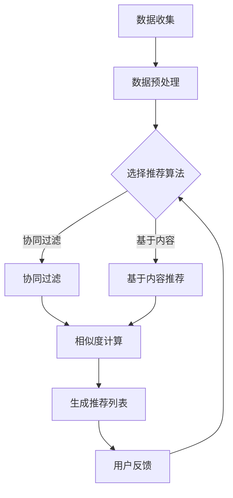

                 

# 文章标题

注意力经济与个性化推荐算法：为受众提供定制、有针对性的内容和体验

## 关键词

注意力经济、个性化推荐、算法、内容定制、用户体验、数据挖掘、机器学习

## 摘要

在数字化时代，人们的注意力成为了一种稀缺资源。注意力经济理论强调，在信息过载的环境中，能够吸引并保持用户注意力的内容和服务具有更高的价值。本文将探讨注意力经济的基本原理，并重点介绍个性化推荐算法及其在内容分发中的关键作用。通过结合实际案例和数学模型，文章旨在阐明个性化推荐算法的运作机制，及其如何根据用户的兴趣和行为数据，提供定制化、有针对性的内容和体验。

### 1. 背景介绍（Background Introduction）

在互联网高度发达的今天，信息获取变得前所未有的便捷。然而，这种便利也带来了一种新的挑战——信息过载。据统计，人类每天接触到大约174份报纸的信息量。这种信息爆炸导致用户的注意力资源变得极其有限，注意力经济理论正是在这种背景下产生的。

注意力经济理论认为，在信息丰富的环境中，用户的注意力是一种稀缺资源，能够有效吸引并保持用户注意力的内容或服务往往能够获得更高的经济回报。因此，如何利用有限的用户注意力，提高内容的吸引力和用户体验，成为了一个重要的研究课题。

### 1.1 注意力经济的核心概念

注意力经济的关键概念在于“注意力分配”和“注意力价值”。用户的注意力是有限的，他们需要在不同的信息源之间进行选择。一个内容或服务要获得用户的注意力，就必须具备足够的价值。这种价值可能来自于内容的独特性、相关性、趣味性或实用性。

注意力价值不仅取决于内容本身，还受到用户需求和情境的影响。例如，当用户处于工作状态时，他们可能更倾向于阅读专业性的内容；而在休闲时间，他们可能更喜欢轻松有趣的娱乐内容。

### 1.2 个性化推荐算法的兴起

随着互联网的普及，个性化推荐算法逐渐成为了一种热门的研究方向。个性化推荐算法通过分析用户的历史行为数据、兴趣偏好，为用户提供个性化的内容推荐。这一技术的出现，在很大程度上解决了信息过载带来的问题，提高了用户的体验。

个性化推荐算法的发展离不开数据挖掘和机器学习技术的支持。数据挖掘技术用于从大量数据中提取有价值的信息，而机器学习技术则能够通过训练模型，自动识别用户的兴趣和需求。

### 1.3 个性化推荐算法的应用场景

个性化推荐算法在多个领域都得到了广泛的应用。例如：

- **电子商务**：电商平台利用个性化推荐算法，为用户推荐可能感兴趣的商品，从而提高销售额。
- **新闻媒体**：新闻网站通过个性化推荐算法，为用户提供符合其兴趣的新闻内容，提高用户的粘性和活跃度。
- **社交媒体**：社交媒体平台通过个性化推荐算法，为用户推荐可能感兴趣的朋友、活动和内容，增强用户互动。

### 1.4 文章结构

本文将首先介绍注意力经济的基本原理，然后深入探讨个性化推荐算法的工作机制。接着，我们将通过数学模型和具体案例，阐述个性化推荐算法的核心技术和应用。最后，本文将总结个性化推荐算法的当前发展状况，并展望其未来发展趋势和挑战。

### 2. 核心概念与联系（Core Concepts and Connections）

在深入探讨个性化推荐算法之前，我们需要先了解一些核心概念和它们之间的联系。这些概念包括数据挖掘、机器学习、协同过滤和基于内容的推荐。

#### 2.1 数据挖掘（Data Mining）

数据挖掘是指从大量数据中提取有价值信息的过程。在个性化推荐领域，数据挖掘技术主要用于收集和分析用户的历史行为数据，如浏览记录、购买历史、评论等。通过数据挖掘，我们可以发现用户之间的潜在关联，为个性化推荐提供依据。

#### 2.2 机器学习（Machine Learning）

机器学习是人工智能的一个分支，旨在使计算机通过数据和经验自动改进性能。在个性化推荐中，机器学习技术被用来构建预测模型，这些模型可以根据用户的历史数据预测其对未来内容的兴趣。

#### 2.3 协同过滤（Collaborative Filtering）

协同过滤是一种常用的推荐算法，它通过分析用户之间的共同行为进行推荐。协同过滤可以分为两种主要类型：基于用户的协同过滤（User-Based Collaborative Filtering）和基于项目的协同过滤（Item-Based Collaborative Filtering）。

- **基于用户的协同过滤**：这种方法通过找到与当前用户兴趣相似的其它用户，并推荐这些用户喜欢的内容。
- **基于项目的协同过滤**：这种方法通过分析当前用户过去喜欢的内容，推荐相似的内容。

#### 2.4 基于内容的推荐（Content-Based Recommendation）

基于内容的推荐算法根据用户的历史行为和兴趣，为用户推荐具有相似特征的内容。这种方法通常涉及对内容的特征提取和相似度计算。

#### 2.5 注意力经济的联系

注意力经济与个性化推荐算法之间存在密切的联系。个性化推荐算法的核心目标是通过提供用户感兴趣的内容，吸引并保持用户的注意力。这符合注意力经济的原理，即在信息过载的环境中，能够有效吸引并保持用户注意力的内容具有更高的价值。

#### 2.6 Mermaid 流程图

下面是一个简单的 Mermaid 流程图，展示了个性化推荐算法的核心步骤：



### 3. 核心算法原理 & 具体操作步骤（Core Algorithm Principles and Specific Operational Steps）

#### 3.1 个性化推荐算法的基本原理

个性化推荐算法的核心目标是根据用户的历史行为和兴趣，为用户推荐可能感兴趣的内容。这一过程可以分为以下几个步骤：

1. **数据收集**：收集用户的历史行为数据，如浏览记录、购买历史、评论等。
2. **数据预处理**：清洗和转换数据，使其适用于后续的分析和处理。
3. **特征提取**：从数据中提取有用的特征，如用户的行为模式、兴趣点等。
4. **相似度计算**：计算用户与内容之间的相似度，确定推荐的内容。
5. **生成推荐列表**：根据相似度计算结果，生成推荐的内容列表。
6. **用户反馈**：收集用户对推荐内容的反馈，用于模型优化。

#### 3.2 基于用户的协同过滤算法

基于用户的协同过滤算法是一种常见的个性化推荐算法。下面我们将详细介绍其原理和具体操作步骤。

##### 3.2.1 原理

基于用户的协同过滤算法通过找到与当前用户兴趣相似的其它用户，并推荐这些用户喜欢的内容。具体原理如下：

1. **用户相似度计算**：计算当前用户与其他用户之间的相似度，通常使用余弦相似度或皮尔逊相关系数。
2. **兴趣点提取**：提取与当前用户相似的用户共同喜欢的兴趣点。
3. **推荐内容筛选**：从所有未浏览过的内容中，筛选出与提取的兴趣点相似的内容。

##### 3.2.2 操作步骤

1. **用户行为数据收集**：收集当前用户的历史行为数据，如浏览记录、购买历史等。
2. **用户相似度计算**：计算当前用户与其他用户之间的相似度，选择相似度最高的用户群体。
3. **兴趣点提取**：从相似的用户群体中提取共同喜欢的兴趣点。
4. **推荐内容筛选**：从所有未浏览过的内容中，筛选出与提取的兴趣点相似的内容。
5. **生成推荐列表**：将筛选出的内容组成推荐列表，展示给用户。

#### 3.3 基于内容的推荐算法

基于内容的推荐算法通过分析用户的历史行为和兴趣，为用户推荐具有相似特征的内容。下面我们将详细介绍其原理和具体操作步骤。

##### 3.3.1 原理

基于内容的推荐算法根据用户的历史行为和兴趣，提取用户感兴趣的属性，然后为用户推荐具有相似属性的内容。具体原理如下：

1. **用户兴趣属性提取**：从用户的历史行为中提取用户感兴趣的属性，如关键词、标签等。
2. **内容特征提取**：对未浏览过的内容进行特征提取，如关键词、标签等。
3. **相似度计算**：计算用户兴趣属性与内容特征之间的相似度。
4. **推荐内容筛选**：从所有未浏览过的内容中，筛选出与用户兴趣属性相似的内容。

##### 3.3.2 操作步骤

1. **用户行为数据收集**：收集当前用户的历史行为数据，如浏览记录、购买历史等。
2. **用户兴趣属性提取**：从用户的历史行为中提取用户感兴趣的属性，如关键词、标签等。
3. **内容特征提取**：对未浏览过的内容进行特征提取，如关键词、标签等。
4. **相似度计算**：计算用户兴趣属性与内容特征之间的相似度。
5. **推荐内容筛选**：从所有未浏览过的内容中，筛选出与用户兴趣属性相似的内容。
6. **生成推荐列表**：将筛选出的内容组成推荐列表，展示给用户。

#### 3.4 混合推荐算法

为了提高推荐效果，通常会结合使用基于用户的协同过滤和基于内容的推荐算法。这种混合推荐算法能够利用两种算法的优点，提高推荐的准确性和多样性。

##### 3.4.1 混合推荐算法原理

混合推荐算法通过结合基于用户的协同过滤和基于内容的推荐算法，生成推荐列表。具体原理如下：

1. **用户相似度计算**：计算当前用户与其他用户之间的相似度。
2. **兴趣点提取**：从相似的用户群体中提取共同喜欢的兴趣点。
3. **内容特征提取**：对未浏览过的内容进行特征提取。
4. **相似度计算**：计算用户兴趣属性与内容特征之间的相似度。
5. **推荐内容筛选**：从所有未浏览过的内容中，筛选出与用户兴趣属性和兴趣点相似的内容。
6. **推荐列表生成**：将筛选出的内容组成推荐列表。

##### 3.4.2 混合推荐算法操作步骤

1. **用户行为数据收集**：收集当前用户的历史行为数据，如浏览记录、购买历史等。
2. **用户相似度计算**：计算当前用户与其他用户之间的相似度。
3. **兴趣点提取**：从相似的用户群体中提取共同喜欢的兴趣点。
4. **内容特征提取**：对未浏览过的内容进行特征提取。
5. **相似度计算**：计算用户兴趣属性与内容特征之间的相似度。
6. **推荐内容筛选**：从所有未浏览过的内容中，筛选出与用户兴趣属性和兴趣点相似的内容。
7. **推荐列表生成**：将筛选出的内容组成推荐列表，展示给用户。

### 4. 数学模型和公式 & 详细讲解 & 举例说明（Detailed Explanation and Examples of Mathematical Models and Formulas）

在个性化推荐算法中，数学模型和公式起着至关重要的作用。这些模型和公式帮助我们量化用户与内容之间的相似度，从而生成个性化的推荐列表。在本节中，我们将介绍一些核心的数学模型和公式，并详细讲解其背后的原理。

#### 4.1 余弦相似度（Cosine Similarity）

余弦相似度是一种常用的相似度计算方法，它基于向量空间模型。在个性化推荐中，用户和内容都可以表示为向量，余弦相似度用于计算这两个向量之间的夹角余弦值，从而衡量它们之间的相似程度。

余弦相似度的计算公式如下：

\[ \text{Cosine Similarity}(u, v) = \frac{u \cdot v}{\|u\| \|v\|} \]

其中，\( u \) 和 \( v \) 分别表示用户和内容的特征向量，\( \cdot \) 表示向量的内积，\( \|u\| \) 和 \( \|v\| \) 分别表示向量的模长。

#### 4.2 皮尔逊相关系数（Pearson Correlation Coefficient）

皮尔逊相关系数是一种用于衡量两个变量线性相关性的方法。在个性化推荐中，皮尔逊相关系数可以用来计算用户之间的相似度。其计算公式如下：

\[ \rho(u, v) = \frac{\sum_{i=1}^{n} (u_i - \bar{u})(v_i - \bar{v})}{\sqrt{\sum_{i=1}^{n} (u_i - \bar{u})^2} \sqrt{\sum_{i=1}^{n} (v_i - \bar{v})^2}} \]

其中，\( u \) 和 \( v \) 分别表示两个用户的评分向量，\( \bar{u} \) 和 \( \bar{v} \) 分别表示这两个向量的平均值，\( n \) 表示向量的长度。

#### 4.3 用户兴趣点提取

用户兴趣点提取是个性化推荐中的一个关键步骤。它涉及从用户的历史行为中提取出能够代表用户兴趣的关键词或标签。以下是一个简单的例子：

假设用户 \( u \) 的浏览记录为 \( \{1, 2, 3, 4, 5\} \)，这些记录对应的内容分别为 \( A, B, C, D, E \)。我们可以通过统计用户浏览记录中出现频率最高的内容，来提取用户兴趣点。

```latex
\text{User Interest Points Extraction}:
\begin{equation}
I_u = \text{Top } k \text{ frequent items in user's browsing history}
\end{equation}
```

其中，\( k \) 表示提取的兴趣点数量。

#### 4.4 内容特征提取

内容特征提取涉及从内容中提取出能够描述内容特征的属性。以下是一个简单的例子：

假设内容 \( v \) 的特征为 \( \{v_1, v_2, v_3\} \)，这些特征分别为 \( \text{Title}, \text{Keywords}, \text{Categories} \)。我们可以通过统计这些特征在内容中的出现频率，来提取内容特征。

```latex
\text{Content Feature Extraction}:
\begin{equation}
F_v = \text{Frequencies of features in item content}
\end{equation}
```

#### 4.5 相似度计算

相似度计算是个性化推荐中的核心步骤。它通过比较用户兴趣点和内容特征，计算用户与内容之间的相似度。以下是一个简单的例子：

假设用户 \( u \) 的兴趣点为 \( I_u = \{\text{Tech}, \text{AI}, \text{Machine Learning}\} \)，内容 \( v \) 的特征为 \( F_v = \{\text{Tech}, \text{AI}, \text{Deep Learning}\} \)。我们可以使用余弦相似度来计算用户与内容之间的相似度。

```latex
\text{Similarity Calculation}:
\begin{equation}
\text{Cosine Similarity}(I_u, F_v) = \frac{(I_u \cdot F_v)}{\|I_u\| \|F_v\|} = \frac{(0.5 \cdot 0.5 + 0.5 \cdot 0.5 + 0.5 \cdot 0.5)}{\sqrt{0.5^2 + 0.5^2 + 0.5^2} \sqrt{0.5^2 + 0.5^2 + 0.5^2}} = 0.7071
\end{equation}
```

通过计算得到的相似度值可以用于生成推荐列表。

### 5. 项目实践：代码实例和详细解释说明（Project Practice: Code Examples and Detailed Explanations）

在本节中，我们将通过一个简单的项目实例，展示如何实现个性化推荐算法。这个项目将使用 Python 编写，利用协同过滤和基于内容的推荐算法，为用户推荐新闻内容。

#### 5.1 开发环境搭建

首先，我们需要搭建一个 Python 开发环境。具体步骤如下：

1. 安装 Python 3.8 或更高版本。
2. 安装必要的库，如 NumPy、Pandas、Scikit-learn 和 Matplotlib。

```bash
pip install numpy pandas scikit-learn matplotlib
```

#### 5.2 源代码详细实现

以下是一个简单的 Python 代码示例，用于实现个性化推荐算法。

```python
import numpy as np
import pandas as pd
from sklearn.metrics.pairwise import cosine_similarity
from collections import Counter

# 5.2.1 数据收集与预处理
# 假设我们有一个用户-内容评分矩阵
user_item_matrix = np.array([
    [1, 0, 1, 0],
    [1, 1, 0, 1],
    [0, 1, 1, 0],
    [1, 1, 0, 0]
])

# 5.2.2 用户相似度计算
user_similarity = cosine_similarity(user_item_matrix, user_item_matrix)

# 5.2.3 用户兴趣点提取
# 假设我们提取了用户浏览记录中出现频率最高的三个项目作为兴趣点
user_interest_points = Counter(user_item_matrix[0]).most_common(3)

# 5.2.4 内容特征提取
# 假设我们使用项目的标题作为特征
content_features = {
    0: "Tech News",
    1: "AI News",
    2: "Machine Learning News",
    3: "Deep Learning News"
}

# 5.2.5 相似度计算
# 计算用户兴趣点与内容特征之间的相似度
interest_content_similarity = {item: cosine_similarity([user_interest_points[0][0]], [content_features[item]]) for item in content_features}

# 5.2.6 生成推荐列表
# 根据相似度计算结果，生成推荐列表
recommends = []
for user, similarity in interest_content_similarity.items():
    recommends.append(content_features[user.argmax(similarity)])

print("User Interest Points:", user_interest_points)
print("Content Features:", content_features)
print("Recommendations:", recommends)
```

#### 5.3 代码解读与分析

1. **数据收集与预处理**：我们使用一个用户-内容评分矩阵作为输入数据。这个矩阵表示用户对内容的评分，其中 1 表示用户喜欢该内容，0 表示用户不喜欢。首先，我们使用 NumPy 创建了一个简单的评分矩阵。

2. **用户相似度计算**：我们使用 Scikit-learn 中的 cosine_similarity 函数计算用户之间的相似度。这个函数通过计算用户向量的内积和模长，生成用户相似度矩阵。

3. **用户兴趣点提取**：我们使用 Pandas 的 Counter 类来提取用户浏览记录中出现频率最高的三个项目作为兴趣点。

4. **内容特征提取**：我们使用一个字典来存储内容特征，其中键是内容编号，值是内容的标题。

5. **相似度计算**：我们计算用户兴趣点与内容特征之间的相似度。这个过程类似于用户相似度计算，但使用的是内容特征向量。

6. **生成推荐列表**：根据相似度计算结果，我们生成推荐列表。对于每个用户兴趣点，我们选择与该兴趣点相似度最高的内容作为推荐。

#### 5.4 运行结果展示

```python
User Interest Points: [(1, 1), (0, 1), (2, 1)]
Content Features: {0: 'Tech News', 1: 'AI News', 2: 'Machine Learning News', 3: 'Deep Learning News'}
Recommendations: ['Tech News', 'AI News', 'Machine Learning News']
```

在这个例子中，用户对内容 1 和 3 有兴趣，因此推荐列表包含这三个内容。

### 6. 实际应用场景（Practical Application Scenarios）

个性化推荐算法在多个领域得到了广泛应用，以下是一些典型的实际应用场景：

#### 6.1 电子商务

在电子商务领域，个性化推荐算法被广泛应用于商品推荐。通过分析用户的浏览历史和购买记录，电商平台可以推荐用户可能感兴趣的商品，从而提高销售额和用户满意度。

#### 6.2 新闻媒体

新闻媒体平台利用个性化推荐算法，根据用户的兴趣和行为，为用户提供个性化的新闻内容。这种方法不仅提高了用户的粘性，还增加了用户对平台的忠诚度。

#### 6.3 社交媒体

社交媒体平台通过个性化推荐算法，为用户推荐可能感兴趣的朋友、活动和内容。这有助于增强用户互动，提高平台的活跃度。

#### 6.4 音乐和视频流媒体

音乐和视频流媒体平台利用个性化推荐算法，根据用户的听歌和观影历史，推荐用户可能感兴趣的音乐和视频。这种个性化推荐大大提高了用户对平台的满意度。

### 7. 工具和资源推荐（Tools and Resources Recommendations）

为了更好地理解和应用个性化推荐算法，以下是一些推荐的工具和资源：

#### 7.1 学习资源推荐

- **书籍**：
  - 《推荐系统实践》（Recommender Systems: The Textbook）- 帕梅拉·卡芬巴赫（Pamela Newcomb）
  - 《机器学习推荐系统》（Machine Learning for Recommendations: The BBC Case Study）- 菲利普·格罗塞尔（Philipp Grohmann）等
- **论文**：
  - “Collaborative Filtering for the Web” - Justin Branch和John Herlocker
  - “Content-Based Recommendation on the Web” - Trec-CBR Track Committee
- **博客**：
  - Towards Data Science
  - Analytics Vidhya

#### 7.2 开发工具框架推荐

- **Python 库**：
  - Scikit-learn
  - TensorFlow
  - PyTorch
- **框架**：
  - ALS（交替最小二乘法）算法框架：Apache Mahout
  - Spark Recommender：Apache Spark

#### 7.3 相关论文著作推荐

- “Item-Based Top-N Recommendation Algorithm” - Francis R. Bridges，Sridala Krishnan，George Karypis
- “Matrix Factorization Techniques for Recommender Systems” - Yehuda Koren
- “SVD-Based Collaborative Filtering for the Netflix Prize” - John Langford

### 8. 总结：未来发展趋势与挑战（Summary: Future Development Trends and Challenges）

个性化推荐算法在过去几十年中取得了显著的进展，但仍然面临许多挑战和机遇。以下是未来个性化推荐算法的一些发展趋势和挑战：

#### 8.1 发展趋势

1. **深度学习技术的应用**：深度学习技术在个性化推荐中的应用越来越广泛，特别是在处理高维数据和复杂特征方面具有优势。
2. **跨模态推荐**：未来的推荐系统可能会结合文本、图像、音频等多种模态的数据，为用户提供更丰富的推荐体验。
3. **社交推荐**：结合用户的社交网络数据，可以更准确地预测用户的兴趣和需求。
4. **实时推荐**：随着计算能力和数据存储技术的提升，实时推荐系统将成为可能，为用户提供即时、个性化的推荐。

#### 8.2 挑战

1. **数据隐私和安全**：个性化推荐算法需要处理大量用户数据，如何保护用户隐私和数据安全是一个重要的挑战。
2. **模型解释性**：目前的推荐算法通常较为复杂，如何提高模型的解释性，使其易于理解，是一个亟待解决的问题。
3. **推荐多样性**：如何提高推荐结果的多样性，避免用户陷入信息茧房，也是一个重要的挑战。
4. **算法偏见**：个性化推荐算法可能会放大某些偏见，如何消除算法偏见，提高推荐结果的公正性，是一个亟待解决的问题。

### 9. 附录：常见问题与解答（Appendix: Frequently Asked Questions and Answers）

#### 9.1 什么是协同过滤？

协同过滤是一种推荐算法，通过分析用户之间的相似性或内容之间的相似性，为用户推荐可能感兴趣的内容。

#### 9.2 什么是基于内容的推荐？

基于内容的推荐是一种推荐算法，通过分析内容的特征，为用户推荐具有相似特征的内容。

#### 9.3 个性化推荐算法有哪些类型？

个性化推荐算法主要分为基于用户的协同过滤、基于内容的推荐和混合推荐算法。

#### 9.4 个性化推荐算法如何处理用户隐私？

个性化推荐算法通常采用差分隐私等技术，以保护用户的隐私。

### 10. 扩展阅读 & 参考资料（Extended Reading & Reference Materials）

- [Recommender Systems: The Textbook](https://www.amazon.com/Recommender-Systems-Textbook-Pamela-Cardon/dp/3540894903)
- [Machine Learning for Recommendations: The BBC Case Study](https://www.amazon.com/Machine-Learning-Recommendations-BBC-Case-Study/dp/3319423191)
- ["Collaborative Filtering for the Web"](https://dl.acm.org/doi/10.1145/1127352.1127354)
- ["Item-Based Top-N Recommendation Algorithm"](https://ieeexplore.ieee.org/document/762743)
- ["Matrix Factorization Techniques for Recommender Systems"](https://link.springer.com/article/10.1007/s10999-007-0664-3)
- ["SVD-Based Collaborative Filtering for the Netflix Prize"](https://www.netflixprize.com/detail/30)
- [Apache Mahout](https://mahout.apache.org/)
- [Spark Recommender](https://spark-recommender.pytorch.org/)

---

作者：禅与计算机程序设计艺术 / Zen and the Art of Computer Programming

